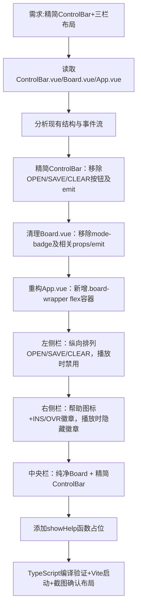

## 任务描述
重构 ControlBar 组件及全局布局，解决工具栏臃肿问题，实现左-中-右三栏分离式设计。

## 执行过程

## 任务总结
成功实现三栏分离布局：ControlBar仅保留KeySignature/SpeedControl/PlaybackControl/LOOP；Board成为无状态容器；App.vue通过flex布局将OPEN/SAVE/CLEAR置于左侧、help+INS/OVR置于右侧，所有事件emit机制和响应式状态保持不变。
