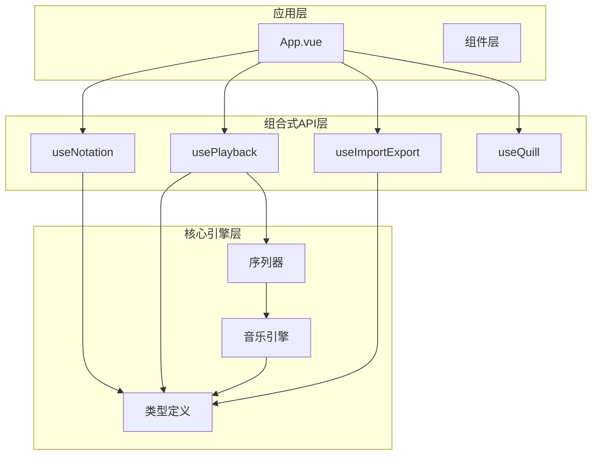
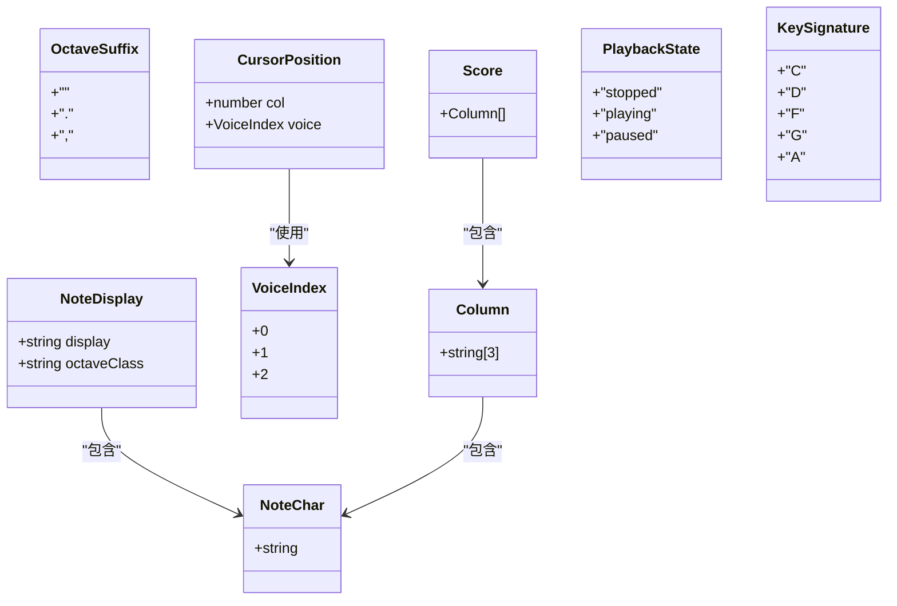
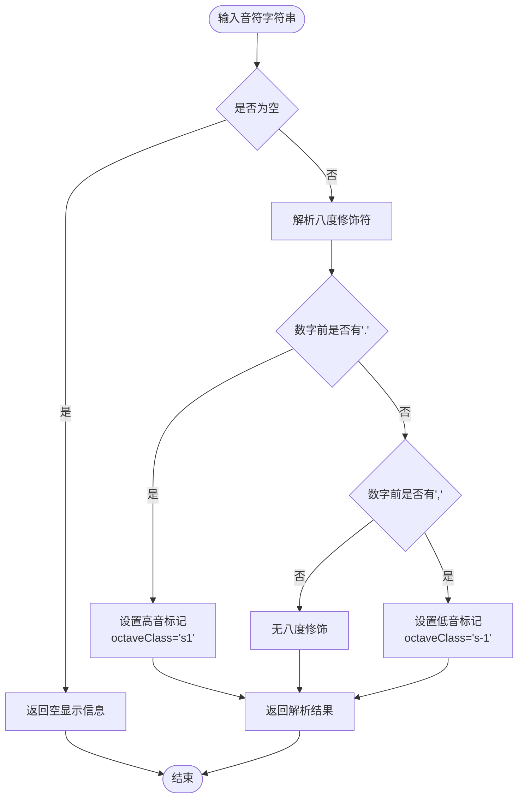
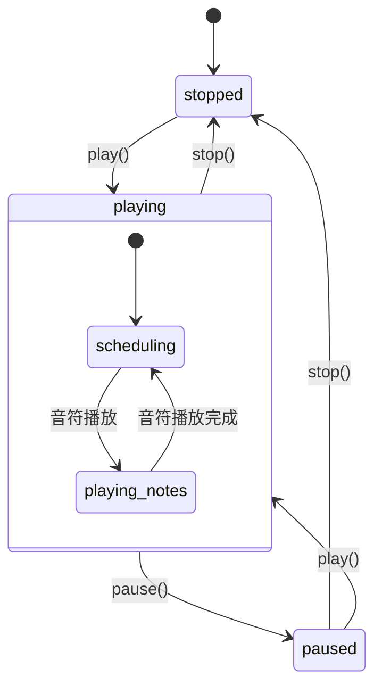
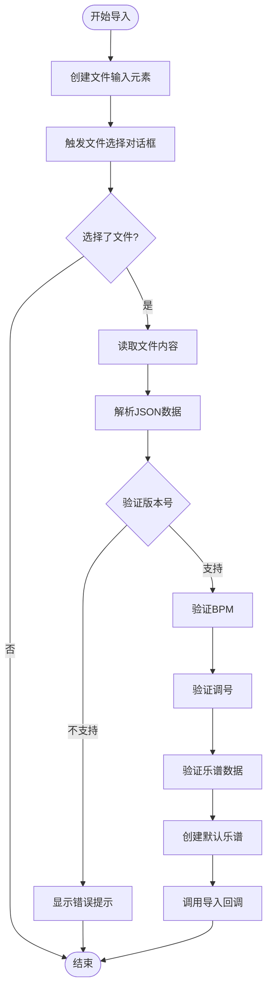
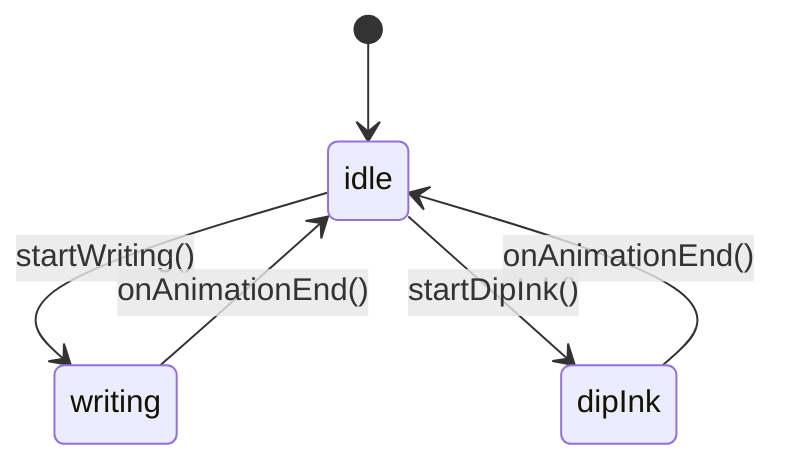
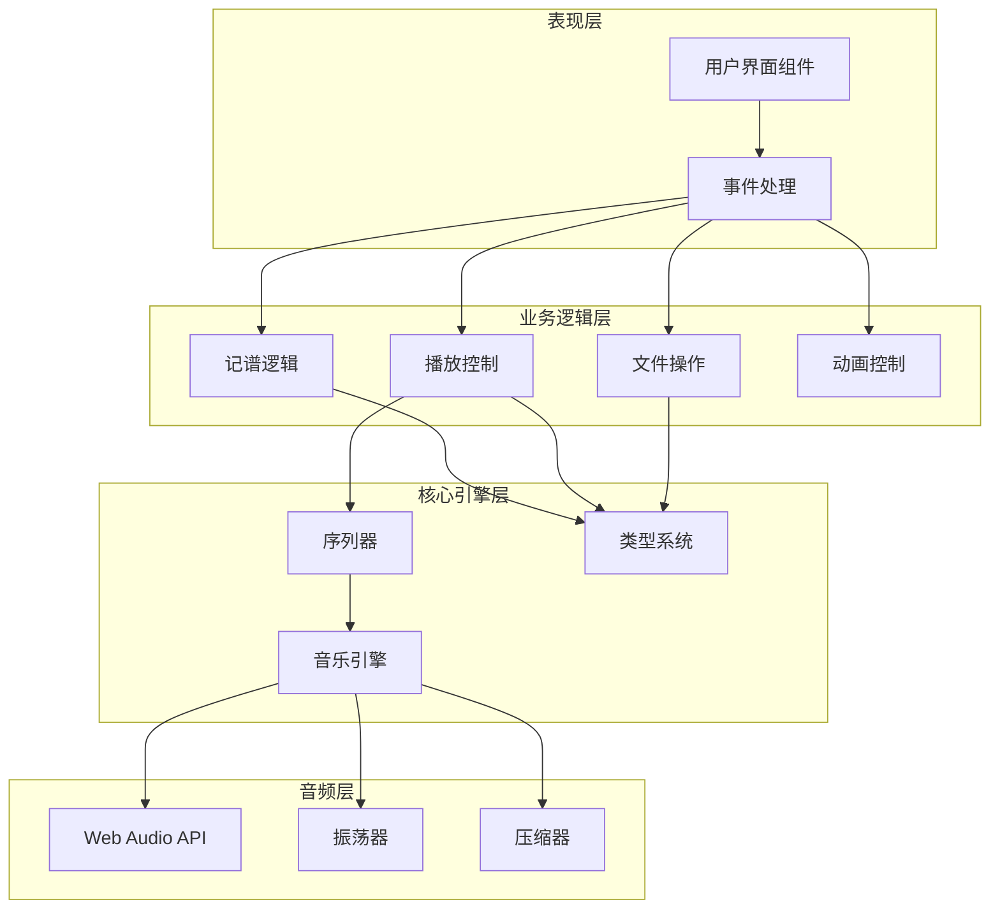
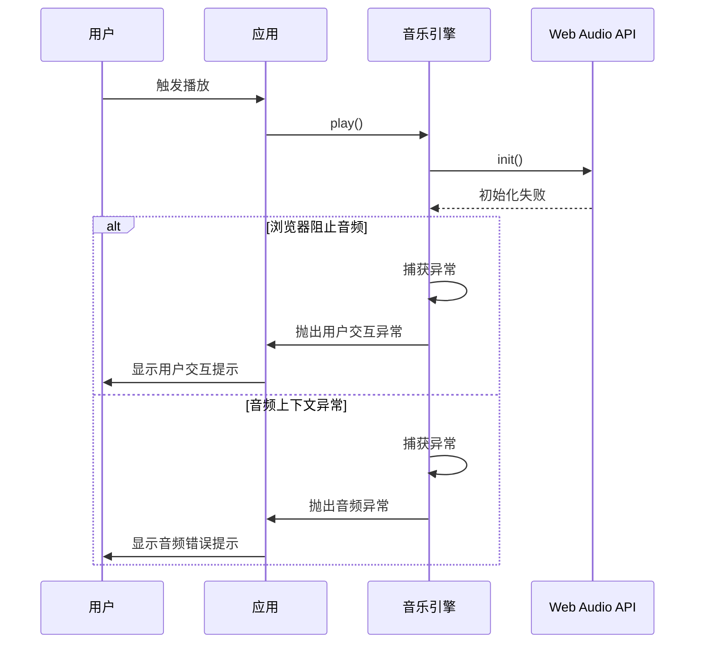

# API参考文档

<cite>
**本文档引用的文件**
- [useNotation.ts](file://src/composables/useNotation.ts)
- [usePlayback.ts](file://src/composables/usePlayback.ts)
- [useImportExport.ts](file://src/composables/useImportExport.ts)
- [types.ts](file://src/core/types.ts)
- [sequencer.ts](file://src/core/sequencer.ts)
- [music-engine.ts](file://src/core/music-engine.ts)
- [useQuill.ts](file://src/composables/useQuill.ts)
- [App.vue](file://src/App.vue)
- [README.md](file://README.md)
</cite>

## 目录
1. [简介](#简介)
2. [项目结构](#项目结构)
3. [核心类型定义](#核心类型定义)
4. [useNotation组合式函数](#usenotation组合式函数)
5. [usePlayback播放控制API](#useplayback播放控制api)
6. [useImportExport文件操作API](#useimportexport文件操作api)
7. [useQuill动画控制API](#usequill动画控制api)
8. [架构概览](#架构概览)
9. [最佳实践](#最佳实践)
10. [常见错误处理](#常见错误处理)
11. [结论](#结论)

## 简介

SUBOR Music Board是一个基于Vue 3和TypeScript构建的音乐记谱编辑器，提供了完整的音乐创作、编辑和播放功能。该系统采用组合式API设计，通过多个独立的组合式函数实现不同的功能模块，包括记谱编辑、播放控制、文件导入导出等。

## 项目结构

项目采用模块化的架构设计，主要分为以下几个核心模块：



**图表来源**
- [App.vue:1-138](file://src/App.vue#L1-L138)
- [useNotation.ts:1-116](file://src/composables/useNotation.ts#L1-L116)
- [usePlayback.ts:1-95](file://src/composables/usePlayback.ts#L1-L95)
- [useImportExport.ts:1-138](file://src/composables/useImportExport.ts#L1-L138)

**章节来源**
- [README.md:1-6](file://README.md#L1-L6)
- [App.vue:1-138](file://src/App.vue#L1-L138)

## 核心类型定义

### 基础类型

系统定义了完整的类型体系来确保类型安全：



**图表来源**
- [types.ts:1-164](file://src/core/types.ts#L1-L164)

### 音符解析系统

系统提供了完整的音符解析机制，支持升降号、八度修饰符等复杂记谱符号：



**图表来源**
- [types.ts:21-39](file://src/core/types.ts#L21-L39)

**章节来源**
- [types.ts:1-164](file://src/core/types.ts#L1-L164)

## useNotation组合式函数

useNotation是记谱编辑的核心组合式函数，提供了完整的乐谱编辑功能。

### 函数签名和返回值

```typescript
export function useNotation(columns?: number): {
  score: Readonly<Score>
  cursor: Readonly<CursorPosition>
  columns: number
  setNote: (col: number, voice: VoiceIndex, char: string) => void
  clearNote: (col: number, voice: VoiceIndex) => void
  insertNoteAt: (col: number, voice: VoiceIndex, char: string) => void
  backspaceAt: (col: number, voice: VoiceIndex) => boolean
  deleteAt: (col: number, voice: VoiceIndex) => void
  moveCursor: (col: number, voice: VoiceIndex) => void
  resetScore: () => void
  loadScore: (newScore: Score) => void
  ensureColumns: (minCols: number) => void
}
```

### 核心方法详解

#### setNote方法
- **功能**：设置指定位置的音符
- **参数**：
  - `col`: 列索引（0开始）
  - `voice`: 声部索引（0-2）
  - `char`: 音符字符（支持1-7、升降号、八度修饰符、空格）
- **返回值**：无
- **使用场景**：直接覆盖指定位置的音符

#### clearNote方法
- **功能**：清除指定位置的音符
- **参数**：同setNote
- **返回值**：无
- **使用场景**：清空音符位置

#### insertNoteAt方法
- **功能**：在指定位置插入音符
- **参数**：同setNote
- **返回值**：无
- **行为特点**：该位置及之后的同声部音符向右移动一位，末位丢弃

#### backspaceAt方法
- **功能**：删除模式，删除指定位置前一个音符
- **参数**：同setNote
- **返回值**：`boolean` - 是否成功执行
- **行为特点**：该位置及之后的同声部音符向左移动填补，末位补空格

#### deleteAt方法
- **功能**：删除指定位置的音符（不触发位移）
- **参数**：同setNote
- **返回值**：无
- **使用场景**：Delete键功能

#### moveCursor方法
- **功能**：移动光标位置
- **参数**：
  - `col`: 新列位置
  - `voice`: 新声部位置
- **返回值**：无

#### resetScore方法
- **功能**：重置整个乐谱为空白
- **返回值**：无

#### loadScore方法
- **功能**：加载新的乐谱数据
- **参数**：`newScore: Score` - 新的乐谱数据
- **返回值**：无
- **行为特点**：最多加载默认列数，不足部分用空白列填充

#### ensureColumns方法
- **功能**：确保乐谱至少拥有指定列数，不足部分用空白列补齐
- **参数**：`minCols: number` - 最小列数
- **返回值**：无
- **使用场景**：扩展乐谱长度

**章节来源**
- [useNotation.ts:15-116](file://src/composables/useNotation.ts#L15-L116)

## usePlayback播放控制API

usePlayback提供了完整的音乐播放控制功能，基于Web Audio API实现。

### 接口定义

```typescript
export interface UsePlaybackOptions {
  score: DeepReadonly<Score>
  bpm: Ref<number>
  keySignature: Ref<KeySignature>
}

export function usePlayback(options: UsePlaybackOptions): {
  state: Ref<PlaybackState>
  currentColumn: Ref<number>
  loop: Ref<boolean>
  play: () => Promise<void>
  pause: () => void
  stop: () => void
  togglePlayPause: () => Promise<void>
  seek: (col: number) => void
  toggleLoop: () => void
}
```

### 播放状态管理

系统采用三态播放状态模型：



**图表来源**
- [usePlayback.ts:17-77](file://src/composables/usePlayback.ts#L17-L77)

### 核心方法详解

#### play方法
- **功能**：开始播放音乐
- **参数**：无
- **返回值**：`Promise<void>`
- **异步特性**：需要等待音频引擎初始化

#### pause方法
- **功能**：暂停播放
- **参数**：无
- **返回值**：无

#### stop方法
- **功能**：停止播放并重置状态
- **参数**：无
- **返回值**：无

#### togglePlayPause方法
- **功能**：切换播放/暂停状态
- **参数**：无
- **返回值**：`Promise<void>`
- **行为特点**：根据当前状态自动判断

#### toggleLoop方法
- **功能**：切换循环播放状态
- **参数**：无
- **返回值**：无

### 配置选项

#### BPM控制
- **支持范围**：60-135 BPM（BPM_LIST=[60,75,90,105,120,135]共6档）
- **默认值**：90 BPM
- **实时更新**：播放中可动态调整

#### 调号控制
- **支持调号**：C、D、F、G、♭B
- **默认调号**：C
- **实时更新**：播放中可动态切换

**章节来源**
- [usePlayback.ts:5-95](file://src/composables/usePlayback.ts#L5-L95)

## useImportExport文件操作API

useImportExport提供了完整的文件导入导出功能，支持JSON格式的数据交换。

### 接口定义

```typescript
export interface UseImportExportOptions {
  bpm: number
  keySignature: KeySignature
  score: Score
  onImport: (data: { bpm: number; keySignature: KeySignature; score: Score }) => void
}

export function useImportExport(options: UseImportExportOptions): {
  exportScore: (title: string, description: string) => void
  importScore: () => void
}
```

### 导出功能

#### exportScore方法
- **功能**：将当前乐谱导出为JSON文件
- **参数**：
  - `title`: 文件标题
  - `description`: 文件描述（可选）
- **返回值**：无
- **文件格式**：`.subor.json`
- **导出内容**：
  - 版本号（固定为1.0）
  - 标题和描述
  - BPM设置
  - 调号设置
  - 乐谱数据

### 导入功能

#### importScore方法
- **功能**：从JSON文件导入乐谱
- **参数**：无
- **返回值**：无
- **文件要求**：`.json` 或 `.subor.json` 格式

### 数据验证机制

系统实现了严格的数据验证机制：



**图表来源**
- [useImportExport.ts:52-131](file://src/composables/useImportExport.ts#L52-L131)

**章节来源**
- [useImportExport.ts:1-138](file://src/composables/useImportExport.ts#L1-L138)

## useQuill动画控制API

useQuill提供了羽毛笔动画控制功能，用于增强用户体验。

### 接口定义

```typescript
export type QuillAnimation = 'idle' | 'writing' | 'dipInk'

export function useQuill(): {
  position: Reactive<{ x: number; y: number }>
  animation: Ref<QuillAnimation>
  moveTo: (el: HTMLElement) => void
  startWriting: () => void
  startDipInk: () => void
  onAnimationEnd: () => void
}
```

### 动画状态



**图表来源**
- [useQuill.ts:3-39](file://src/composables/useQuill.ts#L3-L39)

### 方法详解

#### moveTo方法
- **功能**：更新羽毛笔位置
- **参数**：`HTMLElement` - 目标元素
- **实现**：基于元素的getBoundingClientRect计算中心位置

#### startWriting方法
- **功能**：触发书写动画
- **参数**：无
- **返回值**：无

#### startDipInk方法
- **功能**：触发蘸墨动画
- **参数**：无
- **返回值**：无

#### onAnimationEnd方法
- **功能**：动画结束回调
- **参数**：无
- **返回值**：无

**章节来源**
- [useQuill.ts:1-39](file://src/composables/useQuill.ts#L1-L39)

## 架构概览

系统采用分层架构设计，各层职责明确：



**图表来源**
- [App.vue:1-138](file://src/App.vue#L1-L138)
- [sequencer.ts:21-354](file://src/core/sequencer.ts#L21-L354)
- [music-engine.ts:17-221](file://src/core/music-engine.ts#L17-L221)

**章节来源**
- [App.vue:1-138](file://src/App.vue#L1-L138)
- [sequencer.ts:1-354](file://src/core/sequencer.ts#L1-L354)
- [music-engine.ts:1-221](file://src/core/music-engine.ts#L1-L221)

## 最佳实践

### useNotation使用建议

1. **输入验证**：始终使用音符字符验证函数确保输入合法性
2. **批量操作**：对于大量数据操作，优先使用loadScore而不是逐个setNote
3. **性能优化**：避免频繁的DOM操作，合理使用readonly包装

### usePlayback使用建议

1. **状态同步**：确保bpm和keySignature的响应式绑定正确
2. **资源管理**：播放结束后及时调用stop释放资源
3. **错误处理**：捕获音频初始化异常，提供用户友好的错误提示

### useImportExport使用建议

1. **数据备份**：导入前先备份当前工作
2. **格式兼容**：严格遵循JSON格式规范
3. **错误恢复**：导入失败时提供回滚机制

### 性能优化建议

1. **懒加载**：音频引擎按需初始化
2. **内存管理**：及时清理定时器和事件监听器
3. **渲染优化**：使用Vue的响应式系统避免不必要的重渲染

## 常见错误处理

### 音频相关错误



**图表来源**
- [music-engine.ts:41-60](file://src/core/music-engine.ts#L41-L60)

### 文件导入错误

常见的导入错误类型：

1. **文件格式错误**：非JSON格式或格式不正确
2. **版本不兼容**：版本号不支持
3. **数据结构错误**：缺少必需字段或字段类型不正确
4. **数据内容错误**：音符字符无效或超出范围

### 状态管理错误

1. **播放状态冲突**：同时进行多个播放操作
2. **资源竞态**：播放中修改关键配置
3. **内存泄漏**：未正确清理定时器和监听器

**章节来源**
- [useImportExport.ts:72-76](file://src/composables/useImportExport.ts#L72-L76)
- [music-engine.ts:155-197](file://src/core/music-engine.ts#L155-L197)

## 结论

SUBOR Music Board提供了一套完整且类型安全的API体系，涵盖了音乐记谱编辑的各个方面。通过组合式函数的设计，开发者可以灵活地使用各个功能模块，同时保持代码的可维护性和可测试性。

系统的主要优势包括：
- **类型安全**：完整的TypeScript类型定义
- **模块化设计**：清晰的功能分离
- **性能优化**：基于Web Audio API的高效实现
- **易用性**：直观的API设计和丰富的错误处理

建议开发者在实际使用中遵循最佳实践，充分利用系统的类型系统和错误处理机制，以获得最佳的开发体验。