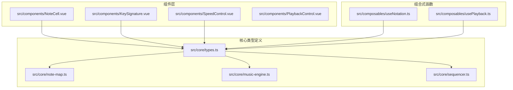
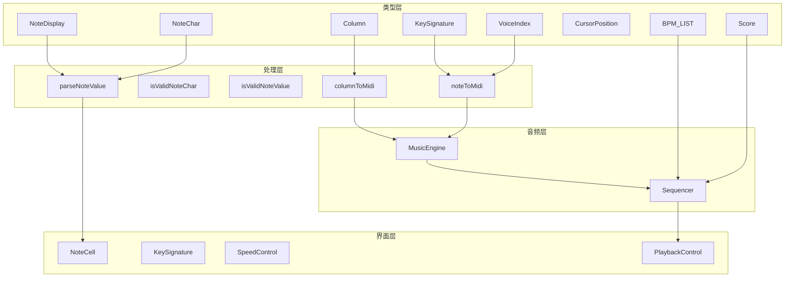
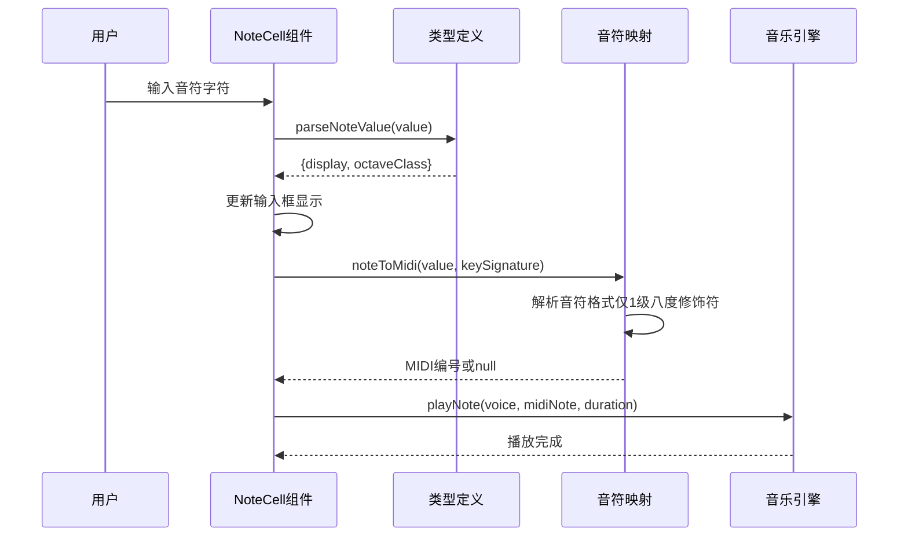
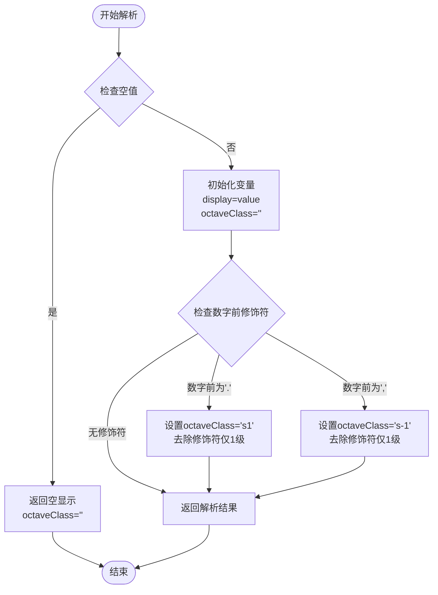
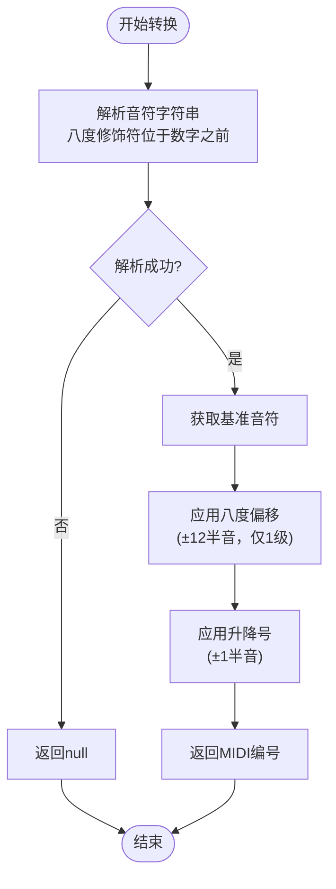
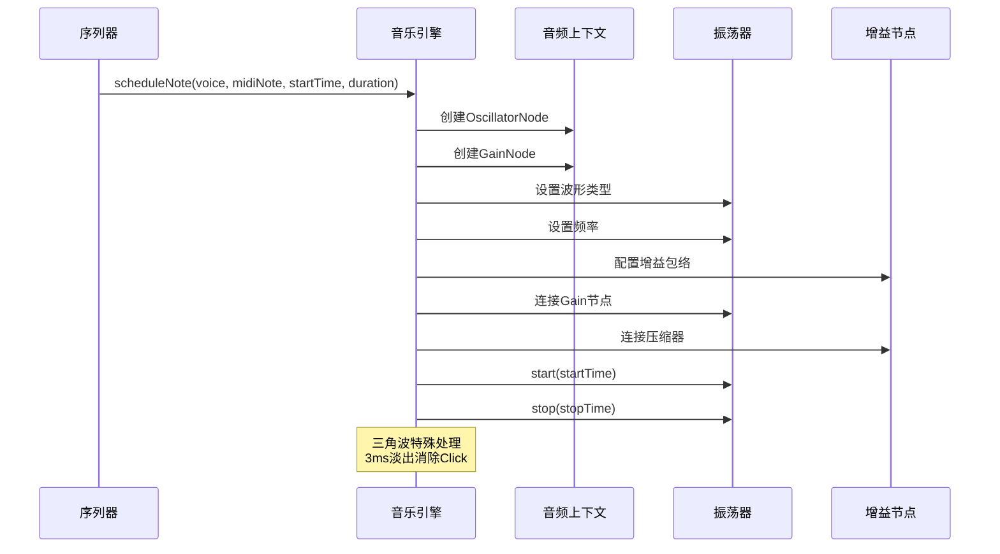
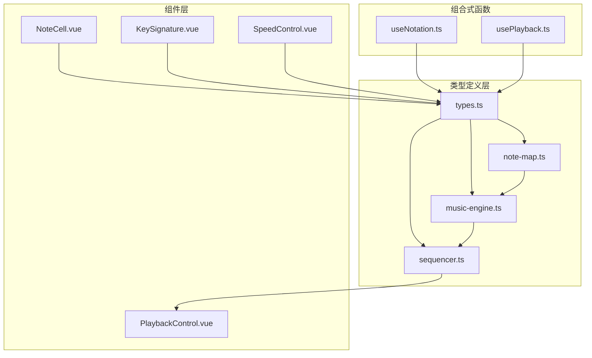

# 核心类型定义

<cite>
**本文引用的文件**
- [src/core/types.ts](file://src/core/types.ts)
- [src/core/note-map.ts](file://src/core/note-map.ts)
- [src/core/music-engine.ts](file://src/core/music-engine.ts)
- [src/core/sequencer.ts](file://src/core/sequencer.ts)
- [src/components/NoteCell.vue](file://src/components/NoteCell.vue)
- [src/components/KeySignature.vue](file://src/components/KeySignature.vue)
- [src/components/SpeedControl.vue](file://src/components/SpeedControl.vue)
- [src/composables/useNotation.ts](file://src/composables/useNotation.ts)
- [src/composables/usePlayback.ts](file://src/composables/usePlayback.ts)
</cite>

## 更新摘要
**变更内容**
- 更新OctaveSuffix类型定义，明确仅支持单级八度修饰符
- 更新八度修饰符解析逻辑说明，明确修饰符位于数字之前
- 更新音符验证函数的正则表达式说明
- 更新八度修饰符处理的限制条件
- 移除InputMode输入模式类型，补充migrateNoteValue迁移函数说明

## 目录
1. [简介](#简介)
2. [项目结构](#项目结构)
3. [核心类型](#核心类型)
4. [架构概览](#架构概览)
5. [详细组件分析](#详细组件分析)
6. [依赖关系分析](#依赖关系分析)
7. [性能考虑](#性能考虑)
8. [故障排除指南](#故障排除指南)
9. [结论](#结论)

## 简介

本文档详细记录了 SUBOR Music Board 项目的核心类型定义和相关功能。该系统是一个基于 Web Audio API 的简谱音乐创作工具，支持三个声部的独立编辑和播放。文档重点涵盖了以下核心概念：

- 基础类型定义：NoteChar、VoiceIndex、Score、Column、CursorPosition 等
- 音符显示接口 NoteDisplay 和解析函数 parseNoteValue
- 音符字符验证函数 isValidNoteChar 和 isValidNoteValue 及旧格式迁移函数 migrateNoteValue
- 声部配置 VOICES 数组和八度修饰符系统
- BPM 速度档位和调号 KeySignature 的完整定义
- 类型使用示例和最佳实践指导

**更新** 本版本反映了OctaveSuffix类型的简化：从支持双重升号/降号（..和,,）简化为基本单修饰符（.和,），体现了代码库的简化和性能优化。

## 项目结构

该项目采用模块化的架构设计，核心类型定义集中在 `src/core/types.ts` 文件中，配合相应的处理模块实现完整的音乐创作功能。



**图表来源**
- [src/core/types.ts:1-164](file://src/core/types.ts#L1-L164)
- [src/core/note-map.ts:1-119](file://src/core/note-map.ts#L1-L119)
- [src/core/music-engine.ts:1-221](file://src/core/music-engine.ts#L1-L221)
- [src/core/sequencer.ts:1-354](file://src/core/sequencer.ts#L1-L354)

**章节来源**
- [src/core/types.ts:1-164](file://src/core/types.ts#L1-L164)
- [src/core/note-map.ts:1-119](file://src/core/note-map.ts#L1-L119)
- [src/core/music-engine.ts:1-221](file://src/core/music-engine.ts#L1-L221)
- [src/core/sequencer.ts:1-354](file://src/core/sequencer.ts#L1-L354)

## 核心类型

### 基础类型定义

#### NoteChar（音符字符）
- **类型定义**：`string`
- **用途**：表示单个音符字符的基本类型
- **特点**：作为字符串类型的基础封装，用于后续的类型约束和验证

#### OctaveSuffix（八度修饰符）
- **类型定义**：`'' | '.' | ','`
- **用途**：表示音符的八度修饰符
- **含义**：
  - 空字符串：无八度修饰
  - `.`：高八度（上加点）
  - `,`：低八度（下加点）
- **位置**：八度修饰符位于数字之前（如`.1`为高音do、`,1`为低音do）
- **限制**：仅支持一级八度修饰，不支持双重修饰符（如`..`或`,,`）

**更新** OctaveSuffix类型已简化，不再支持双重升号/降号修饰符，仅保留基本的单级修饰符。

#### VoiceIndex（声部索引）
- **类型定义**：`0 | 1 | 2`
- **用途**：标识三个声部的索引位置
- **声部映射**：
  - 0：主旋律（方波）
  - 1：和弦律（方波）
  - 2：低频（三角波）

#### Column（单列数据）
- **类型定义**：`[string, string, string]`
- **用途**：表示单列中三个声部的音符数据
- **结构**：按 VoiceIndex 顺序排列，分别对应主旋律、和弦律、低频

#### Score（乐谱数据）
- **类型定义**：`Column[]`
- **用途**：表示完整的乐谱数据结构
- **特点**：由多个 Column 组成的数组

#### CursorPosition（光标位置）
- **类型定义**：`{ col: number; voice: VoiceIndex }`
- **用途**：表示当前编辑状态下的光标位置
- **属性**：
  - `col`：列索引
  - `voice`：声部索引

#### PlaybackState（播放状态）
- **类型定义**：`'stopped' | 'playing' | 'paused'`
- **用途**：表示音乐播放器的当前状态

#### RepeatMode（重复模式）
- **类型定义**：`type RepeatMode = false`
- **状态**：残留类型，当前未使用（循环播放由 loop 布尔状态承担）

**章节来源**
- [src/core/types.ts:1-76](file://src/core/types.ts#L1-L76)

### NoteDisplay 接口

NoteDisplay 接口用于描述音符的显示信息，包含两个关键属性：

- **display**：在输入框中实际显示的内容
- **octaveClass**：对应的八度 CSS 类名

解析逻辑遵循以下规则：
1. 空字符串或空格表示休止符，返回空显示
2. 从字符串中解析八度修饰符（位于数字之前，仅支持1级修饰符）
3. 支持的八度修饰符：`.`（高音）和 `,`（低音）
4. 返回去除八度修饰符的显示内容和对应的 CSS 类

**更新** 八度修饰符解析现在严格限制为单级修饰符，不支持双重修饰符，且修饰符位于数字之前。

**章节来源**
- [src/core/types.ts:7-39](file://src/core/types.ts#L7-L39)

### 验证函数

#### isValidNoteChar（字符验证）
- **用途**：验证单个按键字符是否为合法的记谱输入
- **正则**：`NOTE_CHAR_REGEX = /^[1-7#b.,\- ]$/`
- **支持字符**：`1-7`（数字）、`#`（升号）、`b`（降号）、`.`（高音点）、`,`（低音点）、`-`（延音线）、空格
- **使用场景**：实时输入验证，确保用户只能输入有效的音符字符

#### isValidNoteValue（完整值验证）
- **用途**：验证完整的音符字符串是否符合规范
- **正则**：`/^[#b]?[\.,]?[1-7]$/`
- **格式要求**：`[升降号#|b]?[八度修饰符.|,]?[1-7]`（八度修饰符位于数字之前）| 空格 | 空串
- **示例**：`"1"`、`".1"`、`",1"`、`"#.1"`、`"b,3"`
- **特殊值**：空字符串和空格表示休止符
- **限制**：仅支持单级八度修饰符，不支持双重修饰符

#### migrateNoteValue（旧格式迁移）
- **用途**：将旧版记谱格式（数字在前，如`"1."`、`"1,"`）迁移为现行格式（升降号+八度修饰符+数字，如`"#.1"`、`"b,3"`）
- **匹配规则**：`/^(#|b)?([1-7])([.,])?$/`，命中后重排为修饰符+八度+数字
- **幂等性**：已符合现行格式的值原样返回，可重复调用
- **使用场景**：导入乐谱时自动迁移旧数据

**更新** 验证函数现在明确支持单级八度修饰符，双重修饰符（如`..`或`,,`）将被视为无效。

**章节来源**
- [src/core/types.ts:77-96](file://src/core/types.ts#L77-L96)

### 声部配置

#### VOICES 数组
定义了三个声部的元信息配置：

| 索引 | 标签 | 波形类型 | 用途 |
|------|------|----------|------|
| 0 | 主旋律 | square | 方波主旋律 |
| 1 | 和弦律 | square | 方波和弦律 |
| 2 | 低频 | triangle | 三角波低频 |

每个声部包含：
- `index`：声部索引（0-2）
- `label`：声部标签名称
- `wave`：波形类型（square 或 triangle）

**章节来源**
- [src/core/types.ts:49-54](file://src/core/types.ts#L49-L54)

### BPM 速度档位

#### BPM_LIST（速度列表）
定义了预设的速度档位，单位为 BPM（每分钟节拍数）：

| 档位 | BPM | 说明 |
|------|-----|------|
| 0 | 60 | 最慢 |
| 1 | 75 | 慢速 |
| 2 | 90 | 默认速度 |
| 3 | 105 | 中等 |
| 4 | 120 | 偏快 |
| 5 | 135 | 最快 |

#### DEFAULT_BPM（默认速度）
- **值**：90 BPM
- **用途**：应用初始化时的默认播放速度
- **每格时长**：每格为八分音符，时长 = 30/BPM 秒（60→0.500s、75→0.400s、90→0.333s、105→0.286s、120→0.250s、135→0.222s）

**章节来源**
- [src/core/types.ts:113-116](file://src/core/types.ts#L113-L116)

### 调号 KeySignature

#### KeySignature 类型
定义了可用的调号类型：

```typescript
export type KeySignature = 'C' | 'D' | 'F' | 'G' | 'A'
```

#### KEY_SIGNATURES 数组
包含5个常用调号的有序列表，前后切换在首尾禁用（非循环）。

#### DEFAULT_KEY_SIGNATURE（默认调号）
- **值**：`'C'`
- **说明**：C 大调作为默认调号

#### 调号映射表
每个调号对应简谱 1-7 在 MIDI 编号上的具体映射：

| 调号 | 1 | 2 | 3 | 4 | 5 | 6 | 7 |
|------|---|---|---|---|---|---|---|
| C 大调 | C | D | E | F | G | A | B |
| D 大调 | D | E | F# | G | A | B | C# |
| F 大调 | F | G | A | Bb | C | D | E |
| G 大调 | G | A | B | C | D | E | F# |
| ♭B 大调 | B♭ | C | D | E♭ | F | G | A |

**章节来源**
- [src/core/types.ts:132-138](file://src/core/types.ts#L132-L138)
- [src/core/note-map.ts:10-27](file://src/core/note-map.ts#L10-L27)

## 架构概览

系统采用分层架构设计，核心类型定义位于底层，提供类型安全的抽象，上层组件和组合式函数基于这些类型构建业务逻辑。



**图表来源**
- [src/core/types.ts:1-164](file://src/core/types.ts#L1-L164)
- [src/core/note-map.ts:1-119](file://src/core/note-map.ts#L1-L119)
- [src/core/music-engine.ts:1-221](file://src/core/music-engine.ts#L1-L221)
- [src/core/sequencer.ts:1-354](file://src/core/sequencer.ts#L1-L354)

## 详细组件分析

### NoteCell 组件集成

NoteCell 组件展示了核心类型的实际使用方式：



**图表来源**
- [src/components/NoteCell.vue:1-47](file://src/components/NoteCell.vue#L1-L47)
- [src/core/types.ts:21-39](file://src/core/types.ts#L21-L39)
- [src/core/note-map.ts:83-100](file://src/core/note-map.ts#L83-L100)
- [src/core/music-engine.ts:69-75](file://src/core/music-engine.ts#L69-L75)

### 音符解析流程

音符解析优先处理位于数字之前的八度修饰符：



**更新** 八度修饰符解析现在严格限制为单级修饰符（位于数字之前），不支持双重修饰符。

**图表来源**
- [src/core/types.ts:21-39](file://src/core/types.ts#L21-L39)

**章节来源**
- [src/components/NoteCell.vue:28-46](file://src/components/NoteCell.vue#L28-L46)

### 音符到MIDI转换

音符到MIDI编号的转换过程：



**更新** 音符转换现在严格遵循单级八度修饰符规则，双重修饰符将被拒绝。

**图表来源**
- [src/core/note-map.ts:35-100](file://src/core/note-map.ts#L35-L100)

**章节来源**
- [src/core/note-map.ts:83-100](file://src/core/note-map.ts#L83-L100)

### 音乐引擎播放机制

音乐引擎采用预调度模式，确保播放的精确性和一致性：



**图表来源**
- [src/core/music-engine.ts:90-150](file://src/core/music-engine.ts#L90-L150)

**章节来源**
- [src/core/music-engine.ts:17-221](file://src/core/music-engine.ts#L17-L221)

## 依赖关系分析

核心类型之间的依赖关系体现了清晰的分层设计：



**图表来源**
- [src/core/types.ts:1-164](file://src/core/types.ts#L1-L164)
- [src/core/note-map.ts:1-119](file://src/core/note-map.ts#L1-L119)
- [src/core/music-engine.ts:1-221](file://src/core/music-engine.ts#L1-L221)
- [src/core/sequencer.ts:1-354](file://src/core/sequencer.ts#L1-L354)

**章节来源**
- [src/core/types.ts:1-164](file://src/core/types.ts#L1-L164)
- [src/core/note-map.ts:1-119](file://src/core/note-map.ts#L1-L119)
- [src/core/music-engine.ts:1-221](file://src/core/music-engine.ts#L1-L221)
- [src/core/sequencer.ts:1-354](file://src/core/sequencer.ts#L1-L354)

## 性能考虑

### 预调度播放模式
系统采用预调度模式，一次性计算所有音符的播放时间，避免了实时计算的开销。这种设计确保了播放的精确性和流畅性。

### 内存管理
- 音符播放完成后自动清理，避免内存泄漏
- 支持选择性停止特定时间点之后的音符
- 实现了活跃振荡器的追踪和管理

### 验证优化
- 字符级验证使用预编译的正则表达式
- 完整值验证采用高效的字符串匹配
- 避免重复计算，提高输入响应速度

**更新** OctaveSuffix类型的简化进一步优化了验证性能，减少了双重修饰符的处理复杂度。

## 故障排除指南

### 常见问题及解决方案

#### 音符显示异常
**症状**：输入音符后显示不正确
**可能原因**：
- 八度修饰符解析错误
- 升降号处理不当
- 空格字符识别问题

**解决方法**：
1. 检查输入字符是否在支持范围内
2. 确认八度修饰符位于数字之前（仅支持单级修饰符）
3. 验证音符格式符合规范

#### 播放无声
**症状**：点击播放按钮无声音
**可能原因**：
- 音频上下文未初始化
- 浏览器音频权限问题
- 音符为休止符（空格）

**解决方法**：
1. 确保用户交互后初始化音频上下文
2. 检查浏览器音频权限设置
3. 验证音符不是空格字符

#### BPM 调整失效
**症状**：调整速度后播放不变
**可能原因**：
- 播放状态为暂停或停止
- 重新调度过程中发生竞态

**解决方法**：
1. 确保播放状态为 playing
2. 避免快速连续调整
3. 等待重新调度完成

#### 八度修饰符无效
**症状**：输入双重八度修饰符（如`..`或`,,`）无效
**可能原因**：
- OctaveSuffix类型已简化，不支持双重修饰符
- 输入格式不符合单级修饰符规则

**解决方法**：
1. 使用单个八度修饰符：`.`（高音）或`,`（低音）
2. 避免使用双重修饰符组合
3. 验证音符格式符合`[升降号?][八度修饰符?][1-7]`规则

**章节来源**
- [src/core/music-engine.ts:41-60](file://src/core/music-engine.ts#L41-L60)
- [src/core/sequencer.ts:84-115](file://src/core/sequencer.ts#L84-L115)

## 结论

SUBOR Music Board 的核心类型定义展现了良好的软件工程实践：

1. **类型安全**：通过严格的类型定义确保代码的正确性和可维护性
2. **模块化设计**：清晰的分层架构便于功能扩展和测试
3. **性能优化**：预调度播放模式和高效的验证机制
4. **用户体验**：直观的界面设计和流畅的交互体验

**更新** 最新的OctaveSuffix类型简化进一步提升了系统的性能和易用性。通过移除双重升号/降号（..和,,）的支持，代码库变得更加简洁高效，同时保持了核心的八度修饰功能。这种简化反映了现代音乐创作工具的发展趋势，专注于提供最常用的功能而避免过度复杂化。

这些核心类型为整个音乐创作系统提供了坚实的基础，支持从简单的音符输入到复杂的多声部编曲创作。通过合理使用这些类型和相关函数，开发者可以构建更加健壮和易用的音乐创作工具。