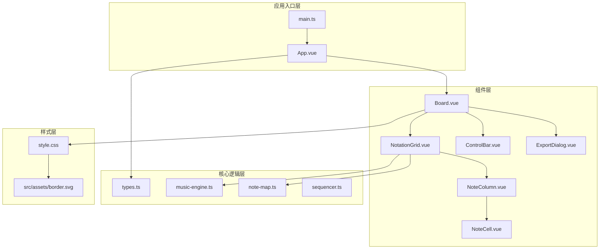
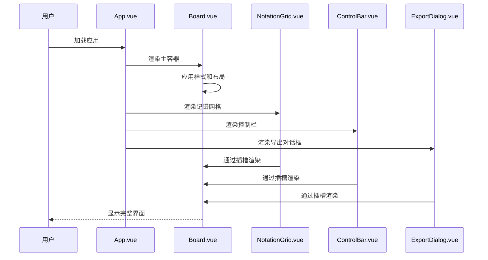
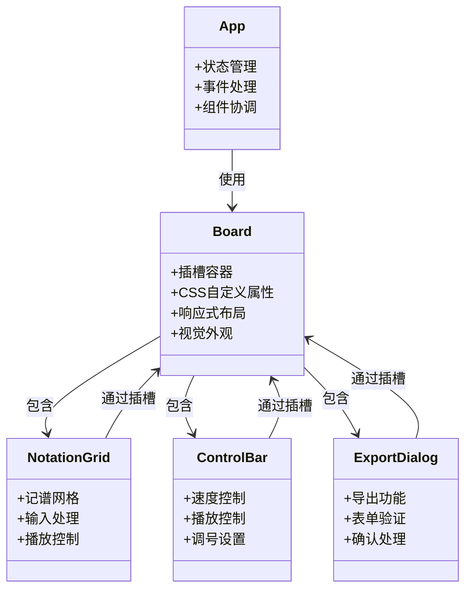
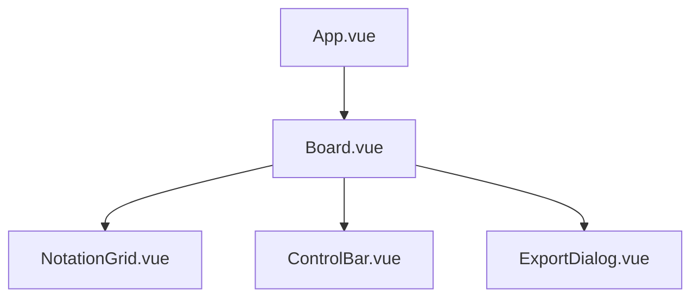
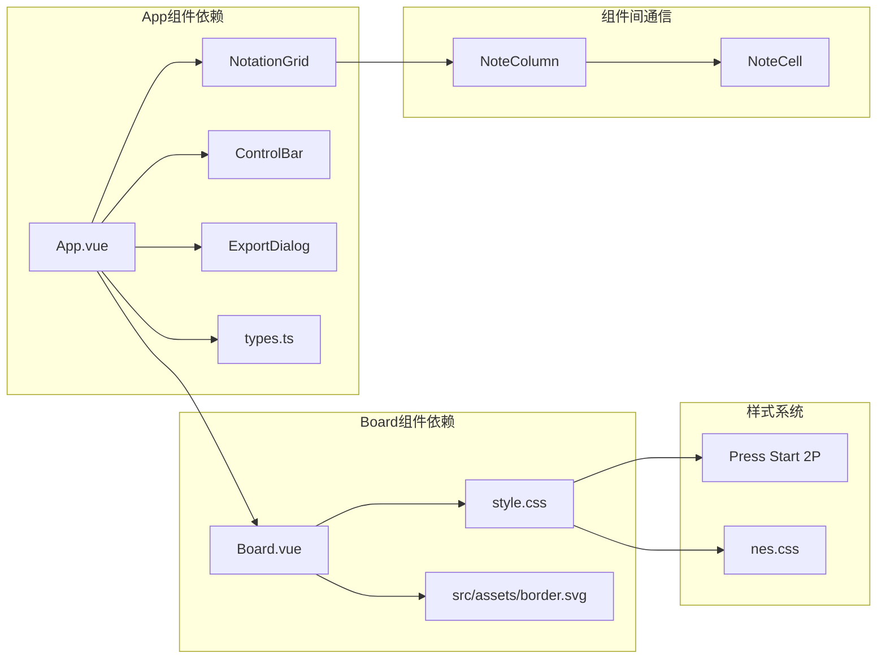

# Board组件接口

<cite>
**本文档引用的文件**
- [Board.vue](file://src/components/Board.vue)
- [App.vue](file://src/App.vue)
- [NotationGrid.vue](file://src/components/NotationGrid.vue)
- [ControlBar.vue](file://src/components/ControlBar.vue)
- [ExportDialog.vue](file://src/components/ExportDialog.vue)
- [NoteColumn.vue](file://src/components/NoteColumn.vue)
- [NoteCell.vue](file://src/components/NoteCell.vue)
- [types.ts](file://src/core/types.ts)
- [style.css](file://src/style.css)
- [main.ts](file://src/main.ts)
- [package.json](file://package.json)
</cite>

## 目录
1. [简介](#简介)
2. [项目结构](#项目结构)
3. [核心组件](#核心组件)
4. [架构概览](#架构概览)
5. [详细组件分析](#详细组件分析)
6. [依赖关系分析](#依赖关系分析)
7. [性能考虑](#性能考虑)
8. [故障排除指南](#故障排除指南)
9. [结论](#结论)

## 简介

Board组件是SUBOR音乐记谱板应用的主容器组件，采用Vue 3 Composition API和TypeScript实现。该组件作为插槽容器，为整个音乐编辑界面提供统一的视觉外观和布局结构。Board组件通过CSS自定义属性实现了高度可定制的边框样式，并提供了响应式的布局设计。

该组件在整个应用架构中扮演着核心角色，作为所有功能组件的容器，确保了视觉风格的一致性和用户体验的连贯性。Board组件的设计充分体现了复古电子游戏美学，通过NES.css框架和Press Start 2P字体营造了独特的视觉体验。

## 项目结构

SUBOR音乐记谱板项目采用模块化架构设计，主要分为以下几个层次：

**图表来源**
- [main.ts:1-8](file://src/main.ts#L1-L8)
- [App.vue:1-138](file://src/App.vue#L1-L138)
- [Board.vue:1-47](file://src/components/Board.vue#L1-L47)

**章节来源**
- [main.ts:1-8](file://src/main.ts#L1-L8)
- [package.json:1-25](file://package.json#L1-L25)

## 核心组件

### Board组件概述

Board组件是一个轻量级的容器组件，主要负责：
- 提供统一的视觉外观和边框样式
- 作为插槽容器承载其他功能组件
- 实现响应式布局和滚动处理
- 定义CSS自定义属性用于主题定制

### 接口定义

Board组件采用Vue 3的Composition API和TypeScript，具有以下接口特征：

**模板结构**
- 主容器：`.board` - 设置整体布局和边框
- 标题区域：`.board-title` - 显示组件标题
- 主要内容区：`.board-main` - 承载插槽内容

**CSS类名系统**
- `.board` - 主容器，包含边框、阴影和背景样式
- `.board-title` - 标题样式，带有装饰性边框
- `.board-main` - 主要内容区域，支持滚动和自适应布局

**CSS自定义属性**
- `--width-outer-border` - 控制外边框宽度，默认50px
- 通过CSS变量实现动态尺寸调整

**章节来源**
- [Board.vue:1-47](file://src/components/Board.vue#L1-L47)

## 架构概览

Board组件在整个应用架构中处于核心地位，连接着用户界面层和业务逻辑层：

**图表来源**
- [App.vue:102-138](file://src/App.vue#L102-L138)
- [Board.vue:3-10](file://src/components/Board.vue#L3-L10)

### 组件关系图

**图表来源**
- [Board.vue:1-47](file://src/components/Board.vue#L1-L47)
- [App.vue:1-138](file://src/App.vue#L1-L138)

## 详细组件分析

### Board组件详细分析

#### 视觉外观设计

Board组件采用了独特的视觉设计语言，融合了复古电子游戏美学：

**边框系统**
- 使用CSS `border-image` 属性实现自定义边框
- 边框图像来自 `src/assets/border.svg`
- 边框宽度为17px，通过CSS变量控制
- 外层阴影效果营造立体感

**色彩方案**
- 主色调：深色背景(#000)，白色文字(#fff)
- 强调色：蓝色(#36c)用于标题边框，红色(#c33)用于外层阴影
- 装饰性颜色：青色(#9fc)和橙色(#fc9)用于不同状态

**字体系统**
- 使用Press Start 2P字体族，营造像素风格
- 字体大小根据CSS变量动态调整

#### 布局结构分析

Board组件实现了灵活的布局系统：

**容器布局**
- 使用Flexbox实现垂直布局
- 主容器高度为视口高度减去外边框尺寸
- 宽度固定为36em，保持良好的可读性

**内容区域**
- `.board-main` 区域支持滚动
- 使用 `scrollbar-gutter: stable both-edges` 确保滚动条不占用空间
- `min-height: 0` 允许flex项目正确收缩

**响应式特性**
- 固定宽度设计，适合桌面端使用
- 自动居中布局，最大宽度适配
- 通过CSS变量实现主题定制

#### 样式变量系统

Board组件定义了完整的CSS自定义属性系统：

**核心变量**
- `--width-outer-border`: 控制外边框宽度
- 通过 `calc(100vh - 2 * var(--width-outer-border))` 动态计算高度

**使用场景**
- 动态边框尺寸调整
- 响应式布局适配
- 主题定制支持

**章节来源**
- [Board.vue:12-47](file://src/components/Board.vue#L12-L47)

### 与其他组件的关系

#### 在App.vue中的集成

Board组件在应用根组件中发挥着核心作用：

**组件嵌套结构**

**数据流管理**
- App组件通过props向下传递状态
- 通过事件向上接收用户操作
- 实现组件间的松耦合通信

**功能职责分离**
- Board：提供容器和样式
- NotationGrid：处理记谱输入和显示
- ControlBar：管理播放和配置
- ExportDialog：处理导入导出

#### 与核心类型的关联

Board组件与应用的核心类型定义紧密相关：

**类型系统**
- 通过 `types.ts` 定义的类型约束组件行为
- 支持强类型检查和IDE智能提示
- 确保组件间的数据一致性

**配置管理**
- 通过 `DEFAULT_BPM` 和 `DEFAULT_KEY_SIGNATURE` 提供默认配置
- 支持运行时配置修改
- 实现配置的集中管理

**章节来源**
- [App.vue:1-138](file://src/App.vue#L1-L138)
- [types.ts:1-164](file://src/core/types.ts#L1-L164)

### 插槽容器功能

Board组件作为插槽容器，提供了灵活的内容承载能力：

**插槽使用模式**
- 单插槽设计，简化内容组织
- 支持任意Vue组件作为插槽内容
- 保持Board组件的样式独立性

**内容组织策略**
- NotationGrid负责主要的记谱编辑功能
- ControlBar提供工具栏和控制面板
- ExportDialog处理导入导出对话框

**布局适配**
- 插槽内容自动适应Board的布局规则
- 支持滚动内容的无缝集成
- 保持整体视觉风格的一致性

**章节来源**
- [Board.vue:3-10](file://src/components/Board.vue#L3-L10)
- [App.vue:102-138](file://src/App.vue#L102-L138)

## 依赖关系分析

### 外部依赖

项目使用了现代化的前端技术栈：

**核心依赖**
- Vue 3: 响应式框架，提供组件系统和组合式API
- TypeScript: 类型安全，提升开发体验
- Vite: 构建工具，提供快速开发服务器

**样式依赖**
- nes.css: 复古游戏风格CSS框架
- @fontsource/press-start-2p: Pixel字体源

**构建配置**
- 开发服务器：热重载，快速迭代
- 类型检查：编译时错误检测
- 生产构建：优化打包和压缩

### 内部依赖关系

**图表来源**
- [main.ts:1-8](file://src/main.ts#L1-L8)
- [package.json:11-23](file://package.json#L11-L23)

### 组件耦合度分析

Board组件与其他组件的耦合度设计合理：

**低耦合设计**
- Board组件与具体功能组件解耦
- 通过插槽机制实现内容承载
- 保持组件职责单一

**接口契约**
- 明确的props和emits定义
- 类型安全的事件通信
- 稳定的API接口

**可维护性**
- 组件边界清晰
- 修改影响范围有限
- 测试友好

**章节来源**
- [package.json:11-23](file://package.json#L11-L23)
- [main.ts:1-8](file://src/main.ts#L1-L8)

## 性能考虑

### 样式性能优化

Board组件在样式设计上考虑了性能因素：

**CSS变量优化**
- 使用CSS自定义属性减少重复样式定义
- 动态属性值避免重排重绘
- 减少样式的冗余定义

**布局性能**
- Flexbox布局现代且高效
- 避免复杂的嵌套选择器
- 使用transform和opacity进行动画

**资源优化**
- SVG边框图像内联或缓存
- 字体预加载优化首屏显示
- CSS框架按需引入

### 运行时性能

**组件渲染**
- Board组件结构简单，渲染开销低
- 插槽内容按需渲染
- 避免不必要的重新渲染

**内存管理**
- 合理的生命周期管理
- 及时清理事件监听器
- 避免内存泄漏

## 故障排除指南

### 常见问题及解决方案

**样式问题**
- 边框显示异常：检查 `border.svg` 文件路径和访问权限
- 字体加载失败：确认 `@fontsource/press-start-2p` 依赖安装
- 颜色不匹配：检查CSS变量值和主题设置

**布局问题**
- 内容溢出：检查 `.board-main` 的overflow属性
- 响应式失效：确认CSS媒体查询和视口设置
- 滚动条遮挡：检查 `scrollbar-gutter` 属性支持

**功能问题**
- 插槽内容不显示：确认插槽语法和组件注册
- 样式冲突：检查CSS优先级和作用域
- 性能问题：分析组件树和渲染性能

### 调试建议

**开发工具**
- 使用Vue DevTools检查组件层级
- 利用浏览器开发者工具分析样式
- 监控网络请求和资源加载

**测试策略**
- 单元测试覆盖核心逻辑
- 集成测试验证组件交互
- 端到端测试模拟用户流程

**章节来源**
- [Board.vue:12-47](file://src/components/Board.vue#L12-L47)
- [style.css:1-30](file://src/style.css#L1-L30)

## 结论

Board组件作为SUBOR音乐记谱板应用的核心容器，成功地实现了以下目标：

**设计成就**
- 创建了统一且具有辨识度的视觉风格
- 实现了灵活的插槽容器架构
- 提供了良好的响应式布局支持

**技术优势**
- 基于Vue 3和TypeScript的现代技术栈
- 清晰的组件职责划分和接口定义
- 完善的类型系统和错误预防机制

**用户体验**
- 复古电子游戏美学的完美体现
- 直观的布局和一致的视觉语言
- 高效的交互和流畅的动画效果

Board组件不仅满足了当前的功能需求，还为未来的功能扩展奠定了坚实的基础。其模块化的架构设计使得添加新功能变得相对简单，同时保持了系统的整体稳定性和可维护性。

通过合理的依赖管理和性能优化，Board组件为整个应用提供了可靠的基础设施，确保了用户能够享受到流畅、直观的音乐记谱体验。