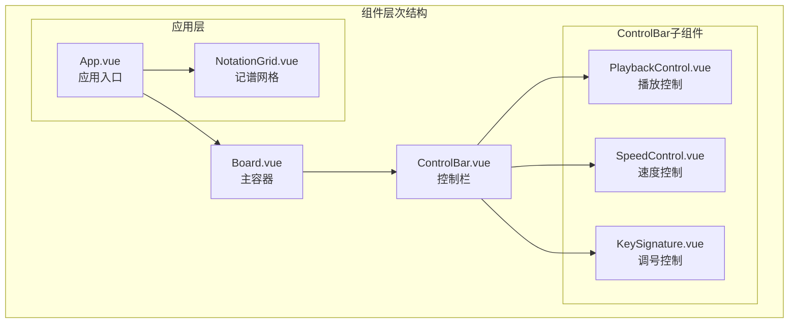
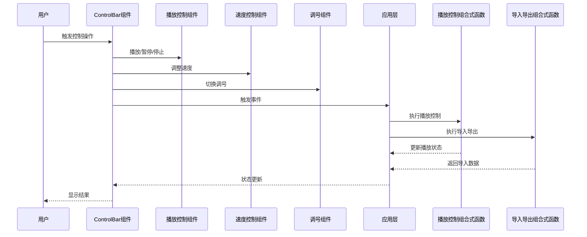
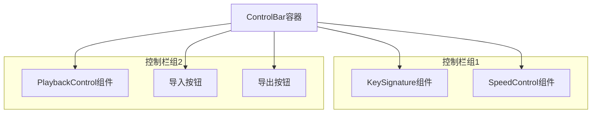
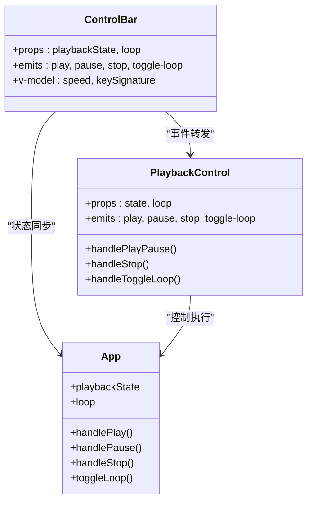
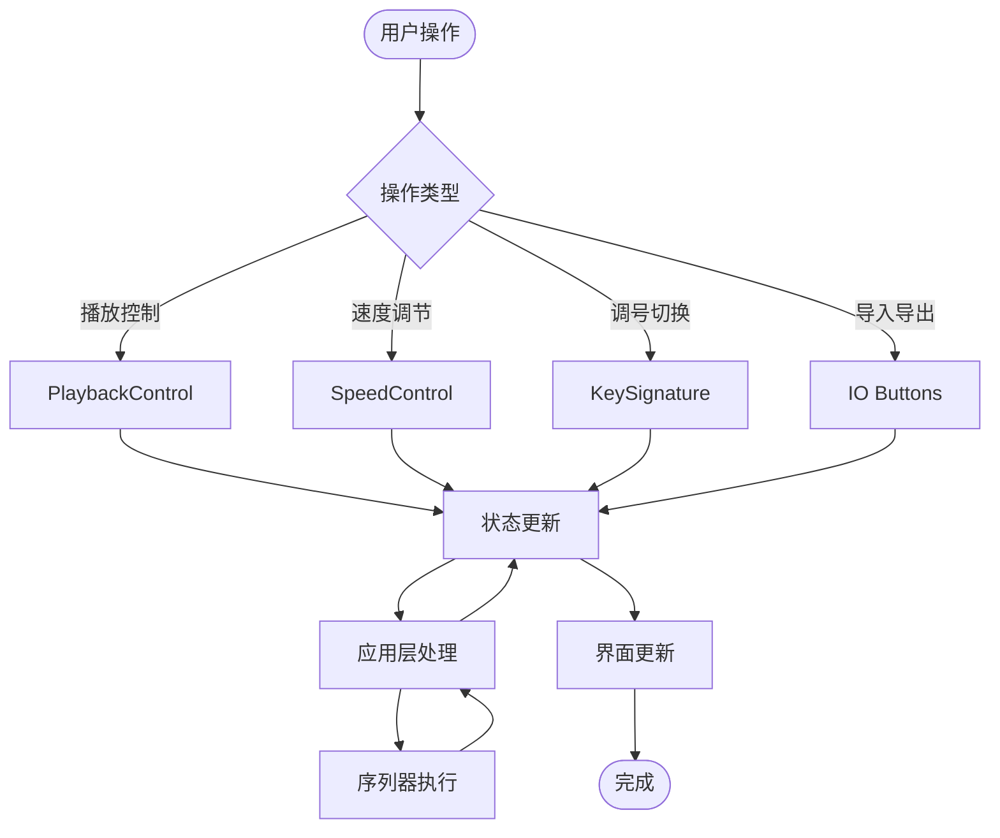
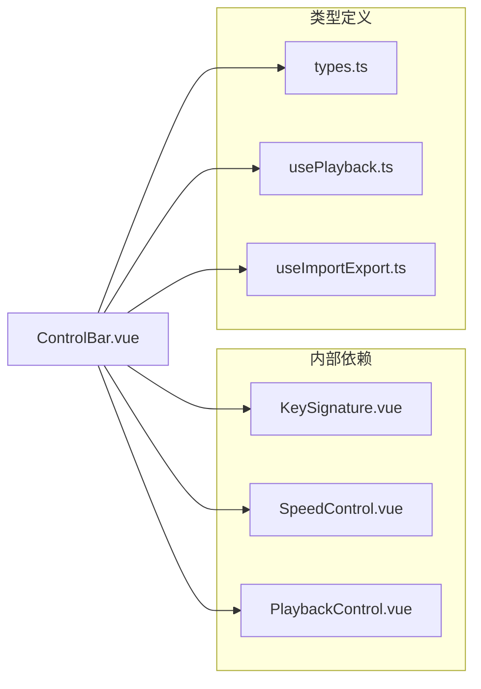

# ControlBar组件接口

<cite>
**本文档引用的文件**
- [ControlBar.vue](file://src/components/ControlBar.vue)
- [App.vue](file://src/App.vue)
- [PlaybackControl.vue](file://src/components/PlaybackControl.vue)
- [SpeedControl.vue](file://src/components/SpeedControl.vue)
- [KeySignature.vue](file://src/components/KeySignature.vue)
- [types.ts](file://src/core/types.ts)
- [usePlayback.ts](file://src/composables/usePlayback.ts)
- [useImportExport.ts](file://src/composables/useImportExport.ts)
- [Board.vue](file://src/components/Board.vue)
</cite>

## 目录
1. [简介](#简介)
2. [项目结构](#项目结构)
3. [核心组件](#核心组件)
4. [架构概览](#架构概览)
5. [详细组件分析](#详细组件分析)
6. [依赖关系分析](#依赖关系分析)
7. [性能考虑](#性能考虑)
8. [故障排除指南](#故障排除指南)
9. [结论](#结论)

## 简介

ControlBar组件是SUBOR音乐板应用的核心控制栏组件，负责提供音乐播放控制界面。该组件作为控制栏容器，集成了多种控制功能，包括播放控制、速度调节、调号设置以及导入导出功能。组件采用Vue 3 Composition API和TypeScript实现，提供了完整的类型安全和响应式控制能力。

## 项目结构

ControlBar组件位于src/components目录下，与其它核心组件共同构成音乐编辑器的用户界面层。组件通过插槽系统与Board容器组件集成，形成完整的应用布局结构。

**图表来源**
- [ControlBar.vue:1-116](file://src/components/ControlBar.vue#L1-L116)
- [Board.vue:1-47](file://src/components/Board.vue#L1-L47)
- [App.vue:1-138](file://src/App.vue#L1-L138)

**章节来源**
- [ControlBar.vue:1-116](file://src/components/ControlBar.vue#L1-L116)
- [Board.vue:1-47](file://src/components/Board.vue#L1-L47)
- [App.vue:1-138](file://src/App.vue#L1-L138)

## 核心组件

ControlBar组件作为音乐播放控制的核心容器，具有以下主要功能特性：

### 主要职责
- **播放控制管理**：提供播放、暂停、停止等基础播放控制
- **速度调节**：支持BPM（每分钟节拍数）的快速调节
- **调号设置**：管理音乐调号的切换和显示
- **导入导出功能**：提供乐谱数据的导入和导出操作
- **循环播放控制**：管理播放循环模式的启用和禁用

### 布局结构
组件采用两行分组布局设计：
- **顶部控制组**：调号和速度控制
- **底部控制组**：播放控制、导入导出按钮

**章节来源**
- [ControlBar.vue:27-67](file://src/components/ControlBar.vue#L27-L67)
- [ControlBar.vue:78-83](file://src/components/ControlBar.vue#L78-L83)

## 架构概览

ControlBar组件在整个应用架构中扮演着关键的协调者角色，连接UI层与业务逻辑层。

**图表来源**
- [ControlBar.vue:16-24](file://src/components/ControlBar.vue#L16-L24)
- [PlaybackControl.vue:9-14](file://src/components/PlaybackControl.vue#L9-L14)
- [SpeedControl.vue:14-20](file://src/components/SpeedControl.vue#L14-L20)
- [KeySignature.vue:10-22](file://src/components/KeySignature.vue#L10-L22)
- [App.vue:30-53](file://src/App.vue#L30-L53)

## 详细组件分析

### 接口定义

#### Props属性

| 属性名 | 类型 | 必需 | 默认值 | 描述 |
|--------|------|------|--------|------|
| playbackState | PlaybackState | 是 | - | 当前播放状态（stopped/playing/paused） |
| loop | boolean | 是 | - | 循环播放标志 |

#### Model属性

| 属性名 | 类型 | 描述 |
|--------|------|------|
| speed | number | BPM速度值，支持BPM_LIST（60、75、90、105、120、135）中的预设值 |
| keySignature | KeySignature | 调号值，支持C、D、F、G、♭B |

#### Events事件

| 事件名 | 参数 | 描述 |
|--------|------|------|
| play | [] | 触发播放操作 |
| pause | [] | 触发暂停操作 |
| stop | [] | 触发停止操作 |
| toggle-loop | [] | 切换循环播放模式 |
| export | [] | 触发导出操作 |
| import | [] | 触发导入操作 |

#### Slots插槽

ControlBar组件未定义任何具名插槽，但通过默认插槽接收子组件。

**章节来源**
- [ControlBar.vue:10-24](file://src/components/ControlBar.vue#L10-L24)

### 组件结构分析

#### 布局设计

组件采用flexbox布局，实现垂直分组的控制面板设计：

**图表来源**
- [ControlBar.vue:27-67](file://src/components/ControlBar.vue#L27-L67)

#### 样式系统

组件实现了完整的样式系统，包括：
- 响应式布局适配
- 悬停和交互状态样式
- 按钮状态指示器

**章节来源**
- [ControlBar.vue:69-115](file://src/components/ControlBar.vue#L69-L115)

### 与其他组件的协作关系

#### 与PlaybackControl的协作

PlaybackControl组件负责具体的播放控制逻辑，ControlBar通过事件转发实现统一的控制接口：

**图表来源**
- [ControlBar.vue:43-50](file://src/components/ControlBar.vue#L43-L50)
- [PlaybackControl.vue:16-30](file://src/components/PlaybackControl.vue#L16-L30)
- [App.vue:30-42](file://src/App.vue#L30-L42)

#### 与SpeedControl和KeySignature的协作

这两个组件都使用v-model双向绑定，实现参数的实时同步：

- **SpeedControl**：通过BPM_LIST预设值实现速度调节
- **KeySignature**：通过KEY_SIGNATURES数组实现调号切换

**章节来源**
- [ControlBar.vue:30-31](file://src/components/ControlBar.vue#L30-L31)
- [SpeedControl.vue:14-20](file://src/components/SpeedControl.vue#L14-L20)
- [KeySignature.vue:10-22](file://src/components/KeySignature.vue#L10-L22)

### 数据流分析

#### 控制流程

**图表来源**
- [ControlBar.vue:16-24](file://src/components/ControlBar.vue#L16-L24)
- [App.vue:30-53](file://src/App.vue#L30-L53)

**章节来源**
- [ControlBar.vue:16-24](file://src/components/ControlBar.vue#L16-L24)
- [App.vue:30-53](file://src/App.vue#L30-L53)

## 依赖关系分析

### 内部依赖

ControlBar组件依赖于多个子组件，形成清晰的职责分离：

**图表来源**
- [ControlBar.vue:2-5](file://src/components/ControlBar.vue#L2-L5)
- [types.ts:113-138](file://src/core/types.ts#L113-L138)

### 外部依赖

组件通过组合式函数与应用状态进行交互：

- **usePlayback**：提供播放控制状态管理
- **useImportExport**：提供导入导出功能
- **core/types**：提供类型定义和常量

**章节来源**
- [ControlBar.vue:2-5](file://src/components/ControlBar.vue#L2-L5)
- [App.vue:7-9](file://src/App.vue#L7-L9)

## 性能考虑

### 响应式优化

- **v-model双向绑定**：使用defineModel确保数据同步的高效性
- **事件防抖**：播放控制事件直接转发，避免不必要的中间处理
- **计算属性缓存**：SpeedControl和KeySignature使用computed属性缓存状态

### 内存管理

- **组件卸载清理**：子组件自动管理各自的事件监听器
- **状态最小化**：仅传递必要的状态给子组件

## 故障排除指南

### 常见问题及解决方案

#### 播放控制失效
- **症状**：播放按钮点击无反应
- **原因**：PlaybackControl事件未正确转发
- **解决**：检查ControlBar的事件转发配置

#### 速度调节异常
- **症状**：速度按钮无法点击或数值不更新
- **原因**：SpeedControl的v-model绑定问题
- **解决**：验证BPM_LIST配置和currentIndex计算

#### 调号切换问题
- **症状**：调号按钮不可用或显示错误
- **原因**：KEY_SIGNATURES数组配置错误
- **解决**：检查KeySignature组件的状态计算

**章节来源**
- [ControlBar.vue:43-50](file://src/components/ControlBar.vue#L43-L50)
- [SpeedControl.vue:7-12](file://src/components/SpeedControl.vue#L7-L12)
- [KeySignature.vue:7-8](file://src/components/KeySignature.vue#L7-L8)

## 结论

ControlBar组件作为SUBOR音乐板应用的核心控制组件，成功实现了音乐播放控制的集中化管理。组件通过清晰的接口设计、合理的组件拆分和完善的事件系统，为用户提供了一致且高效的音乐创作体验。

### 设计优势

1. **模块化设计**：通过子组件实现功能分离，便于维护和扩展
2. **类型安全**：完整的TypeScript类型定义确保开发安全性
3. **响应式架构**：基于Vue 3 Composition API的现代开发模式
4. **用户体验**：直观的界面设计和即时的状态反馈

### 扩展建议

1. **主题定制**：支持更多视觉主题和样式选项
2. **快捷键支持**：添加键盘快捷键增强操作效率
3. **状态持久化**：支持用户偏好设置的本地存储
4. **无障碍访问**：增强屏幕阅读器和键盘导航支持