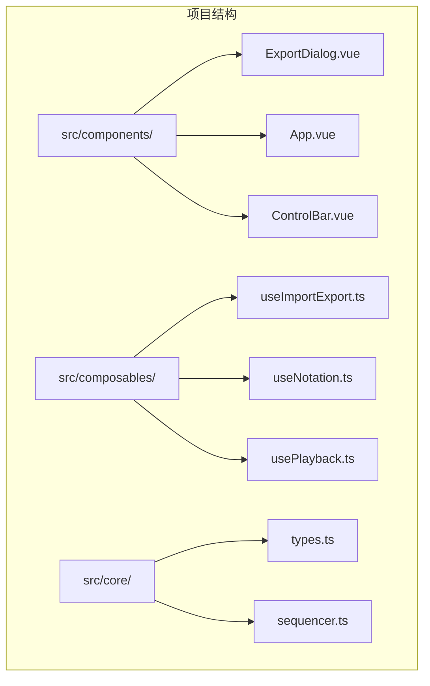
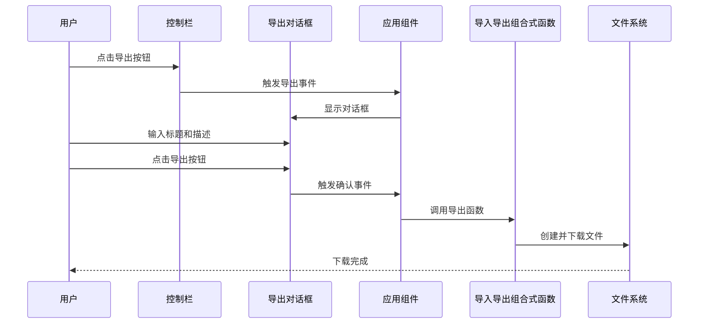
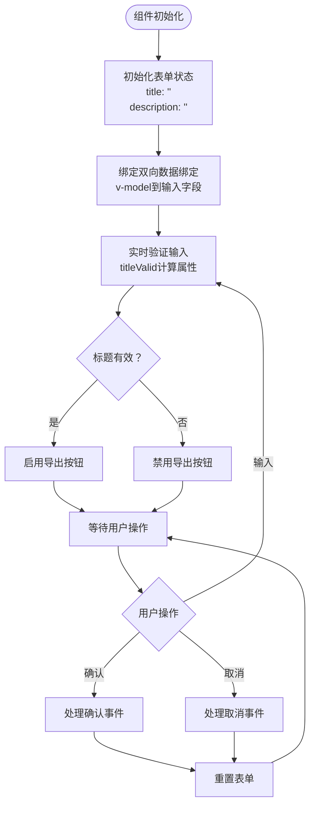
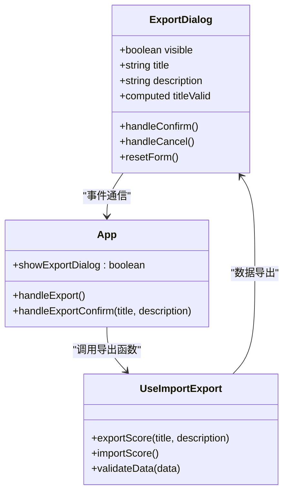
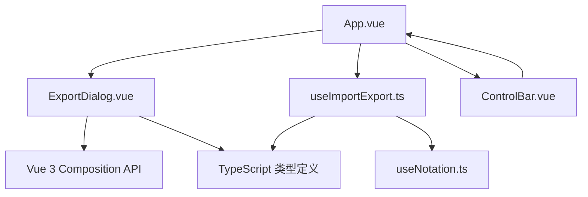

# ExportDialog组件接口

<cite>
**本文档引用的文件**
- [ExportDialog.vue](file://src/components/ExportDialog.vue)
- [useImportExport.ts](file://src/composables/useImportExport.ts)
- [App.vue](file://src/App.vue)
- [types.ts](file://src/core/types.ts)
- [ControlBar.vue](file://src/components/ControlBar.vue)
- [useNotation.ts](file://src/composables/useNotation.ts)
</cite>

## 目录
1. [简介](#简介)
2. [项目结构](#项目结构)
3. [核心组件](#核心组件)
4. [架构概览](#架构概览)
5. [详细组件分析](#详细组件分析)
6. [依赖关系分析](#依赖关系分析)
7. [性能考虑](#性能考虑)
8. [故障排除指南](#故障排除指南)
9. [结论](#结论)

## 简介

ExportDialog组件是SUBOR音乐板应用中的一个Vue 3组件，专门负责处理乐谱导出功能。该组件提供了一个用户友好的界面，允许用户为要导出的乐谱设置标题和描述，并通过确认流程生成JSON格式的导出文件。组件采用TypeScript编写，充分利用了Vue 3的Composition API和TypeScript的类型系统。

## 项目结构

ExportDialog组件位于项目的组件目录中，与应用的主要逻辑通过组合式函数进行集成。整个项目采用模块化的架构设计，将UI组件、业务逻辑和数据模型分离。



**图表来源**
- [ExportDialog.vue:1-119](file://src/components/ExportDialog.vue#L1-L119)
- [App.vue:1-138](file://src/App.vue#L1-L138)
- [useImportExport.ts:1-138](file://src/composables/useImportExport.ts#L1-L138)

**章节来源**
- [ExportDialog.vue:1-119](file://src/components/ExportDialog.vue#L1-L119)
- [App.vue:1-138](file://src/App.vue#L1-L138)

## 核心组件

ExportDialog组件是一个独立的对话框组件，具有以下核心特性：

### 组件职责
- 接收用户输入的乐谱标题和描述
- 验证用户输入的有效性
- 触发导出确认流程
- 提供取消导出的功能

### 主要功能
- 实时表单验证和状态管理
- 用户友好的对话框界面
- 与父组件的事件通信机制
- 自动表单重置功能

**章节来源**
- [ExportDialog.vue:4-35](file://src/components/ExportDialog.vue#L4-L35)

## 架构概览

ExportDialog组件在整个应用架构中扮演着关键角色，它与应用的核心功能紧密集成，形成了完整的导入导出生态系统。



**图表来源**
- [App.vue:86-94](file://src/App.vue#L86-L94)
- [ExportDialog.vue:17-24](file://src/components/ExportDialog.vue#L17-L24)
- [useImportExport.ts:24-47](file://src/composables/useImportExport.ts#L24-L47)

## 详细组件分析

### 组件接口定义

#### Props属性

| 属性名 | 类型 | 必需 | 默认值 | 描述 |
|--------|------|------|--------|------|
| visible | boolean | 是 | - | 控制对话框的显示和隐藏状态 |

**章节来源**
- [ExportDialog.vue:4-6](file://src/components/ExportDialog.vue#L4-L6)

#### Events事件

| 事件名 | 参数 | 描述 |
|--------|------|------|
| close | [] | 当用户点击取消或关闭对话框时触发 |
| confirm | [title: string, description: string] | 当用户确认导出时触发，传递标题和描述参数 |

**章节来源**
- [ExportDialog.vue:8-11](file://src/components/ExportDialog.vue#L8-L11)

### 数据处理逻辑

#### 表单状态管理

组件使用Vue的响应式系统来管理表单数据：



**图表来源**
- [ExportDialog.vue:13-34](file://src/components/ExportDialog.vue#L13-L34)

#### 导出确认流程

当用户确认导出时，组件会执行以下步骤：

1. **输入验证**：检查标题是否为空
2. **数据清理**：移除标题和描述两端的空白字符
3. **事件触发**：向父组件发送确认事件
4. **状态重置**：清空表单数据

**章节来源**
- [ExportDialog.vue:17-24](file://src/components/ExportDialog.vue#L17-L24)

### 组件与文件导入导出系统的集成

#### 与useImportExport组合式函数的集成

ExportDialog组件通过App.vue与useImportExport组合式函数建立连接，实现了完整的导出功能：



**图表来源**
- [ExportDialog.vue:1-35](file://src/components/ExportDialog.vue#L1-L35)
- [useImportExport.ts:18-47](file://src/composables/useImportExport.ts#L18-L47)
- [App.vue:44-94](file://src/App.vue#L44-L94)

#### 导出数据格式

组件导出的数据遵循特定的JSON格式，包含以下关键信息：

| 字段名 | 类型 | 描述 | 示例 |
|--------|------|------|------|
| version | string | 数据格式版本 | "1.0" |
| title | string | 乐谱标题 | "我的第一首曲子" |
| description | string | 乐谱描述（可选） | "这是一首简单的钢琴曲" |
| bpm | number | 播放速度（BPM） | 120 |
| keySignature | string | 调号 | "C" |
| score | Column[] | 乐谱数据 | [[...], [...], ...] |

**章节来源**
- [useImportExport.ts:24-32](file://src/composables/useImportExport.ts#L24-L32)
- [types.ts:145-158](file://src/core/types.ts#L145-L158)

### 组件使用示例

#### 基本使用方法

在父组件中使用ExportDialog组件的标准方式：

```vue
<template>
  <ExportDialog
    :visible="showExportDialog"
    @close="showExportDialog = false"
    @confirm="handleExportConfirm"
  />
</template>
```

#### 完整的集成示例

在App.vue中的完整集成实现：

```typescript
// 导出处理函数
function handleExport() {
  pause()
  showExportDialog.value = true
}

// 导出确认处理函数
function handleExportConfirm(title: string, description: string) {
  exportScore(title, description)
  showExportDialog.value = false
}
```

**章节来源**
- [App.vue:86-94](file://src/App.vue#L86-L94)

## 依赖关系分析

### 组件间依赖关系



**图表来源**
- [ExportDialog.vue:1-2](file://src/components/ExportDialog.vue#L1-L2)
- [App.vue:1-12](file://src/App.vue#L1-L12)
- [useImportExport.ts:1-2](file://src/composables/useImportExport.ts#L1-L2)

### 外部依赖

组件依赖于以下外部库和工具：

- **Vue 3**: 提供响应式系统和组件框架
- **TypeScript**: 提供类型安全和更好的开发体验
- **浏览器API**: 使用File API进行文件下载

**章节来源**
- [ExportDialog.vue:1-2](file://src/components/ExportDialog.vue#L1-L2)
- [useImportExport.ts:34-46](file://src/composables/useImportExport.ts#L34-L46)

## 性能考虑

### 内存管理

组件在导出过程中需要处理大量数据，需要注意内存使用：

- **对象URL清理**: 导出完成后及时清理URL对象，避免内存泄漏
- **文件大小限制**: 对于大型乐谱，考虑分块处理或进度反馈
- **响应式数据优化**: 使用计算属性避免不必要的重新渲染

### 用户体验优化

- **即时验证**: 实时验证用户输入，提供即时反馈
- **禁用状态**: 在无效状态下禁用导出按钮，防止错误操作
- **自动重置**: 导出完成后自动重置表单，提升用户体验

## 故障排除指南

### 常见问题及解决方案

#### 导出文件无法下载

**可能原因**：
- 浏览器阻止弹窗
- 文件名包含非法字符
- 浏览器兼容性问题

**解决方法**：
- 检查浏览器设置，允许弹窗
- 确保标题不包含特殊字符
- 尝试在不同浏览器中操作

#### 导入数据验证失败

**可能原因**：
- 文件格式不符合要求
- 版本不兼容
- 数据结构损坏

**解决方法**：
- 确认文件扩展名为.json或.subor.json
- 检查文件是否为有效的JSON格式
- 验证数据包含必需字段

**章节来源**
- [useImportExport.ts:63-76](file://src/composables/useImportExport.ts#L63-L76)
- [useImportExport.ts:84-131](file://src/composables/useImportExport.ts#L84-L131)

### 调试技巧

1. **控制台日志**: 检查浏览器开发者工具中的控制台输出
2. **网络监控**: 查看文件下载请求的状态和响应
3. **数据验证**: 在导入时添加额外的日志输出

## 结论

ExportDialog组件是一个设计精良的Vue 3组件，它提供了直观的用户界面和可靠的导出功能。组件通过清晰的接口定义、严格的类型检查和完善的错误处理，确保了良好的用户体验和代码质量。

该组件的成功之处在于：
- **简洁的接口设计**: 仅暴露必要的props和events
- **强类型支持**: 充分利用TypeScript提供类型安全
- **良好的用户体验**: 实时验证和即时反馈机制
- **可维护性**: 清晰的代码结构和模块化设计

通过与useImportExport组合式函数的紧密集成，ExportDialog组件成为了整个导入导出系统的重要组成部分，为用户提供了完整的乐谱管理功能。