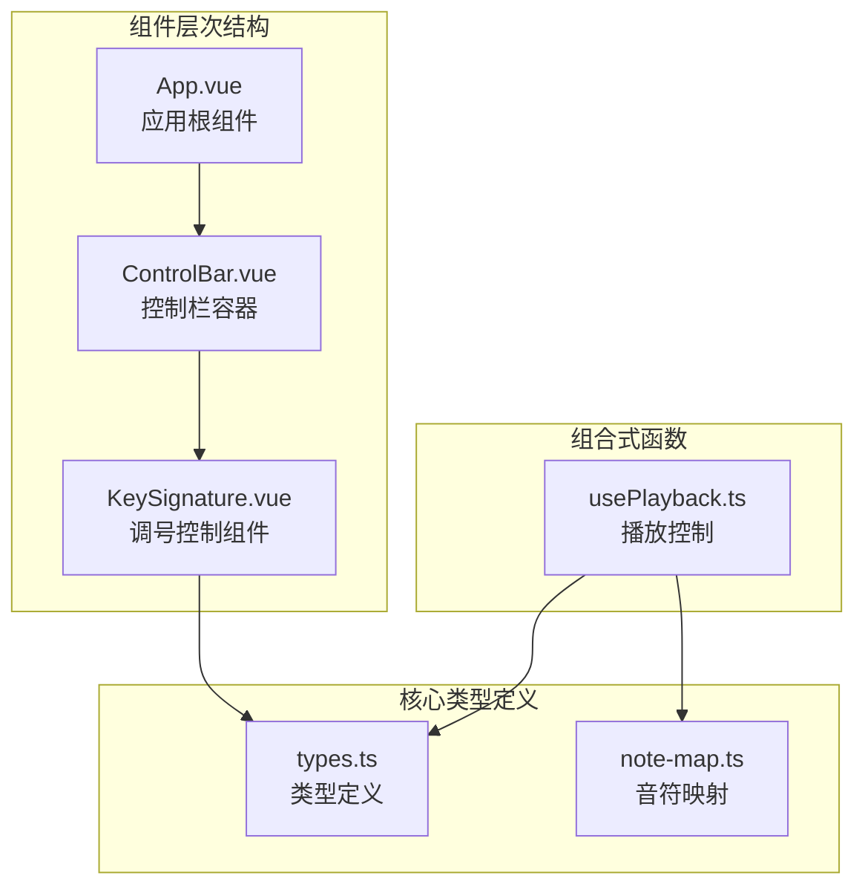
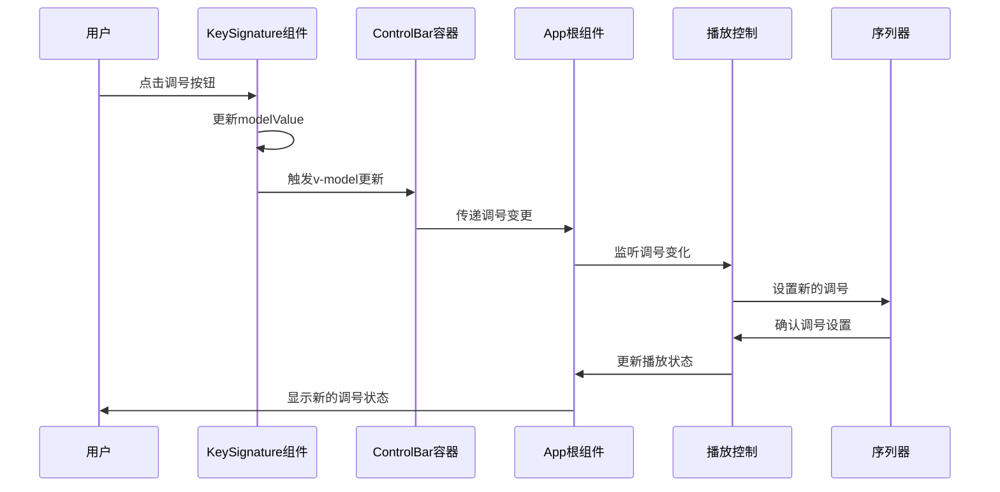
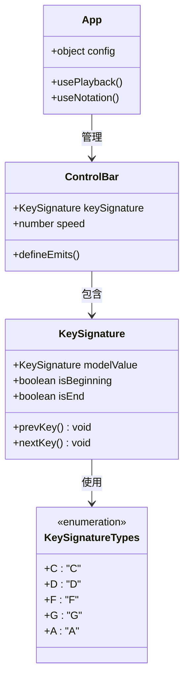
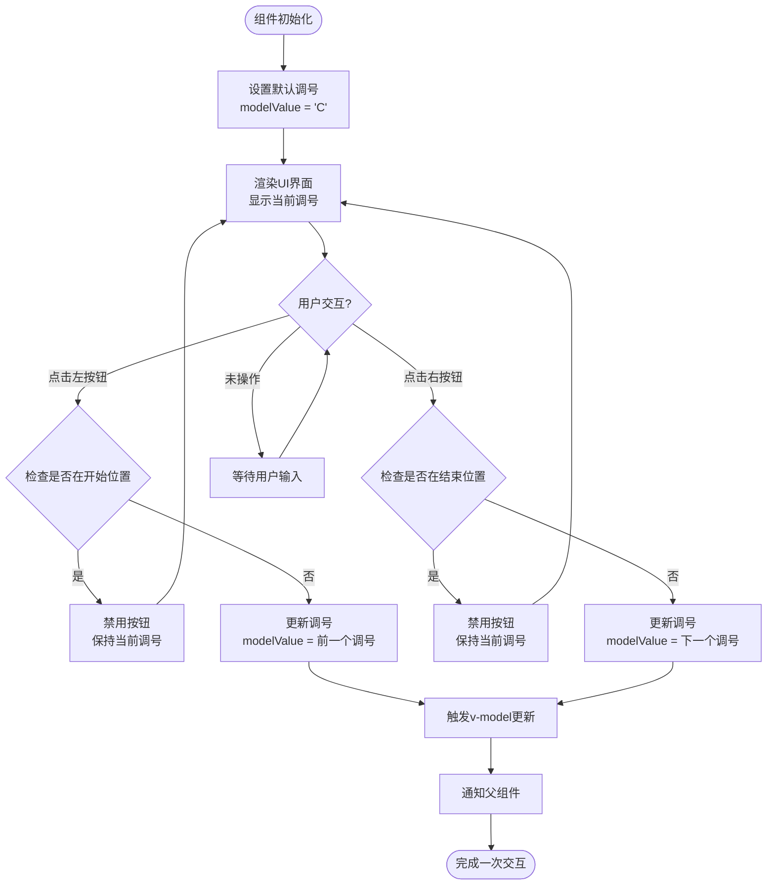
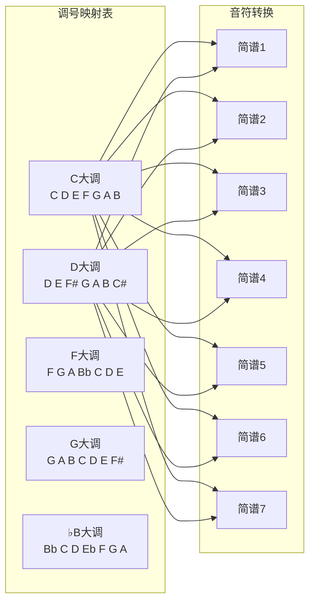
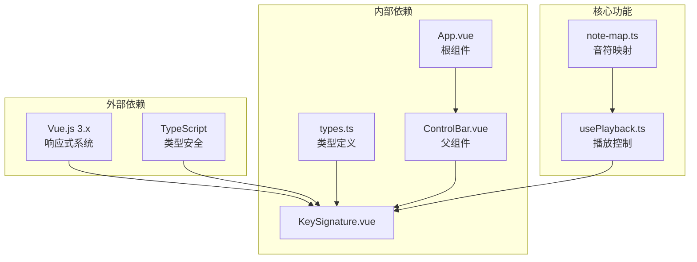

# KeySignature组件接口规范

<cite>
**本文档引用的文件**
- [KeySignature.vue](file://src/components/KeySignature.vue)
- [types.ts](file://src/core/types.ts)
- [ControlBar.vue](file://src/components/ControlBar.vue)
- [App.vue](file://src/App.vue)
- [usePlayback.ts](file://src/composables/usePlayback.ts)
- [note-map.ts](file://src/core/note-map.ts)
</cite>

## 目录
1. [简介](#简介)
2. [项目结构](#项目结构)
3. [核心组件](#核心组件)
4. [架构概览](#架构概览)
5. [详细组件分析](#详细组件分析)
6. [依赖关系分析](#依赖关系分析)
7. [性能考虑](#性能考虑)
8. [故障排除指南](#故障排除指南)
9. [结论](#结论)

## 简介

KeySignature组件是音乐记谱系统中的关键调号控制组件，负责管理音乐作品的调号设置。该组件提供了直观的用户界面，允许用户在不同的调号之间进行切换，包括C大调、D大调、F大调、G大调和♭B大调等5个常用调号。调号直接影响音乐演奏的音高定位，决定了简谱数字1-7对应的MIDI音符编号。

## 项目结构

KeySignature组件位于Vue.js单文件组件架构中，采用TypeScript类型安全编程。组件通过v-model双向绑定与父组件通信，实现了响应式的调号状态管理。

**图表来源**
- [App.vue:1-138](file://src/App.vue#L1-L138)
- [ControlBar.vue:1-116](file://src/components/ControlBar.vue#L1-L116)
- [KeySignature.vue:1-55](file://src/components/KeySignature.vue#L1-L55)

**章节来源**
- [KeySignature.vue:1-55](file://src/components/KeySignature.vue#L1-L55)
- [types.ts:118-138](file://src/core/types.ts#L118-L138)

## 核心组件

KeySignature组件的核心功能基于以下设计原则：

### 接口定义

组件通过v-model实现双向数据绑定，支持以下类型：
- **模型值类型**: `KeySignature` - 调号枚举类型
- **默认值**: `'C'` - C大调作为初始状态
- **可用调号**: `'C' | 'D' | 'F' | 'G' | 'A'`

### 状态管理

组件维护内部状态并通过计算属性实现智能禁用控制：
- `modelValue`: 当前选中的调号
- `isBeginning`: 是否处于第一个调号位置
- `isEnd`: 是否处于最后一个调号位置

### 用户交互逻辑

组件提供简洁的导航界面：
- 左侧按钮：向前切换调号（`<`）
- 中间显示：当前调号名称（格式：`1={{modelValue}}`）
- 右侧按钮：向后切换调号（`>`）

**章节来源**
- [KeySignature.vue:6-22](file://src/components/KeySignature.vue#L6-L22)
- [types.ts:132-138](file://src/core/types.ts#L132-L138)

## 架构概览

KeySignature组件在整个音乐系统中扮演着调号控制中心的角色，与多个核心模块协同工作：

**图表来源**
- [KeySignature.vue:10-22](file://src/components/KeySignature.vue#L10-L22)
- [ControlBar.vue:30](file://src/components/ControlBar.vue#L30)
- [App.vue:27](file://src/App.vue#L27)
- [usePlayback.ts:39-41](file://src/composables/usePlayback.ts#L39-L41)

## 详细组件分析

### 组件类图

**图表来源**
- [KeySignature.vue:1-55](file://src/components/KeySignature.vue#L1-L55)
- [types.ts:132-138](file://src/core/types.ts#L132-L138)
- [ControlBar.vue:1-25](file://src/components/ControlBar.vue#L1-L25)
- [App.vue:1-50](file://src/App.vue#L1-L50)

### 数据流分析

KeySignature组件的数据流遵循单向数据流原则：

**图表来源**
- [KeySignature.vue:7-22](file://src/components/KeySignature.vue#L7-L22)
- [types.ts:135-138](file://src/core/types.ts#L135-L138)

### 调号映射机制

KeySignature组件与音符映射系统的深度集成：

**图表来源**
- [note-map.ts:10-27](file://src/core/note-map.ts#L10-L27)
- [types.ts:132-138](file://src/core/types.ts#L132-L138)

**章节来源**
- [KeySignature.vue:1-55](file://src/components/KeySignature.vue#L1-L55)
- [note-map.ts:83-100](file://src/core/note-map.ts#L83-L100)

## 依赖关系分析

KeySignature组件的依赖关系清晰明确，遵循Vue.js组件化开发的最佳实践：

**图表来源**
- [KeySignature.vue:2-4](file://src/components/KeySignature.vue#L2-L4)
- [ControlBar.vue:2](file://src/components/ControlBar.vue#L2)
- [App.vue:10](file://src/App.vue#L10)
- [usePlayback.ts:1](file://src/composables/usePlayback.ts#L1)

### 组件耦合度评估

KeySignature组件具有良好的内聚性和较低的耦合度：
- **内聚性**: 高 - 专注于调号控制单一职责
- **耦合度**: 低 - 仅依赖类型定义和Vue响应式系统
- **可测试性**: 良好 - 纯函数式逻辑便于单元测试

**章节来源**
- [KeySignature.vue:1-55](file://src/components/KeySignature.vue#L1-L55)
- [types.ts:118-138](file://src/core/types.ts#L118-L138)

## 性能考虑

KeySignature组件在性能方面表现出色，主要体现在：

### 内存效率
- 使用计算属性缓存状态判断结果
- 避免不必要的DOM重渲染
- 轻量级组件结构，内存占用极小

### 响应速度
- 简单的数组查找算法，时间复杂度O(n)
- Vue响应式系统的高效更新机制
- 事件处理函数的快速执行

### 优化建议
- 考虑使用Map数据结构替代数组查找
- 实现防抖机制处理高频用户操作
- 添加键盘快捷键支持提升用户体验

## 故障排除指南

### 常见问题及解决方案

**问题1: 调号按钮无法点击**
- 检查是否处于边界位置（开始或结束）
- 确认v-model绑定是否正确配置
- 验证父组件是否正确接收调号变更

**问题2: 调号状态不同步**
- 检查组件间的通信链路
- 确认watch监听器是否正常工作
- 验证播放控制组件的调号设置

**问题3: 音符转换错误**
- 检查note-map.ts中的调号映射表
- 验证简谱字符串格式是否正确
- 确认八度修饰符的应用逻辑

**章节来源**
- [KeySignature.vue:29-39](file://src/components/KeySignature.vue#L29-L39)
- [usePlayback.ts:39-41](file://src/composables/usePlayback.ts#L39-L41)

## 结论

KeySignature组件是一个设计精良的调号控制组件，具有以下特点：

### 设计优势
- **简洁直观**: 提供最基础但足够使用的调号切换功能
- **类型安全**: 完整的TypeScript类型定义确保编译时安全
- **响应式设计**: 与Vue.js生态系统无缝集成
- **可扩展性**: 良好的架构为未来功能扩展奠定基础

### 技术价值
- 在音乐记谱系统中发挥关键作用，直接影响音高定位
- 与播放控制系统紧密集成，实现调号变更的实时生效
- 为用户提供直观的调号选择体验

### 改进建议
- 增加调号预览功能，显示当前调号下的音阶
- 添加键盘快捷键支持，提升专业用户效率
- 实现调号历史记录功能，方便快速切换

KeySignature组件虽然功能相对简单，但在整个音乐系统中承担着重要的调号控制职责，其设计体现了现代前端开发的最佳实践。