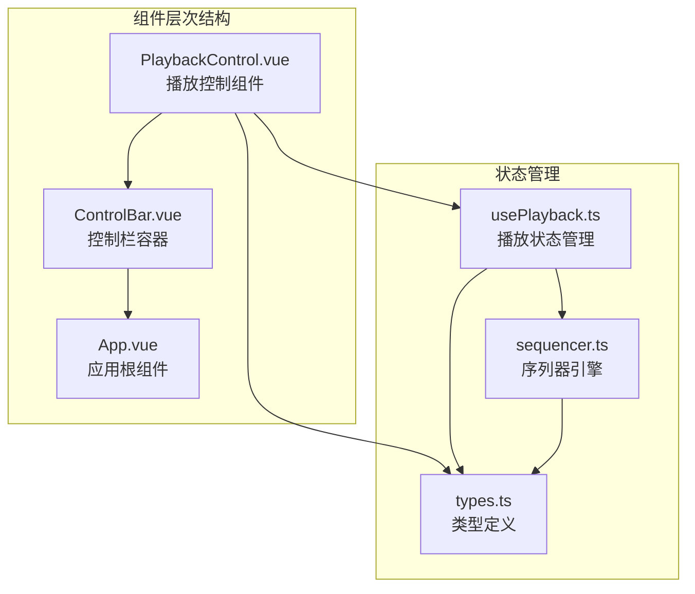
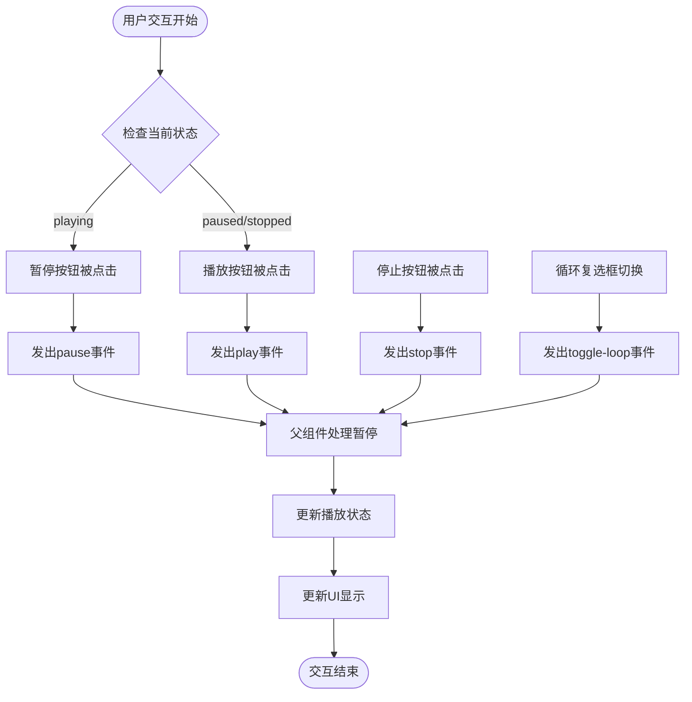
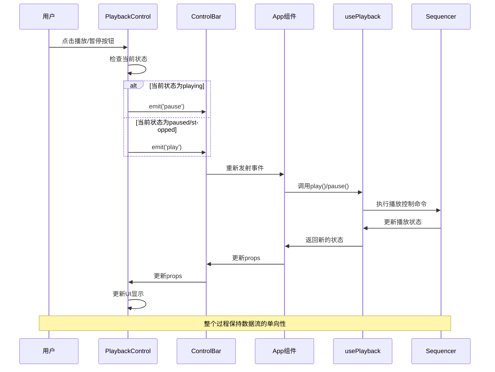
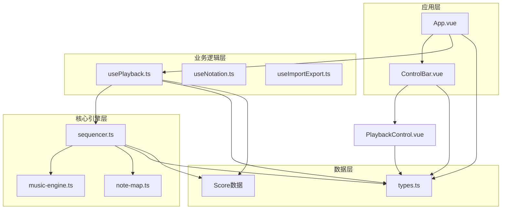

# PlaybackControl组件接口

<cite>
**本文档引用的文件**
- [PlaybackControl.vue](file://src/components/PlaybackControl.vue)
- [ControlBar.vue](file://src/components/ControlBar.vue)
- [usePlayback.ts](file://src/composables/usePlayback.ts)
- [types.ts](file://src/core/types.ts)
- [App.vue](file://src/App.vue)
- [sequencer.ts](file://src/core/sequencer.ts)
- [style.css](file://src/style.css)
</cite>

## 目录
1. [简介](#简介)
2. [组件概述](#组件概述)
3. [接口规范](#接口规范)
4. [状态管理](#状态管理)
5. [用户交互逻辑](#用户交互逻辑)
6. [数据绑定与事件传递](#数据绑定与事件传递)
7. [组件架构分析](#组件架构分析)
8. [使用示例](#使用示例)
9. [集成指导](#集成指导)
10. [故障排除指南](#故障排除指南)
11. [性能考虑](#性能考虑)
12. [总结](#总结)

## 简介

PlaybackControl组件是SUBOR音乐板项目中的核心播放控制组件，负责提供用户界面来控制音乐播放的各个方面。该组件实现了完整的播放控制功能，包括播放/暂停切换、停止控制和循环播放设置，并与底层的播放控制系统进行紧密的数据绑定和事件通信。

## 组件概述

PlaybackControl是一个基于Vue 3 Composition API的响应式组件，采用TypeScript进行类型安全编程。组件设计遵循单一职责原则，专注于播放控制功能的实现，同时保持与应用其他模块的良好解耦。



**图表来源**
- [PlaybackControl.vue:1-111](file://src/components/PlaybackControl.vue#L1-L111)
- [ControlBar.vue:1-116](file://src/components/ControlBar.vue#L1-L116)
- [usePlayback.ts:1-95](file://src/composables/usePlayback.ts#L1-L95)

## 接口规范

### Props属性

PlaybackControl组件接受以下props属性：

| 属性名 | 类型 | 必需 | 默认值 | 描述 |
|--------|------|------|--------|------|
| state | `PlaybackState` | 是 | - | 当前播放状态，取值范围为 `'stopped' \| 'playing' \| 'paused'` |
| loop | `boolean` | 是 | - | 循环播放标志，true表示启用循环，false表示禁用循环 |

**章节来源**
- [PlaybackControl.vue:4-7](file://src/components/PlaybackControl.vue#L4-L7)
- [types.ts:71-72](file://src/core/types.ts#L71-L72)

### Events事件

组件发出以下事件供父组件监听：

| 事件名 | 参数类型 | 触发时机 | 描述 |
|--------|----------|----------|------|
| play | `[]` | 用户点击PLAY按钮时（PLAY与PAUSE互斥显示） | 发出播放请求 |
| pause | `[]` | 用户点击PAUSE按钮时（PLAY与PAUSE互斥显示） | 发出暂停请求 |
| stop | `[]` | 用户点击停止按钮时 | 发出停止请求 |
| toggle-loop | `[]` | 用户切换循环复选框时 | 切换循环播放状态 |

**章节来源**
- [PlaybackControl.vue:9-14](file://src/components/PlaybackControl.vue#L9-L14)

### 组件外观与交互

组件包含三个主要交互元素：
1. **播放/暂停按钮**：PLAY 与 PAUSE 按钮互斥显示（v-show），根据当前播放状态切换
2. **停止按钮**：在停止状态下禁用
3. **循环复选框**：控制循环播放功能

**章节来源**
- [PlaybackControl.vue:33-56](file://src/components/PlaybackControl.vue#L33-L56)

## 状态管理

### 播放状态类型定义

播放状态通过统一的类型系统进行管理：

```mermaid
classDiagram
class PlaybackState {
<<enumeration>>
"stopped"
"playing"
"paused"
}
class UsePlaybackOptions {
+Score score
+Ref~number~ bpm
+Ref~KeySignature~ keySignature
}
class Sequencer {
-Score score
-KeySignature keySignature
-number bpm
-PlaybackState state
-boolean loop
+play() Promise~void~
+pause() void
+stop() void
+setLoop(boolean) void
}
PlaybackState --> Sequencer : "管理"
UsePlaybackOptions --> Sequencer : "配置"
Sequencer --> PlaybackState : "维护"
```

**图表来源**
- [types.ts:71-72](file://src/core/types.ts#L71-L72)
- [usePlayback.ts:14-94](file://src/composables/usePlayback.ts#L14-L94)
- [sequencer.ts:21-50](file://src/core/sequencer.ts#L21-L50)

### 状态转换流程

播放状态在不同操作下的转换关系：

```mermaid
stateDiagram-v2
[*] --> stopped
state stopped {
[*] --> stopped
note right : "初始状态<br/>停止播放"
}
state playing {
[*] --> playing
note right : "正在播放<br/>音频输出中"
}
state paused {
[*] --> paused
note right : "已暂停<br/>音频已停止"
}
stopped --> playing : "play()"
playing --> paused : "pause()"
paused --> playing : "play()"
playing --> stopped : "stop()"
paused --> stopped : "stop()"
note right of playing
"状态由底层序列器维护"
"UI通过事件同步状态"
end note
```

**图表来源**
- [usePlayback.ts:46-66](file://src/composables/usePlayback.ts#L46-L66)
- [sequencer.ts:144-200](file://src/core/sequencer.ts#L144-L200)

**章节来源**
- [types.ts:71-72](file://src/core/types.ts#L71-L72)
- [usePlayback.ts:17-19](file://src/composables/usePlayback.ts#L17-L19)

## 用户交互逻辑

### 交互行为分析

组件的用户交互遵循直观的播放控制模式：



**图表来源**
- [PlaybackControl.vue:16-30](file://src/components/PlaybackControl.vue#L16-L30)

### 无障碍访问支持

组件提供了完整的无障碍访问支持：

- **ARIA标签**：播放按钮根据状态显示"暂停"或"播放"标签
- **键盘导航**：所有按钮都支持键盘访问
- **状态提示**：通过视觉样式变化反映当前状态

**章节来源**
- [PlaybackControl.vue:38-46](file://src/components/PlaybackControl.vue#L38-L46)

## 数据绑定与事件传递

### 双向数据绑定机制

PlaybackControl通过props接收状态，通过events向上级组件传递用户操作：



**图表来源**
- [PlaybackControl.vue:16-30](file://src/components/PlaybackControl.vue#L16-L30)
- [ControlBar.vue:43-50](file://src/components/ControlBar.vue#L43-L50)
- [App.vue:30-42](file://src/App.vue#L30-L42)

### 状态同步机制

组件间的状态同步通过Vue的响应式系统实现：

1. **自上而下的数据流**：父组件通过props向下传递状态
2. **自下而上的事件流**：子组件通过events向上发送用户操作
3. **响应式更新**：Vue自动追踪依赖并更新相关视图

**章节来源**
- [ControlBar.vue:43-50](file://src/components/ControlBar.vue#L43-L50)
- [App.vue:30-42](file://src/App.vue#L30-L42)

## 组件架构分析

### 组件关系图

PlaybackControl在整个组件体系中扮演着关键角色：



**图表来源**
- [App.vue:1-138](file://src/App.vue#L1-L138)
- [ControlBar.vue:1-116](file://src/components/ControlBar.vue#L1-L116)
- [usePlayback.ts:14-94](file://src/composables/usePlayback.ts#L14-L94)

### 设计模式应用

组件采用了多种设计模式：

1. **观察者模式**：通过events实现组件间的松耦合通信
2. **策略模式**：不同的播放状态采用不同的UI表现
3. **单例模式**：序列器作为全局唯一实例管理播放

**章节来源**
- [sequencer.ts:342-354](file://src/core/sequencer.ts#L342-L354)

## 使用示例

### 基础使用

```vue
<template>
  <!-- 在ControlBar中使用 -->
  <ControlBar
    v-model:speed="config.speed"
    v-model:key-signature="config.keySignature"
    :playback-state="playbackState"
    :loop="loop"
    @play="play"
    @pause="pause"
    @stop="stop"
    @toggle-loop="toggleLoop"
  />
</template>
```

### 高级集成

```vue
<script setup lang="ts">
// 在App.vue中集成
const {
  state: playbackState,
  currentColumn: playColumn,
  loop,
  play,
  pause,
  stop,
  toggleLoop,
} = usePlayback({
  score: score,
  bpm: toRef(config, 'speed'),
  keySignature: toRef(config, 'keySignature'),
})
</script>

<template>
  <ControlBar
    :playback-state="playbackState"
    :loop="loop"
    @play="play"
    @pause="pause"
    @stop="stop"
    @toggle-loop="toggleLoop"
  />
</template>
```

**章节来源**
- [App.vue:30-42](file://src/App.vue#L30-L42)
- [ControlBar.vue:43-50](file://src/components/ControlBar.vue#L43-L50)

## 集成指导

### 组件集成步骤

1. **导入组件**：从`src/components/PlaybackControl.vue`导入组件
2. **传递props**：传入`state`和`loop`属性
3. **监听事件**：监听`play`、`pause`、`stop`、`toggle-loop`事件
4. **状态管理**：通过usePlayback组合式函数管理播放状态

### 最佳实践

1. **状态一致性**：确保传入的state与usePlayback返回的状态保持一致
2. **事件处理**：在父组件中正确处理各种播放控制事件
3. **性能优化**：避免不必要的重新渲染，合理使用响应式引用

**章节来源**
- [PlaybackControl.vue:1-111](file://src/components/PlaybackControl.vue#L1-L111)
- [usePlayback.ts:84-94](file://src/composables/usePlayback.ts#L84-L94)

## 故障排除指南

### 常见问题及解决方案

| 问题 | 症状 | 可能原因 | 解决方案 |
|------|------|----------|----------|
| 播放按钮不响应 | 点击无反应 | 事件未正确绑定 | 检查@play/@pause事件监听 |
| 停止按钮不可用 | 始终显示禁用状态 | state始终为stopped | 确保state正确传递 |
| 循环功能无效 | 切换复选框无效果 | toggle-loop事件未处理 | 实现toggleLoop事件处理器 |
| 状态显示错误 | UI与实际状态不符 | 状态同步问题 | 检查props数据流 |

### 调试技巧

1. **检查控制台**：查看是否有JavaScript错误
2. **验证数据流**：确认state属性的传递路径
3. **事件监听**：确保父组件正确处理子组件事件
4. **浏览器开发者工具**：监控Vue组件的响应式更新

**章节来源**
- [PlaybackControl.vue:38-46](file://src/components/PlaybackControl.vue#L38-L46)

## 性能考虑

### 性能优化建议

1. **事件处理优化**：避免在事件处理器中执行耗时操作
2. **状态更新频率**：合理控制播放状态的更新频率
3. **DOM操作最小化**：利用Vue的响应式系统减少直接DOM操作
4. **内存泄漏防护**：确保及时清理定时器和事件监听器

### 内存管理

组件使用了Vue的响应式系统，能够自动管理内存分配和释放。需要注意的是，序列器实例采用单例模式，避免重复创建造成内存浪费。

**章节来源**
- [sequencer.ts:342-354](file://src/core/sequencer.ts#L342-L354)

## 总结

PlaybackControl组件是一个设计精良的播放控制组件，具有以下特点：

1. **类型安全**：完整的TypeScript类型定义确保编译时类型检查
2. **响应式设计**：基于Vue 3 Composition API，提供良好的用户体验
3. **松耦合架构**：通过events实现组件间的解耦通信
4. **状态管理**：清晰的状态管理模式，易于理解和维护
5. **可扩展性**：模块化的架构设计便于功能扩展

该组件成功地将用户界面与底层播放系统分离，既保证了良好的用户体验，又维护了代码的可维护性和可测试性。通过合理的接口设计和事件机制，PlaybackControl成为了整个音乐播放系统的核心控制枢纽。