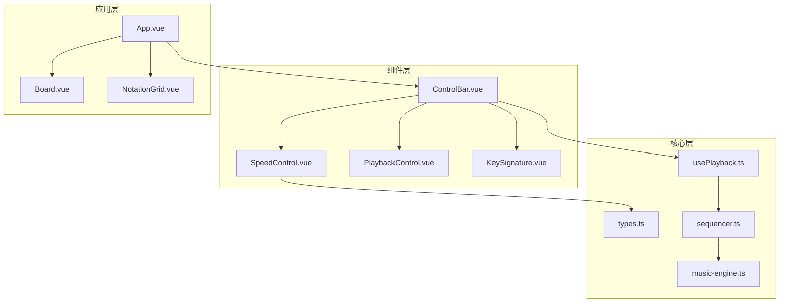
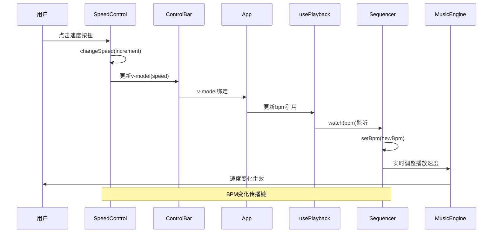
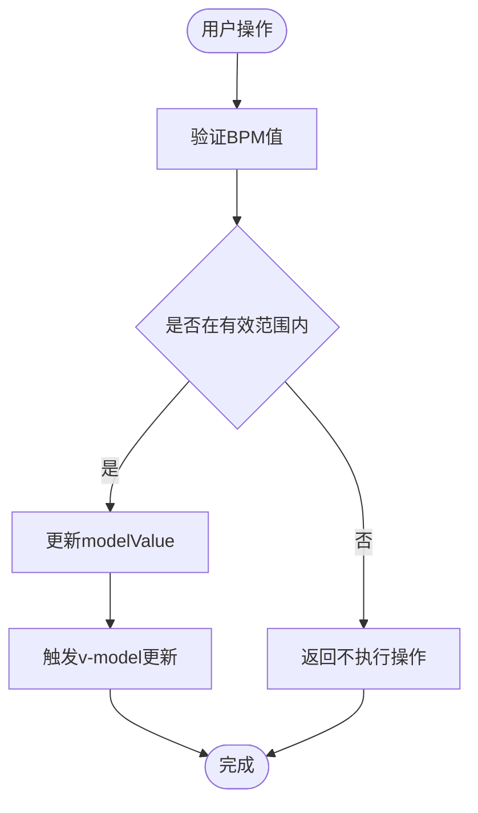
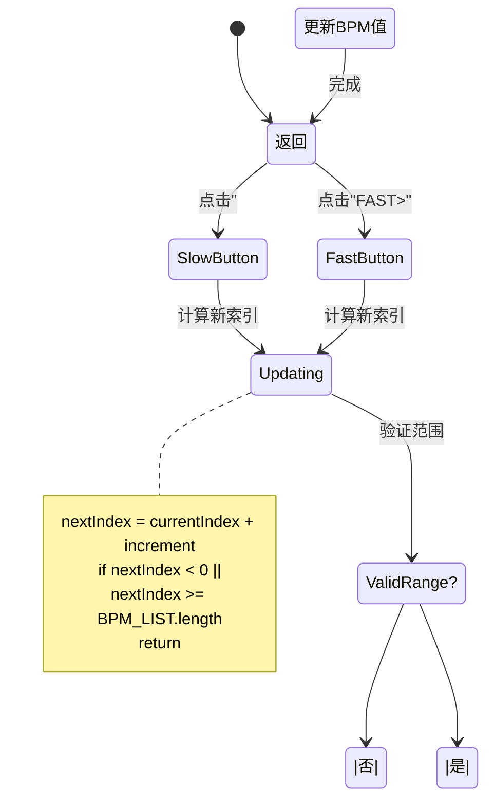
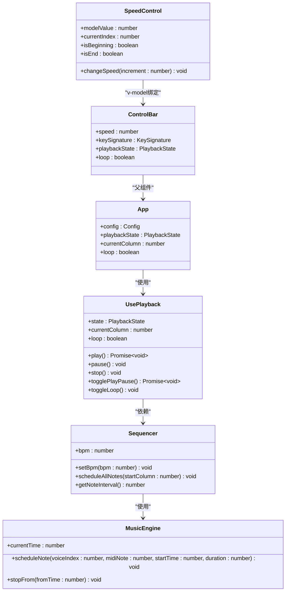

# SpeedControl组件接口

<cite>
**本文档引用的文件**
- [SpeedControl.vue](file://src/components/SpeedControl.vue)
- [types.ts](file://src/core/types.ts)
- [ControlBar.vue](file://src/components/ControlBar.vue)
- [App.vue](file://src/App.vue)
- [usePlayback.ts](file://src/composables/usePlayback.ts)
- [sequencer.ts](file://src/core/sequencer.ts)
- [music-engine.ts](file://src/core/music-engine.ts)
</cite>

## 目录
1. [简介](#简介)
2. [项目结构](#项目结构)
3. [核心组件](#核心组件)
4. [架构概览](#架构概览)
5. [详细组件分析](#详细组件分析)
6. [依赖关系分析](#依赖关系分析)
7. [性能考虑](#性能考虑)
8. [故障排除指南](#故障排除指南)
9. [结论](#结论)

## 简介

SpeedControl组件是SUBOR音乐板项目中的速度控制界面组件，负责提供BPM（每分钟节拍数）的可视化控制界面。该组件允许用户通过点击按钮或视觉指示器来调整音乐播放的速度，支持预设的BPM档位切换，并与音乐播放系统紧密集成。

该组件采用Vue 3 Composition API实现，使用TypeScript进行类型安全编程，遵循响应式设计原则，提供直观的用户交互体验。

## 项目结构

SpeedControl组件位于项目的组件目录中，与其他核心组件协同工作：

**图表来源**
- [SpeedControl.vue:1-68](file://src/components/SpeedControl.vue#L1-L68)
- [ControlBar.vue:1-116](file://src/components/ControlBar.vue#L1-L116)
- [App.vue:1-138](file://src/App.vue#L1-L138)

**章节来源**
- [SpeedControl.vue:1-68](file://src/components/SpeedControl.vue#L1-L68)
- [ControlBar.vue:1-116](file://src/components/ControlBar.vue#L1-L116)
- [App.vue:1-138](file://src/App.vue#L1-L138)

## 核心组件

SpeedControl组件的核心功能包括：

### 主要特性
- **BPM档位控制**：提供预设的BPM值列表进行切换
- **双向数据绑定**：支持v-model双向绑定
- **边界保护**：防止超出BPM列表范围的操作
- **视觉反馈**：6个点状指示标记当前选中BPM
- **禁用状态管理**：根据当前位置自动启用/禁用按钮

### 数据结构
组件使用以下核心数据结构：
- `modelValue`: 当前BPM值（响应式）
- `currentIndex`: 当前BPM在列表中的索引
- `isBeginning`: 是否在列表开头
- `isEnd`: 是否在列表末尾

**章节来源**
- [SpeedControl.vue:5-20](file://src/components/SpeedControl.vue#L5-L20)
- [types.ts:113-116](file://src/core/types.ts#L113-L116)

## 架构概览

SpeedControl组件在整个音乐播放系统中的位置和作用：

**图表来源**
- [SpeedControl.vue:14-20](file://src/components/SpeedControl.vue#L14-L20)
- [ControlBar.vue:7-31](file://src/components/ControlBar.vue#L7-L31)
- [App.vue:25-42](file://src/App.vue#L25-L42)
- [usePlayback.ts:33-41](file://src/composables/usePlayback.ts#L33-L41)
- [sequencer.ts:84-115](file://src/core/sequencer.ts#L84-L115)

## 详细组件分析

### 接口定义

#### Props属性
SpeedControl组件目前不接受任何props属性，因为它通过v-model进行数据绑定：

| 属性名 | 类型 | 必需 | 默认值 | 描述 |
|--------|------|------|--------|------|
| v-model | number | 是 | 90 | 当前BPM值 |

#### Events事件
组件不直接发出事件，而是通过v-model实现双向数据绑定：

| 事件名 | 参数 | 描述 |
|--------|------|------|
| update:modelValue | number | 当BPM值改变时触发 |

#### Slots插槽
组件不提供任何插槽。

### 数据验证机制

组件实现了多层次的数据验证：

**图表来源**
- [SpeedControl.vue:14-20](file://src/components/SpeedControl.vue#L14-L20)

### BPM值设置与范围限制

#### 预设BPM档位
组件使用预定义的BPM档位列表：

| 档位 | BPM值 | 说明 |
|------|-------|------|
| 0 | 60 | 最慢 |
| 1 | 75 |  |
| 2 | 90 | 默认值 |
| 3 | 105 |  |
| 4 | 120 |  |
| 5 | 135 | 最快 |

#### 范围限制策略
- **边界检查**：防止索引越界访问
- **默认回退**：无效值时自动回退到默认BPM
- **状态同步**：按钮禁用状态与当前位置同步

### 用户输入处理

#### 交互流程

**图表来源**
- [SpeedControl.vue:14-20](file://src/components/SpeedControl.vue#L14-L20)

### 与音乐播放节奏的关系

#### BPM与播放速度的关系
BPM值直接影响音乐播放的节奏速度：

| BPM值 | 每列间隔时间 | 说明 |
|-------|-------------|------|
| 60 | 0.5秒 | 最慢，适合学习 |
| 75 | 0.4秒 | 慢速 |
| 90 | 0.333秒 | 默认速度 |
| 105 | 0.286秒 | 中等 |
| 120 | 0.25秒 | 较快 |
| 135 | 0.222秒 | 最快 |

#### 实时调整机制（2026-08-30 改）
当BPM发生变化时，系统会：
1. **丢弃当前音**：`stopAll()` 立即停止所有已调度的音符，杜绝新旧叠加混响
2. **防抖等待**：120ms 防抖合并连点/拖动（restartTimer）
3. **重新调度**：`restartFromCurrentPosition()` 从当前指示器列用新 BPM 重排
4. **更新播放起点**：重置`playbackWallStart`与调度基准对齐（约 100ms）确保指示器与音频同步

**章节来源**
- [sequencer.ts:84-115](file://src/core/sequencer.ts#L84-L115)
- [sequencer.ts:327-329](file://src/core/sequencer.ts#L327-L329)
- [music-engine.ts:177-197](file://src/core/music-engine.ts#L177-L197)

## 依赖关系分析

### 组件依赖图

**图表来源**
- [SpeedControl.vue:1-68](file://src/components/SpeedControl.vue#L1-L68)
- [ControlBar.vue:1-25](file://src/components/ControlBar.vue#L1-L25)
- [App.vue:1-100](file://src/App.vue#L1-L100)
- [usePlayback.ts:14-94](file://src/composables/usePlayback.ts#L14-L94)
- [sequencer.ts:21-354](file://src/core/sequencer.ts#L21-L354)
- [music-engine.ts:17-221](file://src/core/music-engine.ts#L17-L221)

### 外部依赖

组件依赖以下外部模块：

| 依赖项 | 版本 | 用途 |
|--------|------|------|
| Vue 3 | ^3.0.0 | 组件框架和响应式系统 |
| TypeScript | ^4.0.0 | 类型安全 |
| Web Audio API | 原生 | 音频播放 |

**章节来源**
- [SpeedControl.vue:2-3](file://src/components/SpeedControl.vue#L2-L3)
- [types.ts:113-116](file://src/core/types.ts#L113-L116)

## 性能考虑

### 渲染优化
- **计算属性缓存**：`currentIndex`、`isBeginning`、`isEnd`使用计算属性自动缓存
- **条件渲染**：按钮的禁用状态通过计算属性动态确定
- **最小DOM更新**：仅在BPM值变化时更新相关元素

### 内存管理
- **事件监听**：组件卸载时自动清理Vue响应式依赖
- **定时器管理**：在播放状态下使用高效的定时器机制
- **音频资源**：通过单例模式管理音乐引擎实例

### 实时性能
- **BPM切换**：stopAll 丢弃 + 120ms 防抖 + 从当前指示器列整体重排，避免卡顿与混响
- **预调度优化**：一次性预调度所有音符提高播放效率
- **UI同步**：50ms间隔的UI更新确保流畅的用户体验

## 故障排除指南

### 常见问题及解决方案

#### 问题1：BPM值无法更新
**症状**：点击按钮后BPM值不变化
**原因**：可能超出了BPM列表范围
**解决**：检查`currentIndex`计算逻辑，确保边界检查正常工作

#### 问题2：按钮始终禁用
**症状**：左右按钮都不可用
**原因**：当前BPM值不在预设列表中
**解决**：确认`BPM_LIST`包含当前值，或检查默认值设置

#### 问题3：播放速度不正确
**症状**：BPM变化后播放速度异常
**原因**：BPM到时间间隔的转换错误
**解决**：验证`getNoteInterval()`方法的计算逻辑

### 调试技巧

1. **检查响应式数据**：使用Vue DevTools观察`modelValue`和`currentIndex`的变化
2. **验证边界条件**：测试BPM列表首尾元素的特殊处理
3. **监控音频状态**：确认`MusicEngine`的状态变化

**章节来源**
- [SpeedControl.vue:7-12](file://src/components/SpeedControl.vue#L7-L12)
- [sequencer.ts:84-115](file://src/core/sequencer.ts#L84-L115)

## 结论

SpeedControl组件是一个设计精良的速度控制界面，具有以下特点：

### 优势
- **简洁的API设计**：通过v-model实现简单的双向绑定
- **完善的边界保护**：防止无效操作和状态异常
- **良好的用户体验**：直观的视觉反馈和即时响应
- **高性能实现**：优化的渲染和内存管理

### 技术亮点
- **响应式架构**：与Vue 3响应式系统的深度集成
- **实时音频同步**：与Web Audio API的无缝连接
- **优雅的降级处理**：无效状态的智能回退机制

### 改进建议
- 可以考虑添加键盘快捷键支持
- 增加BPM值的手动输入功能
- 提供更丰富的视觉反馈效果

该组件为SUBOR音乐板提供了稳定可靠的速度控制功能，是音乐创作和演奏体验的重要组成部分。