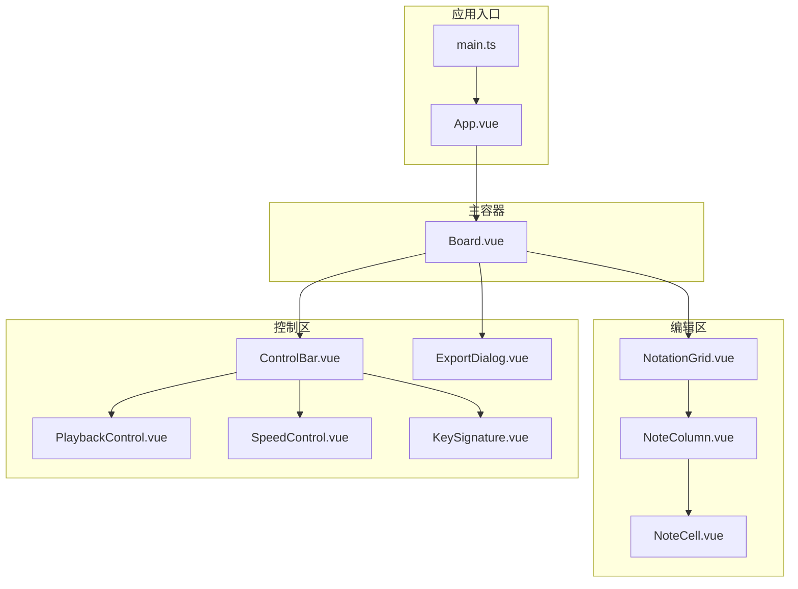
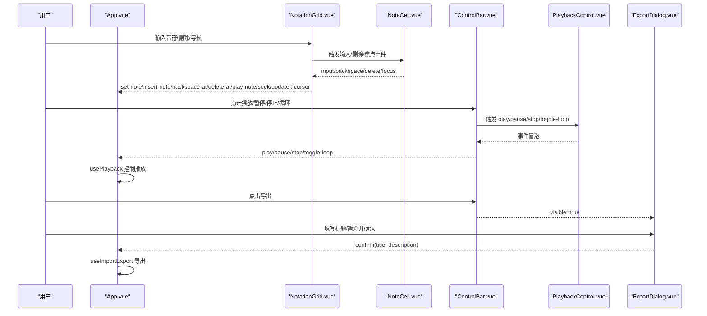
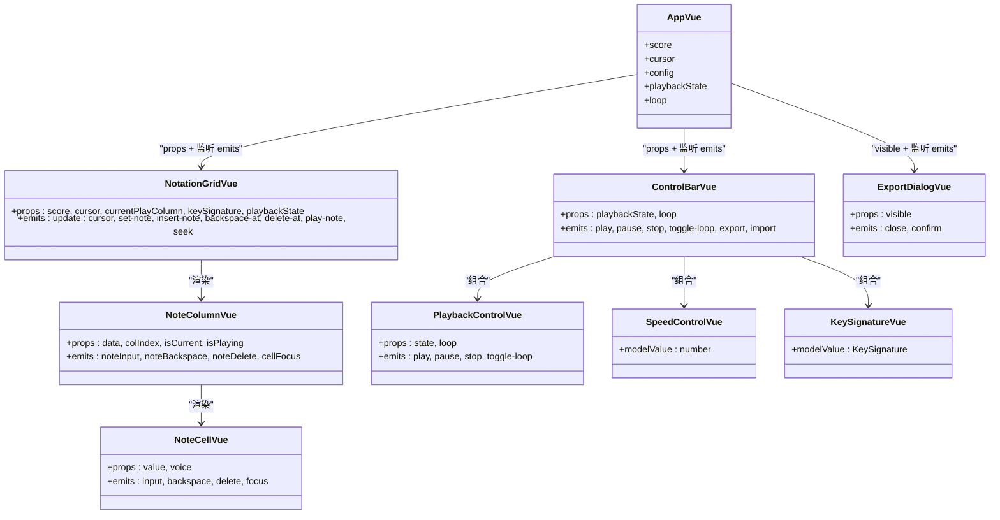

# 组件接口规范

<cite>
**本文引用的文件**
- [src/components/Board.vue](file://src/components/Board.vue)
- [src/components/ControlBar.vue](file://src/components/ControlBar.vue)
- [src/components/PlaybackControl.vue](file://src/components/PlaybackControl.vue)
- [src/components/SpeedControl.vue](file://src/components/SpeedControl.vue)
- [src/components/KeySignature.vue](file://src/components/KeySignature.vue)
- [src/components/ExportDialog.vue](file://src/components/ExportDialog.vue)
- [src/components/NotationGrid.vue](file://src/components/NotationGrid.vue)
- [src/components/NoteColumn.vue](file://src/components/NoteColumn.vue)
- [src/components/NoteCell.vue](file://src/components/NoteCell.vue)
- [src/App.vue](file://src/App.vue)
- [src/main.ts](file://src/main.ts)
- [src/composables/useNotation.ts](file://src/composables/useNotation.ts)
- [src/composables/usePlayback.ts](file://src/composables/usePlayback.ts)
- [src/composables/useImportExport.ts](file://src/composables/useImportExport.ts)
- [src/core/types.ts](file://src/core/types.ts)
</cite>

## 目录
1. [简介](#简介)
2. [项目结构](#项目结构)
3. [核心组件](#核心组件)
4. [架构总览](#架构总览)
5. [详细组件分析](#详细组件分析)
6. [依赖关系分析](#依赖关系分析)
7. [性能考量](#性能考量)
8. [故障排查指南](#故障排查指南)
9. [结论](#结论)
10. [附录](#附录)

## 简介
本文件系统性梳理了音乐板应用的组件接口规范，涵盖所有组件的 props 属性、events 事件、slots 插槽与 emits 触发器定义，并重点说明 Board 作为主容器的接口与数据/事件流机制。同时，对 ControlBar、PlaybackControl、SpeedControl、KeySignature 等控制组件的接口与使用方法进行详解，解释 ExportDialog 的导出对话框接口与配置项。最后给出组件间通信模式、数据流向说明以及使用示例与集成指导。

## 项目结构
该应用采用基于组件的组织方式，核心界面由 App.vue 组合各子组件，数据通过组合式函数在组件间共享与传递。主要目录与文件如下：
- 组件层：Board、ControlBar、PlaybackControl、SpeedControl、KeySignature、ExportDialog、NotationGrid、NoteColumn、NoteCell、Quill
- 组合式函数：useNotation、usePlayback、useImportExport
- 核心类型：types.ts 定义了记谱、声部、播放状态、BPM、调号等类型与常量
- 应用入口：main.ts、App.vue

图表来源
- [src/main.ts:1-8](file://src/main.ts#L1-L8)
- [src/App.vue:1-138](file://src/App.vue#L1-L138)
- [src/components/Board.vue:1-47](file://src/components/Board.vue#L1-L47)
- [src/components/NotationGrid.vue:1-292](file://src/components/NotationGrid.vue#L1-L292)
- [src/components/NoteColumn.vue:1-63](file://src/components/NoteColumn.vue#L1-L63)
- [src/components/NoteCell.vue:1-278](file://src/components/NoteCell.vue#L1-L278)
- [src/components/ControlBar.vue:1-116](file://src/components/ControlBar.vue#L1-L116)
- [src/components/PlaybackControl.vue:1-111](file://src/components/PlaybackControl.vue#L1-L111)
- [src/components/SpeedControl.vue:1-68](file://src/components/SpeedControl.vue#L1-L68)
- [src/components/KeySignature.vue:1-55](file://src/components/KeySignature.vue#L1-L55)
- [src/components/ExportDialog.vue:1-119](file://src/components/ExportDialog.vue#L1-L119)

章节来源
- [src/main.ts:1-8](file://src/main.ts#L1-L8)
- [src/App.vue:1-138](file://src/App.vue#L1-L138)

## 核心组件
本节概述各组件的职责与接口要点，便于快速查阅与集成。

- Board 主容器
  - 作用：提供统一布局与样式容器，内部默认插槽承载子组件
  - 插槽：默认插槽
  - 无 props 与 emits
  - 章节来源
    - [src/components/Board.vue:1-47](file://src/components/Board.vue#L1-L47)

- ControlBar 控制栏
  - 作用：聚合播放控制、速度选择、调号选择、导入/导出
  - 双向绑定：v-model:speed、v-model:key-signature
  - props：playbackState、loop
  - emits：play、pause、stop、toggle-loop、export、import
  - 章节来源
    - [src/components/ControlBar.vue:1-116](file://src/components/ControlBar.vue#L1-L116)

- PlaybackControl 播放控制
  - 作用：播放/暂停、停止、循环切换
  - props：state、loop
  - emits：play、pause、stop、toggle-loop
  - 章节来源
    - [src/components/PlaybackControl.vue:1-111](file://src/components/PlaybackControl.vue#L1-L111)

- SpeedControl 速度控制
  - 作用：BPM 列表滚动选择（慢/快）
  - 双向绑定：v-model<number>
  - 章节来源
    - [src/components/SpeedControl.vue:1-68](file://src/components/SpeedControl.vue#L1-L68)

- KeySignature 调号选择
  - 作用：调号前后切换
  - 双向绑定：v-model<KeySignature>
  - 章节来源
    - [src/components/KeySignature.vue:1-55](file://src/components/KeySignature.vue#L1-L55)

- ExportDialog 导出对话框
  - 作用：收集导出标题与简介，触发导出
  - props：visible
  - emits：close、confirm(title, description)
  - 章节来源
    - [src/components/ExportDialog.vue:1-119](file://src/components/ExportDialog.vue#L1-L119)

- NotationGrid 编辑网格
  - 作用：渲染记谱网格，处理输入、删除、光标移动、键盘导航、播放音符、书写动画
  - props：score、cursor、currentPlayColumn、keySignature、playbackState
  - emits：update:cursor、set-note、insert-note、backspace-at、delete-at、play-note、seek
  - 章节来源
    - [src/components/NotationGrid.vue:1-292](file://src/components/NotationGrid.vue#L1-L292)

- NoteColumn 列容器
  - 作用：封装三声部单元，转发输入/删除/焦点事件
  - props：data、colIndex、isCurrent、isPlaying
  - emits：noteInput、noteBackspace、noteDelete、cellFocus
  - 章节来源
    - [src/components/NoteColumn.vue:1-63](file://src/components/NoteColumn.vue#L1-L63)

- NoteCell 单元格
  - 作用：单个声部输入，支持升降号、八度修饰、空格休止符、抖动反馈
  - props：value、voice
  - emits：input、backspace、delete、focus
  - 章节来源
    - [src/components/NoteCell.vue:1-278](file://src/components/NoteCell.vue#L1-L278)

- Quill 羽毛笔动画
  - 作用：跟随输入位置播放书写/蘸墨动画
  - props：x、y、animation
  - emits：animationEnd
  - 章节来源
    - [src/components/Quill.vue:1-65](file://src/components/Quill.vue#L1-L65)

## 架构总览
应用采用“容器-展示”分层与组合式函数解耦数据与逻辑。App.vue 作为根容器，集中管理状态并通过 props/emits 在组件间传递；useNotation、usePlayback、useImportExport 提供数据与业务能力；各控制组件通过双向绑定与事件向上反馈，形成清晰的数据流与控制流。

图表来源
- [src/App.vue:102-138](file://src/App.vue#L102-L138)
- [src/components/NotationGrid.vue:18-27](file://src/components/NotationGrid.vue#L18-L27)
- [src/components/NoteCell.vue:12-17](file://src/components/NoteCell.vue#L12-L17)
- [src/components/ControlBar.vue:16-24](file://src/components/ControlBar.vue#L16-L24)
- [src/components/PlaybackControl.vue:9-14](file://src/components/PlaybackControl.vue#L9-L14)
- [src/components/ExportDialog.vue:8-11](file://src/components/ExportDialog.vue#L8-L11)

## 详细组件分析

### Board 组件接口规范
- 插槽
  - 默认插槽：用于承载主内容区域（如 NotationGrid、ControlBar、ExportDialog）
- 无 props 与 emits
- 使用建议
  - 将 ControlBar 放置于底部，ExportDialog 作为弹窗使用
  - 通过插槽自由组合布局

章节来源
- [src/components/Board.vue:3-9](file://src/components/Board.vue#L3-L9)

### ControlBar 接口规范与使用
- 双向绑定
  - v-model:speed：Number，BPM
  - v-model:key-signature：KeySignature
- props
  - playbackState：PlaybackState（stopped/playing/paused）
  - loop：boolean
- emits
  - play、pause、stop、toggle-loop、export、import
- 使用方法
  - 在 App.vue 中通过 v-model 与响应式配置双向绑定 speed 与 keySignature
  - 将 playbackState、loop 传入 ControlBar
  - 监听 emits 并调用 usePlayback 与 useImportExport 的方法

章节来源
- [src/components/ControlBar.vue:7-24](file://src/components/ControlBar.vue#L7-L24)
- [src/App.vue:118-131](file://src/App.vue#L118-L131)

### PlaybackControl 接口规范
- props
  - state：PlaybackState
  - loop：boolean
- emits
  - play、pause、stop、toggle-loop
- 使用方法
  - 将 ControlBar 的 playbackState 与 loop 传入
  - 将 emits 事件原样转发给 ControlBar

章节来源
- [src/components/PlaybackControl.vue:4-14](file://src/components/PlaybackControl.vue#L4-L14)

### SpeedControl 接口规范
- 双向绑定
  - v-model<number>：当前 BPM
- 行为
  - 通过按钮在 BPM_LIST 中前后切换
- 使用方法
  - 与 ControlBar 的 v-model:speed 绑定，实现速度选择

章节来源
- [src/components/SpeedControl.vue:5-20](file://src/components/SpeedControl.vue#L5-L20)
- [src/core/types.ts:113-116](file://src/core/types.ts#L113-L116)

### KeySignature 接口规范
- 双向绑定
  - v-model<KeySignature>：当前调号
- 行为
  - 通过按钮在 KEY_SIGNATURES 中前后切换
- 使用方法
  - 与 ControlBar 的 v-model:key-signature 绑定，实现调号选择

章节来源
- [src/components/KeySignature.vue:6-22](file://src/components/KeySignature.vue#L6-L22)
- [src/core/types.ts:135-138](file://src/core/types.ts#L135-L138)

### ExportDialog 接口规范
- props
  - visible：boolean，控制对话框显示/隐藏
- emits
  - close：关闭对话框
  - confirm(title: string, description: string)：确认导出
- 行为
  - 标题必填，简介可选
  - 点击取消触发 close，点击导出触发 confirm
- 使用方法
  - 在 App.vue 中通过 ref 控制 visible
  - 监听 confirm 并调用 useImportExport.exportScore

章节来源
- [src/components/ExportDialog.vue:4-11](file://src/components/ExportDialog.vue#L4-L11)
- [src/App.vue:132-136](file://src/App.vue#L132-L136)

### NotationGrid 接口规范
- props
  - score：只读二维数组，每列三项（三声部）
  - cursor：CursorPosition（当前光标列与声部）
  - currentPlayColumn：number（当前播放列，可选）
  - keySignature：KeySignature
  - playbackState：PlaybackState
- emits
  - update:cursor：更新光标位置
  - set-note：设置音符（覆盖）
  - insert-note：插入音符（右推）
  - backspace-at：回删前一格并左移填补
  - delete-at：清空当前音符
  - play-note：播放单个音符
  - seek：跳转到指定列
- 关键流程
  - 输入处理：按输入字符类型判断——音符/延音线覆盖当前格（set-note），空格插入（insert-note）
  - 动画队列：同一格内书写动画进行时，后续输入排队
  - 键盘导航：方向键移动光标，防长按重复
  - 音符播放：将字符转换为 MIDI 并播放

章节来源
- [src/components/NotationGrid.vue:10-27](file://src/components/NotationGrid.vue#L10-L27)
- [src/components/NotationGrid.vue:113-148](file://src/components/NotationGrid.vue#L113-L148)
- [src/components/NotationGrid.vue:186-244](file://src/components/NotationGrid.vue#L186-L244)

### NoteColumn 接口规范
- props
  - data：[string, string, string]，三声部记谱
  - colIndex：number，列索引
  - isCurrent：boolean，是否为当前列
  - isPlaying：boolean，是否为播放列（可选）
- emits
  - noteInput、noteBackspace、noteDelete、cellFocus
- 行为
  - 转发子组件事件并携带声部索引

章节来源
- [src/components/NoteColumn.vue:6-18](file://src/components/NoteColumn.vue#L6-L18)

### NoteCell 接口规范
- props
  - value：string，存储的记谱值
  - voice：VoiceIndex（0/1/2）
- emits
  - input：发射完整记谱值（含升降号、八度修饰）
  - backspace：回删
  - delete：清空
  - focus：获得焦点
- 行为
  - 支持 #/b 升降号、. , 八度修饰、空格休止符
  - 非法输入抖动反馈
  - 聚焦时显示完整值，失焦时简化显示

章节来源
- [src/components/NoteCell.vue:7-17](file://src/components/NoteCell.vue#L7-L17)
- [src/components/NoteColumn.vue:32-42](file://src/components/NoteColumn.vue#L32-L42)

### Quill 动画组件
- props
  - x、y：位置坐标
  - animation：动画类型（writing/dipInk）
- emits
  - animationEnd：动画结束
- 行为
  - 根据 props 更新位置与动画类型
  - 动画结束后通知父组件继续流程

章节来源
- [src/components/Quill.vue:4-12](file://src/components/Quill.vue#L4-L12)

## 依赖关系分析
- 组件依赖
  - ControlBar 依赖 PlaybackControl、SpeedControl、KeySignature
  - NotationGrid 依赖 NoteColumn，NoteColumn 依赖 NoteCell
  - App.vue 依赖 useNotation、usePlayback、useImportExport
- 数据与事件流
  - NotationGrid 通过 emits 向 App.vue 回传数据变更与输入事件
  - ControlBar 通过 emits 向 App.vue 发送播放与导入/导出请求
  - ExportDialog 通过 emits 向 App.vue 发送导出确认
- 类型与常量
  - types.ts 提供 BPM_LIST、KEY_SIGNATURES、PlaybackState 等核心类型

图表来源
- [src/App.vue:13-53](file://src/App.vue#L13-L53)
- [src/components/NotationGrid.vue:10-27](file://src/components/NotationGrid.vue#L10-L27)
- [src/components/NoteColumn.vue:6-18](file://src/components/NoteColumn.vue#L6-L18)
- [src/components/NoteCell.vue:7-17](file://src/components/NoteCell.vue#L7-L17)
- [src/components/ControlBar.vue:10-24](file://src/components/ControlBar.vue#L10-L24)
- [src/components/PlaybackControl.vue:4-14](file://src/components/PlaybackControl.vue#L4-L14)
- [src/components/SpeedControl.vue:5-20](file://src/components/SpeedControl.vue#L5-L20)
- [src/components/KeySignature.vue:6-22](file://src/components/KeySignature.vue#L6-L22)
- [src/components/ExportDialog.vue:4-11](file://src/components/ExportDialog.vue#L4-L11)

## 性能考量
- 输入队列与动画节流
  - NotationGrid 在书写动画进行期间使用输入队列，避免并发输入造成错位
- 键盘事件去抖
  - NotationGrid 对方向键长按重复事件进行忽略，确保光标定位准确
- DOM 更新优化
  - 使用 nextTick 与队列处理，减少不必要的重排与闪烁
- 播放器参数监听
  - usePlayback 通过 watch 监听 BPM 与调号变化，动态更新序列器参数

章节来源
- [src/components/NotationGrid.vue:58-148](file://src/components/NotationGrid.vue#L58-L148)
- [src/components/NotationGrid.vue:186-244](file://src/components/NotationGrid.vue#L186-L244)
- [src/composables/usePlayback.ts:33-41](file://src/composables/usePlayback.ts#L33-L41)

## 故障排查指南
- 导入失败
  - 现象：提示“导入失败：文件格式错误”
  - 原因：文件非 JSON 或缺少必需字段
  - 处理：检查 version、bpm、keySignature、score 字段，确保格式正确
  - 章节来源
    - [src/composables/useImportExport.ts:72-75](file://src/composables/useImportExport.ts#L72-L75)
    - [src/composables/useImportExport.ts:84-131](file://src/composables/useImportExport.ts#L84-L131)

- 非法输入抖动
  - 现象：输入非法字符时单元格抖动
  - 原因：NoteCell 对无效字符进行反馈
  - 处理：仅输入合法字符（1-7、#、b、.、,、空格）
  - 章节来源
    - [src/components/NoteCell.vue:68-79](file://src/components/NoteCell.vue#L68-L79)

- 导出标题为空
  - 现象：导出按钮禁用或无响应
  - 原因：ExportDialog 校验标题非空
  - 处理：填写有效标题后再点击导出
  - 章节来源
    - [src/components/ExportDialog.vue:13-24](file://src/components/ExportDialog.vue#L13-L24)

## 结论
本规范系统化地定义了各组件的接口、事件与数据流，明确了 Board 作为主容器的职责与插槽使用方式，以及 ControlBar、PlaybackControl、SpeedControl、KeySignature、ExportDialog 的具体行为与交互。通过 NotationGrid 与 NoteCell 的输入处理与动画队列机制，实现了流畅的记谱输入体验。结合 useNotation、usePlayback、useImportExport 的组合式函数，应用实现了清晰的状态管理与业务逻辑分离，便于维护与扩展。

## 附录

### 组件使用示例与集成指导
- 在 App.vue 中引入 Board、NotationGrid、ControlBar、ExportDialog
- 通过 useNotation 初始化乐谱与光标，通过 usePlayback 初始化播放状态与循环，通过 useImportExport 初始化导入导出
- 将 NotationGrid 的 emits 事件映射到 useNotation 的方法，将 ControlBar 的 emits 事件映射到 usePlayback 与 useImportExport 的方法
- 将 ControlBar 的 v-model:speed 与 v-model:key-signature 与 App.vue 的 config 进行双向绑定
- 将 ExportDialog 的 visible 与 confirm 事件与 App.vue 的导出流程对接

章节来源
- [src/App.vue:13-53](file://src/App.vue#L13-L53)
- [src/App.vue:102-138](file://src/App.vue#L102-L138)