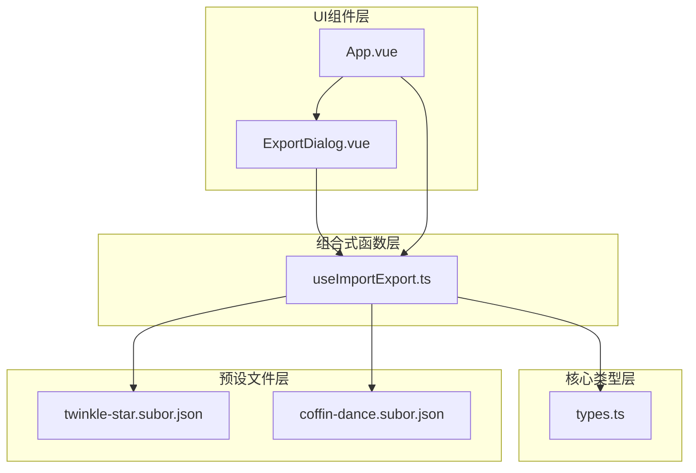
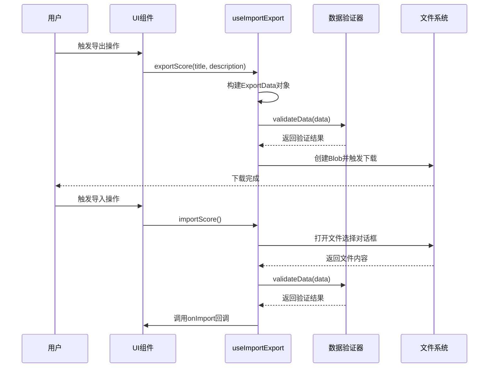
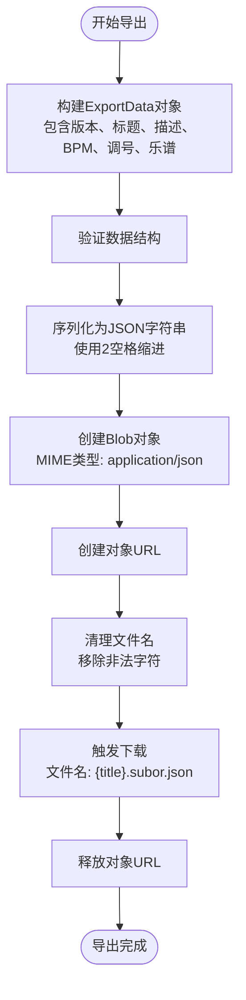
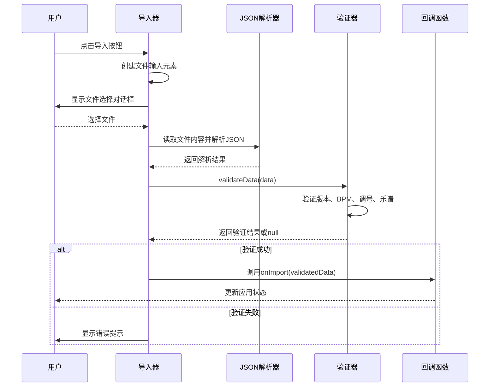
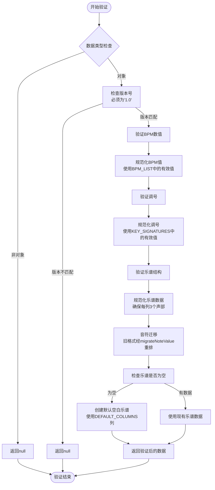
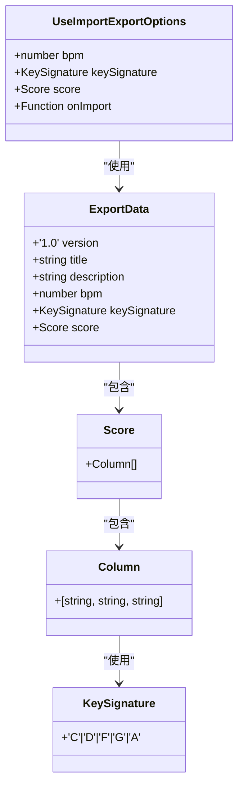
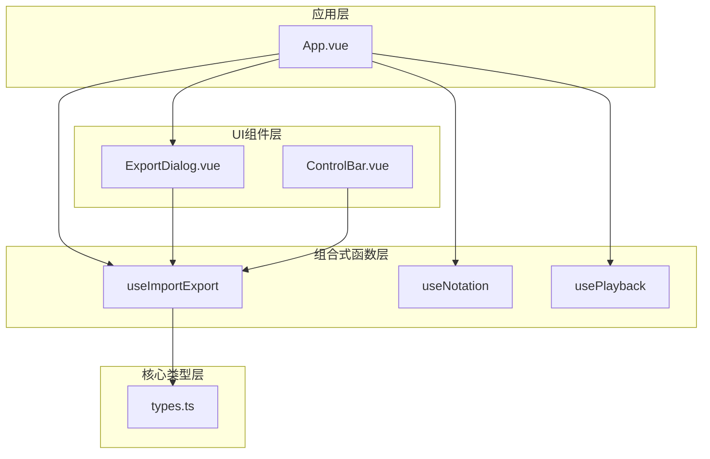

# useImportExport 文件操作API

<cite>
**本文引用的文件**
- [useImportExport.ts](file://src/composables/useImportExport.ts)
- [types.ts](file://src/core/types.ts)
- [ExportDialog.vue](file://src/components/ExportDialog.vue)
- [App.vue](file://src/App.vue)
- [twinkle-star.subor.json](file://presets/twinkle-star.subor.json)
- [coffin-dance.subor.json](file://presets/coffin-dance.subor.json)
</cite>

## 目录
1. [简介](#简介)
2. [项目结构](#项目结构)
3. [核心组件](#核心组件)
4. [架构概览](#架构概览)
5. [详细组件分析](#详细组件分析)
6. [依赖关系分析](#依赖关系分析)
7. [性能考量](#性能考量)
8. [故障排除指南](#故障排除指南)
9. [结论](#结论)
10. [附录](#附录)

## 简介
useImportExport 是一个专门用于音乐谱面导入导出的组合式函数，提供了完整的文件操作能力。该函数实现了安全的文件导入验证、灵活的导出配置以及完善的错误处理机制，确保用户能够可靠地保存和加载音乐作品。

## 项目结构
该功能位于项目的组合式函数目录中，与核心类型定义和UI组件协同工作：



**图表来源**
- [useImportExport.ts:1-138](file://src/composables/useImportExport.ts#L1-L138)
- [types.ts:140-164](file://src/core/types.ts#L140-L164)
- [ExportDialog.vue:1-119](file://src/components/ExportDialog.vue#L1-L119)

**章节来源**
- [useImportExport.ts:1-138](file://src/composables/useImportExport.ts#L1-L138)
- [types.ts:1-164](file://src/core/types.ts#L1-L164)

## 核心组件
useImportExport 组合式函数提供了两个核心API：导出和导入功能，以及内部的数据验证机制。

### 主要功能特性
- **安全导入**：严格的文件格式验证和错误处理
- **灵活导出**：支持自定义标题和描述的导出配置
- **版本兼容**：当前支持版本1.0格式
- **数据完整性**：自动修复和标准化导入数据

**章节来源**
- [useImportExport.ts:18-137](file://src/composables/useImportExport.ts#L18-L137)

## 架构概览
系统采用分层架构设计，各组件职责明确：



**图表来源**
- [useImportExport.ts:24-79](file://src/composables/useImportExport.ts#L24-L79)
- [App.vue:44-99](file://src/App.vue#L44-L99)

## 详细组件分析

### 导出功能 (exportScore)
导出功能负责将当前的音乐谱面保存为标准的.subor.json文件格式。

#### 方法签名
```typescript
exportScore(title: string, description: string): void
```

#### 参数说明
- **title** (`string`): 必填，乐谱标题，最大长度50字符
- **description** (`string`): 可选，乐谱描述，最大长度200字符

#### 返回值
- **void**: 无返回值，直接触发浏览器下载

#### 导出流程


**图表来源**
- [useImportExport.ts:24-47](file://src/composables/useImportExport.ts#L24-L47)

#### 安全性考虑
- **文件名清理**：移除路径分隔符和特殊字符
- **MIME类型验证**：确保正确的文件类型
- **大小限制**：通过前端验证防止超大文件

**章节来源**
- [useImportExport.ts:24-47](file://src/composables/useImportExport.ts#L24-L47)

### 导入功能 (importScore)
导入功能负责从文件系统读取.subor.json文件并进行验证处理。

#### 方法签名
```typescript
importScore(): void
```

#### 参数说明
- **无参数**：通过文件选择对话框交互

#### 返回值
- **void**: 无返回值，通过回调函数传递结果

#### 导入流程


**图表来源**
- [useImportExport.ts:52-79](file://src/composables/useImportExport.ts#L52-L79)

**章节来源**
- [useImportExport.ts:52-79](file://src/composables/useImportExport.ts#L52-L79)

### 数据验证 (validateData)
验证器负责确保导入数据的完整性和兼容性。

#### 验证规则


**图表来源**
- [useImportExport.ts:84-131](file://src/composables/useImportExport.ts#L84-L131)

#### 验证规则详解
1. **版本验证**：严格检查 `version` 字段必须为 '1.0'
2. **BPM验证**：确保数值在预定义的BPM_LIST中，否则使用默认值
3. **调号验证**：验证必须在KEY_SIGNATURES数组内
4. **乐谱验证**：确保score是数组，每列包含恰好3个声部
5. **音符迁移**：旧格式记谱值（数字在前的八度写法）经migrateNoteValue自动迁移为现行格式（幂等）
6. **空数据处理**：如果乐谱为空，创建默认的空白乐谱（125列）

**章节来源**
- [useImportExport.ts:84-131](file://src/composables/useImportExport.ts#L84-L131)

## 依赖关系分析

### 类型依赖关系


**图表来源**
- [types.ts:145-158](file://src/core/types.ts#L145-L158)
- [types.ts:56-60](file://src/core/types.ts#L56-L60)
- [types.ts:132-135](file://src/core/types.ts#L132-L135)

### 组件交互关系


**图表来源**
- [App.vue:9-53](file://src/App.vue#L9-L53)
- [useImportExport.ts:1-2](file://src/composables/useImportExport.ts#L1-L2)

**章节来源**
- [types.ts:140-164](file://src/core/types.ts#L140-L164)
- [App.vue:1-138](file://src/App.vue#L1-L138)

## 性能考量

### 导出性能优化
- **内存管理**：及时释放Object URL，避免内存泄漏
- **序列化优化**：使用适当的缩进级别平衡可读性和文件大小
- **异步处理**：导出操作不会阻塞主线程

### 导入性能优化
- **流式处理**：使用FileReader API进行异步文件读取
- **增量验证**：逐项验证数据，早期发现错误
- **缓存策略**：对验证过的数据进行缓存以提高重复导入性能

### 用户体验优化
- **进度反馈**：提供清晰的操作状态指示
- **错误恢复**：友好的错误提示和重试机制
- **响应式设计**：适配不同设备和屏幕尺寸

## 故障排除指南

### 常见问题及解决方案

#### 导入失败
**症状**：导入时弹出"文件格式错误"提示
**可能原因**：
- 文件不是有效的JSON格式
- 缺少必需的字段
- 版本号不匹配
- 数据类型不正确

**解决步骤**：
1. 检查文件是否为有效的JSON格式
2. 验证文件包含所有必需字段
3. 确认version字段为"1.0"
4. 检查数据类型是否符合预期

#### 导出文件无法打开
**症状**：下载的文件无法被正确识别
**可能原因**：
- 文件扩展名不正确
- MIME类型设置错误
- 文件内容损坏

**解决步骤**：
1. 确认文件扩展名为".subor.json"
2. 检查文件头部的JSON格式
3. 验证文件完整性

#### 数据验证失败
**症状**：导入成功但显示警告信息
**可能原因**：
- BPM值不在允许范围内
- 调号不在支持列表中
- 乐谱结构不符合要求

**解决步骤**：
1. 检查BPM值是否在BPM_LIST中
2. 验证调号是否在KEY_SIGNATURES中
3. 确保每列都有恰好3个声部

**章节来源**
- [useImportExport.ts:72-75](file://src/composables/useImportExport.ts#L72-L75)
- [useImportExport.ts:92-95](file://src/composables/useImportExport.ts#L92-L95)

## 结论
useImportExport 组合式函数提供了完整、安全且高效的音乐谱面导入导出解决方案。其设计充分考虑了数据验证、错误处理、性能优化和用户体验，为用户提供了可靠的文件操作能力。通过严格的格式验证和灵活的配置选项，该函数能够满足各种使用场景的需求。

## 附录

### .subor.json 格式规范

#### 基本结构
```json
{
  "version": "1.0",
  "title": "字符串",
  "description": "字符串",
  "bpm": 数字,
  "keySignature": "字符串",
  "score": 数组
}
```

#### 字段详细说明

| 字段名 | 类型 | 必需 | 描述 | 有效值范围 |
|--------|------|------|------|------------|
| version | string | 是 | 文件版本号 | "1.0" |
| title | string | 是 | 乐谱标题 | 非空字符串，最大50字符 |
| description | string | 否 | 乐谱描述 | 最大200字符 |
| bpm | number | 是 | 拍每分钟速度 | BPM_LIST中的数值 |
| keySignature | string | 是 | 调号 | KEY_SIGNATURES中的值 |
| score | array | 是 | 乐谱数据 | 二维数组结构 |

#### 乐谱数据结构
```json
"score": [
  ["主旋律声部", "和弦声部", "低频声部"],
  ["主旋律声部", "和弦声部", "低频声部"],
  ...
]
```

每个声部可以包含以下字符：
- 数字字符：1-7
- 升号：#
- 降号：b
- 八度标记：`.`（高音）`,`（低音），位于数字之前
- 延音线：`-`（延续前一音符时值，每格为一个八分音符）
- 空格：` `（表示空音符）

#### 支持的调号
- C, D, F, G, A

#### 支持的BPM值
- 60, 75, 90, 105, 120, 135

**章节来源**
- [types.ts:145-158](file://src/core/types.ts#L145-L158)
- [types.ts:132-135](file://src/core/types.ts#L132-L135)
- [types.ts:113](file://src/core/types.ts#L113)

### 使用示例

#### 导出配置
```typescript
// 在组件中使用
const { exportScore } = useImportExport({
  bpm: config.bpm,
  keySignature: config.keySignature,
  score: currentScore,
  onImport: (data) => {
    // 处理导入的数据
  }
});

// 触发导出
exportScore("我的作品", "这是一个示例");
```

#### 导入配置
```typescript
// 设置导入回调
const { importScore } = useImportExport({
  onImport: (data) => {
    config.bpm = data.bpm;
    config.keySignature = data.keySignature;
    loadScore(data.score);
  }
});

// 触发导入
importScore();
```

**章节来源**
- [App.vue:44-99](file://src/App.vue#L44-L99)
- [useImportExport.ts:18-137](file://src/composables/useImportExport.ts#L18-L137)