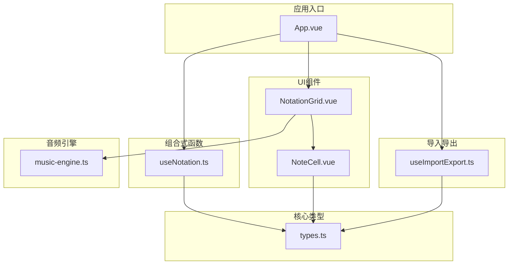
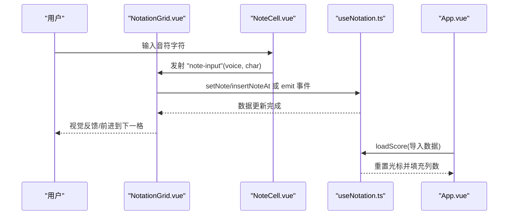
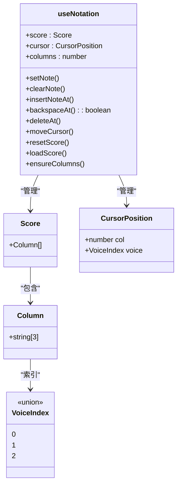

# useNotation 记谱数据管理API

<cite>
**本文引用的文件**
- [useNotation.ts](file://src/composables/useNotation.ts)
- [types.ts](file://src/core/types.ts)
- [NotationGrid.vue](file://src/components/NotationGrid.vue)
- [NoteCell.vue](file://src/components/NoteCell.vue)
- [App.vue](file://src/App.vue)
- [useImportExport.ts](file://src/composables/useImportExport.ts)
- [music-engine.ts](file://src/core/music-engine.ts)
</cite>

## 目录
1. [简介](#简介)
2. [项目结构](#项目结构)
3. [核心组件](#核心组件)
4. [架构总览](#架构总览)
5. [详细组件分析](#详细组件分析)
6. [依赖关系分析](#依赖关系分析)
7. [性能考量](#性能考量)
8. [故障排除指南](#故障排除指南)
9. [结论](#结论)
10. [附录](#附录)

## 简介
本文件为 useNotation 组合式函数的完整API文档，涵盖记谱数据管理的所有公共方法，包括音符操作方法（setNote、clearNote、insertNoteAt、backspaceAt、deleteAt）、光标控制方法（moveCursor）、以及乐谱重置与加载方法（resetScore、loadScore）。文档同时说明了 Score、Column、CursorPosition 等核心数据类型的定义与使用方式，并提供音符输入验证规则、光标导航机制、以及内存管理的最佳实践建议。

## 项目结构
useNotation 位于组合式函数目录，负责维护乐谱数据与光标状态；其数据类型定义在 core/types.ts 中；UI层通过 NotationGrid.vue 和 NoteCell.vue 提供输入与展示；App.vue 将组合式函数与播放、导入导出等功能集成。

图表来源
- [useNotation.ts:15-116](file://src/composables/useNotation.ts#L15-L116)
- [types.ts:56-66](file://src/core/types.ts#L56-L66)
- [NotationGrid.vue:1-292](file://src/components/NotationGrid.vue#L1-L292)
- [NoteCell.vue:1-278](file://src/components/NoteCell.vue#L1-L278)
- [App.vue:13-100](file://src/App.vue#L13-L100)
- [useImportExport.ts:18-138](file://src/composables/useImportExport.ts#L18-L138)
- [music-engine.ts:17-221](file://src/core/music-engine.ts#L17-L221)

章节来源
- [useNotation.ts:15-116](file://src/composables/useNotation.ts#L15-L116)
- [types.ts:56-66](file://src/core/types.ts#L56-L66)
- [NotationGrid.vue:1-292](file://src/components/NotationGrid.vue#L1-L292)
- [NoteCell.vue:1-278](file://src/components/NoteCell.vue#L1-L278)
- [App.vue:13-100](file://src/App.vue#L13-L100)
- [useImportExport.ts:18-138](file://src/composables/useImportExport.ts#L18-L138)
- [music-engine.ts:17-221](file://src/core/music-engine.ts#L17-L221)

## 核心组件
- useNotation(columns?): 返回包含乐谱数据、光标状态及操作方法的对象
  - score: 只读的乐谱数组
  - cursor: 只读的光标位置对象
  - columns: 列数
  - setNote(col, voice, char)
  - clearNote(col, voice)
  - insertNoteAt(col, voice, char)
  - backspaceAt(col, voice): boolean
  - deleteAt(col, voice)
  - moveCursor(col, voice)
  - resetScore()
  - loadScore(newScore)
  - ensureColumns(minCols)

章节来源
- [useNotation.ts:15-116](file://src/composables/useNotation.ts#L15-L116)

## 架构总览
useNotation 通过响应式数据管理乐谱二维结构（列×声部），并提供一组纯函数式操作接口。UI层通过 NotationGrid.vue 与 NoteCell.vue 将键盘输入映射为具体的操作事件，再由 useNotation 执行数据更新。App.vue 将这些能力整合到播放、导入导出等完整工作流中。

图表来源
- [NotationGrid.vue:112-140](file://src/components/NotationGrid.vue#L112-L140)
- [NoteCell.vue:68-115](file://src/components/NoteCell.vue#L68-L115)
- [useNotation.ts:19-42](file://src/composables/useNotation.ts#L19-L42)
- [App.vue:44-53](file://src/App.vue#L44-L53)

## 详细组件分析

### 数据类型定义
- Score: 列数组，每列包含三个声部的字符串
- Column: 固定长度为3的元组，对应三个声部
- CursorPosition: { col: number, voice: VoiceIndex }
- VoiceIndex: 0 | 1 | 2，分别代表主旋律、和弦律、低频
- 输入验证规则：
  - 单字符合法：数字1-7、升降号#、b、八度修饰符.、,、延音线-、空格
  - 完整记谱值格式：[升降号?][八度修饰符?][1-7]（八度修饰符位于数字之前），允许空格/空串

章节来源
- [types.ts:56-66](file://src/core/types.ts#L56-L66)
- [types.ts:47](file://src/core/types.ts#L47)
- [types.ts:77-96](file://src/core/types.ts#L77-L96)

### 音符操作方法

#### setNote(col, voice, char)
- 功能：设置指定列与声部的音符字符
- 参数：
  - col: number，列索引
  - voice: VoiceIndex，声部索引
  - char: string，合法的音符字符
- 返回：无
- 边界处理：仅当 col 在有效范围内时更新
- 使用场景：音符/延音线输入时覆盖当前格

章节来源
- [useNotation.ts:19-24](file://src/composables/useNotation.ts#L19-L24)

#### clearNote(col, voice)
- 功能：将指定列与声部清空为空格
- 参数：同上
- 返回：无
- 使用场景：删除已有音符

章节来源
- [useNotation.ts:26-31](file://src/composables/useNotation.ts#L26-L31)

#### insertNoteAt(col, voice, char)
- 功能：在指定列插入音符，该列及之后同声部音符右移一位，末位丢弃
- 参数：同上
- 返回：无
- 边界处理：col 必须在 [0, score.length) 内，否则忽略
- 使用场景：空格（休止符）输入时的插入

章节来源
- [useNotation.ts:33-42](file://src/composables/useNotation.ts#L33-L42)

#### backspaceAt(col, voice): boolean
- 功能：删除 col 前一个位置的音符，之后同声部音符左移填补，末位补空格
- 参数：同上
- 返回：boolean，是否成功执行（col=0 时无法操作，返回 false）
- 使用场景：Backspace 键回退

章节来源
- [useNotation.ts:44-56](file://src/composables/useNotation.ts#L44-L56)

#### deleteAt(col, voice)
- 功能：清空当前单元格内容，不触发位移（用于 Delete 键）
- 参数：同上
- 返回：无
- 使用场景：Delete 键清空当前格

章节来源
- [useNotation.ts:58-63](file://src/composables/useNotation.ts#L58-L63)

### 光标控制方法

#### moveCursor(col, voice)
- 功能：移动光标到指定位置
- 参数：
  - col: number，列索引
  - voice: VoiceIndex，声部索引
- 返回：无
- 边界处理：
  - col 限制在 [0, score.length)
  - voice 限制在 [0, 2]，超出范围会被裁剪
- 使用场景：键盘导航、播放同步、UI聚焦

章节来源
- [useNotation.ts:65-71](file://src/composables/useNotation.ts#L65-L71)

### 乐谱重置与加载

#### resetScore()
- 功能：清空整个乐谱，将所有列重置为空白，光标回到起点
- 参数：无
- 返回：无
- 实现要点：逐列重建空白列，重置光标

章节来源
- [useNotation.ts:73-80](file://src/composables/useNotation.ts#L73-L80)

#### loadScore(newScore)
- 功能：加载新的乐谱数据，限制列数为默认值
- 参数：newScore: Score
- 返回：无
- 实现要点：
  - 清空现有数据
  - 从新数据中最多取 DEFAULT_COLUMNS 列
  - 不足部分用空白列补齐
  - 重置光标到起点
- 使用场景：导入乐谱后更新界面

章节来源
- [useNotation.ts:82-101](file://src/composables/useNotation.ts#L82-L101)

#### ensureColumns(minCols)
- 功能：确保乐谱至少拥有指定列数，不足部分用空白列补齐
- 参数：minCols: number，最小列数
- 返回：无
- 使用场景：扩展乐谱长度

章节来源
- [useNotation.ts:15-116](file://src/composables/useNotation.ts#L15-L116)

### 输入验证与UI协作
- 输入验证：
  - 单字符验证：isValidNoteChar(char)
  - 完整值验证：isValidNoteValue(value)
- UI行为：
  - NoteCell.vue 对输入进行预处理（升降号、八度修饰符拼接）
  - NotationGrid.vue 按输入字符类型选择操作：音符/延音线走 setNote，空格走 insertNoteAt
  - 支持 Backspace/Delete 键的不同处理策略

章节来源
- [types.ts:84-96](file://src/core/types.ts#L84-L96)
- [NoteCell.vue:68-115](file://src/components/NoteCell.vue#L68-L115)
- [NotationGrid.vue:122-128](file://src/components/NotationGrid.vue#L122-L128)

### 光标导航机制
- 方向键导航：
  - 上/下：在声部间切换（voice 0..2）
  - 左/右：在列间移动（col 保持在边界内）
- 队列与防抖：
  - 输入队列保证书写动画期间按格顺序处理
  - 长按方向键时忽略 repeat 事件，避免光标错乱

章节来源
- [NotationGrid.vue:186-244](file://src/components/NotationGrid.vue#L186-L244)

### 导入导出与数据加载
- 导出：useImportExport.exportScore(title, description) 生成 .subor.json 文件
- 导入：useImportExport.importScore() 读取文件并校验格式，调用 onImport 回调
- 加载：App.vue 接收导入数据后调用 loadScore，同时更新 BPM 与调号

章节来源
- [useImportExport.ts:24-47](file://src/composables/useImportExport.ts#L24-L47)
- [useImportExport.ts:52-79](file://src/composables/useImportExport.ts#L52-L79)
- [useImportExport.ts:84-131](file://src/composables/useImportExport.ts#L84-L131)
- [App.vue:44-53](file://src/App.vue#L44-L53)

## 依赖关系分析

图表来源
- [useNotation.ts:15-116](file://src/composables/useNotation.ts#L15-L116)
- [types.ts:56-66](file://src/core/types.ts#L56-L66)

章节来源
- [useNotation.ts:15-116](file://src/composables/useNotation.ts#L15-L116)
- [types.ts:56-66](file://src/core/types.ts#L56-L66)

## 性能考量
- 数据结构复杂度
  - 每列固定3个声部，整体为 O(N) 列访问与更新
  - insertNoteAt/backspaceAt 为 O(N) 列复制
- 内存管理
  - 使用 reactive/readonly 管理响应式状态，避免不必要的拷贝
  - loadScore 通过截断与补齐控制列数，避免无限增长
- UI渲染
  - 通过列级组件化减少重绘范围
  - 输入队列与动画状态机避免并发输入导致的闪烁与错位

[本节为通用性能建议，不直接分析具体文件]

## 故障排除指南
- 输入无效字符
  - 现象：NoteCell.vue 抖动反馈
  - 原因：单字符不满足 isValidNoteChar
  - 处理：检查输入字符集合与组合规则
- Backspace/Delete 行为差异
  - 现象：两键行为不同
  - 原因：Backspace 删除前一格并左移填补（光标左移），Delete 仅清空当前格且光标不动
  - 处理：按编辑需求选用对应按键
- 光标越界
  - 现象：moveCursor 未生效
  - 原因：col 超出范围或 voice 超出 [0,2]
  - 处理：调用前确保参数在有效区间
- 导入数据异常
  - 现象：导入失败或数据被重置
  - 原因：版本不支持、字段缺失或格式不符
  - 处理：确认 .subor.json 版本与字段完整性

章节来源
- [NoteCell.vue:72-79](file://src/components/NoteCell.vue#L72-L79)
- [NotationGrid.vue:163-177](file://src/components/NotationGrid.vue#L163-L177)
- [useNotation.ts:65-71](file://src/composables/useNotation.ts#L65-L71)
- [useImportExport.ts:84-131](file://src/composables/useImportExport.ts#L84-L131)

## 结论
useNotation 提供了简洁而强大的记谱数据管理能力，结合严格的输入验证与清晰的光标导航机制，能够稳定支撑多声部记谱输入与播放。通过合理的数据结构设计与响应式状态管理，实现了良好的性能与可维护性。建议在实际使用中遵循输入验证规则与按字符类型的编辑策略，配合导入导出流程完成完整的创作工作流。

[本节为总结性内容，不直接分析具体文件]

## 附录

### API 方法一览表
- setNote(col, voice, char): 设置音符
- clearNote(col, voice): 清空音符
- insertNoteAt(col, voice, char): 插入音符（右移）
- backspaceAt(col, voice): 回删（左移填补）
- deleteAt(col, voice): 删除（不移位）
- moveCursor(col, voice): 移动光标
- resetScore(): 重置乐谱
- loadScore(newScore): 加载乐谱
- ensureColumns(minCols): 确保最小列数

章节来源
- [useNotation.ts:19-101](file://src/composables/useNotation.ts#L19-L101)

### 数据类型定义
- Score: 列数组
- Column: 三声部元组
- CursorPosition: { col, voice }
- VoiceIndex: 0 | 1 | 2
- 输入验证：单字符/完整值规则

章节来源
- [types.ts:56-66](file://src/core/types.ts#L56-L66)
- [types.ts:47](file://src/core/types.ts#L47)
- [types.ts:77-96](file://src/core/types.ts#L77-L96)