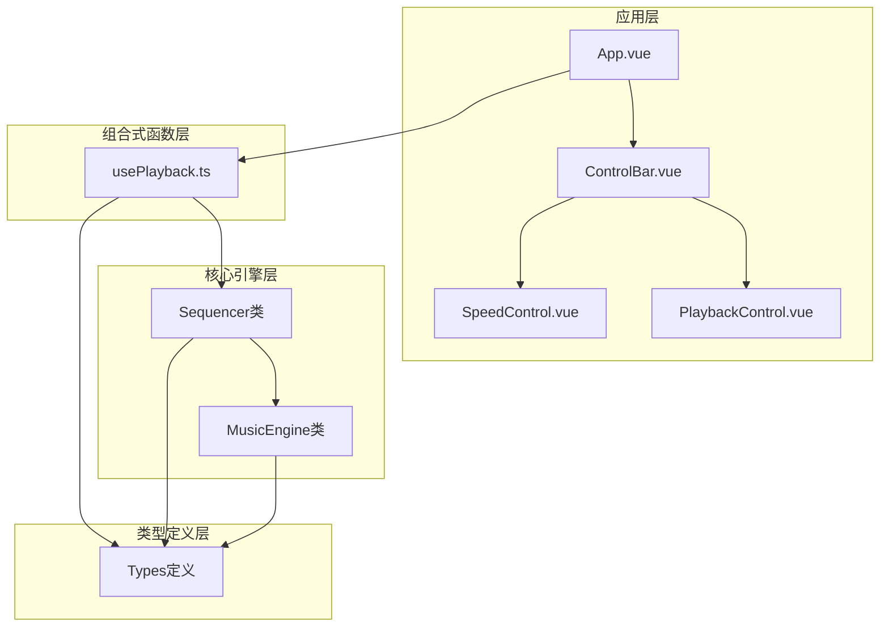
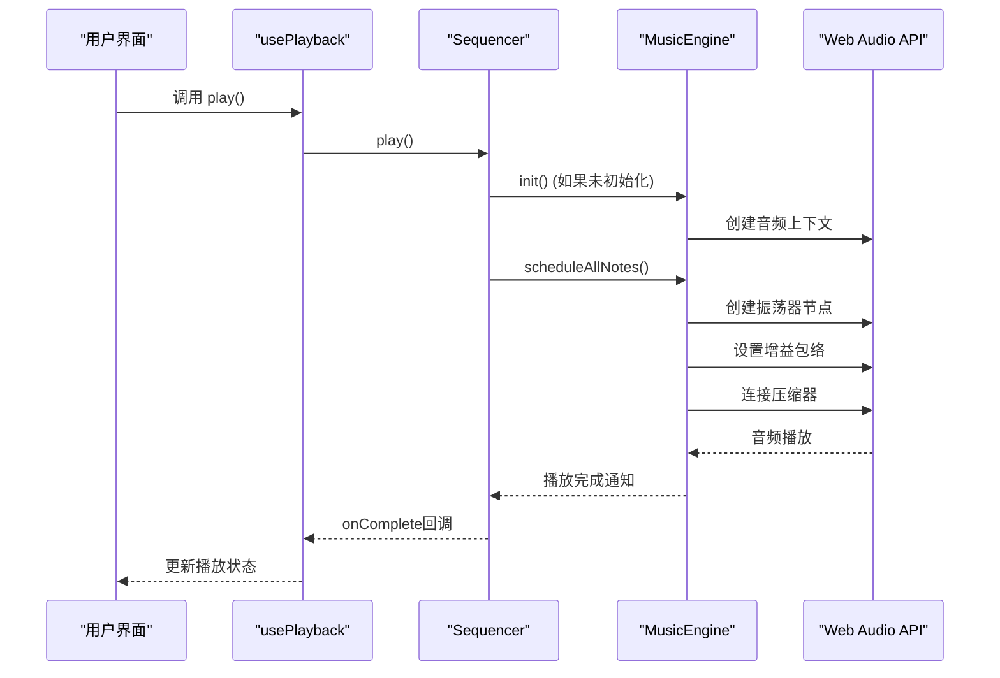
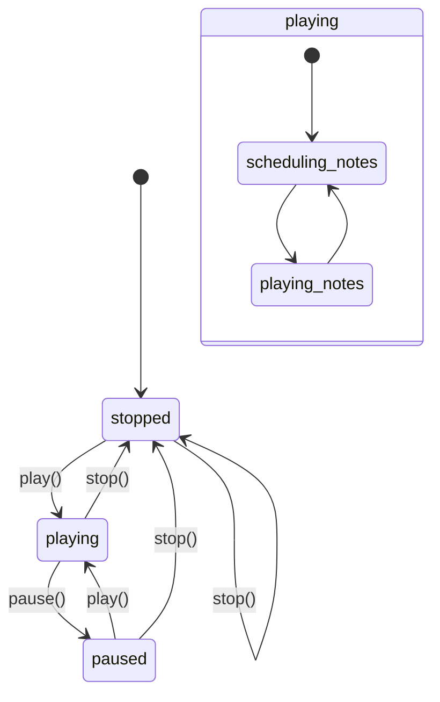
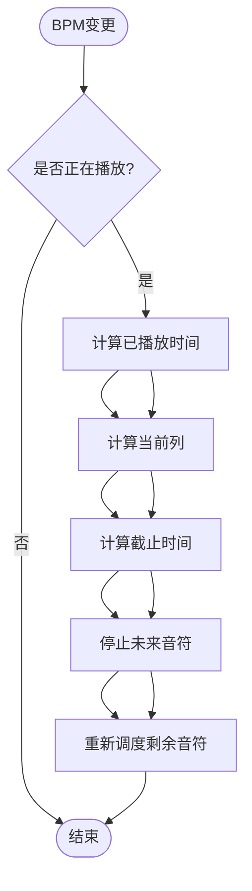
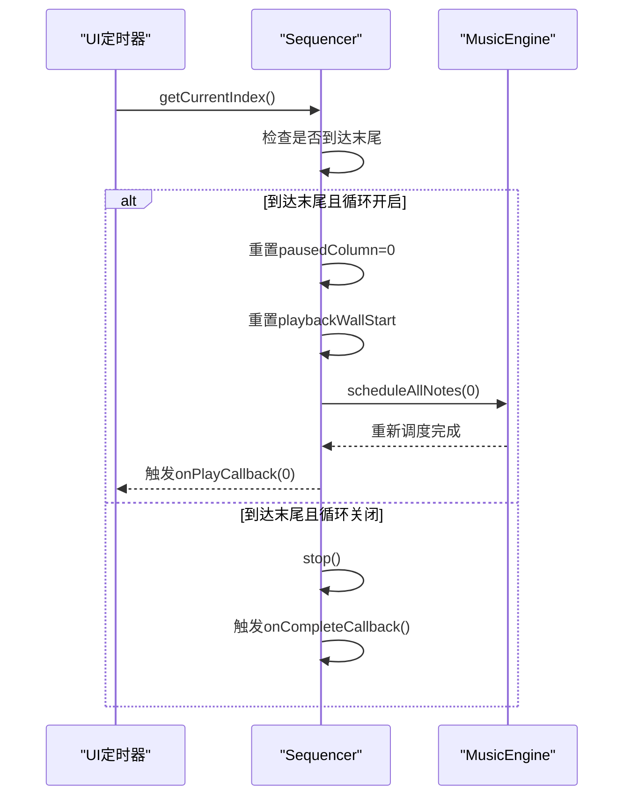
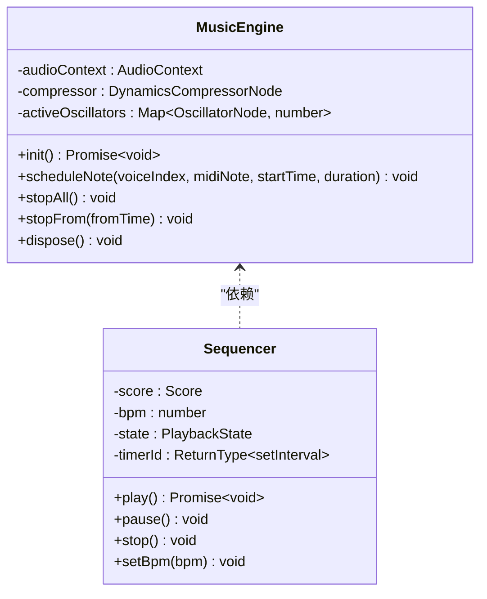
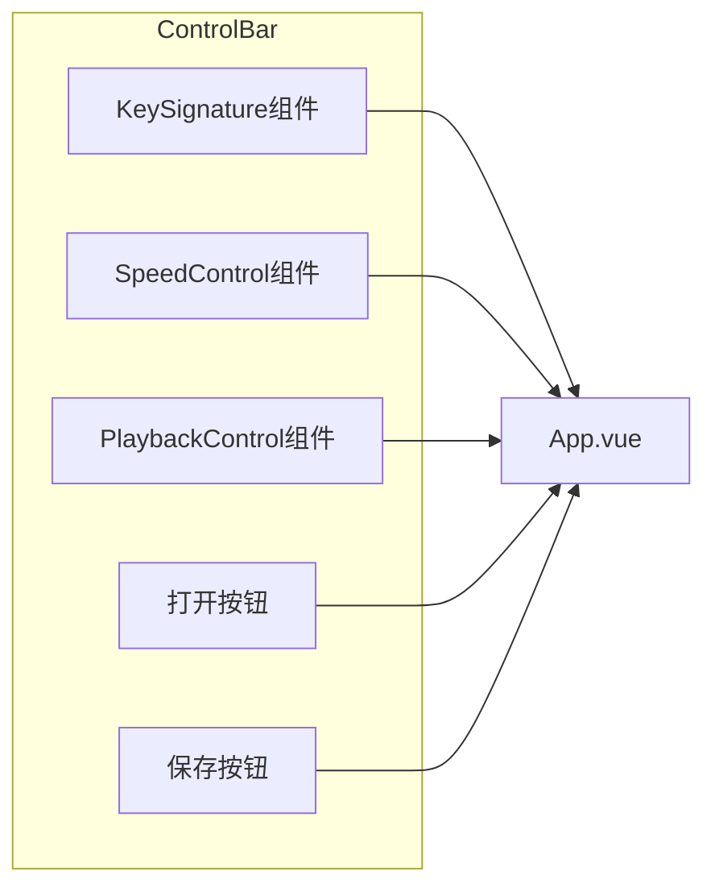
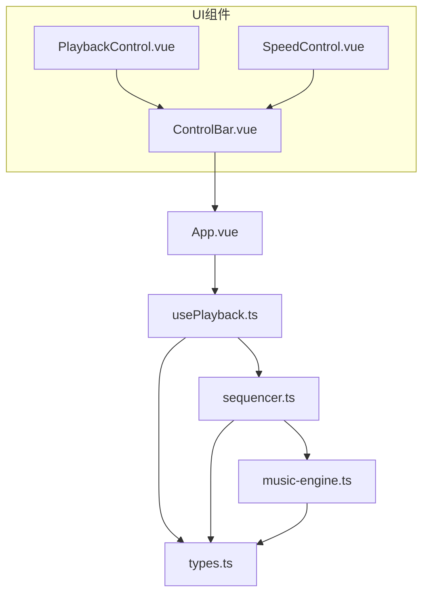
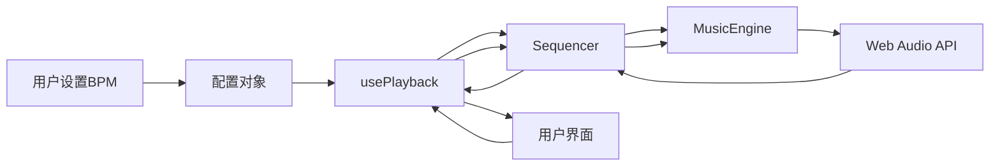

# usePlayback 播放控制API

<cite>
**本文档引用的文件**
- [usePlayback.ts](file://src/composables/usePlayback.ts)
- [music-engine.ts](file://src/core/music-engine.ts)
- [sequencer.ts](file://src/core/sequencer.ts)
- [types.ts](file://src/core/types.ts)
- [PlaybackControl.vue](file://src/components/PlaybackControl.vue)
- [SpeedControl.vue](file://src/components/SpeedControl.vue)
- [ControlBar.vue](file://src/components/ControlBar.vue)
- [App.vue](file://src/App.vue)
</cite>

## 目录
1. [简介](#简介)
2. [项目结构](#项目结构)
3. [核心组件](#核心组件)
4. [架构概览](#架构概览)
5. [详细组件分析](#详细组件分析)
6. [依赖关系分析](#依赖关系分析)
7. [性能考虑](#性能考虑)
8. [故障排除指南](#故障排除指南)
9. [结论](#结论)
10. [附录](#附录)

## 简介

usePlayback 是一个Vue组合式函数，负责管理音乐播放控制功能。它提供了完整的播放生命周期管理，包括播放、暂停、停止、循环控制等功能，并与底层的音乐引擎和序列器进行深度集成。该API设计遵循响应式编程原则，通过Vue的ref和watch机制实现状态同步。

## 项目结构

该项目采用模块化架构，主要分为以下几个层次：



**图表来源**
- [App.vue:1-138](file://src/App.vue#L1-L138)
- [usePlayback.ts:1-95](file://src/composables/usePlayback.ts#L1-L95)
- [sequencer.ts:21-354](file://src/core/sequencer.ts#L21-L354)
- [music-engine.ts:17-221](file://src/core/music-engine.ts#L17-L221)

**章节来源**
- [App.vue:1-138](file://src/App.vue#L1-L138)
- [usePlayback.ts:1-95](file://src/composables/usePlayback.ts#L1-L95)

## 核心组件

usePlayback组合式函数提供了以下核心功能：

### 主要导出接口

| 接口名称 | 类型 | 描述 |
|---------|------|------|
| state | Ref<'stopped' \| 'playing' \| 'paused'> | 当前播放状态 |
| currentColumn | Ref<number> | 当前播放的列索引 |
| loop | Ref<boolean> | 循环播放开关 |
| play | Function | 开始播放乐谱 |
| pause | Function | 暂停当前播放 |
| stop | Function | 停止播放并重置位置 |
| togglePlayPause | Function | 切换播放/暂停状态 |
| seek | Function | 跳转到指定播放列 |
| toggleLoop | Function | 切换循环播放模式 |

### 配置选项

```typescript
interface UsePlaybackOptions {
  /** 乐谱数据（只读） */
  score: DeepReadonly<Score>
  /** 当前 BPM */
  bpm: Ref<number>
  /** 当前调号 */
  keySignature: Ref<KeySignature>
}
```

**章节来源**
- [usePlayback.ts:5-12](file://src/composables/usePlayback.ts#L5-L12)
- [usePlayback.ts:14-94](file://src/composables/usePlayback.ts#L14-L94)

## 架构概览

usePlayback采用分层架构设计，实现了播放控制与音频生成的分离：



**图表来源**
- [usePlayback.ts:46-49](file://src/composables/usePlayback.ts#L46-L49)
- [sequencer.ts:144-167](file://src/core/sequencer.ts#L144-L167)
- [music-engine.ts:41-60](file://src/core/music-engine.ts#L41-L60)

## 详细组件分析

### usePlayback 组合式函数

#### 状态管理机制

usePlayback通过Vue的响应式系统管理播放状态：



**图表来源**
- [usePlayback.ts:17-19](file://src/composables/usePlayback.ts#L17-L19)
- [usePlayback.ts:46-77](file://src/composables/usePlayback.ts#L46-L77)

#### 关键方法详解

##### play() 方法
- **功能**：开始播放乐谱
- **参数**：无
- **返回值**：Promise<void>
- **调用时机**：用户点击播放按钮或程序自动播放
- **内部流程**：
  1. 调用底层序列器的play方法
  2. 等待音频引擎初始化完成
  3. 更新播放状态为'playing'

##### pause() 方法
- **功能**：暂停当前播放
- **参数**：无
- **返回值**：void
- **调用时机**：用户点击暂停按钮
- **内部流程**：
  1. 调用序列器的pause方法
  2. 停止UI定时器
  3. 记录当前播放位置
  4. 立即停止所有预调度的音频

##### stop() 方法
- **功能**：停止播放并重置位置
- **参数**：无
- **返回值**：void
- **调用时机**：用户点击停止按钮或导入新乐谱
- **内部流程**：
  1. 设置播放状态为'stopped'
  2. 重置播放位置为0
  3. 停止UI定时器
  4. 停止所有音频

##### togglePlayPause() 方法
- **功能**：切换播放/暂停状态
- **参数**：无
- **返回值**：Promise<void>
- **调用时机**：用户点击播放/暂停按钮
- **内部逻辑**：根据当前状态决定调用play()还是pause()

##### toggleLoop() 方法
- **功能**：切换循环播放模式
- **参数**：无
- **返回值**：void
- **调用时机**：用户点击循环按钮
- **内部流程**：
  1. 切换loop状态
  2. 调用序列器的setLoop方法

**章节来源**
- [usePlayback.ts:43-82](file://src/composables/usePlayback.ts#L43-L82)

### Sequencer 序列器

#### 实时BPM调整机制

Sequencer实现了智能的BPM实时调整，避免播放中断：



**图表来源**
- [sequencer.ts:84-115](file://src/core/sequencer.ts#L84-L115)
- [music-engine.ts:177-197](file://src/core/music-engine.ts#L177-L197)

#### 循环播放实现

循环播放通过重置播放位置和重新调度音符实现无缝循环：



**图表来源**
- [sequencer.ts:289-303](file://src/core/sequencer.ts#L289-L303)
- [sequencer.ts:292-299](file://src/core/sequencer.ts#L292-L299)

**章节来源**
- [sequencer.ts:144-200](file://src/core/sequencer.ts#L144-L200)
- [sequencer.ts:289-312](file://src/core/sequencer.ts#L289-L312)

### MusicEngine 音乐引擎

#### 预调度播放模式

MusicEngine采用了高效的预调度播放模式，类似于经典的Jingle Bell实现：



**图表来源**
- [music-engine.ts:17-221](file://src/core/music-engine.ts#L17-L221)
- [sequencer.ts:21-50](file://src/core/sequencer.ts#L21-L50)

#### 音符调度算法

每个音符都采用精确的时间调度：

| 参数 | 说明 | 计算方式 |
|------|------|----------|
| 频率 | MIDI音符转换为赫兹 | f = 27.5 × 2^((n-21)/12) × octaveMultiplier |
| 持续时间 | 方波音符时长 | T = 60/(BPM×2) |
| 三角波 | 略短的持续时间 | T × 0.93 |
| 起始时间 | 音频上下文绝对时间 | baseTime + (col-startCol) × interval |

**章节来源**
- [music-engine.ts:90-150](file://src/core/music-engine.ts#L90-L150)

### 用户界面组件

#### 控制条组件

ControlBar组件整合了播放控制、速度控制和循环设置：



**图表来源**
- [ControlBar.vue:27-66](file://src/components/ControlBar.vue#L27-L66)
- [PlaybackControl.vue:16-30](file://src/components/PlaybackControl.vue#L16-L30)

**章节来源**
- [ControlBar.vue:1-116](file://src/components/ControlBar.vue#L1-L116)
- [PlaybackControl.vue:1-111](file://src/components/PlaybackControl.vue#L1-L111)

## 依赖关系分析

### 组件耦合度



**图表来源**
- [App.vue:7-53](file://src/App.vue#L7-L53)
- [usePlayback.ts:1-3](file://src/composables/usePlayback.ts#L1-L3)

### 数据流分析

播放控制的数据流遵循单向数据绑定原则：



**图表来源**
- [App.vue:25-42](file://src/App.vue#L25-L42)
- [usePlayback.ts:33-41](file://src/composables/usePlayback.ts#L33-L41)

**章节来源**
- [App.vue:1-138](file://src/App.vue#L1-L138)
- [usePlayback.ts:14-41](file://src/composables/usePlayback.ts#L14-L41)

## 性能考虑

### 预调度优化

1. **一次性调度**：所有音符在播放开始时一次性调度，避免运行时计算开销
2. **智能停止**：BPM/调号调整时立即 stopAll 丢弃所有声，防抖后从当前指示器列整体重排，杜绝叠加混响
3. **内存管理**：及时清理停止的振荡器，避免内存泄漏

### 实时调整策略（2026-08-30 改）

1. **丢弃重排**：播放中变更时 stopAll 立即丢弃所有声，120ms 防抖（restartTimer）后从当前指示器列整体重排，避免卡顿与混响
2. **时间基准**：restartFromCurrentPosition 重置 playbackWallStart 与调度基准对齐（约 100ms），保证指示器与音频同步
3. **防抖保护**：120ms 防抖合并快速连点/拖动；防抖定时器在 pause()/stop() 中清除

### UI响应优化

1. **定时器间隔**：50ms的UI更新间隔平衡响应性和性能
2. **列变化检测**：只有列号变化时才触发回调，减少不必要的更新
3. **有效长度计算**：跳过空白列，提高播放效率

## 故障排除指南

### 常见问题及解决方案

#### 音频无法播放

**症状**：点击播放按钮无声音
**可能原因**：
1. 浏览器音频上下文处于suspended状态
2. 音频引擎未正确初始化

**解决方法**：
1. 确保在用户手势后调用播放方法
2. 检查浏览器控制台是否有音频初始化错误

#### BPM调整卡顿

**症状**：调整BPM时出现音频中断、混响叠加或指示器错位
**可能原因**：
1. 播放中变更未走 requestPlaybackRestart（stopAll + 防抖重启）
2. 防抖定时器未在暂停/停止时清除，或 playbackWallStart 与调度基准未对齐

**解决方法**：
1. 确认 setBpm 命中 playing 时调用 requestPlaybackRestart
2. 检查 restartTimer 清理与 restartFromCurrentPosition 后的基准对齐（约 100ms）

#### 循环播放异常

**症状**：循环播放时位置不正确
**可能原因**：
1. playbackWallStart未正确重置
2. scheduleAllNotes参数错误

**解决方法**：
1. 检查循环播放时的重置逻辑
2. 确保从第0列重新调度音符

**章节来源**
- [music-engine.ts:49-52](file://src/core/music-engine.ts#L49-L52)
- [sequencer.ts:109](file://src/core/sequencer.ts#L109)
- [sequencer.ts:294](file://src/core/sequencer.ts#L294)

## 结论

usePlayback播放控制API提供了完整的音乐播放解决方案，具有以下特点：

1. **响应式设计**：基于Vue的响应式系统，状态自动同步
2. **高性能实现**：采用预调度模式，确保流畅播放体验
3. **智能调整**：支持实时BPM和调号调整，无感知切换
4. **完整生命周期**：涵盖播放、暂停、停止、循环等完整功能
5. **良好的架构**：清晰的分层设计，便于维护和扩展

该API适合用于音乐创作工具、教学软件等需要高质量音频播放的应用场景。

## 附录

### API使用示例

#### 基本播放控制

```typescript
// 在组件中使用
const { 
  state, 
  currentColumn, 
  loop, 
  play, 
  pause, 
  stop, 
  togglePlayPause,
  seek,
  toggleLoop 
} = usePlayback({
  score: readonlyScore,
  bpm: speedRef,
  keySignature: keySigRef
})

// 监听播放状态变化
watch(state, (newState) => {
  console.log('播放状态:', newState)
})

// 监听当前播放列
watch(currentColumn, (newCol) => {
  console.log('当前列:', newCol)
})
```

#### 与UI组件集成

```vue
<!-- 在模板中使用 -->
<PlaybackControl
  :state="playbackState"
  :loop="loop"
  @play="play"
  @pause="pause"
  @stop="stop"
  @toggle-loop="toggleLoop"
/>
```

### 最佳实践

1. **状态管理**：始终通过usePlayback提供的响应式状态进行播放控制
2. **性能优化**：避免在播放过程中频繁调整BPM，建议使用SpeedControl组件
3. **错误处理**：捕获音频初始化异常，提供用户友好的错误提示
4. **资源清理**：在组件卸载时确保停止播放并清理定时器
5. **用户体验**：提供明确的播放状态反馈和视觉指示