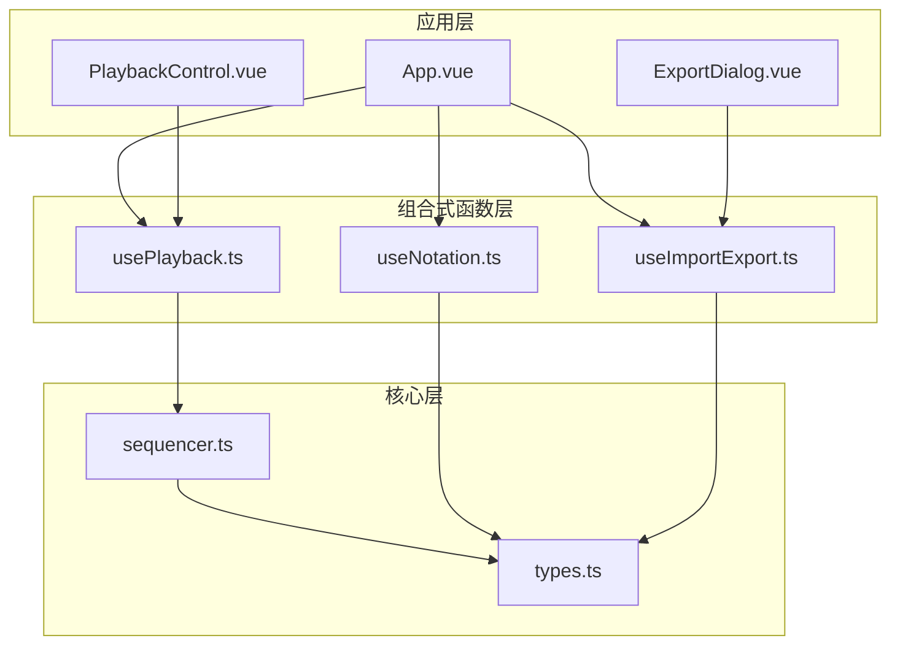
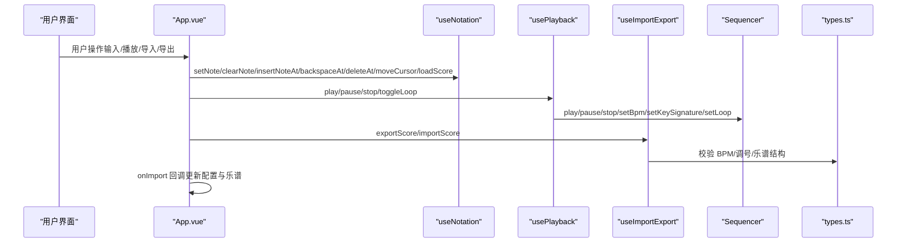
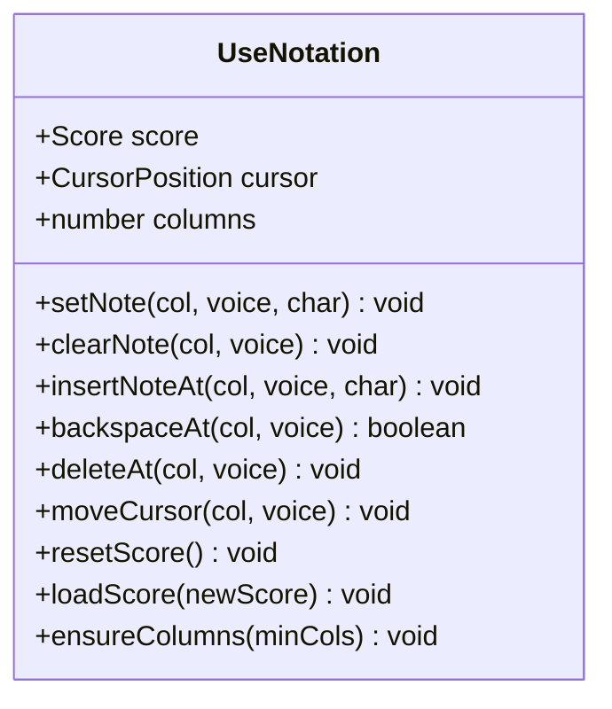
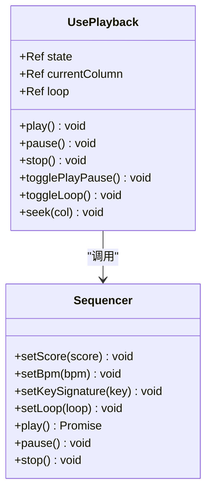
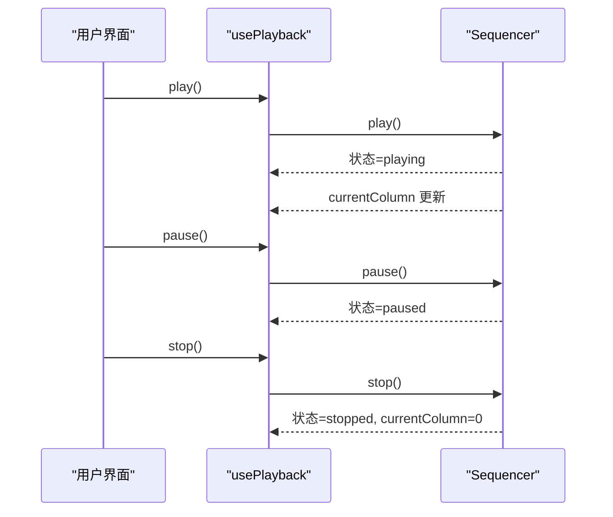
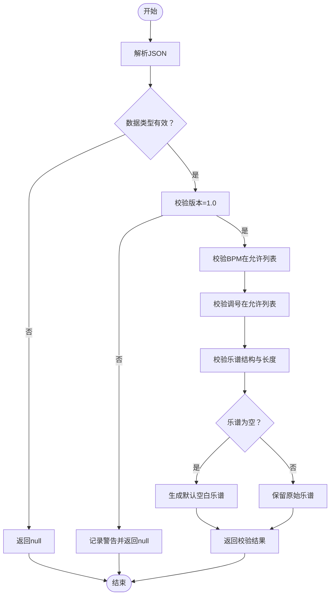
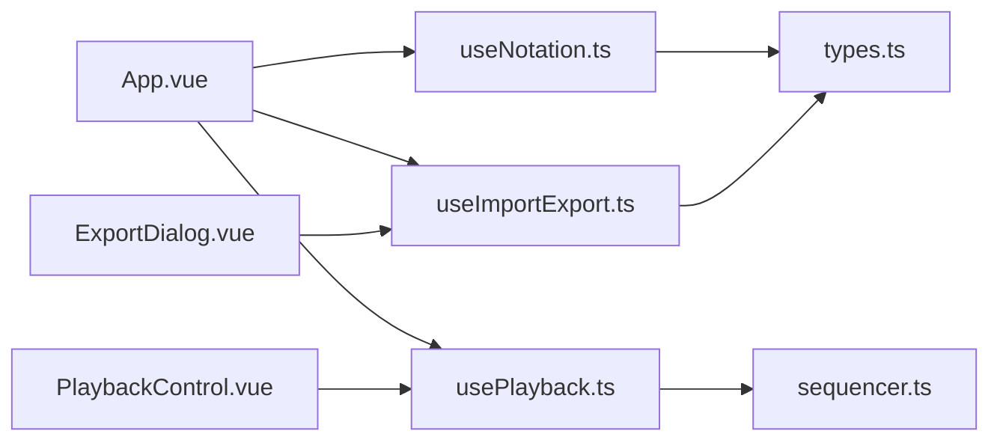

# 组合式函数API

<cite>
**本文引用的文件**
- [useNotation.ts](file://src/composables/useNotation.ts)
- [usePlayback.ts](file://src/composables/usePlayback.ts)
- [useImportExport.ts](file://src/composables/useImportExport.ts)
- [types.ts](file://src/core/types.ts)
- [sequencer.ts](file://src/core/sequencer.ts)
- [App.vue](file://src/App.vue)
- [PlaybackControl.vue](file://src/components/PlaybackControl.vue)
- [ExportDialog.vue](file://src/components/ExportDialog.vue)
</cite>

## 目录
1. [简介](#简介)
2. [项目结构](#项目结构)
3. [核心组件](#核心组件)
4. [架构总览](#架构总览)
5. [详细组件分析](#详细组件分析)
6. [依赖关系分析](#依赖关系分析)
7. [性能考量](#性能考量)
8. [故障排除指南](#故障排除指南)
9. [结论](#结论)
10. [附录](#附录)

## 简介
本文件为组合式函数API的完整参考文档，涵盖以下三个核心组合式函数：
- useNotation：记谱数据管理与光标控制
- usePlayback：播放控制与状态管理
- useImportExport：文件导入导出与数据校验

文档详细记录各API的公共方法与属性、参数类型、返回值、使用示例与最佳实践，并提供错误处理建议与常见问题排查方法。

## 项目结构
本项目采用“组合式函数 + 组件”的架构设计，核心逻辑集中在 src/composables 目录下的组合式函数中，业务组件位于 src/components，类型定义位于 src/core/types.ts，播放引擎与序列器位于 src/core 目录。

图表来源
- [App.vue:1-138](file://src/App.vue#L1-L138)
- [useNotation.ts:1-116](file://src/composables/useNotation.ts#L1-L116)
- [usePlayback.ts:1-95](file://src/composables/usePlayback.ts#L1-L95)
- [useImportExport.ts:1-138](file://src/composables/useImportExport.ts#L1-L138)
- [types.ts:1-164](file://src/core/types.ts#L1-L164)
- [sequencer.ts:1-354](file://src/core/sequencer.ts#L1-L354)
- [PlaybackControl.vue:1-111](file://src/components/PlaybackControl.vue#L1-L111)
- [ExportDialog.vue:1-119](file://src/components/ExportDialog.vue#L1-L119)

章节来源
- [App.vue:1-138](file://src/App.vue#L1-L138)

## 核心组件
本节概述三个组合式函数的核心职责与对外暴露的API。

- useNotation
  - 负责乐谱数据的增删改查、光标移动与重置、乐谱加载等。
  - 对外暴露只读的 score 与 cursor，以及一组操作方法。
- usePlayback
  - 负责播放状态管理、播放/暂停/停止、循环切换、BPM与调号监听。
  - 对外暴露播放状态、当前列、循环标志与控制方法。
- useImportExport
  - 负责乐谱导出为JSON文件、导入JSON文件并进行数据校验。
  - 对外暴露导出与导入方法，导入成功后通过回调注入配置与乐谱。

章节来源
- [useNotation.ts:15-116](file://src/composables/useNotation.ts#L15-L116)
- [usePlayback.ts:14-94](file://src/composables/usePlayback.ts#L14-L94)
- [useImportExport.ts:18-137](file://src/composables/useImportExport.ts#L18-L137)

## 架构总览
组合式函数与组件之间的交互流程如下：

图表来源
- [App.vue:13-100](file://src/App.vue#L13-L100)
- [useNotation.ts:19-101](file://src/composables/useNotation.ts#L19-L101)
- [usePlayback.ts:14-94](file://src/composables/usePlayback.ts#L14-L94)
- [useImportExport.ts:18-137](file://src/composables/useImportExport.ts#L18-L137)
- [sequencer.ts:21-354](file://src/core/sequencer.ts#L21-L354)
- [types.ts:102-158](file://src/core/types.ts#L102-L158)

## 详细组件分析

### useNotation 组合式函数
- 作用域
  - 管理乐谱二维数组（列×三声部），维护光标位置，提供记谱编辑与加载能力。
- 数据模型
  - Score：列数组，每列含三个声部的记谱字符串。
  - CursorPosition：包含列索引与声部索引。
  - VoiceIndex：0/1/2，分别对应主旋律、和弦律、低频。
- 关键方法与属性
  - 属性
    - score：只读乐谱数组
    - cursor：只读光标对象
    - columns：列数
  - 方法
    - setNote(col: number, voice: VoiceIndex, char: string)：设置指定列声部的音符字符
    - clearNote(col: number, voice: VoiceIndex)：清空指定列声部
    - insertNoteAt(col: number, voice: VoiceIndex, char: string)：在指定列插入音符，右侧同声部右移
    - backspaceAt(col: number, voice: VoiceIndex): boolean：在指定列执行退格，左侧同声部左移填补
    - deleteAt(col: number, voice: VoiceIndex)：删除指定列声部（不触发位移）
    - moveCursor(col: number, voice: VoiceIndex)：移动光标至指定位置
    - resetScore()：清空全部列并重置光标
    - loadScore(newScore: Score)：加载新乐谱，自动补齐默认列数并重置光标
    - ensureColumns(minCols: number)：确保乐谱至少拥有指定列数，不足部分用空白列补齐

- 参数与返回值
  - setNote/clearNote/deleteAt：无返回值
  - insertNoteAt：无返回值
  - backspaceAt：返回布尔值，表示是否成功执行
  - moveCursor：无返回值
  - resetScore/loadScore：无返回值

- 使用示例（路径）
  - 设置音符：[App.vue:66-68](file://src/App.vue#L66-L68)
  - 插入音符：[App.vue:74-76](file://src/App.vue#L74-L76)
  - 退格删除：[App.vue:78-80](file://src/App.vue#L78-L80)
  - 删除音符：[App.vue:82-84](file://src/App.vue#L82-L84)
  - 移动光标：[App.vue:62-64](file://src/App.vue#L62-L64)
  - 重置与加载：[App.vue:22-23](file://src/App.vue#L22-L23)

- 输入验证与约束
  - 仅允许合法记谱字符（数字、升降号、八度修饰符、延音线、空格），由上层组件在输入层验证。
  - 边界检查：列索引必须在有效范围内；声部索引限制在0~2。

- 最佳实践
  - 在执行插入/退格操作前，先确认光标位置。
  - 批量修改乐谱时，优先使用 loadScore 进行整体替换，避免逐列更新带来的多次响应式开销。
  - 导入外部乐谱时，确保调用 loadScore 后重置光标，保持UI一致性。

章节来源
- [useNotation.ts:15-116](file://src/composables/useNotation.ts#L15-L116)
- [types.ts:47-66](file://src/core/types.ts#L47-L66)

#### 类图：useNotation 内部结构

图表来源
- [useNotation.ts:15-116](file://src/composables/useNotation.ts#L15-L116)

### usePlayback 组合式函数
- 作用域
  - 将乐谱、BPM、调号与播放状态解耦，通过序列器驱动播放。
- 关键类型
  - UsePlaybackOptions：包含只读乐谱、BPM引用、调号引用。
  - PlaybackState：'stopped' | 'playing' | 'paused'
- 关键方法与属性
  - 属性
    - state：播放状态
    - currentColumn：当前播放列
    - loop：循环标志
  - 方法
    - play()：异步开始播放
    - pause()：暂停播放
    - stop()：停止播放并重置列
    - togglePlayPause()：切换播放/暂停
    - toggleLoop()：切换循环
    - seek(col: number)：跳转到指定列

- 参数与返回值
  - play/pause/stop/togglePlayPause/toggleLoop：均无返回值

- 使用示例（路径）
  - 控制播放：[App.vue:34-37](file://src/App.vue#L34-L37)
  - 组件交互：[PlaybackControl.vue:16-30](file://src/components/PlaybackControl.vue#L16-L30)

- 与序列器的协作
  - 初始化时设置乐谱并注册播放回调，监听BPM与调号变化以动态调整。
  - 播放过程中通过UI定时器更新 currentColumn，完成时重置状态与列。

- 最佳实践
  - 在导入乐谱或切换BPM/调号后，确保序列器已同步最新配置。
  - 暂停/停止前先停止播放，避免残留音频。
  - 循环播放时注意UI重置逻辑，确保指示器回到起点。

章节来源
- [usePlayback.ts:14-94](file://src/composables/usePlayback.ts#L14-L94)
- [types.ts:71-72](file://src/core/types.ts#L71-L72)
- [sequencer.ts:21-354](file://src/core/sequencer.ts#L21-L354)

#### 类图：usePlayback 与 Sequencer

图表来源
- [usePlayback.ts:14-94](file://src/composables/usePlayback.ts#L14-L94)
- [sequencer.ts:21-354](file://src/core/sequencer.ts#L21-L354)

#### 时序图：播放控制流程

图表来源
- [usePlayback.ts:46-66](file://src/composables/usePlayback.ts#L46-L66)
- [sequencer.ts:144-200](file://src/core/sequencer.ts#L144-L200)

### useImportExport 组合式函数
- 作用域
  - 提供乐谱导出为JSON文件与导入JSON文件的能力，并进行数据校验。
- 关键类型
  - UseImportExportOptions：包含当前BPM、调号、乐谱与导入回调。
  - ExportData：导出数据结构，包含版本、标题、简介、BPM、调号与乐谱。
- 关键方法与属性
  - 方法
    - exportScore(title: string, description: string): void
    - importScore(): void
  - 属性
    - 无公开属性

- 参数与返回值
  - exportScore：无返回值
  - importScore：无返回值

- 数据校验规则（validateData）
  - 版本：必须为'1.0'
  - BPM：必须在预定义列表中，否则回退为默认值
  - 调号：必须在允许列表中，否则回退为默认值
  - 乐谱：必须为二维数组，每列含三个字符串，空列用空格填充
  - 音符：旧格式记谱值（数字在前）经 migrateNoteValue 自动迁移（幂等）
  - 乐谱为空时，生成默认列数（125列）的空白乐谱

- 使用示例（路径）
  - 导出：[App.vue:91-94](file://src/App.vue#L91-L94)
  - 导入：[App.vue:96-99](file://src/App.vue#L96-L99)
  - 导入对话框：[ExportDialog.vue:17-24](file://src/components/ExportDialog.vue#L17-L24)

- 错误处理
  - 导入失败时捕获异常并提示用户“文件格式错误”
  - 校验失败时返回null，导入流程中应忽略无效数据

- 最佳实践
  - 导出前暂停播放，避免导出时播放状态影响
  - 导入后通过回调统一更新BPM、调号与乐谱，保证状态一致
  - 标题中包含非法字符时自动清理，确保文件名安全

章节来源
- [useImportExport.ts:18-137](file://src/composables/useImportExport.ts#L18-L137)
- [types.ts:145-158](file://src/core/types.ts#L145-L158)
- [types.ts:113-138](file://src/core/types.ts#L113-L138)
- [types.ts:98-99](file://src/core/types.ts#L98-L99)

#### 流程图：导入数据校验

图表来源
- [useImportExport.ts:84-131](file://src/composables/useImportExport.ts#L84-L131)

## 依赖关系分析
- 组合式函数间依赖
  - usePlayback 依赖 sequencer.ts 提供的播放引擎
  - useNotation 与 useImportExport 依赖 types.ts 中的数据类型与常量
- 组件与组合式函数
  - App.vue 统一协调三个组合式函数，并通过事件与回调实现数据流闭环
  - PlaybackControl.vue 与 ExportDialog.vue 分别消费 usePlayback 与 useImportExport 的状态与方法

图表来源
- [App.vue:1-138](file://src/App.vue#L1-L138)
- [useNotation.ts:1-116](file://src/composables/useNotation.ts#L1-L116)
- [usePlayback.ts:1-95](file://src/composables/usePlayback.ts#L1-L95)
- [useImportExport.ts:1-138](file://src/composables/useImportExport.ts#L1-L138)
- [types.ts:1-164](file://src/core/types.ts#L1-L164)
- [sequencer.ts:1-354](file://src/core/sequencer.ts#L1-L354)
- [PlaybackControl.vue:1-111](file://src/components/PlaybackControl.vue#L1-L111)
- [ExportDialog.vue:1-119](file://src/components/ExportDialog.vue#L1-L119)

章节来源
- [App.vue:1-138](file://src/App.vue#L1-L138)

## 性能考量
- 响应式更新
  - useNotation 使用 reactive/readonly 管理乐谱与光标，减少不必要的深拷贝
  - usePlayback 通过 watch 监听 BPM 与调号，按需触发序列器更新
- 播放调度
  - sequencer 采用一次性预调度所有音符的策略，降低UI轮询频率与CPU占用
  - 实时切换 BPM/调号时，仅停止未来音符并从下一列重新调度，避免卡顿
- 导入导出
  - 导出使用 Blob 与 URL.createObjectURL，完成后及时释放内存
  - 导入采用异步读取与解析，避免阻塞主线程

## 故障排除指南
- 导入失败
  - 现象：弹出“文件格式错误”提示
  - 排查：确认文件为 .json 或 .subor.json，且包含合法的 ExportData 结构
  - 处理：修正文件格式或选择正确的文件类型
- BPM/调号异常
  - 现象：播放音高或速度不符合预期
  - 排查：检查 BPM 是否在允许列表内，调号是否在允许列表内
  - 处理：使用允许值或回退到默认值
- 乐谱为空
  - 现象：播放无声音或播放指示器不动
  - 排查：确认乐谱是否为空或仅包含空格
  - 处理：使用 loadScore 导入有效乐谱或生成默认空白乐谱
- 播放卡顿
  - 现象：切换 BPM/调号时出现短暂卡顿
  - 排查：确认未频繁触发切换操作
  - 处理：避免快速连续切换，等待当前切换完成

章节来源
- [useImportExport.ts:72-76](file://src/composables/useImportExport.ts#L72-L76)
- [useImportExport.ts:98-107](file://src/composables/useImportExport.ts#L98-L107)
- [useImportExport.ts:126-128](file://src/composables/useImportExport.ts#L126-L128)
- [sequencer.ts:89-114](file://src/core/sequencer.ts#L89-L114)

## 结论
本组合式函数API提供了清晰的记谱数据管理、播放控制与文件导入导出能力。通过严格的类型约束与数据校验，确保了系统的稳定性与可维护性。建议在实际使用中遵循最佳实践，合理组织数据流与状态更新，以获得流畅的用户体验。

## 附录
- 常用数据结构
  - Score：列数组，每列含三个声部的记谱字符串
  - Column：[string, string, string]
  - CursorPosition：{ col: number; voice: VoiceIndex }
  - VoiceIndex：0 | 1 | 2
  - PlaybackState：'stopped' | 'playing' | 'paused'
  - ExportData：包含版本、标题、简介、BPM、调号与乐谱
- 常量
  - DEFAULT_COLUMNS：默认列数
  - BPM_LIST：允许的BPM列表
  - KEY_SIGNATURES：允许的调号列表
  - EXPORT_MIME_TYPE：导出文件MIME类型