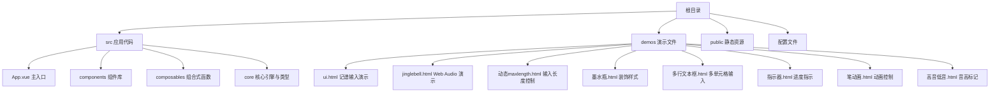
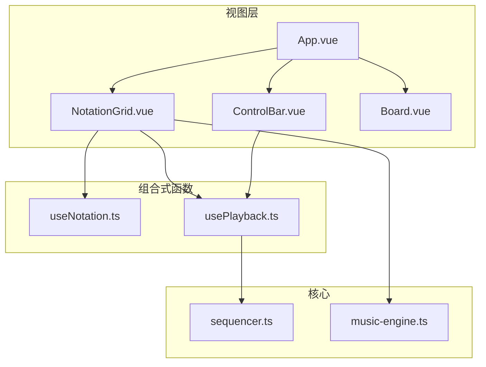
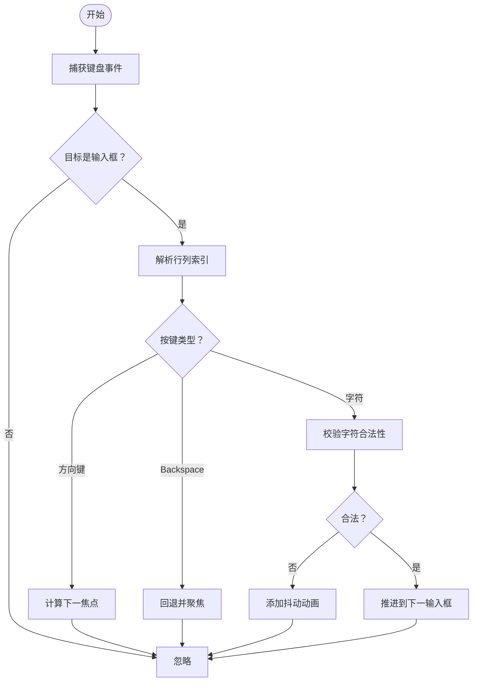
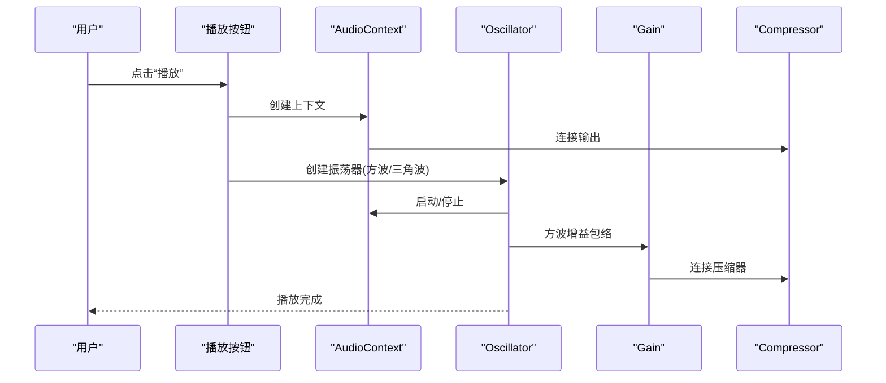
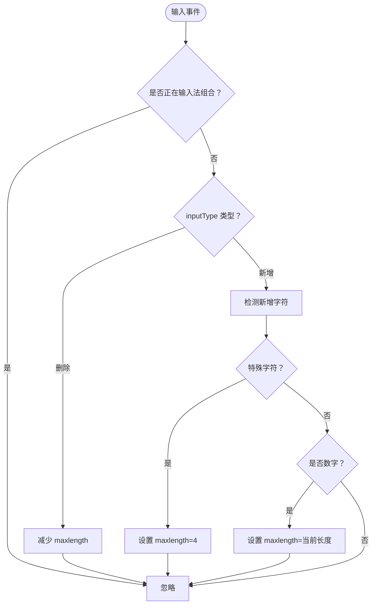
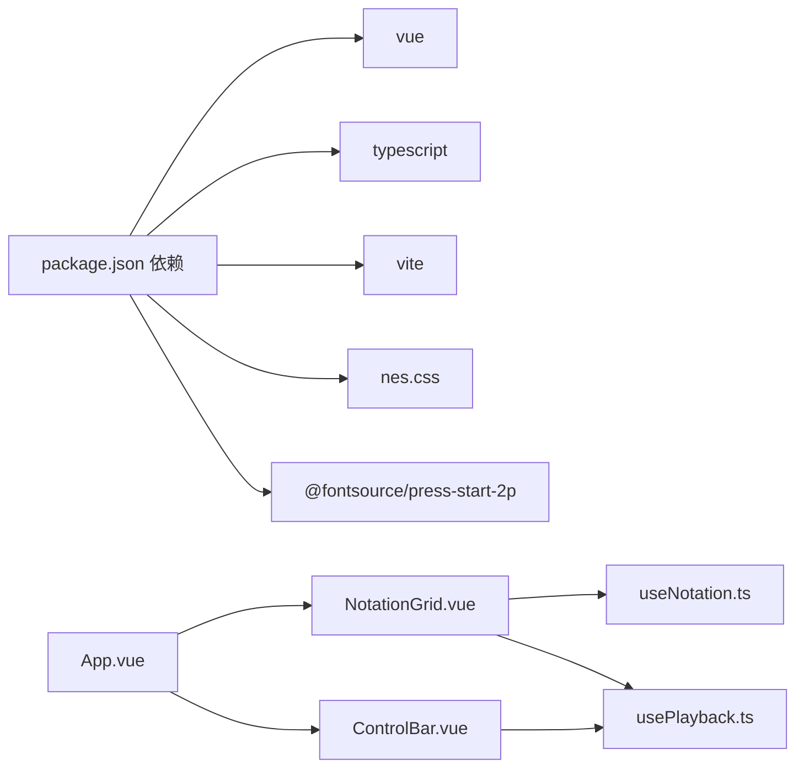

# 开发工具与演示

<cite>
**本文引用的文件**
- [README.md](file://README.md)
- [package.json](file://package.json)
- [src/App.vue](file://src/App.vue)
- [src/components/Board.vue](file://src/components/Board.vue)
- [src/components/NotationGrid.vue](file://src/components/NotationGrid.vue)
- [src/components/ControlBar.vue](file://src/components/ControlBar.vue)
- [src/composables/useNotation.ts](file://src/composables/useNotation.ts)
- [src/composables/usePlayback.ts](file://src/composables/usePlayback.ts)
- [demos/ui.html](file://demos/ui.html)
- [demos/jinglebell.html](file://demos/jinglebell.html)
- [demos/动态maxlength.html](file://demos/动态maxlength.html)
- [demos/墨水瓶.html](file://demos/墨水瓶.html)
- [demos/多行文本框.html](file://demos/多行文本框.html)
- [demos/指示器.html](file://demos/指示器.html)
- [demos/笔动画.html](file://demos/笔动画.html)
- [demos/高音低音.html](file://demos/高音低音.html)
</cite>

## 目录
1. [简介](#简介)
2. [项目结构](#项目结构)
3. [核心组件](#核心组件)
4. [架构总览](#架构总览)
5. [详细组件分析](#详细组件分析)
6. [依赖关系分析](#依赖关系分析)
7. [性能考虑](#性能考虑)
8. [故障排查指南](#故障排查指南)
9. [结论](#结论)
10. [附录](#附录)

## 简介
本指南面向希望深入理解与调试“音乐板”项目开发流程的工程师与设计人员。项目包含两类重要资源：
- 演示文件：涵盖 UI 组件测试、表单输入与键盘导航、动画效果、Web Audio API 使用、CSS 动态属性控制等，便于快速验证交互与视觉表现。
- 核心应用：基于 Vue 3 + TypeScript 的完整记谱输入界面，包含记谱网格、播放控制、导入导出、组合式函数等模块。

通过演示文件，你可以：
- 快速验证输入行为（如方向键导航、音符覆盖与空格插入、Backspace/Delete 语义）
- 观察动画与过渡效果（书写动画、抖动提示、墨水瓶装饰）
- 学习 Web Audio API 的基础用法（振荡器合成）
- 掌握复杂输入场景下的状态管理与性能优化策略

## 项目结构
项目采用前端单页应用结构，核心代码位于 src 目录，演示文件位于 demos 目录。根目录提供脚手架与依赖配置。

图表来源
- [src/App.vue:1-138](file://src/App.vue#L1-L138)
- [src/components/Board.vue:1-47](file://src/components/Board.vue#L1-L47)
- [src/components/NotationGrid.vue:1-292](file://src/components/NotationGrid.vue#L1-L292)
- [src/components/ControlBar.vue:1-116](file://src/components/ControlBar.vue#L1-L116)
- [demos/ui.html:1-286](file://demos/ui.html#L1-L286)
- [demos/jinglebell.html:1-83](file://demos/jinglebell.html#L1-L83)

章节来源
- [README.md:1-6](file://README.md#L1-L6)
- [package.json:1-25](file://package.json#L1-L25)

## 核心组件
- 应用入口与布局
  - App.vue：装配记谱网格、控制栏、导出对话框，协调记谱与播放状态。
  - Board.vue：提供统一的外框与标题容器，承载主内容区域。
- 记谱网格
  - NotationGrid.vue：渲染网格、处理键盘导航、输入队列、书写动画、播放音符。
- 控制栏
  - ControlBar.vue：速度、调号、播放控制、导入导出。
- 组合式函数
  - useNotation.ts：记谱数据结构、光标移动、覆盖写入/空格插入/回删/清空语义。
  - usePlayback.ts：播放状态、循环、BPM/调号联动、序列器集成。

章节来源
- [src/App.vue:1-138](file://src/App.vue#L1-L138)
- [src/components/Board.vue:1-47](file://src/components/Board.vue#L1-L47)
- [src/components/NotationGrid.vue:1-292](file://src/components/NotationGrid.vue#L1-L292)
- [src/components/ControlBar.vue:1-116](file://src/components/ControlBar.vue#L1-L116)
- [src/composables/useNotation.ts:1-116](file://src/composables/useNotation.ts#L1-L116)
- [src/composables/usePlayback.ts:1-95](file://src/composables/usePlayback.ts#L1-L95)

## 架构总览
应用采用“视图组件 + 组合式函数 + 核心引擎”的分层架构。NotationGrid 作为中枢，接收用户输入，驱动 useNotation 与 usePlayback，同时协调 Quill 动画与音乐引擎。

图表来源
- [src/App.vue:1-138](file://src/App.vue#L1-L138)
- [src/components/NotationGrid.vue:1-292](file://src/components/NotationGrid.vue#L1-L292)
- [src/components/ControlBar.vue:1-116](file://src/components/ControlBar.vue#L1-L116)
- [src/composables/useNotation.ts:1-116](file://src/composables/useNotation.ts#L1-L116)
- [src/composables/usePlayback.ts:1-95](file://src/composables/usePlayback.ts#L1-L95)

## 详细组件分析

### 记谱输入演示（ui.html）
- 功能概述
  - 构建一个可编辑的记谱网格，支持三声部输入、方向键导航、自动聚焦推进、字符校验与抖动反馈、羽毛笔书写动画。
- 关键实现点
  - DOM 结构：使用列表项与输入框模拟网格单元，通过 data-index 标识行列索引。
  - 输入校验：仅允许 a-g、1-7、空格等合法字符，非法输入触发动画抖动。
  - 焦点推进：根据按键与边界条件计算下一个输入框，避免越界。
  - 动画与位置：书写动画完成后推进到下一格，同时更新羽毛笔位置。
- 调试要点
  - 使用浏览器开发者工具观察事件监听器与动画回调，确认焦点推进与抖动触发时机。
  - 在输入校验处设置断点，验证正则过滤与边界条件分支。

图表来源
- [demos/ui.html:166-213](file://demos/ui.html#L166-L213)
- [demos/ui.html:215-253](file://demos/ui.html#L215-L253)

章节来源
- [demos/ui.html:1-286](file://demos/ui.html#L1-L286)

### Web Audio 振荡器演示（jinglebell.html）
- 功能概述
  - 使用原生 Web Audio API 生成纯音阶，无外部音频资源，通过振荡器与压缩器合成音乐片段。
- 关键实现点
  - 音频上下文：兼容旧版 webkitAudioContext 与标准 AudioContext。
  - 频率映射：字母 a-g 与数字 1-7 映射到对应频率，支持八度调节。
  - 类型选择：三角波与方波分别处理，方波加入增益包络。
  - 播放调度：按固定节拍间隔依次播放字符串片段。
- 调试要点
  - 打开开发者工具的“网络”面板，确认无额外音频请求。
  - 在“音频”面板检查节点连接与增益曲线，验证压缩器与音量包络。

图表来源
- [demos/jinglebell.html:16-79](file://demos/jinglebell.html#L16-L79)

章节来源
- [demos/jinglebell.html:1-83](file://demos/jinglebell.html#L1-L83)

### 动态 maxlength 演示（动态maxlength.html）
- 功能概述
  - 根据输入内容动态调整输入框的最大长度，结合输入事件与 composition 事件避免 IME 干扰。
- 关键实现点
  - 输入事件：区分删除与新增，按规则调整 maxlength。
  - 特殊字符：逗号、句号、#、b 等触发最大长度提升。
  - 数字输入：根据当前值长度设置 maxlength，限制连续输入。
- 调试要点
  - 在输入事件中打印 e.inputType 与 e.data，确认删除/新增分支。
  - 使用移动端或 IME 场景复测，确保 composition 事件被正确跳过。

图表来源
- [demos/动态maxlength.html:11-29](file://demos/动态maxlength.html#L11-L29)

章节来源
- [demos/动态maxlength.html:1-32](file://demos/动态maxlength.html#L1-L32)

### 多行文本框演示（多行文本框.html）
- 功能概述
  - 大规模输入网格，支持方向键导航、字符校验、抖动提示、书写动画与队列推进。
- 关键实现点
  - DOM 生成：通过数组映射批量生成大量输入框，提升渲染效率。
  - 动画队列：书写动画进行期间缓存后续输入，动画结束再逐条处理。
  - 抖动反馈：非法字符时添加动画类，动画结束自动清理。
- 调试要点
  - 观察动画 end 回调与队列长度，确保输入顺序与动画节奏一致。
  - 在边界条件（首尾行、最后单元格）测试焦点推进与输入终止。

章节来源
- [demos/多行文本框.html:74-166](file://demos/多行文本框.html#L74-L166)

### 指示器演示（指示器.html）
- 功能概述
  - 循环显示当前项的进度指示器，支持空格键切换播放/暂停。
- 关键实现点
  - CSS 变量与渐变背景实现指示器样式。
  - JavaScript 定时器轮转当前项，支持循环复位。
- 调试要点
  - 在定时器中打印索引与 DOM 状态，确认切换逻辑与边界复位。

章节来源
- [demos/指示器.html:60-92](file://demos/指示器.html#L60-L92)

### 笔动画演示（笔动画.html）
- 功能概述
  - 展示羽毛笔书写与蘸墨两种动画，通过类名切换与 requestAnimationFrame 触发。
- 关键实现点
  - CSS 动画定义：书写与蘸墨关键帧，配合伪元素与背景图。
  - JS 触发：移除旧动画类，强制回流后添加新类，确保重播。
- 调试要点
  - 使用“元素”面板观察伪元素与 transform 变化，确认动画触发路径。

章节来源
- [demos/笔动画.html:59-75](file://demos/笔动画.html#L59-L75)

### 墨水瓶装饰（墨水瓶.html）
- 功能概述
  - 使用 CSS 渐变与伪元素绘制“墨水瓶”装饰，强调文字的立体感与阴影。
- 关键实现点
  - 渐变背景与阴影组合实现立体效果。
  - 伪元素 ::before/::after 实现倒三角与横线装饰。
- 调试要点
  - 在“样式”面板调整颜色变量，观察渐变与阴影对齐情况。

章节来源
- [demos/墨水瓶.html:7-45](file://demos/墨水瓶.html#L7-L45)

### 高音低音标记（高音低音.html）
- 功能概述
  - 通过 CSS 伪元素在音符上方/下方标注“高音/低音”标记，使用特定字体增强复古风格。
- 关键实现点
  - 字体与样式引入，伪元素定位与变换。
- 调试要点
  - 检查字体加载与伪元素坐标，确保标记与音符对齐。

章节来源
- [demos/高音低音.html:1-75](file://demos/高音低音.html#L1-L75)

## 依赖关系分析
- 应用依赖
  - Vue 3、TypeScript、Vite 提供运行与构建能力。
  - nes.css 与 Press Start 2P 字体提供复古 UI 风格。
- 组件间耦合
  - App.vue 作为编排者，NotationGrid 与 ControlBar 通过事件与模型双向绑定协作。
  - useNotation 与 usePlayback 分别负责数据与播放，彼此解耦，通过核心引擎与序列器协同。

图表来源
- [package.json:11-23](file://package.json#L11-L23)
- [src/App.vue:1-138](file://src/App.vue#L1-L138)
- [src/components/NotationGrid.vue:1-292](file://src/components/NotationGrid.vue#L1-L292)
- [src/components/ControlBar.vue:1-116](file://src/components/ControlBar.vue#L1-L116)
- [src/composables/useNotation.ts:1-116](file://src/composables/useNotation.ts#L1-L116)
- [src/composables/usePlayback.ts:1-95](file://src/composables/usePlayback.ts#L1-L95)

章节来源
- [package.json:1-25](file://package.json#L1-L25)

## 性能考虑
- DOM 操作最小化
  - 大规模网格建议使用虚拟滚动或分块渲染，避免一次性创建过多节点。
- 动画与重绘
  - 使用 will-change 与 transform 替代改变布局属性，减少强制同步布局。
- 事件处理
  - 对高频事件（如输入、键盘）使用防抖/节流，避免重复计算。
- 音频性能
  - 合理复用振荡器与增益节点，避免频繁创建销毁导致 GC 抖动。
- 资源加载
  - 将大图片与字体懒加载，减少首屏阻塞。

## 故障排查指南
- 输入行为异常
  - 确认事件监听目标为 INPUT，方向键导航是否受长按重复事件影响。
  - 在输入校验处设置断点，检查正则匹配与边界条件。
- 动画不同步
  - 检查动画 end 回调是否被多次触发，确认队列长度与消费逻辑。
  - 使用开发者工具的“性能”面板录制动画帧，观察重排与重绘热点。
- 音频无声或失真
  - 确认音频上下文已激活且节点链路完整，检查压缩器与增益参数。
- 样式错位
  - 检查伪元素与 transform 的坐标系，确认盒模型与视口单位。
- 调试技巧
  - 使用“元素”面板查看实时样式与布局信息。
  - 使用“控制台”执行关键函数，验证状态变更与副作用。
  - 使用“网络”面板确认静态资源与字体加载情况。

## 结论
演示文件提供了从输入行为、动画效果到音频合成的完整验证路径，能够帮助你快速定位问题、理解组件交互与优化性能。结合核心应用的组件与组合式函数，你可以系统地掌握记谱输入、播放控制与状态管理的最佳实践。

## 附录
- 快速启动
  - 安装依赖：npm install
  - 开发预览：npm run dev
  - 生产构建：npm run build
- 常用端口
  - 默认开发服务器端口由 Vite 管理，可在配置中调整。

章节来源
- [README.md:1-6](file://README.md#L1-L6)
- [package.json:6-10](file://package.json#L6-L10)