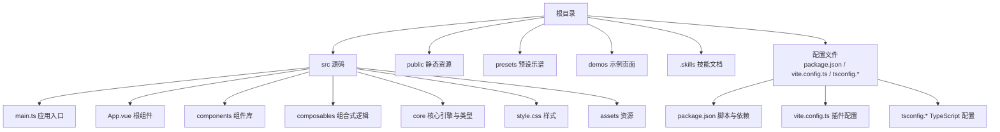
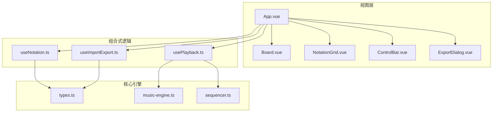
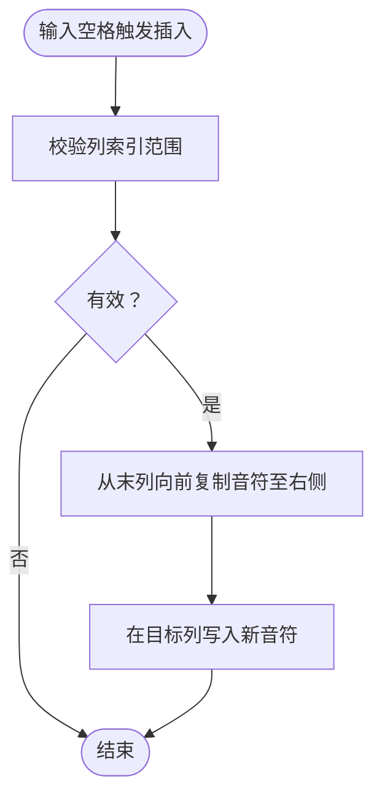
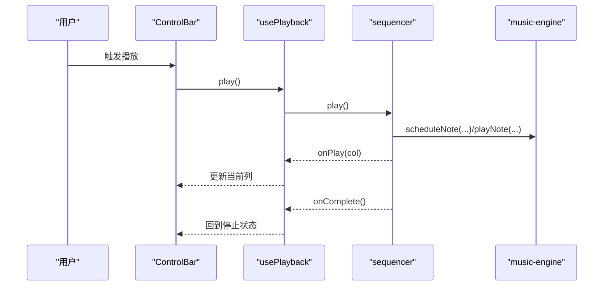
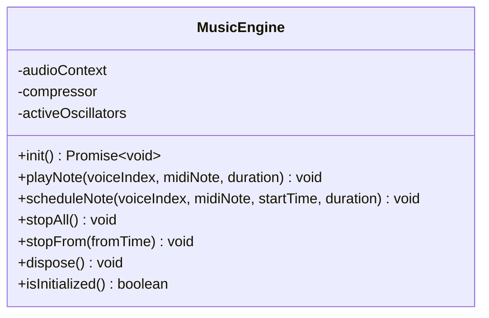
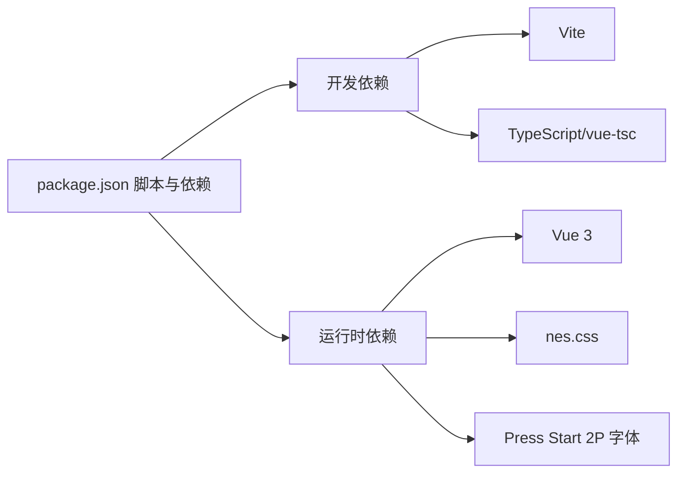

# 快速开始

<cite>
**本文引用的文件**
- [README.md](file://README.md)
- [package.json](file://package.json)
- [vite.config.ts](file://vite.config.ts)
- [index.html](file://index.html)
- [src/main.ts](file://src/main.ts)
- [src/App.vue](file://src/App.vue)
- [src/components/Board.vue](file://src/components/Board.vue)
- [src/composables/useNotation.ts](file://src/composables/useNotation.ts)
- [src/composables/usePlayback.ts](file://src/composables/usePlayback.ts)
- [src/core/music-engine.ts](file://src/core/music-engine.ts)
- [src/core/types.ts](file://src/core/types.ts)
- [src/style.css](file://src/style.css)
- [tsconfig.json](file://tsconfig.json)
- [presets/jingle-bell.subor.json](file://presets/jingle-bell.subor.json)
- [presets/twinkle-star.subor.json](file://presets/twinkle-star.subor.json)
- [presets/coffin-dance.subor.json](file://presets/coffin-dance.subor.json)
</cite>

## 目录
1. [简介](#简介)
2. [项目结构](#项目结构)
3. [核心组件](#核心组件)
4. [架构总览](#架构总览)
5. [详细组件分析](#详细组件分析)
6. [依赖分析](#依赖分析)
7. [性能考虑](#性能考虑)
8. [故障排除指南](#故障排除指南)
9. [结论](#结论)
10. [附录](#附录)

## 简介
SUBOR Music Board 是一个基于 Vue 3 + TypeScript + Vite 的网页音乐创作工具，采用三声部合成与 Web Audio API 实现复古风格的电子音乐演奏体验。通过可视化网格记谱界面，用户可以快速创建、编辑与播放自己的音乐作品，并支持导入/导出标准格式文件。

## 项目结构
该仓库采用前端单页应用（SPA）结构，核心源码位于 src 目录，构建与运行由 Vite 驱动，依赖管理与脚本定义在 package.json 中。

图表来源
- [package.json:1-25](file://package.json#L1-L25)
- [vite.config.ts:1-8](file://vite.config.ts#L1-L8)
- [src/main.ts:1-8](file://src/main.ts#L1-L8)
- [src/App.vue:1-138](file://src/App.vue#L1-L138)

章节来源
- [README.md:1-6](file://README.md#L1-L6)
- [package.json:1-25](file://package.json#L1-L25)
- [vite.config.ts:1-8](file://vite.config.ts#L1-L8)
- [tsconfig.json:1-8](file://tsconfig.json#L1-L8)

## 核心组件
- 应用入口与挂载
  - 入口文件负责创建 Vue 应用、引入字体与样式、挂载根组件。
  - 参考路径：[src/main.ts:1-8](file://src/main.ts#L1-L8)
- 根组件与布局
  - 根组件聚合记谱网格、控制栏与导出对话框，协调记谱、播放与导入导出逻辑。
  - 参考路径：[src/App.vue:1-138](file://src/App.vue#L1-L138)
- 主面板容器
  - 提供统一的边框与阴影视觉风格，承载子组件。
  - 参考路径：[src/components/Board.vue:1-47](file://src/components/Board.vue#L1-L47)
- 记谱与输入
  - 提供音符/延音线覆盖写入、空格插入、光标移动、音符设置/清除、回删/清空等能力。
  - 参考路径：[src/composables/useNotation.ts:1-116](file://src/composables/useNotation.ts#L1-L116)
- 播放控制
  - 将乐谱交由序列器驱动，监听 BPM 与调号变更，提供播放/暂停/停止/循环切换。
  - 参考路径：[src/composables/usePlayback.ts:1-95](file://src/composables/usePlayback.ts#L1-L95)
- 音频引擎
  - 基于 Web Audio API 的三声部合成器，支持方波与三角波波形、精确增益包络与压缩输出。
  - 参考路径：[src/core/music-engine.ts:1-221](file://src/core/music-engine.ts#L1-L221)
- 类型与常量
  - 定义音符字符、声部索引、光标位置、播放状态、BPM 与调号等核心类型与默认值。
  - 参考路径：[src/core/types.ts:1-164](file://src/core/types.ts#L1-L164)

章节来源
- [src/main.ts:1-8](file://src/main.ts#L1-L8)
- [src/App.vue:1-138](file://src/App.vue#L1-L138)
- [src/components/Board.vue:1-47](file://src/components/Board.vue#L1-L47)
- [src/composables/useNotation.ts:1-116](file://src/composables/useNotation.ts#L1-L116)
- [src/composables/usePlayback.ts:1-95](file://src/composables/usePlayback.ts#L1-L95)
- [src/core/music-engine.ts:1-221](file://src/core/music-engine.ts#L1-L221)
- [src/core/types.ts:1-164](file://src/core/types.ts#L1-L164)

## 架构总览
应用采用“视图组件 + 组合式逻辑 + 核心引擎”的分层设计。根组件负责编排，组合式逻辑封装状态与副作用，核心引擎处理音频与序列化。

图表来源
- [src/App.vue:1-138](file://src/App.vue#L1-L138)
- [src/composables/useNotation.ts:1-116](file://src/composables/useNotation.ts#L1-L116)
- [src/composables/usePlayback.ts:1-95](file://src/composables/usePlayback.ts#L1-L95)
- [src/core/music-engine.ts:1-221](file://src/core/music-engine.ts#L1-L221)
- [src/core/types.ts:1-164](file://src/core/types.ts#L1-L164)

## 详细组件分析

### 记谱与输入流程（useNotation）
- 功能要点
  - 按输入字符类型分派写入行为：音符/延音线覆盖写入，空格触发列级音符右移插入，Backspace 回删左移填补。
  - 提供光标移动、重置与加载乐谱的能力。
- 关键流程（空格插入右推）

图表来源
- [src/composables/useNotation.ts:33-56](file://src/composables/useNotation.ts#L33-L56)

章节来源
- [src/composables/useNotation.ts:1-116](file://src/composables/useNotation.ts#L1-L116)

### 播放控制流程（usePlayback）
- 功能要点
  - 监听 BPM 与调号变化，动态更新序列器。
  - 提供播放/暂停/停止与循环切换。
- 调用序列

图表来源
- [src/composables/usePlayback.ts:46-66](file://src/composables/usePlayback.ts#L46-L66)
- [src/core/music-engine.ts:90-150](file://src/core/music-engine.ts#L90-L150)

章节来源
- [src/composables/usePlayback.ts:1-95](file://src/composables/usePlayback.ts#L1-L95)
- [src/core/music-engine.ts:1-221](file://src/core/music-engine.ts#L1-L221)

### 音频引擎（MusicEngine）
- 设计特点
  - 单例模式，延迟初始化，确保首次交互后恢复音频上下文。
  - 三声部：主旋律（方波高八度）、和弦律（方波原音域）、低频（三角波低八度）。
  - 精确增益包络与压缩输出，消除点击声与过载。
- 关键接口
  - 初始化：init()
  - 预调度：scheduleNote(voiceIndex, midiNote, startTime, duration)
  - 停止：stopAll()/stopFrom(fromTime)
  - 释放：dispose()

图表来源
- [src/core/music-engine.ts:17-221](file://src/core/music-engine.ts#L17-L221)

章节来源
- [src/core/music-engine.ts:1-221](file://src/core/music-engine.ts#L1-L221)

### 类型与常量（types）
- 核心类型
  - NoteChar、VoiceIndex、Column、Score、CursorPosition、PlaybackState、KeySignature、ExportData。
- 默认值与约束
  - 默认列数、BPM 档位、默认 BPM、调号集合与默认调号。
- 文件格式
  - 导出文件扩展名与 MIME 类型。

章节来源
- [src/core/types.ts:1-164](file://src/core/types.ts#L1-L164)

## 依赖分析
- 运行时依赖
  - Vue 3、nes.css、@fontsource/press-start-2p。
- 开发依赖
  - Vite、@vitejs/plugin-vue、TypeScript、vue-tsc、@vue/tsconfig。
- 构建与脚本
  - dev/build/preview 三个常用脚本，分别启动开发服务器、构建生产包与预览。

图表来源
- [package.json:6-23](file://package.json#L6-L23)

章节来源
- [package.json:1-25](file://package.json#L1-L25)
- [vite.config.ts:1-8](file://vite.config.ts#L1-L8)
- [tsconfig.json:1-8](file://tsconfig.json#L1-L8)

## 性能考虑
- 音频调度
  - 采用精确的时间锚点与线性包络，避免点击声与瞬态过冲；仅停止未来计划的振荡器以减少卡顿。
- 渲染与状态
  - 使用响应式与只读包装，降低不必要的重渲染；序列器按列推进，避免全量扫描。
- 构建优化
  - Vite 提供快速冷启与热更新；生产构建启用 Tree Shaking 与压缩。

## 故障排除指南
- 开发服务器无法启动
  - 确认 Node.js 版本满足工程要求（建议使用长期支持版本）。
  - 清理缓存后重装依赖：删除 node_modules 与锁定文件后重新安装。
  - 检查端口占用，修改 Vite 配置中的端口或释放占用端口。
  - 参考路径：[vite.config.ts:1-8](file://vite.config.ts#L1-L8)
- 音频无法播放
  - 浏览器需在用户交互后唤醒音频上下文；尝试在播放按钮或输入框中触发一次交互。
  - 确认未被浏览器静音策略拦截；在控制台检查 AudioContext 状态。
  - 参考路径：[src/core/music-engine.ts:40-60](file://src/core/music-engine.ts#L40-L60)
- 页面空白或样式异常
  - 确认字体与样式已正确引入；检查 index.html 中的模块入口与资源路径。
  - 参考路径：[index.html:1-14](file://index.html#L1-L14)，[src/main.ts:1-8](file://src/main.ts#L1-L8)，[src/style.css:1-30](file://src/style.css#L1-L30)
- 导入/导出失败
  - 确保文件为 .subor.json 格式且包含必需字段（版本、标题、BPM、调号、乐谱）。
  - 参考路径：[src/core/types.ts:145-164](file://src/core/types.ts#L145-L164)

章节来源
- [vite.config.ts:1-8](file://vite.config.ts#L1-L8)
- [src/core/music-engine.ts:40-60](file://src/core/music-engine.ts#L40-L60)
- [index.html:1-14](file://index.html#L1-L14)
- [src/main.ts:1-8](file://src/main.ts#L1-L8)
- [src/style.css:1-30](file://src/style.css#L1-L30)
- [src/core/types.ts:145-164](file://src/core/types.ts#L145-L164)

## 结论
通过本快速开始指南，您可以在本地完成环境准备、依赖安装与开发服务器启动，并使用内置预设快速体验音乐创作流程。建议先从 Windows/macOS/Linux 的通用步骤入手，遇到问题优先参考“故障排除指南”。随后可逐步探索记谱网格、播放控制与导出功能，创建属于自己的音乐作品。

## 附录

### 安装与运行步骤（通用）
- 环境要求
  - Node.js（建议 LTS 版本）
  - Git（可选，用于克隆仓库）
- 步骤
  1) 克隆仓库并进入目录
  2) 安装依赖：npm install
  3) 启动开发服务器：npm run dev
  4) 在浏览器打开 http://localhost:5173（端口可能因系统占用而变化）
- 参考路径
  - [package.json:6-10](file://package.json#L6-L10)
  - [vite.config.ts:1-8](file://vite.config.ts#L1-L8)

章节来源
- [package.json:6-10](file://package.json#L6-L10)
- [vite.config.ts:1-8](file://vite.config.ts#L1-L8)

### 首次运行指引
- 访问本地开发服务器
  - 默认地址：http://localhost:5173
  - 参考路径：[index.html:1-14](file://index.html#L1-L14)
- 基本界面介绍
  - 主面板：包含标题与主区域，承载记谱网格与控制栏。
  - 记谱网格：三声部（主旋律、和弦律、低频）网格，支持音符覆盖写入与空格插入。
  - 控制栏：速度（BPM）、调号、播放/暂停/停止、循环、导入/导出。
  - 参考路径：[src/components/Board.vue:1-47](file://src/components/Board.vue#L1-L47)，[src/App.vue:102-138](file://src/App.vue#L102-L138)

章节来源
- [index.html:1-14](file://index.html#L1-L14)
- [src/components/Board.vue:1-47](file://src/components/Board.vue#L1-L47)
- [src/App.vue:102-138](file://src/App.vue#L102-L138)

### 使用预设音乐文件快速体验
- 预设文件位置
  - presets 目录包含多首示例乐谱，如 jingle-bell、twinkle-star 与 coffin-dance。
- 导入步骤
  1) 在控制栏点击“导入”
  2) 选择 .subor.json 文件
  3) 点击“播放”试听
- 参考路径
  - [presets/jingle-bell.subor.json:1-106](file://presets/jingle-bell.subor.json#L1-L106)
  - [presets/twinkle-star.subor.json:1-56](file://presets/twinkle-star.subor.json#L1-L56)
  - [presets/coffin-dance.subor.json:1-103](file://presets/coffin-dance.subor.json#L1-L103)
  - [src/App.vue:96-99](file://src/App.vue#L96-L99)

章节来源
- [presets/jingle-bell.subor.json:1-106](file://presets/jingle-bell.subor.json#L1-L106)
- [presets/coffin-dance.subor.json:1-103](file://presets/coffin-dance.subor.json#L1-L103)
- [src/App.vue:96-99](file://src/App.vue#L96-L99)

### 创建第一个音乐作品
- 步骤
  1) 在记谱网格中定位光标，直接输入音符字符（覆盖写入）
  2) 在三声部任意一列输入音符字符（支持数字、升降号、八度修饰符与空格）
  3) 调整速度与调号，预览播放
  4) 导出为 .subor.json 文件以便分享或再次编辑
- 参考路径
  - [src/composables/useNotation.ts:19-63](file://src/composables/useNotation.ts#L19-L63)
  - [src/App.vue:118-131](file://src/App.vue#L118-L131)
  - [src/core/types.ts:77-96](file://src/core/types.ts#L77-L96)

章节来源
- [src/composables/useNotation.ts:19-63](file://src/composables/useNotation.ts#L19-L63)
- [src/App.vue:118-131](file://src/App.vue#L118-L131)
- [src/core/types.ts:77-96](file://src/core/types.ts#L77-L96)

### 不同操作系统安装指导
- Windows
  - 安装 Node.js 并确保 npm 可用
  - 打开命令提示符或 PowerShell，执行安装与启动命令
- macOS
  - 推荐使用 Homebrew 安装 Node.js：brew install node
  - 在终端执行安装与启动命令
- Linux
  - 使用发行版包管理器安装 Node.js 与 npm
  - 在终端执行安装与启动命令
- 通用建议
  - 若网络受限，可配置 npm 镜像源
  - 首次安装后清理 npm 缓存，避免依赖冲突

[本节为通用指导，不直接分析具体文件，故无章节来源]