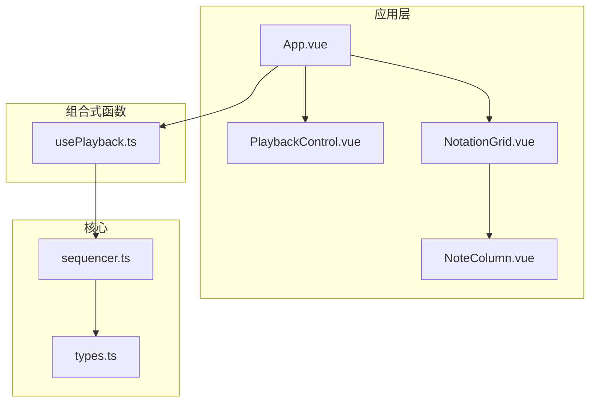
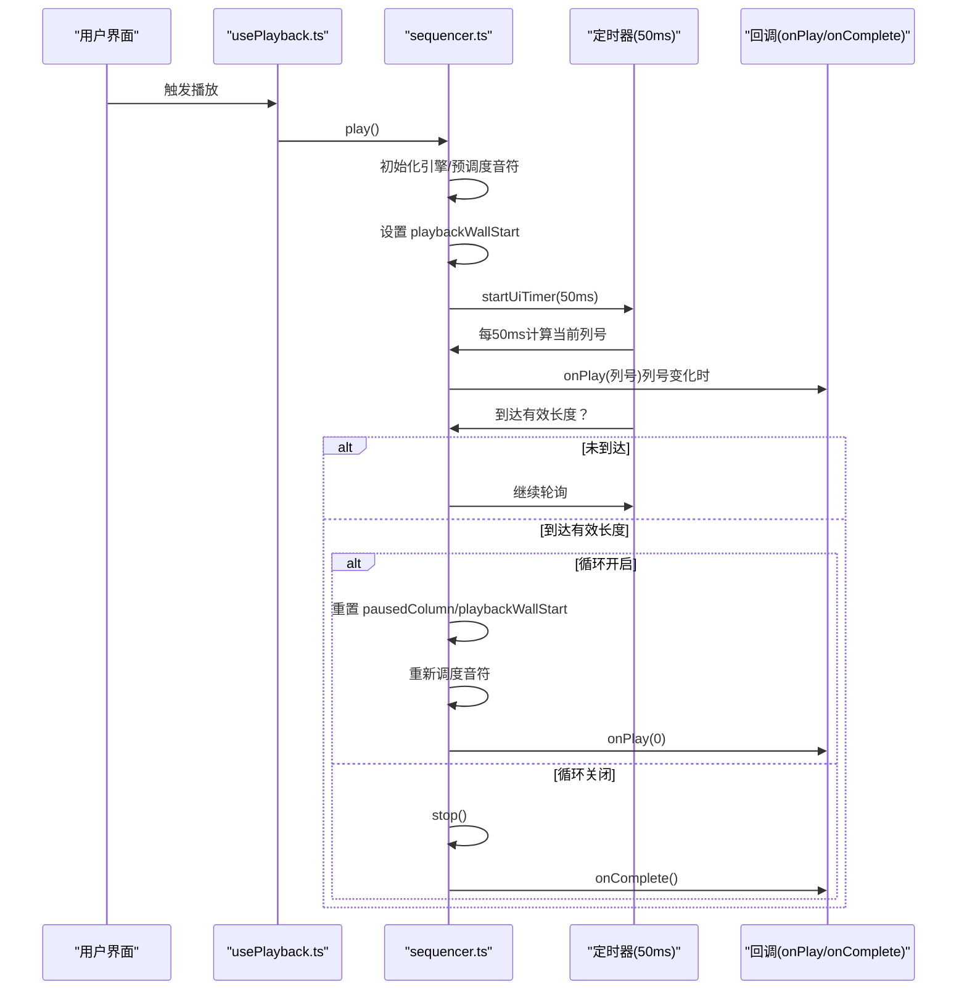
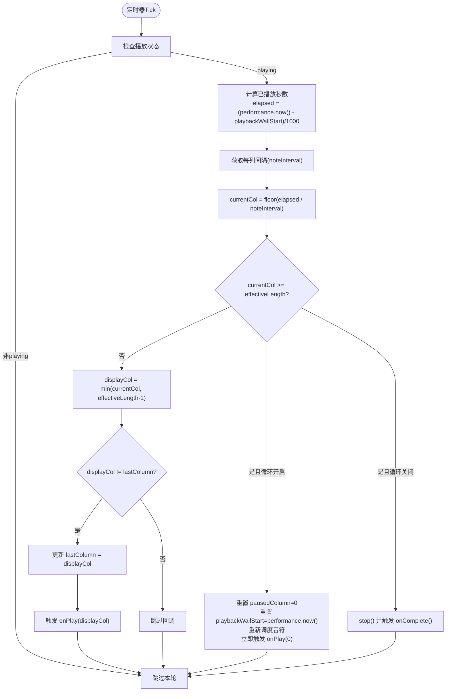
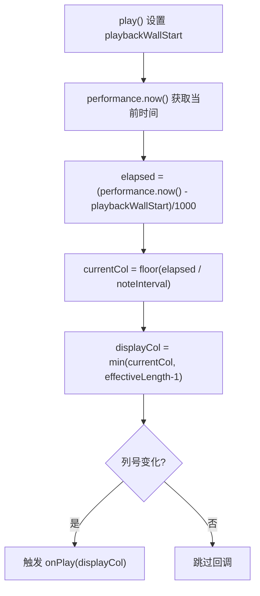
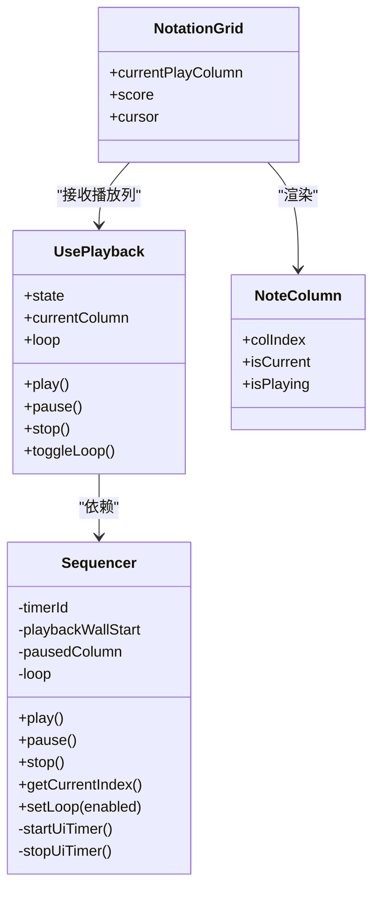
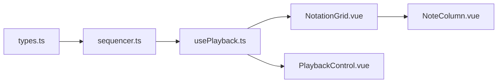

# UI定时器同步

<cite>
**本文引用的文件**
- [sequencer.ts](file://src/core/sequencer.ts)
- [usePlayback.ts](file://src/composables/usePlayback.ts)
- [types.ts](file://src/core/types.ts)
- [NotationGrid.vue](file://src/components/NotationGrid.vue)
- [NoteColumn.vue](file://src/components/NoteColumn.vue)
- [PlaybackControl.vue](file://src/components/PlaybackControl.vue)
- [App.vue](file://src/App.vue)
- [main.ts](file://src/main.ts)
</cite>

## 目录
1. [简介](#简介)
2. [项目结构](#项目结构)
3. [核心组件](#核心组件)
4. [架构总览](#架构总览)
5. [详细组件分析](#详细组件分析)
6. [依赖关系分析](#依赖关系分析)
7. [性能考量](#性能考量)
8. [故障排查指南](#故障排查指南)
9. [结论](#结论)

## 简介
本技术文档围绕UI定时器同步系统展开，重点解析startUiTimer方法的实现与工作机制，涵盖以下主题：
- 50ms定时器间隔的选择原理与性能考量
- 播放进度计算算法：performance.now()时间获取、播放墙钟时间（playbackWallStart）的作用与重置机制
- 列号变化检测逻辑：lastColumn变量的使用与回调触发条件
- 播放完成检测与循环播放判断的实现细节
- UI同步的性能优化策略与定时器管理最佳实践

## 项目结构
本项目采用Vue 3 + TypeScript的前端架构，核心播放逻辑集中在sequencer.ts中，UI层通过usePlayback组合式函数与组件进行交互。关键模块如下：
- 核心播放器：sequencer.ts（序列器，负责音频调度与UI定时器）
- 播放控制组合式函数：usePlayback.ts（封装播放状态、列号、循环等）
- 类型定义：types.ts（PlaybackState、Score、KeySignature等）
- UI组件：NotationGrid.vue、NoteColumn.vue、PlaybackControl.vue
- 应用入口：App.vue、main.ts

图表来源
- [App.vue:102-138](file://src/App.vue#L102-L138)
- [usePlayback.ts:14-95](file://src/composables/usePlayback.ts#L14-L95)
- [sequencer.ts:21-327](file://src/core/sequencer.ts#L21-L327)
- [types.ts:71-72](file://src/core/types.ts#L71-L72)

章节来源
- [App.vue:1-138](file://src/App.vue#L1-L138)
- [main.ts:1-8](file://src/main.ts#L1-L8)

## 核心组件
本节聚焦UI定时器同步的核心实现，包括：
- startUiTimer方法：以约50ms间隔轮询播放进度，仅在列号变化时触发UI回调
- 播放进度计算：基于performance.now()与playbackWallStart的差值计算已播放秒数
- 列号变化检测：通过lastColumn变量避免重复触发回调
- 播放完成与循环：根据有效长度与循环标志决定停止或重置并重新调度

章节来源
- [sequencer.ts:271-313](file://src/core/sequencer.ts#L271-L313)
- [sequencer.ts:133-139](file://src/core/sequencer.ts#L133-L139)
- [sequencer.ts:290-304](file://src/core/sequencer.ts#L290-L304)

## 架构总览
UI定时器同步的整体流程如下：
- 用户点击播放，usePlayback调用sequencer.play()
- sequencer初始化音乐引擎、预调度音符，并设置playbackWallStart
- 启动startUiTimer，以50ms为周期计算当前列号
- 当列号变化时，触发onPlay回调，usePlayback更新currentColumn
- 播放完成后，若开启循环则重置playbackWallStart并重新调度，否则停止播放并触发onComplete

图表来源
- [usePlayback.ts:46-49](file://src/composables/usePlayback.ts#L46-L49)
- [sequencer.ts:144-167](file://src/core/sequencer.ts#L144-L167)
- [sequencer.ts:271-313](file://src/core/sequencer.ts#L271-L313)
- [sequencer.ts:290-304](file://src/core/sequencer.ts#L290-L304)

## 详细组件分析

### startUiTimer方法实现与50ms定时器选择
- 定时器启动：在play()中调用startUiTimer，内部通过setInterval以50ms为间隔执行
- 进度计算：每次tick读取performance.now()，减去playbackWallStart得到已播放秒数，除以每列间隔得到当前列号
- 列号变化检测：通过lastColumn比较，仅在displayCol != lastColumn时触发onPlay回调
- 播放完成与循环：当currentCol >= effectiveLength时，若loop为true则重置播放位置并重新调度，否则停止并触发onComplete
- 有效长度：getEffectiveLength()从末尾向前扫描，找到第一个包含非空音符的列，作为播放终点，避免在空白列浪费时间

图表来源
- [sequencer.ts:282-312](file://src/core/sequencer.ts#L282-L312)
- [sequencer.ts:290-304](file://src/core/sequencer.ts#L290-L304)
- [sequencer.ts:271-313](file://src/core/sequencer.ts#L271-L313)

章节来源
- [sequencer.ts:271-313](file://src/core/sequencer.ts#L271-L313)
- [sequencer.ts:223-232](file://src/core/sequencer.ts#L223-L232)

### 播放进度计算算法
- performance.now()：高精度单调时间源，单位毫秒，用于计算相对时间差
- playbackWallStart：播放起始的wall-clock时间戳，通过play()时的计算设置，使“performance.now() - playbackWallStart”等于已播放秒数
- getCurrentIndex()：在playing状态下，使用相同公式计算当前列号，用于外部查询播放位置
- noteInterval：每列时间间隔（秒），由BPM推导，每列=八分音符，间隔=60/(BPM×2)=30/BPM

图表来源
- [sequencer.ts:165](file://src/core/sequencer.ts#L165)
- [sequencer.ts:135-136](file://src/core/sequencer.ts#L135-L136)
- [sequencer.ts:285-287](file://src/core/sequencer.ts#L285-L287)

章节来源
- [sequencer.ts:133-139](file://src/core/sequencer.ts#L133-L139)
- [sequencer.ts:163-166](file://src/core/sequencer.ts#L163-L166)
- [sequencer.ts:327](file://src/core/sequencer.ts#L327)

### 列号变化检测与回调触发
- lastColumn：记录上一次触发回调时的列号，初始为-1，确保首次回调能被触发
- displayCol：将currentCol限制在有效长度范围内，避免越界
- 触发条件：仅当displayCol与lastColumn不相等时才触发onPlay回调，并更新lastColumn
- 首次触发：由于lastColumn初始为-1，当displayCol≥0时会触发第一次回调

章节来源
- [sequencer.ts:272](file://src/core/sequencer.ts#L272)
- [sequencer.ts:307-311](file://src/core/sequencer.ts#L307-L311)

### 播放完成检测与循环播放判断
- 完成检测：currentCol >= effectiveLength时判定播放完成
- 循环播放：若loop为true，则重置pausedColumn为0，重置playbackWallStart为当前performance.now()，重新调度音符，并立即触发onPlay(0)，确保播放指示器回到开头
- 非循环：调用stop()并触发onComplete()

章节来源
- [sequencer.ts:289-304](file://src/core/sequencer.ts#L289-L304)
- [sequencer.ts:195-200](file://src/core/sequencer.ts#L195-L200)

### UI同步与组件交互
- usePlayback.ts：维护播放状态、当前列号、循环标志；监听BPM与调号变化；封装play/pause/stop/toggleLoop等操作
- NotationGrid.vue：接收currentPlayColumn属性，将当前播放列高亮显示；NoteColumn.vue渲染单列记谱单元
- PlaybackControl.vue：提供播放/暂停、停止、循环切换按钮，与usePlayback交互

图表来源
- [usePlayback.ts:14-95](file://src/composables/usePlayback.ts#L14-L95)
- [sequencer.ts:21-327](file://src/core/sequencer.ts#L21-L327)
- [NotationGrid.vue:10-16](file://src/components/NotationGrid.vue#L10-L16)
- [NoteColumn.vue:6-11](file://src/components/NoteColumn.vue#L6-L11)

章节来源
- [usePlayback.ts:14-95](file://src/composables/usePlayback.ts#L14-L95)
- [NotationGrid.vue:252-276](file://src/components/NotationGrid.vue#L252-L276)
- [NoteColumn.vue:31-43](file://src/components/NoteColumn.vue#L31-L43)

## 依赖关系分析
- sequencer.ts依赖：
  - types.ts：PlaybackState、Score、KeySignature等类型定义
  - music-engine.ts：音频引擎接口（初始化、调度音符、停止等）
- usePlayback.ts依赖：
  - sequencer.ts：播放器实例
  - types.ts：PlaybackState、Score、KeySignature等类型
- UI组件依赖：
  - usePlayback.ts：获取播放状态与当前列号
  - types.ts：类型约束

图表来源
- [types.ts:71-72](file://src/core/types.ts#L71-L72)
- [sequencer.ts:1-4](file://src/core/sequencer.ts#L1-L4)
- [usePlayback.ts:1-4](file://src/composables/usePlayback.ts#L1-L4)
- [NotationGrid.vue:1-9](file://src/components/NotationGrid.vue#L1-L9)
- [NoteColumn.vue:1-5](file://src/components/NoteColumn.vue#L1-L5)
- [PlaybackControl.vue:1-7](file://src/components/PlaybackControl.vue#L1-L7)

章节来源
- [types.ts:1-164](file://src/core/types.ts#L1-L164)
- [sequencer.ts:1-4](file://src/core/sequencer.ts#L1-L4)
- [usePlayback.ts:1-4](file://src/composables/usePlayback.ts#L1-L4)

## 性能考量
- 定时器间隔选择（50ms）：
  - 平衡点：足够高的刷新频率以保证UI流畅，同时避免过于频繁的计算造成CPU压力
  - 适用性：对于8分音符节奏（BPM 120）而言，每列间隔约0.25秒，50ms足以在列边界附近稳定检测变化
- 计算复杂度：
  - 每tick仅进行一次浮点运算（elapsed、除法、floor、比较），时间复杂度O(1)
  - 有效长度扫描仅在初始化或调号变更时发生，通常为O(N)，N为列数上限
- 内存与对象分配：
  - 定时器内无临时数组/对象创建，减少GC压力
- 优化建议：
  - 在页面不可见时（如浏览器标签页失焦）可暂停定时器，恢复可见后再启动
  - 对于极长乐谱，考虑将有效长度缓存并在调号变更时更新
  - 将UI回调合并为批量更新，减少DOM重排次数（当前实现已通过列号变化避免重复触发）

[本节为通用性能讨论，不直接分析具体文件，故无章节来源]

## 故障排查指南
- 现象：播放后UI不更新列号
  - 排查：确认startUiTimer是否成功启动（timerId非null），play()是否正确设置了playbackWallStart
  - 关注点：state必须为playing，否则定时器会跳过计算
- 现象：列号变化检测失效
  - 排查：检查lastColumn初始化与更新逻辑，确保displayCol在有效范围内
- 现象：播放完成后无法循环
  - 排查：确认loop标志是否为true，以及循环路径中的重置与重新调度是否执行
- 现象：BPM变化时UI不同步
  - 排查：确认BPM变更路径是否触发了rescheduling，以及playbackWallStart是否按新BPM重新计算

章节来源
- [sequencer.ts:315-320](file://src/core/sequencer.ts#L315-L320)
- [sequencer.ts:282-312](file://src/core/sequencer.ts#L282-L312)
- [sequencer.ts:291-300](file://src/core/sequencer.ts#L291-L300)

## 结论
UI定时器同步系统通过50ms定时器与列号变化检测实现了高效、稳定的播放指示。其核心优势在于：
- 使用performance.now()与playbackWallStart的差值计算播放进度，避免了帧率波动对UI的影响
- 通过lastColumn变量确保回调仅在列号变化时触发，降低UI更新开销
- 循环播放通过重置playbackWallStart与重新调度音符实现无缝衔接
配合usePlayback与NotationGrid的解耦设计，系统具备良好的可维护性与扩展性。