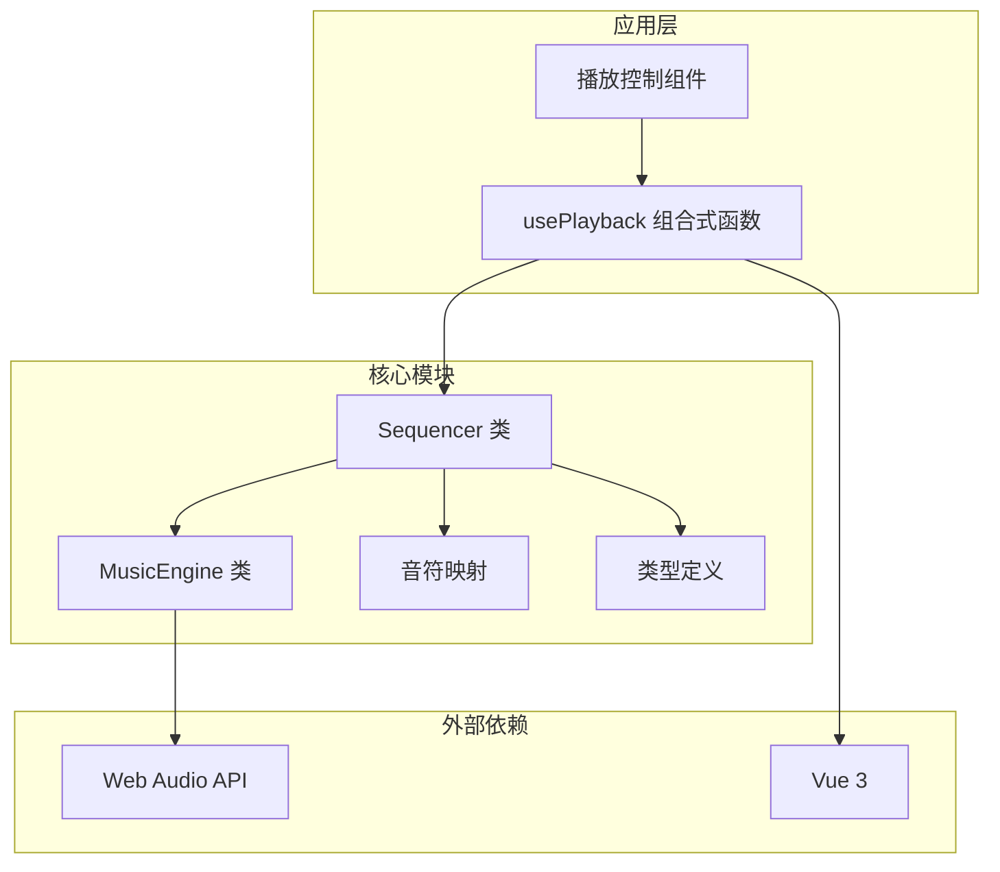
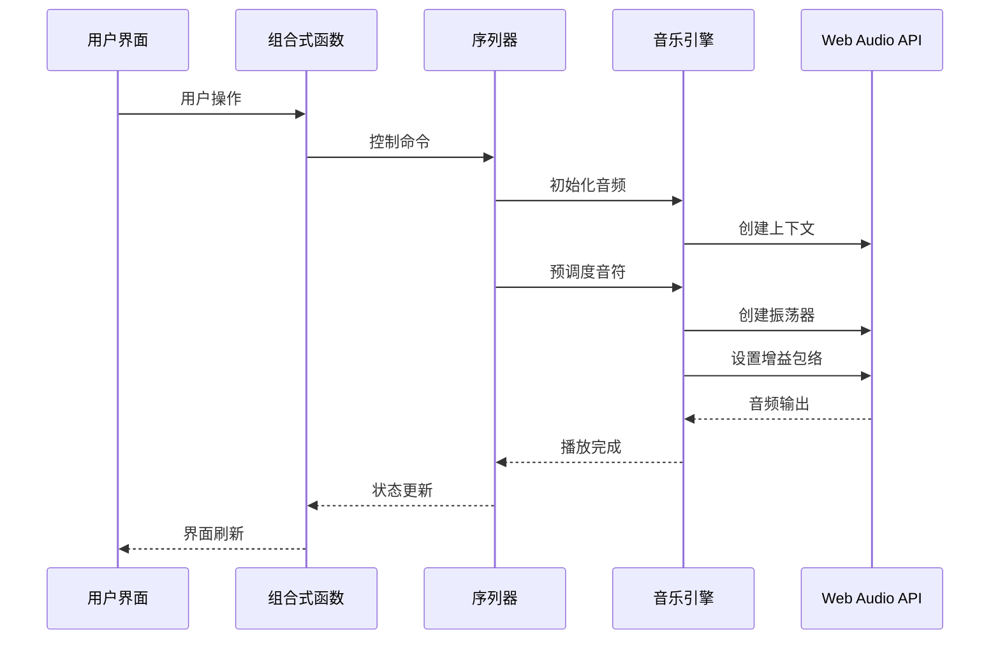
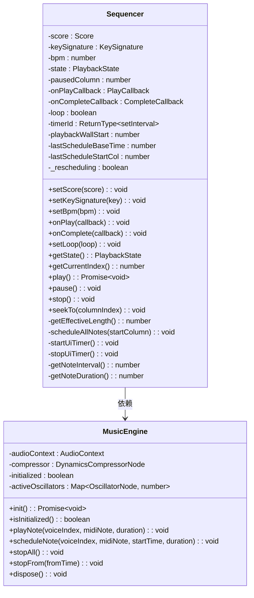
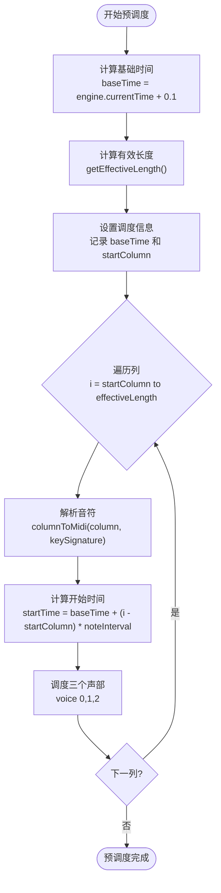
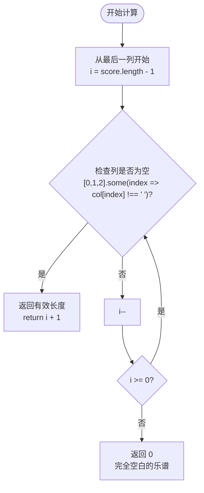
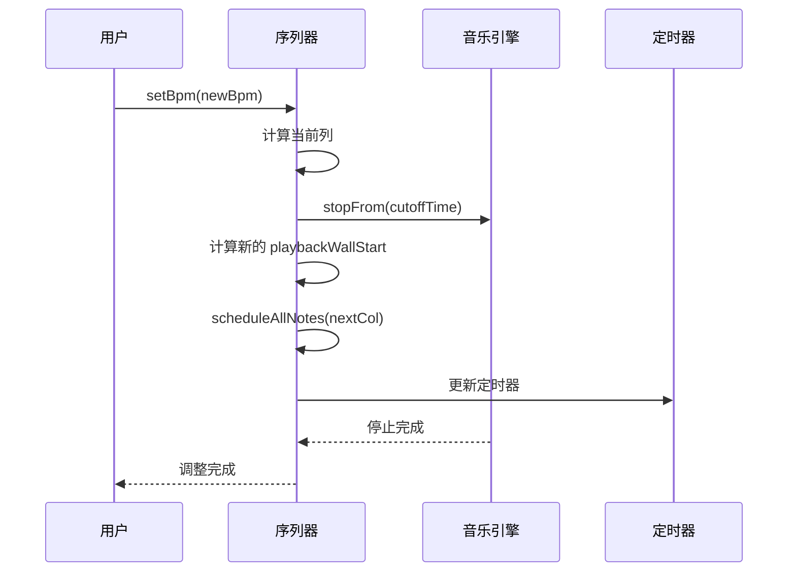
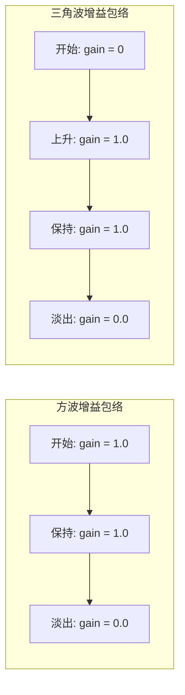
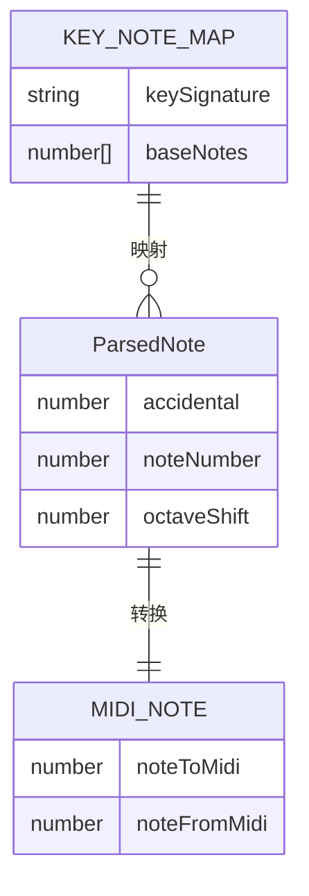
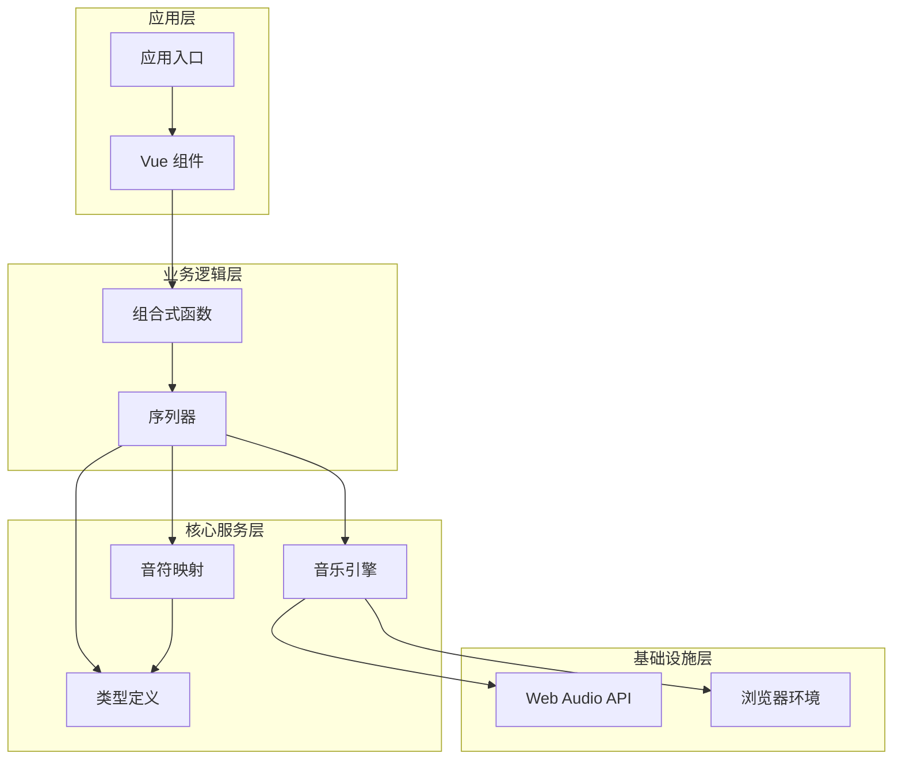

# 序列器核心实现

<cite>
**本文档引用的文件**
- [sequencer.ts](file://src/core/sequencer.ts)
- [music-engine.ts](file://src/core/music-engine.ts)
- [note-map.ts](file://src/core/note-map.ts)
- [types.ts](file://src/core/types.ts)
- [usePlayback.ts](file://src/composables/usePlayback.ts)
- [PlaybackControl.vue](file://src/components/PlaybackControl.vue)
</cite>

## 目录
1. [简介](#简介)
2. [项目结构](#项目结构)
3. [核心组件](#核心组件)
4. [架构概览](#架构概览)
5. [详细组件分析](#详细组件分析)
6. [依赖关系分析](#依赖关系分析)
7. [性能考虑](#性能考虑)
8. [故障排除指南](#故障排除指南)
9. [结论](#结论)

## 简介

本文档深入分析了 SUBOR 音乐板项目的序列器核心实现。序列器采用预调度模式，通过一次性计算所有音符的 AudioContext 绝对时间，创建并调度所有 OscillatorNode，UI 通过独立的定时器更新。该实现提供了完整的播放状态管理、播放队列调度机制、预调度算法以及优化策略。

## 项目结构

项目采用模块化架构，核心功能集中在 `src/core` 目录下：

**图表来源**
- [sequencer.ts:1-354](file://src/core/sequencer.ts#L1-L354)
- [music-engine.ts:1-221](file://src/core/music-engine.ts#L1-L221)
- [usePlayback.ts:1-95](file://src/composables/usePlayback.ts#L1-L95)

**章节来源**
- [sequencer.ts:1-354](file://src/core/sequencer.ts#L1-L354)
- [music-engine.ts:1-221](file://src/core/music-engine.ts#L1-L221)
- [types.ts:1-164](file://src/core/types.ts#L1-L164)

## 核心组件

### Sequencer 类（序列器）

Sequencer 类是整个播放系统的核心，实现了以下关键功能：

- **单例模式设计**：通过全局变量确保只有一个序列器实例存在
- **播放状态管理**：维护 stopped、paused、playing 三种状态
- **预调度算法**：一次性计算并调度所有音符
- **播放队列调度**：管理音符的播放顺序和时间安排

### MusicEngine 类（音乐引擎）

MusicEngine 类封装了 Web Audio API 的复杂性，提供了：

- **音频上下文管理**：初始化和管理 AudioContext
- **音符调度**：精确控制音符的开始和结束时间
- **增益包络**：实现方波和三角波的不同增益曲线
- **选择性停止**：支持按时间点停止特定音符

### NoteMap 模块

负责将简谱记谱转换为 MIDI 音符编号：

- **调号映射**：不同调号下的音符对应关系
- **音符解析**：处理升降号、八度修饰符
- **批量转换**：同时转换三个声部的音符

**章节来源**
- [sequencer.ts:21-354](file://src/core/sequencer.ts#L21-L354)
- [music-engine.ts:17-221](file://src/core/music-engine.ts#L17-L221)
- [note-map.ts:1-119](file://src/core/note-map.ts#L1-L119)

## 架构概览

系统采用分层架构，清晰分离了业务逻辑、音频处理和用户界面：

**图表来源**
- [usePlayback.ts:46-77](file://src/composables/usePlayback.ts#L46-L77)
- [sequencer.ts:144-167](file://src/core/sequencer.ts#L144-L167)
- [music-engine.ts:90-150](file://src/core/music-engine.ts#L90-L150)

## 详细组件分析

### Sequencer 类深度分析

#### 单例模式实现

**图表来源**
- [sequencer.ts:21-354](file://src/core/sequencer.ts#L21-L354)
- [music-engine.ts:17-221](file://src/core/music-engine.ts#L17-L221)

#### 播放状态管理

Sequencer 实现了完整的播放状态管理，包括：

- **stopped 状态**：初始状态，无播放活动
- **playing 状态**：正在播放，UI 定时器运行
- **paused 状态**：暂停状态，保持当前位置

状态转换遵循严格的时序控制，确保播放的准确性和稳定性。

#### 预调度算法实现

预调度算法是 Sequencer 的核心特性，采用一次性调度策略：

**图表来源**
- [sequencer.ts:240-263](file://src/core/sequencer.ts#L240-L263)
- [note-map.ts:109-118](file://src/core/note-map.ts#L109-L118)

#### 播放控制方法详解

##### play 方法实现

play 方法实现了完整的播放启动流程：

1. **状态检查**：避免重复启动
2. **引擎初始化**：确保音频上下文可用
3. **位置重置**：从停止状态开始时重置到第0列
4. **预调度执行**：一次性调度所有剩余音符
5. **定时器启动**：启动 UI 更新定时器

##### pause 方法实现

pause 方法提供了优雅的暂停机制：

1. **状态验证**：确保当前处于播放状态
2. **状态切换**：切换到暂停状态
3. **位置记录**：计算并记录当前播放位置
4. **立即停止**：停止所有预调度的振荡器

##### stop 方法实现

stop 方法提供了完整的停止机制：

1. **状态重置**：切换到停止状态
2. **位置重置**：重置播放位置到第0列
3. **定时器清理**：停止 UI 更新定时器
4. **音频清理**：停止所有音频输出

##### seekTo 方法实现

seekTo 方法支持跳转到指定位置：

1. **边界检查**：确保目标位置在有效范围内
2. **位置设置**：更新暂停位置
3. **即时生效**：下次播放从新位置开始

#### getEffectiveLength 方法优化

getEffectiveLength 方法实现了智能的空白列过滤：

**图表来源**
- [sequencer.ts:223-232](file://src/core/sequencer.ts#L223-L232)

该优化策略显著减少了不必要的音符调度，提高了播放效率。

#### BPM 实时调整机制

Sequencer 支持播放过程中的实时 BPM 调整：

**图表来源**
- [sequencer.ts:84-115](file://src/core/sequencer.ts#L84-L115)
- [music-engine.ts:177-197](file://src/core/music-engine.ts#L177-L197)

**章节来源**
- [sequencer.ts:144-213](file://src/core/sequencer.ts#L144-L213)
- [sequencer.ts:223-232](file://src/core/sequencer.ts#L223-L232)
- [sequencer.ts:84-115](file://src/core/sequencer.ts#L84-L115)

### MusicEngine 类深度分析

#### 音频上下文管理

MusicEngine 实现了完整的音频上下文生命周期管理：

- **延迟初始化**：等待用户交互后才创建音频上下文
- **状态检测**：自动检测和处理 suspended 状态
- **资源清理**：提供完整的资源释放机制

#### 增益包络实现

MusicEngine 实现了两种不同的增益包络策略：

**图表来源**
- [music-engine.ts:130-139](file://src/core/music-engine.ts#L130-L139)
- [music-engine.ts:117-129](file://src/core/music-engine.ts#L117-L129)

#### 选择性停止机制

stopFrom 方法实现了精确的选择性停止：

1. **时间比较**：比较音符开始时间和截止时间
2. **批量停止**：一次性停止所有符合条件的音符
3. **状态同步**：更新活跃振荡器映射表

**章节来源**
- [music-engine.ts:41-64](file://src/core/music-engine.ts#L41-L64)
- [music-engine.ts:90-150](file://src/core/music-engine.ts#L90-L150)
- [music-engine.ts:177-197](file://src/core/music-engine.ts#L177-L197)

### NoteMap 模块分析

#### 调号映射系统

NoteMap 实现了完整的调号映射系统：

**图表来源**
- [note-map.ts:10-27](file://src/core/note-map.ts#L10-L27)
- [note-map.ts:35-74](file://src/core/note-map.ts#L35-L74)
- [note-map.ts:83-100](file://src/core/note-map.ts#L83-L100)

#### 音符解析算法

音符解析支持复杂的记谱格式：

- **升降号处理**：支持 #（升）和 b（降）
- **八度修饰**：支持 .（高八度）和 ,（低八度）
- **格式验证**：严格验证输入格式的有效性

**章节来源**
- [note-map.ts:10-27](file://src/core/note-map.ts#L10-L27)
- [note-map.ts:35-74](file://src/core/note-map.ts#L35-L74)
- [note-map.ts:109-118](file://src/core/note-map.ts#L109-L118)

## 依赖关系分析

系统采用了清晰的依赖层次结构：

**图表来源**
- [usePlayback.ts:14-95](file://src/composables/usePlayback.ts#L14-L95)
- [sequencer.ts:1-354](file://src/core/sequencer.ts#L1-L354)
- [music-engine.ts:1-221](file://src/core/music-engine.ts#L1-L221)

**章节来源**
- [usePlayback.ts:14-95](file://src/composables/usePlayback.ts#L14-L95)
- [sequencer.ts:1-354](file://src/core/sequencer.ts#L1-L354)

## 性能考虑

### 内存管理最佳实践

1. **及时清理资源**：stop 方法确保所有音频资源被正确释放
2. **避免内存泄漏**：stopAll 和 stopFrom 方法清理活跃振荡器映射
3. **批量操作优化**：预调度减少频繁的音频操作开销

### 播放性能优化

1. **预调度策略**：一次性计算所有音符时间，避免运行时计算
2. **有效长度优化**：getEffectiveLength 过滤空白列，减少不必要的调度
3. **定时器优化**：50ms 间隔的 UI 定时器平衡响应性和性能

### 音频性能优化

1. **增益包络优化**：精确的增益曲线减少音频失真
2. **振荡器复用**：每个音符使用独立的振荡器确保音质
3. **压缩器共享**：三个声部共享压缩器提高效率

## 故障排除指南

### 常见问题及解决方案

#### 音频无法播放

**症状**：点击播放按钮无声音输出

**可能原因**：
1. 浏览器音频上下文处于 suspended 状态
2. 音频上下文未正确初始化
3. 用户交互缺失导致权限问题

**解决步骤**：
1. 确保用户进行了任何交互操作
2. 检查浏览器控制台是否有错误信息
3. 验证音频上下文状态

#### 播放卡顿或延迟

**症状**：播放过程中出现卡顿或明显延迟

**可能原因**：
1. 预调度时间过长
2. 大量音符同时播放
3. CPU 性能不足

**解决步骤**：
1. 检查乐谱的有效长度
2. 减少同时播放的音符数量
3. 降低 BPM 或简化音符

#### BPM 调整异常

**症状**：调整 BPM 后播放异常

**可能原因**：
1. 选择性停止机制失效
2. 时间计算错误
3. 定时器状态不一致

**解决步骤**：
1. 检查 stopFrom 方法的执行
2. 验证时间计算逻辑
3. 确认定时器状态同步

**章节来源**
- [music-engine.ts:155-169](file://src/core/music-engine.ts#L155-L169)
- [sequencer.ts:84-115](file://src/core/sequencer.ts#L84-L115)

## 结论

SUBOR 音乐板的序列器核心实现展现了优秀的软件工程实践：

1. **架构设计**：清晰的分层架构和职责分离
2. **性能优化**：预调度算法和有效长度优化
3. **用户体验**：流畅的播放控制和实时调整能力
4. **代码质量**：完善的错误处理和资源管理

该实现为 Web 音乐应用开发提供了优秀的参考模板，特别是在音频处理和用户界面交互方面的平衡设计值得学习和借鉴。