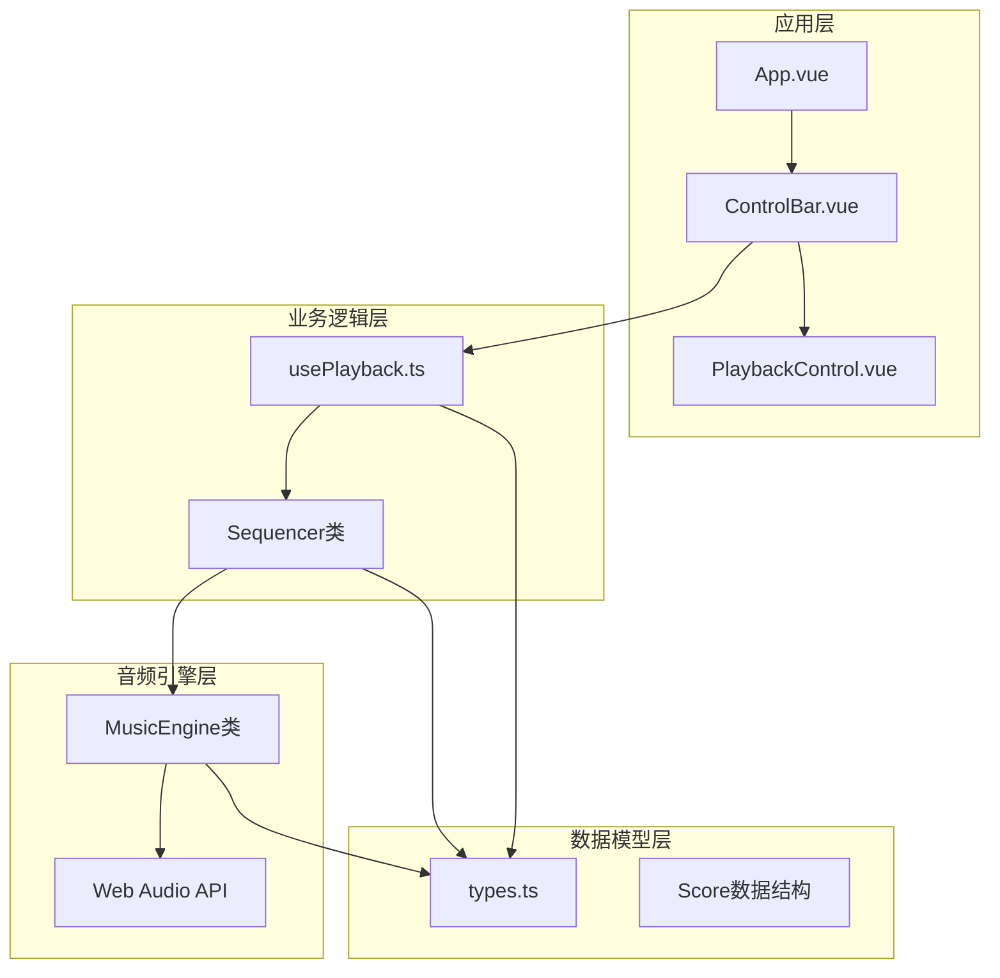
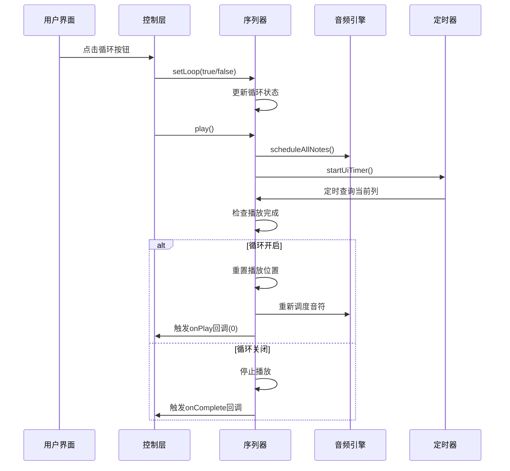
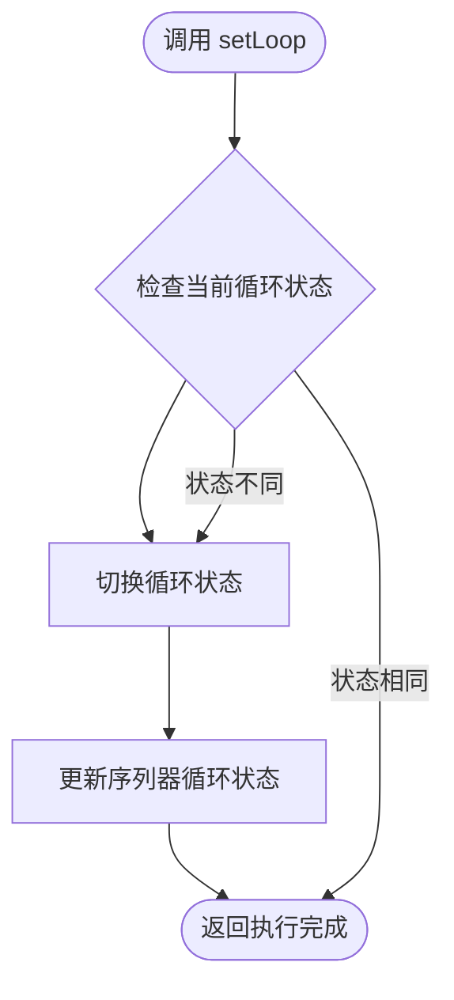
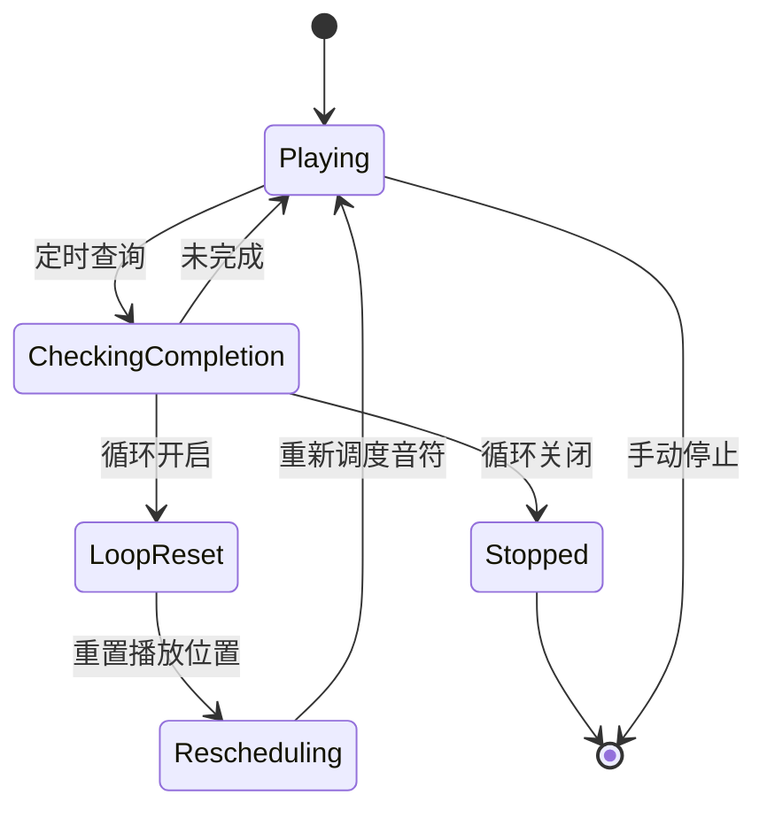
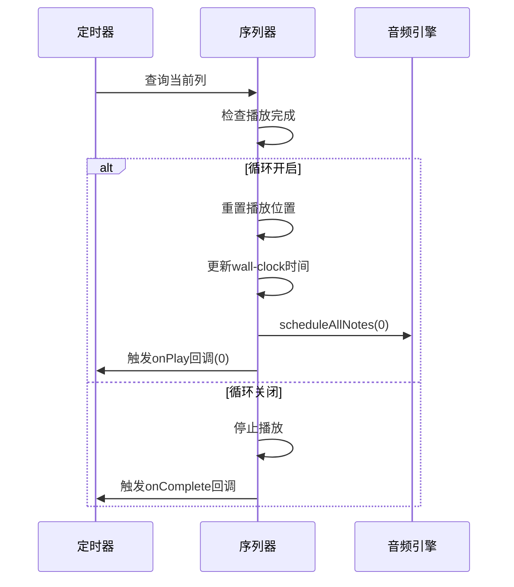
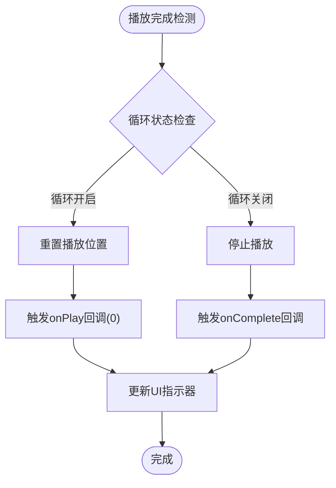
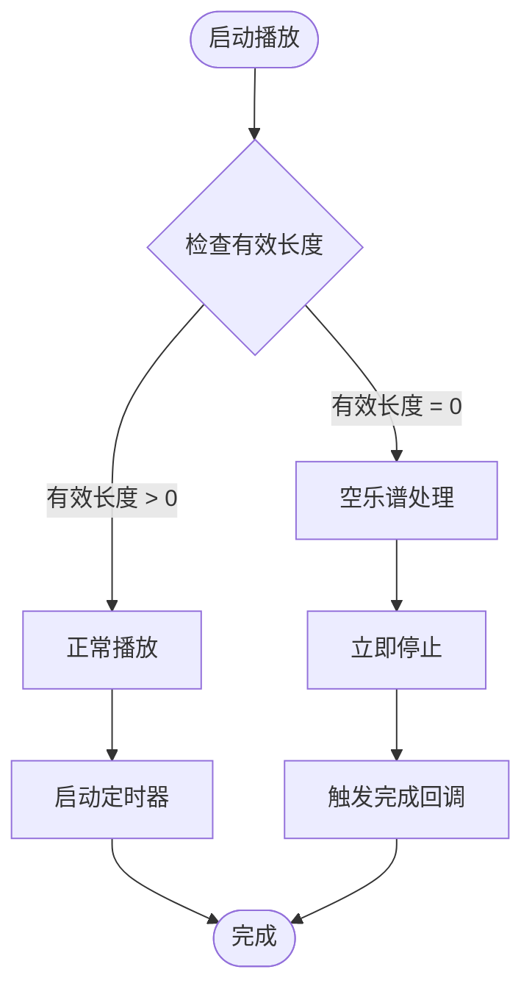
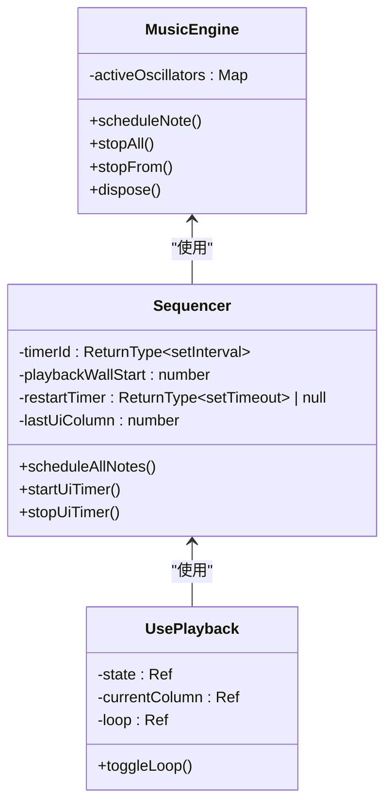
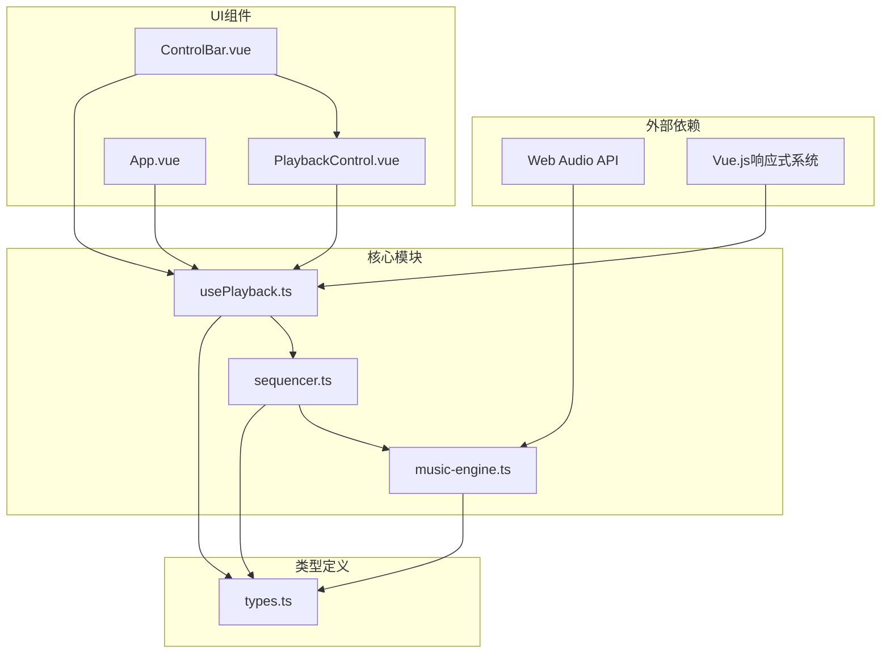

# 循环播放机制

<cite>
**本文档引用的文件**
- [usePlayback.ts](file://src/composables/usePlayback.ts)
- [sequencer.ts](file://src/core/sequencer.ts)
- [music-engine.ts](file://src/core/music-engine.ts)
- [PlaybackControl.vue](file://src/components/PlaybackControl.vue)
- [ControlBar.vue](file://src/components/ControlBar.vue)
- [App.vue](file://src/App.vue)
- [types.ts](file://src/core/types.ts)
</cite>

## 目录
1. [简介](#简介)
2. [项目结构](#项目结构)
3. [核心组件](#核心组件)
4. [架构概览](#架构概览)
5. [详细组件分析](#详细组件分析)
6. [依赖关系分析](#依赖关系分析)
7. [性能考虑](#性能考虑)
8. [故障排除指南](#故障排除指南)
9. [结论](#结论)

## 简介

本文档深入解析了 SUBOR Music Board 中的循环播放机制，重点分析了 `setLoop` 方法的实现细节、循环开关状态管理以及循环播放行为。该系统采用基于 Web Audio API 的预调度播放模式，实现了精确的音符定时和高效的音频渲染。文档详细说明了循环播放的实现策略，包括播放完成后的自动重置、播放墙钟时间重置和重新调度机制，同时阐述了循环播放中的 UI 同步问题及解决方案。

## 项目结构

循环播放功能涉及多个层次的组件协作，形成了清晰的分层架构：

**图表来源**
- [App.vue:1-138](file://src/App.vue#L1-L138)
- [usePlayback.ts:1-95](file://src/composables/usePlayback.ts#L1-L95)
- [sequencer.ts:1-354](file://src/core/sequencer.ts#L1-L354)
- [music-engine.ts:1-221](file://src/core/music-engine.ts#L1-L221)

**章节来源**
- [App.vue:1-138](file://src/App.vue#L1-L138)
- [usePlayback.ts:14-95](file://src/composables/usePlayback.ts#L14-L95)
- [sequencer.ts:21-354](file://src/core/sequencer.ts#L21-L354)

## 核心组件

### 播放控制组合式函数

`usePlayback` 组合式函数提供了播放状态管理和循环控制的核心功能：

- **状态管理**：维护播放状态、当前列索引和循环开关
- **事件监听**：监听 BPM 和调号变化，实时更新音频引擎
- **循环控制**：提供 `toggleLoop` 方法切换循环状态

### 序列器类

`Sequencer` 类是循环播放机制的核心实现：

- **循环状态管理**：内部维护 `loop` 属性控制循环行为
- **播放调度**：实现预调度播放模式，一次性计算所有音符的播放时间
- **UI 同步**：通过定时器实现 UI 进度同步

### 音乐引擎

`MusicEngine` 提供底层音频播放能力：

- **音频上下文管理**：封装 Web Audio API 的复杂性
- **音符调度**：精确控制音符的开始和结束时间
- **资源管理**：提供停止和清理音频资源的方法

**章节来源**
- [usePlayback.ts:14-95](file://src/composables/usePlayback.ts#L14-L95)
- [sequencer.ts:21-354](file://src/core/sequencer.ts#L21-L354)
- [music-engine.ts:17-221](file://src/core/music-engine.ts#L17-L221)

## 架构概览

循环播放机制采用分层架构设计，各层职责明确：

**图表来源**
- [usePlayback.ts:79-82](file://src/composables/usePlayback.ts#L79-L82)
- [sequencer.ts:125-313](file://src/core/sequencer.ts#L125-L313)

## 详细组件分析

### setLoop 方法实现分析

`setLoop` 方法是循环播放机制的核心入口，其实现简洁而高效：

**图表来源**
- [sequencer.ts:125-127](file://src/core/sequencer.ts#L125-L127)

#### 实现细节

1. **状态切换**：方法接收布尔值参数，内部进行状态翻转
2. **状态持久化**：将新的循环状态存储在 `this.loop` 属性中
3. **即时生效**：状态变更立即生效，无需额外的初始化步骤

#### 状态管理策略

循环状态在多个组件中保持同步：

- **usePlayback 组合式函数**：维护本地 `loop` 响应式状态
- **Sequencer 类**：维护内部循环状态
- **UI 组件**：通过 props 接收循环状态并在界面上显示

**章节来源**
- [sequencer.ts:125-127](file://src/core/sequencer.ts#L125-L127)
- [usePlayback.ts:79-82](file://src/composables/usePlayback.ts#L79-L82)

### 循环播放实现策略

循环播放的实现策略体现了对性能和用户体验的精心考量：

#### 自动重置机制

**图表来源**
- [sequencer.ts:289-304](file://src/core/sequencer.ts#L289-L304)

#### 播放完成后的处理流程

1. **播放完成检测**：通过定时器检查当前列是否达到有效长度
2. **循环状态判断**：
   - **循环开启**：重置播放位置到第 0 列
   - **循环关闭**：正常停止播放
3. **状态更新**：更新播放状态为 `stopped`

#### 播放墙钟时间重置

循环播放中的时间管理采用了精确的墙钟时间重置机制：

- **wall-clock 时间**：使用 `performance.now()` 获取高精度时间
- **重置策略**：每次循环重置 `playbackWallStart` 为当前时间
- **同步机制**：确保 UI 进度与实际播放时间保持同步

#### 重新调度机制

**图表来源**
- [sequencer.ts:291-299](file://src/core/sequencer.ts#L291-L299)

**章节来源**
- [sequencer.ts:289-313](file://src/core/sequencer.ts#L289-L313)

### UI 同步问题与解决方案

循环播放中的 UI 同步是一个关键挑战，系统采用了多种策略确保界面显示与实际播放状态一致：

#### 指示器重置策略

1. **定时器回调**：通过 `onPlayCallback` 确保 UI 指示器及时更新
2. **强制回调触发**：循环重置时立即触发第 0 列的回调
3. **状态一致性**：确保 `currentColumn` 响应式状态与 UI 显示同步

#### 回调触发机制

**图表来源**
- [sequencer.ts:291-304](file://src/core/sequencer.ts#L291-L304)

**章节来源**
- [sequencer.ts:291-311](file://src/core/sequencer.ts#L291-L311)
- [usePlayback.ts:25-31](file://src/composables/usePlayback.ts#L25-L31)

### 边界条件处理

系统对各种边界条件进行了周密的处理，确保稳定性：

#### 空乐谱检测

**图表来源**
- [sequencer.ts:275-280](file://src/core/sequencer.ts#L275-L280)

#### 无限循环保护

系统通过以下机制防止无限循环：

1. **有效长度计算**：自动跳过空白列，避免在无效区域浪费时间
2. **播放完成检测**：基于有效长度而非总列数进行完成判断
3. **状态重置**：循环重置时确保播放位置正确重置

**章节来源**
- [sequencer.ts:223-232](file://src/core/sequencer.ts#L223-L232)
- [sequencer.ts:275-280](file://src/core/sequencer.ts#L275-L280)

### 性能优化建议

#### 内存泄漏防护

系统采用了多项措施防止内存泄漏：

1. **定时器清理**：在停止播放时清理所有定时器
2. **音频资源管理**：提供 `stopAll` 和 `dispose` 方法清理音频资源
3. **状态重置**：播放停止时重置所有内部状态

#### 音频调度优化

**图表来源**
- [music-engine.ts:17-221](file://src/core/music-engine.ts#L17-L221)
- [sequencer.ts:21-354](file://src/core/sequencer.ts#L21-L354)
- [usePlayback.ts:14-95](file://src/composables/usePlayback.ts#L14-L95)

**章节来源**
- [music-engine.ts:152-214](file://src/core/music-engine.ts#L152-L214)
- [sequencer.ts:315-320](file://src/core/sequencer.ts#L315-L320)

## 依赖关系分析

循环播放机制的依赖关系体现了清晰的分层设计：

**图表来源**
- [usePlayback.ts:1-4](file://src/composables/usePlayback.ts#L1-L4)
- [sequencer.ts:1-4](file://src/core/sequencer.ts#L1-L4)
- [music-engine.ts:1-3](file://src/core/music-engine.ts#L1-L3)

**章节来源**
- [usePlayback.ts:1-4](file://src/composables/usePlayback.ts#L1-L4)
- [sequencer.ts:1-4](file://src/core/sequencer.ts#L1-L4)
- [music-engine.ts:1-3](file://src/core/music-engine.ts#L1-L3)

## 性能考虑

### 音频调度性能

系统采用预调度模式，在启动时一次性计算所有音符的播放时间，这种设计具有以下优势：

- **减少运行时开销**：避免在播放过程中频繁计算时间
- **提高定时精度**：基于 AudioContext 的绝对时间，避免累积误差
- **优化内存使用**：集中管理音符调度，减少临时对象创建

### UI 同步性能

定时器机制在性能和准确性之间取得了平衡：

- **50ms 间隔**：提供足够高的刷新率同时避免过度消耗 CPU
- **列号变化检测**：仅在列号变化时触发回调，减少不必要的更新
- **高精度时间源**：使用 `performance.now()` 获取毫秒级精度时间

### 内存管理

系统实施了全面的内存管理策略：

- **定时器清理**：播放停止时清理所有定时器引用
- **音频资源回收**：提供专门的资源清理方法
- **状态重置**：确保所有内部状态在停止时被重置

## 故障排除指南

### 常见问题诊断

#### 循环播放不生效

1. **检查循环状态**：确认 `loop` 状态已正确设置
2. **验证播放完成**：检查播放是否到达有效长度
3. **监控定时器**：确认定时器仍在运行

#### UI 不同步

1. **检查回调触发**：验证 `onPlayCallback` 是否被正确调用
2. **确认状态更新**：确保 `currentColumn` 响应式状态正确更新
3. **调试定时器**：检查定时器间隔和回调逻辑

#### 音频问题

1. **检查音频上下文**：确认 Web Audio API 正常初始化
2. **验证音符调度**：确保音符时间计算正确
3. **监控振荡器状态**：检查活跃振荡器的数量和状态

**章节来源**
- [sequencer.ts:289-313](file://src/core/sequencer.ts#L289-L313)
- [music-engine.ts:41-60](file://src/core/music-engine.ts#L41-L60)

## 结论

SUBOR Music Board 的循环播放机制展现了优秀的软件工程实践，通过清晰的分层架构、精确的时间管理和完善的错误处理，实现了稳定可靠的循环播放功能。系统的关键优势包括：

1. **精确的循环控制**：通过 `setLoop` 方法实现简单而强大的循环切换
2. **高效的性能表现**：预调度模式和优化的定时器机制确保流畅的播放体验
3. **完善的边界处理**：对空乐谱和无限循环等边界情况提供了稳健的处理方案
4. **良好的可维护性**：清晰的代码结构和模块化设计便于后续维护和扩展

该实现为类似音乐播放器的循环播放功能提供了优秀的参考范例，展示了如何在前端环境中实现高质量的音频播放体验。