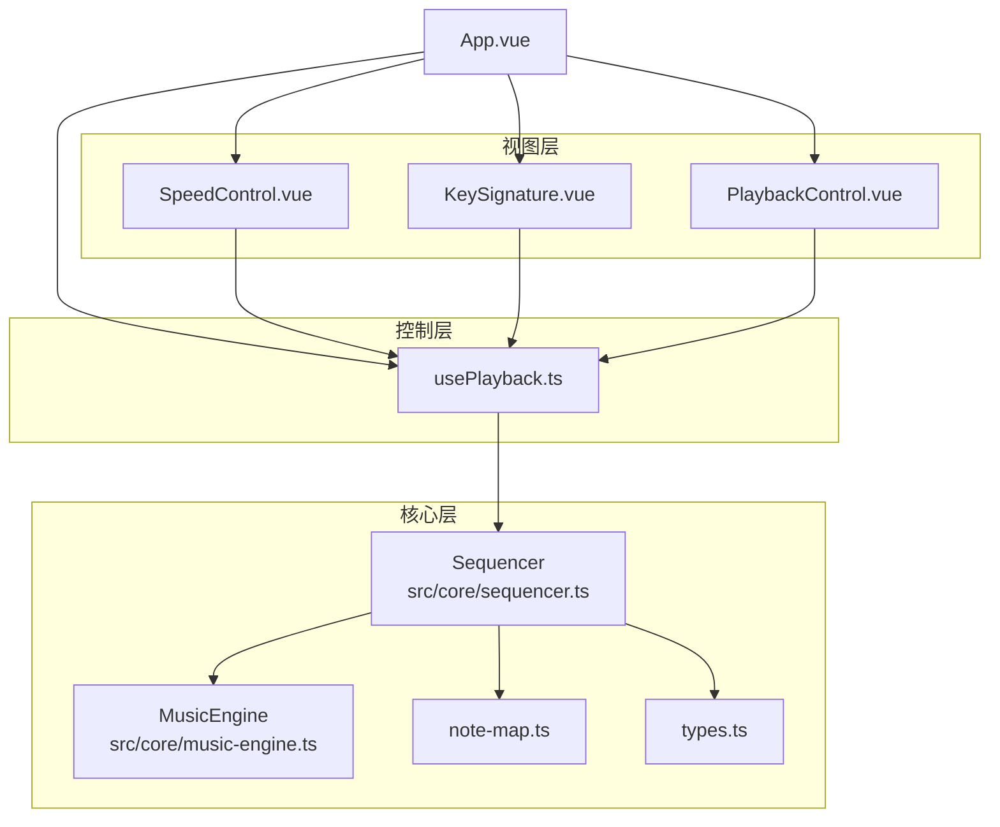
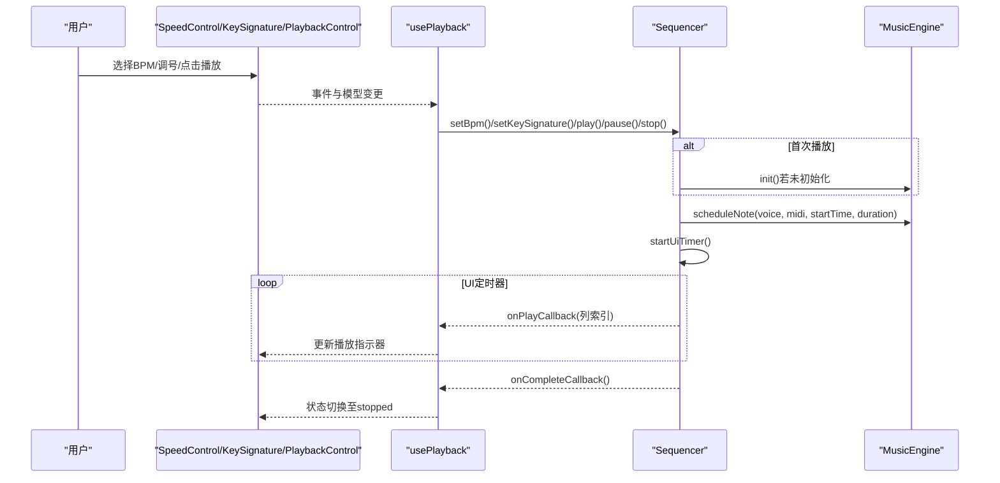
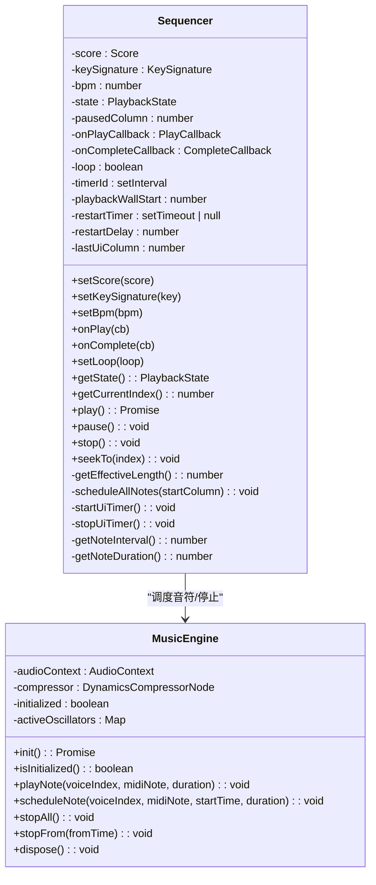
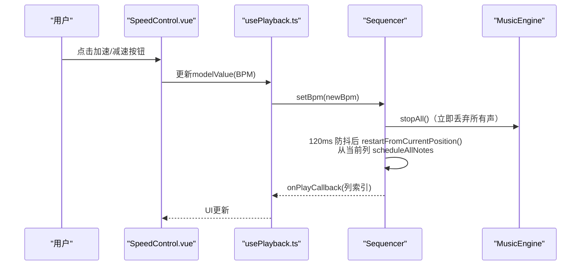
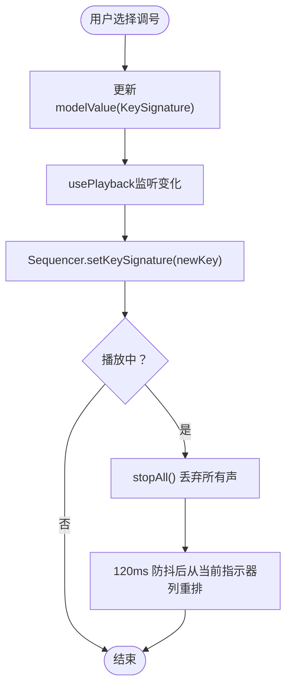
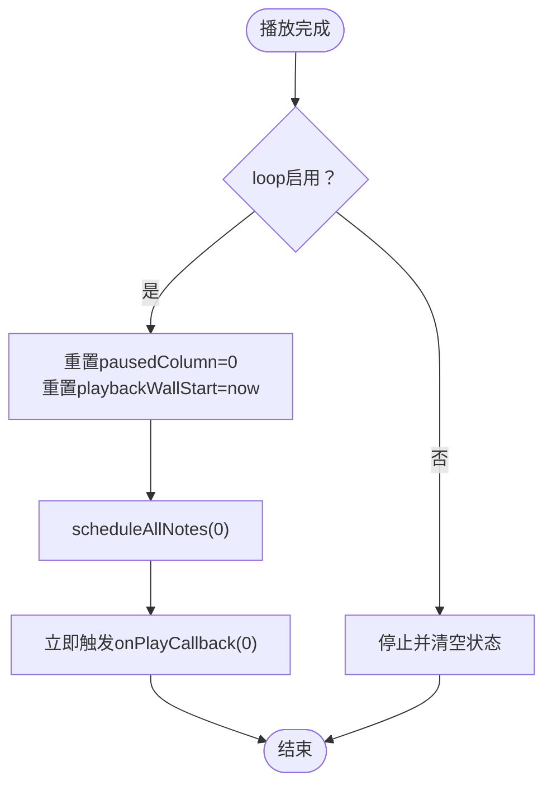
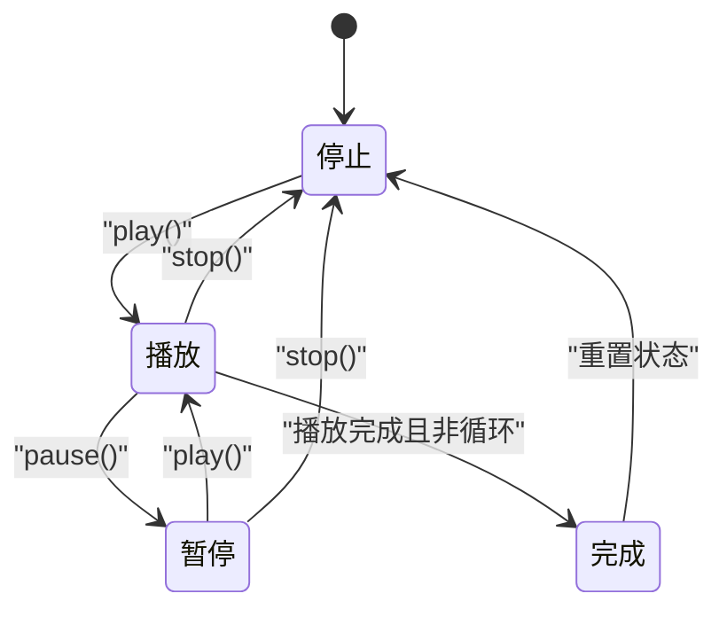
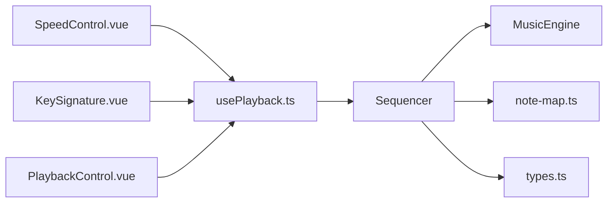

# 播放控制系统

<cite>
**本文引用的文件**
- [sequencer.ts](file://src/core/sequencer.ts)
- [music-engine.ts](file://src/core/music-engine.ts)
- [types.ts](file://src/core/types.ts)
- [note-map.ts](file://src/core/note-map.ts)
- [usePlayback.ts](file://src/composables/usePlayback.ts)
- [SpeedControl.vue](file://src/components/SpeedControl.vue)
- [KeySignature.vue](file://src/components/KeySignature.vue)
- [PlaybackControl.vue](file://src/components/PlaybackControl.vue)
- [App.vue](file://src/App.vue)
- [main.ts](file://src/main.ts)
</cite>

## 目录
1. [简介](#简介)
2. [项目结构](#项目结构)
3. [核心组件](#核心组件)
4. [架构总览](#架构总览)
5. [详细组件分析](#详细组件分析)
6. [依赖关系分析](#依赖关系分析)
7. [性能考虑](#性能考虑)
8. [故障排查指南](#故障排查指南)
9. [结论](#结论)
10. [附录](#附录)

## 简介
本技术文档围绕播放控制系统展开，重点解析以下方面：
- Sequencer类的实现：播放队列管理、时间调度机制、预调度算法
- 播放状态管理：播放、暂停、停止的状态转换与持久化
- SpeedControl速度控制组件：BPM计算与节拍同步机制
- KeySignature调号控制：调号显示（“1=X”）与音高调整
- 循环播放：循环开关控制与无缝循环技术
- 性能优化策略与内存管理方案

## 项目结构
播放控制系统由“组合式函数 + 组件 + 核心引擎”三层构成：
- 视图层：SpeedControl、KeySignature、PlaybackControl等Vue组件
- 控制层：usePlayback组合式函数协调播放状态与UI事件
- 核心层：Sequencer负责播放队列与调度；MusicEngine封装Web Audio API；note-map与types提供音高映射与类型定义

图表来源
- [App.vue:102-138](file://src/App.vue#L102-L138)
- [usePlayback.ts:14-94](file://src/composables/usePlayback.ts#L14-L94)
- [sequencer.ts:21-354](file://src/core/sequencer.ts#L21-L354)
- [music-engine.ts:17-221](file://src/core/music-engine.ts#L17-L221)
- [note-map.ts:1-119](file://src/core/note-map.ts#L1-L119)
- [types.ts:1-164](file://src/core/types.ts#L1-L164)

章节来源
- [App.vue:102-138](file://src/App.vue#L102-L138)
- [main.ts:1-8](file://src/main.ts#L1-8)

## 核心组件
- Sequencer：播放队列与调度核心，负责预调度、状态管理、循环播放、BPM与调号动态切换
- MusicEngine：Web Audio API封装，提供音符调度、增益包络、选择性停止与资源释放
- usePlayback：组合式函数，连接UI与Sequencer，暴露播放状态与控制方法
- SpeedControl/KeySignature：速度与调号的可视化控制组件
- PlaybackControl：播放/暂停/停止/循环按钮

章节来源
- [sequencer.ts:21-354](file://src/core/sequencer.ts#L21-L354)
- [music-engine.ts:17-221](file://src/core/music-engine.ts#L17-L221)
- [usePlayback.ts:14-94](file://src/composables/usePlayback.ts#L14-L94)
- [SpeedControl.vue:1-68](file://src/components/SpeedControl.vue#L1-L68)
- [KeySignature.vue:1-55](file://src/components/KeySignature.vue#L1-L55)
- [PlaybackControl.vue:1-111](file://src/components/PlaybackControl.vue#L1-L111)

## 架构总览
播放控制的整体流程如下：
- 用户在SpeedControl/KeySignature/PlaybackControl中进行操作
- usePlayback监听配置变化并调用Sequencer的方法
- Sequencer根据当前状态与配置，调用MusicEngine进行音符调度
- UI通过定时器周期性查询当前列并更新播放指示器

图表来源
- [usePlayback.ts:33-41](file://src/composables/usePlayback.ts#L33-L41)
- [sequencer.ts:144-167](file://src/core/sequencer.ts#L144-L167)
- [sequencer.ts:240-263](file://src/core/sequencer.ts#L240-L263)
- [music-engine.ts:90-150](file://src/core/music-engine.ts#L90-L150)

## 详细组件分析

### Sequencer类：播放队列与时间调度
- 播放状态管理
  - 状态枚举：stopped、playing、paused
  - 播放/暂停/停止分别更新状态、启动/停止UI定时器、调用MusicEngine停止或继续
  - 暂停时记录当前位置，恢复播放时从该位置继续
- 预调度算法
  - 一次性计算所有剩余音符的绝对播放时间，创建并调度OscillatorNode
  - 三个声部分别调度：主旋律/和弦律（方波）、低频（三角波）
  - 通过AudioContext的currentTime作为基准，结合列间隔与音符时长进行精确调度
- 时间调度机制
  - 列间隔：每格时长 = 30/BPM 秒（BPM 为速度档位，数值越大越快）
  - 音符时长：方波=列间隔，三角波略短（约0.93倍列间隔）
  - UI定时器以约50ms轮询，仅在列号变化时触发回调
- 实时BPM与调号切换（2026-08-30 改）
  - BPM/调号变化命中 playing：`requestPlaybackRestart()` 立即 `stopAll()` 丢弃所有声，120ms 防抖后从当前指示器列整体重排（`restartFromCurrentPosition`）
  - 防抖期间连续点击/拖动只重置定时器，不反复调度；暂停/停止时清除防抖定时器
  - 重排后 `playbackWallStart` 与 `scheduleAllNotes`（baseTime = engine.currentTime + 0.1）对齐，指示器约 100ms 后落到当前列，与该列音频同时发声，恢复音画同步
- 循环播放
  - 支持开启/关闭循环
  - 播放完成且循环开启时，重置播放起点与wall-clock基准，重新调度全部音符，并立即触发第一列回调

图表来源
- [sequencer.ts:21-354](file://src/core/sequencer.ts#L21-L354)
- [music-engine.ts:17-221](file://src/core/music-engine.ts#L17-L221)

章节来源
- [sequencer.ts:21-354](file://src/core/sequencer.ts#L21-L354)
- [music-engine.ts:17-221](file://src/core/music-engine.ts#L17-L221)

### SpeedControl组件：BPM控制与节拍同步
- 数据绑定
  - 使用defineModel绑定当前BPM，内部维护索引currentIndex，判断首尾边界
- 交互逻辑
  - 通过changeSpeed根据增量切换到下一个BPM档位
  - 使用BPM_LIST常量与DEFAULT_BPM作为默认值
- 节拍同步
  - BPM变化通过usePlayback传递给Sequencer.setBpm
  - Sequencer 播放中变更时立即 stopAll 丢弃所有声，防抖后从当前指示器列整体重排

图表来源
- [SpeedControl.vue:14-20](file://src/components/SpeedControl.vue#L14-L20)
- [usePlayback.ts:33-36](file://src/composables/usePlayback.ts#L33-L36)
- [sequencer.ts:84-115](file://src/core/sequencer.ts#L84-L115)
- [music-engine.ts:177-197](file://src/core/music-engine.ts#L177-L197)

章节来源
- [SpeedControl.vue:1-68](file://src/components/SpeedControl.vue#L1-L68)
- [types.ts:113-116](file://src/core/types.ts#L113-L116)
- [usePlayback.ts:33-36](file://src/composables/usePlayback.ts#L33-L36)
- [sequencer.ts:84-115](file://src/core/sequencer.ts#L84-L115)

### KeySignature调号控制：调号显示与音高调整
- 数据绑定
  - 使用defineModel绑定当前KeySignature，内部计算是否到达首尾
- 交互逻辑
  - prevKey/nextKey根据KEY_SIGNATURES列表移动调号
- 音高映射
  - note-map.ts提供各调号下简谱1-7对应的MIDI编号
  - columnToMidi批量转换一列三个声部的音符
  - Sequencer在调度时使用当前调号进行音高转换

图表来源
- [KeySignature.vue:10-22](file://src/components/KeySignature.vue#L10-L22)
- [usePlayback.ts:38-41](file://src/composables/usePlayback.ts#L38-L41)
- [sequencer.ts:55-82](file://src/core/sequencer.ts#L55-L82)
- [music-engine.ts:177-197](file://src/core/music-engine.ts#L177-L197)

章节来源
- [KeySignature.vue:1-55](file://src/components/KeySignature.vue#L1-L55)
- [types.ts:132-138](file://src/core/types.ts#L132-L138)
- [note-map.ts:10-27](file://src/core/note-map.ts#L10-L27)
- [note-map.ts:109-118](file://src/core/note-map.ts#L109-L118)
- [usePlayback.ts:38-41](file://src/composables/usePlayback.ts#L38-L41)
- [sequencer.ts:55-82](file://src/core/sequencer.ts#L55-L82)

### 循环播放：循环开关控制与无缝循环
- 设置循环
  - PlaybackControl提供LOOP复选框，toggleLoop切换loop标志并调用Sequencer.setLoop
- 无缝循环
  - UI定时器检测播放完成且loop为true时，重置pausedColumn与playbackWallStart
  - 重新调度全部音符，并立即触发第一列回调，确保指示器回到开头
- 有效长度
  - getEffectiveLength从末尾向前扫描，找到最后一个包含音符的列，避免在空白列浪费时间

图表来源
- [PlaybackControl.vue:28-30](file://src/components/PlaybackControl.vue#L28-L30)
- [usePlayback.ts:79-82](file://src/composables/usePlayback.ts#L79-L82)
- [sequencer.ts:125-127](file://src/core/sequencer.ts#L125-L127)
- [sequencer.ts:290-304](file://src/core/sequencer.ts#L290-L304)
- [sequencer.ts:292-298](file://src/core/sequencer.ts#L292-L298)
- [sequencer.ts:223-232](file://src/core/sequencer.ts#L223-L232)

章节来源
- [PlaybackControl.vue:1-111](file://src/components/PlaybackControl.vue#L1-L111)
- [usePlayback.ts:79-82](file://src/composables/usePlayback.ts#L79-L82)
- [sequencer.ts:125-127](file://src/core/sequencer.ts#L125-L127)
- [sequencer.ts:290-304](file://src/core/sequencer.ts#L290-L304)
- [sequencer.ts:223-232](file://src/core/sequencer.ts#L223-L232)

### 播放状态管理：状态转换与持久化
- 状态枚举：stopped、playing、paused
- 状态转换
  - play：若未初始化则init，记录起始时间，启动UI定时器，调度剩余音符
  - pause：停止UI定时器，记录当前位置，立即停止所有预调度音符
  - stop：重置状态与位置，停止UI定时器，停止所有音符
- 持久化
  - 暂停时保存pausedColumn，恢复播放时从该列继续
  - 完成时回调将状态重置为stopped并清空当前位置

图表来源
- [sequencer.ts:144-200](file://src/core/sequencer.ts#L144-L200)
- [usePlayback.ts:46-66](file://src/composables/usePlayback.ts#L46-L66)

章节来源
- [sequencer.ts:144-200](file://src/core/sequencer.ts#L144-L200)
- [usePlayback.ts:46-66](file://src/composables/usePlayback.ts#L46-L66)

## 依赖关系分析
- 组件依赖
  - SpeedControl/KeySignature/PlaybackControl依赖usePlayback提供的状态与方法
  - usePlayback依赖Sequencer，Sequencer依赖MusicEngine与note-map
- 类型与映射
  - types.ts定义BPM_LIST、KEY_SIGNATURES、PlaybackState等类型
  - note-map.ts提供调号到MIDI的映射，供Sequencer调度使用
- 耦合与内聚
  - Sequencer与MusicEngine通过接口解耦，便于替换音频后端
  - usePlayback集中处理UI与播放器的桥接，提高内聚性

图表来源
- [SpeedControl.vue:1-68](file://src/components/SpeedControl.vue#L1-L68)
- [KeySignature.vue:1-55](file://src/components/KeySignature.vue#L1-L55)
- [PlaybackControl.vue:1-111](file://src/components/PlaybackControl.vue#L1-L111)
- [usePlayback.ts:14-94](file://src/composables/usePlayback.ts#L14-L94)
- [sequencer.ts:21-354](file://src/core/sequencer.ts#L21-L354)
- [music-engine.ts:17-221](file://src/core/music-engine.ts#L17-L221)
- [note-map.ts:1-119](file://src/core/note-map.ts#L1-L119)
- [types.ts:1-164](file://src/core/types.ts#L1-L164)

章节来源
- [usePlayback.ts:14-94](file://src/composables/usePlayback.ts#L14-L94)
- [sequencer.ts:21-354](file://src/core/sequencer.ts#L21-L354)
- [music-engine.ts:17-221](file://src/core/music-engine.ts#L17-L221)
- [note-map.ts:1-119](file://src/core/note-map.ts#L1-L119)
- [types.ts:1-164](file://src/core/types.ts#L1-L164)

## 性能考虑
- 预调度策略
  - 一次性创建并调度所有音符，避免运行时逐列调度的开销
  - 通过AudioContext绝对时间精确控制起止，减少抖动
- 实时变速/变调的丢弃重排
  - 播放中变更立即 stopAll 丢弃所有声，杜绝新旧音符叠加（防混响）
  - 120ms 防抖合并连点/拖动，避免反复调度；从当前指示器列整体重排，保持音画同步
- UI定时器优化
  - 50ms轮询，仅在列号变化时触发回调，降低UI压力
- 资源管理
  - stopAll与stopFrom在状态切换时清理音符
  - dispose释放AudioContext与压缩器，避免内存泄漏
- 音符时长设计
  - 方波填满整列，三角波略短并带轻微淡出，平衡音色与性能

章节来源
- [sequencer.ts:240-263](file://src/core/sequencer.ts#L240-L263)
- [sequencer.ts:271-313](file://src/core/sequencer.ts#L271-L313)
- [music-engine.ts:155-197](file://src/core/music-engine.ts#L155-L197)
- [music-engine.ts:202-214](file://src/core/music-engine.ts#L202-L214)

## 故障排查指南
- 播放无声音
  - 检查AudioContext是否初始化与resume状态
  - 确认MusicEngine已正确连接压缩器并输出
- BPM/调号切换卡顿或错乱
  - 确认 setBpm/setKeySignature 命中 playing 时走 requestPlaybackRestart（stopAll + 防抖重启），未残留旧 stopFrom 截断逻辑
  - 检查防抖定时器是否在 pause()/stop() 中清除，避免暂停后误重启
  - 检查 restartFromCurrentPosition 后 playbackWallStart 与 scheduleAllNotes 基准是否对齐（约 100ms）
- 调号切换不生效
  - 检查 columnToMidi 与 noteToMidi 映射是否正确
- 循环播放跳过
  - 确认UI定时器在完成时重置playbackWallStart并重新调度
  - 检查onPlayCallback是否在循环开始时被立即触发

章节来源
- [music-engine.ts:41-64](file://src/core/music-engine.ts#L41-L64)
- [music-engine.ts:155-197](file://src/core/music-engine.ts#L155-L197)
- [sequencer.ts:84-115](file://src/core/sequencer.ts#L84-L115)
- [sequencer.ts:55-82](file://src/core/sequencer.ts#L55-L82)
- [sequencer.ts:290-304](file://src/core/sequencer.ts#L290-L304)
- [sequencer.ts:292-298](file://src/core/sequencer.ts#L292-L298)

## 结论
播放控制系统通过“预调度 + 实时丢弃重排 + UI定时器”的组合，在保证音准与时序精度的同时，实现了流畅的播放体验。Sequencer承担调度与状态管理，MusicEngine封装底层音频，usePlayback与UI组件提供直观的交互。BPM与调号的动态切换通过 stopAll + 120ms 防抖 + 从当前列整体重排，杜绝多版本叠加混响并保持指示器与音频同步。循环播放采用无缝重置策略，提升用户体验。整体架构清晰、职责分离，具备良好的可维护性与扩展性。

## 附录
- 关键API与方法
  - Sequencer：setBpm、setKeySignature、play、pause、stop、setLoop、getCurrentIndex
  - MusicEngine：scheduleNote、stopAll、stopFrom、init、dispose
  - usePlayback：play、pause、stop、togglePlayPause、toggleLoop
- 相关类型
  - PlaybackState、KeySignature、BPM_LIST、KEY_SIGNATURES、Score、Column

章节来源
- [types.ts:71-138](file://src/core/types.ts#L71-L138)
- [sequencer.ts:117-131](file://src/core/sequencer.ts#L117-L131)
- [music-engine.ts:90-150](file://src/core/music-engine.ts#L90-L150)
- [usePlayback.ts:46-82](file://src/composables/usePlayback.ts#L46-L82)