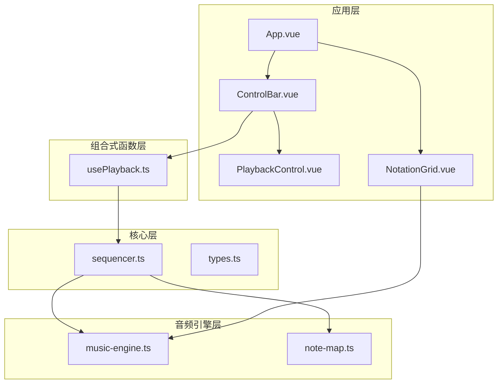
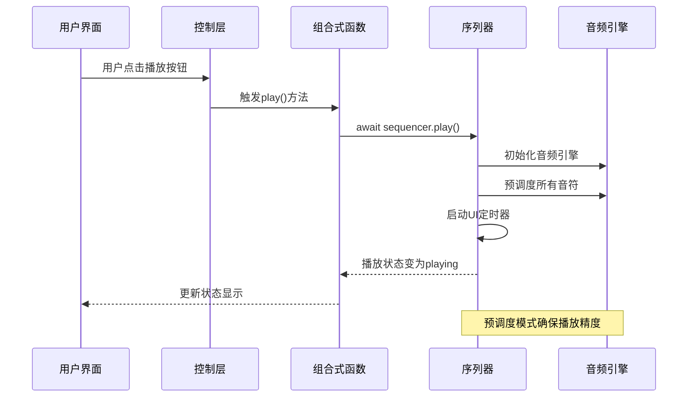
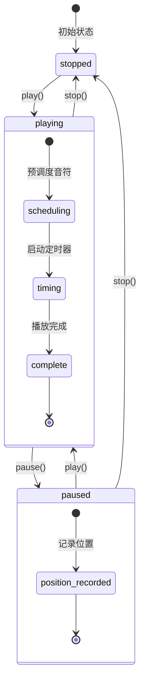
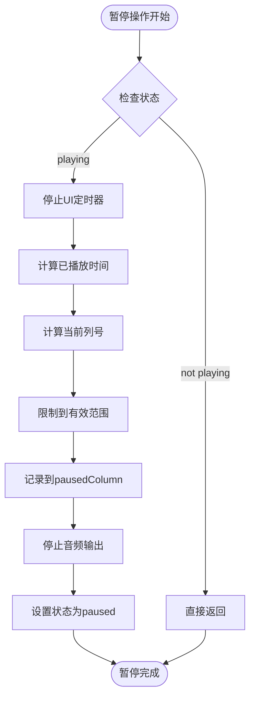
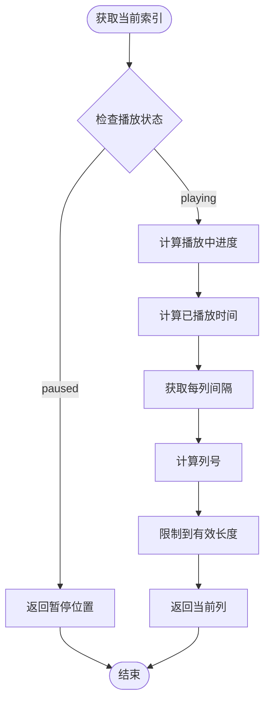
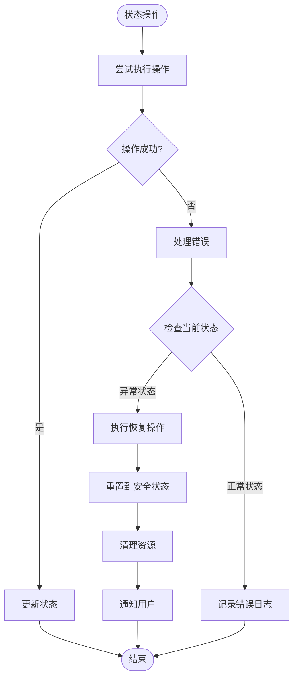
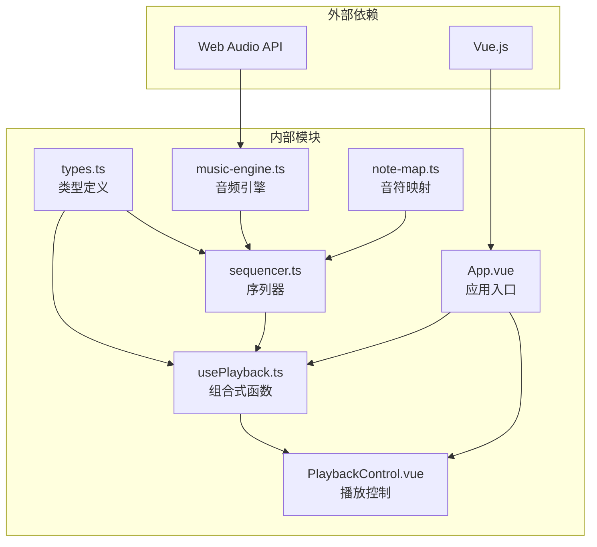

# 播放状态管理

<cite>
**本文引用的文件**
- [usePlayback.ts](file://src/composables/usePlayback.ts)
- [types.ts](file://src/core/types.ts)
- [sequencer.ts](file://src/core/sequencer.ts)
- [PlaybackControl.vue](file://src/components/PlaybackControl.vue)
- [ControlBar.vue](file://src/components/ControlBar.vue)
- [App.vue](file://src/App.vue)
- [NotationGrid.vue](file://src/components/NotationGrid.vue)
</cite>

## 目录
1. [简介](#简介)
2. [项目结构](#项目结构)
3. [核心组件](#核心组件)
4. [架构概览](#架构概览)
5. [详细组件分析](#详细组件分析)
6. [依赖关系分析](#依赖关系分析)
7. [性能考虑](#性能考虑)
8. [故障排除指南](#故障排除指南)
9. [结论](#结论)

## 简介

本文档深入解析 SUBOR Music Board 项目的播放状态管理系统。该系统实现了基于 Web Audio API 的音乐播放功能，采用预调度模式确保播放的精确性和流畅性。系统通过状态机管理播放状态，实现了完整的播放控制流程，包括播放、暂停、停止等操作，并提供了精确的播放进度计算和位置记录机制。

## 项目结构

播放状态管理系统主要分布在以下模块中：



**图表来源**
- [App.vue:1-138](file://src/App.vue#L1-L138)
- [usePlayback.ts:1-95](file://src/composables/usePlayback.ts#L1-L95)
- [sequencer.ts:1-354](file://src/core/sequencer.ts#L1-L354)

**章节来源**
- [App.vue:1-138](file://src/App.vue#L1-L138)
- [usePlayback.ts:14-95](file://src/composables/usePlayback.ts#L14-L95)

## 核心组件

### PlaybackState 枚举类型

系统定义了严格的播放状态枚举类型，确保状态转换的可控性和可预测性：

```mermaid
classDiagram
class PlaybackState {
<<enumeration>>
"stopped"
"playing"
"paused"
}
class Sequencer {
-state : PlaybackState
-pausedColumn : number
+play() Promise~void~
+pause() void
+stop() void
+getCurrentIndex() number
}
class UsePlayback {
-state : Ref~PlaybackState~
-currentColumn : Ref~number~
-loop : Ref~boolean~
+play() Promise~void~
+pause() void
+stop() void
+togglePlayPause() Promise~void~
}
Sequencer --> PlaybackState : "使用"
UsePlayback --> PlaybackState : "管理"
UsePlayback --> Sequencer : "委托"
```

**图表来源**
- [types.ts:71-72](file://src/core/types.ts#L71-L72)
- [sequencer.ts:25](file://src/core/sequencer.ts#L25)
- [usePlayback.ts:17](file://src/composables/usePlayback.ts#L17)

系统中的三种状态具有明确的含义和转换规则：
- **stopped**: 初始状态，播放已停止，位置重置为0
- **playing**: 正在播放状态，使用高性能的预调度模式
- **paused**: 暂停状态，记录当前位置以便恢复

**章节来源**
- [types.ts:71-72](file://src/core/types.ts#L71-L72)
- [sequencer.ts:25](file://src/core/sequencer.ts#L25)
- [usePlayback.ts:17](file://src/composables/usePlayback.ts#L17)

## 架构概览

播放状态管理系统采用分层架构设计，实现了清晰的关注点分离：



**图表来源**
- [usePlayback.ts:46-49](file://src/composables/usePlayback.ts#L46-L49)
- [sequencer.ts:144-167](file://src/core/sequencer.ts#L144-L167)

## 详细组件分析

### 状态转换机制

系统实现了完整的状态转换图，确保播放控制的正确性：



**图表来源**
- [usePlayback.ts:46-66](file://src/composables/usePlayback.ts#L46-L66)
- [sequencer.ts:144-200](file://src/core/sequencer.ts#L144-L200)

#### play() 方法实现

play() 方法负责启动播放流程，包含以下关键步骤：

1. **状态检查**: 避免重复启动
2. **音频引擎初始化**: 确保音频系统就绪
3. **位置重置**: 从停止状态开始时重置到第0列
4. **预调度音符**: 一次性计算所有音符的播放时间
5. **启动定时器**: 设置UI更新循环

#### pause() 方法实现

pause() 方法实现精确的位置记录和状态转换：

1. **状态验证**: 确保只有在播放状态下才能暂停
2. **状态转换**: 将状态设置为paused
3. **定时器停止**: 停止UI更新定时器
4. **位置记录**: 使用精确的时间计算记录当前位置
5. **音频停止**: 立即停止所有预调度的音符

#### stop() 方法实现

stop() 方法提供完整的播放终止功能：

1. **状态转换**: 设置为stopped状态
2. **位置重置**: 将当前位置重置为0
3. **定时器清理**: 停止所有定时器
4. **音频清理**: 停止所有音频输出

**章节来源**
- [usePlayback.ts:46-66](file://src/composables/usePlayback.ts#L46-L66)
- [sequencer.ts:144-200](file://src/core/sequencer.ts#L144-L200)

### 暂停位置记录机制

暂停位置记录机制是系统的关键特性之一，确保用户能够精确恢复播放：



**图表来源**
- [sequencer.ts:172-190](file://src/core/sequencer.ts#L172-L190)

暂停位置记录的核心算法包括：

1. **时间计算**: 使用 `performance.now()` 获取精确的时间戳
2. **列号计算**: 通过 `(performance.now() - playbackWallStart) / 1000` 计算已播放秒数
3. **除法运算**: 除以每列的时间间隔得到当前列号
4. **取整处理**: 使用 `Math.floor()` 确保列号的准确性
5. **边界检查**: 使用 `Math.min()` 限制在有效范围内

**章节来源**
- [sequencer.ts:181-186](file://src/core/sequencer.ts#L181-L186)

### 播放进度计算算法

getCurrentIndex() 方法实现了精确的播放进度计算：



**图表来源**
- [sequencer.ts:133-139](file://src/core/sequencer.ts#L133-L139)

播放进度计算的关键要素：

1. **时间基准**: 使用 `performance.now()` 作为高精度时间源
2. **时间换算**: 将毫秒转换为秒，便于与BPM计算兼容
3. **列号定位**: 通过除法运算确定当前播放的列
4. **有效长度**: 使用 `getEffectiveLength()` 确定实际播放范围
5. **边界保护**: 确保返回值不会超出乐谱范围

**章节来源**
- [sequencer.ts:133-139](file://src/core/sequencer.ts#L133-L139)

### 状态异常处理和错误恢复

系统实现了多层次的状态异常处理机制：



**图表来源**
- [sequencer.ts:144-167](file://src/core/sequencer.ts#L144-L167)
- [usePlayback.ts:46-49](file://src/composables/usePlayback.ts#L46-L49)

异常处理策略包括：

1. **幂等性保证**: play() 方法检查当前状态，避免重复启动
2. **状态回滚**: 在操作失败时自动回滚到之前的安全状态
3. **资源清理**: 确保在异常情况下释放所有占用的资源
4. **用户反馈**: 通过状态变化向用户传达系统状态

**章节来源**
- [sequencer.ts:144-167](file://src/core/sequencer.ts#L144-L167)
- [usePlayback.ts:46-49](file://src/composables/usePlayback.ts#L46-L49)

## 依赖关系分析

播放状态管理系统展现了清晰的依赖层次结构：



**图表来源**
- [types.ts:1-164](file://src/core/types.ts#L1-L164)
- [sequencer.ts:1-354](file://src/core/sequencer.ts#L1-L354)
- [usePlayback.ts:1-95](file://src/composables/usePlayback.ts#L1-L95)

**章节来源**
- [types.ts:1-164](file://src/core/types.ts#L1-L164)
- [sequencer.ts:1-354](file://src/core/sequencer.ts#L1-L354)

## 性能考虑

系统在设计时充分考虑了性能优化：

### 预调度模式优势

1. **时间精度**: 预先计算所有音符的播放时间，避免运行时计算开销
2. **播放流畅**: 音符在精确的时间点触发，确保播放的连续性
3. **CPU效率**: 减少运行时的计算负载，提高整体性能

### 内存管理

1. **定时器管理**: 及时清理不再使用的定时器，防止内存泄漏
2. **状态清理**: 在停止时清理所有状态变量
3. **音频资源**: 及时释放音频资源，避免资源占用

### 实时响应

1. **UI更新频率**: 使用约50ms的更新间隔平衡响应性和性能
2. **状态同步**: 通过回调机制确保UI状态与播放状态保持一致
3. **事件驱动**: 采用事件驱动的方式减少不必要的状态检查

## 故障排除指南

### 常见问题及解决方案

#### 播放状态异常

**问题**: 播放状态无法正确更新
**原因**: 状态监听器未正确设置或回调函数未触发
**解决方案**: 
1. 检查 `onPlay` 和 `onComplete` 回调的注册
2. 验证状态更新逻辑的正确性
3. 确认Vue响应式系统的正常工作

#### 暂停位置不准确

**问题**: 暂停后恢复播放位置不正确
**原因**: 时间计算或边界检查出现问题
**解决方案**:
1. 验证 `playbackWallStart` 的正确设置
2. 检查 `performance.now()` 的调用时机
3. 确认边界检查逻辑的正确性

#### 音频播放问题

**问题**: 音频无法播放或播放异常
**原因**: 音频引擎初始化失败或资源占用
**解决方案**:
1. 检查音频上下文的初始化状态
2. 确认浏览器的音频权限设置
3. 验证音频资源的正确加载

**章节来源**
- [usePlayback.ts:23-31](file://src/composables/usePlayback.ts#L23-L31)
- [sequencer.ts:181-186](file://src/core/sequencer.ts#L181-L186)

### 调试技巧

1. **状态监控**: 使用浏览器开发者工具监控状态变量的变化
2. **时间测量**: 使用 `performance.now()` 测量关键操作的耗时
3. **日志记录**: 添加适当的日志输出帮助调试
4. **单元测试**: 编写针对状态转换的单元测试

## 结论

SUBOR Music Board 的播放状态管理系统展现了优秀的软件架构设计。通过严格的类型定义、清晰的状态机设计和高效的预调度算法，系统实现了精确且流畅的音乐播放体验。

系统的主要优势包括：

1. **类型安全**: 使用 TypeScript 的枚举类型确保状态的完整性
2. **状态一致性**: 通过组合式函数和序列器的协作保证状态的一致性
3. **性能优化**: 预调度模式确保播放的精确性和流畅性
4. **用户体验**: 提供直观的播放控制和精确的进度指示

该系统为类似的音乐播放应用提供了良好的参考模型，展示了如何在前端环境中实现高质量的音频播放功能。