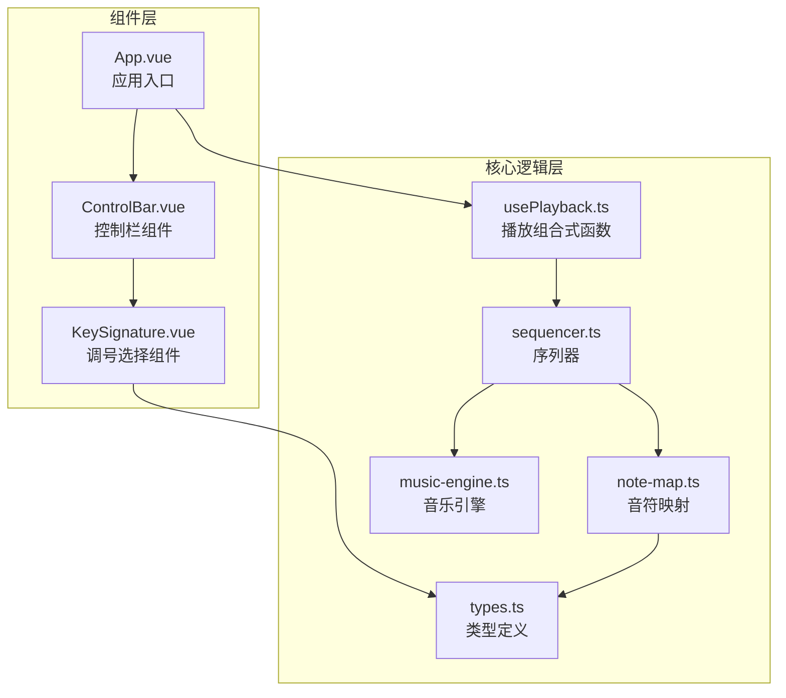
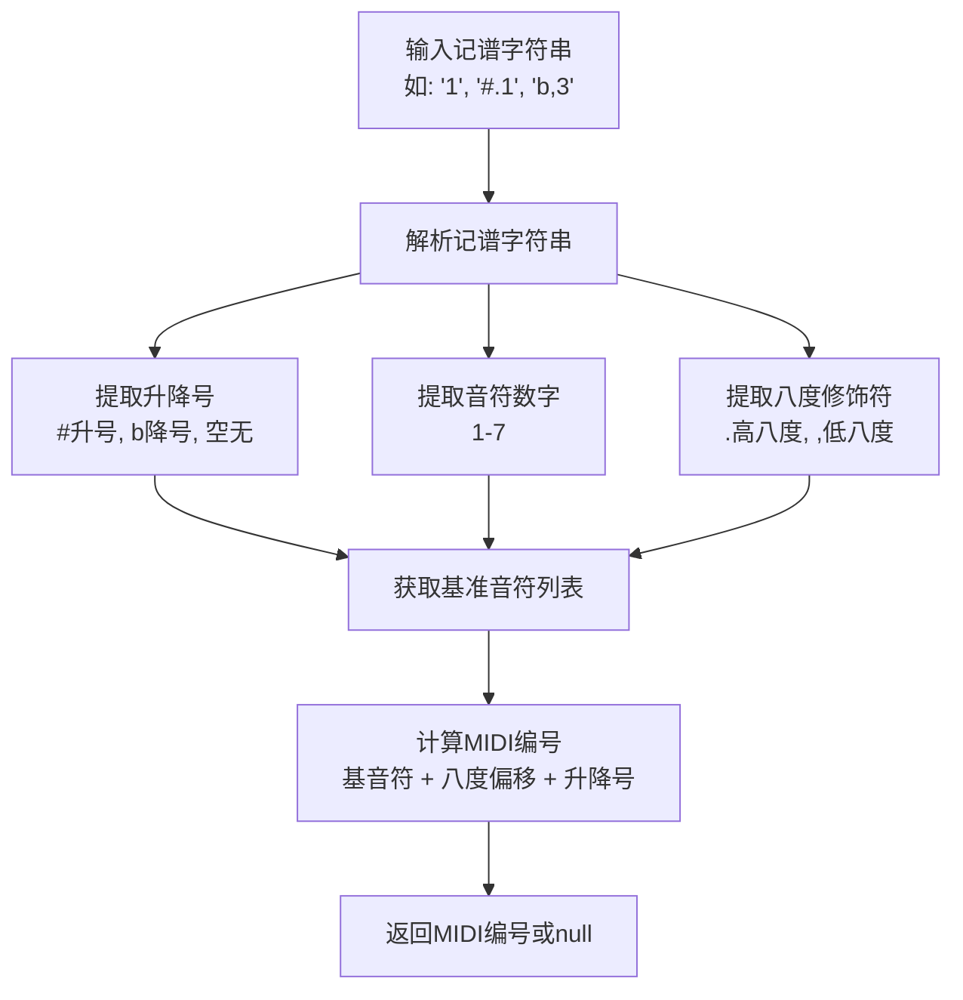
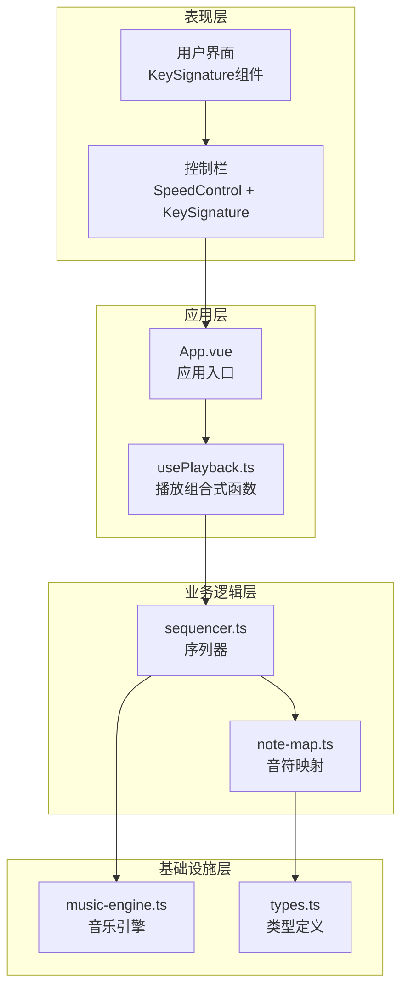
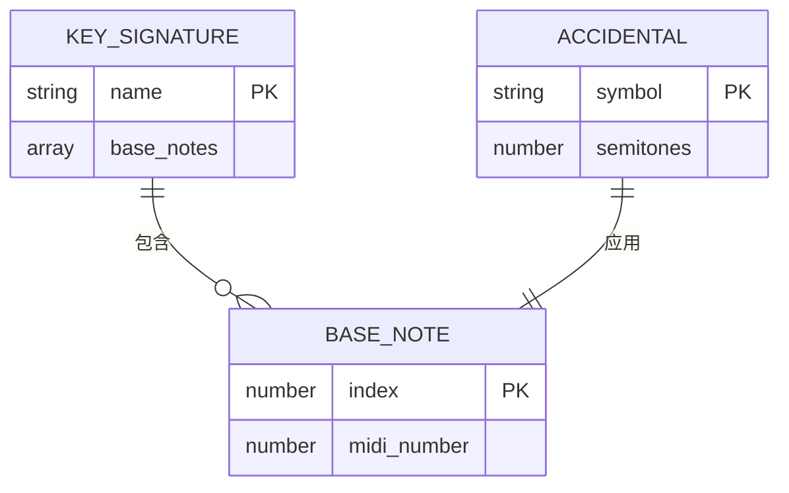
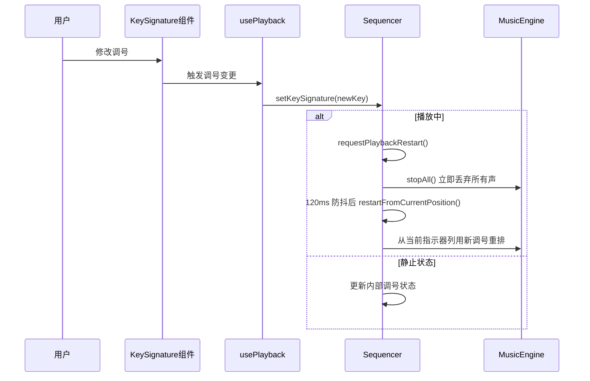
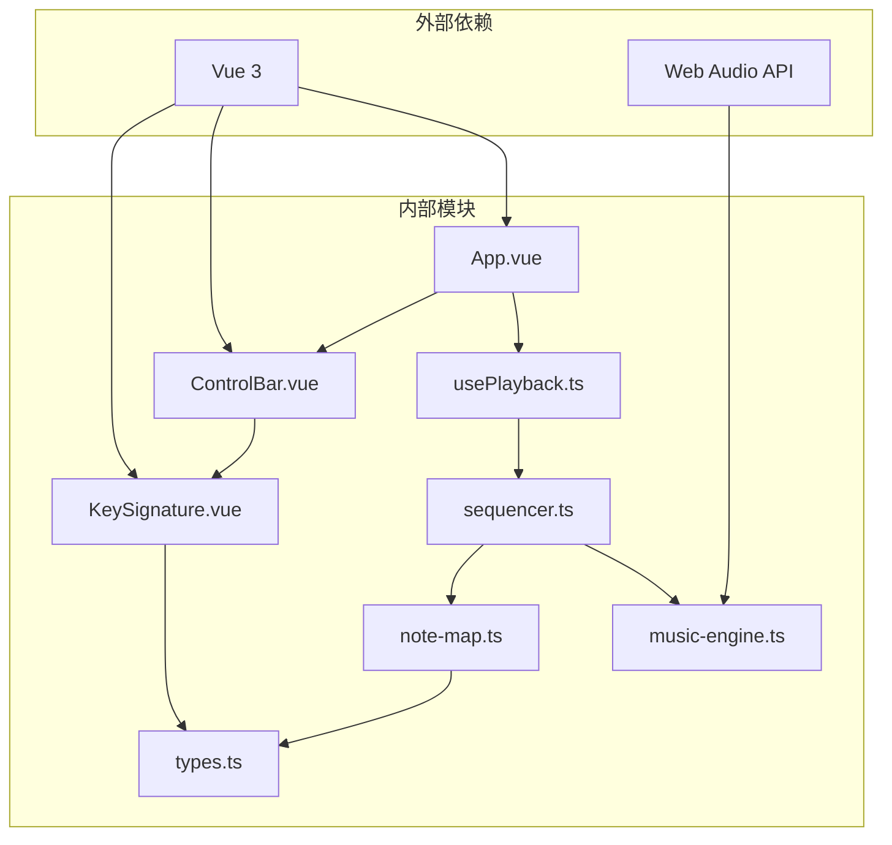

# 调号控制系统

<cite>
**本文档引用的文件**
- [KeySignature.vue](file://src/components/KeySignature.vue)
- [types.ts](file://src/core/types.ts)
- [note-map.ts](file://src/core/note-map.ts)
- [sequencer.ts](file://src/core/sequencer.ts)
- [music-engine.ts](file://src/core/music-engine.ts)
- [usePlayback.ts](file://src/composables/usePlayback.ts)
- [ControlBar.vue](file://src/components/ControlBar.vue)
- [App.vue](file://src/App.vue)
</cite>

## 目录
1. [简介](#简介)
2. [项目结构](#项目结构)
3. [核心组件](#核心组件)
4. [架构概览](#架构概览)
5. [详细组件分析](#详细组件分析)
6. [依赖关系分析](#依赖关系分析)
7. [性能考虑](#性能考虑)
8. [故障排除指南](#故障排除指南)
9. [结论](#结论)

## 简介

调号控制系统是SUBOR音乐板的核心功能模块，负责管理音乐作品的调号设置和实时切换。该系统实现了完整的调号选项管理、用户交互逻辑、音符频率计算以及播放过程中的动态调号切换机制。系统支持5个大调调号（C、D、F、G、♭B，默认C），并通过Web Audio API提供高质量的音频播放体验。note-map.ts 的 KEY_NOTE_MAP 与 types.ts 的 KeySignature 类型已统一为这 5 个调号，帮助弹窗 HelpDialog 与选择器 KeySignature.vue 的调号文案亦与之一致。

## 项目结构

调号控制系统位于项目的前端代码结构中，采用Vue 3 Composition API和TypeScript实现：



**图表来源**
- [KeySignature.vue:1-55](file://src/components/KeySignature.vue#L1-L55)
- [types.ts:1-164](file://src/core/types.ts#L1-L164)
- [note-map.ts:1-119](file://src/core/note-map.ts#L1-L119)
- [sequencer.ts:1-354](file://src/core/sequencer.ts#L1-L354)
- [music-engine.ts:1-221](file://src/core/music-engine.ts#L1-L221)
- [usePlayback.ts:1-95](file://src/composables/usePlayback.ts#L1-L95)

**章节来源**
- [KeySignature.vue:1-55](file://src/components/KeySignature.vue#L1-L55)
- [types.ts:1-164](file://src/core/types.ts#L1-L164)

## 核心组件

### 调号类型定义

系统定义了完整的调号类型系统，支持5个大调调号：

| 调号 | 调名 | 1=对应音高 |
|------|------|-----------|
| C    | C大调 | C         |
| D    | D大调 | D         |
| F    | F大调 | F         |
| G    | G大调 | G         |
| ♭B   | ♭B大调 | B♭        |

调号选项通过常量数组KEY_SIGNATURES（['C','D','F','G','A']）进行管理，确保类型安全和一致性。

**章节来源**
- [types.ts:119-139](file://src/core/types.ts#L119-L139)

### 音符到MIDI映射

系统实现了精确的音符到MIDI编号映射，支持升降号和八度修饰符：



**图表来源**
- [note-map.ts:35-100](file://src/core/note-map.ts#L35-L100)

**章节来源**
- [note-map.ts:10-119](file://src/core/note-map.ts#L10-L119)

## 架构概览

调号控制系统采用分层架构设计，各层职责明确：



**图表来源**
- [App.vue:1-138](file://src/App.vue#L1-L138)
- [usePlayback.ts:14-94](file://src/composables/usePlayback.ts#L14-L94)
- [sequencer.ts:21-354](file://src/core/sequencer.ts#L21-L354)

## 详细组件分析

### KeySignature组件分析

KeySignature组件是调号控制的核心UI组件，实现了完整的调号选择和导航功能：

```mermaid
classDiagram
class KeySignature {
+modelValue : KeySignature
+isBeginning : boolean
+isEnd : boolean
+prevKey() void
+nextKey() void
}
class KeySignatureVue {
+modelValue : KeySignature
+computed : {
isBeginning : boolean
isEnd : boolean
}
+methods : {
prevKey() void
nextKey() void
}
}
KeySignatureVue --> KeySignature : "使用"
```

**图表来源**
- [KeySignature.vue:1-55](file://src/components/KeySignature.vue#L1-L55)
- [types.ts:132-139](file://src/core/types.ts#L132-L139)

#### 用户交互逻辑

组件提供了直观的双向导航功能：
- **调号显示**：以“1=X”形式显示当前调号（如“1=C”）
- **向前导航**：点击左箭头按钮，调号按顺序递减
- **向后导航**：点击右箭头按钮，调号按顺序递增
- **边界保护**：到达首尾（isBeginning/isEnd）时禁用对应按钮，列表内移动、非循环

#### 实时响应机制

组件使用Vue的响应式系统实现自动更新：
- `modelValue`属性绑定到父组件的调号状态
- `computed`属性自动计算导航按钮的启用状态
- 通过`defineModel`实现双向数据绑定

**章节来源**
- [KeySignature.vue:6-22](file://src/components/KeySignature.vue#L6-L22)

### 调号到音高的映射关系

系统实现了精确的调号到音高的映射，基于标准十二平均律：



**图表来源**
- [note-map.ts:10-27](file://src/core/note-map.ts#L10-L27)
- [types.ts:132-135](file://src/core/types.ts#L132-L135)

#### 调号映射表

每个调号定义了完整的音阶音高映射：

| 调号 | 1 | 2 | 3 | 4 | 5 | 6 | 7 |
|------|---|---|---|---|---|---|---|
| C大调 | 60 | 62 | 64 | 65 | 67 | 69 | 71 |
| D大调 | 62 | 64 | 66 | 67 | 69 | 71 | 73 |
| F大调 | 65 | 67 | 69 | 70 | 72 | 74 | 76 |
| G大调 | 67 | 69 | 71 | 72 | 74 | 76 | 78 |
| ♭B大调 | 70 | 72 | 74 | 75 | 77 | 79 | 81 |

**章节来源**
- [note-map.ts:10-27](file://src/core/note-map.ts#L10-L27)

### 实时调号切换机制

系统实现了播放过程中的实时调号切换，确保音频连续性：



**图表来源**
- [usePlayback.ts:38-41](file://src/composables/usePlayback.ts#L38-L41)
- [sequencer.ts:55-82](file://src/core/sequencer.ts#L55-L82)
- [music-engine.ts:177-197](file://src/core/music-engine.ts#L177-L197)

#### 播放中调号切换的丢弃重排（2026-08-30 改）

系统采用"立即丢弃 + 防抖重启"策略：

1. **立即丢弃**：`setKeySignature` 命中 playing 时调用 `requestPlaybackRestart()`，`stopAll()` 清空所有已调度的振荡器，杜绝新旧调音符叠加混响
2. **防抖等待**：120ms 防抖合并连点/拖动，只在“调整完成”后重启，避免反复调度
3. **从当前列重排**：`restartFromCurrentPosition()` 依据墙钟时间算出当前指示器列，用新调号从该列整体重排（`scheduleAllNotes(currentCol)`）
4. **状态同步**：重置 playbackWallStart 与调度基准（约 100ms）对齐，指示器与该列音频同时发声，保持进度与 UI 一致

**章节来源**
- [sequencer.ts:55-125](file://src/core/sequencer.ts#L55-L125)
- [music-engine.ts:163-179](file://src/core/music-engine.ts#L163-L179)

### 音符频率计算

系统使用标准的十二平均律公式计算音符频率：

```
频率 = 27.5 × 2^((MIDI编号 - 21) / 12) × 八度倍数因子
```

其中：
- 27.5 Hz 是A0的标准频率
- MIDI编号21对应A0
- 八度倍数因子：主旋律×2，和弦律×1，低频×0.5

**章节来源**
- [music-engine.ts:105-106](file://src/core/music-engine.ts#L105-L106)

## 依赖关系分析

调号控制系统各组件之间的依赖关系清晰明确：



**图表来源**
- [KeySignature.vue:2-4](file://src/components/KeySignature.vue#L2-L4)
- [usePlayback.ts:2-3](file://src/composables/usePlayback.ts#L2-L3)
- [sequencer.ts:1-3](file://src/core/sequencer.ts#L1-L3)
- [music-engine.ts:18-25](file://src/core/music-engine.ts#L18-L25)

**章节来源**
- [App.vue:1-138](file://src/App.vue#L1-L138)
- [ControlBar.vue:1-116](file://src/components/ControlBar.vue#L1-L116)

## 性能考虑

### 音频调度优化

系统采用预调度模式，具有以下性能优势：

1. **精确时间控制**：所有音符在AudioContext时间轴上精确定时
2. **批量处理**：一次性创建和调度所有音符，减少运行时开销
3. **内存效率**：使用Map追踪活跃振荡器，避免内存泄漏
4. **CPU优化**：UI定时器仅在列号变化时触发回调

### 内存管理

系统实现了完善的内存管理策略：

- **活跃振荡器追踪**：使用Map存储所有活跃的OscillatorNode
- **自动清理**：振荡器结束时自动从追踪表中删除
- **批量停止**：支持批量停止操作，避免逐个停止的开销

**章节来源**
- [music-engine.ts:22-23](file://src/core/music-engine.ts#L22-L23)
- [music-engine.ts:142-145](file://src/core/music-engine.ts#L142-L145)

## 故障排除指南

### 常见问题及解决方案

#### 调号切换不生效

**症状**：修改调号后播放音高没有变化

**可能原因**：
1. 播放器处于静止状态，调号变更被延迟到下次播放
2. 调号值未正确传递到序列器

**解决方法**：
1. 确保调号值通过响应式系统正确传递
2. 检查`usePlayback`组合式函数中的watch监听器
3. 验证`setKeySignature`方法的调用链

#### 播放中断问题

**症状**：调号切换时出现音频中断或混响叠加

**可能原因**：
1. 播放中变更未走 `requestPlaybackRestart()`（stopAll + 防抖重启），残留旧 stopFrom 截断逻辑
2. 防抖定时器未在暂停/停止时清除，导致误重启

**解决方法**：
1. 确认 `setKeySignature` 命中 playing 时调用 `requestPlaybackRestart()`，立即 stopAll 丢弃所有声
2. 检查 `restartTimer` 是否在 pause()/stop() 中清除
3. 验证 `restartFromCurrentPosition()` 后 playbackWallStart 与 scheduleAllNotes 基准对齐（约 100ms）

#### 音符错位问题

**症状**：切换调号后音符位置不正确

**可能原因**：
1. 播放进度计算错误
2. 调度时间基准不一致

**解决方法**：
1. 检查 `restartFromCurrentPosition()` 是否正确计算当前指示器列并从该列重排
2. 验证 `playbackWallStart` 与调度基准（engine.currentTime + 0.1）的对齐机制
3. 确认时间计算的精度

**章节来源**
- [sequencer.ts:59-81](file://src/core/sequencer.ts#L59-L81)
- [music-engine.ts:177-197](file://src/core/music-engine.ts#L177-L197)

## 结论

调号控制系统展现了优秀的软件架构设计，通过以下关键特性实现了高质量的音乐创作体验：

### 技术亮点

1. **完整的调号支持**：支持5个大调调号（C/D/F/G/♭B），满足大多数音乐创作需求
2. **实时切换机制**：播放过程中无缝切换调号，保持音频连续性
3. **精确的音符映射**：基于标准十二平均律的精确频率计算
4. **高效的音频调度**：预调度模式确保音频播放的稳定性和质量
5. **响应式UI设计**：Vue 3 Composition API提供流畅的用户体验

### 扩展性设计

系统具备良好的扩展性，支持未来的功能增强：

1. **多调号支持**：可通过扩展类型定义轻松添加新的调号
2. **自定义映射**：音符映射系统支持自定义调号配置
3. **插件架构**：序列器和音乐引擎采用单例模式，便于功能扩展
4. **性能优化**：内存管理和批量操作为大规模乐谱处理奠定基础

该系统为音乐创作工具提供了坚实的技术基础，既满足了当前的功能需求，又为未来的扩展发展预留了充足的空间。