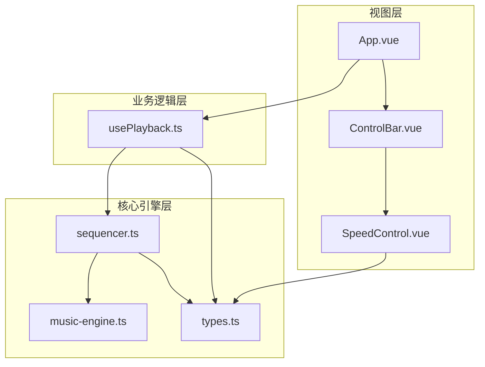
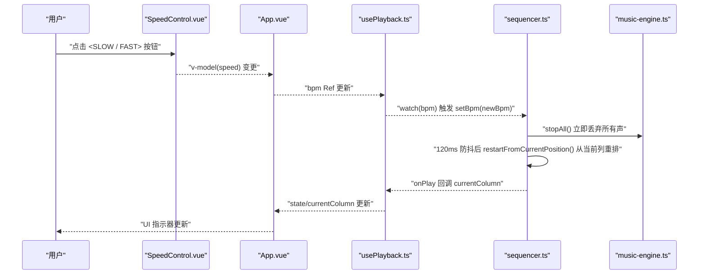
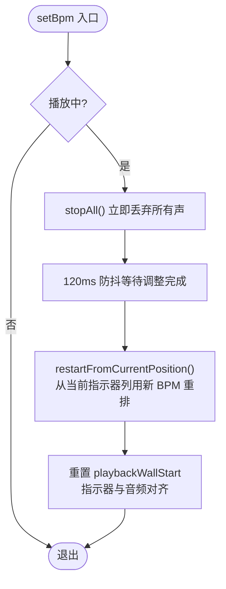
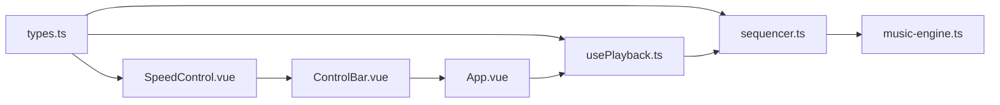

# 速度控制系统

<cite>
**本文引用的文件**
- [SpeedControl.vue](file://src/components/SpeedControl.vue)
- [ControlBar.vue](file://src/components/ControlBar.vue)
- [usePlayback.ts](file://src/composables/usePlayback.ts)
- [sequencer.ts](file://src/core/sequencer.ts)
- [music-engine.ts](file://src/core/music-engine.ts)
- [types.ts](file://src/core/types.ts)
- [App.vue](file://src/App.vue)
</cite>

## 目录
1. [简介](#简介)
2. [项目结构](#项目结构)
3. [核心组件](#核心组件)
4. [架构总览](#架构总览)
5. [详细组件分析](#详细组件分析)
6. [依赖关系分析](#依赖关系分析)
7. [性能考量](#性能考量)
8. [故障排查指南](#故障排查指南)
9. [结论](#结论)

## 简介
本技术文档聚焦“速度控制系统”，围绕 SpeedControl 组件的实现进行深入解析，涵盖 BPM 值范围与档位、用户交互逻辑、实时预览与播放墙钟时间重置机制、播放中实时调整 BPM 的算法与用户体验优化、BPM 到节拍间隔的换算关系，以及选择性停止与重新调度策略，旨在帮助开发者与使用者全面理解速度控制的工作原理与最佳实践。

## 项目结构
速度控制系统由以下关键模块组成：
- 视图层组件：SpeedControl.vue（速度控制面板）、ControlBar.vue（控制条容器）、App.vue（应用入口与状态聚合）
- 业务逻辑层：usePlayback.ts（播放控制组合式函数，连接视图与序列器）
- 核心引擎层：sequencer.ts（序列器，负责预调度与播放控制）、music-engine.ts（Web Audio 引擎，负责音符调度与停止）

图表来源
- [SpeedControl.vue:1-68](file://src/components/SpeedControl.vue#L1-L68)
- [ControlBar.vue:1-116](file://src/components/ControlBar.vue#L1-L116)
- [usePlayback.ts:1-95](file://src/composables/usePlayback.ts#L1-L95)
- [sequencer.ts:1-354](file://src/core/sequencer.ts#L1-L354)
- [music-engine.ts:1-221](file://src/core/music-engine.ts#L1-L221)
- [types.ts:101-117](file://src/core/types.ts#L101-L117)

章节来源
- [SpeedControl.vue:1-68](file://src/components/SpeedControl.vue#L1-L68)
- [ControlBar.vue:1-116](file://src/components/ControlBar.vue#L1-L116)
- [usePlayback.ts:1-95](file://src/composables/usePlayback.ts#L1-L95)
- [sequencer.ts:1-354](file://src/core/sequencer.ts#L1-L354)
- [music-engine.ts:1-221](file://src/core/music-engine.ts#L1-L221)
- [types.ts:101-117](file://src/core/types.ts#L101-L117)

## 核心组件
- SpeedControl.vue：提供 BPM 档位选择与交互，基于 BPM_LIST 与 DEFAULT_BPM，支持 <SLOW / FAST> 按钮与 6 个点状档位指示（.bpm-point，当前档高亮）。
- usePlayback.ts：封装播放状态、当前列、循环等，并监听 BPM 变化，将 BPM 传递给序列器。
- sequencer.ts：核心播放器，负责预调度、播放状态管理、BPM 实时调整、UI 定时器与播放墙钟时间重置。
- music-engine.ts：Web Audio 引擎，负责音符调度、增益包络与选择性停止，避免播放中调整 BPM 造成卡顿与音符丢失。
- types.ts：定义 BPM_LIST、DEFAULT_BPM、节拍间隔换算等常量与类型。

章节来源
- [SpeedControl.vue:1-68](file://src/components/SpeedControl.vue#L1-L68)
- [usePlayback.ts:14-41](file://src/composables/usePlayback.ts#L14-L41)
- [sequencer.ts:21-50](file://src/core/sequencer.ts#L21-L50)
- [music-engine.ts:17-36](file://src/core/music-engine.ts#L17-L36)
- [types.ts:101-117](file://src/core/types.ts#L101-L117)

## 架构总览
速度控制的端到端流程如下：
- 用户在 SpeedControl 中选择 BPM 档位，通过 v-model 将值传入 App.vue 的配置对象。
- App.vue 将配置中的 speed 与 keySignature 传入 usePlayback，usePlayback 再将 BPM 传给序列器。
- 序列器根据 BPM 计算节拍间隔，进行预调度；播放过程中，若 BPM 发生变化，则执行“stopAll 丢弃 + 120ms 防抖 + 从当前指示器列整体重排”的策略（2026-08-30 改），避免混响与错位。
- UI 通过定时器以约 50ms 间隔查询当前列，触发播放回调，实现播放指示与墙钟时间重置。

图表来源
- [SpeedControl.vue:14-20](file://src/components/SpeedControl.vue#L14-L20)
- [App.vue:25-42](file://src/App.vue#L25-L42)
- [usePlayback.ts:33-36](file://src/composables/usePlayback.ts#L33-L36)
- [sequencer.ts:84-115](file://src/core/sequencer.ts#L84-L115)
- [music-engine.ts:177-197](file://src/core/music-engine.ts#L177-L197)

## 详细组件分析

### SpeedControl 组件
- 数据模型与档位
  - 使用 defineModel 接收 v-model(speed)，初始值为 DEFAULT_BPM。
  - 通过 computed 计算当前索引与边界状态，决定 <SLOW / FAST> 按钮的可用性。
  - BPM_LIST 提供离散档位集合，changeSpeed 根据索引移动更新 modelValue。
- 交互逻辑
  - “<SLOW”按钮：索引减一，越界则忽略。
  - “FAST>”按钮：索引加一，越界则忽略。
  - 当前档位以 6 个点状档位指示（.bpm-point）高亮显示，便于用户感知当前速度。
- 实时预览
  - SpeedControl 本身不直接播放音符，但其变更通过 v-model 传播至 usePlayback，再由序列器驱动音乐引擎进行预调度与播放。

章节来源
- [SpeedControl.vue:5-20](file://src/components/SpeedControl.vue#L5-L20)
- [SpeedControl.vue:23-46](file://src/components/SpeedControl.vue#L23-L46)
- [types.ts:101-117](file://src/core/types.ts#L101-L117)

### BPM 值范围与档位
- BPM_LIST：定义离散档位数组，共 6 档：[60, 75, 90, 105, 120, 135]，用于 UI 选择与交互。
- DEFAULT_BPM：默认速度 90（适中档），作为回退与初始值。
- 每格时长：BPM 为每格速度档位（数值越大越快），每格时长 = 30 / BPM 秒，对应 60→0.500s、75→0.400s、90→0.333s（默认）、105→0.286s、120→0.250s、135→0.222s。
- 注意：当前实现使用离散档位而非任意 BPM 数值，因此不存在 20-480 的连续范围。若需扩展范围，应在 BPM_LIST 中增加更多档位或引入数值输入控件。

章节来源
- [types.ts:101-117](file://src/core/types.ts#L101-L117)
- [SpeedControl.vue:3](file://src/components/SpeedControl.vue#L3)

### setBpm 方法的实现原理（2026-08-30 改）
- 触发条件
  - 当前播放状态为 playing。
- 关键步骤
  - 立即调用 `requestPlaybackRestart()`：`getMusicEngine().stopAll()` 丢弃所有正在播放/已调度的音，杜绝新旧音符叠加（防混响）。
  - 用 120ms 防抖等待“调整完成”，连续点击/拖动只重置定时器，不反复调度。
  - 防抖触发后 `restartFromCurrentPosition()` 依据墙钟时间计算当前指示器列，用新 BPM 从该列整体重排（`scheduleAllNotes(currentCol)`），并重置 playbackWallStart 使指示器约 100ms 后落到当前列、与该列音频同时发声。
- 防抖与重启
  - `restartTimer`/`restartDelay=120` 实现防抖；暂停/停止时清除定时器，避免误重启。
  - 取代旧的「stopFrom 截断 + _rescheduling 标志」方案（旧方案快速连点时 cutoff 漂移导致混响与音画错位）。
- 位置保持（2026-08-31 修）
  - 变速前后列间隔不同：若直接用「新间隔」除以墙钟已播秒数定位列号会错位（SLOW 后退、FAST 快进）。
  - `setBpm` 先按**旧间隔**定位当前指示器列，再按**新间隔**重映射 `playbackWallStart` 到同一列，使指示器在防抖/重启期间保持在原列、平滑推进。

图表来源
- [sequencer.ts:84-115](file://src/core/sequencer.ts#L84-L115)
- [sequencer.ts:42-49](file://src/core/sequencer.ts#L42-L49)
- [music-engine.ts:177-197](file://src/core/music-engine.ts#L177-L197)

章节来源
- [sequencer.ts:84-115](file://src/core/sequencer.ts#L84-L115)
- [music-engine.ts:177-197](file://src/core/music-engine.ts#L177-L197)

### BPM 到节拍间隔的换算关系
- 每格时长 = 30 / BPM 秒（BPM 为速度档位，数值越大每格越短、整曲越快）。
- 该换算在 getNoteInterval 中实现，影响预调度时间轴与 UI 定时器的列号计算。

章节来源
- [sequencer.ts:327-329](file://src/core/sequencer.ts#L327-L329)

### 播放墙钟时间重置机制
- playbackWallStart 记录“播放起始的 wall-clock 时间（毫秒）”，用于将 performance.now() 转换为已播放秒数。
- 在 play() 与 restartFromCurrentPosition() 中均会重置 playbackWallStart，确保 UI 回调与实际播放保持一致。
- 在循环播放时，重置为当前时间，使 UI 与播放同步回到起点。

章节来源
- [sequencer.ts:39-40](file://src/core/sequencer.ts#L39-L40)
- [sequencer.ts:165](file://src/core/sequencer.ts#L165)
- [sequencer.ts:109](file://src/core/sequencer.ts#L109)
- [sequencer.ts:294](file://src/core/sequencer.ts#L294)

### 实时变速的丢弃重排策略（2026-08-30 改）
- 立即丢弃（stopAll）
  - 播放中变更时 stopAll 清空所有已调度的振荡器，杜绝新旧音符叠加产生混响。
- 防抖重启（restartFromCurrentPosition）
  - 120ms 防抖合并连点/拖动；触发后从当前指示器列用新 BPM 整体重排，并重置 playbackWallStart 与调度基准对齐（约 100ms）。
- 防护措施
  - 防抖定时器在 pause()/stop() 中清除，避免暂停后误重启。
  - 取代旧的 `stopFrom(cutoffTime)` + `lastScheduleBaseTime/lastScheduleStartCol` + `_rescheduling` 方案（快速连点时 cutoff 漂移导致混响与错位）。

章节来源
- [music-engine.ts:177-197](file://src/core/music-engine.ts#L177-L197)
- [sequencer.ts:240-263](file://src/core/sequencer.ts#L240-L263)
- [sequencer.ts:48](file://src/core/sequencer.ts#L48)

### 用户体验优化
- UI 指示
  - SpeedControl 通过 6 个点状档位指示（.bpm-point）高亮当前档位，便于用户感知当前速度。
  - 控制条中的 <SLOW / FAST> 按钮禁用状态与边界一致，避免无效操作。
- 无卡顿播放
  - 通过 stopAll + 防抖 + 从当前指示器列重排，播放中调整 BPM 立即丢弃旧音并从当前位置继续，保证流畅体验。
- 墙钟时间重置
  - 重置 playbackWallStart 使 UI 与播放同步，避免进度错乱。

章节来源
- [SpeedControl.vue:23-46](file://src/components/SpeedControl.vue#L23-L46)
- [sequencer.ts:165](file://src/core/sequencer.ts#L165)
- [sequencer.ts:109](file://src/core/sequencer.ts#L109)

## 依赖关系分析
- SpeedControl 依赖 types.ts 中的 BPM_LIST 与 DEFAULT_BPM，用于档位与初始值。
- ControlBar 作为容器，将 SpeedControl 与 KeySignature、PlaybackControl 组合，统一管理 v-model。
- App.vue 负责聚合配置（speed/keySignature）并注入 usePlayback。
- usePlayback 将 BPM 与 keySignature 传递给 sequencer，监听 BPM 变化并调用 setBpm。
- sequencer 依赖 music-engine 进行音符调度与停止，内部维护 playbackWallStart 与调度基线信息。
- types.ts 提供 BPM_LIST、DEFAULT_BPM、节拍间隔换算等基础常量与类型。

图表来源
- [types.ts:101-117](file://src/core/types.ts#L101-L117)
- [SpeedControl.vue:3](file://src/components/SpeedControl.vue#L3)
- [ControlBar.vue:3](file://src/components/ControlBar.vue#L3)
- [App.vue:25-42](file://src/App.vue#L25-L42)
- [usePlayback.ts:14-41](file://src/composables/usePlayback.ts#L14-L41)
- [sequencer.ts:21-50](file://src/core/sequencer.ts#L21-L50)
- [music-engine.ts:17-36](file://src/core/music-engine.ts#L17-L36)

章节来源
- [types.ts:101-117](file://src/core/types.ts#L101-L117)
- [SpeedControl.vue:3](file://src/components/SpeedControl.vue#L3)
- [ControlBar.vue:3](file://src/components/ControlBar.vue#L3)
- [App.vue:25-42](file://src/App.vue#L25-L42)
- [usePlayback.ts:14-41](file://src/composables/usePlayback.ts#L14-L41)
- [sequencer.ts:21-50](file://src/core/sequencer.ts#L21-L50)
- [music-engine.ts:17-36](file://src/core/music-engine.ts#L17-L36)

## 性能考量
- 预调度模式
  - 一次性计算所有音符的绝对时间并创建振荡器，减少运行时开销，提升播放稳定性。
- 实时变速的丢弃重排
  - BPM 变更时 stopAll 丢弃所有声 + 120ms 防抖，从当前指示器列整体重排，避免多版本叠加混响。
- UI 定时器
  - 以约 50ms 间隔轮询当前列，频率适中，兼顾响应性与性能。
- 音符时长与增益包络
  - 方波音符时长与节拍间隔一致，配合线性淡出，减少不必要的计算与音频噪声。
- 建议
  - 若扩展 BPM 范围，建议维持离散档位以简化 UI 与算法复杂度。
  - 对于高频 BPM 变化场景，已有 120ms 防抖（restartTimer）降低重调度频率。

[本节为通用性能讨论，不直接分析具体文件]

## 故障排查指南
- BPM 调整后 UI 不同步
  - 检查 playbackWallStart 是否被正确重置（play/restartFromCurrentPosition）。
  - 确认 UI 定时器是否仍在运行（startUiTimer/stopUiTimer）。
- 播放中 BPM 调整卡顿或混响
  - 确认 setBpm 命中 playing 时走 requestPlaybackRestart（stopAll + 防抖重启），未残留旧 stopFrom 截断逻辑。
  - 检查防抖定时器（restartTimer）是否在 pause()/stop() 中清除。
- 无效档位或越界
  - 确保 BPM_LIST 中包含 DEFAULT_BPM，且 changeSpeed 的边界检查生效。
- 音频初始化失败
  - 确认用户手势后初始化了 AudioContext，并且未处于 suspended 状态。

章节来源
- [sequencer.ts:165](file://src/core/sequencer.ts#L165)
- [sequencer.ts:109](file://src/core/sequencer.ts#L109)
- [sequencer.ts:294](file://src/core/sequencer.ts#L294)
- [music-engine.ts:177-197](file://src/core/music-engine.ts#L177-L197)
- [SpeedControl.vue:14-20](file://src/components/SpeedControl.vue#L14-L20)

## 结论
速度控制系统通过离散档位与预调度播放模型，在播放中实现了平滑的 BPM 调整。核心在于“stopAll 丢弃 + 防抖 + 从当前指示器列整体重排”的策略与播放墙钟时间的重置，既杜绝了新旧音符叠加混响，又保持了指示器与音频同步。若需扩展到更宽的 BPM 范围，可在保持现有架构的前提下引入数值输入与更细粒度的档位控制。