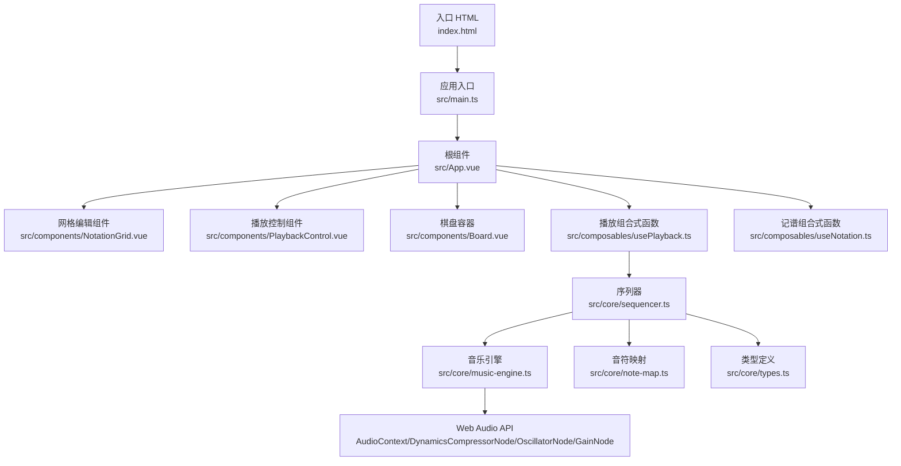
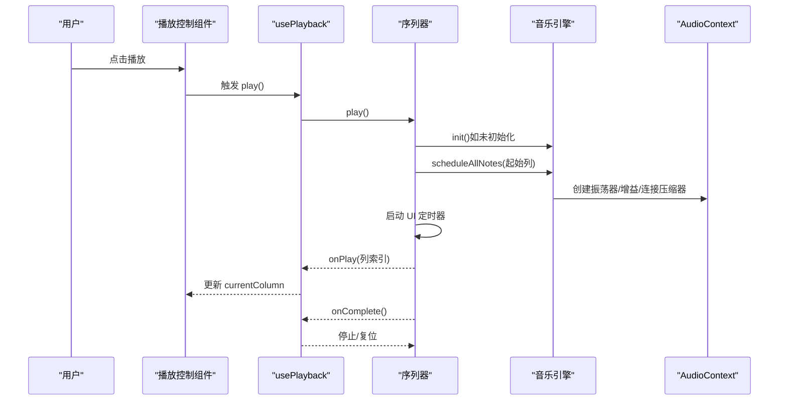
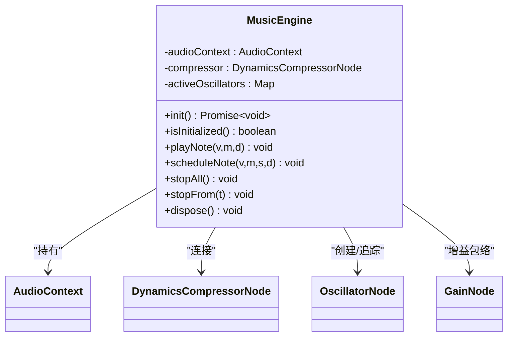
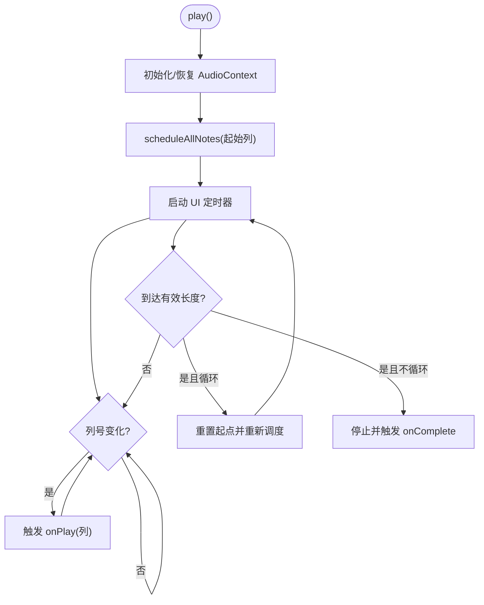
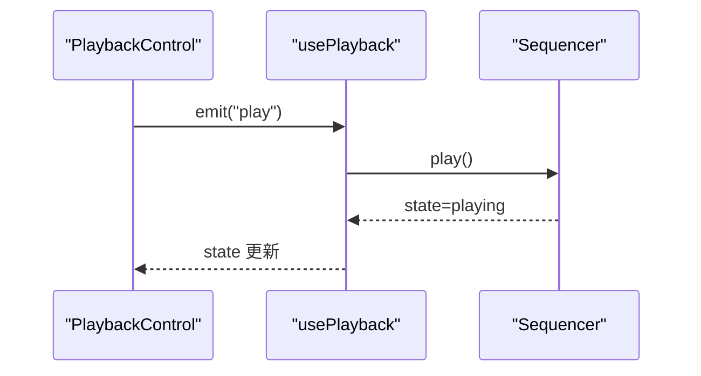
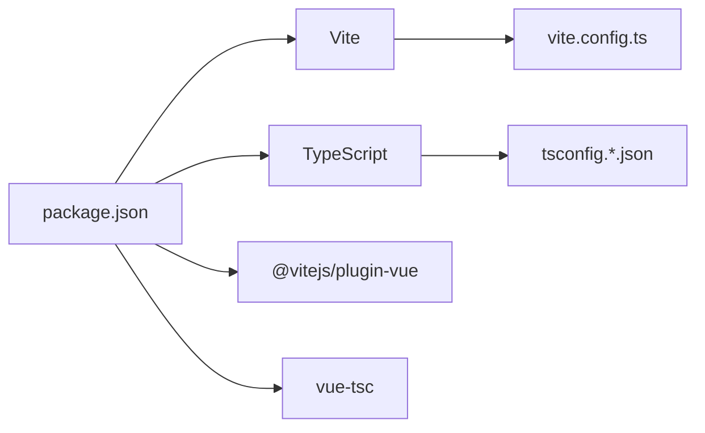

# 故障排除与FAQ

<cite>
**本文引用的文件**
- [README.md](file://README.md)
- [package.json](file://package.json)
- [vite.config.ts](file://vite.config.ts)
- [index.html](file://index.html)
- [src/main.ts](file://src/main.ts)
- [src/style.css](file://src/style.css)
- [src/App.vue](file://src/App.vue)
- [src/components/Board.vue](file://src/components/Board.vue)
- [src/components/PlaybackControl.vue](file://src/components/PlaybackControl.vue)
- [src/composables/useNotation.ts](file://src/composables/useNotation.ts)
- [src/composables/usePlayback.ts](file://src/composables/usePlayback.ts)
- [src/core/types.ts](file://src/core/types.ts)
- [src/core/note-map.ts](file://src/core/note-map.ts)
- [src/core/music-engine.ts](file://src/core/music-engine.ts)
- [src/core/sequencer.ts](file://src/core/sequencer.ts)
- [demos/jinglebell.html](file://demos/jinglebell.html)
</cite>

## 目录
1. [简介](#简介)
2. [项目结构](#项目结构)
3. [核心组件](#核心组件)
4. [架构总览](#架构总览)
5. [详细组件分析](#详细组件分析)
6. [依赖关系分析](#依赖关系分析)
7. [性能考虑](#性能考虑)
8. [故障排除指南](#故障排除指南)
9. [结论](#结论)
10. [附录](#附录)

## 简介
本指南面向使用 SUBOR Music Board 的开发者与用户，聚焦以下问题：
- 音频播放问题：无声、点击声、延迟、卡顿、BPM/调号变更异常
- 浏览器兼容性问题：AudioContext 状态、自动播放策略、厂商前缀
- 性能优化问题：播放器定时器、预调度策略、资源释放
- 开发环境问题：Vite 构建、TypeScript 编译、模块解析
- 调试工具与自诊断：浏览器开发者工具、Web Audio API 可视化

本指南提供系统化的诊断流程、常见症状与修复建议，并给出与源码对应的“章节来源”以便进一步查阅。

## 项目结构
项目基于 Vue 3 + TypeScript + Vite，采用组件化与组合式 API 设计，核心音频由原生 Web Audio API 实现，不依赖第三方音频库。

图表来源
- [index.html:1-14](file://index.html#L1-L14)
- [src/main.ts:1-8](file://src/main.ts#L1-L8)
- [src/App.vue:1-138](file://src/App.vue#L1-L138)
- [src/components/PlaybackControl.vue:1-111](file://src/components/PlaybackControl.vue#L1-L111)
- [src/composables/usePlayback.ts:1-95](file://src/composables/usePlayback.ts#L1-L95)
- [src/composables/useNotation.ts:1-116](file://src/composables/useNotation.ts#L1-L116)
- [src/core/sequencer.ts:1-354](file://src/core/sequencer.ts#L1-L354)
- [src/core/music-engine.ts:1-221](file://src/core/music-engine.ts#L1-L221)
- [src/core/note-map.ts:1-119](file://src/core/note-map.ts#L1-L119)
- [src/core/types.ts:1-164](file://src/core/types.ts#L1-L164)

章节来源
- [README.md:1-6](file://README.md#L1-L6)
- [package.json:1-25](file://package.json#L1-L25)
- [vite.config.ts:1-8](file://vite.config.ts#L1-L8)
- [index.html:1-14](file://index.html#L1-L14)
- [src/main.ts:1-8](file://src/main.ts#L1-L8)
- [src/style.css:1-30](file://src/style.css#L1-L30)

## 核心组件
- 音乐引擎（MusicEngine）
  - 单例管理 AudioContext 与主压缩器，负责音符的精确调度与停止
  - 支持立即播放与预调度模式，避免 UI 与音频时间不同步
- 序列器（Sequencer）
  - 预调度所有剩余音符，按 BPM 计算列间隔；支持暂停/恢复/停止/循环
  - 实时调整 BPM/调号时，stopAll 立即丢弃所有声，120ms 防抖后从当前指示器列整体重排
- 播放组合式函数（usePlayback）
  - 将播放状态、当前列、循环等与 UI 绑定，监听 BPM/调号变化并同步给序列器
- 记谱组合式函数（useNotation）
  - 提供乐谱数据结构、光标移动、覆盖写入/空格插入/回删/清空等编辑能力
- 组件
  - PlaybackControl：播放/暂停、停止、循环切换按钮
  - Board：界面容器与样式骨架

章节来源
- [src/core/music-engine.ts:17-221](file://src/core/music-engine.ts#L17-L221)
- [src/core/sequencer.ts:21-354](file://src/core/sequencer.ts#L21-L354)
- [src/composables/usePlayback.ts:14-95](file://src/composables/usePlayback.ts#L14-L95)
- [src/composables/useNotation.ts:15-116](file://src/composables/useNotation.ts#L15-L116)
- [src/components/PlaybackControl.vue:1-111](file://src/components/PlaybackControl.vue#L1-L111)
- [src/components/Board.vue:1-47](file://src/components/Board.vue#L1-L47)

## 架构总览
音频路径遵循“序列器预调度 → 音乐引擎创建节点 → 音频上下文时间轴精确播放”的模式，UI 通过定时器驱动播放进度指示。

图表来源
- [src/components/PlaybackControl.vue:16-30](file://src/components/PlaybackControl.vue#L16-L30)
- [src/composables/usePlayback.ts:46-77](file://src/composables/usePlayback.ts#L46-L77)
- [src/core/sequencer.ts:144-167](file://src/core/sequencer.ts#L144-L167)
- [src/core/music-engine.ts:41-60](file://src/core/music-engine.ts#L41-L60)
- [src/core/music-engine.ts:240-263](file://src/core/music-engine.ts#L240-L263)

## 详细组件分析

### 音乐引擎（MusicEngine）
- 关键职责
  - 管理 AudioContext 生命周期（初始化、resume、关闭）
  - 为每个音符创建独立的振荡器与增益节点，按时间轴精确起止
  - 三声部共享压缩器，主旋律/和弦律用方波，低频用三角波
- 重要行为
  - playNote/scheduleNote：支持立即播放与预调度
  - stopAll/stopFrom：选择性停止未来音符，避免卡顿
  - dispose：释放资源，重置单例

图表来源
- [src/core/music-engine.ts:17-221](file://src/core/music-engine.ts#L17-L221)

章节来源
- [src/core/music-engine.ts:17-221](file://src/core/music-engine.ts#L17-L221)

### 序列器（Sequencer）
- 关键职责
  - 计算列间隔与音符时长，预调度所有剩余音符
  - 管理播放状态、UI 定时器、循环与完成回调
  - 实时调整 BPM/调号时，走 requestPlaybackRestart（stopAll 丢弃 + 120ms 防抖 + 从当前指示器列整体重排）
- 重要行为
  - scheduleAllNotes：按基准时间与列间距创建音符
  - startUiTimer：约 50ms 轮询当前列，触发 onPlay 回调
  - getEffectiveLength：跳过空白列，减少无效播放

图表来源
- [src/core/sequencer.ts:144-167](file://src/core/sequencer.ts#L144-L167)
- [src/core/sequencer.ts:240-263](file://src/core/sequencer.ts#L240-L263)
- [src/core/sequencer.ts:271-313](file://src/core/sequencer.ts#L271-L313)
- [src/core/sequencer.ts:223-232](file://src/core/sequencer.ts#L223-L232)

章节来源
- [src/core/sequencer.ts:21-354](file://src/core/sequencer.ts#L21-L354)

### 播放控制与组合式函数
- usePlayback
  - 维护播放状态、当前列、循环标志
  - 监听 BPM/调号变化，同步至序列器
  - 提供 play/pause/stop/togglePlayPause/toggleLoop
- PlaybackControl
  - 根据状态渲染按钮图标与禁用态
  - 触发父组件事件（play/pause/stop/toggle-loop）

图表来源
- [src/components/PlaybackControl.vue:16-30](file://src/components/PlaybackControl.vue#L16-L30)
- [src/composables/usePlayback.ts:46-77](file://src/composables/usePlayback.ts#L46-L77)
- [src/core/sequencer.ts:144-167](file://src/core/sequencer.ts#L144-L167)

章节来源
- [src/composables/usePlayback.ts:14-95](file://src/composables/usePlayback.ts#L14-L95)
- [src/components/PlaybackControl.vue:1-111](file://src/components/PlaybackControl.vue#L1-L111)

### 记谱与类型系统
- note-map
  - 将简谱字符映射为 MIDI 编号，支持升降号与位于数字前的八度修饰符
  - 基于调号查表，生成三声部 MIDI 数组
- types
  - 定义列、光标、播放状态、BPM/调号枚举与导出格式
  - 提供默认值与校验规则

章节来源
- [src/core/note-map.ts:1-119](file://src/core/note-map.ts#L1-L119)
- [src/core/types.ts:1-164](file://src/core/types.ts#L1-L164)

## 依赖关系分析
- 运行时依赖
  - Vue 3、nes.css、@fontsource/press-start-2p
- 开发依赖
  - Vite、@vitejs/plugin-vue、TypeScript、vue-tsc
- 构建配置
  - vite.config.ts 仅启用 Vue 插件，保持最小化配置

图表来源
- [package.json:1-25](file://package.json#L1-L25)
- [vite.config.ts:1-8](file://vite.config.ts#L1-L8)

章节来源
- [package.json:1-25](file://package.json#L1-L25)
- [vite.config.ts:1-8](file://vite.config.ts#L1-L8)

## 性能考虑
- 预调度策略
  - 一次性创建并调度所有剩余音符，避免 UI 与音频时间不同步
  - 通过基准时间与列间距计算绝对播放时间，提升精度
- 定时器开销
  - UI 定时器约 50ms 轮询，兼顾流畅与能耗
- 实时变速/变调的丢弃重排
  - BPM/调号变更时 stopAll 立即丢弃所有声，120ms 防抖后从当前指示器列整体重排，杜绝叠加混响并保持音画同步
- 资源释放
  - 停止/销毁时清理定时器、断开连接、关闭 AudioContext，防止内存泄漏

章节来源
- [src/core/sequencer.ts:240-263](file://src/core/sequencer.ts#L240-L263)
- [src/core/sequencer.ts:271-313](file://src/core/sequencer.ts#L271-L313)
- [src/core/sequencer.ts:84-115](file://src/core/sequencer.ts#L84-L115)
- [src/core/music-engine.ts:155-214](file://src/core/music-engine.ts#L155-L214)

## 故障排除指南

### 一、音频播放问题

1) 症状：完全无声
- 可能原因
  - AudioContext 处于 suspended 状态（需用户交互唤醒）
  - 引擎未初始化或已销毁
- 排查步骤
  - 在浏览器控制台检查 AudioContext 状态与 resume 结果
  - 确认首次播放前调用了初始化流程
  - 若页面被隐藏或后台标签页，尝试切换到前台再播放
- 修复建议
  - 确保播放按钮绑定的事件在用户手势后触发
  - 如需自动播放，参考浏览器自动播放策略与权限设置

章节来源
- [src/core/music-engine.ts:41-60](file://src/core/music-engine.ts#L41-L60)
- [src/core/music-engine.ts:144-150](file://src/core/music-engine.ts#L144-L150)

2) 症状：播放时出现点击声或爆音
- 可能原因
  - 方波/三角波在起止瞬间未做平滑处理
  - stop 时机不当导致波形不连续
- 排查步骤
  - 检查增益包络与停止时间是否正确
  - 确认 stopFrom/stopAll 是否在合适时机调用
- 修复建议
  - 依据引擎实现的增益调度与淡出策略进行核对
  - 避免在音符已结束或不存在时重复停止

章节来源
- [src/core/music-engine.ts:117-149](file://src/core/music-engine.ts#L117-L149)
- [src/core/music-engine.ts:177-197](file://src/core/music-engine.ts#L177-L197)

3) 症状：播放卡顿或延迟
- 可能原因
  - UI 定时器过于频繁或系统负载过高
  - 预调度节点过多导致 GC 抖动
- 排查步骤
  - 使用浏览器性能面板观察帧率与 JS 占用
  - 检查有效长度与空白列数量
- 修复建议
  - 保持 50ms 轮询频率即可；减少不必要的 UI 更新
  - 导入/编辑时及时清理空白列，缩短有效长度

章节来源
- [src/core/sequencer.ts:271-313](file://src/core/sequencer.ts#L271-L313)
- [src/core/sequencer.ts:223-232](file://src/core/sequencer.ts#L223-L232)

4) 症状：BPM 或调号变更后音符错乱（混响叠加 / 指示器不同步）
- 可能原因
  - 播放中变更未走「stopAll 丢弃 + 防抖重启」，残留旧 stopFrom 截断逻辑导致新旧节奏混合
- 排查步骤
  - 确认 setBpm/setKeySignature 命中 playing 时调用 requestPlaybackRestart（立即 stopAll）
  - 检查 restartFromCurrentPosition 后 playbackWallStart 与调度基准对齐（约 100ms）
  - 确认防抖定时器在 pause()/stop() 中被清除
- 修复建议
  - 严格遵循「stopAll 丢弃所有声 → 120ms 防抖 → 从当前指示器列整体重排」的流程

章节来源
- [src/core/sequencer.ts:84-115](file://src/core/sequencer.ts#L84-L115)
- [src/core/sequencer.ts:248-263](file://src/core/sequencer.ts#L248-L263)

5) 症状：停止后仍有声音残留
- 可能原因
  - 振荡器未被停止或仍在活跃集合中
- 排查步骤
  - 检查 activeOscillators 映射与 onended 回调
- 修复建议
  - 调用 stopAll/stopFrom 并确认映射清空

章节来源
- [src/core/music-engine.ts:155-197](file://src/core/music-engine.ts#L155-L197)

### 二、浏览器兼容性问题

1) 症状：AudioContext 不存在或报错
- 可能原因
  - 旧版浏览器使用 webkitAudioContext 前缀
- 排查步骤
  - 在控制台检查 window.AudioContext 与 window.webkitAudioContext
- 修复建议
  - 使用引擎中兼容性构造方式

章节来源
- [src/core/music-engine.ts:45-46](file://src/core/music-engine.ts#L45-L46)
- [demos/jinglebell.html:27-28](file://demos/jinglebell.html#L27-L28)

2) 症状：自动播放被阻止
- 可能原因
  - 浏览器策略限制，需用户手势激活
- 排查步骤
  - 查看控制台网络面板与媒体权限
- 修复建议
  - 将播放绑定到显式的用户交互事件（如点击）

章节来源
- [src/core/music-engine.ts:49-52](file://src/core/music-engine.ts#L49-L52)

3) 症状：不同浏览器音色/延迟差异
- 可能原因
  - 不同内核对 Web Audio API 的实现差异
- 修复建议
  - 以本项目引擎实现为准，避免依赖特定浏览器特性

章节来源
- [src/core/music-engine.ts:105-108](file://src/core/music-engine.ts#L105-L108)

### 三、开发环境问题

1) 启动失败（dev）
- 症状：npm run dev 报错
- 排查步骤
  - 检查 Node 版本与依赖安装
  - 确认端口占用与防火墙
- 修复建议
  - 清理 node_modules 并重新安装依赖

章节来源
- [package.json:6-10](file://package.json#L6-L10)

2) 构建失败（build）
- 症状：npm run build 报错
- 排查步骤
  - 检查 tsconfig 与类型声明
  - 确认 vue-tsc 与 vite 版本兼容
- 修复建议
  - 使用 package.json 中的版本范围

章节来源
- [package.json:8](file://package.json#L8)
- [vite.config.ts:1-8](file://vite.config.ts#L1-L8)

3) 预览失败（preview）
- 症状：npm run preview 报错
- 排查步骤
  - 确认已先执行 build
- 修复建议
  - 先 build 再 preview

章节来源
- [package.json:9](file://package.json#L9)

4) 模块解析错误
- 症状：TS/JS 导入报错
- 排查步骤
  - 检查路径拼写与文件存在性
  - 确认 tsconfig 与 Vite 插件配置
- 修复建议
  - 使用相对路径与正确的扩展名

章节来源
- [vite.config.ts:1-8](file://vite.config.ts#L1-L8)
- [src/main.ts:1-8](file://src/main.ts#L1-L8)

### 四、调试工具与自诊断

1) 浏览器开发者工具
- Console
  - 检查 AudioContext 状态、resume 结果、错误堆栈
- Performance
  - 观察 UI 定时器与音频调度的 CPU 占用
- Memory
  - 监测对象存活，确认无泄漏
- Network
  - 确认未加载外部音频资源（纯 Web Audio）

章节来源
- [src/core/music-engine.ts:49-52](file://src/core/music-engine.ts#L49-L52)
- [src/core/sequencer.ts:271-313](file://src/core/sequencer.ts#L271-L313)

2) Web Audio API 可视化
- 使用浏览器自带的 Web Audio Inspector（如 Chrome DevTools Audion 标签）
- 关注：
  - 振荡器数量与生命周期
  - 增益包络曲线
  - 压缩器输出电平

章节来源
- [src/core/music-engine.ts:110-149](file://src/core/music-engine.ts#L110-L149)

3) 日志与断点
- 在以下位置设置断点或日志：
  - usePlayback.play/pause/stop
  - Sequencer.play/pause/stop/scheduleAllNotes
  - MusicEngine.scheduleNote/stopAll/stopFrom

章节来源
- [src/composables/usePlayback.ts:46-93](file://src/composables/usePlayback.ts#L46-L93)
- [src/core/sequencer.ts:144-200](file://src/core/sequencer.ts#L144-L200)
- [src/core/music-engine.ts:90-150](file://src/core/music-engine.ts#L90-L150)

## 结论
本指南提供了从音频播放、浏览器兼容性、性能优化到开发环境与调试工具的系统化故障排除方案。建议在日常使用中：
- 将播放绑定到用户交互事件
- 避免在后台标签页长时间运行音频
- 控制有效长度，减少无效播放
- 使用内置组合式函数与组件，遵循预调度与选择性停止原则
- 借助浏览器开发者工具进行可视化诊断

## 附录

### A. 常见问题速查
- 问：为什么第一次播放无声？
  - 答：AudioContext 需要用户手势唤醒，请在点击播放后再初始化
- 问：如何避免点击声？
  - 答：遵循引擎的增益包络与停止策略
- 问：如何优化播放性能？
  - 答：减少空白列、保持 50ms 轮询、及时释放资源
- 问：如何解决 Vite/TS 构建问题？
  - 答：按 package.json 版本安装依赖，先 build 再 preview

章节来源
- [src/core/music-engine.ts:49-52](file://src/core/music-engine.ts#L49-L52)
- [src/core/music-engine.ts:117-149](file://src/core/music-engine.ts#L117-L149)
- [src/core/sequencer.ts:271-313](file://src/core/sequencer.ts#L271-L313)
- [package.json:6-10](file://package.json#L6-L10)