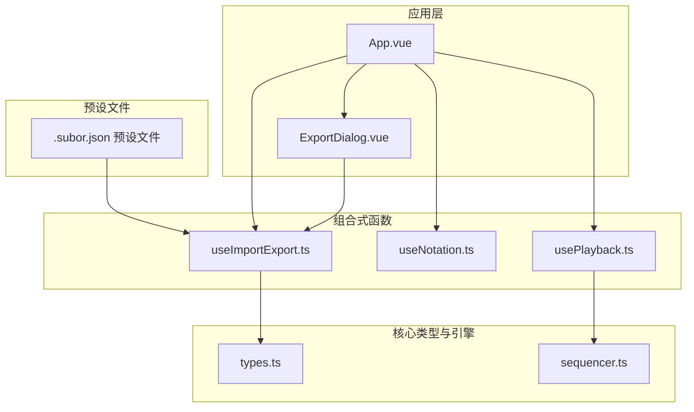
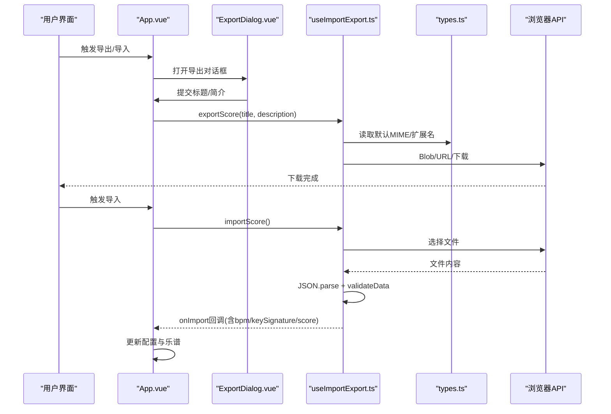
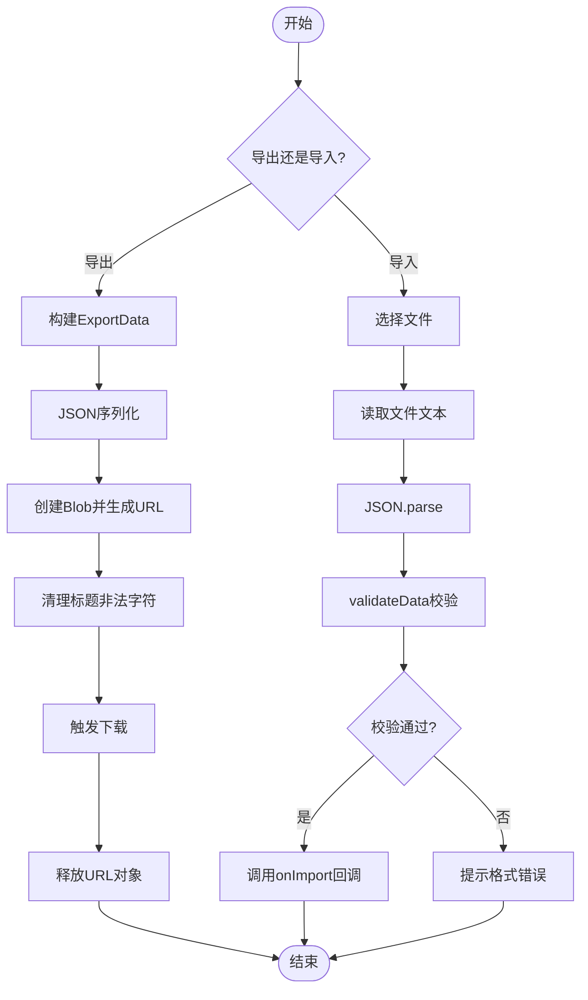
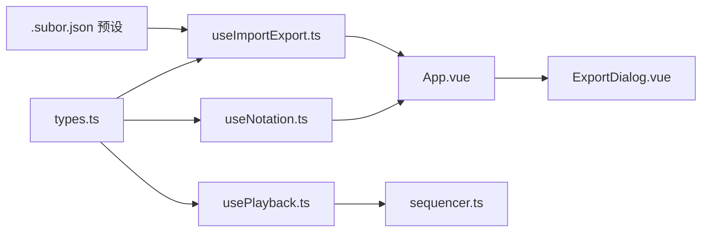

# 文件管理功能

<cite>
**本文引用的文件**
- [useImportExport.ts](file://src/composables/useImportExport.ts)
- [types.ts](file://src/core/types.ts)
- [ExportDialog.vue](file://src/components/ExportDialog.vue)
- [App.vue](file://src/App.vue)
- [useNotation.ts](file://src/composables/useNotation.ts)
- [usePlayback.ts](file://src/composables/usePlayback.ts)
- [sequencer.ts](file://src/core/sequencer.ts)
- [jingle-bell.subor.json](file://presets/jingle-bell.subor.json)
- [twinkle-star.subor.json](file://presets/twinkle-star.subor.json)
- [coffin-dance.subor.json](file://presets/coffin-dance.subor.json)
</cite>

## 目录
1. [简介](#简介)
2. [项目结构](#项目结构)
3. [核心组件](#核心组件)
4. [架构总览](#架构总览)
5. [详细组件分析](#详细组件分析)
6. [依赖关系分析](#依赖关系分析)
7. [性能考量](#性能考量)
8. [故障排查指南](#故障排查指南)
9. [结论](#结论)
10. [附录](#附录)

## 简介
本文件聚焦于“文件管理功能”，系统性阐述以下内容：
- useImportExport组合式函数的实现与工作机制：文件读取、解析、验证与错误处理
- .subor.json文件格式规范：数据结构、字段含义、版本兼容策略
- 导入流程：文件格式校验、数据转换、容错与回退策略
- 导出流程：数据序列化、文件生成与下载机制
- 预设音乐文件结构分析：不同作品的数据组织方式与特点
- 文件操作最佳实践与安全注意事项

## 项目结构
该应用采用Vue 3 + TypeScript构建，文件管理相关代码主要分布在以下模块：
- 组合式函数：useImportExport.ts负责导入/导出逻辑
- 类型定义：types.ts定义了ExportData、Score、KeySignature等核心类型
- 视图组件：ExportDialog.vue提供导出对话框UI
- 应用入口：App.vue协调导入/导出与记谱、播放功能
- 核心引擎：useNotation.ts、usePlayback.ts、sequencer.ts支撑乐谱编辑与播放

图表来源
- [App.vue:1-138](file://src/App.vue#L1-L138)
- [useImportExport.ts:1-138](file://src/composables/useImportExport.ts#L1-L138)
- [ExportDialog.vue:1-119](file://src/components/ExportDialog.vue#L1-L119)
- [types.ts:140-164](file://src/core/types.ts#L140-L164)
- [useNotation.ts:1-116](file://src/composables/useNotation.ts#L1-L116)
- [usePlayback.ts:1-95](file://src/composables/usePlayback.ts#L1-L95)
- [sequencer.ts:1-354](file://src/core/sequencer.ts#L1-L354)

章节来源
- [App.vue:1-138](file://src/App.vue#L1-L138)
- [useImportExport.ts:1-138](file://src/composables/useImportExport.ts#L1-L138)
- [ExportDialog.vue:1-119](file://src/components/ExportDialog.vue#L1-L119)
- [types.ts:140-164](file://src/core/types.ts#L140-L164)

## 核心组件
- useImportExport：封装导入/导出能力，负责JSON序列化、文件下载、文件读取、数据验证与错误处理
- ExportDialog：提供导出标题与简介输入，触发导出流程
- types：定义ExportData接口、Score类型、KeySignature等，统一数据契约
- App：协调导入/导出与记谱、播放功能，作为组合式函数的调用方

章节来源
- [useImportExport.ts:18-137](file://src/composables/useImportExport.ts#L18-L137)
- [ExportDialog.vue:1-119](file://src/components/ExportDialog.vue#L1-L119)
- [types.ts:140-164](file://src/core/types.ts#L140-L164)
- [App.vue:44-99](file://src/App.vue#L44-L99)

## 架构总览
导入/导出流程在应用层与组合式函数之间解耦，类型定义保证数据一致性，播放引擎与记谱引擎在后台协同工作。

图表来源
- [App.vue:86-99](file://src/App.vue#L86-L99)
- [ExportDialog.vue:17-34](file://src/components/ExportDialog.vue#L17-L34)
- [useImportExport.ts:24-79](file://src/composables/useImportExport.ts#L24-L79)
- [types.ts:160-164](file://src/core/types.ts#L160-L164)

## 详细组件分析

### useImportExport 组合式函数
- 导出流程
  - 将当前bpm、keySignature、score封装为ExportData对象
  - 使用JSON.stringify进行序列化，设置MIME类型为application/json
  - 通过Blob与URL.createObjectURL生成临时下载链接
  - 对标题进行安全清理（移除非法字符），拼接“.subor.json”扩展名
  - 创建隐藏的<a>元素并触发点击下载，随后释放URL对象
- 导入流程
  - 创建隐藏的文件输入控件，限定accept为.json与.subor.json
  - 读取文件文本并JSON.parse为ExportData
  - 调用validateData进行严格校验：版本号、bpm、keySignature、score
  - 若校验通过，调用onImport回调，传入标准化后的数据
  - 异常捕获：解析失败或校验失败时输出错误日志并提示用户
- 数据验证策略
  - 版本：仅接受'1.0'
  - BPM：从预定义列表中选择，若不在列表则回退至默认值
  - 调号：必须在允许集合内，否则回退至默认值
  - 乐谱：确保为二维数组，每个单元为三元组；空乐谱自动补齐默认列数
- 错误处理
  - JSON解析异常：弹窗提示“文件格式错误”
  - 校验失败：返回null，不触发onImport
  - 用户未选择文件：直接返回

图表来源
- [useImportExport.ts:24-79](file://src/composables/useImportExport.ts#L24-L79)
- [useImportExport.ts:84-131](file://src/composables/useImportExport.ts#L84-L131)

章节来源
- [useImportExport.ts:18-137](file://src/composables/useImportExport.ts#L18-L137)

### 导出对话框 ExportDialog
- 负责收集导出标题与简介，提供表单校验与提交事件
- 标题必填且长度限制，简介可选
- 提交后向父组件传递标题与简介，由父组件调用导出函数

章节来源
- [ExportDialog.vue:1-119](file://src/components/ExportDialog.vue#L1-L119)

### 导入/导出在应用中的集成
- App.vue中注入useImportExport，并将当前bpm、keySignature、score作为选项传入
- onImport回调中更新配置与加载乐谱
- 导出时先暂停播放，打开导出对话框，确认后触发导出
- 导入时先停止播放，触发导入流程

章节来源
- [App.vue:44-99](file://src/App.vue#L44-L99)

### .subor.json 文件格式规范
- 版本号：'1.0'
- 字段定义
  - title：字符串，必填
  - description：字符串，可选
  - bpm：数字，必须在预定义列表中，否则回退
  - keySignature：字符串，必须在允许集合内，否则回退
  - score：二维数组，外层数组长度为列数，内层数组为三元组，分别对应三个声部
- 版本兼容性
  - 仅支持'1.0'版本；其他版本将被拒绝
- 文件扩展名与MIME类型
  - 扩展名：.subor.json
  - MIME类型：application/json

章节来源
- [types.ts:140-164](file://src/core/types.ts#L140-L164)
- [useImportExport.ts:24-47](file://src/composables/useImportExport.ts#L24-L47)

### 导入功能实现细节
- 文件格式验证
  - 严格检查version字段
  - 校验bpm是否在允许列表
  - 校验keySignature是否在允许集合
  - 校验score结构，确保每列三元组且为字符串
- 数据转换与回退
  - 不合法bpm回退到默认值
  - 不合法keySignature回退到默认值
  - 不合法score回退到默认空白三元组
  - 空score自动补齐默认列数
- 错误处理
  - 解析失败或校验失败均提示用户“文件格式错误”

章节来源
- [useImportExport.ts:84-131](file://src/composables/useImportExport.ts#L84-L131)

### 导出功能实现细节
- 数据序列化
  - 使用JSON.stringify进行序列化，保留字段与结构
- 文件生成与下载
  - 通过Blob与URL.createObjectURL生成临时下载链接
  - 清理标题中的非法字符，拼接扩展名
  - 创建隐藏的<a>元素并触发点击下载
  - 下载完成后释放URL对象，避免内存泄漏

章节来源
- [useImportExport.ts:24-47](file://src/composables/useImportExport.ts#L24-L47)

### 预设音乐文件结构分析
- 结构共性
  - 均包含version、title、description、bpm、keySignature、score字段
  - score为二维数组，列数因作品而异
- 典型作品对比
  - 铃儿响叮当：C大调，120BPM，经典圣诞歌曲，重复性强，音程跳跃明显
  - 小星星：C大调，90BPM，经典儿歌主题，旋律简单，重复性高
  - CoffinDance（黑人抬棺）：D大调，105BPM，节奏鲜明，音符跨度较大
- 特点总结
  - 铃儿响叮当与小星星：重复性高，适合入门练习
  - CoffinDance：节奏感强，适合背景音乐

章节来源
- [twinkle-star.subor.json:1-56](file://presets/twinkle-star.subor.json#L1-L56)
- [jingle-bell.subor.json:1-106](file://presets/jingle-bell.subor.json#L1-L106)
- [coffin-dance.subor.json:1-103](file://presets/coffin-dance.subor.json#L1-L103)

## 依赖关系分析
- useImportExport依赖types.ts中的ExportData、KeySignature、BPM_LIST、KEY_SIGNATURES、DEFAULT_COLUMNS、EXPORT_MIME_TYPE、EXPORT_FILE_EXT
- App.vue依赖useImportExport、useNotation、usePlayback
- usePlayback依赖sequencer.ts提供的单例序列器
- 导入流程最终通过useNotation的loadScore加载到乐谱

图表来源
- [useImportExport.ts:1-3](file://src/composables/useImportExport.ts#L1-L3)
- [types.ts:140-164](file://src/core/types.ts#L140-L164)
- [App.vue:44-53](file://src/App.vue#L44-L53)
- [usePlayback.ts:14-42](file://src/composables/usePlayback.ts#L14-L42)
- [sequencer.ts:342-354](file://src/core/sequencer.ts#L342-L354)

章节来源
- [useImportExport.ts:1-3](file://src/composables/useImportExport.ts#L1-L3)
- [types.ts:140-164](file://src/core/types.ts#L140-L164)
- [App.vue:44-53](file://src/App.vue#L44-L53)
- [usePlayback.ts:14-42](file://src/composables/usePlayback.ts#L14-L42)
- [sequencer.ts:342-354](file://src/core/sequencer.ts#L342-L354)

## 性能考量
- 导出
  - JSON序列化与Blob创建为O(n)线性操作，n为乐谱列数
  - 下载触发为浏览器原生行为，避免额外JS阻塞
- 导入
  - 文件读取与JSON解析为O(m)线性操作，m为文件大小
  - validateData遍历score为O(n)，但提前短路与默认回退减少无效计算
- 播放与记谱
  - 导入后通过loadScore按需补齐列数，避免不必要的渲染
  - 播放引擎采用预调度模式，提升播放流畅度

[本节为通用性能讨论，不直接分析具体文件]

## 故障排查指南
- 导入失败：提示“文件格式错误”
  - 可能原因：文件不是JSON或不符合ExportData结构
  - 排查步骤：确认文件扩展名为.subor.json或.json；检查version字段为'1.0'
- BPM或调号异常
  - 可能原因：bpm不在允许列表或keySignature不在允许集合
  - 排查步骤：确认bpm为预定义列表中的值；确认keySignature为允许值之一
- 乐谱为空或显示异常
  - 可能原因：score为空或结构不正确
  - 排查步骤：确认score为二维数组，每列三元组；若为空，系统会自动补齐默认列数
- 下载失败
  - 可能原因：标题包含非法字符或浏览器阻止下载
  - 排查步骤：清理标题中的非法字符；检查浏览器下载设置

章节来源
- [useImportExport.ts:72-76](file://src/composables/useImportExport.ts#L72-L76)
- [useImportExport.ts:91-95](file://src/composables/useImportExport.ts#L91-L95)
- [useImportExport.ts:125-128](file://src/composables/useImportExport.ts#L125-L128)

## 结论
useImportExport组合式函数提供了简洁可靠的导入/导出能力，配合严格的类型定义与数据验证，确保了文件格式的一致性与安全性。.subor.json格式以'1.0'版本为核心契约，明确了字段与结构要求。通过与记谱与播放功能的无缝集成，用户可以高效地创作、保存与分享音乐作品。

[本节为总结性内容，不直接分析具体文件]

## 附录
- 关键流程图与类图请参考前述章节的图表来源与章节来源
- 预设文件可作为模板参考，便于理解字段与结构

[本节为补充说明，不直接分析具体文件]