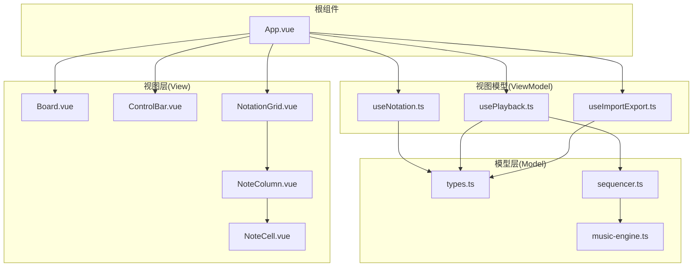
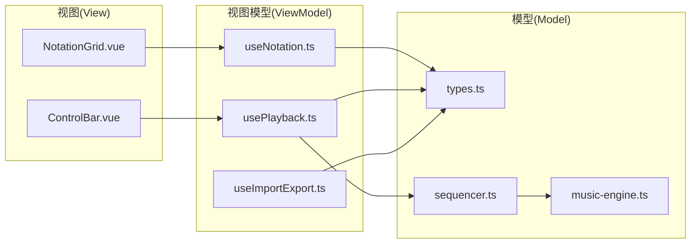
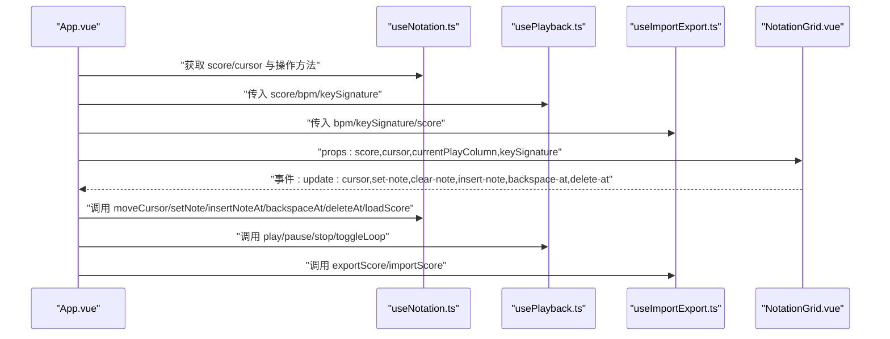
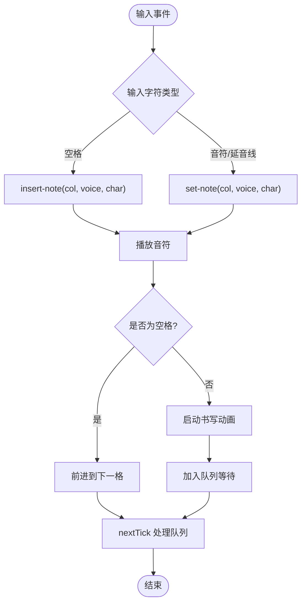
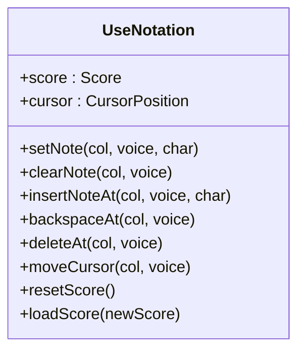
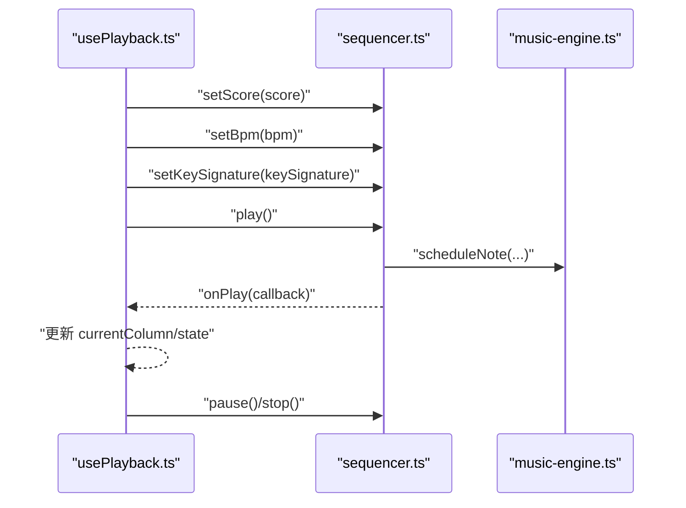
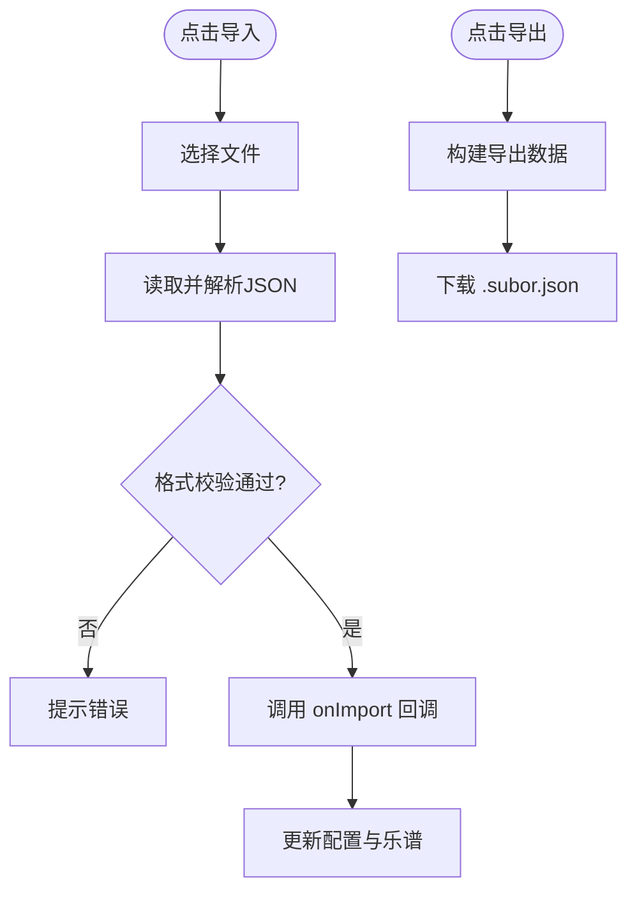
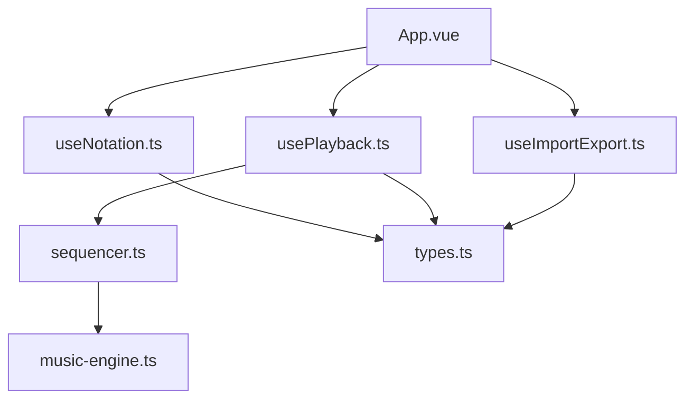

# MVVM架构模式

<cite>
**本文引用的文件**
- [src/App.vue](file://src/App.vue)
- [src/components/NotationGrid.vue](file://src/components/NotationGrid.vue)
- [src/composables/useNotation.ts](file://src/composables/useNotation.ts)
- [src/main.ts](file://src/main.ts)
- [src/components/Board.vue](file://src/components/Board.vue)
- [src/components/ControlBar.vue](file://src/components/ControlBar.vue)
- [src/components/NoteColumn.vue](file://src/components/NoteColumn.vue)
- [src/components/NoteCell.vue](file://src/components/NoteCell.vue)
- [src/composables/usePlayback.ts](file://src/composables/usePlayback.ts)
- [src/composables/useImportExport.ts](file://src/composables/useImportExport.ts)
- [src/core/sequencer.ts](file://src/core/sequencer.ts)
- [src/core/music-engine.ts](file://src/core/music-engine.ts)
- [src/core/types.ts](file://src/core/types.ts)
</cite>

## 目录
1. [简介](#简介)
2. [项目结构](#项目结构)
3. [核心组件](#核心组件)
4. [架构总览](#架构总览)
5. [详细组件分析](#详细组件分析)
6. [依赖关系分析](#依赖关系分析)
7. [性能考量](#性能考量)
8. [故障排查指南](#故障排查指南)
9. [结论](#结论)
10. [附录](#附录)

## 简介
本文件围绕 SUBOR Music Board 项目，系统阐述其基于 Vue 3 的 MVVM 架构模式实现。MVVM 将应用分为 Model（数据模型）、View（视图组件）、ViewModel（组合式函数）三层，强调数据驱动视图更新与组件解耦。本文结合项目源码，解释 App.vue 如何作为根组件协调各子组件，NotationGrid 如何作为视图层处理用户交互，useNotation 如何作为 ViewModel 管理业务逻辑，并说明 props 传递与 events 事件系统的工作原理。同时总结 MVVM 模式的工程优势与最佳实践。

## 项目结构
项目采用“组件 + 组合式函数 + 核心模块”的分层组织方式：
- 视图层（View）：Board、ControlBar、NotationGrid、NoteColumn、NoteCell 等 UI 组件
- 视图模型（ViewModel）：useNotation、usePlayback、useImportExport 等组合式函数
- 模型层（Model）：core 目录下的 types、sequencer、music-engine 等核心类型与引擎
- 根组件：App.vue 协调各子组件与组合式函数，建立数据与事件的桥梁

图表来源
- [src/App.vue:1-138](file://src/App.vue#L1-L138)
- [src/components/Board.vue:1-47](file://src/components/Board.vue#L1-L47)
- [src/components/ControlBar.vue:1-116](file://src/components/ControlBar.vue#L1-L116)
- [src/components/NotationGrid.vue:1-292](file://src/components/NotationGrid.vue#L1-L292)
- [src/components/NoteColumn.vue:1-63](file://src/components/NoteColumn.vue#L1-L63)
- [src/components/NoteCell.vue:1-278](file://src/components/NoteCell.vue#L1-L278)
- [src/composables/useNotation.ts:1-116](file://src/composables/useNotation.ts#L1-L116)
- [src/composables/usePlayback.ts:1-95](file://src/composables/usePlayback.ts#L1-L95)
- [src/composables/useImportExport.ts:1-138](file://src/composables/useImportExport.ts#L1-L138)
- [src/core/sequencer.ts:1-354](file://src/core/sequencer.ts#L1-L354)
- [src/core/music-engine.ts:1-221](file://src/core/music-engine.ts#L1-L221)
- [src/core/types.ts:1-164](file://src/core/types.ts#L1-L164)

章节来源
- [src/App.vue:1-138](file://src/App.vue#L1-L138)
- [src/main.ts:1-8](file://src/main.ts#L1-L8)

## 核心组件
- App.vue：根组件，聚合 useNotation、usePlayback、useImportExport，负责配置项（速度、调号）、播放状态与对话框可见性等，向下通过 props 传递给视图层，向上接收事件并调用 ViewModel 方法。
- NotationGrid.vue：视图层核心，接收乐谱、光标、当前播放列、调号等 props，向上派发 set/clear/insert/backspace/delete 等事件，内部协调 Quill 动画、键盘导航与输入处理。
- useNotation.ts：ViewModel，封装乐谱数据与光标的状态与操作（设置、插入、删除、移动、加载等），提供只读视图数据，隔离底层数据结构细节。
- usePlayback.ts：ViewModel，封装播放控制与状态（播放/暂停/停止/循环），监听 BPM 与调号变化，与 sequencer 协作更新 UI。
- useImportExport.ts：ViewModel，封装导入导出逻辑，校验数据格式并触发根组件的配置与乐谱更新回调。
- sequencer.ts 与 music-engine.ts：Model 层，前者负责预调度与 UI 定时器，后者负责 Web Audio API 的音符调度与停止策略。
- types.ts：Model 类型定义，统一 NoteChar、VoiceIndex、Score、CursorPosition、PlaybackState、KeySignature 等类型与常量。

章节来源
- [src/App.vue:13-100](file://src/App.vue#L13-L100)
- [src/components/NotationGrid.vue:10-27](file://src/components/NotationGrid.vue#L10-L27)
- [src/composables/useNotation.ts:15-116](file://src/composables/useNotation.ts#L15-L116)
- [src/composables/usePlayback.ts:14-94](file://src/composables/usePlayback.ts#L14-L94)
- [src/composables/useImportExport.ts:18-137](file://src/composables/useImportExport.ts#L18-L137)
- [src/core/sequencer.ts:21-354](file://src/core/sequencer.ts#L21-L354)
- [src/core/music-engine.ts:17-221](file://src/core/music-engine.ts#L17-L221)
- [src/core/types.ts:1-164](file://src/core/types.ts#L1-L164)

## 架构总览
MVVM 在本项目中的落地要点：
- Model（数据模型）：由 types.ts 定义的数据结构与 sequencer/music-engine 提供的播放能力构成
- View（视图组件）：Board、ControlBar、NotationGrid、NoteColumn、NoteCell 等 UI 组件
- ViewModel（组合式函数）：useNotation、usePlayback、useImportExport 将业务逻辑与状态封装为可复用的组合式函数

图表来源
- [src/components/NotationGrid.vue:1-292](file://src/components/NotationGrid.vue#L1-L292)
- [src/components/ControlBar.vue:1-116](file://src/components/ControlBar.vue#L1-L116)
- [src/composables/useNotation.ts:1-116](file://src/composables/useNotation.ts#L1-L116)
- [src/composables/usePlayback.ts:1-95](file://src/composables/usePlayback.ts#L1-L95)
- [src/composables/useImportExport.ts:1-138](file://src/composables/useImportExport.ts#L1-L138)
- [src/core/types.ts:1-164](file://src/core/types.ts#L1-L164)
- [src/core/sequencer.ts:1-354](file://src/core/sequencer.ts#L1-L354)
- [src/core/music-engine.ts:1-221](file://src/core/music-engine.ts#L1-L221)

## 详细组件分析

### App.vue：根组件的协调职责
- 职责
  - 调用 useNotation 获取乐谱与光标状态，以及 set/clear/insert/backspace/delete/move/load 等操作
  - 调用 usePlayback 获取播放状态、当前播放列与 play/pause/stop/toggleLoop 等控制
  - 调用 useImportExport 实现导入/导出，处理配置与乐谱回填
  - 通过 props 将配置项（速度、调号）与状态（播放状态、当前播放列）传递给子组件
  - 通过事件监听器处理来自视图层的用户操作，调用 ViewModel 方法
- 数据流
  - ViewModel 返回的响应式状态与方法通过 props 下发至视图层，视图层通过事件回调反向驱动 ViewModel
- 关键路径
  - [useNotation:15-116](file://src/composables/useNotation.ts#L15-L116)
  - [usePlayback:14-94](file://src/composables/usePlayback.ts#L14-L94)
  - [useImportExport:18-137](file://src/composables/useImportExport.ts#L18-L137)

图表来源
- [src/App.vue:13-100](file://src/App.vue#L13-L100)
- [src/components/NotationGrid.vue:18-27](file://src/components/NotationGrid.vue#L18-L27)
- [src/composables/useNotation.ts:15-116](file://src/composables/useNotation.ts#L15-L116)
- [src/composables/usePlayback.ts:14-94](file://src/composables/usePlayback.ts#L14-L94)
- [src/composables/useImportExport.ts:18-137](file://src/composables/useImportExport.ts#L18-L137)

章节来源
- [src/App.vue:13-100](file://src/App.vue#L13-L100)

### NotationGrid.vue：视图层的交互与事件派发
- 职责
  - 接收 props：乐谱、光标、当前播放列、调号
  - 派发事件：update:cursor、set-note、clear-note、insert-note、backspace-at、delete-at、play-note
  - 处理键盘导航（方向键移动）
  - 协调 Quill 动画与输入队列，保证书写动画与输入的有序执行
- 关键路径
  - [props 定义:10-16](file://src/components/NotationGrid.vue#L10-L16)
  - [事件定义:18-27](file://src/components/NotationGrid.vue#L18-L27)
  - [键盘导航:186-244](file://src/components/NotationGrid.vue#L186-L244)
  - [输入处理与动画队列:113-156](file://src/components/NotationGrid.vue#L113-L156)

图表来源
- [src/components/NotationGrid.vue:113-156](file://src/components/NotationGrid.vue#L113-L156)

章节来源
- [src/components/NotationGrid.vue:10-27](file://src/components/NotationGrid.vue#L10-L27)
- [src/components/NotationGrid.vue:186-244](file://src/components/NotationGrid.vue#L186-L244)
- [src/components/NotationGrid.vue:113-156](file://src/components/NotationGrid.vue#L113-L156)

### useNotation.ts：ViewModel 的数据与业务逻辑
- 职责
  - 维护响应式乐谱与光标状态
  - 提供 setNote、clearNote、insertNoteAt、backspaceAt、deleteAt、moveCursor、resetScore、loadScore 等操作
  - 对外暴露只读的 score 与 cursor，避免外部直接修改
- 关键路径
  - [响应式状态与只读暴露:16-17](file://src/composables/useNotation.ts#L16-L17)
  - [操作方法实现:20-101](file://src/composables/useNotation.ts#L20-L101)
  - [返回值导出:103-116](file://src/composables/useNotation.ts#L103-L116)

图表来源
- [src/composables/useNotation.ts:15-116](file://src/composables/useNotation.ts#L15-L116)

章节来源
- [src/composables/useNotation.ts:15-116](file://src/composables/useNotation.ts#L15-L116)

### usePlayback.ts：ViewModel 的播放控制
- 职责
  - 维护播放状态、当前播放列、循环标志
  - 监听 BPM 与调号变化，动态更新 sequencer
  - 提供 play、pause、stop、togglePlayPause、toggleLoop 等控制方法
- 关键路径
  - [选项与初始化:14-31](file://src/composables/usePlayback.ts#L14-L31)
  - [watch 监听:33-41](file://src/composables/usePlayback.ts#L33-L41)
  - [播放控制方法:46-82](file://src/composables/usePlayback.ts#L46-L82)

图表来源
- [src/composables/usePlayback.ts:14-94](file://src/composables/usePlayback.ts#L14-L94)
- [src/core/sequencer.ts:21-354](file://src/core/sequencer.ts#L21-L354)
- [src/core/music-engine.ts:17-221](file://src/core/music-engine.ts#L17-L221)

章节来源
- [src/composables/usePlayback.ts:14-94](file://src/composables/usePlayback.ts#L14-L94)

### useImportExport.ts：ViewModel 的导入导出
- 职责
  - 导出：将 bpm、keySignature、score 打包为 JSON 并下载
  - 导入：读取文件、校验格式、触发 onImport 回调以更新根组件配置与乐谱
- 关键路径
  - [导出实现:24-47](file://src/composables/useImportExport.ts#L24-L47)
  - [导入与校验:52-131](file://src/composables/useImportExport.ts#L52-L131)

图表来源
- [src/composables/useImportExport.ts:52-131](file://src/composables/useImportExport.ts#L52-L131)

章节来源
- [src/composables/useImportExport.ts:18-137](file://src/composables/useImportExport.ts#L18-L137)

### ControlBar.vue：控制栏视图组件
- 职责
  - 通过 v-model 双向绑定速度与调号
  - 派发播放控制与导入导出事件
- 关键路径
  - [v-model 定义:7-8](file://src/components/ControlBar.vue#L7-L8)
  - [事件派发:16-24](file://src/components/ControlBar.vue#L16-L24)

章节来源
- [src/components/ControlBar.vue:1-116](file://src/components/ControlBar.vue#L1-L116)

### Board.vue：容器视图组件
- 职责
  - 作为页面容器，承载标题与插槽内容
- 关键路径
  - [插槽渲染](file://src/components/Board.vue#L7)

章节来源
- [src/components/Board.vue:1-47](file://src/components/Board.vue#L1-L47)

### NoteColumn.vue 与 NoteCell.vue：单元格层级
- 职责
  - NoteColumn：按列渲染三个声部的 NoteCell，并转发输入、删除、回退、焦点事件
  - NoteCell：处理单个输入框的合法字符校验、升降号与八度修饰符拼接、抖动反馈与焦点管理
- 关键路径
  - [NoteColumn 事件转发:13-18](file://src/components/NoteColumn.vue#L13-L18)
  - [NoteCell 输入与修饰符处理:68-115](file://src/components/NoteCell.vue#L68-L115)

章节来源
- [src/components/NoteColumn.vue:1-63](file://src/components/NoteColumn.vue#L1-L63)
- [src/components/NoteCell.vue:1-278](file://src/components/NoteCell.vue#L1-L278)

## 依赖关系分析
- 组件耦合
  - App.vue 与各 ViewModel 强耦合，但与视图层通过 props/events 解耦
  - NotationGrid 与 NoteColumn/NoteCell 通过事件与 ref 暴露方法弱耦合
- 外部依赖
  - usePlayback 依赖 sequencer.ts，sequencer.ts 依赖 music-engine.ts
  - 所有 ViewModel 依赖 types.ts 的类型定义
- 循环依赖
  - 未发现循环依赖，数据流单向从 ViewModel -> View

图表来源
- [src/App.vue:13-100](file://src/App.vue#L13-L100)
- [src/composables/useNotation.ts:1-116](file://src/composables/useNotation.ts#L1-L116)
- [src/composables/usePlayback.ts:1-95](file://src/composables/usePlayback.ts#L1-L95)
- [src/composables/useImportExport.ts:1-138](file://src/composables/useImportExport.ts#L1-L138)
- [src/core/sequencer.ts:1-354](file://src/core/sequencer.ts#L1-L354)
- [src/core/music-engine.ts:1-221](file://src/core/music-engine.ts#L1-L221)
- [src/core/types.ts:1-164](file://src/core/types.ts#L1-L164)

章节来源
- [src/App.vue:13-100](file://src/App.vue#L13-L100)
- [src/composables/useNotation.ts:1-116](file://src/composables/useNotation.ts#L1-L116)
- [src/composables/usePlayback.ts:1-95](file://src/composables/usePlayback.ts#L1-L95)
- [src/composables/useImportExport.ts:1-138](file://src/composables/useImportExport.ts#L1-L138)
- [src/core/sequencer.ts:1-354](file://src/core/sequencer.ts#L1-L354)
- [src/core/music-engine.ts:1-221](file://src/core/music-engine.ts#L1-L221)
- [src/core/types.ts:1-164](file://src/core/types.ts#L1-L164)

## 性能考量
- 预调度播放：sequencer 在 play 时一次性预调度所有音符，避免 UI 与音频的实时同步开销，提升流畅度
- 实时变速/变调的丢弃重排：调整 BPM/调号时 stopAll 立即丢弃所有声，120ms 防抖后从当前指示器列整体重排，杜绝叠加混响并保持音画同步
- 响应式粒度：ViewModel 将状态与操作集中管理，避免视图层频繁直接修改底层数据结构
- 动画与输入队列：NotationGrid 通过队列与状态位控制书写动画，避免并发输入导致的错乱

章节来源
- [src/core/sequencer.ts:84-115](file://src/core/sequencer.ts#L84-L115)
- [src/core/sequencer.ts:240-263](file://src/core/sequencer.ts#L240-L263)
- [src/components/NotationGrid.vue:58-156](file://src/components/NotationGrid.vue#L58-L156)

## 故障排查指南
- 导入失败
  - 现象：弹窗提示“导入失败：文件格式错误”
  - 原因：文件不是 .json 或 .subor.json，或 JSON 结构不符合规范
  - 处理：检查文件扩展名与字段（version、bpm、keySignature、score），确保 version 为 "1.0"
  - 参考路径：[导入与校验:52-131](file://src/composables/useImportExport.ts#L52-L131)
- 非法输入抖动
  - 现象：输入框出现抖动动画
  - 原因：输入字符不在合法范围（1-7、#、b、.、,、空格）
  - 处理：仅输入合法字符，注意升降号与八度修饰符的组合规则
  - 参考路径：[NoteCell 输入校验:68-115](file://src/components/NoteCell.vue#L68-L115)
- 播放异常
  - 现象：播放无声音或卡顿
  - 原因：浏览器音频上下文需用户交互唤醒；BPM/调号变更时未正确停止未来音符
  - 处理：先进行一次用户交互（如点击按钮）以初始化音频；确认 usePlayback 的 watch 逻辑生效
  - 参考路径：[音乐引擎初始化:41-60](file://src/core/music-engine.ts#L41-L60)，[BPM 变更停止策略:84-115](file://src/core/sequencer.ts#L84-L115)

章节来源
- [src/composables/useImportExport.ts:52-131](file://src/composables/useImportExport.ts#L52-L131)
- [src/components/NoteCell.vue:68-115](file://src/components/NoteCell.vue#L68-L115)
- [src/core/music-engine.ts:41-60](file://src/core/music-engine.ts#L41-L60)
- [src/core/sequencer.ts:84-115](file://src/core/sequencer.ts#L84-L115)

## 结论
本项目通过 MVVM 架构实现了清晰的职责分离：ViewModel 将业务逻辑与状态封装为可复用的组合式函数，View 专注于渲染与交互，Model 提供稳定的类型与播放能力。App.vue 作为根组件，通过 props 与 events 建立双向通信，既保证了数据驱动的视图更新，又实现了组件间的低耦合与高内聚。该模式提升了开发效率、可维护性与可测试性，适合复杂交互场景的前端应用。

## 附录
- MVVM 模式优势
  - 数据驱动视图更新：ViewModel 的响应式状态自动驱动视图刷新
  - 组件解耦：props 与 events 明确边界，降低组件间耦合
  - 可复用性：组合式函数可在多组件间共享
  - 可测试性：ViewModel 与 Model 分离，便于单元测试