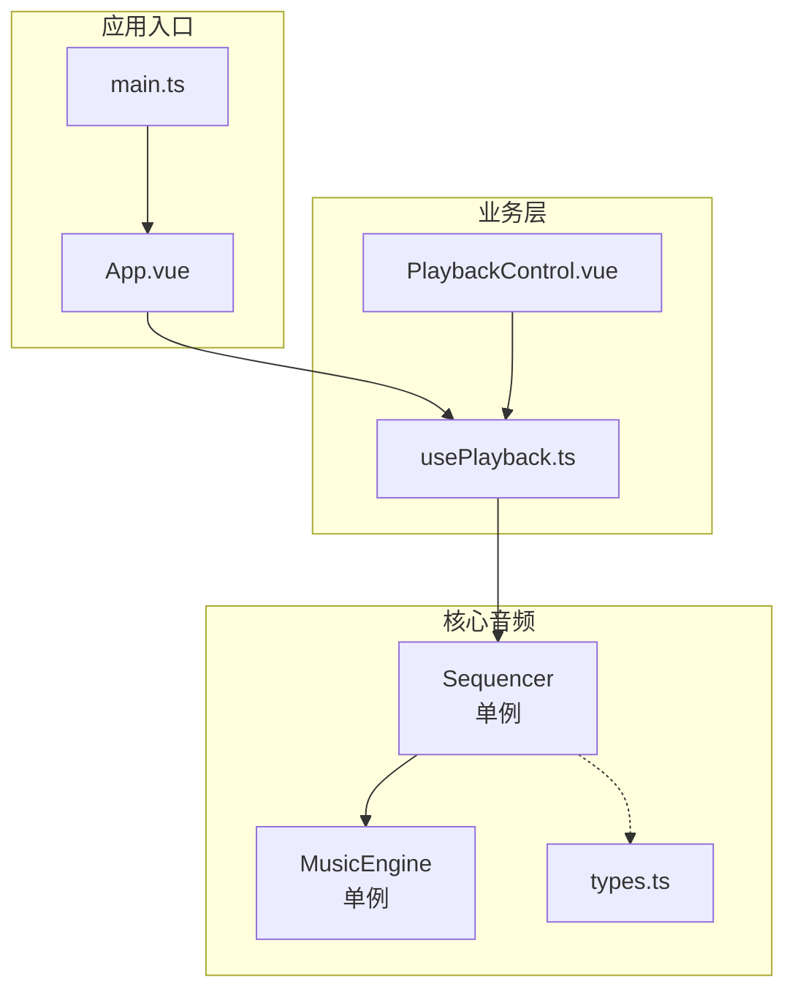
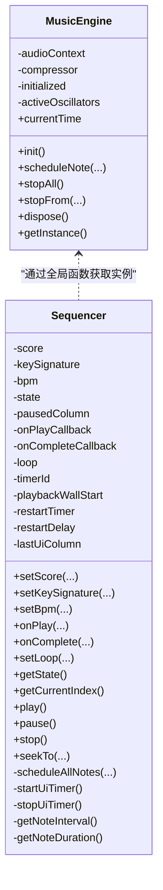
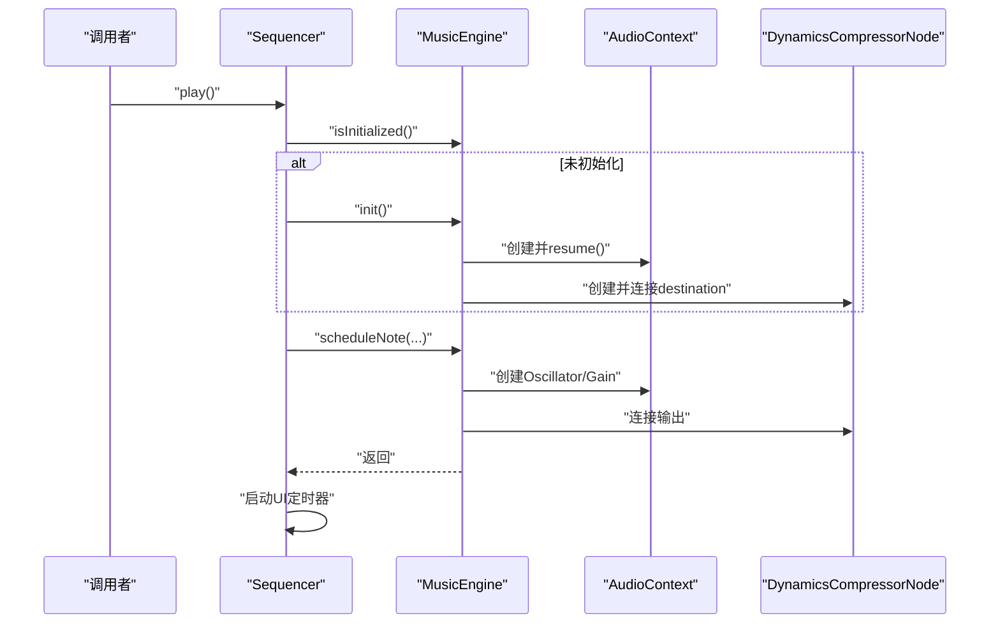
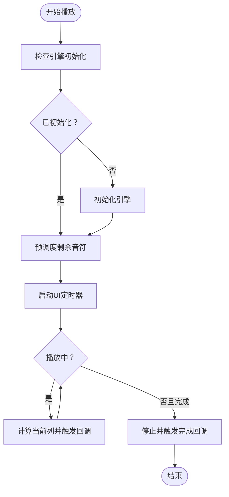
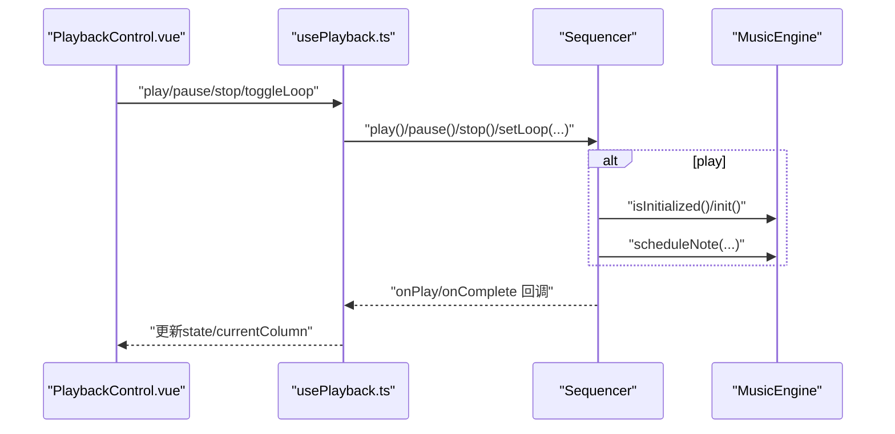
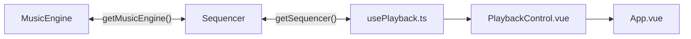

# 单例模式应用

<cite>
**本文引用的文件**
- [music-engine.ts](file://src/core/music-engine.ts)
- [sequencer.ts](file://src/core/sequencer.ts)
- [types.ts](file://src/core/types.ts)
- [usePlayback.ts](file://src/composables/usePlayback.ts)
- [PlaybackControl.vue](file://src/components/PlaybackControl.vue)
- [App.vue](file://src/App.vue)
- [main.ts](file://src/main.ts)
</cite>

## 目录
1. [简介](#简介)
2. [项目结构](#项目结构)
3. [核心组件](#核心组件)
4. [架构总览](#架构总览)
5. [详细组件分析](#详细组件分析)
6. [依赖关系分析](#依赖关系分析)
7. [性能考量](#性能考量)
8. [故障排查指南](#故障排查指南)
9. [结论](#结论)
10. [附录](#附录)

## 简介
本文件围绕 SUBOR Music Board 的单例模式应用展开，重点解释 MusicEngine 和 Sequencer 为何采用单例模式设计，以及该模式在音频处理中的必要性与优势。文档将系统阐述单例的实现方式（全局实例管理与生命周期控制）、如何避免音频冲突与确保资源唯一性，并给出优缺点分析、最佳实践与替代方案建议，帮助开发者在保持代码简洁与资源可控的同时，提升系统的稳定性与可维护性。

## 项目结构
本项目采用前端单页应用架构，核心音频能力集中在 src/core 目录下的音乐引擎与序列器模块；业务层通过 Vue 组合式 API 与组件进行集成。单例模式贯穿于音频子系统，确保全局唯一的音频上下文与调度器，避免多实例带来的资源竞争与状态混乱。

图表来源
- [main.ts:1-8](file://src/main.ts#L1-L8)
- [App.vue:1-138](file://src/App.vue#L1-L138)
- [usePlayback.ts:1-95](file://src/composables/usePlayback.ts#L1-L95)
- [sequencer.ts:1-354](file://src/core/sequencer.ts#L1-L354)
- [music-engine.ts:1-221](file://src/core/music-engine.ts#L1-L221)
- [types.ts:1-164](file://src/core/types.ts#L1-L164)

章节来源
- [main.ts:1-8](file://src/main.ts#L1-L8)
- [App.vue:1-138](file://src/App.vue#L1-L138)
- [usePlayback.ts:1-95](file://src/composables/usePlayback.ts#L1-L95)
- [sequencer.ts:1-354](file://src/core/sequencer.ts#L1-L354)
- [music-engine.ts:1-221](file://src/core/music-engine.ts#L1-L221)
- [types.ts:1-164](file://src/core/types.ts#L1-L164)

## 核心组件
- 音乐引擎（MusicEngine）：封装 Web Audio API，负责创建与管理 AudioContext、压缩器与振荡器，提供音符调度与停止控制。
- 序列器（Sequencer）：负责乐谱解析、节拍与列调度、播放状态管理、UI 定时器与循环播放控制，并通过单例模式与音乐引擎协作。

章节来源
- [music-engine.ts:17-220](file://src/core/music-engine.ts#L17-L220)
- [sequencer.ts:21-340](file://src/core/sequencer.ts#L21-L340)

## 架构总览
单例模式在本项目中的作用是：
- 保证音频资源的唯一性：全局仅存在一个 AudioContext 与一个主压缩器，避免重复初始化导致的资源泄漏或冲突。
- 统一调度与控制：所有音符播放、停止、变速、切换调号等操作都通过单例引擎执行，确保时序一致性与可预测性。
- 简化跨模块访问：通过全局获取函数（如 getMusicEngine、getSequencer）降低耦合，便于在任意模块中安全地调用。

图表来源
- [music-engine.ts:17-220](file://src/core/music-engine.ts#L17-L220)
- [sequencer.ts:21-340](file://src/core/sequencer.ts#L21-L340)

## 详细组件分析

### 音乐引擎（MusicEngine）单例实现
- 实现要点
  - 私有构造函数与静态 getInstance 方法，确保外部无法直接实例化。
  - 全局变量保存唯一实例，首次调用时创建并缓存。
  - 提供初始化、音符调度、停止控制与销毁接口，内部维护活跃振荡器集合以支持选择性停止。
- 生命周期控制
  - init：延迟初始化，等待用户交互后唤醒 AudioContext。
  - dispose：停止所有音符、断开压缩器、关闭 AudioContext，并清空全局实例，允许重新创建。
- 音频冲突避免
  - 全局唯一 AudioContext 与压缩器，避免多实例竞争硬件资源。
  - 通过活跃振荡器映射表与停止时间策略，避免未来音符与当前音符互相干扰。

图表来源
- [sequencer.ts:144-167](file://src/core/sequencer.ts#L144-L167)
- [music-engine.ts:41-60](file://src/core/music-engine.ts#L41-L60)
- [music-engine.ts:90-150](file://src/core/music-engine.ts#L90-L150)

章节来源
- [music-engine.ts:14-32](file://src/core/music-engine.ts#L14-L32)
- [music-engine.ts:41-60](file://src/core/music-engine.ts#L41-L60)
- [music-engine.ts:90-150](file://src/core/music-engine.ts#L90-L150)
- [music-engine.ts:155-197](file://src/core/music-engine.ts#L155-L197)
- [music-engine.ts:202-214](file://src/core/music-engine.ts#L202-L214)

### 序列器（Sequencer）单例实现
- 实现要点
  - 私有构造函数与全局获取函数 getSequencer，确保单例。
  - 内部维护播放状态、定时器、墙钟起点、上次调度信息等，用于精确控制播放进度与 UI 同步。
  - 提供 BPM 与调号变更时的「stopAll 丢弃 + 120ms 防抖 + 从当前指示器列整体重排」，避免卡顿与错拍。
- 生命周期控制
  - play/pause/stop：统一管理播放状态与定时器，暂停时记录当前位置，停止时清理定时器与音符。
  - scheduleAllNotes：一次性预调度所有剩余音符，匹配 jinglebell 的预调度模式。
- 音频冲突避免（2026-08-30 改）
  - 播放中 BPM/调号变更时，通过 `requestPlaybackRestart()` 立即 stopAll 丢弃所有声，120ms 防抖后从当前指示器列整体重排，避免多版本叠加混响与错拍。
  - 通过 restartTimer 防抖与 restartFromCurrentPosition 重置 playbackWallStart，确保变更后的精确重排与 UI 同步。

图表来源
- [sequencer.ts:144-167](file://src/core/sequencer.ts#L144-L167)
- [sequencer.ts:240-263](file://src/core/sequencer.ts#L240-L263)
- [sequencer.ts:271-313](file://src/core/sequencer.ts#L271-L313)

章节来源
- [sequencer.ts:342-353](file://src/core/sequencer.ts#L342-L353)
- [sequencer.ts:144-200](file://src/core/sequencer.ts#L144-L200)
- [sequencer.ts:240-263](file://src/core/sequencer.ts#L240-L263)
- [sequencer.ts:271-313](file://src/core/sequencer.ts#L271-L313)

### 业务层集成与调用链
- usePlayback.ts 通过 getSequencer 获取单例，绑定播放状态与 UI 回调，监听 BPM 与调号变化并调用 Sequencer 接口。
- PlaybackControl.vue 作为播放控制 UI，向 usePlayback 发出事件，最终由 Sequencer 驱动 MusicEngine 执行音频调度。

图表来源
- [PlaybackControl.vue:16-30](file://src/components/PlaybackControl.vue#L16-L30)
- [usePlayback.ts:46-93](file://src/composables/usePlayback.ts#L46-L93)
- [sequencer.ts:144-200](file://src/core/sequencer.ts#L144-L200)
- [music-engine.ts:41-60](file://src/core/music-engine.ts#L41-L60)

章节来源
- [usePlayback.ts:14-94](file://src/composables/usePlayback.ts#L14-L94)
- [PlaybackControl.vue:1-111](file://src/components/PlaybackControl.vue#L1-L111)
- [App.vue:30-42](file://src/App.vue#L30-L42)

## 依赖关系分析
- 组件耦合
  - Sequencer 依赖 MusicEngine（通过全局获取函数），实现音频调度与停止控制。
  - usePlayback 依赖 Sequencer，提供播放状态与 UI 回调绑定。
- 外部依赖
  - Web Audio API（AudioContext、DynamicsCompressorNode、OscillatorNode、GainNode）。
  - Vue 组合式 API（ref、watch）用于响应式状态管理。
- 潜在循环依赖
  - 通过全局获取函数避免直接 import 导致的循环依赖风险。

图表来源
- [music-engine.ts:217-220](file://src/core/music-engine.ts#L217-L220)
- [sequencer.ts:348-353](file://src/core/sequencer.ts#L348-L353)
- [usePlayback.ts:21](file://src/composables/usePlayback.ts#L21)
- [PlaybackControl.vue:1-111](file://src/components/PlaybackControl.vue#L1-L111)
- [App.vue:1-138](file://src/App.vue#L1-L138)

章节来源
- [music-engine.ts:217-220](file://src/core/music-engine.ts#L217-L220)
- [sequencer.ts:348-353](file://src/core/sequencer.ts#L348-L353)
- [usePlayback.ts:14-94](file://src/composables/usePlayback.ts#L14-L94)
- [PlaybackControl.vue:1-111](file://src/components/PlaybackControl.vue#L1-L111)
- [App.vue:1-138](file://src/App.vue#L1-L138)

## 性能考量
- 预调度模式
  - 一次性计算所有音符的绝对时间并创建振荡器，减少 UI 线程压力，提高播放精度。
- 实时变速/变调的丢弃重排
  - BPM/调号变更时 stopAll 立即丢弃所有声，120ms 防抖后从当前指示器列整体重排，杜绝叠加混响并保持音画同步。
- 资源复用
  - 单例引擎复用 AudioContext 与压缩器，避免重复创建带来的 CPU 与内存开销。
- UI 定时器
  - 以固定间隔轮询播放进度，仅在列号变化时触发回调，降低 UI 更新频率。

章节来源
- [sequencer.ts:144-167](file://src/core/sequencer.ts#L144-L167)
- [sequencer.ts:84-115](file://src/core/sequencer.ts#L84-L115)
- [music-engine.ts:90-150](file://src/core/music-engine.ts#L90-L150)

## 故障排查指南
- 音频未播放
  - 检查引擎是否已初始化（用户交互后才可 resume AudioContext）。
  - 确认乐谱有效长度大于 0，否则会立即停止并触发完成回调。
- 播放卡顿或错拍
  - BPM/调号变更时应走「stopAll 丢弃 + 120ms 防抖 + 从当前指示器列重排」，避免多版本叠加混响。
- 资源泄漏
  - 在应用退出或页面卸载时调用引擎 dispose，释放压缩器与 AudioContext。
- UI 不同步
  - 确认 UI 定时器正常运行，且仅在列号变化时触发回调。

章节来源
- [music-engine.ts:41-60](file://src/core/music-engine.ts#L41-L60)
- [sequencer.ts:276-304](file://src/core/sequencer.ts#L276-L304)
- [sequencer.ts:84-115](file://src/core/sequencer.ts#L84-L115)
- [music-engine.ts:202-214](file://src/core/music-engine.ts#L202-L214)
- [sequencer.ts:271-313](file://src/core/sequencer.ts#L271-L313)

## 结论
MusicEngine 与 Sequencer 采用单例模式，是本项目在音频处理领域的关键设计决策。它确保了音频资源的唯一性与调度的一致性，避免了多实例引发的冲突与资源浪费；同时通过预调度与「stopAll 丢弃 + 防抖重排」策略，兼顾了播放精度与用户体验。尽管单例模式在测试与全局状态管理方面带来一定挑战，但通过清晰的生命周期控制与合理的接口设计，项目在功能完整性与可维护性之间取得了良好平衡。

## 附录

### 单例模式的优缺点分析
- 优点
  - 内存效率：避免重复创建 AudioContext 与压缩器，降低内存占用。
  - 资源唯一性：确保音频设备与上下文的独占访问，避免冲突。
  - 控制集中：统一的调度与停止接口，便于维护与扩展。
- 缺点
  - 测试困难：全局状态难以隔离，单元测试需额外清理步骤。
  - 全局状态管理：可能引入隐式依赖，增加调试复杂度。

### 最佳实践
- 明确生命周期：在应用退出或页面卸载时调用 dispose，确保资源回收。
- 实时变速/变调的丢弃重排：在动态调整 BPM/调号时，走 stopAll 丢弃所有声 + 120ms 防抖 + 从当前指示器列整体重排，避免卡顿与混响。
- 接口清晰：通过全局获取函数暴露单例，避免直接 import 导致的循环依赖。

### 替代方案讨论
- 工厂模式：按需创建引擎实例，但需显式传递实例，增加调用复杂度。
- 依赖注入：通过容器注入引擎实例，提升可测试性，但引入额外抽象成本。
- 多实例隔离：允许多个引擎实例，但需解决资源竞争与 UI 同步问题，适合复杂场景但不适用于本项目。