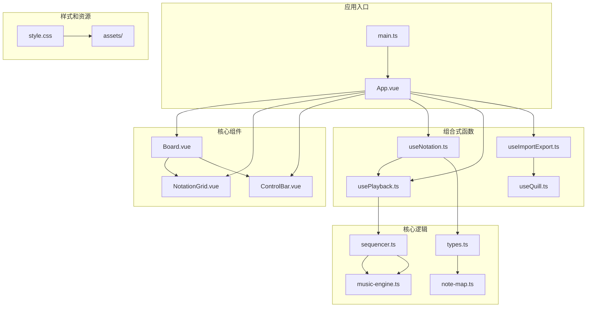
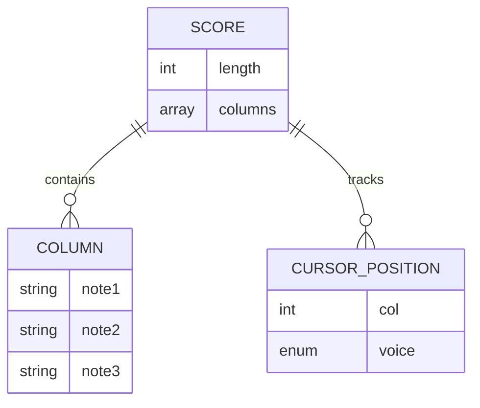
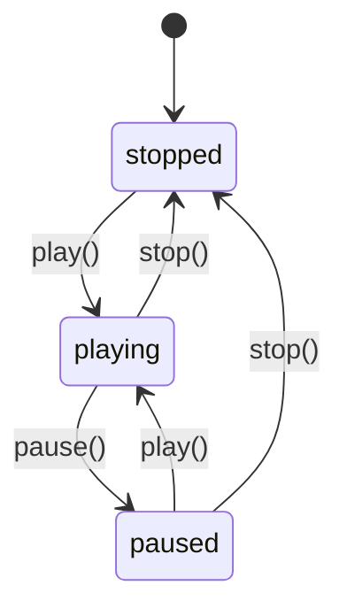
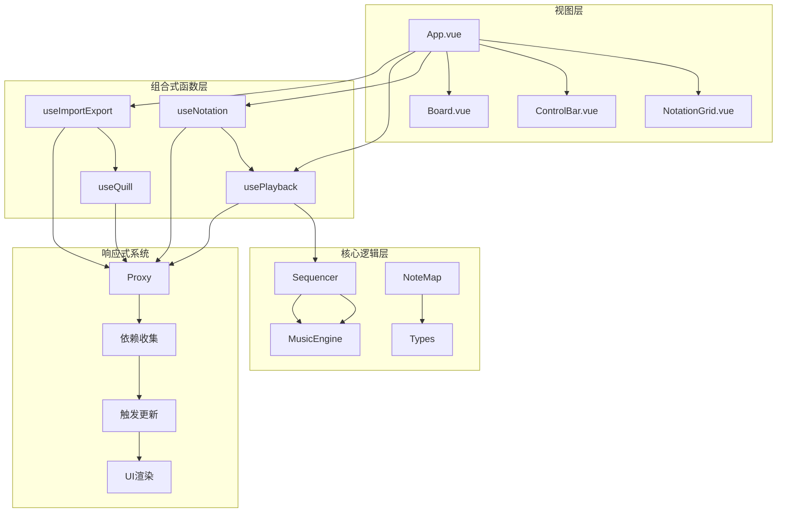
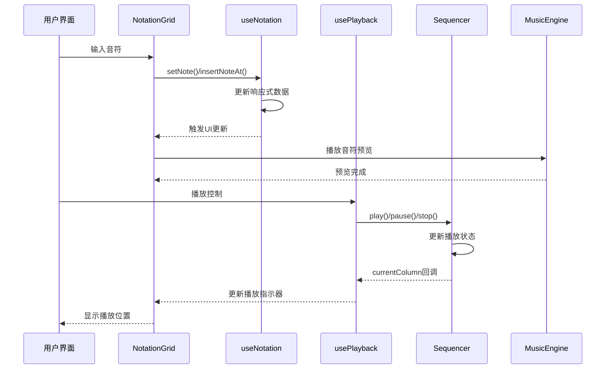
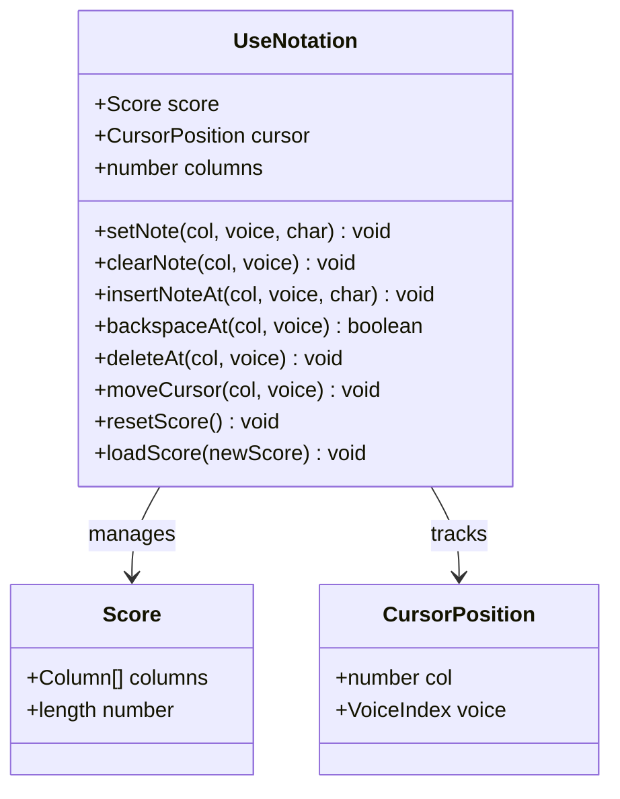
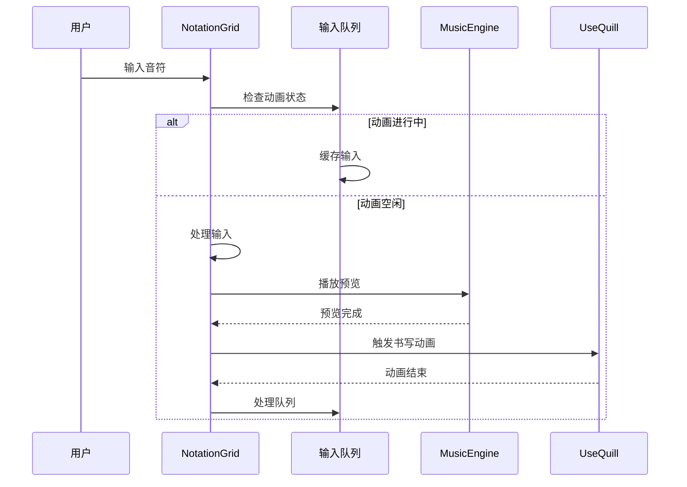
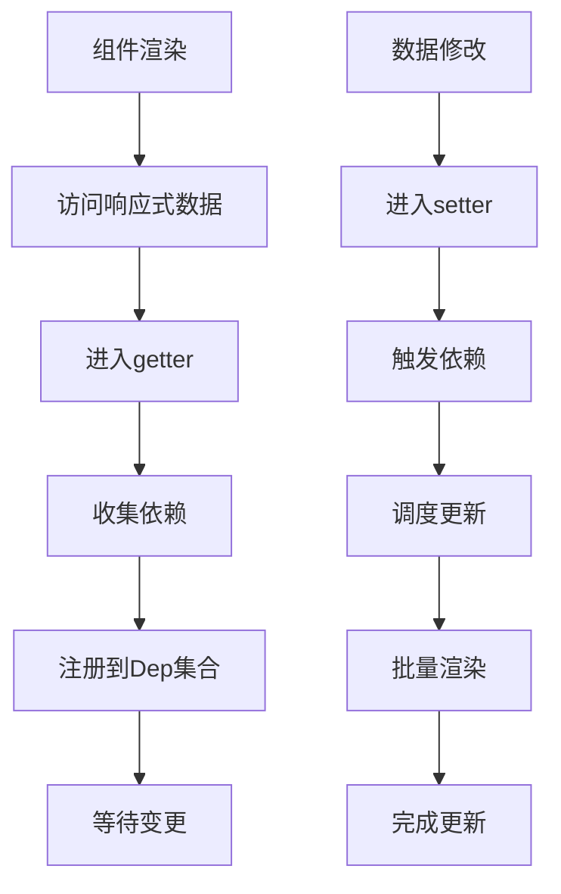
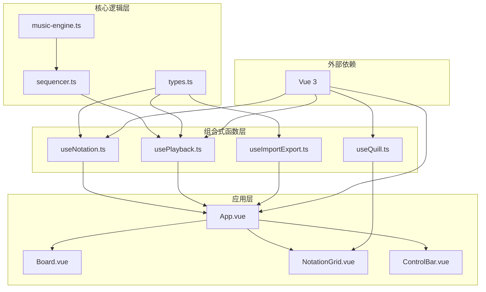
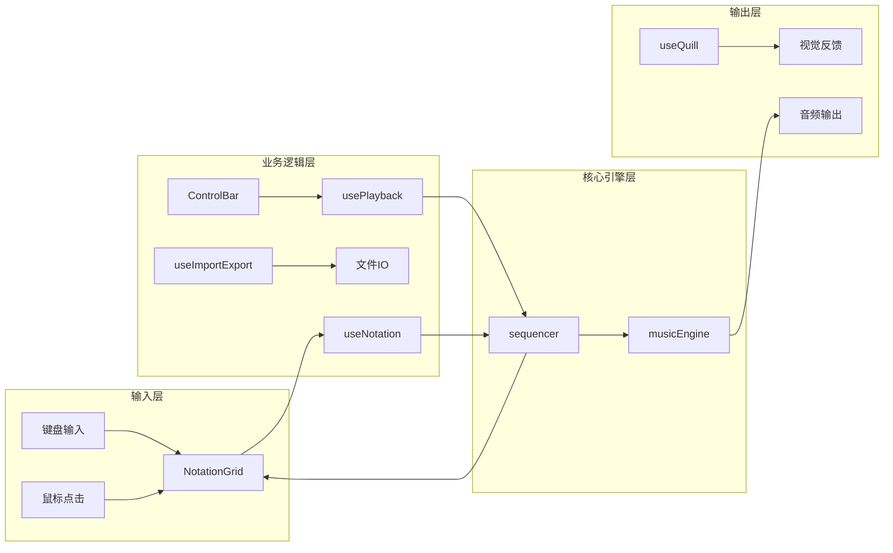

# 响应式系统

<cite>
**本文引用的文件**
- [main.ts](file://src/main.ts)
- [App.vue](file://src/App.vue)
- [useNotation.ts](file://src/composables/useNotation.ts)
- [usePlayback.ts](file://src/composables/usePlayback.ts)
- [useImportExport.ts](file://src/composables/useImportExport.ts)
- [useQuill.ts](file://src/composables/useQuill.ts)
- [NotationGrid.vue](file://src/components/NotationGrid.vue)
- [ControlBar.vue](file://src/components/ControlBar.vue)
- [Board.vue](file://src/components/Board.vue)
- [sequencer.ts](file://src/core/sequencer.ts)
- [music-engine.ts](file://src/core/music-engine.ts)
- [types.ts](file://src/core/types.ts)
- [package.json](file://package.json)
</cite>

## 目录
1. [简介](#简介)
2. [项目结构](#项目结构)
3. [核心组件](#核心组件)
4. [架构概览](#架构概览)
5. [详细组件分析](#详细组件分析)
6. [依赖关系分析](#依赖关系分析)
7. [性能考虑](#性能考虑)
8. [故障排除指南](#故障排除指南)
9. [结论](#结论)

## 简介

SUBOR Music Board是一个基于Vue 3构建的响应式音乐记谱应用。该项目展示了现代前端框架中响应式系统的强大能力，通过Proxy代理、依赖收集和触发更新等机制实现了数据驱动的UI更新。项目涵盖了完整的音乐创作工作流，包括乐谱编辑、播放控制、导入导出等功能。

本文档将深入分析Vue 3响应式系统在该项目中的具体实现，包括：
- Proxy代理机制和依赖收集
- 数据驱动的UI更新流程
- 组合式函数中的响应式数据管理
- 性能优化策略
- 最佳实践和常见陷阱

## 项目结构

项目采用模块化的组织方式，主要分为以下几个层次：



**图表来源**
- [main.ts:1-8](file://src/main.ts#L1-L8)
- [App.vue:1-138](file://src/App.vue#L1-L138)
- [Board.vue:1-47](file://src/components/Board.vue#L1-L47)

**章节来源**
- [main.ts:1-8](file://src/main.ts#L1-L8)
- [App.vue:1-138](file://src/App.vue#L1-L138)
- [package.json:1-25](file://package.json#L1-L25)

## 核心组件

### 响应式数据模型

项目中的响应式系统主要围绕以下核心数据结构：

#### 乐谱数据结构


**图表来源**
- [types.ts:56-66](file://src/core/types.ts#L56-L66)
- [useNotation.ts:15-17](file://src/composables/useNotation.ts#L15-L17)

#### 播放状态管理


**图表来源**
- [types.ts:71-72](file://src/core/types.ts#L71-L72)
- [usePlayback.ts:17-19](file://src/composables/usePlayback.ts#L17-L19)

**章节来源**
- [types.ts:1-164](file://src/core/types.ts#L1-L164)
- [useNotation.ts:1-116](file://src/composables/useNotation.ts#L1-L116)
- [usePlayback.ts:1-95](file://src/composables/usePlayback.ts#L1-L95)

## 架构概览

### 响应式系统架构



**图表来源**
- [App.vue:1-138](file://src/App.vue#L1-L138)
- [useNotation.ts:1-116](file://src/composables/useNotation.ts#L1-L116)
- [usePlayback.ts:1-95](file://src/composables/usePlayback.ts#L1-L95)
- [sequencer.ts:21-354](file://src/core/sequencer.ts#L21-L354)

### 数据流架构



**图表来源**
- [NotationGrid.vue:101-140](file://src/components/NotationGrid.vue#L101-L140)
- [useNotation.ts:20-42](file://src/composables/useNotation.ts#L20-L42)
- [usePlayback.ts:46-66](file://src/composables/usePlayback.ts#L46-L66)
- [sequencer.ts:144-200](file://src/core/sequencer.ts#L144-L200)

**章节来源**
- [App.vue:1-138](file://src/App.vue#L1-L138)
- [NotationGrid.vue:1-292](file://src/components/NotationGrid.vue#L1-L292)
- [useQuill.ts:1-39](file://src/composables/useQuill.ts#L1-L39)

## 详细组件分析

### useNotation组合式函数

useNotation是项目的核心响应式数据管理模块，负责乐谱数据和光标的响应式管理。

#### 数据结构设计



**图表来源**
- [useNotation.ts:15-116](file://src/composables/useNotation.ts#L15-L116)
- [types.ts:56-66](file://src/core/types.ts#L56-L66)

#### 响应式数据初始化

项目使用`reactive`和`readonly`来管理不同类型的响应式数据：

- **可变数据**：使用`reactive`包装乐谱数据和光标位置
- **只读数据**：使用`readonly`暴露给子组件，防止意外修改

#### 核心操作方法

每个数据操作都通过响应式代理自动触发UI更新：

1. **设置音符**：`setNote()` - 直接替换指定位置的音符
2. **插入音符**：`insertNoteAt()` - 在指定位置插入音符，后续音符右移
3. **删除音符**：`backspaceAt()` - 删除指定位置前一个音符，后续音符左移填补
4. **移动光标**：`moveCursor()` - 更新光标位置，影响输入焦点和视觉指示

**章节来源**
- [useNotation.ts:1-116](file://src/composables/useNotation.ts#L1-L116)
- [types.ts:56-100](file://src/core/types.ts#L56-L100)

### usePlayback组合式函数

usePlayback负责音乐播放控制，展示了响应式系统在异步操作中的应用。

#### 播放状态管理

```mermaid
flowchart TD
A[播放请求] --> B{当前状态}
B --> |stopped| C[初始化序列器]
B --> |playing| D[pause() -> paused]
B --> |paused| E[resume() -> playing]
C --> F[开始播放]
D --> G[停止音频]
E --> H[继续播放]
F --> I[更新状态: playing]
G --> J[更新状态: stopped]
H --> I
I --> K[监听BPM变化]
I --> L[监听调号变化]
I --> M[启动UI定时器]
```

**图表来源**
- [usePlayback.ts:46-77](file://src/composables/usePlayback.ts#L46-L77)
- [sequencer.ts:144-167](file://src/core/sequencer.ts#L144-L167)

#### 实时配置更新

项目巧妙地使用`watch`监听配置变化：

- **BPM监听**：`watch(bpm, ...)` - 实时调整播放速度
- **调号监听**：`watch(keySignature, ...)` - 实时切换调号
- **立即执行**：`{ immediate: true }` - 确保初始配置正确应用

**章节来源**
- [usePlayback.ts:1-95](file://src/composables/usePlayback.ts#L1-L95)
- [sequencer.ts:84-115](file://src/core/sequencer.ts#L84-L115)

### NotationGrid组件

NotationGrid是响应式系统的核心展示组件，负责将响应式数据转换为可视化的音乐网格。

#### 输入处理机制



**图表来源**
- [NotationGrid.vue:113-148](file://src/components/NotationGrid.vue#L113-L148)
- [useQuill.ts:17-29](file://src/composables/useQuill.ts#L17-L29)

#### 光标同步机制

组件通过事件系统保持光标状态的一致性：

1. **输入焦点同步**：`onCellFocus()` - 将键盘焦点与光标位置同步
2. **键盘导航**：`onKeydown()` - 支持方向键导航，避免重复事件干扰
3. **写入行为分派**：`onKeydown()` - 按输入字符类型分派覆盖/插入行为

**章节来源**
- [NotationGrid.vue:1-292](file://src/components/NotationGrid.vue#L1-L292)
- [useQuill.ts:1-39](file://src/composables/useQuill.ts#L1-L39)

### 响应式系统实现原理

#### Proxy代理机制

Vue 3使用ES6 Proxy实现响应式系统，其核心原理包括：

1. **数据拦截**：通过Proxy拦截对象属性的访问和修改
2. **依赖收集**：在getter中收集依赖，在setter中触发更新
3. **批量更新**：使用微任务队列批量处理更新，避免重复渲染

#### 依赖收集过程



**图表来源**
- [useNotation.ts:16-17](file://src/composables/useNotation.ts#L16-L17)
- [usePlayback.ts:17-19](file://src/composables/usePlayback.ts#L17-L19)

#### 触发更新流程

1. **数据变更**：通过组合式函数修改响应式数据
2. **依赖通知**：触发注册的依赖收集器
3. **组件更新**：Vue自动重新渲染受影响的组件
4. **UI同步**：DOM更新反映最新的数据状态

**章节来源**
- [useNotation.ts:1-116](file://src/composables/useNotation.ts#L1-L116)
- [usePlayback.ts:1-95](file://src/composables/usePlayback.ts#L1-L95)

## 依赖关系分析

### 组件依赖图



**图表来源**
- [App.vue:1-138](file://src/App.vue#L1-L138)
- [useNotation.ts:1-116](file://src/composables/useNotation.ts#L1-L116)
- [usePlayback.ts:1-95](file://src/composables/usePlayback.ts#L1-L95)
- [sequencer.ts:1-354](file://src/core/sequencer.ts#L1-L354)

### 数据流向



**图表来源**
- [NotationGrid.vue:186-244](file://src/components/NotationGrid.vue#L186-L244)
- [ControlBar.vue:16-24](file://src/components/ControlBar.vue#L16-L24)
- [useImportExport.ts:52-79](file://src/composables/useImportExport.ts#L52-L79)

**章节来源**
- [App.vue:1-138](file://src/App.vue#L1-L138)
- [useImportExport.ts:1-138](file://src/composables/useImportExport.ts#L1-L138)

## 性能考虑

### 响应式系统优化策略

#### 1. 合理使用响应式数据

**最佳实践**：
- 对于大型数组，优先使用`reactive`而非`ref`
- 对只读数据使用`readonly`保护
- 避免在响应式对象中存储复杂函数

**项目中的应用**：
```typescript
// ✅ 推荐：使用reactive管理大型乐谱数据
const score: Score = reactive(createEmptyScore(columns))

// ✅ 推荐：使用readonly保护只读数据
return {
  score: readonly(score),
  cursor: readonly(cursor),
  // ...
}
```

#### 2. 监听器的合理使用

**优化策略**：
- 使用`immediate: true`确保初始配置正确应用
- 避免在监听器中进行昂贵的操作
- 使用防抖/节流处理高频事件

**项目中的应用**：
```typescript
// ✅ 推荐：监听BPM变化并立即执行
watch(bpm, (newBpm) => {
  sequencer.setBpm(newBpm)
}, { immediate: true })
```

#### 3. 组件更新优化

**优化策略**：
- 使用`v-memo`缓存昂贵的计算结果
- 合理拆分组件，避免不必要的重渲染
- 使用`computed`替代重复计算

**项目中的应用**：
- 通过精确的数据边界减少组件重渲染
- 使用事件系统避免跨组件的直接数据耦合

#### 4. 异步操作处理

**优化策略**：
- 使用`nextTick`确保DOM更新后再进行操作
- 合理使用微任务队列处理批量更新
- 避免在响应式系统中进行阻塞操作

**项目中的应用**：
```typescript
// ✅ 推荐：使用nextTick确保动画完成后处理队列
nextTick(() => processQueue())
```

### 性能监控和调试

#### Vue DevTools使用

项目可以利用Vue DevTools监控响应式数据的变化：

1. **组件树查看**：了解组件层级和响应式数据分布
2. **响应式数据面板**：监控数据变化历史
3. **事件面板**：跟踪事件触发和组件更新

#### 性能瓶颈识别

常见的性能问题及解决方案：

1. **过度渲染**：检查是否有不必要的响应式数据变更
2. **内存泄漏**：确保监听器在组件卸载时正确清理
3. **计算密集**：使用`computed`缓存计算结果

## 故障排除指南

### 常见问题和解决方案

#### 1. 数据不更新问题

**症状**：修改响应式数据后UI没有更新

**可能原因**：
- 修改了响应式对象的属性但没有触发更新
- 使用了不正确的响应式API
- 组件被意外卸载或销毁

**解决方案**：
```typescript
// ✅ 确保正确使用响应式API
const state = ref(0)
state.value = 1  // ✅ 正确

// ❌ 错误：直接修改
state = 1  // ❌ 不会触发更新
```

#### 2. 内存泄漏问题

**症状**：长时间运行后内存占用持续增长

**可能原因**：
- 监听器未正确清理
- 事件监听器未移除
- 大量闭包持有引用

**解决方案**：
```typescript
// ✅ 在组件卸载时清理监听器
onUnmounted(() => {
  if (timerId) {
    clearInterval(timerId)
  }
})
```

#### 3. 性能问题

**症状**：大量数据操作时出现卡顿

**可能原因**：
- 单次操作修改了过多响应式数据
- 频繁触发组件重渲染
- 监听器中进行了昂贵的操作

**解决方案**：
```typescript
// ✅ 批量更新数据
const updates = []
// 收集所有更新
for (let i = 0; i < largeArray.length; i++) {
  updates.push(updateData(largeArray[i]))
}
// 批量应用更新
updates.forEach(update => update())
```

#### 4. 数据一致性问题

**症状**：不同组件显示的数据不一致

**可能原因**：
- 多个组件直接修改同一份数据
- 缺少适当的同步机制
- 数据边界设计不合理

**解决方案**：
```typescript
// ✅ 使用组合式函数统一管理数据
export function useSharedData() {
  const data = ref(initialData)
  
  return {
    data,
    updateData: (newData) => {
      data.value = newData
    }
  }
}
```

### 调试技巧

#### 1. 响应式数据调试

使用Vue DevTools的响应式数据面板监控数据变化：
- 查看数据的变更历史
- 分析依赖关系
- 跟踪响应式代理的状态

#### 2. 组件更新调试

通过Vue DevTools的组件面板：
- 查看组件的渲染次数
- 分析组件的props和state
- 跟踪组件的生命周期

#### 3. 性能分析

使用浏览器开发者工具：
- Performance面板分析渲染性能
- Memory面板检测内存泄漏
- Network面板监控资源加载

**章节来源**
- [useNotation.ts:1-116](file://src/composables/useNotation.ts#L1-L116)
- [usePlayback.ts:1-95](file://src/composables/usePlayback.ts#L1-L95)
- [NotationGrid.vue:1-292](file://src/components/NotationGrid.vue#L1-L292)

## 结论

SUBOR Music Board项目展示了Vue 3响应式系统在实际应用中的强大能力和优雅设计。通过合理的数据结构设计、精确的依赖管理和高效的更新机制，项目实现了流畅的音乐创作体验。

### 主要成就

1. **响应式数据管理**：通过`reactive`和`ref`实现了复杂数据结构的响应式管理
2. **组件解耦**：使用组合式函数实现了逻辑复用和组件解耦
3. **性能优化**：通过精确的依赖收集和批量更新避免了性能问题
4. **用户体验**：实现了流畅的输入体验和实时的播放反馈

### 技术亮点

- **Proxy代理机制**：提供了更强大的数据拦截能力
- **组合式函数**：实现了逻辑复用和更好的类型推断
- **异步响应式**：支持异步操作的响应式处理
- **性能优化**：通过微任务队列和批量更新提升性能

### 最佳实践总结

1. **合理选择响应式API**：根据数据特点选择合适的响应式API
2. **精确的依赖管理**：避免过度依赖和不必要的更新
3. **性能优先的设计**：在设计阶段就考虑性能因素
4. **完善的错误处理**：建立健壮的错误处理和恢复机制

这个项目为Vue 3响应式系统的实际应用提供了优秀的参考案例，展示了如何在复杂的音乐应用中有效地使用响应式编程范式。