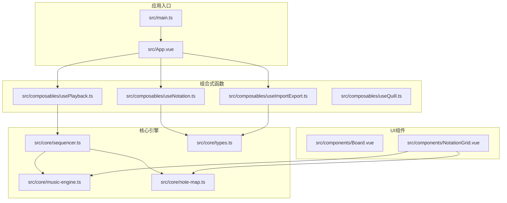
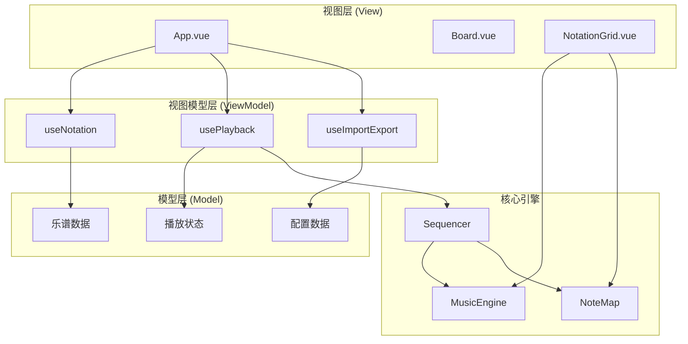
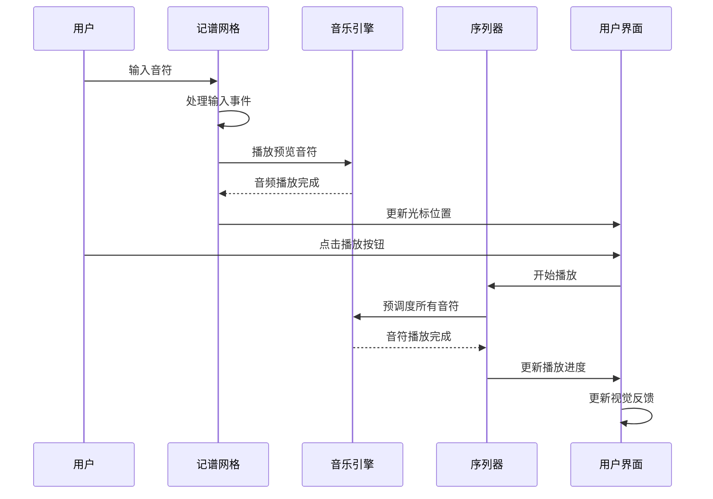
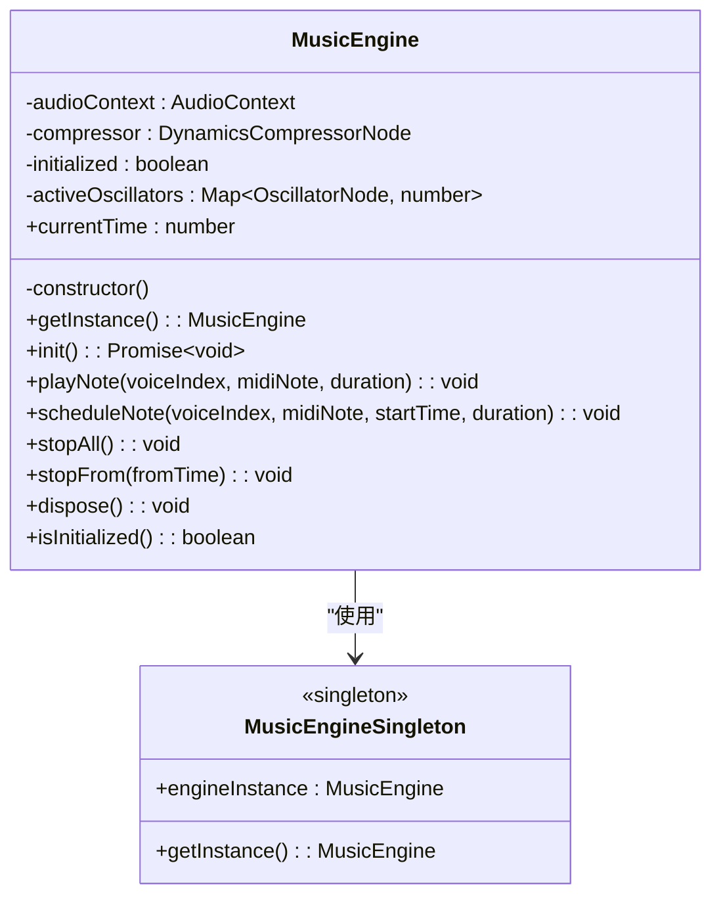
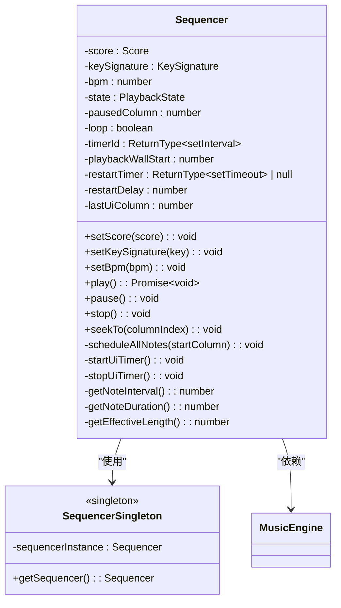
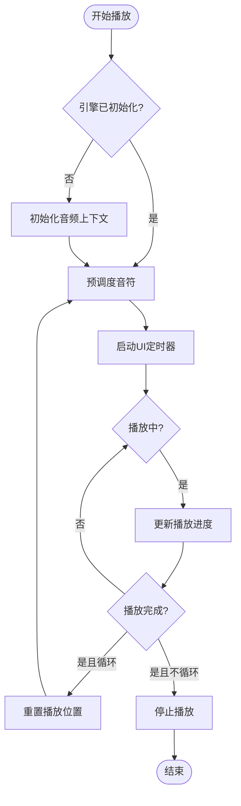
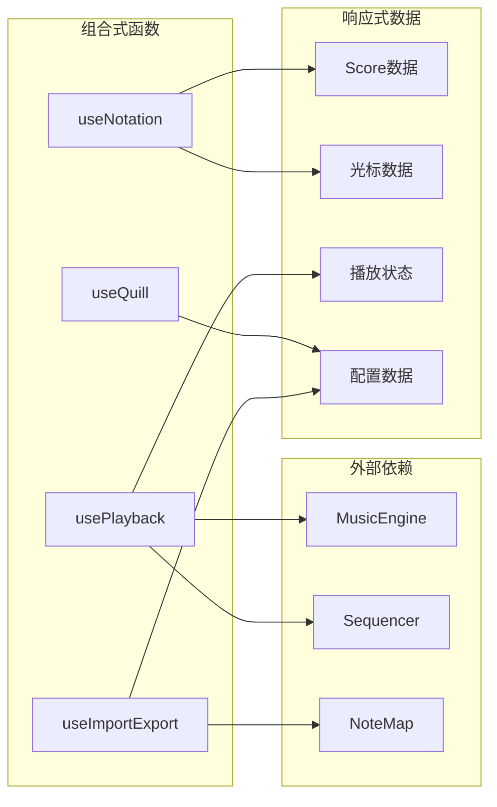
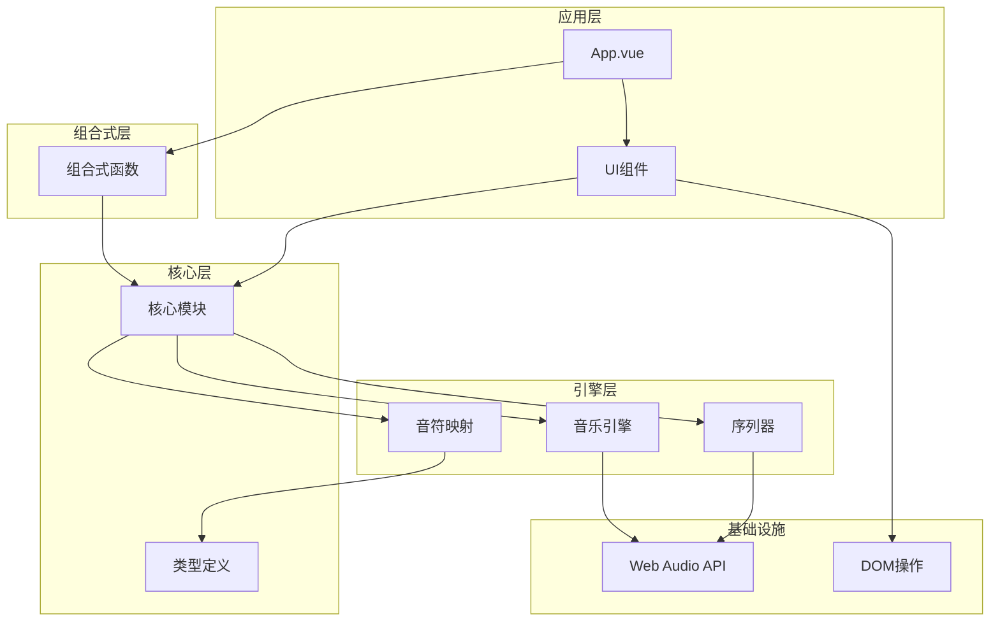

# 核心架构设计

<cite>
**本文档引用的文件**
- [main.ts](file://src/main.ts)
- [App.vue](file://src/App.vue)
- [music-engine.ts](file://src/core/music-engine.ts)
- [sequencer.ts](file://src/core/sequencer.ts)
- [types.ts](file://src/core/types.ts)
- [note-map.ts](file://src/core/note-map.ts)
- [usePlayback.ts](file://src/composables/usePlayback.ts)
- [useNotation.ts](file://src/composables/useNotation.ts)
- [useImportExport.ts](file://src/composables/useImportExport.ts)
- [useQuill.ts](file://src/composables/useQuill.ts)
- [Board.vue](file://src/components/Board.vue)
- [NotationGrid.vue](file://src/components/NotationGrid.vue)
- [package.json](file://package.json)
</cite>

## 目录
1. [简介](#简介)
2. [项目结构](#项目结构)
3. [核心组件](#核心组件)
4. [架构概览](#架构概览)
5. [详细组件分析](#详细组件分析)
6. [依赖关系分析](#依赖关系分析)
7. [性能考量](#性能考量)
8. [故障排除指南](#故障排除指南)
9. [结论](#结论)

## 简介

SUBOR Music Board 是一个基于 Vue 3 和 TypeScript 构建的音乐创作工具，采用 MVVM 设计模式和组合式架构。该项目的核心特色在于完全基于 Web Audio API 实现的音乐引擎，实现了真正的实时音频合成，而非简单的音频文件播放。系统通过单例模式管理核心引擎，采用响应式数据驱动的组件通信机制，提供了流畅的音乐创作体验。

## 项目结构

项目采用模块化设计，按照功能层次组织代码结构：

**图表来源**
- [main.ts:1-8](file://src/main.ts#L1-L8)
- [App.vue:1-138](file://src/App.vue#L1-L138)
- [music-engine.ts:1-221](file://src/core/music-engine.ts#L1-L221)
- [sequencer.ts:1-354](file://src/core/sequencer.ts#L1-L354)

**章节来源**
- [main.ts:1-8](file://src/main.ts#L1-L8)
- [package.json:1-25](file://package.json#L1-L25)

## 核心组件

### 音乐引擎 (MusicEngine)

MusicEngine 是系统的核心音频处理组件，采用单例模式确保全局唯一性。该引擎完全基于 Web Audio API 实现，为每个音符创建独立的振荡器节点和增益节点，实现了精确的音频合成控制。

**主要特性：**
- 单例模式管理全局音频上下文
- 支持三种不同波形的声部：方波主旋律、方波和弦律、三角波低频
- 精确的音频时间调度，匹配经典 Jingle Bell 模式
- 实时音频压缩处理，确保音质一致性

### 序列器 (Sequencer)

Sequencer 负责音乐播放的协调和调度，采用预调度模式优化性能。它监听乐谱数据变化，计算所有音符的精确播放时间，并通过独立的 UI 定时器更新播放状态。

**核心功能：**
- 预调度所有音符，一次性创建音频节点
- 支持实时 BPM 和调号变更
- 循环播放控制
- 播放状态管理

### 组合式函数 (Composables)

项目大量使用 Vue 3 的组合式 API，将业务逻辑封装为可复用的组合式函数：

- **usePlayback**: 播放状态管理和控制
- **useNotation**: 乐谱数据管理和编辑
- **useImportExport**: 数据导入导出功能
- **useQuill**: 羽毛笔动画效果管理

**章节来源**
- [music-engine.ts:17-221](file://src/core/music-engine.ts#L17-L221)
- [sequencer.ts:21-354](file://src/core/sequencer.ts#L21-L354)
- [usePlayback.ts:14-95](file://src/composables/usePlayback.ts#L14-L95)

## 架构概览

系统采用 MVVM 设计模式，通过响应式数据驱动组件通信：

**图表来源**
- [App.vue:13-100](file://src/App.vue#L13-L100)
- [usePlayback.ts:14-95](file://src/composables/usePlayback.ts#L14-L95)
- [useNotation.ts:15-116](file://src/composables/useNotation.ts#L15-L116)

### 数据流分析

系统的数据流遵循单向数据流原则：

**图表来源**
- [NotationGrid.vue:101-140](file://src/components/NotationGrid.vue#L101-L140)
- [music-engine.ts:69-150](file://src/core/music-engine.ts#L69-L150)
- [sequencer.ts:144-167](file://src/core/sequencer.ts#L144-L167)

## 详细组件分析

### MusicEngine 类设计

**图表来源**
- [music-engine.ts:17-221](file://src/core/music-engine.ts#L17-L221)

**实现特点：**
- 严格的单例模式实现，确保全局唯一音频上下文
- 精确的音频时间控制，支持毫秒级精度
- 三种不同波形的声部配置，模拟经典电子音乐效果
- 实时音频压缩处理，保证音质稳定性

### Sequencer 类设计

**图表来源**
- [sequencer.ts:21-354](file://src/core/sequencer.ts#L21-L354)

**核心算法流程：**

**图表来源**
- [sequencer.ts:144-313](file://src/core/sequencer.ts#L144-L313)

### 组合式函数设计模式

项目采用组合式函数模式，将业务逻辑与组件解耦：

**图表来源**
- [useNotation.ts:15-116](file://src/composables/useNotation.ts#L15-L116)
- [usePlayback.ts:14-95](file://src/composables/usePlayback.ts#L14-L95)
- [useImportExport.ts:18-138](file://src/composables/useImportExport.ts#L18-L138)

**章节来源**
- [music-engine.ts:17-221](file://src/core/music-engine.ts#L17-L221)
- [sequencer.ts:21-354](file://src/core/sequencer.ts#L21-L354)
- [useNotation.ts:15-116](file://src/composables/useNotation.ts#L15-L116)
- [usePlayback.ts:14-95](file://src/composables/usePlayback.ts#L14-L95)
- [useImportExport.ts:18-138](file://src/composables/useImportExport.ts#L18-L138)

## 依赖关系分析

系统采用清晰的依赖层次结构：

**图表来源**
- [App.vue:1-138](file://src/App.vue#L1-L138)
- [music-engine.ts:1-221](file://src/core/music-engine.ts#L1-L221)
- [sequencer.ts:1-354](file://src/core/sequencer.ts#L1-L354)

**依赖特征：**
- **低耦合高内聚**：各模块职责明确，接口清晰
- **单向依赖**：数据流向单一，便于调试和维护
- **可测试性**：组合式函数易于单元测试
- **可扩展性**：模块化设计支持功能扩展

**章节来源**
- [types.ts:1-164](file://src/core/types.ts#L1-L164)
- [note-map.ts:1-119](file://src/core/note-map.ts#L1-L119)

## 性能考量

### 音频性能优化

系统在音频处理方面采用了多项优化策略：

1. **预调度模式**：在播放开始时一次性创建所有音频节点，避免运行时延迟
2. **精确时间控制**：使用 AudioContext 的绝对时间戳，确保音符同步精度
3. **内存管理**：及时清理停止的音频节点，防止内存泄漏
4. **批量处理**：将多个音符的处理合并为批量操作

### 响应式性能优化

1. **懒加载**：音频上下文仅在需要时初始化
2. **防抖处理**：输入事件经过队列处理，避免重复渲染
3. **最小化更新**：只更新必要的响应式数据
4. **异步处理**：耗时操作使用异步处理，保持界面流畅

### 技术决策权衡

**选择 Web Audio API 的原因：**
- **实时性**：相比音频文件，Web Audio API 提供毫秒级响应
- **可控性**：完全控制音频生成过程，可实现复杂的音效
- **跨平台**：统一的 API 接口，无需考虑平台差异
- **开源**：避免版权和许可问题

**纯前端实现的优势：**
- **离线可用**：无需网络连接即可使用
- **隐私保护**：用户数据完全在本地处理
- **部署简单**：静态文件部署，无需服务器配置
- **成本效益**：无需支付音频服务费用

## 故障排除指南

### 常见问题及解决方案

**音频无法播放：**
1. 检查浏览器是否阻止自动播放
2. 确认用户手势后才初始化音频上下文
3. 验证音频权限设置

**播放不同步：**
1. 检查系统时间精度
2. 确认使用 AudioContext 的绝对时间
3. 验证定时器精度

**内存泄漏：**
1. 确保及时清理音频节点
2. 检查定时器是否正确清除
3. 验证事件监听器是否解绑

**章节来源**
- [music-engine.ts:41-64](file://src/core/music-engine.ts#L41-L64)
- [sequencer.ts:172-200](file://src/core/sequencer.ts#L172-L200)

## 结论

SUBOR Music Board 展示了现代前端架构的最佳实践，通过 MVVM 设计模式、组合式架构和单例模式的有机结合，实现了高性能的音乐创作工具。系统的核心优势在于：

1. **架构清晰**：模块化设计使代码易于理解和维护
2. **性能优异**：Web Audio API 的直接使用确保了最佳的音频性能
3. **用户体验**：流畅的响应式交互和实时预览功能
4. **技术先进**：采用最新的 Vue 3 Composition API 和 TypeScript

该架构为类似音乐应用的开发提供了优秀的参考模板，展示了如何在纯前端环境中实现复杂的音频处理功能。