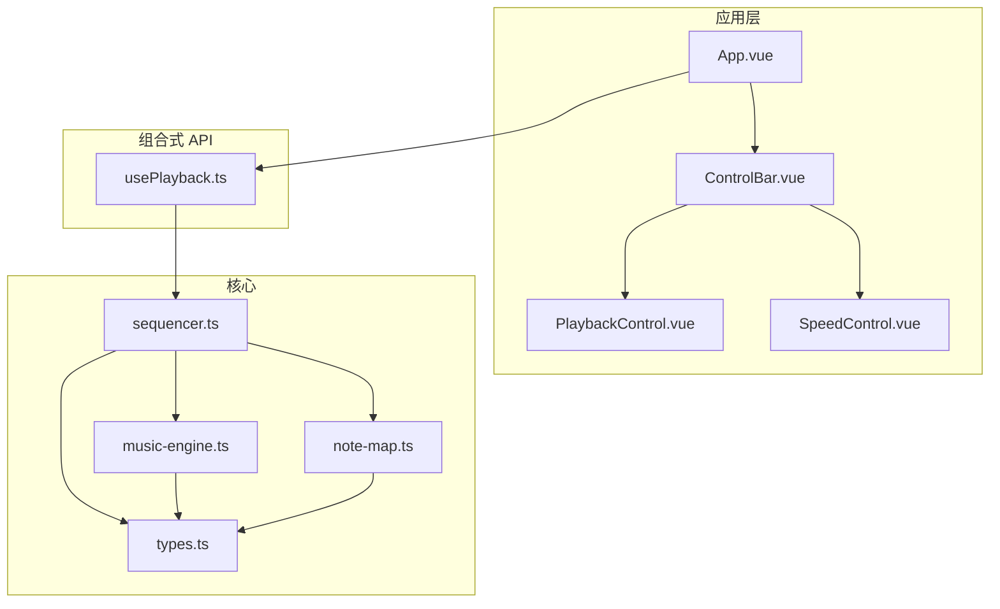
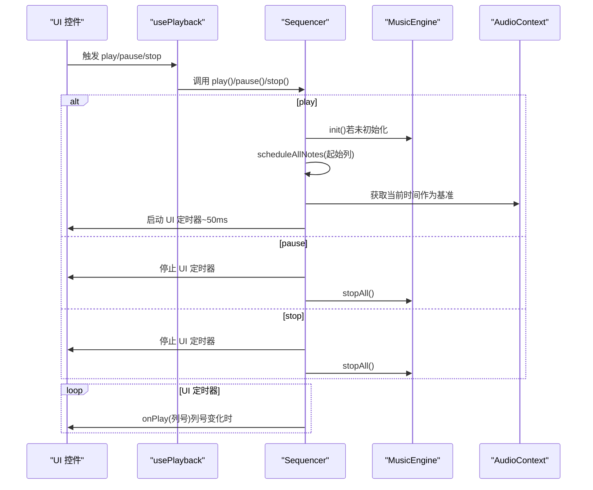
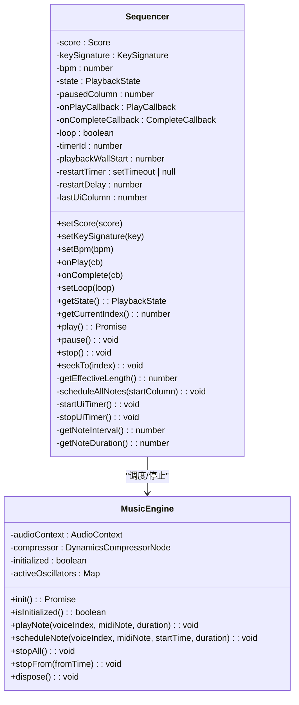
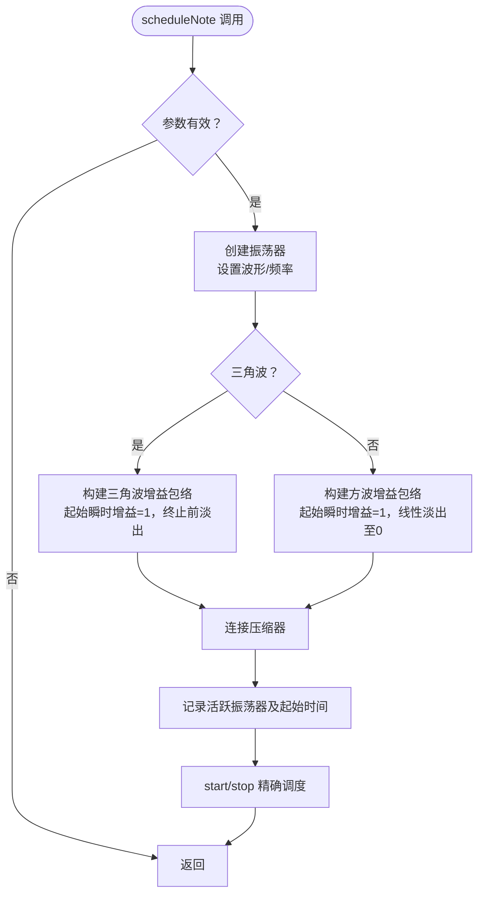
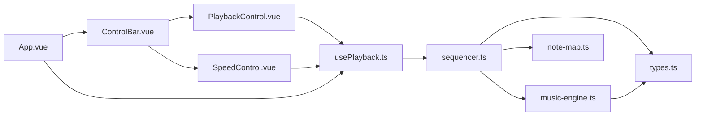
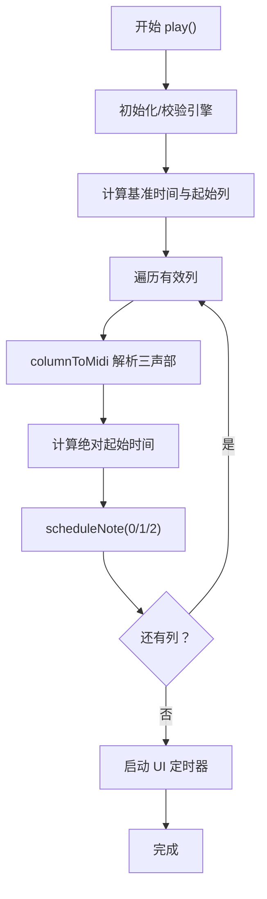
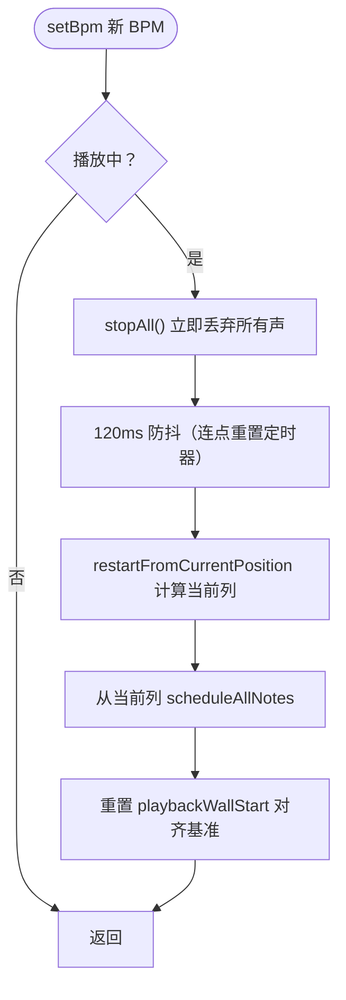

# 播放控制器

<cite>
**本文引用的文件**
- [sequencer.ts](file://src/core/sequencer.ts)
- [music-engine.ts](file://src/core/music-engine.ts)
- [types.ts](file://src/core/types.ts)
- [note-map.ts](file://src/core/note-map.ts)
- [usePlayback.ts](file://src/composables/usePlayback.ts)
- [PlaybackControl.vue](file://src/components/PlaybackControl.vue)
- [SpeedControl.vue](file://src/components/SpeedControl.vue)
- [ControlBar.vue](file://src/components/ControlBar.vue)
- [App.vue](file://src/App.vue)
</cite>

## 目录
1. [简介](#简介)
2. [项目结构](#项目结构)
3. [核心组件](#核心组件)
4. [架构总览](#架构总览)
5. [详细组件分析](#详细组件分析)
6. [依赖关系分析](#依赖关系分析)
7. [性能考量](#性能考量)
8. [故障排查指南](#故障排查指南)
9. [结论](#结论)
10. [附录](#附录)

## 简介
本文件面向“Sequencer 播放控制系统”的技术文档，系统性解析以下主题：
- 播放调度算法与预调度机制
- BPM 控制与实时变速策略
- 播放状态管理与时间同步
- 循环播放控制
- 与 MusicEngine 的协作关系与数据流
- 播放控制 API、事件处理机制
- 性能优化策略与常见问题解决
- 预调度算法如何提前计算音符播放时机，以及如何处理播放中的 BPM 调整与音符取消

## 项目结构
播放控制相关代码主要位于 src/core、src/composables 与 src/components 三层：
- 核心逻辑：sequencer.ts（序列器）、music-engine.ts（音乐引擎）、note-map.ts（音符映射）
- 组合式 API：usePlayback.ts（播放状态与控制封装）
- 视图层：PlaybackControl.vue、SpeedControl.vue、ControlBar.vue、App.vue

图表来源
- [App.vue:102-138](file://src/App.vue#L102-L138)
- [ControlBar.vue:1-116](file://src/components/ControlBar.vue#L1-L116)
- [PlaybackControl.vue:1-111](file://src/components/PlaybackControl.vue#L1-L111)
- [SpeedControl.vue:1-68](file://src/components/SpeedControl.vue#L1-L68)
- [usePlayback.ts:1-95](file://src/composables/usePlayback.ts#L1-L95)
- [sequencer.ts:1-354](file://src/core/sequencer.ts#L1-L354)
- [music-engine.ts:1-221](file://src/core/music-engine.ts#L1-L221)
- [note-map.ts:1-119](file://src/core/note-map.ts#L1-L119)
- [types.ts:1-164](file://src/core/types.ts#L1-L164)

章节来源
- [App.vue:102-138](file://src/App.vue#L102-L138)
- [ControlBar.vue:1-116](file://src/components/ControlBar.vue#L1-L116)
- [PlaybackControl.vue:1-111](file://src/components/PlaybackControl.vue#L1-L111)
- [SpeedControl.vue:1-68](file://src/components/SpeedControl.vue#L1-L68)
- [usePlayback.ts:1-95](file://src/composables/usePlayback.ts#L1-L95)
- [sequencer.ts:1-354](file://src/core/sequencer.ts#L1-L354)
- [music-engine.ts:1-221](file://src/core/music-engine.ts#L1-L221)
- [note-map.ts:1-119](file://src/core/note-map.ts#L1-L119)
- [types.ts:1-164](file://src/core/types.ts#L1-L164)

## 核心组件
- Sequencer（序列器）：负责播放调度、状态管理、BPM 实时调整、循环播放、UI 定时器与回调
- MusicEngine（音乐引擎）：基于 Web Audio API 的底层音频渲染与调度，提供音符预调度、选择性停止、全局停止能力
- usePlayback（组合式 API）：将播放状态与控制暴露给视图层，监听 BPM/调号变更并转发至 Sequencer
- PlaybackControl/SpeedControl/ControlBar：UI 控件，触发播放控制事件并展示状态
- note-map：将简谱字符串映射为 MIDI 音符编号，配合调号生成最终音高
- types：播放状态、BPM 列表、调号、列结构等类型定义

章节来源
- [sequencer.ts:21-354](file://src/core/sequencer.ts#L21-L354)
- [music-engine.ts:17-221](file://src/core/music-engine.ts#L17-L221)
- [usePlayback.ts:14-95](file://src/composables/usePlayback.ts#L14-L95)
- [PlaybackControl.vue:1-111](file://src/components/PlaybackControl.vue#L1-L111)
- [SpeedControl.vue:1-68](file://src/components/SpeedControl.vue#L1-L68)
- [ControlBar.vue:1-116](file://src/components/ControlBar.vue#L1-L116)
- [note-map.ts:109-119](file://src/core/note-map.ts#L109-L119)
- [types.ts:71-138](file://src/core/types.ts#L71-L138)

## 架构总览
播放控制采用“预调度 + UI 轮询”的双轨机制：
- 预调度：启动播放时一次性计算所有音符在 AudioContext 时间轴上的绝对起止时间，并创建/调度振荡器与增益包络
- UI 轮询：以固定周期（约 50ms）查询当前列号，仅在列号变化时触发 UI 回调，保持 UI 与音频的解耦
- 音频渲染：MusicEngine 负责具体音符的生成、增益包络与压缩器输出；支持选择性停止与全局停止

图表来源
- [usePlayback.ts:46-77](file://src/composables/usePlayback.ts#L46-L77)
- [sequencer.ts:144-200](file://src/core/sequencer.ts#L144-L200)
- [sequencer.ts:271-313](file://src/core/sequencer.ts#L271-L313)
- [music-engine.ts:41-64](file://src/core/music-engine.ts#L41-L64)
- [music-engine.ts:155-169](file://src/core/music-engine.ts#L155-L169)

## 详细组件分析

### Sequencer（序列器）
- 职责
  - 管理播放状态（stopped/playing/paused）
  - 计算每列时间间隔与音符时长（基于 BPM）
  - 预调度所有剩余音符（一次性创建振荡器与增益包络）
  - 实时 BPM/调号调整（2026-08-30 改）：命中 playing 时 `requestPlaybackRestart()` 立即 stopAll 丢弃所有声，120ms 防抖后从当前指示器列整体重排
  - 循环播放：到达末尾时重置起点并重新调度
  - UI 定时器：以固定周期轮询当前列号，触发 onPlay 回调
- 关键算法
  - 预调度：以 AudioContext 当前时间为基准，计算每列的绝对起始时间，批量调度三个声部
  - 实时调整：stopAll + 120ms 防抖（restartTimer）+ `restartFromCurrentPosition()` 从当前列重排，并重置 playbackWallStart 与调度基准对齐（约 100ms）
  - 有效长度：从末尾向前扫描，找到最后一个包含非空音符的列，作为播放终点，避免在空白列浪费时间
- 数据结构
  - Score：二维数组，每列含三个声部的简谱字符串
  - KeySignature：调号枚举
  - PlaybackState：播放状态
  - BPM：每分钟节拍数
- 事件与回调
  - onPlay：列号变化时触发
  - onComplete：播放结束时触发
- 线程与并发
  - 通过 `restartTimer`（120ms 防抖）合并快速连点/拖动，避免反复调度；防抖定时器在 pause()/stop() 中清除

图表来源
- [sequencer.ts:21-354](file://src/core/sequencer.ts#L21-L354)
- [music-engine.ts:17-221](file://src/core/music-engine.ts#L17-L221)

章节来源
- [sequencer.ts:21-354](file://src/core/sequencer.ts#L21-L354)

### MusicEngine（音乐引擎）
- 职责
  - 管理 AudioContext 与压缩器
  - 预调度音符：创建振荡器、设置频率、构建增益包络（方波与三角波不同策略）
  - 选择性停止：根据起始时间筛选并停止未来音符
  - 全局停止：立即停止所有活跃振荡器
- 关键设计
  - 方波：增益在起始时刻设为 1，随后线性淡出至 0，形成断奏效果
  - 三角波：在终止前做极短的淡出，消除点击声
  - 三个声部共享压缩器输出，形成统一音色
- 生命周期
  - init 需要在用户手势后调用以唤醒 suspended 状态
  - dispose 释放资源，便于重新初始化

图表来源
- [music-engine.ts:90-150](file://src/core/music-engine.ts#L90-L150)

章节来源
- [music-engine.ts:17-221](file://src/core/music-engine.ts#L17-L221)

### usePlayback（播放控制组合式 API）
- 职责
  - 将播放状态与当前列号暴露给视图层
  - 监听 BPM 与调号变化，调用 Sequencer.setBpm 与 setKeySignature
  - 提供 play/pause/stop/togglePlayPause/toggleLoop 等控制方法
- 与 Sequencer 的绑定
  - 通过 getSequencer 获取单例，设置乐谱、注册回调、转发控制命令
- 与 App/ControlBar 的集成
  - App.vue 将 usePlayback 的状态与方法传递给 ControlBar，ControlBar 再下发到 PlaybackControl/SpeedControl

章节来源
- [usePlayback.ts:14-95](file://src/composables/usePlayback.ts#L14-L95)
- [App.vue:30-42](file://src/App.vue#L30-L42)
- [ControlBar.vue:43-50](file://src/components/ControlBar.vue#L43-L50)

### PlaybackControl/SpeedControl/ControlBar（UI 控件）
- PlaybackControl：触发 play/pause/stop/toggle-loop 事件
- SpeedControl：提供 BPM 列表与步进控制，展示当前 BPM 位置
- ControlBar：整合控件与状态，向 App.vue 派发事件

章节来源
- [PlaybackControl.vue:1-111](file://src/components/PlaybackControl.vue#L1-L111)
- [SpeedControl.vue:1-68](file://src/components/SpeedControl.vue#L1-L68)
- [ControlBar.vue:1-116](file://src/components/ControlBar.vue#L1-L116)

### note-map（音符映射）
- 职责
  - 将简谱字符串解析为 MIDI 音符编号，考虑升降号与位于数字之前的八度修饰符
  - 支持多调号映射，依据调号表计算基准音高
- 与 Sequencer 的协作
  - Sequencer 在预调度时调用 columnToMidi，将列中的三个声部转换为 MIDI 编号

章节来源
- [note-map.ts:109-119](file://src/core/note-map.ts#L109-L119)
- [sequencer.ts:255-261](file://src/core/sequencer.ts#L255-L261)

## 依赖关系分析
- Sequencer 依赖
  - MusicEngine：音频调度与停止
  - note-map：音符到 MIDI 的映射
  - types：PlaybackState、KeySignature、Score 等类型
- MusicEngine 依赖
  - types：BPM、KeySignature 等类型
- usePlayback 依赖
  - Sequencer 单例、types
- UI 组件依赖
  - usePlayback（状态与控制）、types（PlaybackState）

图表来源
- [sequencer.ts:1-3](file://src/core/sequencer.ts#L1-L3)
- [music-engine.ts:1-12](file://src/core/music-engine.ts#L1-L12)
- [note-map.ts:1-2](file://src/core/note-map.ts#L1-L2)
- [types.ts:1-164](file://src/core/types.ts#L1-L164)
- [usePlayback.ts:1-4](file://src/composables/usePlayback.ts#L1-L4)
- [PlaybackControl.vue:1-14](file://src/components/PlaybackControl.vue#L1-L14)
- [SpeedControl.vue:1-6](file://src/components/SpeedControl.vue#L1-L6)
- [ControlBar.vue:1-25](file://src/components/ControlBar.vue#L1-L25)
- [App.vue:1-12](file://src/App.vue#L1-L12)

章节来源
- [sequencer.ts:1-3](file://src/core/sequencer.ts#L1-L3)
- [music-engine.ts:1-12](file://src/core/music-engine.ts#L1-L12)
- [note-map.ts:1-2](file://src/core/note-map.ts#L1-L2)
- [types.ts:1-164](file://src/core/types.ts#L1-L164)
- [usePlayback.ts:1-4](file://src/composables/usePlayback.ts#L1-L4)
- [PlaybackControl.vue:1-14](file://src/components/PlaybackControl.vue#L1-L14)
- [SpeedControl.vue:1-6](file://src/components/SpeedControl.vue#L1-L6)
- [ControlBar.vue:1-25](file://src/components/ControlBar.vue#L1-L25)
- [App.vue:1-12](file://src/App.vue#L1-L12)

## 性能考量
- 预调度策略
  - 一次性创建所有振荡器与增益节点，避免运行时逐音符创建的开销
  - 通过 AudioContext 绝对时间进行精确调度，减少抖动
- UI 轮询
  - 以约 50ms 间隔轮询，仅在列号变化时触发回调，降低 UI 更新成本
- 实时变速/变调的丢弃重排
  - 调整 BPM/调号时，立即 stopAll 丢弃所有声，杜绝新旧音符叠加混响；120ms 防抖合并连点后从当前指示器列整体重排
- 资源管理
  - stopAll 清理活跃振荡器，防止内存泄漏与后台噪音
- 建议
  - 避免频繁调用 setBpm/setKeySignature，内部已有 120ms 防抖
  - 在长乐谱场景下，合理利用 getEffectiveLength 减少无效列的调度

[本节为通用性能建议，不直接分析具体文件]

## 故障排查指南
- 播放无声音
  - 确认 AudioContext 已初始化且处于非 suspended 状态（需用户手势）
  - 检查 BPM 是否为 0 或过小导致列间隔过大
  - 确认乐谱中存在有效音符（getEffectiveLength > 0）
- BPM/调号调整异常
  - 确认 setBpm/setKeySignature 命中 playing 时走 requestPlaybackRestart（stopAll + 防抖重启）
  - 检查 restartTimer 是否在 pause()/stop() 中清除；确认 restartFromCurrentPosition 后 playbackWallStart 与调度基准对齐
- 调号切换不生效
  - 检查 columnToMidi 的调用是否正确传入当前 KeySignature
- UI 不更新
  - 确认 onPlay 回调已注册，且 UI 定时器正常运行
  - 检查列号变化逻辑与有效长度计算

章节来源
- [music-engine.ts:41-64](file://src/core/music-engine.ts#L41-L64)
- [sequencer.ts:84-115](file://src/core/sequencer.ts#L84-L115)
- [sequencer.ts:55-82](file://src/core/sequencer.ts#L55-L82)
- [sequencer.ts:271-313](file://src/core/sequencer.ts#L271-L313)

## 结论
该播放控制系统通过“预调度 + 实时丢弃重排 + UI 轮询”的架构实现了高精度、低延迟的节拍驱动播放。Sequencer 负责播放调度与状态管理，MusicEngine 提供底层音频渲染与停止控制，usePlayback 将播放控制与状态暴露给 UI 层。系统在 BPM 实时调整、调号切换、循环播放等方面具备良好的用户体验与性能表现。

[本节为总结性内容，不直接分析具体文件]

## 附录

### 播放控制 API（概览）
- Sequencer
  - setScore(score)
  - setKeySignature(key)
  - setBpm(bpm)
  - onPlay(callback)
  - onComplete(callback)
  - setLoop(loop)
  - getState()
  - getCurrentIndex()
  - play()
  - pause()
  - stop()
  - seekTo(index)
- MusicEngine
  - init()
  - isInitialized()
  - playNote(voiceIndex, midiNote, duration)
  - scheduleNote(voiceIndex, midiNote, startTime, duration)
  - stopAll()
  - stopFrom(fromTime)
  - dispose()

章节来源
- [sequencer.ts:51-213](file://src/core/sequencer.ts#L51-L213)
- [music-engine.ts:41-214](file://src/core/music-engine.ts#L41-L214)

### 预调度算法流程

图表来源
- [sequencer.ts:144-167](file://src/core/sequencer.ts#L144-L167)
- [sequencer.ts:240-263](file://src/core/sequencer.ts#L240-L263)
- [note-map.ts:109-119](file://src/core/note-map.ts#L109-L119)
- [music-engine.ts:90-150](file://src/core/music-engine.ts#L90-L150)

### BPM 调整与音符重排流程

图表来源
- [sequencer.ts:84-115](file://src/core/sequencer.ts#L84-L115)
- [music-engine.ts:177-197](file://src/core/music-engine.ts#L177-L197)