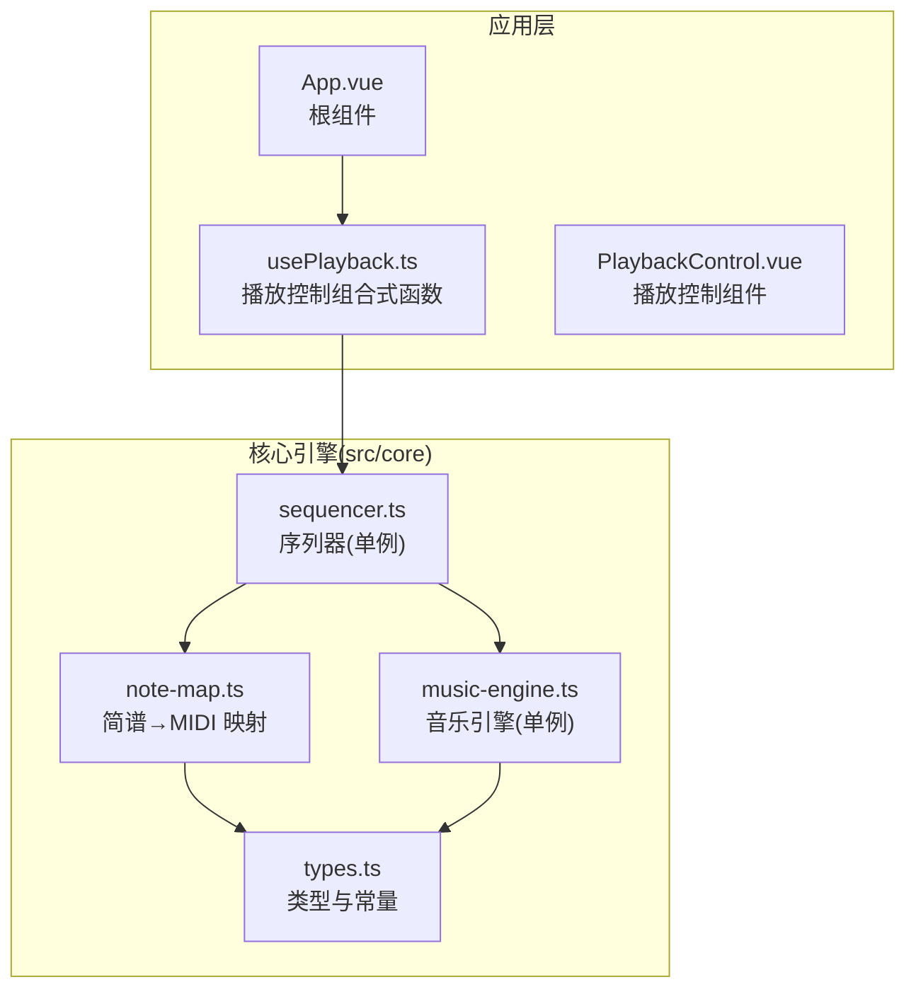
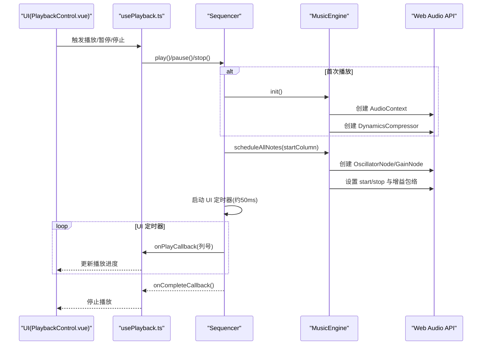
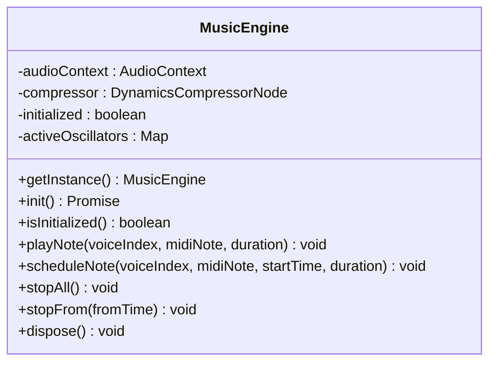
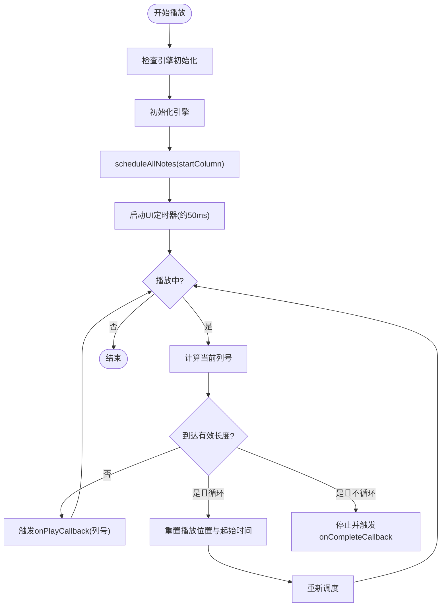
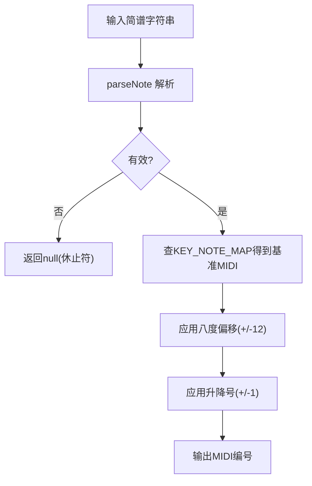
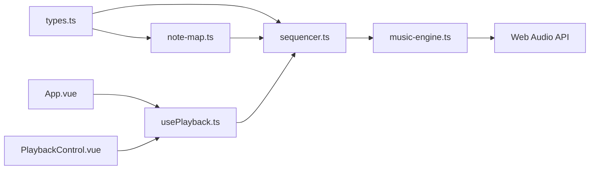

# 核心引擎模块

<cite>
**本文引用的文件**
- [music-engine.ts](file://src/core/music-engine.ts)
- [sequencer.ts](file://src/core/sequencer.ts)
- [types.ts](file://src/core/types.ts)
- [note-map.ts](file://src/core/note-map.ts)
- [usePlayback.ts](file://src/composables/usePlayback.ts)
- [PlaybackControl.vue](file://src/components/PlaybackControl.vue)
- [App.vue](file://src/App.vue)
- [jinglebell.html](file://demos/jinglebell.html)
</cite>

## 目录
1. [简介](#简介)
2. [项目结构](#项目结构)
3. [核心组件](#核心组件)
4. [架构总览](#架构总览)
5. [详细组件分析](#详细组件分析)
6. [依赖关系分析](#依赖关系分析)
7. [性能考量](#性能考量)
8. [故障排查指南](#故障排查指南)
9. [结论](#结论)
10. [附录](#附录)

## 简介
本文件面向 SUBOR Music Board 的核心引擎模块，系统性解析 MusicEngine 音乐引擎类的设计与实现，涵盖单例模式、Web Audio API 封装、音频合成算法；深入说明 Sequencer 播放控制器的预调度机制、播放状态管理、BPM 控制与实时调整策略；解释核心类型定义与数据结构；提供模块初始化流程、API 接口规范与性能优化建议，并给出具体使用场景与扩展方法，帮助开发者快速理解并高效扩展该核心引擎。

## 项目结构
核心引擎位于 src/core 目录，围绕以下四个文件构建：
- types.ts：定义类型、常量与校验规则
- note-map.ts：将简谱字符串映射为 MIDI 音符编号
- music-engine.ts：基于 Web Audio API 的音乐引擎，负责音符调度与播放
- sequencer.ts：序列器，负责预调度、播放状态管理、BPM 实时调整与 UI 同步

应用层通过 composable/usePlayback.ts 与组件 PlaybackControl.vue、App.vue 将播放控制与 UI 交互打通。

图表来源
- [music-engine.ts:1-221](file://src/core/music-engine.ts#L1-L221)
- [sequencer.ts:1-354](file://src/core/sequencer.ts#L1-L354)
- [types.ts:1-164](file://src/core/types.ts#L1-L164)
- [note-map.ts:1-119](file://src/core/note-map.ts#L1-L119)
- [usePlayback.ts:1-95](file://src/composables/usePlayback.ts#L1-L95)
- [PlaybackControl.vue:1-111](file://src/components/PlaybackControl.vue#L1-L111)
- [App.vue:1-138](file://src/App.vue#L1-L138)

章节来源
- [music-engine.ts:1-221](file://src/core/music-engine.ts#L1-L221)
- [sequencer.ts:1-354](file://src/core/sequencer.ts#L1-L354)
- [types.ts:1-164](file://src/core/types.ts#L1-L164)
- [note-map.ts:1-119](file://src/core/note-map.ts#L1-L119)
- [usePlayback.ts:1-95](file://src/composables/usePlayback.ts#L1-L95)
- [PlaybackControl.vue:1-111](file://src/components/PlaybackControl.vue#L1-L111)
- [App.vue:1-138](file://src/App.vue#L1-L138)

## 核心组件
- MusicEngine：基于 Web Audio API 的单例引擎，负责创建 AudioContext、DynamicsCompressorNode，以及为每个音符创建独立的 OscillatorNode + GainNode，实现精确的预调度播放与实时停止控制。
- Sequencer：序列器，负责将乐谱按列进行预调度，维护播放状态、BPM 与调号，提供 play/pause/stop/seek/loop 等控制能力，并通过 UI 定时器同步播放进度。
- note-map：将简谱字符串解析为 MIDI 音符编号，支持升降号与八度修饰符，结合调号映射到基准音高。
- types：定义了播放状态、BPM 列表、调号、导出数据结构等核心类型与常量。

章节来源
- [music-engine.ts:17-221](file://src/core/music-engine.ts#L17-L221)
- [sequencer.ts:21-354](file://src/core/sequencer.ts#L21-L354)
- [note-map.ts:10-119](file://src/core/note-map.ts#L10-L119)
- [types.ts:47-164](file://src/core/types.ts#L47-L164)

## 架构总览
核心引擎采用“预调度 + UI 定时器”的播放模型，确保音频事件在 AudioContext 时间轴上精确执行，同时 UI 侧以较低频率轮询更新播放进度，避免阻塞主线程。

图表来源
- [PlaybackControl.vue:16-31](file://src/components/PlaybackControl.vue#L16-L31)
- [usePlayback.ts:46-77](file://src/composables/usePlayback.ts#L46-L77)
- [sequencer.ts:144-167](file://src/core/sequencer.ts#L144-L167)
- [music-engine.ts:41-60](file://src/core/music-engine.ts#L41-L60)
- [music-engine.ts:90-150](file://src/core/music-engine.ts#L90-L150)

## 详细组件分析

### MusicEngine 音乐引擎
- 单例模式：通过静态 getInstance 提供全局唯一实例，避免重复创建 AudioContext。
- 初始化流程：检测并创建 AudioContext，必要时 resume，创建主压缩器连接到 destination，标记初始化完成。
- 音符调度：根据声部索引选择波形（方波/三角波），计算频率与八度倍率，设置精确的 start/stop 时间与增益包络；三角波在终止前做微小淡出以消除点击声；方波采用线性淡出至零，形成断奏效果。
- 停止控制：stopAll 立即停止所有音符；stopFrom 仅停止指定时间之后的音符，用于 BPM 或调号变更时的平滑过渡。
- 资源释放：dispose 清理所有活跃振荡器、断开压缩器并关闭 AudioContext。

图表来源
- [music-engine.ts:17-221](file://src/core/music-engine.ts#L17-L221)

章节来源
- [music-engine.ts:17-221](file://src/core/music-engine.ts#L17-L221)

### Sequencer 序列器
- 数据与状态：持有 Score、KeySignature、BPM、PlaybackState、循环标志、UI 定时器句柄、播放起始 wall-clock 时间等。
- 预调度算法：一次性计算从起始列开始的所有音符在 AudioContext 绝对时间轴上的 start/stop，创建并连接对应的振荡器与增益节点，形成“一次性调度”模式。
- 播放控制：play/pause/stop/seek，维护 pausedColumn 与 playbackWallStart，使用 ~50ms 的定时器轮询当前列号并触发 onPlay 回调；支持循环播放并在循环时重置起始时间并重新调度。
- 实时调整：setBpm 与 setKeySignature 在播放中动态调整时，仅停止未来音符（stopFrom），从下一列开始用新参数重新调度，避免卡顿；同时更新 playbackWallStart 以保持 UI 同步。
- 有效长度：通过 getEffectiveLength 找到最后一个非空列，避免在空白列上浪费时间。

图表来源
- [sequencer.ts:144-167](file://src/core/sequencer.ts#L144-L167)
- [sequencer.ts:271-313](file://src/core/sequencer.ts#L271-L313)
- [sequencer.ts:240-263](file://src/core/sequencer.ts#L240-L263)

章节来源
- [sequencer.ts:21-354](file://src/core/sequencer.ts#L21-L354)

### note-map 简谱映射
- 支持的输入格式：数字 1-7、升降号 #/b、位于数字之前的八度修饰符 .（高八度）/,（低八度），空格表示休止符。
- 调号映射：以 C 大调为基准，其他调号通过键值映射到对应的 MIDI 音符编号。
- 解析与转换：parseNote 提取升降号、音级与八度偏移；noteToMidi 应用调号与八度得到 MIDI 编号；columnToMidi 批量转换一列三个声部。

图表来源
- [note-map.ts:35-100](file://src/core/note-map.ts#L35-L100)
- [note-map.ts:109-118](file://src/core/note-map.ts#L109-L118)

章节来源
- [note-map.ts:1-119](file://src/core/note-map.ts#L1-L119)

### 类型与数据结构
- 声部与波形：VoiceIndex 为 0/1/2，分别对应主旋律（方波高八度）、和弦律（方波原音高）、低频（三角波低八度）。
- 乐谱结构：Column 为三元组，Score 为列数组；默认列数为 125。
- BPM 与调号：BPM_LIST 提供离散速度档位，默认 90；KeySignature 支持 C/D/F/G/♭B 五个大调。
- 播放状态：PlaybackState 为 stopped/playing/paused。
- 导出数据：ExportData 包含版本、标题、描述、bpm、keySignature、score 等字段。

章节来源
- [types.ts:47-164](file://src/core/types.ts#L47-L164)

## 依赖关系分析
- Sequencer 依赖 MusicEngine 进行音符调度，依赖 note-map 将简谱转换为 MIDI，依赖 types 中的类型与常量。
- MusicEngine 依赖 Web Audio API，内部管理振荡器与增益节点，向外部暴露统一接口。
- 应用层通过 usePlayback.ts 与组件 PlaybackControl.vue、App.vue 将播放控制与 UI 交互解耦。

图表来源
- [music-engine.ts:18-214](file://src/core/music-engine.ts#L18-L214)
- [sequencer.ts:1-354](file://src/core/sequencer.ts#L1-L354)
- [types.ts:1-164](file://src/core/types.ts#L1-L164)
- [note-map.ts:1-119](file://src/core/note-map.ts#L1-L119)
- [usePlayback.ts:1-95](file://src/composables/usePlayback.ts#L1-L95)
- [PlaybackControl.vue:1-111](file://src/components/PlaybackControl.vue#L1-L111)
- [App.vue:1-138](file://src/App.vue#L1-L138)

章节来源
- [music-engine.ts:18-214](file://src/core/music-engine.ts#L18-L214)
- [sequencer.ts:1-354](file://src/core/sequencer.ts#L1-L354)
- [types.ts:1-164](file://src/core/types.ts#L1-L164)
- [note-map.ts:1-119](file://src/core/note-map.ts#L1-L119)
- [usePlayback.ts:1-95](file://src/composables/usePlayback.ts#L1-L95)
- [PlaybackControl.vue:1-111](file://src/components/PlaybackControl.vue#L1-L111)
- [App.vue:1-138](file://src/App.vue#L1-L138)

## 性能考量
- 预调度策略：一次性计算所有音符的绝对时间并创建节点，避免播放时的动态计算开销，提升稳定性与精度。
- UI 轮询频率：约 50ms 轮询，平衡 UI 响应与 CPU 占用；在无有效音符时立即停止，避免无效工作。
- 实时调整：BPM/调号变更时仅停止未来音符并从下一列重新调度，避免卡顿；通过 stopFrom 与 lastScheduleBaseTime 精确计算截止时间。
- 增益包络：方波采用线性淡出至零，三角波在终止前微小淡出，减少点击声与瞬态噪声。
- 资源管理：stopAll/dispose 清理活跃振荡器，释放内存与音频资源。

章节来源
- [sequencer.ts:271-313](file://src/core/sequencer.ts#L271-L313)
- [sequencer.ts:84-115](file://src/core/sequencer.ts#L84-L115)
- [music-engine.ts:177-197](file://src/core/music-engine.ts#L177-L197)
- [music-engine.ts:130-139](file://src/core/music-engine.ts#L130-L139)
- [music-engine.ts:117-129](file://src/core/music-engine.ts#L117-L129)

## 故障排查指南
- 首次播放无声音
  - 确认已调用 init 并在用户手势后执行；若 AudioContext 处于 suspended 状态，需先 resume。
  - 检查是否正确传入有效的 MIDI 音符编号（note-map 返回 null 表示休止符）。
- BPM 变更卡顿
  - 确保使用 stopFrom 仅停止未来音符，从下一列重新调度；不要在播放中直接重建引擎。
- 调号切换异常
  - setKeySignature 在播放中会触发 rescheduling，注意避免频繁切换；确认 _rescheduling 标志未被竞态覆盖。
- UI 不更新
  - 检查定时器是否启动；确认 onPlayCallback 是否被正确注册；确认有效长度大于 0。
- 资源泄漏
  - 停止播放后调用 stopAll；退出应用时调用 dispose 释放资源。

章节来源
- [music-engine.ts:41-60](file://src/core/music-engine.ts#L41-L60)
- [music-engine.ts:155-169](file://src/core/music-engine.ts#L155-L169)
- [music-engine.ts:202-214](file://src/core/music-engine.ts#L202-L214)
- [sequencer.ts:172-190](file://src/core/sequencer.ts#L172-L190)
- [sequencer.ts:55-82](file://src/core/sequencer.ts#L55-L82)

## 结论
该核心引擎以 Web Audio API 为基础，采用预调度与 UI 定时器相结合的方式，在保证播放精度的同时兼顾性能与用户体验。MusicEngine 提供稳定的音符调度与停止控制，Sequencer 实现了灵活的播放状态管理与实时调整能力。配合 types 与 note-map 的清晰抽象，开发者可以轻松扩展新的波形、调号与播放模式。

## 附录

### 模块初始化流程
- 应用启动后，usePlayback.ts 获取单例 Sequencer 并设置初始状态与回调。
- 首次播放时，Sequencer 调用 MusicEngine.init 创建 AudioContext 与压缩器。
- 通过 scheduleAllNotes 预调度所有音符，随后启动 UI 定时器同步播放进度。

章节来源
- [usePlayback.ts:21-31](file://src/composables/usePlayback.ts#L21-L31)
- [sequencer.ts:144-167](file://src/core/sequencer.ts#L144-L167)
- [music-engine.ts:41-60](file://src/core/music-engine.ts#L41-L60)

### API 接口规范
- MusicEngine
  - getInstance(): 获取单例
  - init(): 初始化引擎
  - isInitialized(): 查询初始化状态
  - playNote(voiceIndex, midiNote, duration): 立即播放音符
  - scheduleNote(voiceIndex, midiNote, startTime, duration): 预调度音符
  - stopAll(): 停止所有音符
  - stopFrom(fromTime): 停止指定时间之后的音符
  - dispose(): 释放资源
- Sequencer
  - setScore(score), setKeySignature(key), setBpm(bpm), setLoop(loop)
  - onPlay(callback), onComplete(callback)
  - play(), pause(), stop(), seekTo(columnIndex)
  - getState(), getCurrentIndex()

章节来源
- [music-engine.ts:27-221](file://src/core/music-engine.ts#L27-L221)
- [sequencer.ts:51-131](file://src/core/sequencer.ts#L51-L131)

### 与演示页面的对应关系
- demo/jinglebell.html 展示了完全基于 Web Audio API 的纯合成音色与增益包络策略，本项目在 MusicEngine 中严格复刻了其增益调度与波形选择逻辑，确保音色一致性与播放精度。

章节来源
- [jinglebell.html:32-61](file://demos/jinglebell.html#L32-L61)
- [music-engine.ts:100-150](file://src/core/music-engine.ts#L100-L150)