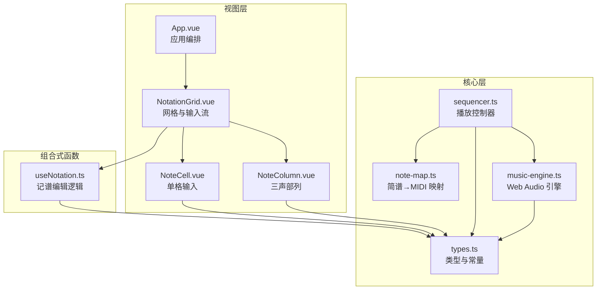
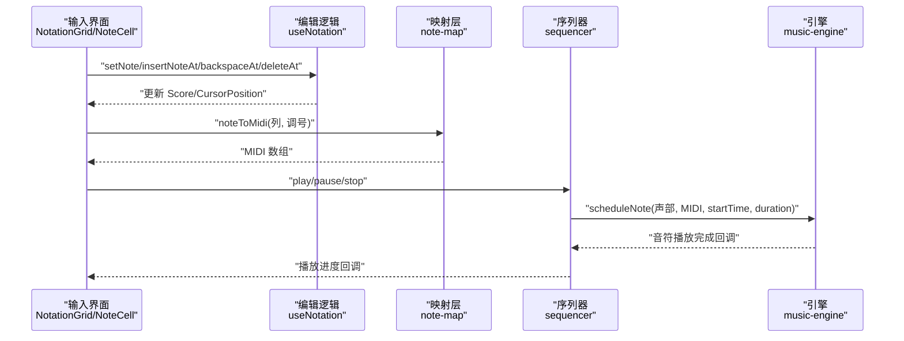
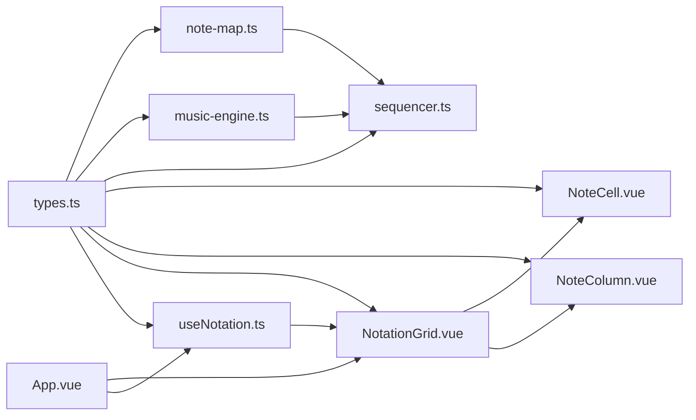
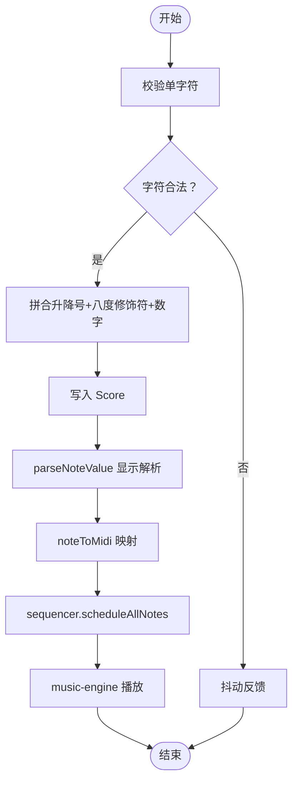

# 核心类型系统

<cite>
**本文引用的文件**
- [src/core/types.ts](file://src/core/types.ts)
- [src/core/note-map.ts](file://src/core/note-map.ts)
- [src/core/music-engine.ts](file://src/core/music-engine.ts)
- [src/core/sequencer.ts](file://src/core/sequencer.ts)
- [src/components/NoteCell.vue](file://src/components/NoteCell.vue)
- [src/components/NotationGrid.vue](file://src/components/NotationGrid.vue)
- [src/components/NoteColumn.vue](file://src/components/NoteColumn.vue)
- [src/composables/useNotation.ts](file://src/composables/useNotation.ts)
- [src/App.vue](file://src/App.vue)
</cite>

## 目录
1. [简介](#简介)
2. [项目结构](#项目结构)
3. [核心组件](#核心组件)
4. [架构总览](#架构总览)
5. [详细组件分析](#详细组件分析)
6. [依赖关系分析](#依赖关系分析)
7. [性能考量](#性能考量)
8. [故障排查指南](#故障排查指南)
9. [结论](#结论)
10. [附录](#附录)

## 简介
本文件面向“核心类型系统”，系统化梳理并解释以下关键数据结构与类型：
- Score、Column、CursorPosition 等核心数据结构的设计理念与使用方式
- 音符表示方法、八度编码规则、升降号处理机制
- 类型安全的实现方式与接口约束
- 数据验证规则、边界条件处理与错误类型定义
- 三声部数据结构的组织方式与跨模块的数据传递协议
- 类型使用示例与最佳实践建议

目标是帮助开发者与使用者在不深入源码的前提下，也能准确理解并正确使用这些类型与数据流。

## 项目结构
本项目采用“核心类型 + 核心引擎 + 视图组件”的分层设计：
- 核心类型与工具：位于 src/core，定义类型、解析与映射逻辑
- 音乐引擎：负责 Web Audio 音符调度与播放
- 序列器：负责播放状态管理、BPM/调号变更、UI 定时器
- 视图层：由 Vue 组件构成，负责输入、渲染与交互
- 组合式函数：封装业务逻辑（如记谱编辑、播放控制）



图表来源
- [src/core/types.ts:1-164](file://src/core/types.ts#L1-L164)
- [src/core/note-map.ts:1-119](file://src/core/note-map.ts#L1-L119)
- [src/core/music-engine.ts:1-221](file://src/core/music-engine.ts#L1-L221)
- [src/core/sequencer.ts:1-354](file://src/core/sequencer.ts#L1-L354)
- [src/components/NoteCell.vue:1-278](file://src/components/NoteCell.vue#L1-L278)
- [src/components/NoteColumn.vue:1-63](file://src/components/NoteColumn.vue#L1-L63)
- [src/components/NotationGrid.vue:1-292](file://src/components/NotationGrid.vue#L1-L292)
- [src/composables/useNotation.ts:1-116](file://src/composables/useNotation.ts#L1-L116)
- [src/App.vue:1-138](file://src/App.vue#L1-L138)

章节来源
- [src/core/types.ts:1-164](file://src/core/types.ts#L1-L164)
- [src/App.vue:1-138](file://src/App.vue#L1-L138)

## 核心组件
本节聚焦核心类型与数据结构，解释其设计理念与使用方式。

- Score（乐谱）
  - 定义：N 列的二维数据，每列包含三个声部的记谱字符串
  - 类型：Column[]，其中 Column 为三元组 [string, string, string]
  - 设计要点：初始 DEFAULT_COLUMNS（125）列，可随输入/导入动态扩展（不设硬上限），实际有效长度由最后一列非空格音符决定
  - 使用场景：存储与传输乐谱数据，作为播放器与编辑器的统一数据源

- Column（单列）
  - 定义：三声部的记谱字符串，顺序对应 VoiceIndex
  - 设计要点：严格三元组，便于序列器与 UI 一一对应

- CursorPosition（光标位置）
  - 定义：col（列索引）、voice（声部索引）
  - 设计要点：定位当前编辑格子，驱动键盘导航与写入行为分派

- VoiceIndex（声部索引）
  - 定义：0、1、2，分别代表主旋律、和弦律、低频
  - 设计要点：通过联合类型限定取值范围，避免越界

- 播放状态 PlaybackState
  - 定义：'stopped' | 'playing' | 'paused'
  - 设计要点：序列器内部状态机

- 重复模式 RepeatMode
  - 定义：boolean
  - 设计要点：控制播放循环的开关

- 调号 KeySignature
  - 定义：'C' | 'D' | 'F' | 'G' | 'A'
  - 设计要点：限定合法调号集合，确保简谱到 MIDI 的映射正确

- 导出数据 ExportData
  - 字段：version、title、description、bpm、keySignature、score
  - 设计要点：标准化导出格式，便于跨平台/跨版本兼容

章节来源
- [src/core/types.ts:47-164](file://src/core/types.ts#L47-L164)

## 架构总览
核心类型系统贯穿“输入—解析—映射—调度—播放”的完整链路，并通过严格的类型约束保证各模块协作的可靠性。



图表来源
- [src/components/NotationGrid.vue:1-292](file://src/components/NotationGrid.vue#L1-L292)
- [src/composables/useNotation.ts:1-116](file://src/composables/useNotation.ts#L1-L116)
- [src/core/note-map.ts:1-119](file://src/core/note-map.ts#L1-L119)
- [src/core/sequencer.ts:1-354](file://src/core/sequencer.ts#L1-L354)
- [src/core/music-engine.ts:1-221](file://src/core/music-engine.ts#L1-L221)

## 详细组件分析

### 数据模型与类型安全
- 类型安全实现
  - 使用联合类型限定取值范围（如 VoiceIndex、PlaybackState、RepeatMode、KeySignature）
  - 使用字面量类型与 const 断言确保常量值不可变（如 BPM_LIST、DEFAULT_BPM、KEY_SIGNATURES）
  - 使用 readonly 与 tuple 类型约束数据结构（如 Column、Score、CursorPosition）
  - 使用接口约束导出数据结构（ExportData），明确字段与类型

- 接口约束
  - NoteDisplay：解析后的显示信息与八度 CSS 类
  - ExportData：导出数据的标准结构
  - PlayCallback/CompleteCallback/LooptoggleCallback：播放回调接口

- 边界条件与错误处理
  - 空格/空串：视为休止符，返回 null 或空显示
  - 非法字符：NoteCell 在输入时拒绝并反馈抖动
  - 越界访问：useNotation 对列/声部索引进行边界检查
  - BPM/调号变更：序列器在播放中实时重调度，避免卡顿

章节来源
- [src/core/types.ts:1-164](file://src/core/types.ts#L1-L164)
- [src/components/NoteCell.vue:1-278](file://src/components/NoteCell.vue#L1-L278)
- [src/composables/useNotation.ts:1-116](file://src/composables/useNotation.ts#L1-L116)

### 音符表示方法与解析
- 存储格式
  - 结构：[升降号?][八度修饰符?][音符数字 1-7]
  - 示例：'1'、'#.1'、'b,3'、' '（休止符）
- 解析规则
  - 单字符校验：NOTE_CHAR_REGEX 限制合法按键字符
  - 完整值校验：isValidNoteValue 支持合法组合
  - 八度修饰符：'.' 高八度，',' 低八度，位于数字之前，仅支持一级
  - 升降号：'#' 升、'b' 降，与数字组合

- 显示与渲染
  - parseNoteValue：分离显示文本与八度 CSS 类
  - NoteCell：根据焦点状态与待决修饰符动态展示

章节来源
- [src/core/types.ts:14-96](file://src/core/types.ts#L14-L96)
- [src/components/NoteCell.vue:28-115](file://src/components/NoteCell.vue#L28-L115)

### 八度编码规则
- 编码方式
  - '.'：高八度（上加点）
  - ','：低八度（下加点）
  - 仅支持一级（1 级）
- 显示映射
  - parseNoteValue 输出 octaveClass：'s1'（高）、's-1'（低）
- 播放映射
  - note-map.ts：octaveShift × 12 半音偏移

章节来源
- [src/core/types.ts:4-39](file://src/core/types.ts#L4-L39)
- [src/core/note-map.ts:61-74](file://src/core/note-map.ts#L61-L74)

### 升降号处理机制
- 输入阶段
  - NoteCell：支持 '#'/'b' 作为前缀，临时存入 pendingAccidental
  - 输入数字时，拼接待决前缀（升降号、八度修饰符）与数字，形成完整记谱值
- 显示阶段
  - 非焦点时隐藏升降号，仅显示数字
  - 焦点时显示完整值
- 解析阶段
  - parseNote：提取 accidental（0/1/-1）、noteNumber（1-7）、octaveShift（0/±1）

章节来源
- [src/components/NoteCell.vue:48-115](file://src/components/NoteCell.vue#L48-L115)
- [src/core/note-map.ts:35-74](file://src/core/note-map.ts#L35-L74)

### 三声部数据结构与组织方式
- 声部索引
  - 0：主旋律（方波）
  - 1：和弦律（方波）
  - 2：低频（三角波）
- 数据组织
  - Column：[主旋律, 和弦律, 低频]
  - Score：Column[]
  - NoteColumn：渲染单列的三个单元格
- 跨模块传递
  - NotationGrid：接收 Score、Cursor、KeySignature
  - useNotation：提供 set/clear/insert/backspace/delete/moveCursor 等操作
  - App.vue：作为顶层编排，连接编辑与播放

```mermaid
classDiagram
class Score {
+Column[]
}
class Column {
+string[3]
}
class CursorPosition {
+number col
+VoiceIndex voice
}
class VoiceIndex {
<<union>>
0
1
2
}
class KeySignature {
<<union>>
"C","D","F","G","A"
}
class ExportData {
+string version
+string title
+string description
+number bpm
+KeySignature keySignature
+Score score
}
Score --> Column : "包含"
Column --> VoiceIndex : "三元组"
CursorPosition --> VoiceIndex : "使用"
ExportData --> Score : "包含"
ExportData --> KeySignature : "包含"
```

图表来源
- [src/core/types.ts:47-164](file://src/core/types.ts#L47-L164)
- [src/components/NoteColumn.vue:1-63](file://src/components/NoteColumn.vue#L1-L63)

章节来源
- [src/core/types.ts:47-66](file://src/core/types.ts#L47-L66)
- [src/components/NoteColumn.vue:1-63](file://src/components/NoteColumn.vue#L1-L63)
- [src/App.vue:1-138](file://src/App.vue#L1-L138)

### 数据验证规则与边界条件
- 输入验证
  - 单字符：NOTE_CHAR_REGEX 限制为 1-7、#、b、.、,、空格
  - 完整值：合法组合需满足 /^[#b]?[.,]?[1-7]$/ 的格式
- 边界处理
  - 列索引：useNotation 对 col 进行 [0, length) 检查
  - 声部索引：moveCursor 限制在 [0,2]
  - BPM/调号变更：播放中实时重调度，避免卡顿
- 错误类型
  - 无效字符：NoteCell 抖动反馈
  - 休止符：返回 null/MIDI 映射为空格
  - 越界：useNotation/NotationGrid 忽略无效操作

章节来源
- [src/core/types.ts:77-96](file://src/core/types.ts#L77-L96)
- [src/components/NoteCell.vue:72-79](file://src/components/NoteCell.vue#L72-L79)
- [src/composables/useNotation.ts:20-71](file://src/composables/useNotation.ts#L20-L71)
- [src/core/sequencer.ts:84-115](file://src/core/sequencer.ts#L84-L115)

### 类型使用示例与最佳实践
- 示例路径
  - 创建空白乐谱：[useNotation.ts:10-13](file://src/composables/useNotation.ts#L10-L13)
  - 设置音符：[useNotation.ts:20-24](file://src/composables/useNotation.ts#L20-L24)
  - 插入音符（空格触发右移插入）：[useNotation.ts:36-42](file://src/composables/useNotation.ts#L36-L42)
  - 回删音符（Backspace 触发左移填补）：[useNotation.ts:48-56](file://src/composables/useNotation.ts#L48-L56)
  - 清空音符（Delete 触发清空当前格）：[useNotation.ts:26-31](file://src/composables/useNotation.ts#L26-L31)
  - 解析记谱值：[types.ts:21-39](file://src/core/types.ts#L21-L39)
  - 简谱→MIDI 映射：[note-map.ts:83-100](file://src/core/note-map.ts#L83-L100)
  - 播放音符：[music-engine.ts:69-75](file://src/core/music-engine.ts#L69-L75)
  - 序列器播放：[sequencer.ts:144-167](file://src/core/sequencer.ts#L144-L167)

- 最佳实践
  - 输入层先校验单字符，再拼合为完整值，最后写入 Score
  - 使用 readonly 包装对外暴露的 Score/CursorPosition，避免外部修改
  - 空格插入时，注意位移与越界保护
  - 播放中变更 BPM/调号时，使用序列器的重调度策略，避免卡顿
  - 导出时使用 ExportData 标准结构，确保字段齐全

章节来源
- [src/composables/useNotation.ts:1-116](file://src/composables/useNotation.ts#L1-L116)
- [src/components/NotationGrid.vue:112-148](file://src/components/NotationGrid.vue#L112-L148)
- [src/core/types.ts:21-39](file://src/core/types.ts#L21-L39)
- [src/core/note-map.ts:83-100](file://src/core/note-map.ts#L83-L100)
- [src/core/music-engine.ts:69-75](file://src/core/music-engine.ts#L69-L75)
- [src/core/sequencer.ts:144-167](file://src/core/sequencer.ts#L144-L167)

## 依赖关系分析
- 类型依赖
  - types.ts 提供基础类型与常量，被 note-map.ts、music-engine.ts、sequencer.ts、components、composables 广泛引用
- 组件依赖
  - NotationGrid 依赖 useNotation、NoteCell、NoteColumn、Quill
  - App.vue 依赖 useNotation、usePlayback、useImportExport
- 引擎依赖
  - sequencer.ts 依赖 music-engine.ts 与 note-map.ts
  - music-engine.ts 独立于第三方库，直接使用 Web Audio API



图表来源
- [src/core/types.ts:1-164](file://src/core/types.ts#L1-L164)
- [src/core/note-map.ts:1-119](file://src/core/note-map.ts#L1-L119)
- [src/core/music-engine.ts:1-221](file://src/core/music-engine.ts#L1-L221)
- [src/core/sequencer.ts:1-354](file://src/core/sequencer.ts#L1-L354)
- [src/components/NoteCell.vue:1-278](file://src/components/NoteCell.vue#L1-L278)
- [src/components/NoteColumn.vue:1-63](file://src/components/NoteColumn.vue#L1-L63)
- [src/components/NotationGrid.vue:1-292](file://src/components/NotationGrid.vue#L1-L292)
- [src/composables/useNotation.ts:1-116](file://src/composables/useNotation.ts#L1-L116)
- [src/App.vue:1-138](file://src/App.vue#L1-L138)

章节来源
- [src/core/types.ts:1-164](file://src/core/types.ts#L1-L164)
- [src/core/note-map.ts:1-119](file://src/core/note-map.ts#L1-L119)
- [src/core/music-engine.ts:1-221](file://src/core/music-engine.ts#L1-L221)
- [src/core/sequencer.ts:1-354](file://src/core/sequencer.ts#L1-L354)
- [src/components/NoteCell.vue:1-278](file://src/components/NoteCell.vue#L1-L278)
- [src/components/NoteColumn.vue:1-63](file://src/components/NoteColumn.vue#L1-L63)
- [src/components/NotationGrid.vue:1-292](file://src/components/NotationGrid.vue#L1-L292)
- [src/composables/useNotation.ts:1-116](file://src/composables/useNotation.ts#L1-L116)
- [src/App.vue:1-138](file://src/App.vue#L1-L138)

## 性能考量
- 预调度播放
  - sequencer.ts 一次性计算所有音符的绝对时间并创建振荡器，避免 UI 与音频同步抖动
- 实时变速/变调的丢弃重排
  - BPM/调号变更时，stopAll 立即丢弃所有声，120ms 防抖后从当前指示器列整体重排，杜绝叠加混响并保持音画同步
- 有效长度优化
  - getEffectiveLength 仅播放非空列，避免在空白列浪费时间
- Web Audio 策略
  - 方波：线性淡出至 0，形成断奏
  - 三角波：末尾 3ms 线性淡出，消除 Click 声

章节来源
- [src/core/sequencer.ts:240-263](file://src/core/sequencer.ts#L240-L263)
- [src/core/sequencer.ts:84-115](file://src/core/sequencer.ts#L84-L115)
- [src/core/music-engine.ts:90-150](file://src/core/music-engine.ts#L90-L150)

## 故障排查指南
- 输入无效字符
  - 现象：NoteCell 输入框抖动
  - 原因：单字符不在 NOTE_CHAR_REGEX 范围内
  - 处理：检查输入法状态与按键映射
  - 参考：[NoteCell.vue:72-79](file://src/components/NoteCell.vue#L72-L79)，[types.ts:77-86](file://src/core/types.ts#L77-L86)

- 插入操作位移异常
  - 现象：插入后音符错位
  - 原因：col 越界或未正确处理末位丢弃
  - 处理：确认 useNotation.insertNoteAt 的边界条件
  - 参考：[useNotation.ts:36-42](file://src/composables/useNotation.ts#L36-L42)

- BPM/调号变更错乱（2026-08-30 改）
  - 现象：播放中调整 BPM/调号时出现停顿、混响叠加或指示器错位
  - 原因：播放中变更未走「stopAll 丢弃 + 防抖重启」，残留旧 stopFrom 截断逻辑
  - 处理：确认 sequencer.setBpm/setKeySignature 命中 playing 时调用 requestPlaybackRestart（stopAll + 120ms 防抖后从当前指示器列整体重排）
  - 参考：[sequencer.ts:55-125](file://src/core/sequencer.ts#L55-L125)

- 休止符不发声
  - 现象：输入空格后无声音
  - 原因：noteToMidi 返回 null，引擎忽略
  - 处理：确认 parseNote 对空格的处理
  - 参考：[note-map.ts:83-90](file://src/core/note-map.ts#L83-L90)

章节来源
- [src/components/NoteCell.vue:72-79](file://src/components/NoteCell.vue#L72-L79)
- [src/composables/useNotation.ts:36-42](file://src/composables/useNotation.ts#L36-L42)
- [src/core/sequencer.ts:84-115](file://src/core/sequencer.ts#L84-L115)
- [src/core/note-map.ts:83-90](file://src/core/note-map.ts#L83-L90)

## 结论
核心类型系统通过严格的类型约束、清晰的数据模型与完善的验证机制，实现了从输入到播放的端到端可靠协作。三声部数据结构与跨模块协议确保了编辑与播放的一致性，而预调度与实时重调度策略则保障了播放体验的流畅性。遵循本文的最佳实践与故障排查建议，可显著提升开发效率与系统稳定性。

## 附录
- 关键流程图：输入—解析—映射—播放



图表来源
- [src/components/NoteCell.vue:68-115](file://src/components/NoteCell.vue#L68-L115)
- [src/core/types.ts:21-39](file://src/core/types.ts#L21-L39)
- [src/core/note-map.ts:83-100](file://src/core/note-map.ts#L83-L100)
- [src/core/sequencer.ts:240-263](file://src/core/sequencer.ts#L240-L263)
- [src/core/music-engine.ts:90-150](file://src/core/music-engine.ts#L90-L150)