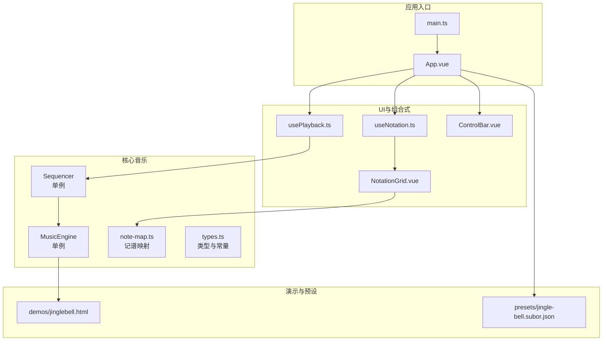
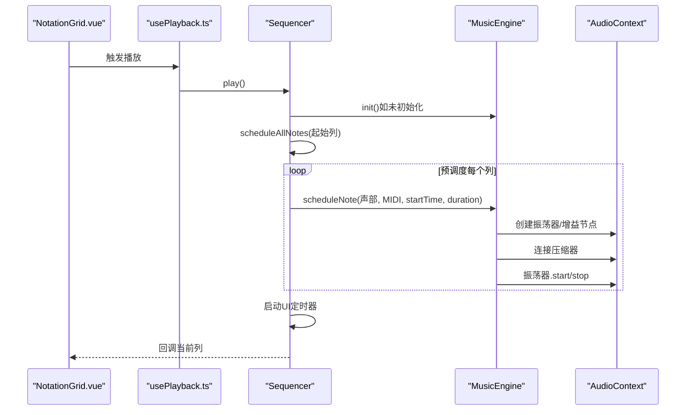
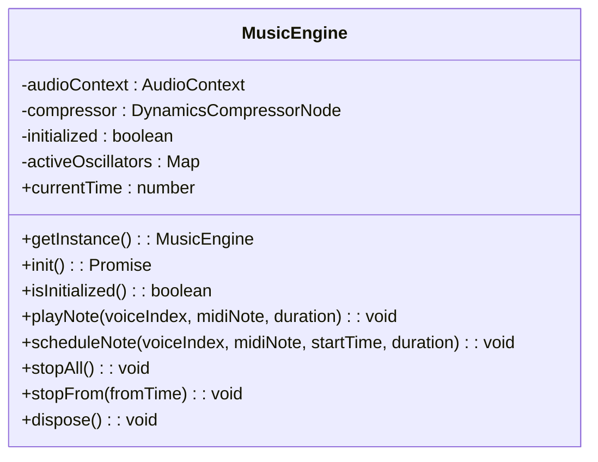
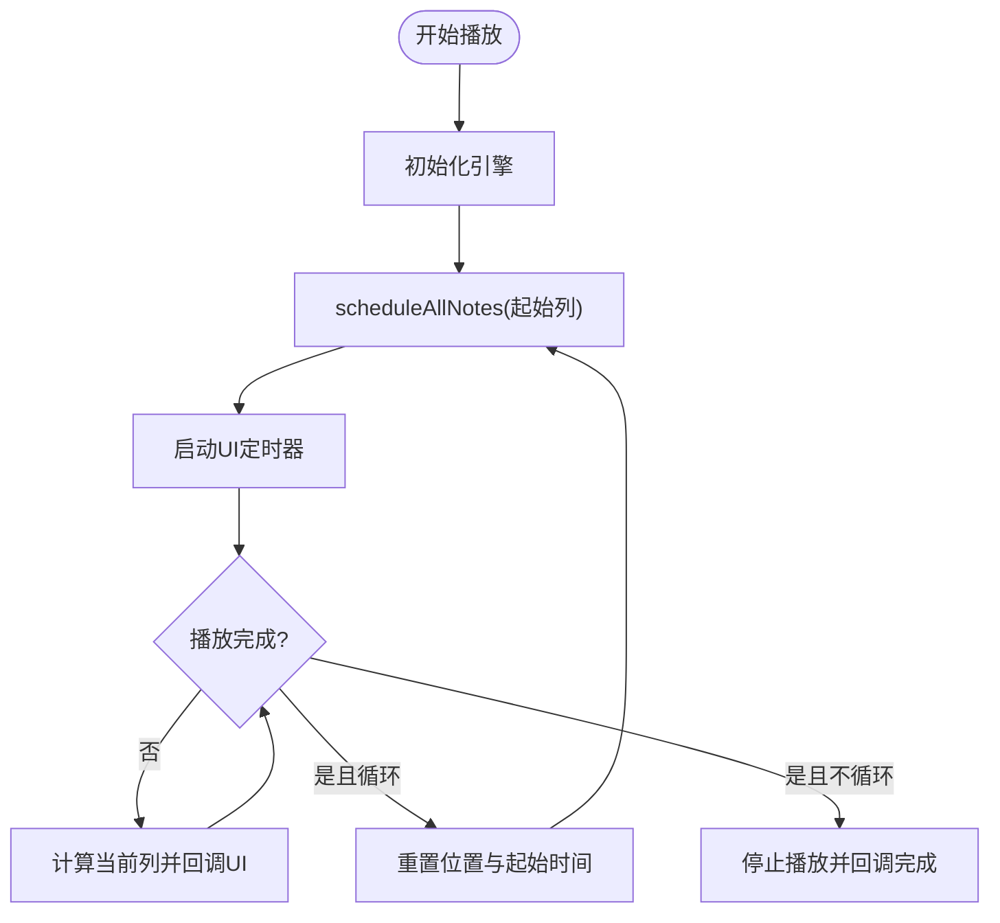
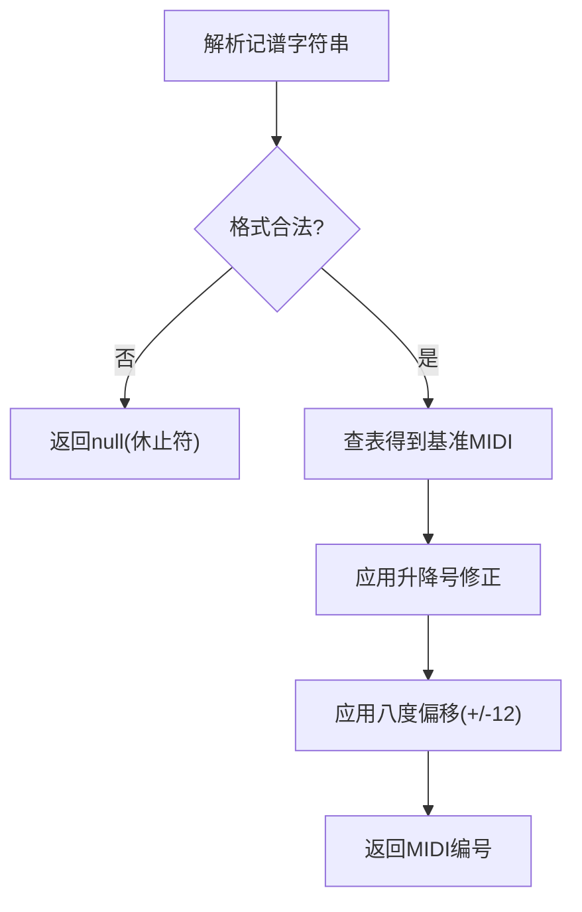
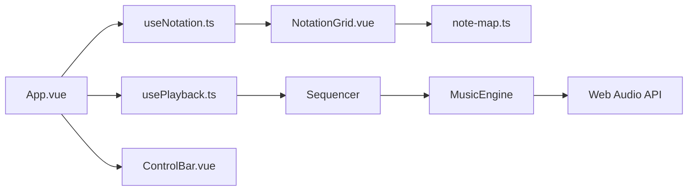

# 音乐引擎架构

<cite>
**本文引用的文件**
- [music-engine.ts](file://src/core/music-engine.ts)
- [sequencer.ts](file://src/core/sequencer.ts)
- [types.ts](file://src/core/types.ts)
- [note-map.ts](file://src/core/note-map.ts)
- [usePlayback.ts](file://src/composables/usePlayback.ts)
- [useNotation.ts](file://src/composables/useNotation.ts)
- [App.vue](file://src/App.vue)
- [NotationGrid.vue](file://src/components/NotationGrid.vue)
- [ControlBar.vue](file://src/components/ControlBar.vue)
- [jinglebell.html](file://demos/jinglebell.html)
- [jingle-bell.subor.json](file://presets/jingle-bell.subor.json)
- [main.ts](file://src/main.ts)
- [package.json](file://package.json)
</cite>

## 目录
1. [简介](#简介)
2. [项目结构](#项目结构)
3. [核心组件](#核心组件)
4. [架构总览](#架构总览)
5. [详细组件分析](#详细组件分析)
6. [依赖关系分析](#依赖关系分析)
7. [性能考量](#性能考量)
8. [故障排查指南](#故障排查指南)
9. [结论](#结论)
10. [附录](#附录)

## 简介
本项目为基于 Web Audio API 的纯前端音乐引擎，目标是实现与经典演示页面 jinglebell.html 一致的音色与调度行为，并在此基础上提供三声部（方波主旋律、方波和弦律、三角波低频）合成、精确时间调度、调号与BPM动态切换、以及完整的记谱输入与播放控制体验。系统采用单例模式管理全局音频资源，通过预调度机制在播放启动时一次性计算所有音符的绝对播放时间，确保播放过程中的稳定与低延迟。

## 项目结构
项目采用 Vue 3 + TypeScript 的前端架构，核心音乐能力集中在 src/core 目录，UI 控制由 Vue 组件与 Composables 提供，演示与预设位于 demos 与 presets 目录。

图表来源
- [main.ts:1-8](file://src/main.ts#L1-L8)
- [App.vue:1-138](file://src/App.vue#L1-L138)
- [music-engine.ts:17-221](file://src/core/music-engine.ts#L17-L221)
- [sequencer.ts:21-354](file://src/core/sequencer.ts#L21-L354)
- [note-map.ts:1-119](file://src/core/note-map.ts#L1-L119)
- [types.ts:1-164](file://src/core/types.ts#L1-L164)
- [usePlayback.ts:1-95](file://src/composables/usePlayback.ts#L1-L95)
- [useNotation.ts:1-116](file://src/composables/useNotation.ts#L1-L116)
- [NotationGrid.vue:1-292](file://src/components/NotationGrid.vue#L1-L292)
- [ControlBar.vue:1-116](file://src/components/ControlBar.vue#L1-L116)
- [jinglebell.html:1-83](file://demos/jinglebell.html#L1-L83)
- [jingle-bell.subor.json:1-106](file://presets/jingle-bell.subor.json#L1-L106)

章节来源
- [main.ts:1-8](file://src/main.ts#L1-L8)
- [App.vue:1-138](file://src/App.vue#L1-L138)
- [music-engine.ts:17-221](file://src/core/music-engine.ts#L17-L221)
- [sequencer.ts:21-354](file://src/core/sequencer.ts#L21-L354)
- [note-map.ts:1-119](file://src/core/note-map.ts#L1-L119)
- [types.ts:1-164](file://src/core/types.ts#L1-L164)
- [usePlayback.ts:1-95](file://src/composables/usePlayback.ts#L1-L95)
- [useNotation.ts:1-116](file://src/composables/useNotation.ts#L1-L116)
- [NotationGrid.vue:1-292](file://src/components/NotationGrid.vue#L1-L292)
- [ControlBar.vue:1-116](file://src/components/ControlBar.vue#L1-L116)
- [jinglebell.html:1-83](file://demos/jinglebell.html#L1-L83)
- [jingle-bell.subor.json:1-106](file://presets/jingle-bell.subor.json#L1-L106)

## 核心组件
- 音乐引擎 MusicEngine：封装 Web Audio API，提供单例访问、初始化、音符调度、停止控制与资源释放。核心特性包括：
  - 单例模式：getInstance 保障全局唯一实例。
  - 预调度播放：scheduleNote 以 AudioContext 绝对时间精确安排振荡器起止。
  - 三声部音色：方波主旋律/和弦律（高、中八度），三角波低频（低八度）。
  - 增益包络：方波使用线性包络，三角波使用微淡出消除点击声。
  - 选择性停止：stopFrom 可终止指定时间之后的音符（保留为工具能力，播放中实时调整当前未使用）。
- 序列器 Sequencer：负责播放状态、BPM/调号变更、UI 定时器与预调度逻辑。
  - 预调度：一次性计算所有音符的绝对时间并调度。
  - 实时调整（2026-08-30 改）：setBpm/setKeySignature 播放中切换时，stopAll 立即丢弃所有声，120ms 防抖后从当前指示器列整体重排。
  - UI 同步：通过回调驱动 NotationGrid 的播放指示。
- 记谱映射 note-map：将简谱字符（含升降号、位于数字之前的八度修饰符）解析为 MIDI 音符编号，并批量转换一列三声部。
- 类型与常量 types：定义声部索引、列结构、BPM/调号、导出格式等。
- 组合式 usePlayback/useNotation：提供播放控制与记谱编辑的响应式接口。
- UI 组件 NotationGrid/ControlBar：提供记谱输入、播放控制与可视化反馈。

章节来源
- [music-engine.ts:17-221](file://src/core/music-engine.ts#L17-L221)
- [sequencer.ts:21-354](file://src/core/sequencer.ts#L21-L354)
- [note-map.ts:1-119](file://src/core/note-map.ts#L1-L119)
- [types.ts:1-164](file://src/core/types.ts#L1-L164)
- [usePlayback.ts:1-95](file://src/composables/usePlayback.ts#L1-L95)
- [useNotation.ts:1-116](file://src/composables/useNotation.ts#L1-L116)
- [NotationGrid.vue:1-292](file://src/components/NotationGrid.vue#L1-L292)
- [ControlBar.vue:1-116](file://src/components/ControlBar.vue#L1-L116)

## 架构总览
系统采用“组合式 + 单例 + 预调度”的架构模式：
- 组合式 useNotation/usePlayback 将业务状态与 UI 解耦，便于测试与复用。
- 单例 MusicEngine/Sequencer 提供全局状态与资源管理。
- 预调度策略在播放启动时一次性计算所有音符的绝对时间，避免播放时的计算开销。

图表来源
- [usePlayback.ts:46-49](file://src/composables/usePlayback.ts#L46-L49)
- [sequencer.ts:144-167](file://src/core/sequencer.ts#L144-L167)
- [sequencer.ts:240-263](file://src/core/sequencer.ts#L240-L263)
- [music-engine.ts:90-150](file://src/core/music-engine.ts#L90-L150)

## 详细组件分析

### 音乐引擎 MusicEngine（单例与Web Audio API集成）
- 单例实现：静态 getInstance 返回唯一实例，避免重复创建 AudioContext。
- 初始化流程：检测并创建 AudioContext，若处于 suspended 状态则等待用户交互恢复；创建 DynamicsCompressorNode 并连接 destination。
- 音符调度：根据声部索引选择波形（方波/三角波）与八度倍率，计算频率并设置振荡器频率；为方波配置线性增益包络，为三角波配置微淡出消除点击声；使用 Map 追踪活跃振荡器，便于选择性停止。
- 停止控制：stopAll 立即停止所有音符；stopFrom 仅停止从指定时间开始的未来音符，避免播放中断。
- 资源管理：dispose 释放压缩器与 AudioContext，重置单例状态。

图表来源
- [music-engine.ts:17-221](file://src/core/music-engine.ts#L17-L221)

章节来源
- [music-engine.ts:17-221](file://src/core/music-engine.ts#L17-L221)

### 序列器 Sequencer（预调度与播放控制）
- 播放状态：stopped/playing/paused，支持循环播放与跳转。
- 预调度策略：计算 noteInterval，一次性调度所有剩余音符；`scheduleAllNotes` 以 engine.currentTime + 0.1 为基准。
- 实时调整（2026-08-30 改）：setBpm/setKeySignature 播放中切换时，`requestPlaybackRestart()` 立即 stopAll 丢弃所有声，120ms 防抖（restartTimer）后 `restartFromCurrentPosition()` 从当前指示器列整体重排，并重置 playbackWallStart（+100ms 与调度基准对齐）。
- UI 定时器：约 50ms 轮询当前列，仅在列号变化时触发回调，避免频繁更新。
- 有效长度：getEffectiveLength 从末尾扫描，找到最后一个非空列，避免在空白列浪费时间。

图表来源
- [sequencer.ts:144-200](file://src/core/sequencer.ts#L144-L200)
- [sequencer.ts:271-313](file://src/core/sequencer.ts#L271-L313)
- [sequencer.ts:240-263](file://src/core/sequencer.ts#L240-L263)

章节来源
- [sequencer.ts:21-354](file://src/core/sequencer.ts#L21-L354)

### 记谱映射 note-map（MIDI音符转换）
- 解析规则：支持升号(#)/降号(b)、位于数字之前的八度修饰符（. 高八度、, 低八度）与简谱数字 1-7，并校验格式合法性。
- 转换逻辑：根据 KeySignature 查表得到基准音符 MIDI 编号，再结合升降号与八度偏移计算最终 MIDI。
- 批量转换：columnToMidi 将单列三声部转换为 [MIDI|null, MIDI|null, MIDI|null]。

图表来源
- [note-map.ts:35-100](file://src/core/note-map.ts#L35-L100)
- [note-map.ts:109-118](file://src/core/note-map.ts#L109-L118)

章节来源
- [note-map.ts:1-119](file://src/core/note-map.ts#L1-L119)

### 类型与常量 types（声部与BPM/调号）
- 声部定义：VoiceIndex 为 0/1/2，分别对应主旋律（方波高八度）、和弦律（方波原八度）、低频（三角波低八度）。
- BPM 列表：包含多档位，默认 90。
- 调号：支持 C/D/F/G/♭B。
- 导出格式：包含版本、标题、描述、BPM、调号与 score 数据。

章节来源
- [types.ts:41-54](file://src/core/types.ts#L41-L54)
- [types.ts:102-117](file://src/core/types.ts#L102-L117)
- [types.ts:119-138](file://src/core/types.ts#L119-L138)
- [types.ts:145-164](file://src/core/types.ts#L145-L164)

### 组合式 usePlayback/useNotation（播放与记谱）
- usePlayback：监听 BPM 与调号变化，委托 Sequencer 执行 setBpm/setKeySignature；提供 play/pause/stop/toggleLoop 等控制方法。
- useNotation：维护 Score 与光标位置，提供覆盖写入、空格插入、回退/删除等记谱编辑操作；loadScore 支持从外部导入并补齐列数。

章节来源
- [usePlayback.ts:1-95](file://src/composables/usePlayback.ts#L1-L95)
- [useNotation.ts:1-116](file://src/composables/useNotation.ts#L1-L116)

### UI 组件 NotationGrid/ControlBar（输入与播放控制）
- NotationGrid：处理键盘导航、按输入字符类型分派的写入行为、输入队列与书写动画；调用 MusicEngine.playNote 实现输入预览；与 Quill 配合实现书写动画。
- ControlBar：提供 BPM/调号选择、播放控制、循环切换、导入/导出按钮。

章节来源
- [NotationGrid.vue:1-292](file://src/components/NotationGrid.vue#L1-L292)
- [ControlBar.vue:1-116](file://src/components/ControlBar.vue#L1-L116)

## 依赖关系分析
- 组件耦合：
  - App.vue 通过 usePlayback/useNotation 与核心模块解耦。
  - NotationGrid.vue 依赖 note-map.ts 与 MusicEngine 单例。
  - Sequencer 依赖 MusicEngine 单例与 note-map。
- 外部依赖：
  - Web Audio API（AudioContext/DynamicsCompressorNode/OscillatorNode/GainNode）。
  - Vue 3 生态（组合式 API、响应式系统）。
- 兼容性与一致性：
  - 严格遵循 jinglebell.html 的增益调度与八度分配策略，确保音色与时间行为一致。

图表来源
- [App.vue:1-138](file://src/App.vue#L1-L138)
- [usePlayback.ts:1-95](file://src/composables/usePlayback.ts#L1-L95)
- [useNotation.ts:1-116](file://src/composables/useNotation.ts#L1-L116)
- [NotationGrid.vue:1-292](file://src/components/NotationGrid.vue#L1-L292)
- [note-map.ts:1-119](file://src/core/note-map.ts#L1-L119)
- [sequencer.ts:21-354](file://src/core/sequencer.ts#L21-L354)
- [music-engine.ts:17-221](file://src/core/music-engine.ts#L17-L221)

章节来源
- [App.vue:1-138](file://src/App.vue#L1-L138)
- [usePlayback.ts:1-95](file://src/composables/usePlayback.ts#L1-L95)
- [useNotation.ts:1-116](file://src/composables/useNotation.ts#L1-L116)
- [NotationGrid.vue:1-292](file://src/components/NotationGrid.vue#L1-L292)
- [note-map.ts:1-119](file://src/core/note-map.ts#L1-L119)
- [sequencer.ts:21-354](file://src/core/sequencer.ts#L21-L354)
- [music-engine.ts:17-221](file://src/core/music-engine.ts#L17-L221)

## 性能考量
- 预调度策略：在播放启动时一次性计算并调度所有音符，避免播放时的计算开销，降低抖动风险。
- 实时变速/变调的丢弃重排：setBpm/setKeySignature 播放中变更时立即 stopAll 丢弃所有声，120ms 防抖合并连点后从当前指示器列整体重排，杜绝多版本叠加混响并保持音画同步。
- 资源复用：单例模式避免重复创建 AudioContext 与压缩器；压缩器作为主输出统一处理动态范围。
- UI 定时器：约 50ms 轮询，仅在列号变化时触发回调，降低 UI 更新频率。
- 三角波优化：对三角波使用微淡出消除点击声，提升听感质量。
- 兼容性：严格遵循 jinglebell.html 的增益与八度策略，确保在不同浏览器与设备上的一致表现。

## 故障排查指南
- 初始化失败（AudioContext suspended）：确保在用户手势后调用 init 或 play；检查浏览器权限与音频输出。
- 播放卡顿或延迟：确认未在播放中频繁创建/销毁振荡器；避免在 UI 定时器中执行重任务。
- BPM/调号切换异常（混响、错位）：确认 setBpm/setKeySignature 命中 playing 时走 requestPlaybackRestart（stopAll + 防抖重启）；检查防抖定时器是否在 pause()/stop() 清除；确认 restartFromCurrentPosition 后 playbackWallStart 与调度基准对齐（约 100ms）。
- 三角波点击声：确认三角波增益包络的淡出时间与起止时间设置合理。
- 调号切换不生效：确认 setKeySignature 正确更新内部调号并从当前列重新调度；检查 note-map 映射。

章节来源
- [music-engine.ts:41-60](file://src/core/music-engine.ts#L41-L60)
- [sequencer.ts:84-115](file://src/core/sequencer.ts#L84-L115)
- [sequencer.ts:70-82](file://src/core/sequencer.ts#L70-L82)
- [music-engine.ts:117-149](file://src/core/music-engine.ts#L117-L149)

## 结论
本音乐引擎以单例模式管理全局音频资源，通过与 jinglebell.html 一致的预调度与增益策略，实现了稳定的三声部合成与精确的时间调度。配合 Vue 组合式 API 与 UI 组件，提供了良好的记谱输入与播放控制体验。系统在性能与兼容性方面进行了针对性优化，适合在浏览器端实现高质量的纯前端音乐创作与播放。

## 附录

### 与 jinglebell.html 的兼容性设计
- 增益调度：方波采用线性包络，三角波采用微淡出，与演示页面一致。
- 八度分配：主旋律×2（高八度）、和弦律×1（原八度）、低频×0.5（低八度）。
- 音符时长：方波填满整个格子间隔，三角波略短以匹配演示页面比例。

章节来源
- [music-engine.ts:100-149](file://src/core/music-engine.ts#L100-L149)
- [sequencer.ts:244-245](file://src/core/sequencer.ts#L244-L245)
- [jinglebell.html:23-25](file://demos/jinglebell.html#L23-L25)

### 音频质量优化策略
- 使用 DynamicsCompressorNode 作为主输出，统一动态范围。
- 三角波微淡出消除点击声，提升听感。
- 预调度与选择性停止，降低播放时的抖动与卡顿。
- 严格的时间锚点与线性包络，确保音符起止平滑。

章节来源
- [music-engine.ts:54-57](file://src/core/music-engine.ts#L54-L57)
- [music-engine.ts:117-139](file://src/core/music-engine.ts#L117-L139)

### 初始化流程与API使用示例
- 初始化：调用 MusicEngine.getInstance().init() 或在播放前自动触发。
- 播放：usePlayback.play() → Sequencer.play() → scheduleAllNotes() → 启动 UI 定时器。
- 输入预览：NotationGrid.onNoteInput → MusicEngine.playNote() → 即时播放当前音符。
- 导入/导出：useImportExport.importScore()/exportScore()，数据格式包含版本、标题、BPM、调号与 score。

章节来源
- [music-engine.ts:41-60](file://src/core/music-engine.ts#L41-L60)
- [usePlayback.ts:46-49](file://src/composables/usePlayback.ts#L46-L49)
- [NotationGrid.vue:102-110](file://src/components/NotationGrid.vue#L102-L110)
- [types.ts:145-164](file://src/core/types.ts#L145-L164)

### 三个声部的音色设计与八度音域分配
- 主旋律（方波，高八度）：明亮、突出，适合旋律线条。
- 和弦律（方波，原八度）：与主旋律同八度，形成和声支撑。
- 低频（三角波，低八度）：温暖、厚实，提供低频基底。

章节来源
- [music-engine.ts:100-108](file://src/core/music-engine.ts#L100-L108)
- [types.ts:41-54](file://src/core/types.ts#L41-L54)

### 精确的时间调度机制
- 绝对时间：所有音符在 AudioContext 时间轴上设置精确的 start/stop 时间。
- noteInterval：每格时长（秒），BPM 决定间隔。
- 预调度：一次性计算所有音符的绝对时间，避免播放时的计算延迟。
- 有效长度：仅调度实际包含音符的列，避免空白列浪费。

章节来源
- [sequencer.ts:327-339](file://src/core/sequencer.ts#L327-L339)
- [sequencer.ts:240-263](file://src/core/sequencer.ts#L240-L263)
- [sequencer.ts:223-232](file://src/core/sequencer.ts#L223-L232)

### 预设文件与示例
- jingle-bell.subor.json：包含经典圣诞歌曲的简谱数据，BPM 与调号示例。
- jinglebell.html：演示页面，展示与本引擎一致的增益与八度策略。

章节来源
- [jingle-bell.subor.json:1-106](file://presets/jingle-bell.subor.json#L1-L106)
- [jinglebell.html:1-83](file://demos/jinglebell.html#L1-L83)