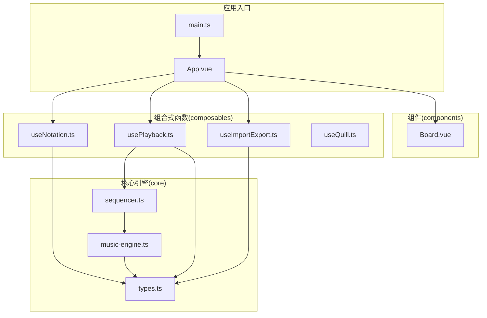
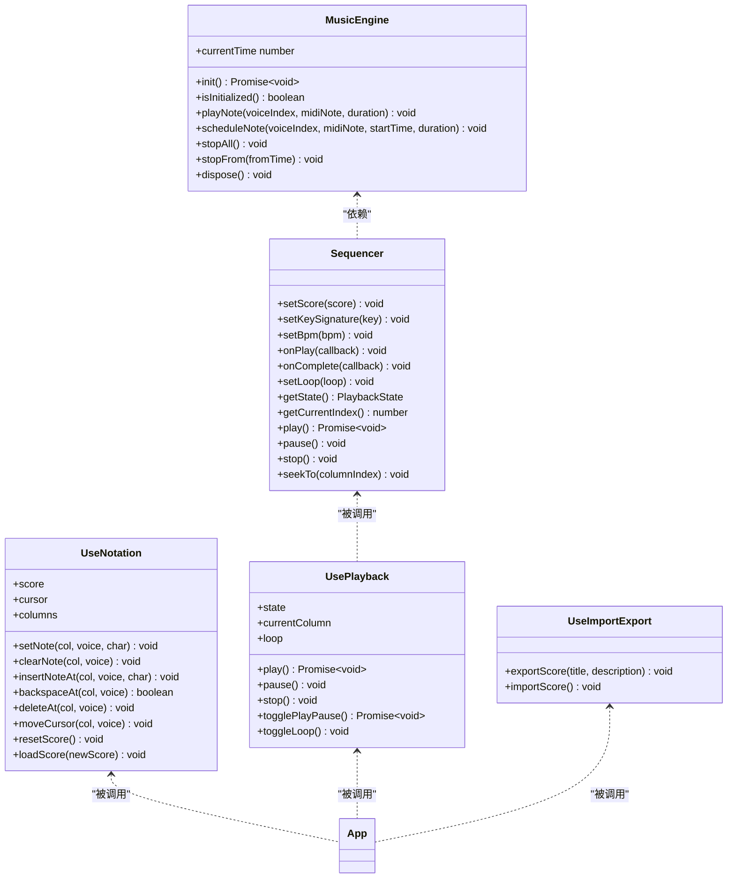
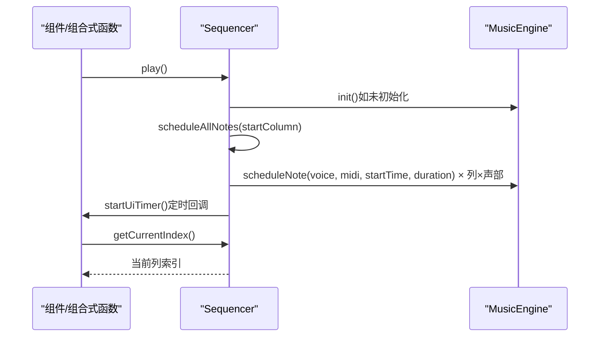
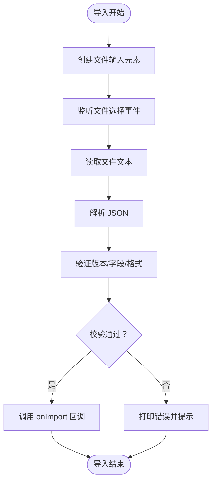
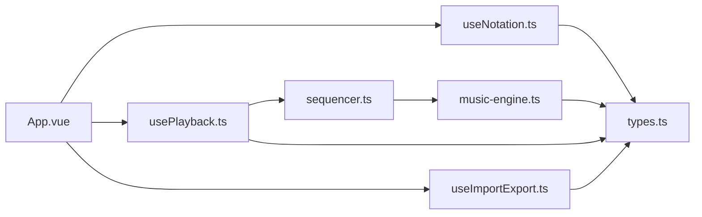

# 模块化设计

<cite>
**本文引用的文件**
- [music-engine.ts](file://src/core/music-engine.ts)
- [sequencer.ts](file://src/core/sequencer.ts)
- [types.ts](file://src/core/types.ts)
- [useNotation.ts](file://src/composables/useNotation.ts)
- [usePlayback.ts](file://src/composables/usePlayback.ts)
- [useImportExport.ts](file://src/composables/useImportExport.ts)
- [useQuill.ts](file://src/composables/useQuill.ts)
- [App.vue](file://src/App.vue)
- [Board.vue](file://src/components/Board.vue)
- [main.ts](file://src/main.ts)
- [package.json](file://package.json)
</cite>

## 目录
1. [简介](#简介)
2. [项目结构](#项目结构)
3. [核心组件](#核心组件)
4. [架构总览](#架构总览)
5. [详细组件分析](#详细组件分析)
6. [依赖分析](#依赖分析)
7. [性能考虑](#性能考虑)
8. [故障排除指南](#故障排除指南)
9. [结论](#结论)
10. [附录](#附录)

## 简介
本设计文档围绕 SUBOR Music Board 的模块化架构展开，系统性阐述核心引擎模块（music-engine、sequencer）、组合式函数模块（useNotation、usePlayback、useImportExport）以及组件模块之间的职责分工与协作方式。文档重点解释：
- 核心引擎模块的设计理念与职责边界
- 组合式函数模块如何通过复用机制实现高内聚低耦合
- 模块间的依赖关系与接口契约
- 模块化带来的代码复用、测试便利与维护性提升
- 模块接口规范与最佳实践

## 项目结构
项目采用“按职责分层”的模块组织方式：
- core：核心引擎与类型定义，提供底层音频合成与播放调度能力
- composables：组合式函数模块，封装业务逻辑与状态管理
- components：UI 组件，负责展示与交互
- assets/style：静态资源与样式
- 根目录：入口文件与配置

图表来源
- [main.ts:1-8](file://src/main.ts#L1-L8)
- [App.vue:1-138](file://src/App.vue#L1-L138)
- [music-engine.ts:1-221](file://src/core/music-engine.ts#L1-L221)
- [sequencer.ts:1-354](file://src/core/sequencer.ts#L1-L354)
- [types.ts:1-164](file://src/core/types.ts#L1-L164)
- [useNotation.ts:1-116](file://src/composables/useNotation.ts#L1-L116)
- [usePlayback.ts:1-95](file://src/composables/usePlayback.ts#L1-L95)
- [useImportExport.ts:1-138](file://src/composables/useImportExport.ts#L1-L138)
- [useQuill.ts:1-39](file://src/composables/useQuill.ts#L1-L39)
- [Board.vue:1-47](file://src/components/Board.vue#L1-L47)

章节来源
- [main.ts:1-8](file://src/main.ts#L1-L8)
- [App.vue:1-138](file://src/App.vue#L1-L138)

## 核心组件
本节聚焦核心引擎模块与类型系统，阐明其职责与边界。

- 音乐引擎（MusicEngine）
  - 职责：封装 Web Audio API，提供音符播放与预调度能力；管理音频上下文、压缩器与活跃振荡器集合；支持立即停止与选择性停止（用于 BPM/调号变更时的平滑过渡）
  - 关键特性：单例模式、独立于第三方库、与经典示例保持一致的增益包络与波形配置
- 序列器（Sequencer）
  - 职责：根据乐谱与配置进行播放调度；管理播放状态、循环、UI 定时器；在播放中动态调整 BPM 与调号时，仅停止未来音符，避免卡顿
  - 关键特性：预调度模式、有效长度计算、UI 回调与完成回调

章节来源
- [music-engine.ts:1-221](file://src/core/music-engine.ts#L1-L221)
- [sequencer.ts:1-354](file://src/core/sequencer.ts#L1-L354)
- [types.ts:1-164](file://src/core/types.ts#L1-L164)

## 架构总览
模块化架构通过清晰的职责划分与稳定的接口契约实现解耦：
- 核心引擎模块：纯功能层，不依赖 UI 或框架
- 组合式函数模块：业务逻辑层，封装状态与副作用，向组件暴露稳定 API
- 组件模块：视图层，仅处理渲染与事件转发
- 类型系统：跨模块共享的数据契约与约束

图表来源
- [music-engine.ts:1-221](file://src/core/music-engine.ts#L1-L221)
- [sequencer.ts:1-354](file://src/core/sequencer.ts#L1-L354)
- [useNotation.ts:1-116](file://src/composables/useNotation.ts#L1-L116)
- [usePlayback.ts:1-95](file://src/composables/usePlayback.ts#L1-L95)
- [useImportExport.ts:1-138](file://src/composables/useImportExport.ts#L1-L138)

## 详细组件分析

### 核心引擎模块（music-engine、sequencer）
- 设计理念
  - 音乐引擎采用原生 Web Audio API，避免外部依赖，确保可移植性与可控性
  - 序列器采用“预调度”模式，一次性计算所有音符的绝对时间，UI 通过独立定时器更新，降低播放时的计算开销
- 数据流与控制流
  - 序列器根据 BPM 与列间隔计算每个音符的起止时间，并调用音乐引擎进行调度
  - 音乐引擎为每个音符创建独立振荡器与增益节点，按波形类型应用不同的增益包络
- 关键流程（播放启动）

图表来源
- [sequencer.ts:144-167](file://src/core/sequencer.ts#L144-L167)
- [music-engine.ts:90-150](file://src/core/music-engine.ts#L90-L150)

章节来源
- [music-engine.ts:1-221](file://src/core/music-engine.ts#L1-L221)
- [sequencer.ts:1-354](file://src/core/sequencer.ts#L1-L354)

### 组合式函数模块（useNotation、usePlayback、useImportExport）
- useNotation：记谱编辑状态与操作
  - 提供乐谱数组、光标位置、插入/覆盖/删除/清空等操作
  - 通过响应式数据暴露给 UI 组件，支持批量加载与重置
- usePlayback：播放控制与状态同步
  - 将组件中的 BPM、调号与乐谱数据绑定到序列器
  - 监听外部变化（BPM/调号）并调用序列器进行实时调整
  - 暴露播放/暂停/停止/循环切换等 API
- useImportExport：导入导出与数据校验
  - 导出：生成标准 JSON 结构，包含版本、标题、描述、BPM、调号与乐谱
  - 导入：读取文件、解析 JSON、严格校验字段与格式，回填到应用状态

图表来源
- [useImportExport.ts:52-79](file://src/composables/useImportExport.ts#L52-L79)
- [useImportExport.ts:84-131](file://src/composables/useImportExport.ts#L84-L131)

章节来源
- [useNotation.ts:1-116](file://src/composables/useNotation.ts#L1-L116)
- [usePlayback.ts:1-95](file://src/composables/usePlayback.ts#L1-L95)
- [useImportExport.ts:1-138](file://src/composables/useImportExport.ts#L1-L138)

### 组件模块与应用集成
- App.vue 作为顶层容器，聚合三个组合式函数的状态与行为，向下传递给 UI 组件
- Board.vue 提供统一的布局容器，承载主要内容区域
- 组件之间通过 props 与事件进行松耦合通信，组合式函数负责状态与副作用

章节来源
- [App.vue:1-138](file://src/App.vue#L1-L138)
- [Board.vue:1-47](file://src/components/Board.vue#L1-L47)

## 依赖分析
- 模块内聚与耦合
  - 核心引擎模块内聚度高，职责单一，仅关注音频合成与调度
  - 组合式函数模块内聚度高，封装业务逻辑与状态，向组件暴露稳定 API
  - 组件模块仅负责渲染与事件转发，不直接访问核心引擎
- 外部依赖
  - Vue 3（组合式 API、响应式系统）
  - Web Audio API（原生音频）
  - 无第三方音频库依赖，降低运行时复杂度与打包体积
- 依赖方向
  - 组合式函数依赖核心引擎与类型系统
  - 组件依赖组合式函数提供的状态与方法
  - 应用入口依赖根组件

图表来源
- [App.vue:1-138](file://src/App.vue#L1-L138)
- [useNotation.ts:1-116](file://src/composables/useNotation.ts#L1-L116)
- [usePlayback.ts:1-95](file://src/composables/usePlayback.ts#L1-L95)
- [useImportExport.ts:1-138](file://src/composables/useImportExport.ts#L1-L138)
- [sequencer.ts:1-354](file://src/core/sequencer.ts#L1-L354)
- [music-engine.ts:1-221](file://src/core/music-engine.ts#L1-L221)
- [types.ts:1-164](file://src/core/types.ts#L1-L164)

章节来源
- [package.json:1-25](file://package.json#L1-L25)

## 性能考虑
- 预调度模式：序列器在播放启动时一次性计算并调度所有音符，减少播放时的计算压力
- 选择性停止：BPM/调号变更时仅停止未来音符，避免当前音符被中断造成卡顿
- 有效长度计算：跳过空白列，缩短播放路径，提高效率
- 增益包络优化：针对不同波形采用合适的包络策略，平衡音质与 CPU 占用
- UI 定时器：以固定间隔轮询播放进度，避免高频重绘

## 故障排除指南
- 音频未播放
  - 确认音乐引擎已初始化且处于可用状态
  - 检查浏览器是否需要用户手势唤醒音频上下文
- BPM/调号变更卡顿
  - 确保变更时使用序列器的实时调整接口，避免重复调度
- 导入失败
  - 检查文件格式是否符合导出规范，确认版本号与字段完整性
- 光标/编辑异常
  - 确认 useNotation 的光标范围与列数限制，避免越界操作

章节来源
- [music-engine.ts:41-64](file://src/core/music-engine.ts#L41-L64)
- [sequencer.ts:84-115](file://src/core/sequencer.ts#L84-L115)
- [useImportExport.ts:63-76](file://src/composables/useImportExport.ts#L63-L76)
- [useNotation.ts:66-71](file://src/composables/useNotation.ts#L66-L71)

## 结论
本项目通过模块化设计实现了高内聚低耦合：
- 核心引擎模块专注于音频合成与调度，具备良好的可测试性与可移植性
- 组合式函数模块封装业务逻辑与状态，便于复用与单元测试
- 组件模块与业务逻辑解耦，提升维护性与可扩展性
- 类型系统提供强约束，减少跨模块耦合带来的风险
建议在后续迭代中持续完善接口契约文档与自动化测试，进一步提升模块化收益。

## 附录
- 模块接口规范
  - 核心引擎：提供初始化、音符调度、停止控制与资源释放接口
  - 序列器：提供播放控制、状态查询、回调注册与实时调整接口
  - useNotation：提供乐谱编辑、光标移动、批量加载与重置接口
  - usePlayback：提供播放控制、状态同步与循环切换接口
  - useImportExport：提供导入导出与数据校验接口
- 最佳实践
  - 保持组合式函数的纯度与可测试性，避免在其中引入 DOM 操作
  - 通过类型系统约束输入输出，减少运行时错误
  - 对外部依赖（如音频 API）进行容错处理与降级方案设计
  - 在组件中仅进行渲染与事件转发，避免直接访问核心引擎