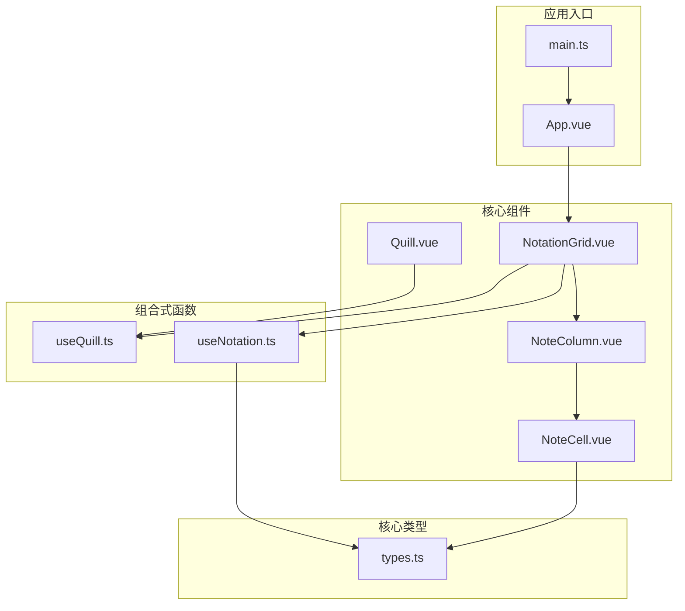
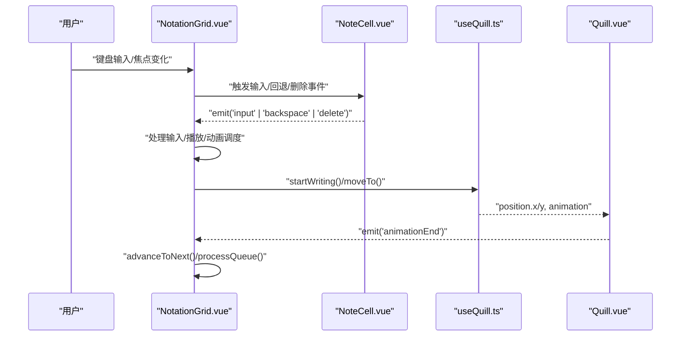
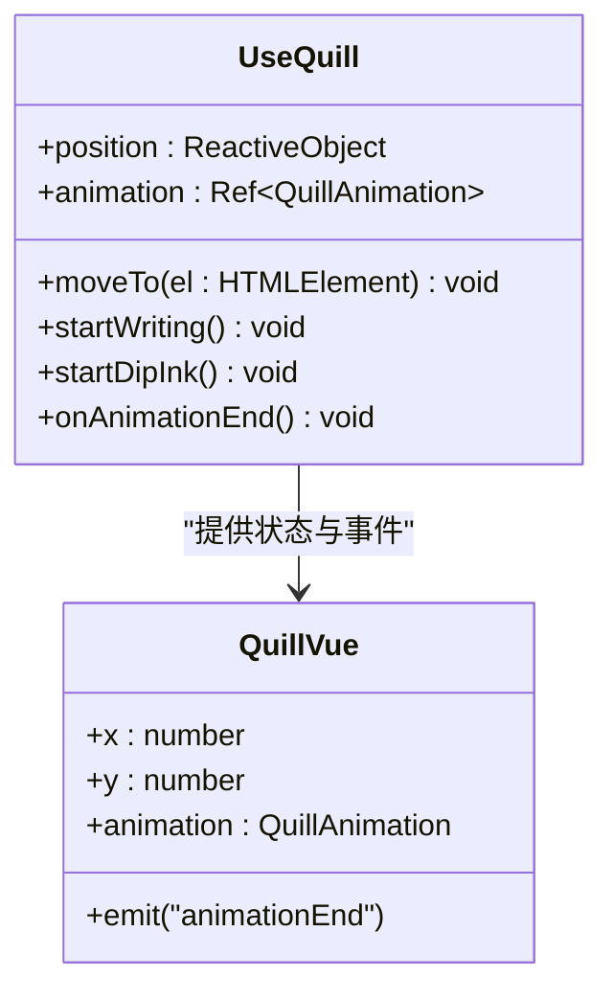
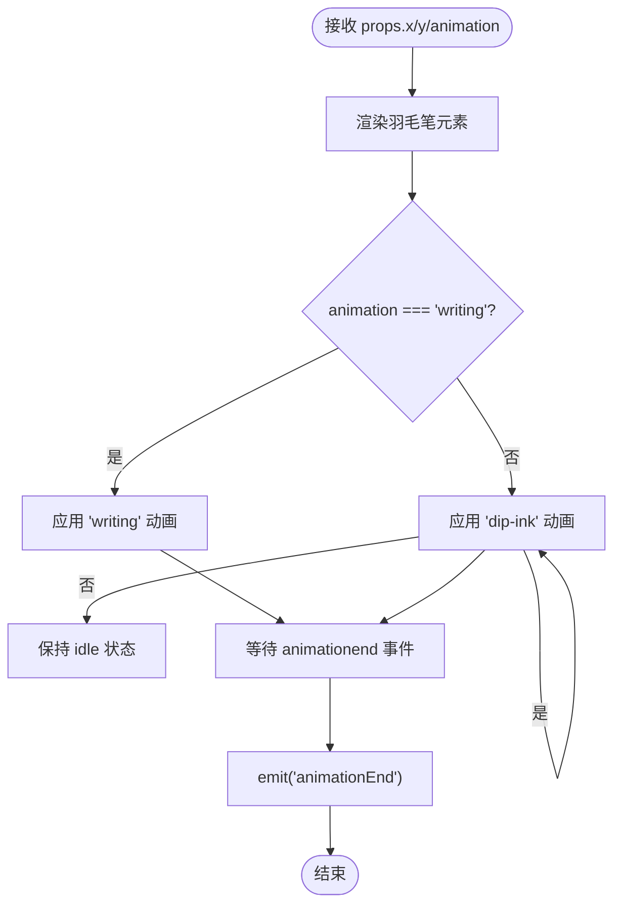
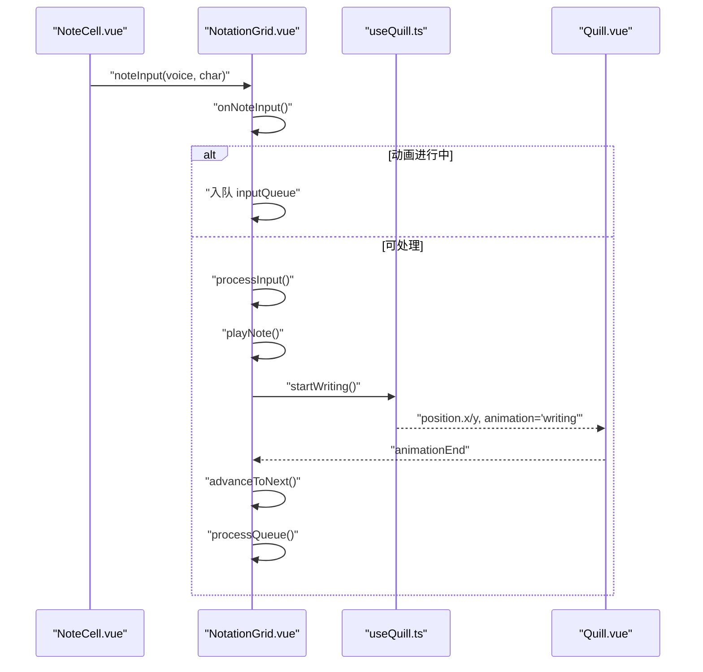
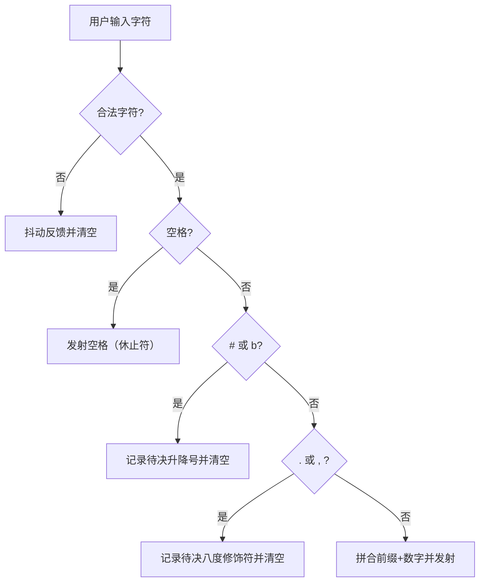
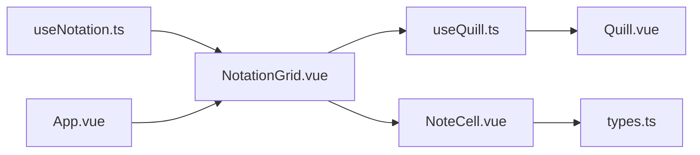

# 富文本编辑器组合式函数

<cite>
**本文引用的文件**
- [useQuill.ts](file://src/composables/useQuill.ts)
- [Quill.vue](file://src/components/Quill.vue)
- [NotationGrid.vue](file://src/components/NotationGrid.vue)
- [NoteCell.vue](file://src/components/NoteCell.vue)
- [types.ts](file://src/core/types.ts)
- [useNotation.ts](file://src/composables/useNotation.ts)
- [App.vue](file://src/App.vue)
- [main.ts](file://main.ts)
- [style.css](file://src/style.css)
</cite>

## 目录
1. [简介](#简介)
2. [项目结构](#项目结构)
3. [核心组件](#核心组件)
4. [架构总览](#架构总览)
5. [详细组件分析](#详细组件分析)
6. [依赖关系分析](#依赖关系分析)
7. [性能考虑](#性能考虑)
8. [故障排除指南](#故障排除指南)
9. [结论](#结论)
10. [附录](#附录)

## 简介
本文件系统性解析富文本编辑器组合式函数 useQuill 的实现机制，涵盖以下关键主题：
- Quill 编辑器实例管理：通过组合式函数集中管理位置与动画状态
- 内容同步：与记谱输入组件的联动，确保羽毛笔位置与当前输入焦点一致
- 格式化控制：通过 CSS 动画与类名映射实现书写与蘸墨效果
- 事件处理机制：从输入组件到组合式函数再到视图组件的事件链路
- 内容存储策略：与乐谱数据模型的解耦与协作
- API 设计原理与使用方法：暴露简洁的 API 并提供扩展点
- 性能优化建议：动画合成、will-change、过渡与队列缓冲
- 与其他组件的集成指导与扩展方法

## 项目结构
该仓库采用“组合式函数 + 组件”分层设计，useQuill 作为组合式函数被多个业务组件复用，形成清晰的关注点分离。

**图表来源**
- [App.vue:104-117](file://src/App.vue#L104-L117)
- [NotationGrid.vue:53-54](file://src/components/NotationGrid.vue#L53-L54)
- [Quill.vue:1-12](file://src/components/Quill.vue#L1-L12)
- [useQuill.ts:1-39](file://src/composables/useQuill.ts#L1-L39)
- [useNotation.ts:15-116](file://src/composables/useNotation.ts#L15-L116)
- [types.ts:1-164](file://src/core/types.ts#L1-L164)

**章节来源**
- [App.vue:102-138](file://src/App.vue#L102-L138)
- [main.ts:1-8](file://src/main.ts#L1-L8)

## 核心组件
- useQuill：提供位置与动画状态管理，负责根据输入元素计算羽毛笔位置并触发相应动画
- Quill.vue：展示层组件，接收位置与动画状态，渲染羽毛笔并处理动画结束事件
- NotationGrid.vue：网格输入容器，协调输入、播放、动画与光标移动
- NoteCell.vue：单个音符输入单元，负责字符合法性校验、修饰符拼接与事件发射
- useNotation：乐谱数据模型与光标管理，提供设置、插入、删除等操作
- types：记谱输入的字符规范、正则校验与显示解析

**章节来源**
- [useQuill.ts:5-39](file://src/composables/useQuill.ts#L5-L39)
- [Quill.vue:1-65](file://src/components/Quill.vue#L1-L65)
- [NotationGrid.vue:53-249](file://src/components/NotationGrid.vue#L53-L249)
- [NoteCell.vue:68-178](file://src/components/NoteCell.vue#L68-L178)
- [useNotation.ts:15-116](file://src/composables/useNotation.ts#L15-L116)
- [types.ts:21-96](file://src/core/types.ts#L21-L96)

## 架构总览
useQuill 作为组合式函数，被 NotationGrid 与 Quill 展示组件共同消费，形成“状态管理 → 视图渲染 → 事件驱动”的闭环。

**图表来源**
- [NotationGrid.vue:113-156](file://src/components/NotationGrid.vue#L113-L156)
- [useQuill.ts:9-29](file://src/composables/useQuill.ts#L9-L29)
- [Quill.vue:10-24](file://src/components/Quill.vue#L10-L24)

## 详细组件分析

### useQuill 组合式函数
- 职责
  - 维护羽毛笔位置（响应式对象）
  - 维护动画状态（idle/writing/dipInk）
  - 提供 moveTo、startWriting、startDipInk、onAnimationEnd 等 API
- 数据结构与复杂度
  - position：响应式对象，读取 O(1)，写入 O(1)
  - animation：ref 引用，读写 O(1)
- 依赖关系
  - 依赖浏览器 DOM API（getBoundingClientRect）进行位置计算
  - 与 Quill.vue 通过 props/emit 进行状态与事件传递
- 错误处理
  - moveTo 接收任意 HTMLElement，需确保目标元素存在且可见
- 性能特性
  - 使用响应式对象减少不必要的重渲染
  - 动画结束回调将状态重置为 idle，避免持续渲染

**图表来源**
- [useQuill.ts:5-39](file://src/composables/useQuill.ts#L5-L39)
- [Quill.vue:4-12](file://src/components/Quill.vue#L4-L12)

**章节来源**
- [useQuill.ts:1-39](file://src/composables/useQuill.ts#L1-L39)

### Quill.vue 展示组件
- 职责
  - 根据传入的位置与动画状态渲染羽毛笔
  - 基于 CSS 动画实现书写与蘸墨效果
  - 在动画结束时向父组件发出事件
- 关键点
  - 通过 :class 动态绑定 writing/dip-ink
  - 使用 @animationend 监听动画结束
  - 固定定位与 will-change 优化动画性能

**图表来源**
- [Quill.vue:15-24](file://src/components/Quill.vue#L15-L24)
- [Quill.vue:41-64](file://src/components/Quill.vue#L41-L64)

**章节来源**
- [Quill.vue:1-65](file://src/components/Quill.vue#L1-L65)

### NotationGrid.vue 集成与调度
- 职责
  - 管理输入队列，保证动画期间的输入有序处理
  - 根据输入字符类型决定写入行为（音符/延音线覆盖，空格插入）
  - 协调播放、动画与光标移动
- 关键流程
  - onNoteInput：入队或直接处理
  - processInput：写入数据、播放声音、触发书写动画
  - onQuillAnimationEnd：动画结束回调，推进到下一格并处理队列
  - onCellFocus：同步光标并更新羽毛笔位置
- 事件链
  - NoteCell -> NotationGrid -> useQuill -> Quill.vue -> NotationGrid

**图表来源**
- [NotationGrid.vue:113-156](file://src/components/NotationGrid.vue#L113-L156)
- [useQuill.ts:17-19](file://src/composables/useQuill.ts#L17-L19)
- [Quill.vue:23](file://src/components/Quill.vue#L23)

**章节来源**
- [NotationGrid.vue:53-249](file://src/components/NotationGrid.vue#L53-L249)

### NoteCell.vue 输入与格式化
- 职责
  - 验证单字符合法性（1-7、#、b、.、,、空格）
  - 支持前缀（升降号与八度修饰符）与数字拼接
  - 控制 maxlength 与显示值，聚焦时显示完整值
- 关键点
  - 使用 computed 动态计算显示值与 maxlength
  - 通过 shake 动画提示非法输入
  - 发射 input/backspace/delete/focus 事件给父组件

**图表来源**
- [NoteCell.vue:68-115](file://src/components/NoteCell.vue#L68-L115)
- [types.ts:77-96](file://src/core/types.ts#L77-L96)

**章节来源**
- [NoteCell.vue:1-278](file://src/components/NoteCell.vue#L1-L278)
- [types.ts:21-96](file://src/core/types.ts#L21-L96)

### useNotation 与数据模型
- 职责
  - 维护乐谱二维数组（列×声部）
  - 提供 set/clear/insert/backspace/delete/moveCursor/loadScore 等操作
- 关键点
  - 使用 reactive 包裹数据，readonly 对外暴露
  - insert 模式右推，backspaceAt 模式左移填补
  - loadScore 限制列数并补齐空白列

**章节来源**
- [useNotation.ts:15-116](file://src/composables/useNotation.ts#L15-L116)
- [types.ts:56-78](file://src/core/types.ts#L56-L78)

### 类型与格式化规则
- 字符合法性
  - 单字符：1-7、#、b、.、,、空格
  - 完整值：[升降号?][八度修饰符?][1-7]，允许空串与空格
- 显示解析
  - parseNoteValue：解析显示文本与八度 CSS 类
- 八度修饰符
  - . 高音（s1），, 低音（s-1），仅支持一级

**章节来源**
- [types.ts:77-96](file://src/core/types.ts#L77-L96)
- [types.ts:21-39](file://src/core/types.ts#L21-L39)

## 依赖关系分析
- 组件耦合
  - NotationGrid 依赖 useQuill 与 useNotation
  - Quill.vue 依赖 useQuill 的状态与事件
  - NoteCell.vue 依赖 types 的校验与解析
- 外部依赖
  - 浏览器 DOM API（getBoundingClientRect）
  - Vue 响应式系统（ref/reactive）

**图表来源**
- [useQuill.ts:1-39](file://src/composables/useQuill.ts#L1-L39)
- [Quill.vue:1-12](file://src/components/Quill.vue#L1-L12)
- [useNotation.ts:15-116](file://src/composables/useNotation.ts#L15-L116)
- [NotationGrid.vue:53-54](file://src/components/NotationGrid.vue#L53-L54)
- [NoteCell.vue:3](file://src/components/NoteCell.vue#L3)
- [types.ts:1-164](file://src/core/types.ts#L1-L164)
- [App.vue:104-117](file://src/App.vue#L104-L117)

**章节来源**
- [App.vue:102-138](file://src/App.vue#L102-L138)

## 性能考虑
- 动画优化
  - 使用 animation-composition: add 实现动画叠加
  - will-change: left, top 与过渡属性提升羽毛笔移动性能
  - CSS 动画优于 JS 动画，减少主线程压力
- 渲染优化
  - 响应式对象仅在必要时触发更新
  - 队列缓冲避免动画期间的重复渲染
- 事件处理
  - 忽略键盘长按重复事件，防止焦点切换过快
  - 使用 nextTick 与 requestAnimationFrame 保证 DOM 更新时机

**章节来源**
- [Quill.vue:37-38](file://src/components/Quill.vue#L37-L38)
- [NotationGrid.vue:200-204](file://src/components/NotationGrid.vue#L200-L204)
- [NotationGrid.vue:143-148](file://src/components/NotationGrid.vue#L143-L148)

## 故障排除指南
- 羽毛笔不跟随焦点移动
  - 检查 getActiveInput 是否返回 INPUT 元素
  - 确认 moveTo 调用时机（如 onCellFocus 后使用 nextTick）
- 动画不触发或提前结束
  - 确认 animationEnd 事件正确发出与接收
  - 检查 animation 值是否被意外重置
- 输入无效字符
  - NoteCell 对非法字符会触发 shake 动画并清空
  - 确保输入字符符合 NOTE_CHAR_REGEX
- 输入行为异常
  - 确认按输入字符类型分派的写入逻辑正确
  - 检查 backspaceAt 与 deleteAt 的分支逻辑

**章节来源**
- [NotationGrid.vue:75-81](file://src/components/NotationGrid.vue#L75-L81)
- [Quill.vue:23](file://src/components/Quill.vue#L23)
- [NoteCell.vue:72-79](file://src/components/NoteCell.vue#L72-L79)
- [types.ts:77-96](file://src/core/types.ts#L77-L96)

## 结论
useQuill 通过极简的组合式函数设计，将位置与动画状态抽象为可复用的能力，与记谱输入组件形成高内聚、低耦合的协作关系。配合输入校验、动画合成与队列缓冲，实现了流畅的书写体验与稳定的性能表现。该设计易于扩展，可在不破坏现有契约的前提下增加新的动画类型或交互模式。

## 附录

### API 设计与使用要点
- useQuill 提供的 API
  - moveTo：根据输入元素计算并设置羽毛笔中心位置
  - startWriting/startDipInk：触发对应动画
  - onAnimationEnd：动画结束回调，重置为 idle
- 在组件中的使用
  - 在输入事件中调用 moveTo 与 startWriting
  - 监听 animationEnd 事件并推进到下一格
  - 通过 props 将 position 与 animation 传入 Quill.vue

**章节来源**
- [useQuill.ts:9-29](file://src/composables/useQuill.ts#L9-L29)
- [Quill.vue:4-12](file://src/components/Quill.vue#L4-L12)
- [NotationGrid.vue:151-156](file://src/components/NotationGrid.vue#L151-L156)

### 扩展方法
- 新增动画类型
  - 在枚举中添加新类型并在组件中映射类名
  - 在组合式函数中新增触发方法与回调
- 自定义输入行为
  - 在 NoteCell 中扩展字符处理逻辑
  - 在 NotationGrid 中调整输入队列与调度策略
- 样式与资源
  - 修改 Quill.vue 的背景图与动画参数
  - 调整 style.css 中的字体与全局样式

**章节来源**
- [Quill.vue:27-64](file://src/components/Quill.vue#L27-L64)
- [style.css:1-30](file://src/style.css#L1-L30)