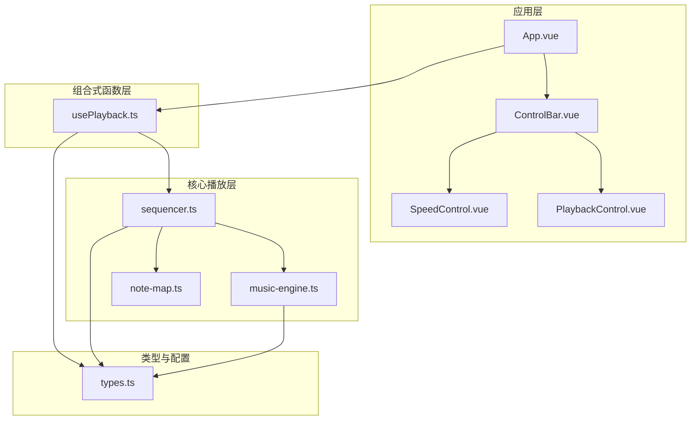
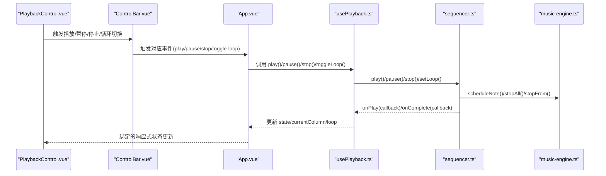
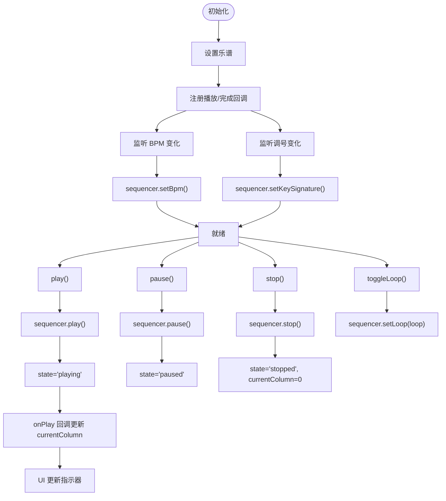
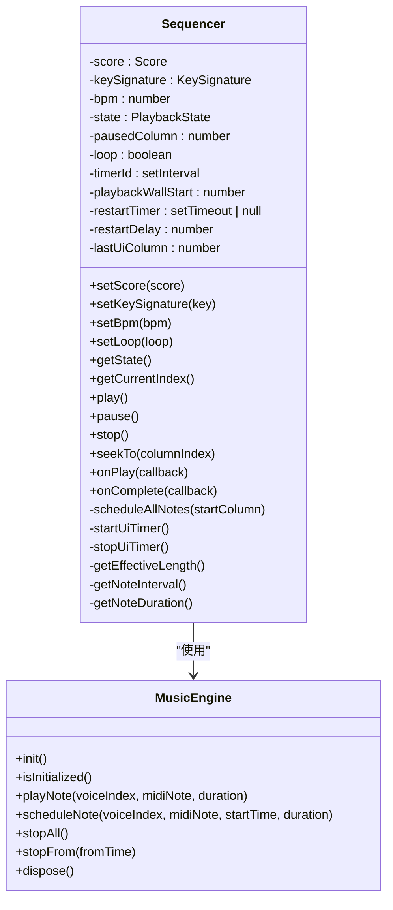
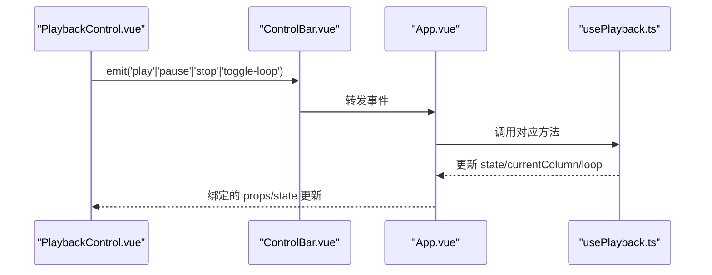
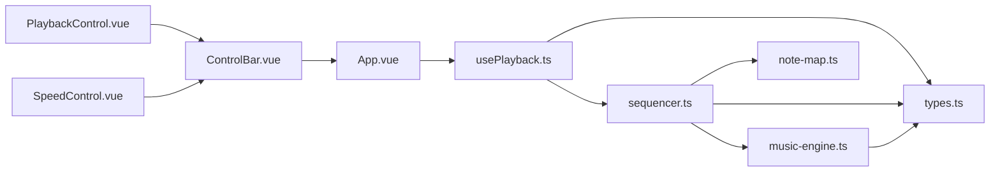

# 播放控制组合式函数

<cite>
**本文引用的文件**
- [usePlayback.ts](file://src/composables/usePlayback.ts)
- [sequencer.ts](file://src/core/sequencer.ts)
- [music-engine.ts](file://src/core/music-engine.ts)
- [types.ts](file://src/core/types.ts)
- [note-map.ts](file://src/core/note-map.ts)
- [PlaybackControl.vue](file://src/components/PlaybackControl.vue)
- [ControlBar.vue](file://src/components/ControlBar.vue)
- [SpeedControl.vue](file://src/components/SpeedControl.vue)
- [App.vue](file://src/App.vue)
</cite>

## 目录
1. [简介](#简介)
2. [项目结构](#项目结构)
3. [核心组件](#核心组件)
4. [架构总览](#架构总览)
5. [详细组件分析](#详细组件分析)
6. [依赖关系分析](#依赖关系分析)
7. [性能考量](#性能考量)
8. [故障排除指南](#故障排除指南)
9. [结论](#结论)
10. [附录](#附录)

## 简介
本文档围绕播放控制组合式函数 usePlayback 展开，系统解析其状态管理、BPM 控制、循环播放、与 Sequencer 的交互模式、事件处理机制以及响应式更新策略。同时提供 API 设计原理、使用方法、集成指导、性能优化建议与常见问题排查，帮助开发者在 Vue 3 + Web Audio 环境下高效构建音乐播放功能。

## 项目结构
播放控制相关的核心文件分布如下：
- 组合式函数：src/composables/usePlayback.ts
- 核心播放器：src/core/sequencer.ts
- 音频引擎：src/core/music-engine.ts
- 类型定义：src/core/types.ts
- 音符映射：src/core/note-map.ts
- UI 控件：src/components/PlaybackControl.vue、src/components/ControlBar.vue、src/components/SpeedControl.vue
- 应用入口：src/App.vue

图表来源
- [App.vue:1-138](file://src/App.vue#L1-L138)
- [ControlBar.vue:1-116](file://src/components/ControlBar.vue#L1-L116)
- [PlaybackControl.vue:1-111](file://src/components/PlaybackControl.vue#L1-L111)
- [SpeedControl.vue:1-68](file://src/components/SpeedControl.vue#L1-L68)
- [usePlayback.ts:1-95](file://src/composables/usePlayback.ts#L1-L95)
- [sequencer.ts:1-354](file://src/core/sequencer.ts#L1-L354)
- [music-engine.ts:1-221](file://src/core/music-engine.ts#L1-L221)
- [note-map.ts:1-119](file://src/core/note-map.ts#L1-L119)
- [types.ts:1-164](file://src/core/types.ts#L1-L164)

章节来源
- [App.vue:1-138](file://src/App.vue#L1-L138)
- [usePlayback.ts:1-95](file://src/composables/usePlayback.ts#L1-L95)
- [sequencer.ts:1-354](file://src/core/sequencer.ts#L1-L354)

## 核心组件
- usePlayback：提供播放状态、当前列、循环标志与播放控制 API；监听 BPM 与调号变化并同步至 Sequencer；订阅 Sequencer 的播放回调以驱动 UI。
- Sequencer：负责乐谱调度、BPM/调号动态调整、循环播放、UI 定时器与播放完成回调；内部使用 MusicEngine 播放音符。
- MusicEngine：封装 Web Audio API，创建振荡器与增益包络，支持立即停止与按时间选择性停止，避免播放中断时的点击声。
- note-map：将简谱字符串映射为 MIDI 音符编号，并考虑调号影响。
- 类型定义：PlaybackState、KeySignature、Score、BPM_LIST 等，统一状态与配置。

章节来源
- [usePlayback.ts:14-94](file://src/composables/usePlayback.ts#L14-L94)
- [sequencer.ts:21-354](file://src/core/sequencer.ts#L21-L354)
- [music-engine.ts:17-221](file://src/core/music-engine.ts#L17-L221)
- [note-map.ts:109-119](file://src/core/note-map.ts#L109-L119)
- [types.ts:71-138](file://src/core/types.ts#L71-L138)

## 架构总览
usePlayback 作为组合式函数，连接 UI 控件与核心播放器。App.vue 通过 usePlayback 提供播放状态与控制方法，ControlBar.vue 与 PlaybackControl.vue 负责展示与交互，SpeedControl.vue 负责 BPM 选择。Sequencer 通过 MusicEngine 实现精确的音符调度与停止，note-map 负责音符到 MIDI 的映射。

图表来源
- [PlaybackControl.vue:16-30](file://src/components/PlaybackControl.vue#L16-L30)
- [ControlBar.vue:43-50](file://src/components/ControlBar.vue#L43-L50)
- [App.vue:30-53](file://src/App.vue#L30-L53)
- [usePlayback.ts:46-82](file://src/composables/usePlayback.ts#L46-L82)
- [sequencer.ts:144-200](file://src/core/sequencer.ts#L144-L200)
- [music-engine.ts:90-150](file://src/core/music-engine.ts#L90-L150)

## 详细组件分析

### usePlayback 组合式函数
- 输入选项：score（只读乐谱）、bpm（Ref<number>）、keySignature（Ref<KeySignature>）
- 内部状态：state（stopped/playing/paused）、currentColumn（当前列）、loop（循环开关）
- 关键行为：
  - 初始化：设置乐谱、注册播放回调（列变化）、完成回调（重置状态与列）
  - 监听 BPM 与调号：watch 并调用 sequencer.setBpm/setKeySignature，immediate=true 确保初始同步
  - 播放控制：play（异步启动播放并更新状态）、pause（暂停并更新状态）、stop（停止并重置状态与列）、togglePlayPause（根据状态切换）
  - 循环控制：toggleLoop 切换 loop 并调用 sequencer.setLoop
- 返回值：state、currentColumn、loop 与上述控制方法，供 UI 绑定与调用

图表来源
- [usePlayback.ts:14-94](file://src/composables/usePlayback.ts#L14-L94)
- [sequencer.ts:144-200](file://src/core/sequencer.ts#L144-L200)

章节来源
- [usePlayback.ts:14-94](file://src/composables/usePlayback.ts#L14-L94)

### Sequencer 播放器
- 状态与属性：state、pausedColumn、loop、timerId、playbackWallStart、restartTimer、restartDelay、lastUiColumn
- 关键方法：
  - setScore/setKeySignature/setBpm：设置数据与参数
  - setLoop：启用/禁用循环
  - play/pause/stop：控制播放生命周期
  - seekTo：跳转到指定列
  - onPlay/onComplete：注册 UI 回调
  - scheduleAllNotes：一次性预调度所有剩余音符（基于 AudioContext 绝对时间）
  - startUiTimer/stopUiTimer：以约 50ms 间隔轮询当前列，列变化时触发回调
  - getEffectiveLength：计算有效长度（最后一个非空列+1），避免在空白列浪费时间
  - getNoteInterval/getNoteDuration：基于 BPM 计算列间隔与方波时长
- 实时调整策略（2026-08-30 改）：
  - BPM/调号变化命中 playing：requestPlaybackRestart() 立即 stopAll 丢弃所有声，120ms 防抖后从当前指示器列整体重排，并重置 playbackWallStart 与调度基准对齐（约 100ms）

图表来源
- [sequencer.ts:21-354](file://src/core/sequencer.ts#L21-L354)
- [music-engine.ts:17-221](file://src/core/music-engine.ts#L17-L221)

章节来源
- [sequencer.ts:21-354](file://src/core/sequencer.ts#L21-L354)

### MusicEngine 音频引擎
- 单例模式：getInstance/getMusicEngine
- 初始化：创建 AudioContext（必要时 resume），创建主压缩器并连接到 destination
- 音符调度：根据声部类型（方波/三角波）创建振荡器与增益节点，设置频率与包络，精确 start/stop
- 停止策略：
  - stopAll：立即停止所有活跃振荡器
  - stopFrom：按开始时间选择性停止未来音符，避免播放中断时的点击声
- 资源管理：dispose 释放压缩器与 AudioContext

章节来源
- [music-engine.ts:17-221](file://src/core/music-engine.ts#L17-L221)

### note-map 音符映射
- 将简谱字符串解析为音符编号与八度偏移，结合调号映射为 MIDI 音符编号
- 支持升号（#）、降号（b）与八度修饰符（数字前：. 高八度、, 低八度）
- columnToMidi 批量转换一列的三个声部

章节来源
- [note-map.ts:109-119](file://src/core/note-map.ts#L109-L119)

### UI 控件与集成
- PlaybackControl.vue：根据 state 切换播放/暂停按钮样式，触发 play/pause/stop/toggle-loop 事件
- ControlBar.vue：聚合 KeySignature、SpeedControl、PlaybackControl，向父组件转发事件
- SpeedControl.vue：提供 BPM 列表与增减操作，绑定 v-model 到 speed
- App.vue：使用 usePlayback 提供 state、currentColumn、loop 与控制方法，传递给 ControlBar 与 NotationGrid

图表来源
- [PlaybackControl.vue:9-30](file://src/components/PlaybackControl.vue#L9-L30)
- [ControlBar.vue:16-24](file://src/components/ControlBar.vue#L16-L24)
- [App.vue:30-53](file://src/App.vue#L30-L53)
- [usePlayback.ts:84-93](file://src/composables/usePlayback.ts#L84-L93)

章节来源
- [PlaybackControl.vue:1-111](file://src/components/PlaybackControl.vue#L1-L111)
- [ControlBar.vue:1-116](file://src/components/ControlBar.vue#L1-L116)
- [SpeedControl.vue:1-68](file://src/components/SpeedControl.vue#L1-L68)
- [App.vue:1-138](file://src/App.vue#L1-L138)

## 依赖关系分析
- usePlayback 依赖：
  - Sequencer 单例：通过 getSequencer 获取实例，调用 setScore、onPlay、onComplete、setBpm、setKeySignature、setLoop、play、pause、stop
  - Vue 响应式：ref/watch 提供状态与监听
  - 类型：PlaybackState、KeySignature、Score
- Sequencer 依赖：
  - MusicEngine：调度音符与停止
  - note-map：将简谱转换为 MIDI
  - 类型：PlaybackState、KeySignature、Score
- UI 依赖：
  - usePlayback 返回的状态与方法
  - ControlBar/PlaybackControl/SpeecControl 提供交互

图表来源
- [usePlayback.ts:1-95](file://src/composables/usePlayback.ts#L1-L95)
- [sequencer.ts:1-354](file://src/core/sequencer.ts#L1-L354)
- [music-engine.ts:1-221](file://src/core/music-engine.ts#L1-L221)
- [note-map.ts:1-119](file://src/core/note-map.ts#L1-L119)
- [types.ts:1-164](file://src/core/types.ts#L1-L164)
- [PlaybackControl.vue:1-111](file://src/components/PlaybackControl.vue#L1-L111)
- [ControlBar.vue:1-116](file://src/components/ControlBar.vue#L1-L116)
- [SpeedControl.vue:1-68](file://src/components/SpeedControl.vue#L1-L68)
- [App.vue:1-138](file://src/App.vue#L1-L138)

章节来源
- [usePlayback.ts:1-95](file://src/composables/usePlayback.ts#L1-L95)
- [sequencer.ts:1-354](file://src/core/sequencer.ts#L1-L354)

## 性能考量
- 预调度模式：play 时一次性调度所有剩余音符，避免 UI 定时器频繁创建/销毁振荡器，降低 CPU 开销
- 实时变速/变调的丢弃重排（2026-08-30 改）：BPM/调号变更时 stopAll 立即丢弃所有声，120ms 防抖后从当前指示器列整体重排，杜绝叠加混响并保持音画同步
- UI 轮询：约 50ms 轮询一次，列变化才触发回调，减少不必要的渲染
- 有效长度：getEffectiveLength 仅播放实际包含音符的列，避免在空白列浪费时间
- 音符包络：方波使用线性淡出，三角波使用短时长淡出，减少点击声并保持音色一致性
- 资源释放：stop/dispose 时清理定时器与振荡器，避免内存泄漏

章节来源
- [sequencer.ts:144-200](file://src/core/sequencer.ts#L144-L200)
- [sequencer.ts:240-263](file://src/core/sequencer.ts#L240-L263)
- [sequencer.ts:271-313](file://src/core/sequencer.ts#L271-L313)
- [music-engine.ts:177-197](file://src/core/music-engine.ts#L177-L197)

## 故障排除指南
- 播放无声音
  - 确认 AudioContext 已初始化且未处于 suspended 状态
  - 检查是否有用户交互触发 init/resume
- BPM/调号变更错乱（混响/错位）
  - 确认 setBpm/setKeySignature 命中 playing 时走 requestPlaybackRestart（stopAll + 防抖重启），未残留旧 _rescheduling/stopFrom 逻辑
  - 检查防抖定时器是否在 pause()/stop() 清除；确认 restartFromCurrentPosition 后 playbackWallStart 与调度基准对齐
- UI 不更新
  - 确认 onPlay 回调被注册且 currentColumn 被赋值
  - 检查 startUiTimer 是否启动，且列号确实发生变化
- 循环播放无效
  - 确认 loop 已启用且 onComplete 后正确重置 playbackWallStart 并重新调度

章节来源
- [music-engine.ts:41-64](file://src/core/music-engine.ts#L41-L64)
- [sequencer.ts:84-115](file://src/core/sequencer.ts#L84-L115)
- [sequencer.ts:290-304](file://src/core/sequencer.ts#L290-L304)
- [usePlayback.ts:25-31](file://src/composables/usePlayback.ts#L25-L31)
- [sequencer.ts:271-313](file://src/core/sequencer.ts#L271-L313)

## 结论
usePlayback 将播放状态、BPM/调号联动与 Sequencer 的事件回调无缝整合，配合 ControlBar/PlaybackControl 等 UI 组件，实现了简洁而强大的播放控制体验。Sequencer 的预调度与「stopAll 丢弃 + 防抖重排」策略在保证音质的同时兼顾性能，note-map 与 MusicEngine 则提供了准确的音符映射与稳定的音频输出。通过合理的响应式设计与事件传播，该方案易于扩展与维护。

## 附录

### API 设计原理与使用方法
- 设计原则
  - 组合式函数职责单一：集中管理播放状态与控制，不直接操作 DOM
  - 响应式联动：通过 ref/watch 将外部配置（BPM/调号）与播放器同步
  - 事件驱动：UI 通过事件触发，usePlayback 调用 Sequencer 方法，Sequencer 通过回调回传状态
  - 单例与解耦：Sequencer/MusicEngine 采用单例，避免全局污染
- 使用方法
  - 在 App.vue 中创建 config（speed/keySignature），调用 usePlayback 并传入 score、bpm、keySignature
  - 将 state/currentColumn/loop 与控制方法传递给 ControlBar/PlaybackControl
  - 在 PlaybackControl 中根据 state 切换按钮样式并触发事件
  - 在 ControlBar 中转发事件到 App.vue，App.vue 调用 usePlayback 返回的方法

章节来源
- [App.vue:25-53](file://src/App.vue#L25-L53)
- [PlaybackControl.vue:4-30](file://src/components/PlaybackControl.vue#L4-L30)
- [ControlBar.vue:16-24](file://src/components/ControlBar.vue#L16-L24)
- [usePlayback.ts:14-94](file://src/composables/usePlayback.ts#L14-L94)