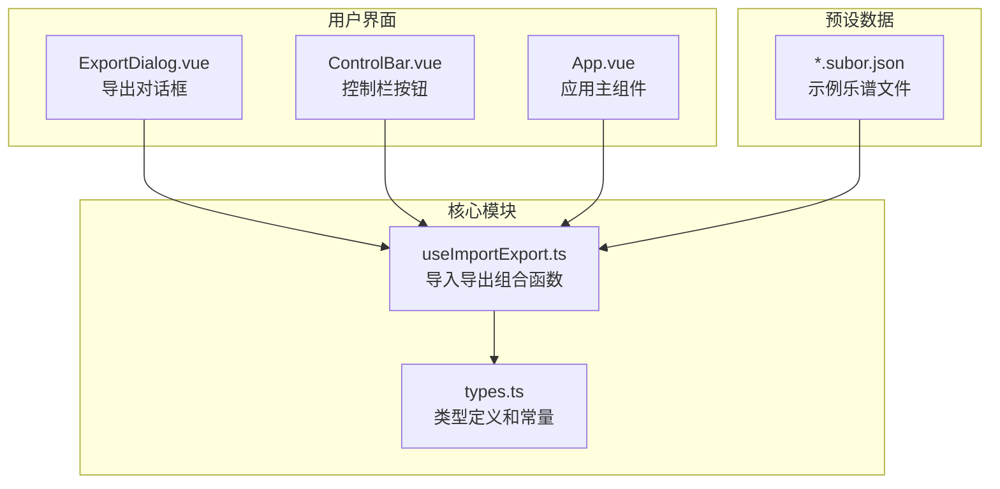
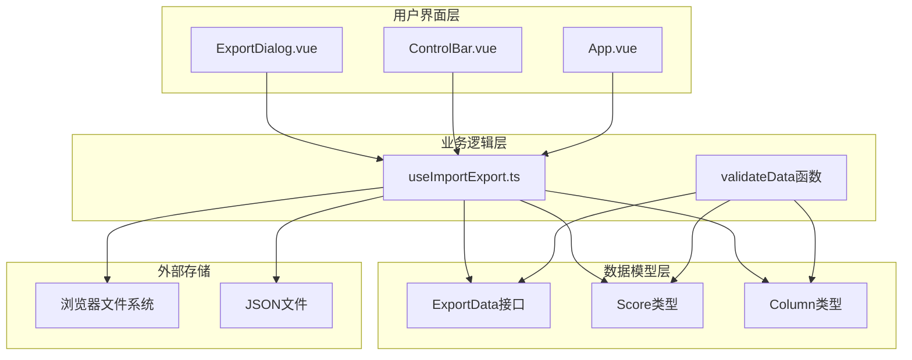
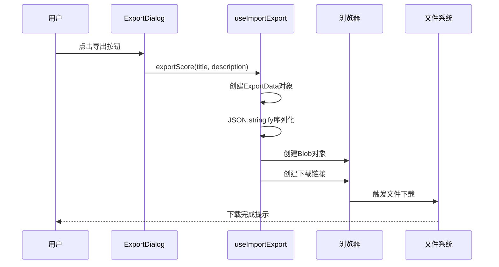
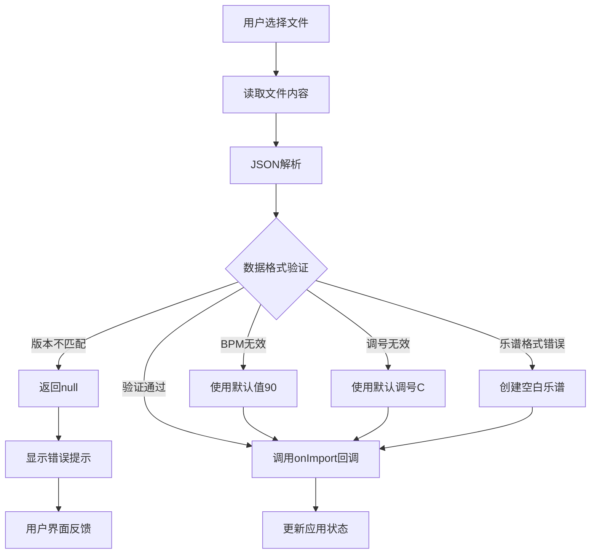
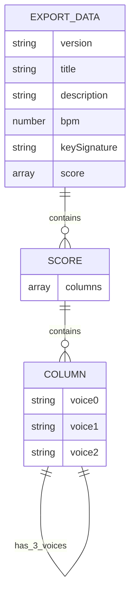
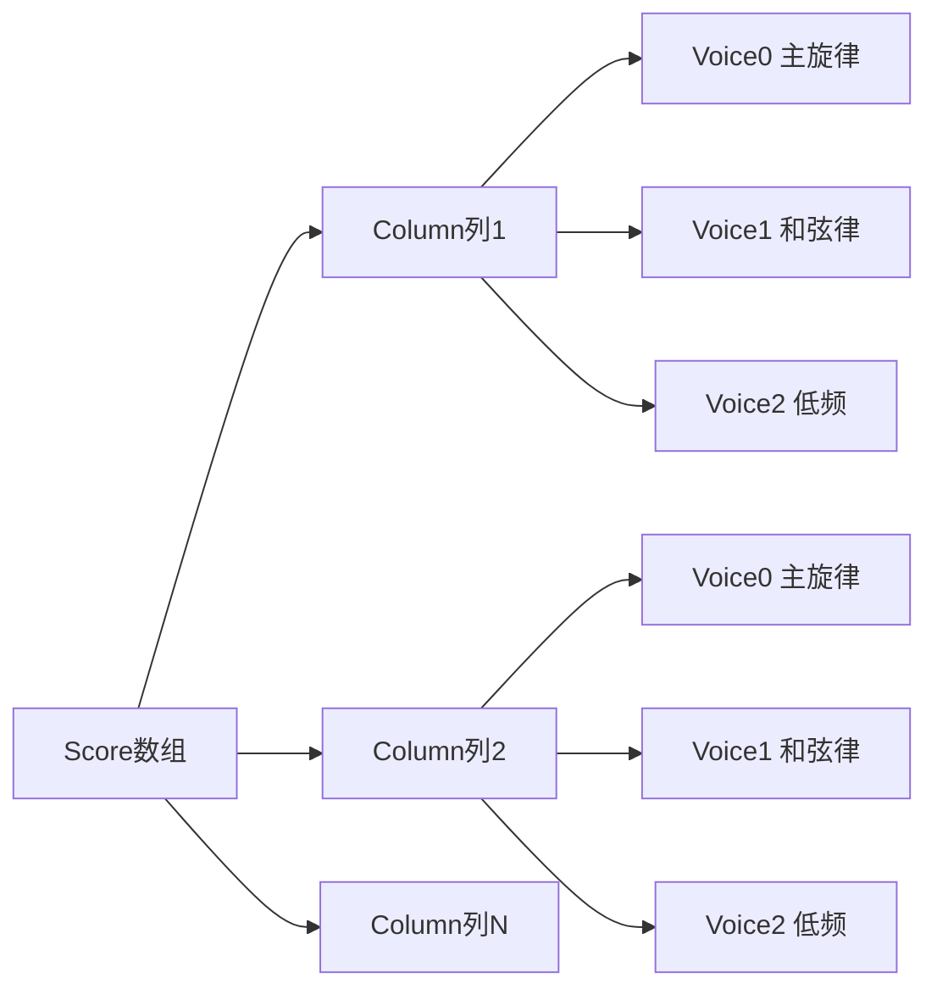
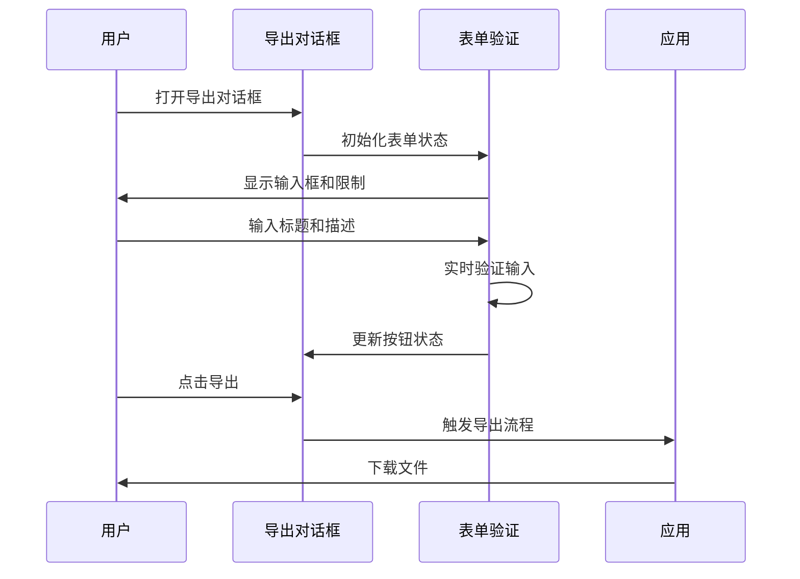
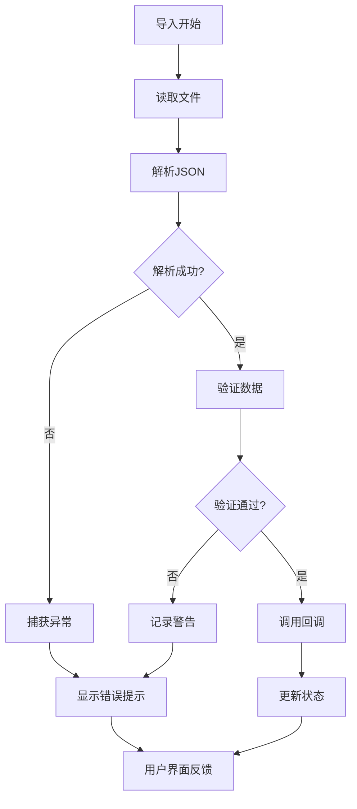
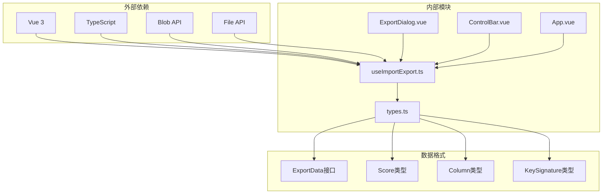

# 文件导入导出模块

<cite>
**本文档引用的文件**
- [useImportExport.ts](file://src/composables/useImportExport.ts)
- [ExportDialog.vue](file://src/components/ExportDialog.vue)
- [types.ts](file://src/core/types.ts)
- [App.vue](file://src/App.vue)
- [ControlBar.vue](file://src/components/ControlBar.vue)
- [twinkle-star.subor.json](file://presets/twinkle-star.subor.json)
- [jingle-bell.subor.json](file://presets/jingle-bell.subor.json)
- [coffin-dance.subor.json](file://presets/coffin-dance.subor.json)
</cite>

## 目录
1. [简介](#简介)
2. [项目结构](#项目结构)
3. [核心组件](#核心组件)
4. [架构概览](#架构概览)
5. [详细组件分析](#详细组件分析)
6. [依赖关系分析](#依赖关系分析)
7. [性能考虑](#性能考虑)
8. [故障排除指南](#故障排除指南)
9. [结论](#结论)
10. [附录](#附录)

## 简介

文件导入导出模块是 SUBOR Music Board 的核心功能之一，负责乐谱数据的持久化和分享。该模块实现了完整的 JSON 格式导入导出机制，支持乐谱数据的序列化、反序列化、格式验证和用户界面交互。

该模块采用 Vue 3 组合式 API 设计，通过可复用的组合函数提供导入导出功能，并与用户界面组件紧密集成，为用户提供直观的操作体验。

## 项目结构

文件导入导出功能主要分布在以下目录结构中：



**图表来源**
- [useImportExport.ts:1-138](file://src/composables/useImportExport.ts#L1-L138)
- [types.ts:140-164](file://src/core/types.ts#L140-L164)
- [ExportDialog.vue:1-119](file://src/components/ExportDialog.vue#L1-L119)

**章节来源**
- [useImportExport.ts:1-138](file://src/composables/useImportExport.ts#L1-L138)
- [types.ts:1-164](file://src/core/types.ts#L1-L164)

## 核心组件

### 导入导出组合函数

`useImportExport` 是整个导入导出功能的核心，提供了两个主要方法：

- `exportScore(title: string, description: string)`: 将当前乐谱导出为 `.subor.json` 文件
- `importScore()`: 从本地文件导入乐谱数据

该组合函数通过依赖注入的方式接收当前的 BPM、调号和乐谱数据，并在导入成功时调用回调函数更新应用状态。

**章节来源**
- [useImportExport.ts:18-137](file://src/composables/useImportExport.ts#L18-L137)

### 导出对话框组件

`ExportDialog` 是用户交互的核心界面组件，提供以下功能：

- 标题输入验证（必填，最大长度50字符）
- 简介文本输入（可选，最大长度200字符）
- 导出确认和取消操作
- 实时表单验证和禁用状态管理

**章节来源**
- [ExportDialog.vue:1-119](file://src/components/ExportDialog.vue#L1-L119)

### 应用集成层

在应用主组件中，导入导出功能通过事件驱动的方式与用户界面集成：

- 控制栏按钮触发导出流程
- 导出对话框确认后执行实际导出
- 导入按钮触发文件选择对话框
- 成功导入后自动更新应用状态

**章节来源**
- [App.vue:44-99](file://src/App.vue#L44-L99)

## 架构概览

文件导入导出模块采用分层架构设计，确保关注点分离和代码复用：



**图表来源**
- [useImportExport.ts:18-137](file://src/composables/useImportExport.ts#L18-L137)
- [types.ts:145-158](file://src/core/types.ts#L145-L158)

## 详细组件分析

### 导入导出组合函数实现

#### 导出功能分析

导出功能实现了完整的数据序列化流程：



**图表来源**
- [useImportExport.ts:24-47](file://src/composables/useImportExport.ts#L24-L47)
- [ExportDialog.vue:17-24](file://src/components/ExportDialog.vue#L17-L24)

导出过程的关键特性：
- 数据完整性：包含版本号、标题、描述、BPM、调号和完整乐谱
- 文件命名：自动清理非法字符，统一添加 `.subor.json` 扩展名
- 序列化格式：使用缩进格式化，便于人工阅读和调试

#### 导入功能分析

导入功能实现了严格的数据验证和错误处理机制：



**图表来源**
- [useImportExport.ts:52-79](file://src/composables/useImportExport.ts#L52-L79)
- [useImportExport.ts:84-131](file://src/composables/useImportExport.ts#L84-L131)

导入验证的层次结构：
1. **基础格式验证**：检查对象类型和必需字段
2. **版本兼容性**：确保只处理1.0版本格式
3. **数据类型验证**：验证BPM和调号的有效性
4. **结构完整性验证**：确保乐谱数据格式正确
5. **容错处理**：对无效数据提供合理的默认值

**章节来源**
- [useImportExport.ts:24-79](file://src/composables/useImportExport.ts#L24-L79)

### 数据格式规范

#### .subor.json 文件格式

`.subor.json` 是自定义的乐谱数据交换格式，具有严格的结构规范：



**图表来源**
- [types.ts:145-158](file://src/core/types.ts#L145-L158)
- [types.ts:56-60](file://src/core/types.ts#L56-L60)

#### 字段详细说明

| 字段名 | 类型 | 必需 | 描述 | 示例 |
|--------|------|------|------|------|
| version | string | 是 | 文件格式版本 | "1.0" |
| title | string | 是 | 乐谱标题 | "倾诉" |
| description | string | 否 | 乐谱描述 | "基于关键词生成的音乐" |
| bpm | number | 是 | 拍号速度 | 120 |
| keySignature | string | 是 | 调号 | "C" |
| score | array | 是 | 乐谱数据数组 | [[voice0, voice1, voice2], ...] |

#### 乐谱数据结构

乐谱数据采用三维数组结构，每个元素代表一列音符：



**图表来源**
- [types.ts:56-60](file://src/core/types.ts#L56-L60)

**章节来源**
- [types.ts:145-158](file://src/core/types.ts#L145-L158)

### 用户界面交互设计

#### 导出对话框用户体验

导出对话框采用了简洁直观的设计原则：



**图表来源**
- [ExportDialog.vue:17-24](file://src/components/ExportDialog.vue#L17-L24)
- [App.vue:86-94](file://src/App.vue#L86-L94)

#### 控制栏集成

控制栏提供了便捷的导入导出入口：

| 按钮 | 功能 | 触发事件 | 用户反馈 |
|------|------|----------|----------|
| OPEN | 导入乐谱 | `@click="emit('import')"` | 文件选择对话框 |
| SAVE | 导出乐谱 | `@click="emit('export')"` | 导出对话框弹出 |

**章节来源**
- [ControlBar.vue:51-64](file://src/components/ControlBar.vue#L51-L64)

### 安全性考虑

导入导出功能实施了多层安全防护：

#### 输入验证和清理

1. **文件类型验证**：限制只能选择 `.json` 和 `.subor.json` 文件
2. **内容格式验证**：严格检查 JSON 结构和数据类型
3. **文件名清理**：移除路径遍历和非法字符
4. **内存管理**：及时释放 Blob 对象引用

#### 错误处理策略



**图表来源**
- [useImportExport.ts:63-76](file://src/composables/useImportExport.ts#L63-L76)

**章节来源**
- [useImportExport.ts:63-76](file://src/composables/useImportExport.ts#L63-L76)

## 依赖关系分析

导入导出模块的依赖关系体现了清晰的关注点分离：



**图表来源**
- [useImportExport.ts:1-2](file://src/composables/useImportExport.ts#L1-L2)
- [types.ts:145-158](file://src/core/types.ts#L145-L158)

**章节来源**
- [useImportExport.ts:1-2](file://src/composables/useImportExport.ts#L1-L2)
- [types.ts:145-158](file://src/core/types.ts#L145-L158)

## 性能考虑

### 内存优化策略

1. **及时释放资源**：导出完成后立即撤销 Blob URL 引用
2. **增量处理**：导入时逐字节读取文件内容，避免内存峰值
3. **数据压缩**：使用紧凑的 JSON 格式减少文件大小

### 用户体验优化

1. **异步处理**：导入导出操作采用异步方式，避免界面阻塞
2. **进度反馈**：通过对话框和按钮状态变化提供即时反馈
3. **容错设计**：对网络异常和文件损坏提供优雅降级

## 故障排除指南

### 常见问题及解决方案

#### 导入失败

**问题症状**：导入时弹出"文件格式错误"提示

**可能原因**：
1. 文件不是有效的 JSON 格式
2. 缺少必需的字段或包含未知字段
3. 数据类型不符合预期
4. 版本号不匹配

**解决步骤**：
1. 验证 JSON 格式的正确性
2. 检查必需字段是否存在
3. 确认数据类型符合要求
4. 确保版本号为 "1.0"

#### 导出文件无法下载

**问题症状**：点击导出按钮后没有文件下载

**可能原因**：
1. 浏览器阻止了下载弹窗
2. 文件名包含非法字符
3. 内存不足导致 Blob 创建失败

**解决步骤**：
1. 检查浏览器下载设置
2. 确认标题中不包含特殊字符
3. 关闭其他占用内存的应用程序

#### 数据验证失败

**问题症状**：导入成功但显示默认值

**可能原因**：
1. BPM 不在允许的范围内
2. 调号不在支持的列表中
3. 乐谱数据格式不正确

**解决步骤**：
1. 检查 BPM 是否在 [60, 75, 90, 105, 120, 135] 中
2. 确认调号为 "C", "D", "F", "G", "♭B" 之一
3. 验证乐谱数据结构是否正确

**章节来源**
- [useImportExport.ts:84-131](file://src/composables/useImportExport.ts#L84-L131)

## 结论

文件导入导出模块通过精心设计的架构和严格的验证机制，为用户提供了可靠、易用的乐谱数据管理功能。模块的主要优势包括：

1. **完整的数据完整性**：支持乐谱的所有关键属性
2. **严格的格式验证**：确保数据质量和版本兼容性
3. **友好的用户界面**：简洁直观的操作流程
4. **强大的错误处理**：提供清晰的错误反馈和容错机制
5. **良好的性能表现**：高效的内存管理和异步处理

该模块为 SUBOR Music Board 提供了坚实的数据持久化基础，支持用户创作的乐谱保存、分享和重用。

## 附录

### 使用示例

#### 导出乐谱的基本用法

```typescript
// 在组件中使用
const { exportScore } = useImportExport({
  bpm: config.speed,
  keySignature: config.keySignature,
  score: score,
  onImport: (data) => {
    // 导入成功后的回调处理
  }
})

// 触发导出
exportScore("我的乐谱", "这是一个示例描述")
```

#### 导入乐谱的完整流程

```typescript
// 设置导入回调
const { importScore } = useImportExport({
  onImport: (data) => {
    config.speed = data.bpm
    config.keySignature = data.keySignature
    loadScore(data.score)
  }
})

// 触发导入
importScore()
```

### 扩展方法

#### 自定义验证规则

可以在 `validateData` 函数中添加额外的验证逻辑：

```typescript
function validateData(data: unknown): { bpm: number; keySignature: KeySignature; score: Score } | null {
  // 现有的验证逻辑...
  
  // 添加自定义验证
  if (obj.title.length > 100) {
    console.warn('标题过长')
    return null
  }
  
  return validatedData
}
```

#### 支持更多文件格式

可以通过修改文件类型过滤器支持其他格式：

```typescript
// 修改 accept 属性
input.accept = '.json,.subor.json,.txt'
```

#### 添加导入进度指示

可以为大型文件导入添加进度反馈：

```typescript
async function importScoreWithProgress(file: File): Promise<void> {
  // 显示进度条
  const progress = showProgressBar()
  
  try {
    const text = await file.text()
    // 更新进度
    progress.update(50)
    const data = JSON.parse(text)
    // 更新进度
    progress.update(100)
  } finally {
    progress.hide()
  }
}
```