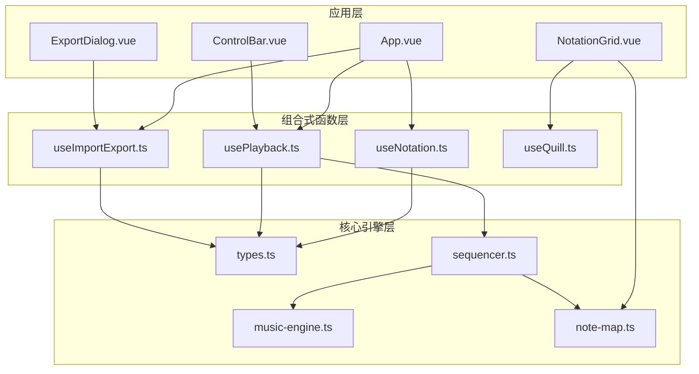
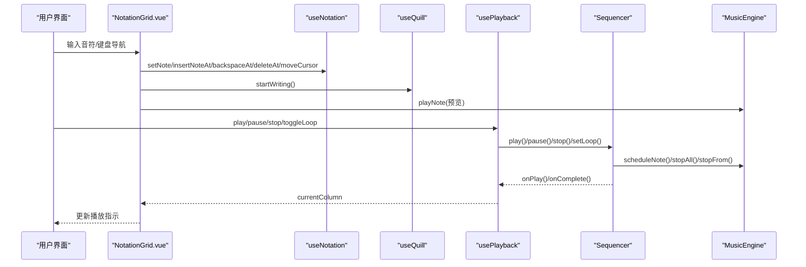
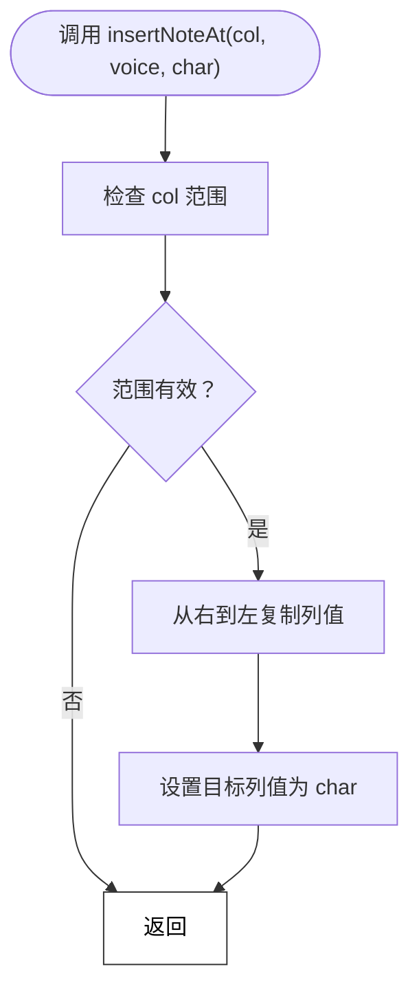
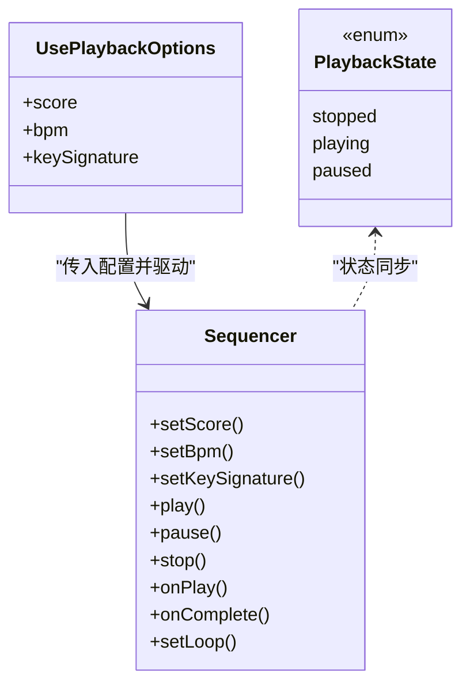
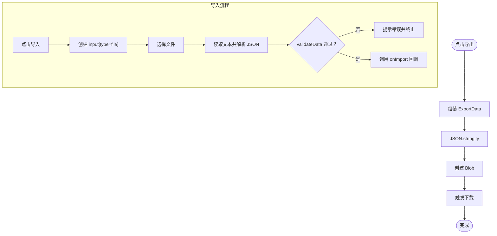
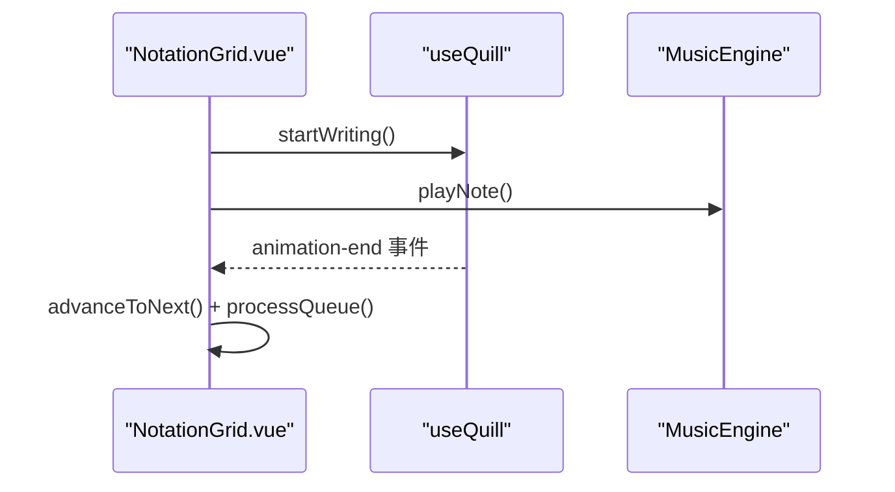
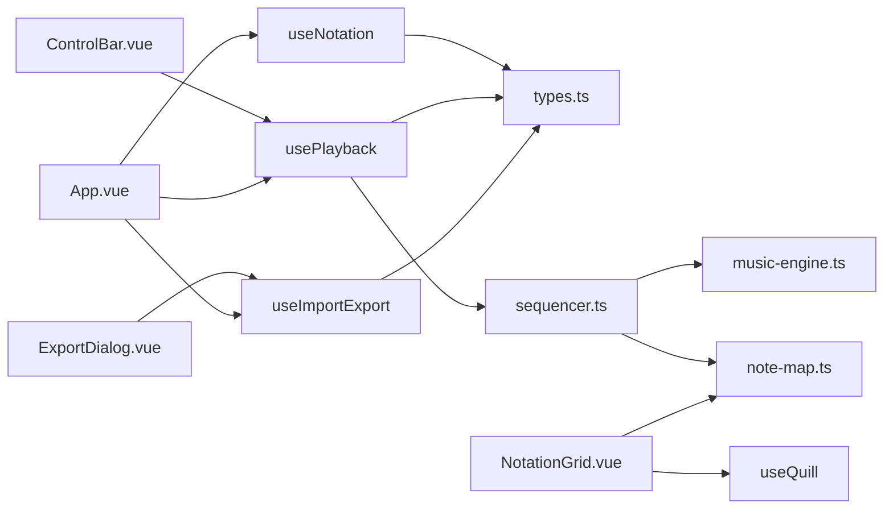

# 组合式函数模块

<cite>
**本文引用的文件**
- [useNotation.ts](file://src/composables/useNotation.ts)
- [usePlayback.ts](file://src/composables/usePlayback.ts)
- [useImportExport.ts](file://src/composables/useImportExport.ts)
- [useQuill.ts](file://src/composables/useQuill.ts)
- [types.ts](file://src/core/types.ts)
- [sequencer.ts](file://src/core/sequencer.ts)
- [music-engine.ts](file://src/core/music-engine.ts)
- [note-map.ts](file://src/core/note-map.ts)
- [App.vue](file://src/App.vue)
- [NotationGrid.vue](file://src/components/NotationGrid.vue)
- [ControlBar.vue](file://src/components/ControlBar.vue)
- [ExportDialog.vue](file://src/components/ExportDialog.vue)
</cite>

## 目录
1. [简介](#简介)
2. [项目结构](#项目结构)
3. [核心组件](#核心组件)
4. [架构总览](#架构总览)
5. [详细组件分析](#详细组件分析)
6. [依赖关系分析](#依赖关系分析)
7. [性能考量](#性能考量)
8. [故障排查指南](#故障排查指南)
9. [结论](#结论)
10. [附录](#附录)

## 简介
本文件面向 SUBOR Music Board 的组合式函数模块，系统梳理 Vue 3 Composition API 的使用模式与设计理念，深入解析以下组合式函数的实现机制：
- useNotation：记谱数据管理与光标控制
- usePlayback：播放控制与状态同步
- useImportExport：文件导入/导出与数据校验
- useQuill：富文本/动画状态管理

文档同时解释响应式绑定、状态管理、副作用处理等核心概念，给出模块间协作模式与接口设计规范，并提供使用示例、最佳实践与性能优化建议。

## 项目结构
本项目采用“组合式函数 + 核心引擎 + 组件”分层组织方式：
- 组合式函数层：封装业务状态与行为，暴露只读/可变状态与动作函数
- 核心引擎层：负责音频合成、播放调度、音符映射
- 组件层：负责 UI 交互与事件编排

图表来源
- [App.vue:1-138](file://src/App.vue#L1-L138)
- [NotationGrid.vue:1-292](file://src/components/NotationGrid.vue#L1-L292)
- [ControlBar.vue:1-116](file://src/components/ControlBar.vue#L1-L116)
- [ExportDialog.vue:1-119](file://src/components/ExportDialog.vue#L1-L119)
- [useNotation.ts:1-116](file://src/composables/useNotation.ts#L1-L116)
- [usePlayback.ts:1-95](file://src/composables/usePlayback.ts#L1-L95)
- [useImportExport.ts:1-138](file://src/composables/useImportExport.ts#L1-L138)
- [useQuill.ts:1-39](file://src/composables/useQuill.ts#L1-L39)
- [types.ts:1-164](file://src/core/types.ts#L1-L164)
- [sequencer.ts:1-354](file://src/core/sequencer.ts#L1-L354)
- [music-engine.ts:1-221](file://src/core/music-engine.ts#L1-L221)
- [note-map.ts:1-119](file://src/core/note-map.ts#L1-L119)

章节来源
- [App.vue:1-138](file://src/App.vue#L1-L138)
- [types.ts:1-164](file://src/core/types.ts#L1-L164)

## 核心组件
本节概览四个组合式函数的功能边界与职责：
- useNotation：维护乐谱二维矩阵与光标，提供设置/清除/插入/回删/删除/重置/加载等操作
- usePlayback：封装播放状态、当前列、循环标志，监听 BPM/调号变化并驱动底层 sequencer
- useImportExport：封装导入/导出流程与数据校验，统一导出格式与文件命名
- useQuill：维护羽毛笔位置与动画状态，提供移动、写字、蘸墨与结束回调

章节来源
- [useNotation.ts:15-116](file://src/composables/useNotation.ts#L15-L116)
- [usePlayback.ts:14-95](file://src/composables/usePlayback.ts#L14-L95)
- [useImportExport.ts:18-138](file://src/composables/useImportExport.ts#L18-L138)
- [useQuill.ts:5-39](file://src/composables/useQuill.ts#L5-L39)

## 架构总览
组合式函数通过响应式 API 实现状态与副作用的解耦，组件通过事件与模型绑定与之交互，核心引擎负责音频调度与渲染。

图表来源
- [NotationGrid.vue:112-177](file://src/components/NotationGrid.vue#L112-L177)
- [useNotation.ts:19-63](file://src/composables/useNotation.ts#L19-L63)
- [useQuill.ts:17-29](file://src/composables/useQuill.ts#L17-L29)
- [usePlayback.ts:46-82](file://src/composables/usePlayback.ts#L46-L82)
- [sequencer.ts:144-200](file://src/core/sequencer.ts#L144-L200)
- [music-engine.ts:69-150](file://src/core/music-engine.ts#L69-L150)

## 详细组件分析

### useNotation：记谱数据管理
- 数据结构
  - 乐谱 Score：N 列，每列含三个声部的字符串
  - 光标 CursorPosition：列索引与声部索引
- 关键能力
  - 设置/清除/插入/回删/删除/重置/加载
  - 插入（空格）：目标列及之后同声部右移一位，末位丢弃
  - 回删（Backspace）：删除前一格，之后左移填补，末位补空格
- 响应式与只读
  - 通过 reactive 包装内部状态，通过 readonly 暴露给外部，避免外部直接修改
- 边界与健壮性
  - 所有索引访问均进行范围检查
  - 加载时按默认列数裁剪/填充，确保 UI 一致性

图表来源
- [useNotation.ts:36-42](file://src/composables/useNotation.ts#L36-L42)

章节来源
- [useNotation.ts:15-116](file://src/composables/useNotation.ts#L15-L116)
- [types.ts:56-66](file://src/core/types.ts#L56-L66)

### usePlayback：播放控制与状态同步
- 状态与配置
  - state：stopped/playing/paused
  - currentColumn：当前播放列
  - loop：循环标志
  - 监听 BPM 与调号变化，即时更新底层 sequencer
- 控制接口
  - play/pause/stop/togglePlayPause/toggleLoop
- 与 sequencer 的协作
  - 初始化时设置乐谱与回调
  - onPlay 回调更新 currentColumn
  - onComplete 回调复位状态与列指针
- 性能注意
  - BPM/调号变更时，sequencer 走 requestPlaybackRestart（stopAll 丢弃 + 120ms 防抖 + 从当前指示器列整体重排），避免卡顿与混响

图表来源
- [usePlayback.ts:5-12](file://src/composables/usePlayback.ts#L5-L12)
- [usePlayback.ts:14-95](file://src/composables/usePlayback.ts#L14-L95)
- [sequencer.ts:21-354](file://src/core/sequencer.ts#L21-L354)

章节来源
- [usePlayback.ts:14-95](file://src/composables/usePlayback.ts#L14-L95)
- [sequencer.ts:144-200](file://src/core/sequencer.ts#L144-L200)

### useImportExport：文件导入/导出与数据校验
- 导出
  - 组装 ExportData：版本、标题、简介、BPM、调号、乐谱
  - 生成 JSON Blob 并触发下载，文件名安全处理
- 导入
  - 通过隐藏 input 触发文件选择
  - 异步读取文本并解析 JSON
  - validateData 校验版本、BPM、调号、乐谱结构
  - 回调 onImport，由上层决定如何应用
- 数据契约
  - 版本号固定为 1.0
  - BPM 限定在预设列表内
  - 调号限定在允许集合内
  - 乐谱列数按默认列数裁剪/填充

图表来源
- [useImportExport.ts:24-47](file://src/composables/useImportExport.ts#L24-L47)
- [useImportExport.ts:52-79](file://src/composables/useImportExport.ts#L52-L79)
- [useImportExport.ts:84-131](file://src/composables/useImportExport.ts#L84-L131)
- [types.ts:145-158](file://src/core/types.ts#L145-L158)

章节来源
- [useImportExport.ts:18-138](file://src/composables/useImportExport.ts#L18-L138)
- [types.ts:113-138](file://src/core/types.ts#L113-L138)

### useQuill：富文本/动画状态管理
- 状态
  - position：羽毛笔中心坐标（基于 input 元素的 boundingRect）
  - animation：idle/writing/dipInk
- 能力
  - moveTo：根据当前焦点元素更新位置
  - startWriting/startDipInk：触发相应动画
  - onAnimationEnd：动画结束回调，回到 idle
- 与 NotationGrid 的协作
  - 输入音符后触发 writing 动画，动画结束自动前进到下一格
  - 支持输入队列，避免动画期间的并发输入冲突

图表来源
- [NotationGrid.vue:112-156](file://src/components/NotationGrid.vue#L112-L156)
- [useQuill.ts:17-29](file://src/composables/useQuill.ts#L17-L29)

章节来源
- [useQuill.ts:5-39](file://src/composables/useQuill.ts#L5-L39)
- [NotationGrid.vue:53-54](file://src/components/NotationGrid.vue#L53-L54)

## 依赖关系分析
- 组合式函数之间的耦合
  - useNotation 与 usePlayback 通过只读 Score 与 BPM/KeySignature 进行松耦合
  - useImportExport 与 App 层通过 onImport 回调解耦
  - useQuill 与 NotationGrid 通过事件与状态解耦
- 外部依赖
  - sequencer 依赖 music-engine 与 note-map
  - 组件通过 props/emits 与组合式函数交互

图表来源
- [useNotation.ts:1-116](file://src/composables/useNotation.ts#L1-L116)
- [usePlayback.ts:1-95](file://src/composables/usePlayback.ts#L1-L95)
- [useImportExport.ts:1-138](file://src/composables/useImportExport.ts#L1-L138)
- [useQuill.ts:1-39](file://src/composables/useQuill.ts#L1-L39)
- [types.ts:1-164](file://src/core/types.ts#L1-L164)
- [sequencer.ts:1-354](file://src/core/sequencer.ts#L1-L354)
- [music-engine.ts:1-221](file://src/core/music-engine.ts#L1-L221)
- [note-map.ts:1-119](file://src/core/note-map.ts#L1-L119)
- [App.vue:1-138](file://src/App.vue#L1-L138)
- [NotationGrid.vue:1-292](file://src/components/NotationGrid.vue#L1-L292)
- [ControlBar.vue:1-116](file://src/components/ControlBar.vue#L1-L116)
- [ExportDialog.vue:1-119](file://src/components/ExportDialog.vue#L1-L119)

章节来源
- [App.vue:1-138](file://src/App.vue#L1-L138)
- [NotationGrid.vue:1-292](file://src/components/NotationGrid.vue#L1-L292)

## 性能考量
- 预调度播放模式
  - sequencer 在 play 时一次性预调度所有音符，避免 UI 轮询开销
  - BPM/调号变更时 stopAll 丢弃所有声 + 120ms 防抖后从当前指示器列整体重排，减少停顿与混响
- 有效长度优化
  - 通过 getEffectiveLength 仅播放非空列，缩短播放时长
- 输入队列与动画节流
  - NotationGrid 使用输入队列与动画状态机，避免并发输入与 UI 抖动
- 响应式粒度
  - useNotation 暴露 readonly 状态，降低不必要的响应式追踪成本
  - usePlayback 通过 watch 监听关键配置，避免全局重渲染

章节来源
- [sequencer.ts:240-263](file://src/core/sequencer.ts#L240-L263)
- [sequencer.ts:223-232](file://src/core/sequencer.ts#L223-L232)
- [NotationGrid.vue:58-148](file://src/components/NotationGrid.vue#L58-L148)
- [useNotation.ts:103-115](file://src/composables/useNotation.ts#L103-L115)

## 故障排查指南
- 导入失败
  - 检查文件格式是否为 .json 或 .subor.json
  - 确认 JSON 结构符合 ExportData 接口，version 为 "1.0"
  - 若 BPM/调号不在允许集合内，将回退到默认值
- 播放异常
  - 确保音频上下文已初始化（首次播放需用户交互）
  - 检查 BPM 是否在允许列表内
  - 调号/变速切换时若出现卡顿或混响，确认 sequencer 走 requestPlaybackRestart（stopAll + 120ms 防抖后从当前指示器列整体重排）
- 输入错位
  - 避免长按方向键导致的重复事件，组件已过滤 repeat
  - 空格插入会触发右移位移，Backspace 回删后左移填补，Delete 仅清空当前格

章节来源
- [useImportExport.ts:63-76](file://src/composables/useImportExport.ts#L63-L76)
- [music-engine.ts:41-60](file://src/core/music-engine.ts#L41-L60)
- [sequencer.ts:84-115](file://src/core/sequencer.ts#L84-L115)
- [NotationGrid.vue:185-244](file://src/components/NotationGrid.vue#L185-L244)

## 结论
本组合式函数模块以 Vue 3 Composition API 为核心，围绕记谱、播放、导入导出与富文本动画四大主题构建了清晰的状态与行为边界。通过只读状态暴露、watch 监听与预调度播放等设计，实现了良好的响应式体验与性能表现。模块间通过事件与回调解耦，便于扩展与维护。

## 附录

### 使用示例与最佳实践
- 在组件中使用 useNotation
  - 通过解构获取 score/cursor 与操作函数
  - 通过 moveCursor 与键盘事件联动
  - 通过 setNote/insertNoteAt/backspaceAt/deleteAt 实现输入
- 在组件中使用 usePlayback
  - 通过 toRef 将配置项转为响应式引用
  - 通过 play/pause/stop/toggleLoop 控制播放
  - 监听 currentColumn 更新 UI 指示器
- 在组件中使用 useImportExport
  - 通过 onImport 回调应用导入数据
  - 导出时确保标题非空，描述可选
- 在组件中使用 useQuill
  - 在输入焦点变化时调用 moveTo 更新位置
  - 在动画结束时调用 onAnimationEnd 回归 idle

章节来源
- [App.vue:13-100](file://src/App.vue#L13-L100)
- [NotationGrid.vue:75-156](file://src/components/NotationGrid.vue#L75-L156)
- [ControlBar.vue:16-24](file://src/components/ControlBar.vue#L16-L24)
- [ExportDialog.vue:17-34](file://src/components/ExportDialog.vue#L17-L34)