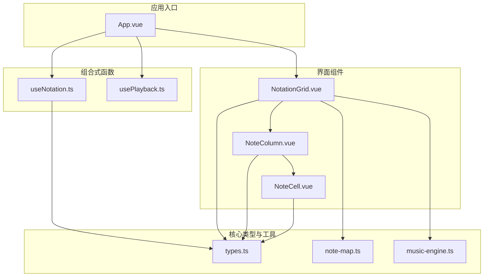
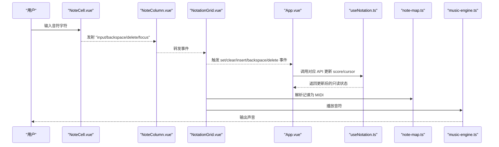
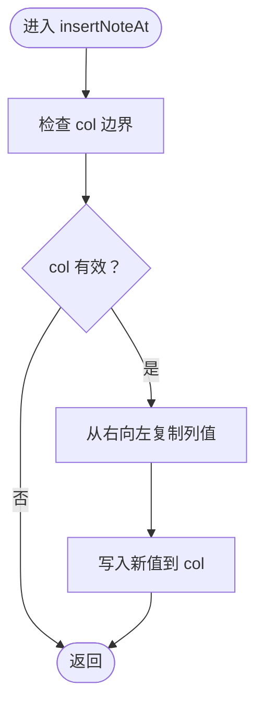
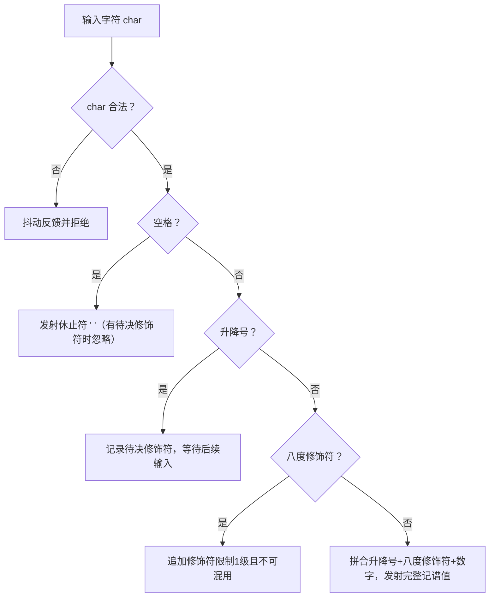
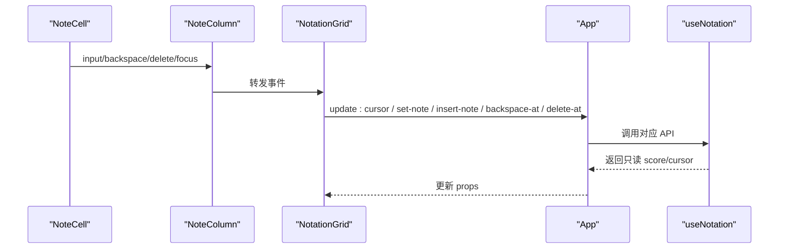
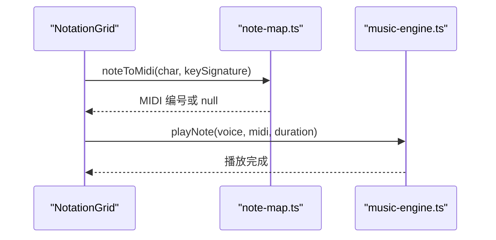
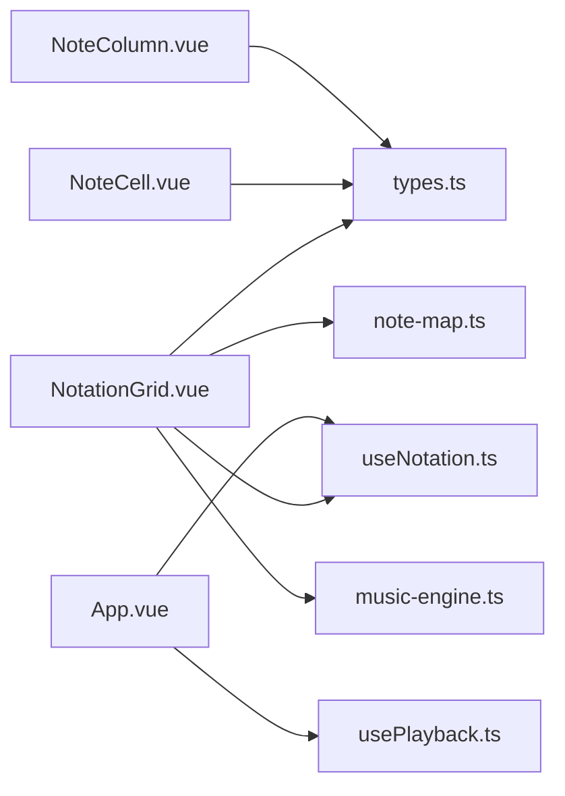

# 记谱数据管理

<cite>
**本文引用的文件**
- [useNotation.ts](file://src/composables/useNotation.ts)
- [types.ts](file://src/core/types.ts)
- [NoteCell.vue](file://src/components/NoteCell.vue)
- [NotationGrid.vue](file://src/components/NotationGrid.vue)
- [NoteColumn.vue](file://src/components/NoteColumn.vue)
- [music-engine.ts](file://src/core/music-engine.ts)
- [note-map.ts](file://src/core/note-map.ts)
- [App.vue](file://src/App.vue)
- [usePlayback.ts](file://src/composables/usePlayback.ts)
</cite>

## 目录
1. [简介](#简介)
2. [项目结构](#项目结构)
3. [核心组件](#核心组件)
4. [架构总览](#架构总览)
5. [详细组件分析](#详细组件分析)
6. [依赖关系分析](#依赖关系分析)
7. [性能考量](#性能考量)
8. [故障排查指南](#故障排查指南)
9. [结论](#结论)
10. [附录](#附录)

## 简介
本文件围绕记谱数据管理的组合式函数 useNotation 展开，系统性解析其数据结构、光标导航、音符输入验证、记谱规则实现、数据转换逻辑与状态同步机制，并阐明与 NoteCell 组件的协作关系与数据流转过程。文档同时提供 API 接口规范、使用示例与错误处理策略，以及数据结构设计原理与扩展方法指导，帮助开发者快速理解并高效扩展该记谱系统。

## 项目结构
本项目采用“组合式函数 + 组件”分层架构：
- 组合式函数层：集中管理记谱状态与业务逻辑（如 useNotation）
- 组件层：负责 UI 交互与事件编排（如 NotationGrid、NoteColumn、NoteCell）
- 核心工具层：类型定义、音符映射、音乐引擎等（如 types、note-map、music-engine）

图表来源
- [App.vue:13-100](file://src/App.vue#L13-L100)
- [useNotation.ts:15-116](file://src/composables/useNotation.ts#L15-L116)
- [usePlayback.ts:14-95](file://src/composables/usePlayback.ts#L14-L95)
- [types.ts:56-96](file://src/core/types.ts#L56-L96)
- [note-map.ts:83-119](file://src/core/note-map.ts#L83-L119)
- [music-engine.ts:17-221](file://src/core/music-engine.ts#L17-L221)
- [NotationGrid.vue:1-292](file://src/components/NotationGrid.vue#L1-L292)
- [NoteColumn.vue:1-63](file://src/components/NoteColumn.vue#L1-L63)
- [NoteCell.vue:1-278](file://src/components/NoteCell.vue#L1-L278)

章节来源
- [App.vue:13-100](file://src/App.vue#L13-L100)
- [useNotation.ts:15-116](file://src/composables/useNotation.ts#L15-L116)
- [types.ts:56-96](file://src/core/types.ts#L56-L96)

## 核心组件
本节聚焦 useNotation 组合式函数，解析其数据结构、API 与行为。

- 数据结构
  - Score：N 列，每列包含 3 个声部（主旋律、和弦律、低频），类型为 Column[]
  - Column：三元组 [string, string, string]，分别对应 VoiceIndex 0/1/2
  - CursorPosition：{ col: number, voice: VoiceIndex }
  - 初始列数：DEFAULT_COLUMNS（125），可随输入推进或导入动态扩展（不设硬上限）

- 关键 API
  - setNote(col, voice, char)：设置指定列与声部的音符（char 已在输入层验证）
  - clearNote(col, voice)：清空指定列与声部
  - insertNoteAt(col, voice, char)：插入写入（空格休止符），右推后续音符，末位丢弃
  - backspaceAt(col, voice)：回删（Backspace），左移填补，末位补空格，返回布尔
  - deleteAt(col, voice)：删除当前单元（不触发位移，用于 Delete 键）
  - moveCursor(col, voice)：移动光标，col 越界时自动扩展乐谱（生成新列），voice 限制在 0..2
  - resetScore()：清空乐谱并重置光标
  - loadScore(newScore)：加载新乐谱，完整加载不截断，不足 DEFAULT_COLUMNS 则用空白列补齐

- 状态与只读
  - score 与 cursor 通过 reactive 包裹，对外暴露 readonly 片段，确保外部只能通过 API 修改

章节来源
- [useNotation.ts:15-116](file://src/composables/useNotation.ts#L15-L116)
- [types.ts:56-66](file://src/core/types.ts#L56-L66)
- [types.ts:98-99](file://src/core/types.ts#L98-L99)

## 架构总览
记谱数据管理的整体流程如下：
- 用户在 NotationGrid 中通过键盘与鼠标与 NoteCell 交互
- NotationGrid 根据输入字符类型（空格=插入，音符/延音线=覆盖）派发事件
- App.vue 作为协调者，调用 useNotation 的 API 更新 score 与 cursor
- 同时，NotationGrid 调用音乐引擎播放音符，使用 note-map 将记谱转换为 MIDI

图表来源
- [NoteCell.vue:68-178](file://src/components/NoteCell.vue#L68-L178)
- [NoteColumn.vue:13-27](file://src/components/NoteColumn.vue#L13-L27)
- [NotationGrid.vue:29-177](file://src/components/NotationGrid.vue#L29-L177)
- [App.vue:62-84](file://src/App.vue#L62-L84)
- [useNotation.ts:19-115](file://src/composables/useNotation.ts#L19-L115)
- [note-map.ts:83-119](file://src/core/note-map.ts#L83-L119)
- [music-engine.ts:69-150](file://src/core/music-engine.ts#L69-L150)

## 详细组件分析

### useNotation 实现机制
- 数据结构与初始化
  - 使用 createEmptyScore(columns) 生成初始乐谱，每列由 createEmptyColumn() 初始化为空白
  - cursor 通过 reactive 初始化，col 与 voice 分别维护当前光标位置

- 输入与编辑
  - setNote/clearNote：直接写入/清空，边界检查 col
  - insertNoteAt：从右向左复制，末位丢弃，确保长度不变
  - backspaceAt：从左向右复制填补，末位补空格，返回是否成功（col=0 时失败）
  - deleteAt：清空当前单元，不触发位移

- 光标导航
  - moveCursor：col 边界检查，voice 限制在 0..2，确保安全访问

- 乐谱装载与重置
  - loadScore：完整加载不截断，不足则补齐空白列，重置光标
  - resetScore：清空所有列并重置光标

- 复杂度与性能
  - insertNoteAt/backspaceAt：O(N)，其中 N 为当前列数
  - 其他操作：O(1)

图表来源
- [useNotation.ts:36-42](file://src/composables/useNotation.ts#L36-L42)

章节来源
- [useNotation.ts:15-116](file://src/composables/useNotation.ts#L15-L116)

### 记谱规则与输入验证
- 输入字符合法性
  - 单字符验证：isValidNoteChar(char) 通过正则判断是否为 1-7、#、b、., 空格
  - 完整值验证：isValidNoteValue(value) 支持 "1"、".1"、",1"、"#.1"、"b,3"、"-"（延音线）等格式

- 输入解析与显示
  - parseNoteValue(value)：解析显示内容与八度 CSS 类（s1/s-1）
  - NoteCell.vue：在输入层完成字符校验与修饰符拼接，最终发射完整记谱值

- 记谱到 MIDI 的转换
  - noteToMidi(note, keySignature)：解析记谱字符串，结合调号映射为 MIDI 编号
  - columnToMidi(column, keySignature)：批量转换一列三声部

图表来源
- [NoteCell.vue:68-115](file://src/components/NoteCell.vue#L68-L115)
- [types.ts:77-96](file://src/core/types.ts#L77-L96)
- [types.ts:21-39](file://src/core/types.ts#L21-L39)
- [note-map.ts:35-74](file://src/core/note-map.ts#L35-L74)

章节来源
- [NoteCell.vue:68-178](file://src/components/NoteCell.vue#L68-L178)
- [types.ts:77-96](file://src/core/types.ts#L77-L96)
- [types.ts:21-39](file://src/core/types.ts#L21-L39)
- [note-map.ts:83-119](file://src/core/note-map.ts#L83-L119)

### 与 NoteCell 的协作关系与数据流
- 事件链路
  - NoteCell：负责输入校验、修饰符拼接与焦点管理，向上游发射 input/backspace/delete/focus
  - NoteColumn：承载三声部 NoteCell，转发事件给 NotationGrid
  - NotationGrid：根据输入字符类型决定调用 setNote 或 insertNoteAt，并触发播放与书写动画
  - App.vue：作为协调者，将 NotationGrid 的事件映射到 useNotation 的 API

- 状态同步
  - NotationGrid 通过 props 接收只读 score/cursor，通过 emit 更新 cursor
  - App.vue 将 useNotation 返回的只读状态传给 NotationGrid，并在事件回调中调用 useNotation 的修改方法

图表来源
- [NoteCell.vue:12-17](file://src/components/NoteCell.vue#L12-L17)
- [NoteColumn.vue:13-27](file://src/components/NoteColumn.vue#L13-L27)
- [NotationGrid.vue:18-51](file://src/components/NotationGrid.vue#L18-L51)
- [App.vue:62-84](file://src/App.vue#L62-L84)
- [useNotation.ts:103-115](file://src/composables/useNotation.ts#L103-L115)

章节来源
- [NoteCell.vue:12-17](file://src/components/NoteCell.vue#L12-L17)
- [NoteColumn.vue:13-27](file://src/components/NoteColumn.vue#L13-L27)
- [NotationGrid.vue:18-51](file://src/components/NotationGrid.vue#L18-L51)
- [App.vue:62-84](file://src/App.vue#L62-L84)
- [useNotation.ts:103-115](file://src/composables/useNotation.ts#L103-L115)

### 数据转换逻辑与播放集成
- 记谱到 MIDI
  - noteToMidi：解析记谱字符串，结合调号映射为 MIDI 编号
  - columnToMidi：批量转换一列三声部

- 播放实现
  - NotationGrid：根据输入字符类型调用相应 API，随后调用 playNote(voice, char)
  - music-engine.ts：使用 Web Audio API 播放音符，支持三角波/方波、增益包络与压缩器

图表来源
- [NotationGrid.vue:102-110](file://src/components/NotationGrid.vue#L102-L110)
- [note-map.ts:83-119](file://src/core/note-map.ts#L83-L119)
- [music-engine.ts:69-150](file://src/core/music-engine.ts#L69-L150)

章节来源
- [NotationGrid.vue:102-110](file://src/components/NotationGrid.vue#L102-L110)
- [note-map.ts:83-119](file://src/core/note-map.ts#L83-L119)
- [music-engine.ts:69-150](file://src/core/music-engine.ts#L69-L150)

## 依赖关系分析
- 组件耦合
  - NotationGrid 依赖 useNotation 的 API 与 types 的类型定义
  - NoteCell 依赖 types 的输入验证与显示解析
  - App.vue 作为协调者，依赖 useNotation、usePlayback、useImportExport

- 外部依赖
  - Web Audio API：由 music-engine.ts 提供
  - 正则与类型：由 types.ts 提供

图表来源
- [NotationGrid.vue:1-292](file://src/components/NotationGrid.vue#L1-L292)
- [useNotation.ts:1-116](file://src/composables/useNotation.ts#L1-L116)
- [types.ts:1-164](file://src/core/types.ts#L1-L164)
- [note-map.ts:1-119](file://src/core/note-map.ts#L1-L119)
- [music-engine.ts:1-221](file://src/core/music-engine.ts#L1-L221)
- [NoteCell.vue:1-278](file://src/components/NoteCell.vue#L1-L278)
- [NoteColumn.vue:1-63](file://src/components/NoteColumn.vue#L1-L63)
- [App.vue:1-138](file://src/App.vue#L1-L138)
- [usePlayback.ts:1-95](file://src/composables/usePlayback.ts#L1-L95)

章节来源
- [NotationGrid.vue:1-292](file://src/components/NotationGrid.vue#L1-L292)
- [useNotation.ts:1-116](file://src/composables/useNotation.ts#L1-L116)
- [types.ts:1-164](file://src/core/types.ts#L1-L164)
- [note-map.ts:1-119](file://src/core/note-map.ts#L1-L119)
- [music-engine.ts:1-221](file://src/core/music-engine.ts#L1-L221)
- [NoteCell.vue:1-278](file://src/components/NoteCell.vue#L1-L278)
- [NoteColumn.vue:1-63](file://src/components/NoteColumn.vue#L1-L63)
- [App.vue:1-138](file://src/App.vue#L1-L138)
- [usePlayback.ts:1-95](file://src/composables/usePlayback.ts#L1-L95)

## 性能考量
- 时间复杂度
  - 插入/回删：O(N)，N 为列数（默认 125）。在 DEFAULT_COLUMNS 下可接受
  - 其他操作：O(1)
- 空间复杂度
  - Score 为二维数组，空间占用与列数成正比
- 优化建议
  - 若列数增长趋势明显，可考虑分页或虚拟滚动
  - 输入队列与动画状态机（NotationGrid）避免并发写入导致的视觉错乱

[本节为通用性能讨论，不直接分析具体文件]

## 故障排查指南
- 输入无效字符
  - 现象：NoteCell 抖动反馈
  - 原因：输入字符不在合法集合内
  - 处理：遵循 isValidNoteChar 与 isValidNoteValue 规则
- 回删无效
  - 现象：backspaceAt 返回 false
  - 原因：col 不在有效范围（<=0 或 >= score.length+1）
  - 处理：确保光标位置合法后再执行回删
- 插入写入越界
  - 现象：末列插入被丢弃
  - 原因：insertNoteAt 末位丢弃
  - 处理：在 UI 上提示列数上限或自动扩展列数（需扩展 useNotation）
- 光标越界
  - 现象：moveCursor 未生效
  - 原因：col 超出范围或 voice 超出 0..2
  - 处理：调用前确保参数在允许范围内

章节来源
- [NoteCell.vue:72-79](file://src/components/NoteCell.vue#L72-L79)
- [useNotation.ts:48-56](file://src/composables/useNotation.ts#L48-L56)
- [useNotation.ts:36-42](file://src/composables/useNotation.ts#L36-L42)
- [useNotation.ts:66-71](file://src/composables/useNotation.ts#L66-L71)

## 结论
useNotation 通过简洁的数据结构与明确的 API，实现了高效的记谱数据管理。配合 NotationGrid 的输入分发控制、NoteCell 的输入验证与显示解析，以及 note-map 与 music-engine 的转换与播放，形成了完整的记谱输入与播放闭环。其设计具备良好的可扩展性，便于在未来增加列数扩展、批量编辑与更复杂的记谱规则。

[本节为总结性内容，不直接分析具体文件]

## 附录

### API 接口规范（useNotation）
- 函数签名与用途
  - setNote(col, voice, char)：设置音符
  - clearNote(col, voice)：清空音符
  - insertNoteAt(col, voice, char)：插入写入（空格）右推
  - backspaceAt(col, voice)：回删（Backspace），返回布尔
  - deleteAt(col, voice)：删除当前单元
  - moveCursor(col, voice)：移动光标
  - resetScore()：重置乐谱与光标
  - loadScore(newScore)：加载新乐谱

- 返回值
  - score/cursor 为只读对象，供组件渲染使用

章节来源
- [useNotation.ts:103-115](file://src/composables/useNotation.ts#L103-L115)

### 使用示例（概念性）
- 在 NotationGrid 中绑定 useNotation 的返回值
- 监听 set-note/insert-note/backspace-at/delete-at 事件
- 根据输入字符类型（空格=插入，音符/延音线=覆盖）决定调用 insertNoteAt 或 setNote
- 通过 moveCursor 同步光标位置

章节来源
- [NotationGrid.vue:18-51](file://src/components/NotationGrid.vue#L18-L51)
- [App.vue:62-84](file://src/App.vue#L62-L84)

### 数据结构设计原理
- Score/Column：以“列×声部”的二维结构适配三声部记谱
- CursorPosition：统一光标管理，避免分散状态
- 只读封装：通过 readonly 保护内部状态，仅通过 API 修改

章节来源
- [types.ts:56-66](file://src/core/types.ts#L56-L66)
- [useNotation.ts:16-17](file://src/composables/useNotation.ts#L16-L17)

### 扩展方法指导
- 增加列数：在 useNotation.loadScore 中调整 DEFAULT_COLUMNS 的处理逻辑
- 新增记谱规则：在 types.ts 中扩展 isValidNoteValue 与 parseNoteValue
- 批量编辑：在 useNotation 中新增批量 set/clear/insert/backspace 方法
- 多声部扩展：在 types.ts 中扩展 VoiceIndex 与 VOICES 定义

章节来源
- [useNotation.ts:83-101](file://src/composables/useNotation.ts#L83-L101)
- [types.ts:47-54](file://src/core/types.ts#L47-L54)
- [types.ts:93-96](file://src/core/types.ts#L93-L96)
- [types.ts:21-39](file://src/core/types.ts#L21-L39)