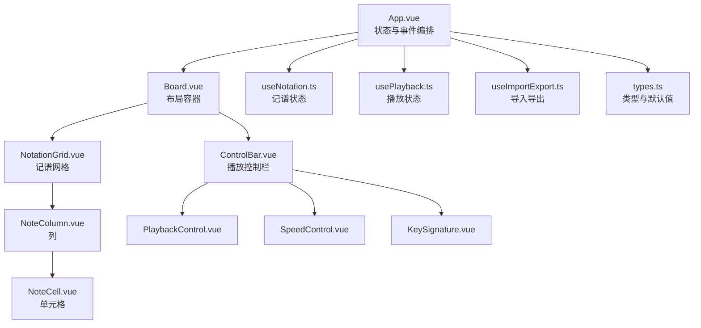
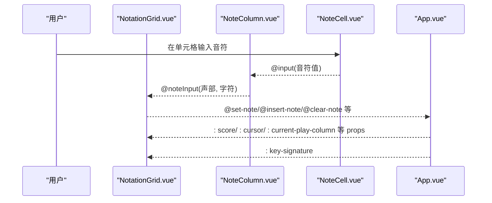
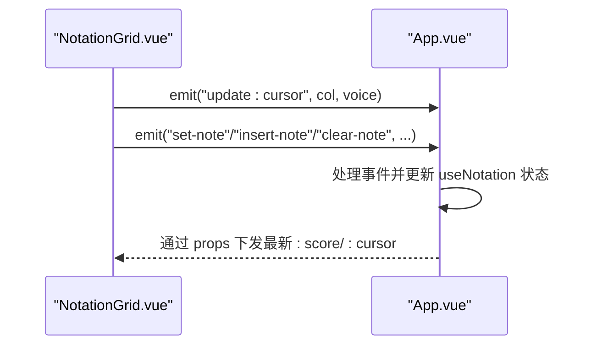
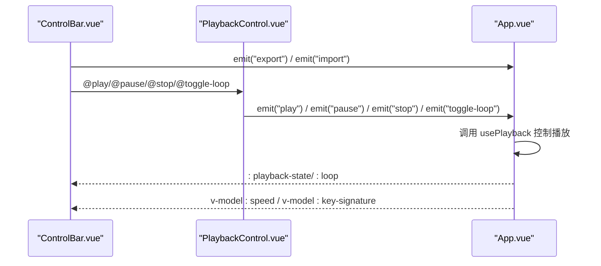
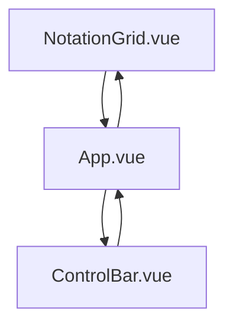
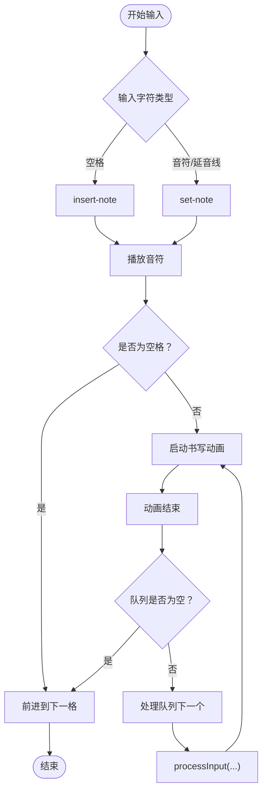
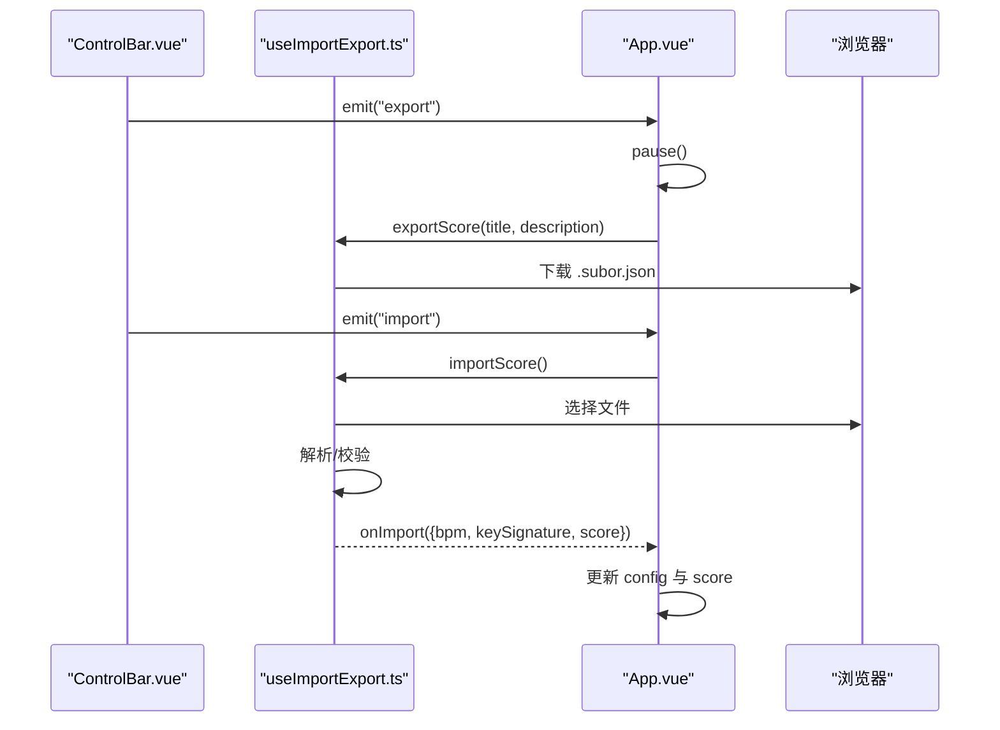
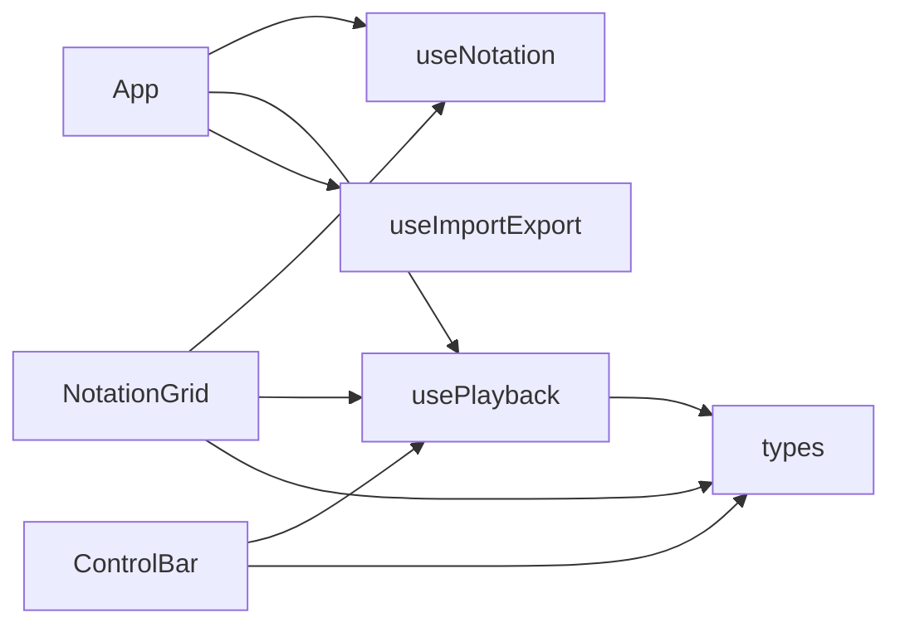

# 组件通信机制

<cite>
**本文引用的文件**
- [src/App.vue](file://src/App.vue)
- [src/components/Board.vue](file://src/components/Board.vue)
- [src/components/NotationGrid.vue](file://src/components/NotationGrid.vue)
- [src/components/NoteColumn.vue](file://src/components/NoteColumn.vue)
- [src/components/NoteCell.vue](file://src/components/NoteCell.vue)
- [src/components/ControlBar.vue](file://src/components/ControlBar.vue)
- [src/components/PlaybackControl.vue](file://src/components/PlaybackControl.vue)
- [src/components/SpeedControl.vue](file://src/components/SpeedControl.vue)
- [src/components/KeySignature.vue](file://src/components/KeySignature.vue)
- [src/composables/useNotation.ts](file://src/composables/useNotation.ts)
- [src/composables/usePlayback.ts](file://src/composables/usePlayback.ts)
- [src/composables/useImportExport.ts](file://src/composables/useImportExport.ts)
- [src/core/types.ts](file://src/core/types.ts)
</cite>

## 目录
1. [简介](#简介)
2. [项目结构](#项目结构)
3. [核心组件](#核心组件)
4. [架构总览](#架构总览)
5. [详细组件分析](#详细组件分析)
6. [依赖关系分析](#依赖关系分析)
7. [性能考量](#性能考量)
8. [故障排查指南](#故障排查指南)
9. [结论](#结论)
10. [附录](#附录)

## 简介
本文件系统性梳理 SUBOR Music Board 的组件通信机制，围绕以下目标展开：
- 明确父子组件通信：如 NotationGrid 向 App.vue 传递音符数据，ControlBar 向 App.vue 传递播放控制指令
- 解释兄弟组件通信：通过 App.vue 协调不同组件的状态同步
- 总结通信最佳实践：单向数据流、事件命名规范、状态提升等
- 提供设计模式与常见问题的解决方案

## 项目结构
应用采用“容器 + 展示”分层组织：
- 容器层：App.vue 负责状态管理与事件编排
- 展示层：Board.vue 作为布局容器，NotationGrid.vue 和 ControlBar.vue 承载具体交互
- 数据与业务逻辑：useNotation.ts、usePlayback.ts、useImportExport.ts 通过组合式函数提供跨组件共享能力
- 类型与常量：core/types.ts 定义了音符、光标、播放状态、BPM、调号等类型与默认值

图表来源
- [src/App.vue:102-138](file://src/App.vue#L102-L138)
- [src/components/Board.vue:3-9](file://src/components/Board.vue#L3-L9)
- [src/components/NotationGrid.vue:10-27](file://src/components/NotationGrid.vue#L10-L27)
- [src/components/NoteColumn.vue:6-18](file://src/components/NoteColumn.vue#L6-L18)
- [src/components/NoteCell.vue:7-17](file://src/components/NoteCell.vue#L7-L17)
- [src/components/ControlBar.vue:10-24](file://src/components/ControlBar.vue#L10-L24)
- [src/components/PlaybackControl.vue:4-7](file://src/components/PlaybackControl.vue#L4-L7)
- [src/components/SpeedControl.vue:5](file://src/components/SpeedControl.vue#L5)
- [src/components/KeySignature.vue:6](file://src/components/KeySignature.vue#L6)
- [src/composables/useNotation.ts:15-116](file://src/composables/useNotation.ts#L15-L116)
- [src/composables/usePlayback.ts:14-94](file://src/composables/usePlayback.ts#L14-L94)
- [src/composables/useImportExport.ts:18-137](file://src/composables/useImportExport.ts#L18-L137)
- [src/core/types.ts:1-164](file://src/core/types.ts#L1-L164)

章节来源
- [src/App.vue:102-138](file://src/App.vue#L102-L138)
- [src/components/Board.vue:3-9](file://src/components/Board.vue#L3-L9)
- [src/core/types.ts:98-138](file://src/core/types.ts#L98-L138)

## 核心组件
- App.vue：集中管理乐谱数据、播放状态、配置项（速度、调号），并提供导入导出等事件处理器
- NotationGrid.vue：负责渲染网格、键盘导航、输入处理、播放音符、书写动画与队列调度
- ControlBar.vue：提供速度、调号、播放控制、导入导出等控件
- useNotation.ts：提供乐谱数据结构、光标位置、增删改查与加载重置等方法
- usePlayback.ts：封装播放状态、当前列、循环标志与播放控制方法
- useImportExport.ts：封装导入导出流程与数据校验
- types.ts：统一定义类型、默认值与校验规则

章节来源
- [src/App.vue:13-100](file://src/App.vue#L13-L100)
- [src/composables/useNotation.ts:15-116](file://src/composables/useNotation.ts#L15-L116)
- [src/composables/usePlayback.ts:14-94](file://src/composables/usePlayback.ts#L14-L94)
- [src/composables/useImportExport.ts:18-137](file://src/composables/useImportExport.ts#L18-L137)
- [src/core/types.ts:62-138](file://src/core/types.ts#L62-L138)

## 架构总览
组件通信遵循“自上而下数据流 + 自下而上事件”的单向数据流原则：
- 父组件（App.vue）通过 props 向子组件传递只读数据
- 子组件通过 emit 事件向上报告用户操作与内部状态变更
- 通过组合式函数（useNotation、usePlayback、useImportExport）实现跨组件共享状态与副作用

图表来源
- [src/components/NotationGrid.vue:18-27](file://src/components/NotationGrid.vue#L18-L27)
- [src/components/NoteColumn.vue:13-18](file://src/components/NoteColumn.vue#L13-L18)
- [src/components/NoteCell.vue:12-17](file://src/components/NoteCell.vue#L12-L17)
- [src/App.vue:104-117](file://src/App.vue#L104-L117)

## 详细组件分析

### 父子组件通信：NotationGrid → App.vue（音符数据）
- 传递的数据（props）
  - 乐谱数据：score（二维数组，每列3个声部）
  - 光标位置：cursor（包含列索引与声部索引）
  - 当前列：current-play-column（播放进度指示）
  - 调号：key-signature
- 上报的事件（emits）
  - update:cursor
  - set-note、clear-note、insert-note、backspace-at、delete-at
  - play-note（内部使用）

图表来源
- [src/components/NotationGrid.vue:18-27](file://src/components/NotationGrid.vue#L18-L27)
- [src/App.vue:62-84](file://src/App.vue#L62-L84)
- [src/composables/useNotation.ts:103-116](file://src/composables/useNotation.ts#L103-L116)

章节来源
- [src/components/NotationGrid.vue:10-27](file://src/components/NotationGrid.vue#L10-L27)
- [src/App.vue:104-117](file://src/App.vue#L104-L117)
- [src/composables/useNotation.ts:15-116](file://src/composables/useNotation.ts#L15-L116)

### 父子组件通信：ControlBar → App.vue（播放控制）
- 传递的数据（props）
  - 播放状态：playback-state
  - 循环标志：loop
  - 速度与调号：v-model 双向绑定
- 上报的事件（emits）
  - play、pause、stop、toggle-loop
  - export、import

图表来源
- [src/components/ControlBar.vue:16-24](file://src/components/ControlBar.vue#L16-L24)
- [src/components/PlaybackControl.vue:9-14](file://src/components/PlaybackControl.vue#L9-L14)
- [src/App.vue:118-131](file://src/App.vue#L118-L131)
- [src/composables/usePlayback.ts:14-94](file://src/composables/usePlayback.ts#L14-L94)

章节来源
- [src/components/ControlBar.vue:10-24](file://src/components/ControlBar.vue#L10-L24)
- [src/components/PlaybackControl.vue:4-31](file://src/components/PlaybackControl.vue#L4-L31)
- [src/App.vue:118-131](file://src/App.vue#L118-L131)
- [src/composables/usePlayback.ts:14-94](file://src/composables/usePlayback.ts#L14-L94)

### 兄弟组件通信：通过 App.vue 协调
- NotationGrid 与 ControlBar 之间无直接依赖，通过 App.vue 进行协调
- App.vue 统一持有：
  - 乐谱数据与光标（useNotation）
  - 播放状态与当前列（usePlayback）
  - 速度、调号等配置
- 事件流：
  - NotationGrid 通过事件通知 App.vue 修改数据
  - App.vue 通过 props 将最新状态下发给两个子组件
  - ControlBar 通过事件通知 App.vue 触发播放控制

图表来源
- [src/App.vue:104-131](file://src/App.vue#L104-L131)
- [src/components/NotationGrid.vue:10-27](file://src/components/NotationGrid.vue#L10-L27)
- [src/components/ControlBar.vue:10-24](file://src/components/ControlBar.vue#L10-L24)

章节来源
- [src/App.vue:13-100](file://src/App.vue#L13-L100)
- [src/components/NotationGrid.vue:10-27](file://src/components/NotationGrid.vue#L10-L27)
- [src/components/ControlBar.vue:10-24](file://src/components/ControlBar.vue#L10-L24)

### 输入处理与播放联动（复杂逻辑）
- NotationGrid 对输入进行队列缓冲，保证每格依次处理
- 按输入字符类型分派写入行为：音符/延音线覆盖写入，空格插入右移，Backspace 回删左移、Delete 清空当前格
- 输入完成后播放音符并触发声部书写动画，动画结束后自动前进到下一格

图表来源
- [src/components/NotationGrid.vue:112-156](file://src/components/NotationGrid.vue#L112-L156)
- [src/components/NoteCell.vue:68-115](file://src/components/NoteCell.vue#L68-L115)

章节来源
- [src/components/NotationGrid.vue:112-177](file://src/components/NotationGrid.vue#L112-L177)
- [src/components/NoteCell.vue:68-177](file://src/components/NoteCell.vue#L68-L177)

### 导入导出流程
- 导出：收集当前 BPM、调号、乐谱，生成 JSON 并下载
- 导入：选择文件、解析 JSON、校验版本与字段、调用 onImport 回调更新 App.vue 状态

图表来源
- [src/components/ControlBar.vue:21-23](file://src/components/ControlBar.vue#L21-L23)
- [src/App.vue:86-99](file://src/App.vue#L86-L99)
- [src/composables/useImportExport.ts:24-79](file://src/composables/useImportExport.ts#L24-L79)

章节来源
- [src/App.vue:44-53](file://src/App.vue#L44-L53)
- [src/composables/useImportExport.ts:18-137](file://src/composables/useImportExport.ts#L18-L137)

## 依赖关系分析
- 组件依赖
  - App.vue 依赖 useNotation、usePlayback、useImportExport
  - NotationGrid 依赖 NoteColumn、Quill（通过组合式函数与引擎）
  - ControlBar 依赖 KeySignature、SpeedControl、PlaybackControl
- 类型与默认值
  - types.ts 提供 Score、CursorPosition、PlaybackState、KeySignature、BPM_LIST 等
- 关键耦合点
  - NotationGrid 与 ControlBar 通过 App.vue 解耦
  - usePlayback 通过 watch 监听 BPM 与调号变化，驱动底层 sequencer

图表来源
- [src/App.vue:13-53](file://src/App.vue#L13-L53)
- [src/components/NotationGrid.vue:54-54](file://src/components/NotationGrid.vue#L54-L54)
- [src/components/ControlBar.vue:2-4](file://src/components/ControlBar.vue#L2-L4)
- [src/composables/usePlayback.ts:1-12](file://src/composables/usePlayback.ts#L1-L12)
- [src/core/types.ts:1-164](file://src/core/types.ts#L1-L164)

章节来源
- [src/App.vue:13-53](file://src/App.vue#L13-L53)
- [src/composables/usePlayback.ts:14-42](file://src/composables/usePlayback.ts#L14-L42)
- [src/core/types.ts:102-138](file://src/core/types.ts#L102-L138)

## 性能考量
- 输入队列与动画节流：NotationGrid 使用队列与布尔标志避免并发输入导致的错位与闪烁
- 只读数据与浅层更新：useNotation 返回 readonly 的 score/cursor，减少意外修改；App.vue 通过 toRef 将响应式配置暴露给 usePlayback
- 监听开销：usePlayback 对 BPM 与调号使用 watch，初始即设置，避免额外初始化成本
- DOM 操作最小化：通过 nextTick 与 ref 聚焦，减少不必要的重绘

章节来源
- [src/components/NotationGrid.vue:58-156](file://src/components/NotationGrid.vue#L58-L156)
- [src/App.vue:38-42](file://src/App.vue#L38-L42)
- [src/composables/usePlayback.ts:33-41](file://src/composables/usePlayback.ts#L33-L41)

## 故障排查指南
- 输入无效字符
  - 现象：输入框抖动或无法输入
  - 原因：NoteCell 对单字符进行合法性校验
  - 处理：确保输入符合合法字符集
  - 参考路径：[src/components/NoteCell.vue:72-79](file://src/components/NoteCell.vue#L72-L79)
- Backspace/Delete 行为异常
  - 现象：删除后音符位移不符合预期
  - 原因：不同按键的位移策略不同（空格插入右移、Backspace 左移填补、Delete 仅清空当前格）
  - 处理：检查 NotationGrid 的 Backspace/Delete 分支
  - 参考路径：[src/components/NotationGrid.vue:163-177](file://src/components/NotationGrid.vue#L163-L177)
- 播放状态不同步
  - 现象：播放按钮状态与实际播放不一致
  - 原因：ControlBar 与 usePlayback 状态未及时同步
  - 处理：确认 App.vue 是否正确下发 playback-state 与 loop，并检查 usePlayback 的 watch 逻辑
  - 参考路径：[src/App.vue:118-131](file://src/App.vue#L118-L131), [src/composables/usePlayback.ts:17-31](file://src/composables/usePlayback.ts#L17-L31)
- 导入失败
  - 现象：弹出错误提示或未生效
  - 原因：文件格式不符或版本不支持
  - 处理：检查文件扩展名与 JSON 结构，确认版本号与字段完整性
  - 参考路径：[src/composables/useImportExport.ts:63-76](file://src/composables/useImportExport.ts#L63-L76), [src/composables/useImportExport.ts:84-131](file://src/composables/useImportExport.ts#L84-L131)

章节来源
- [src/components/NoteCell.vue:72-79](file://src/components/NoteCell.vue#L72-L79)
- [src/components/NotationGrid.vue:163-177](file://src/components/NotationGrid.vue#L163-L177)
- [src/App.vue:118-131](file://src/App.vue#L118-L131)
- [src/composables/usePlayback.ts:17-31](file://src/composables/usePlayback.ts#L17-L31)
- [src/composables/useImportExport.ts:63-76](file://src/composables/useImportExport.ts#L63-L76)
- [src/composables/useImportExport.ts:84-131](file://src/composables/useImportExport.ts#L84-L131)

## 结论
本项目通过清晰的单向数据流与事件上报机制，实现了记谱输入、播放控制与导入导出的稳定协作。NotationGrid 与 ControlBar 通过 App.vue 解耦，既保持了组件职责单一，又便于扩展与维护。建议在后续迭代中持续坚持：
- 严格遵守单向数据流与事件命名规范
- 将跨组件共享状态收敛到组合式函数
- 对复杂交互（如输入队列、播放动画）进行充分测试与边界条件覆盖

## 附录
- 事件命名规范
  - 上报事件：set-note、clear-note、insert-note、backspace-at、delete-at、update:cursor
  - 控制事件：play、pause、stop、toggle-loop、export、import
- 状态提升原则
  - 将共享状态（乐谱、播放状态、配置）置于 App.vue
  - 通过 props 下发只读数据，通过 emits 接收变更请求
- 设计模式
  - 组合式函数（useNotation/usePlayback/useImportExport）用于状态与副作用的复用
  - Slot 容器（Board.vue）承载布局与插槽内容