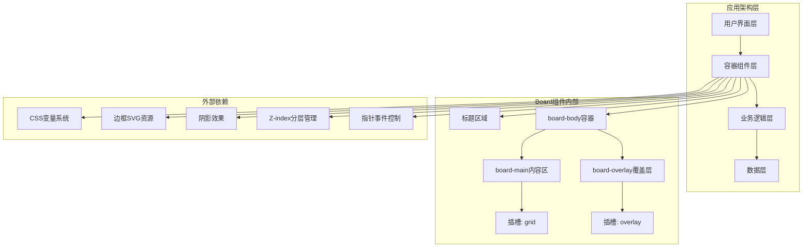
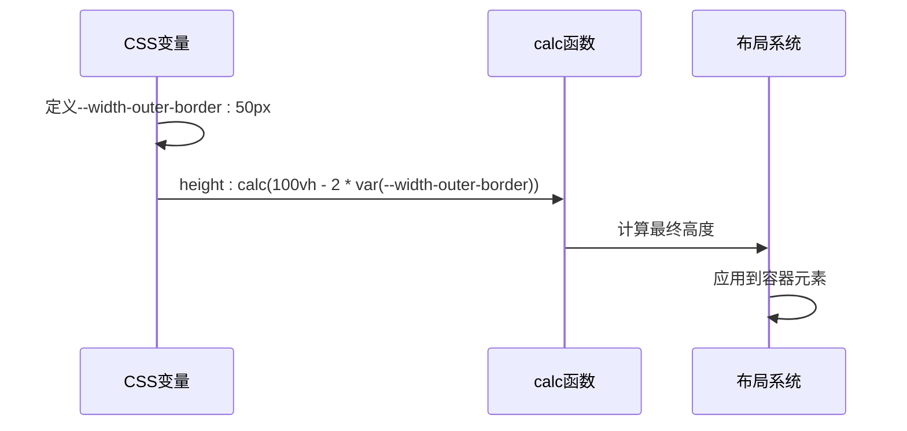
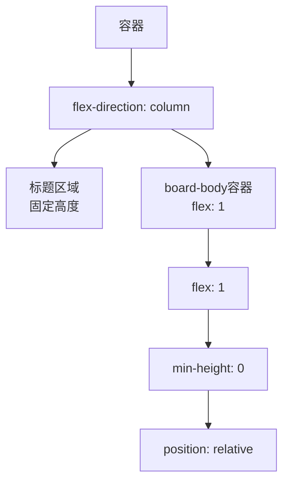
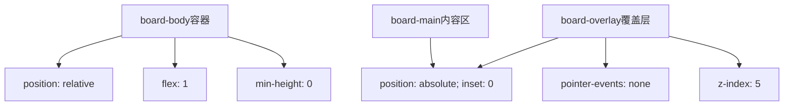
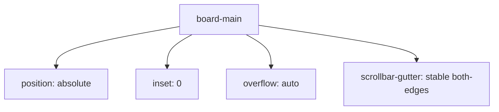
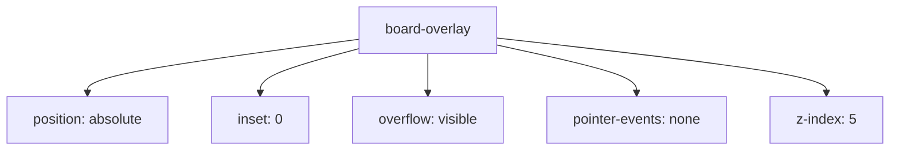
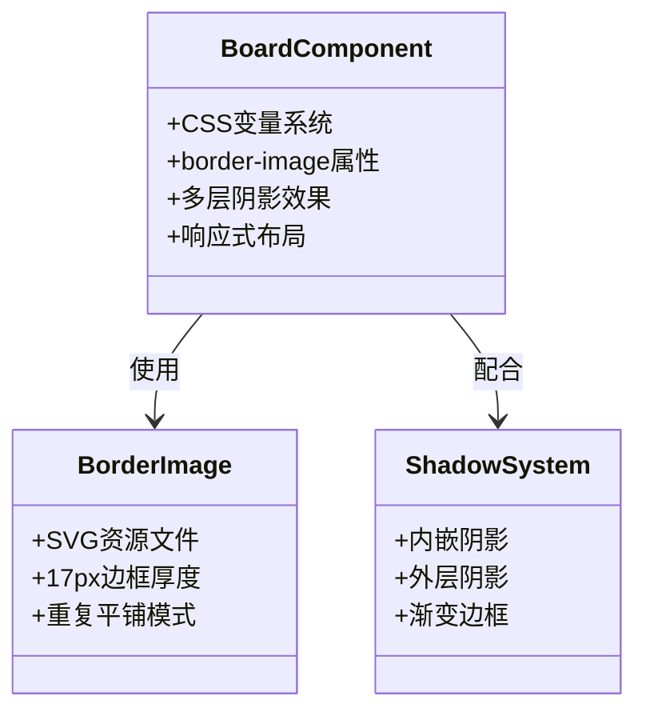
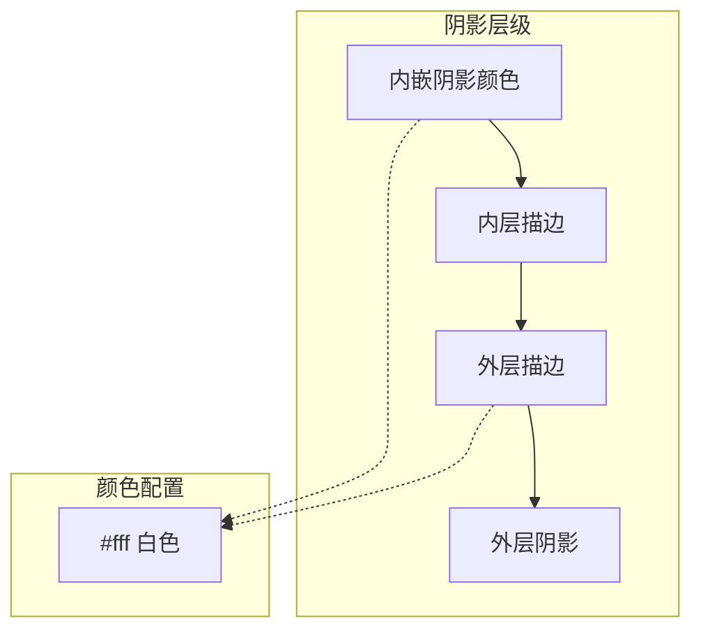
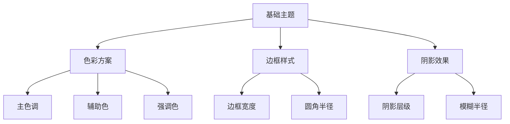

# Board主容器组件

<cite>
**本文档引用的文件**
- [Board.vue](file://src/components/Board.vue)
- [App.vue](file://src/App.vue)
- [style.css](file://src/style.css)
- [main.ts](file://src/main.ts)
- [package.json](file://package.json)
- [index.html](file://index.html)
- [NotationGrid.vue](file://src/components/NotationGrid.vue)
- [ControlBar.vue](file://src/components/ControlBar.vue)
- [Quill.vue](file://src/components/Quill.vue)
</cite>

## 更新摘要
**变更内容**
- 更新了Board组件的架构分析，反映从简单布局到board-body容器的新结构
- 新增了board-main和board-overlay容器的详细说明
- 增强了交互元素分层和z-index管理的说明
- 更新了组件层次结构图以反映新的布局架构

## 目录
1. [简介](#简介)
2. [项目结构](#项目结构)
3. [核心组件](#核心组件)
4. [架构概览](#架构概览)
5. [详细组件分析](#详细组件分析)
6. [依赖分析](#依赖分析)
7. [性能考虑](#性能考虑)
8. [故障排除指南](#故障排除指南)
9. [结论](#结论)

## 简介

Board主容器组件是SUBOR音乐板应用的核心UI框架，采用NES.css风格设计语言，为整个音乐记谱应用提供统一的视觉外观和布局结构。该组件不仅承担着应用的主容器职责，还通过精心设计的CSS变量系统实现了高度可定制的主题适配能力。

Board组件的设计理念体现了复古电子游戏美学与现代Web技术的完美结合，通过响应式布局策略、精美的边框装饰系统和多层次阴影效果，营造出独特的视觉体验。组件采用Vue 3 Composition API构建，充分利用了现代前端开发的最佳实践。

**更新** 组件架构已从简单的board-main布局迁移到board-body容器结构，包含board-main和board-overlay两个独立的容器，支持更精确的交互元素分层管理。

## 项目结构

该项目采用基于功能模块的组织方式，Board组件位于components目录下，作为应用的根容器组件，负责协调各个子组件的布局和交互。

```mermaid
graph TB
subgraph "应用入口"
Index[index.html]
Main[main.ts]
App[App.vue]
end
subgraph "核心组件"
Board[Board.vue]
NotationGrid[NotationGrid.vue]
ControlBar[ControlBar.vue]
Quill[Quill.vue]
InkBottle[InkBottle.vue]
ExportDialog[ExportDialog.vue]
ClearDialog[ClearDialog.vue]
HelpDialog[HelpDialog.vue]
end
subgraph "样式系统"
Style[style.css]
Theme[主题变量]
end
subgraph "外部依赖"
Vue[Vue 3]
NES[nes.css]
FontSource[@fontsource/press-start-2p]
end
Index --> Main
Main --> App
App --> Board
Board --> NotationGrid
Board --> ControlBar
Board --> Quill
Board --> InkBottle
Board --> ExportDialog
Board --> ClearDialog
Board --> HelpDialog
Board --> Style
Main --> Vue
Main --> NES
Main --> FontSource
```

**图表来源**
- [index.html:1-14](file://index.html#L1-L14)
- [main.ts:1-7](file://src/main.ts#L1-L7)
- [App.vue:102-138](file://src/App.vue#L102-L138)

**章节来源**
- [index.html:1-14](file://index.html#L1-L14)
- [main.ts:1-7](file://src/main.ts#L1-L7)
- [package.json:1-25](file://package.json#L1-L25)

## 核心组件

Board主容器组件是应用的根UI容器，采用简洁而强大的设计原则。组件结构包含标题区域、board-body容器、board-main内容区域、#footer控制区域和board-overlay覆盖层，形成了清晰的分层布局结构。

### 组件结构分析

Board组件采用四层式布局设计：
- **标题区域**：显示"MUSIC BOARD"标题，采用NES风格边框装饰
- **board-body容器**：作为内容区域的容器，支持绝对定位和z-index分层
- **board-main内容区**：#grid记谱网格（NotationGrid）的主要内容，使用绝对定位占满容器
- **#footer控制区**：承载ControlBar与ExportDialog/ClearDialog/HelpDialog对话框
- **board-overlay覆盖层**：#overlay交互元素覆盖层（Quill羽毛笔与InkBottle墨瓶），支持指针事件穿透

### 响应式布局策略

组件实现了完整的响应式布局体系，通过CSS变量和calc函数实现动态尺寸调整：

```mermaid
flowchart TD
Viewport[视口高度] --> CalcHeight[calc(100vh - 2 * var(--width-outer-border)))
OuterBorder[外边框宽度变量] --> CalcHeight
CalcHeight --> BoardHeight[最终容器高度]
WidthCalc[36em固定宽度] --> BoardWidth[容器宽度]
AutoMargin[auto自动居中] --> Centering[水平居中布局]
OuterBorder --> AutoMargin
```

**图表来源**
- [Board.vue:18](file://src/components/Board.vue#L18)
- [Board.vue:19](file://src/components/Board.vue#L19)
- [Board.vue:20](file://src/components/Board.vue#L20)

**章节来源**
- [Board.vue:1-68](file://src/components/Board.vue#L1-L68)

## 架构概览

Board组件在整个应用架构中扮演着关键角色，作为所有业务组件的容器，它定义了应用的整体视觉风格和布局规范。



**图表来源**
- [Board.vue:3](file://src/components/Board.vue#L3-L9)
- [Board.vue:12](file://src/components/Board.vue#L12-L68)

**章节来源**
- [App.vue:102-138](file://src/App.vue#L102-L138)
- [Board.vue:1-68](file://src/components/Board.vue#L1-L68)

## 详细组件分析

### CSS变量系统

Board组件采用了现代化的CSS变量系统，其中最重要的变量是`--width-outer-border`，它定义了容器的外边框宽度。

#### 变量作用机制



**图表来源**
- [Board.vue:14](file://src/components/Board.vue#L14)
- [Board.vue:18](file://src/components/Board.vue#L18)

#### 自适应计算原理

变量系统实现了真正的响应式设计：
- **动态高度**：通过`calc(100vh - 2 * var(--width-outer-border))`实现
- **比例保持**：外边框宽度变化时，内容区域自动调整
- **全局控制**：修改变量值即可统一调整所有相关元素

### Flex布局实现

Board组件采用Flexbox实现垂直布局，通过`flex: 1`属性实现内容区域的自适应填充。

#### 布局算法



**图表来源**
- [Board.vue:16](file://src/components/Board.vue#L16)
- [Board.vue:17](file://src/components/Board.vue#L17)
- [Board.vue:47](file://src/components/Board.vue#L47)
- [Board.vue:48](file://src/components/Board.vue#L48)
- [Board.vue:50](file://src/components/Board.vue#L50)

#### 居中定位机制

组件通过`margin: var(--width-outer-border) auto`实现水平居中，同时保持垂直方向的精确控制。

### Board-body容器架构

**更新** 新增了board-body容器作为中间层，支持board-main和board-overlay的绝对定位分层。

#### 容器设计原理



**图表来源**
- [Board.vue:47](file://src/components/Board.vue#L47)
- [Board.vue:53](file://src/components/Board.vue#L53)
- [Board.vue:60](file://src/components/Board.vue#L60)

#### 分层设计理念

- **board-main**：主要内容区域，使用绝对定位占满容器，支持滚动和稳定滚动条
- **board-overlay**：覆盖层区域，使用绝对定位和z-index分层，支持指针事件穿透
- **交互分离**：通过分层实现内容和交互元素的精确控制

### Board-main内容区

**更新** board-main现在作为主要内容容器，使用绝对定位和稳定滚动条管理。

#### 绝对定位策略



**图表来源**
- [Board.vue:53](file://src/components/Board.vue#L53)
- [Board.vue:54](file://src/components/Board.vue#L54)
- [Board.vue:55](file://src/components/Board.vue#L55)
- [Board.vue:56](file://src/components/Board.vue#L56)
- [Board.vue:57](file://src/components/Board.vue#L57)

#### 滚动条管理

- **稳定滚动条**：`scrollbar-gutter: stable both-edges`确保滚动条空间稳定
- **溢出处理**：支持内容溢出时的滚动行为
- **绝对定位**：与其他层形成精确的布局关系

### Board-overlay覆盖层

**更新** 新增的覆盖层容器，专门用于放置交互元素，支持指针事件控制和z-index管理。

#### 覆盖层特性



**图表来源**
- [Board.vue:60](file://src/components/Board.vue#L60)
- [Board.vue:61](file://src/components/Board.vue#L61)
- [Board.vue:62](file://src/components/Board.vue#L62)
- [Board.vue:63](file://src/components/Board.vue#L63)
- [Board.vue:64](file://src/components/Board.vue#L64)
- [Board.vue:65](file://src/components/Board.vue#L65)
- [Board.vue:66](file://src/components/Board.vue#L66)

#### 指针事件控制

- **事件穿透**：`pointer-events: none`允许鼠标事件传递到底层内容
- **z-index分层**：`z-index: 5`确保覆盖层在内容层之上但不影响交互
- **可见性管理**：`overflow: visible`允许内容超出容器边界显示

### NES.css风格边框系统

Board组件实现了经典的NES风格边框装饰，通过`border-image`属性和SVG资源实现。

#### 边框装饰实现



**图表来源**
- [Board.vue:24](file://src/components/Board.vue#L24)
- [Board.vue:25](file://src/components/Board.vue#L25)
- [Board.vue:26](file://src/components/Board.vue#L26)
- [Board.vue:27](file://src/components/Board.vue#L27)
- [Board.vue:28](file://src/components/Board.vue#L28)

#### SVG边框资源集成

边框系统通过`url(../assets/border.svg)`引入SVG资源，实现了矢量化的边框装饰，具有以下优势：
- **无损缩放**：任意分辨率下保持清晰度
- **颜色可定制**：可通过CSS变量调整颜色
- **性能优化**：单次加载，多处复用

### 阴影效果实现

Board组件采用了多层次的阴影效果，营造出立体的视觉深度感。

#### 阴影层级结构



**图表来源**
- [Board.vue:26](file://src/components/Board.vue#L26)
- [Board.vue:27](file://src/components/Board.vue#L27)
- [Board.vue:28](file://src/components/Board.vue#L28)

### 样式定制方法

Board组件提供了多种定制化选项，支持主题适配和视觉风格调整。

#### 主题适配指南



**章节来源**
- [Board.vue:13](file://src/components/Board.vue#L13)
- [Board.vue:31](file://src/components/Board.vue#L31)
- [Board.vue:41](file://src/components/Board.vue#L41)

## 依赖分析

Board组件的依赖关系相对简单，主要依赖于Vue框架和外部样式库。

```mermaid
graph TB
subgraph "Board组件依赖"
VueFramework[Vue 3框架]
CSSVariables[CSS变量系统]
SVGResources[SVG边框资源]
BoardBody[board-body容器]
BoardMain[board-main内容区]
BoardOverlay[board-overlay覆盖层]
SlotGrid[grid插槽]
SlotOverlay[overlay插槽]
end
subgraph "外部库依赖"
NESCORE[nes.css核心样式]
PressStart[Press Start 2P字体]
FontSource[@fontsource/press-start-2p]
end
subgraph "应用集成"
AppContainer[App.vue容器]
MainEntry[main.ts入口]
GlobalStyle[全局样式]
NotationGrid[记谱网格组件]
ControlBar[控制栏组件]
Quill[羽毛笔组件]
InkBottle[墨水瓶组件]
ExportDialog[导出对话框组件]
ClearDialog[清空对话框组件]
HelpDialog[帮助对话框组件]
end
Board[Board.vue] --> VueFramework
Board --> CSSVariables
Board --> SVGResources
Board --> BoardBody
Board --> BoardMain
Board --> BoardOverlay
Board --> SlotGrid
Board --> SlotOverlay
MainEntry --> NESCORE
MainEntry --> FontSource
AppContainer --> Board
Board --> NotationGrid
Board --> ControlBar
Board --> Quill
Board --> InkBottle
Board --> ExportDialog
Board --> ClearDialog
Board --> HelpDialog
GlobalStyle --> Board
```

**图表来源**
- [main.ts:2](file://src/main.ts#L2)
- [main.ts:3](file://src/main.ts#L3)
- [package.json:11](file://package.json#L11)
- [package.json:12](file://package.json#L12)
- [package.json:13](file://package.json#L13)

**章节来源**
- [main.ts:1-7](file://src/main.ts#L1-L7)
- [package.json:1-25](file://package.json#L1-L25)

## 性能考虑

Board组件在设计时充分考虑了性能优化，采用了多项最佳实践。

### 渲染性能优化

- **CSS变量缓存**：浏览器会缓存CSS变量计算结果
- **硬件加速**：阴影效果利用GPU加速渲染
- **最小重绘**：布局系统减少不必要的DOM操作
- **绝对定位优化**：避免复杂的布局计算

### 资源加载优化

- **SVG内联**：边框资源体积小，加载速度快
- **字体预加载**：通过@fontsource实现字体资源管理
- **样式分离**：CSS与JavaScript分离，便于缓存
- **z-index优化**：合理使用z-index减少重排

### 交互性能优化

- **指针事件控制**：通过`pointer-events: none`优化事件处理
- **稳定滚动条**：`scrollbar-gutter: stable both-edges`避免布局抖动
- **绝对定位分层**：减少DOM层级复杂度

## 故障排除指南

### 常见问题及解决方案

#### 边框显示异常

**问题描述**：边框无法正常显示或显示不完整

**可能原因**：
- SVG资源路径错误
- CSS变量未正确解析
- 浏览器兼容性问题

**解决方案**：
1. 检查SVG文件路径是否正确
2. 验证CSS变量语法格式
3. 确认目标浏览器支持border-image属性

#### 响应式布局失效

**问题描述**：组件在不同屏幕尺寸下显示异常

**可能原因**：
- 视口设置不正确
- CSS单位转换问题
- 外边框变量值过大

**解决方案**：
1. 确认HTML中包含正确的viewport meta标签
2. 检查em单位与rem单位的转换关系
3. 调整--width-outer-border变量值

#### 阴影效果不生效

**问题描述**：阴影效果在某些浏览器中显示异常

**可能原因**：
- 浏览器对box-shadow属性的支持差异
- 阴影参数设置不当
- z-index层级冲突

**解决方案**：
1. 检查各浏览器的box-shadow支持情况
2. 简化阴影参数组合
3. 调整元素的z-index层级

#### 覆盖层交互问题

**问题描述**：覆盖层中的交互元素无法响应点击事件

**可能原因**：
- `pointer-events: none`影响了覆盖层交互
- z-index层级设置不当
- 绝对定位导致的层级冲突

**解决方案**：
1. 检查覆盖层的指针事件设置
2. 确认z-index层级的正确性
3. 验证绝对定位的inset属性

**章节来源**
- [Board.vue:14](file://src/components/Board.vue#L14)
- [Board.vue:18](file://src/components/Board.vue#L18)
- [Board.vue:24](file://src/components/Board.vue#L24)

## 结论

Board主容器组件成功地将NES.css的经典美学与现代Web技术相结合，创造出了既具有复古韵味又具备现代功能的UI框架。组件通过精心设计的CSS变量系统、灵活的响应式布局和精美的视觉效果，为SUBOR音乐板应用奠定了坚实的视觉基础。

**更新** 最新的架构改进从简单的board-main布局迁移到了board-body容器结构，包含board-main和board-overlay两个独立的容器，这一变化显著提升了组件的交互能力和布局灵活性。

该组件的设计体现了以下核心价值：
- **一致性**：统一的视觉风格和交互体验
- **可扩展性**：模块化的组件结构便于功能扩展
- **可维护性**：清晰的代码结构和完善的注释体系
- **性能优化**：高效的渲染机制和资源管理
- **交互分离**：通过分层架构实现内容和交互的精确控制

通过合理的样式定制方法和主题适配指南，开发者可以轻松地根据需求调整组件的外观，同时保持整体设计的一致性和用户体验的连贯性。新的board-body架构为未来的功能扩展和交互增强提供了坚实的基础。