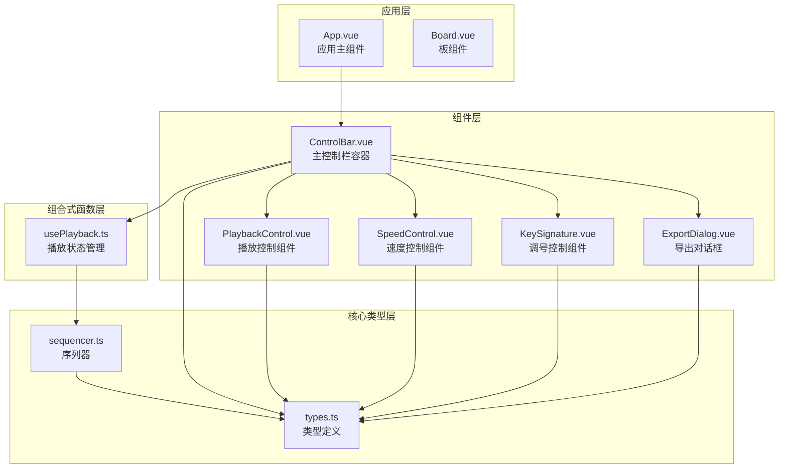
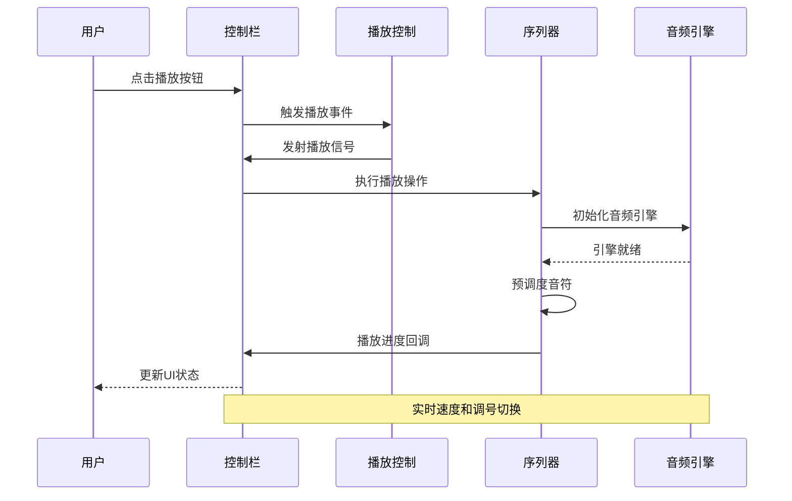
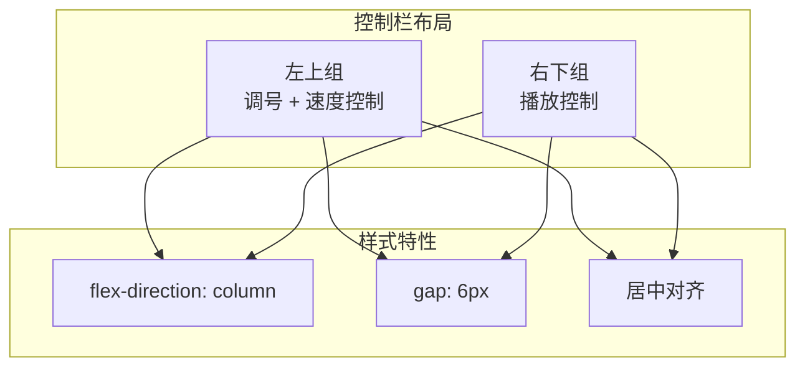
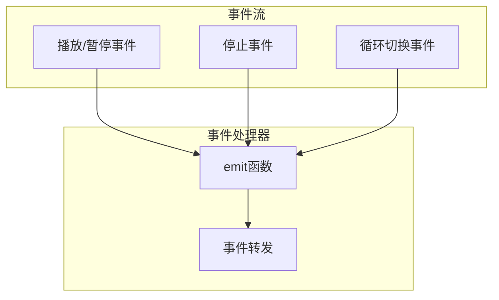
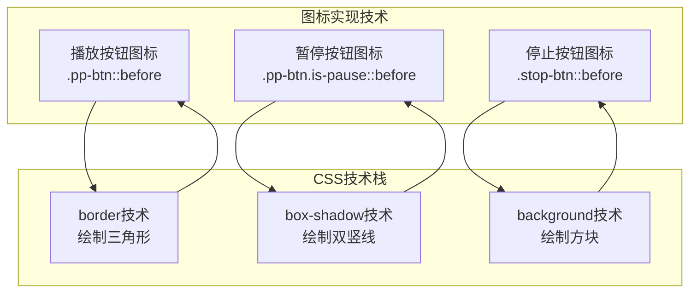
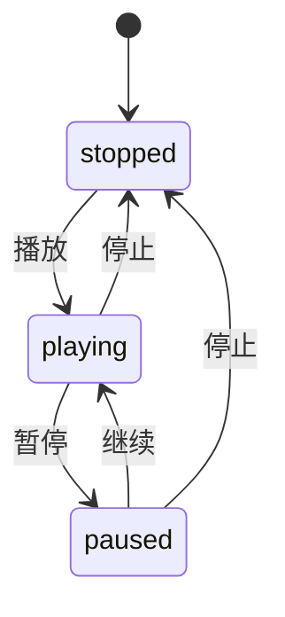
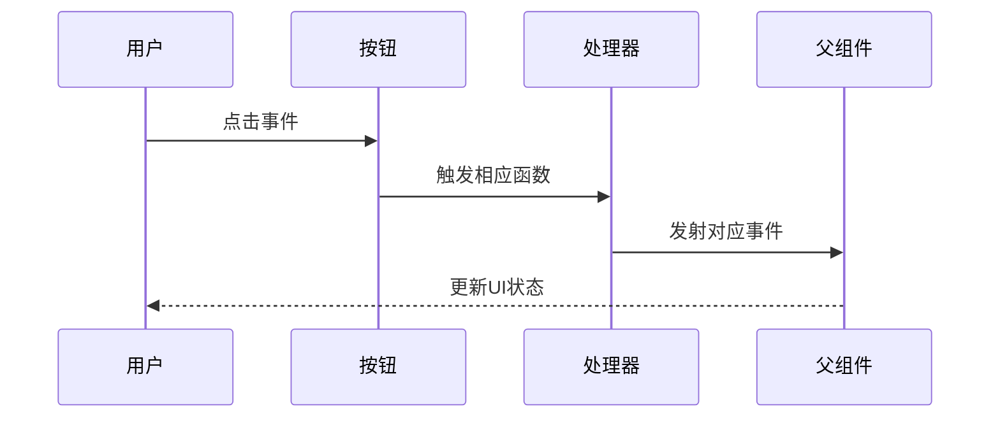
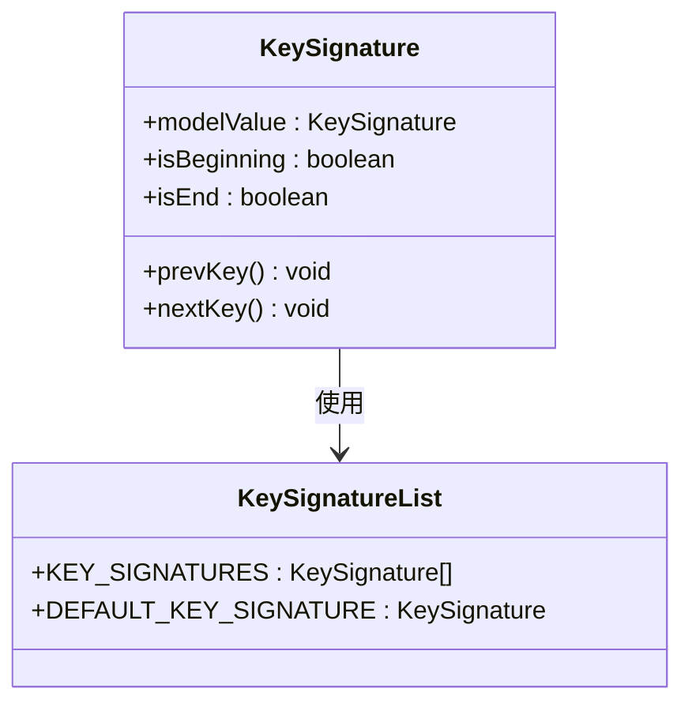
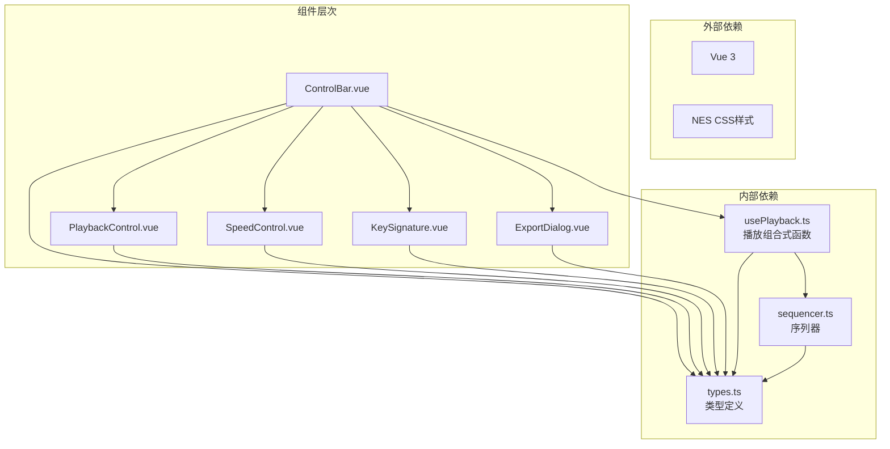

# 控制栏组件

<cite>
**本文档引用的文件**
- [ControlBar.vue](file://src/components/ControlBar.vue)
- [PlaybackControl.vue](file://src/components/PlaybackControl.vue)
- [SpeedControl.vue](file://src/components/SpeedControl.vue)
- [KeySignature.vue](file://src/components/KeySignature.vue)
- [ExportDialog.vue](file://src/components/ExportDialog.vue)
- [usePlayback.ts](file://src/composables/usePlayback.ts)
- [types.ts](file://src/core/types.ts)
- [sequencer.ts](file://src/core/sequencer.ts)
- [App.vue](file://src/App.vue)
- [Board.vue](file://src/components/Board.vue)
</cite>

## 更新摘要
**变更内容**
- 更新PlaybackControl组件的视觉实现：使用CSS伪元素替代文本标签实现图标化按钮
- 新增ExportDialog组件的实时标题验证功能
- 增强控件的视觉反馈和用户体验

## 目录
1. [简介](#简介)
2. [项目结构](#项目结构)
3. [核心组件](#核心组件)
4. [架构概览](#架构概览)
5. [详细组件分析](#详细组件分析)
6. [依赖关系分析](#依赖关系分析)
7. [性能考虑](#性能考虑)
8. [故障排除指南](#故障排除指南)
9. [结论](#结论)

## 简介

控制栏组件是音乐编辑器界面的重要组成部分，负责提供用户与音乐播放系统交互的统一入口。该组件采用模块化设计，集成了播放控制、速度调节、调号选择等功能，为用户提供直观便捷的音乐创作体验。

控制栏组件采用响应式设计，并与底层音乐引擎深度集成，实现了从UI层到音频输出的完整控制链路。最新的视觉增强通过CSS伪元素技术实现了图标化按钮，提升了界面的专业性和一致性。

## 项目结构

控制栏相关的组件分布在以下目录结构中：



**图表来源**
- [ControlBar.vue:1-116](file://src/components/ControlBar.vue#L1-L116)
- [PlaybackControl.vue:1-111](file://src/components/PlaybackControl.vue#L1-L111)
- [SpeedControl.vue:1-68](file://src/components/SpeedControl.vue#L1-L68)
- [KeySignature.vue:1-55](file://src/components/KeySignature.vue#L1-L55)
- [ExportDialog.vue:1-119](file://src/components/ExportDialog.vue#L1-L119)
- [usePlayback.ts:1-95](file://src/composables/usePlayback.ts#L1-L95)
- [types.ts:1-164](file://src/core/types.ts#L1-L164)
- [sequencer.ts:1-354](file://src/core/sequencer.ts#L1-L354)
- [App.vue:1-138](file://src/App.vue#L1-L138)
- [Board.vue:1-47](file://src/components/Board.vue#L1-L47)

**章节来源**
- [ControlBar.vue:1-116](file://src/components/ControlBar.vue#L1-L116)
- [App.vue:1-138](file://src/App.vue#L1-L138)

## 核心组件

控制栏组件由五个主要子组件构成，每个组件都有明确的职责分工：

### 主控制栏容器
ControlBar.vue作为顶层容器，负责组织和协调各个子组件，提供统一的事件接口和数据绑定机制。

### 播放控制组件
PlaybackControl.vue专门处理音乐播放的各种操作，包括播放/暂停切换、停止、循环播放等核心功能。**最新更新**：采用CSS伪元素技术实现图标化按钮，替代传统的文本标签，提供更专业的视觉效果。

### 速度控制组件
SpeedControl.vue提供速度调节功能，支持预设的速度档位选择和实时速度调整。

### 调号控制组件
KeySignature.vue负责调号的管理和切换，支持不同调性的快速切换和显示。

### 导出对话框组件
ExportDialog.vue提供乐谱导出功能，包含标题输入和描述输入，**新增功能**：实时标题验证确保用户必须输入有效的标题才能导出乐谱。

**章节来源**
- [ControlBar.vue:1-116](file://src/components/ControlBar.vue#L1-L116)
- [PlaybackControl.vue:1-111](file://src/components/PlaybackControl.vue#L1-L111)
- [SpeedControl.vue:1-68](file://src/components/SpeedControl.vue#L1-L68)
- [KeySignature.vue:1-55](file://src/components/KeySignature.vue#L1-L55)
- [ExportDialog.vue:1-119](file://src/components/ExportDialog.vue#L1-L119)

## 架构概览

控制栏组件采用分层架构设计，实现了UI层、业务逻辑层和音频引擎层的有效分离：



**图表来源**
- [ControlBar.vue:16-24](file://src/components/ControlBar.vue#L16-L24)
- [PlaybackControl.vue:9-14](file://src/components/PlaybackControl.vue#L9-L14)
- [usePlayback.ts:46-49](file://src/composables/usePlayback.ts#L46-L49)
- [sequencer.ts:144-167](file://src/core/sequencer.ts#L144-L167)

该架构实现了以下关键特性：
- **事件驱动**: 通过Vue的事件系统实现组件间通信
- **状态管理**: 使用响应式数据确保UI与业务状态同步
- **解耦设计**: 各组件职责明确，便于维护和扩展
- **实时反馈**: 播放进度通过回调机制实时更新

## 详细组件分析

### ControlBar 主控制栏组件

ControlBar作为顶层容器，采用了灵活的布局设计和事件转发机制：

#### 布局设计策略
组件采用两行布局结构，通过CSS Flexbox实现响应式排列：



**图表来源**
- [ControlBar.vue:27-67](file://src/components/ControlBar.vue#L27-L67)
- [ControlBar.vue:69-115](file://src/components/ControlBar.vue#L69-L115)

#### 数据绑定机制
ControlBar使用Vue的defineModel实现双向数据绑定：

- `speed`: 速度控制参数，支持v-model绑定
- `keySignature`: 调号控制参数，支持v-model绑定

#### 事件处理系统
组件定义了完整的事件发射接口，向上层应用传递用户操作：



**图表来源**
- [ControlBar.vue:16-24](file://src/components/ControlBar.vue#L16-L24)

**章节来源**
- [ControlBar.vue:1-116](file://src/components/ControlBar.vue#L1-L116)

### PlaybackControl 播放控制组件

PlaybackControl组件实现了音乐播放的核心控制功能，具有简洁而高效的UI设计。**最新视觉增强**：完全采用CSS伪元素技术实现图标化按钮，替代传统的文本标签。

#### 图标化按钮实现

组件使用CSS伪元素::before实现各种图标：



**图表来源**
- [PlaybackControl.vue:75-98](file://src/components/PlaybackControl.vue#L75-L98)
- [PlaybackControl.vue:101-109](file://src/components/PlaybackControl.vue#L101-L109)

#### 状态管理机制



**图表来源**
- [PlaybackControl.vue:16-30](file://src/components/PlaybackControl.vue#L16-L30)
- [types.ts:71-72](file://src/core/types.ts#L71-L72)

#### UI交互设计
组件采用NES风格的按钮设计，通过CSS伪元素实现图标绘制：

- **播放/暂停按钮**: 使用CSS边框技术绘制三角形图标，暂停时使用box-shadow绘制两条竖线
- **停止按钮**: 使用background技术绘制实心方块图标
- **循环复选框**: 提供视觉反馈的循环播放控制

#### 事件处理流程



**图表来源**
- [PlaybackControl.vue:16-30](file://src/components/PlaybackControl.vue#L16-L30)

**章节来源**
- [PlaybackControl.vue:1-111](file://src/components/PlaybackControl.vue#L1-L111)

### SpeedControl 速度控制组件

SpeedControl组件提供了精确的速度调节功能，支持6个预设的BPM档位：

#### 速度档位配置

| 档位 | BPM | 说明 |
|------|-----|------|
| 0 | 60 | 最慢 |
| 1 | 75 |  |
| 2 | 90 | 默认值 |
| 3 | 105 |  |
| 4 | 120 |  |
| 5 | 135 | 最快 |

#### 实现机制分析

组件使用计算属性实现智能边界检测和状态管理：

```mermaid
flowchart TD
subgraph "速度控制算法"
MV[modelValue<br/>当前速度]
CI[currentIndex<br/>索引计算]
IB[isBeginning<br/>边界检测]
IE[isEnd<br/>边界检测]
MV --> CI
CI --> IB
CI --> IE
IB --> |true| SL[禁用减速按钮]
IE --> |true| SF[禁用加速按钮]
SL --> CS[changeSpeed(-1)]
SF --> CS
CS --> NV[更新modelValue]
end
```

**图表来源**
- [SpeedControl.vue:7-20](file://src/components/SpeedControl.vue#L7-L20)
- [SpeedControl.vue:14-20](file://src/components/SpeedControl.vue#L14-L20)

#### 实时更新机制
组件通过Vue的响应式系统实现速度变化的实时反馈，当前速度通过视觉指示器突出显示。

**章节来源**
- [SpeedControl.vue:1-68](file://src/components/SpeedControl.vue#L1-L68)
- [types.ts:113-116](file://src/core/types.ts#L113-L116)

### KeySignature 调号控制组件

KeySignature组件实现了调号的管理和切换功能，支持5个标准大调：

#### 调号配置

| 调号 | 调名 | 1=对应音高 |
|------|------|-----------|
| C | C大调 | C |
| D | D大调 | D |
| F | F大调 | F |
| G | G大调 | G |
| ♭B | ♭B大调 | B♭ |

#### 升降号显示逻辑

组件采用简洁的左右箭头按钮设计，中间以"1=C"格式显示当前调号：



**图表来源**
- [KeySignature.vue:10-22](file://src/components/KeySignature.vue#L10-L22)
- [types.ts:132-138](file://src/core/types.ts#L132-L138)

**章节来源**
- [KeySignature.vue:1-55](file://src/components/KeySignature.vue#L1-L55)
- [types.ts:132-138](file://src/core/types.ts#L132-L138)

### ExportDialog 导出对话框组件

ExportDialog组件提供了乐谱导出功能，包含标题输入和描述输入。**新增功能**：实时标题验证确保用户必须输入有效的标题才能导出乐谱。

#### 实时验证机制

组件使用computed属性实现实时标题验证：

```mermaid
flowchart TD
subgraph "验证流程"
TV[titleValid<br/>计算属性]
TR[title.value.trim()<br/>获取标题]
LEN[trim().length > 0<br/>长度检查]
DIS[禁用导出按钮<br/>:disabled="!titleValid"]
END[启用导出按钮<br/>:disabled=false]
end
TR --> TV
TV --> LEN
LEN --> |true| DIS
LEN --> |false| END
```

**图表来源**
- [ExportDialog.vue:13-15](file://src/components/ExportDialog.vue#L13-L15)
- [ExportDialog.vue:79-85](file://src/components/ExportDialog.vue#L79-L85)

#### 表单设计特点
- **标题输入**: 必填字段，最大长度50字符，实时验证
- **描述输入**: 可选字段，最大长度200字符
- **按钮状态**: 导出按钮根据标题有效性动态启用/禁用
- **表单提交**: 支持回车键提交，提供更好的键盘导航体验

**章节来源**
- [ExportDialog.vue:1-119](file://src/components/ExportDialog.vue#L1-L119)

## 依赖关系分析

控制栏组件的依赖关系体现了清晰的分层架构：



**图表来源**
- [ControlBar.vue:1-5](file://src/components/ControlBar.vue#L1-L5)
- [PlaybackControl.vue:2](file://src/components/PlaybackControl.vue#L2)
- [SpeedControl.vue:3](file://src/components/SpeedControl.vue#L3)
- [KeySignature.vue:3](file://src/components/KeySignature.vue#L3)
- [ExportDialog.vue:2](file://src/components/ExportDialog.vue#L2)
- [usePlayback.ts:2-3](file://src/composables/usePlayback.ts#L2-L3)
- [sequencer.ts:1-3](file://src/core/sequencer.ts#L1-L3)

### 状态同步策略

控制栏组件实现了多层次的状态同步机制：

1. **双向数据绑定**: 使用Vue的v-model实现组件与父组件的数据同步
2. **事件冒泡**: 子组件通过事件向上传递用户操作
3. **响应式更新**: 通过Vue的响应式系统自动更新UI状态
4. **实时回调**: 播放进度通过回调机制实时反馈给UI

**章节来源**
- [usePlayback.ts:34-41](file://src/composables/usePlayback.ts#L34-L41)
- [sequencer.ts:282-312](file://src/core/sequencer.ts#L282-L312)

## 性能考虑

控制栏组件在设计时充分考虑了性能优化：

### 渲染优化
- **条件渲染**: 边界状态下的按钮禁用避免不必要的DOM更新
- **计算属性缓存**: 使用Vue的计算属性缓存复杂的状态计算结果
- **事件委托**: 合理的事件处理减少事件监听器数量
- **CSS伪元素优化**: 使用伪元素替代文本标签减少DOM节点数量

### 内存管理
- **单例模式**: 序列器采用单例模式避免重复创建
- **定时器清理**: 播放停止时及时清理UI更新定时器
- **资源释放**: 暂停状态下及时停止音频资源

### 实时性能
- **预调度机制**: 一次性预调度所有音符避免运行时计算开销
- **高效算法**: 使用数学计算确定播放位置而非遍历
- **节流更新**: UI更新定时器采用合理的时间间隔

## 故障排除指南

### 常见问题及解决方案

#### 播放按钮无响应
1. **检查音频权限**: 确保浏览器允许音频播放
2. **验证序列器状态**: 检查序列器是否正确初始化
3. **确认乐谱数据**: 验证乐谱数据是否有效

#### 图标显示异常
1. **检查CSS伪元素**: 确认::before伪元素正确应用
2. **验证CSS类名**: 检查is-play和is-pause类名的正确使用
3. **调试浏览器兼容性**: 确认目标浏览器支持相关CSS属性

#### 速度调节无效
1. **检查BPM列表**: 确认BPM_LIST配置正确
2. **验证边界条件**: 检查首尾档位的禁用逻辑
3. **调试响应式更新**: 确认modelValue的双向绑定

#### 调号切换异常
1. **验证调号数组**: 检查KEY_SIGNATURES数组完整性
2. **检查索引计算**: 确认indexOf方法的使用正确性
3. **测试边界条件**: 验证首尾调号的切换逻辑

#### 导出按钮无法点击
1. **检查标题输入**: 确认用户已输入非空标题
2. **验证实时验证**: 检查titleValid计算属性逻辑
3. **调试按钮状态**: 确认:disabled绑定正确应用

#### 状态同步问题
1. **检查事件传播**: 确认事件从子组件正确传递到父组件
2. **验证响应式数据**: 检查v-model绑定是否正常工作
3. **调试watcher**: 确认状态监听器正常触发

**章节来源**
- [sequencer.ts:144-200](file://src/core/sequencer.ts#L144-L200)
- [SpeedControl.vue:14-20](file://src/components/SpeedControl.vue#L14-L20)
- [KeySignature.vue:10-22](file://src/components/KeySignature.vue#L10-L22)
- [ExportDialog.vue:13-15](file://src/components/ExportDialog.vue#L13-L15)

## 结论

控制栏组件展现了优秀的软件架构设计原则，通过模块化、分层化的架构实现了功能的清晰分离和高效的用户交互体验。最新的视觉增强进一步提升了用户体验质量。

### 设计优势
- **模块化设计**: 每个组件职责单一，便于维护和测试
- **响应式架构**: 采用Vue的响应式系统实现数据驱动的UI更新
- **事件驱动**: 通过事件系统实现组件间的松耦合通信
- **性能优化**: 采用预调度和计算属性缓存等技术提升性能
- **视觉增强**: CSS伪元素技术实现图标化按钮，提升界面专业性
- **用户体验优化**: 实时验证确保用户输入的有效性

### 扩展性考虑
- **插件化架构**: 组件接口设计支持新功能的无缝集成
- **配置化管理**: 通过配置文件管理常量和默认值
- **类型安全**: TypeScript类型定义确保代码的类型安全性

### 用户体验优化
- **直观的UI设计**: NES风格的视觉设计提供熟悉的用户体验
- **实时反馈**: 播放进度和状态变化提供即时的视觉反馈
- **键盘快捷键**: 支持键盘操作提高专业用户的效率
- **输入验证**: 实时标题验证确保数据完整性
- **图标化界面**: CSS伪元素实现的专业图标提升视觉品质

控制栏组件为音乐编辑器提供了稳定可靠的基础控制功能，其设计原则和实现模式可以作为类似多媒体应用开发的参考模板。最新的视觉增强和功能改进进一步巩固了其作为专业音乐创作工具的地位。