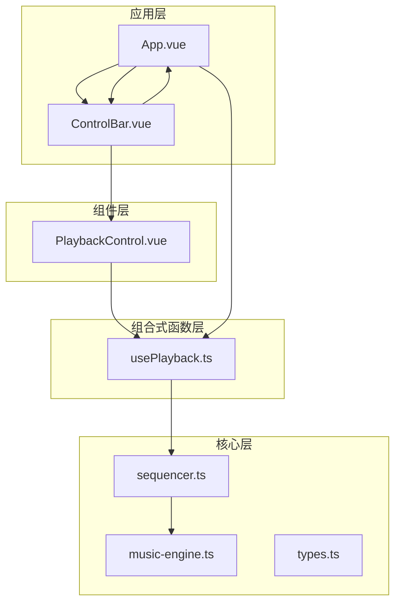
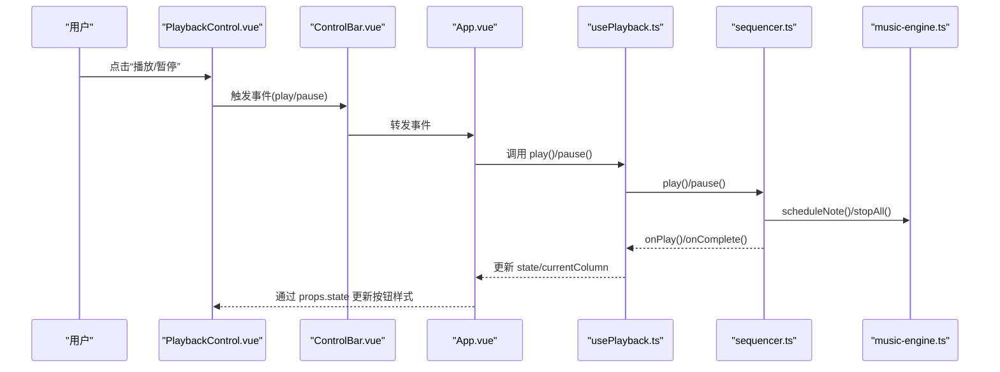
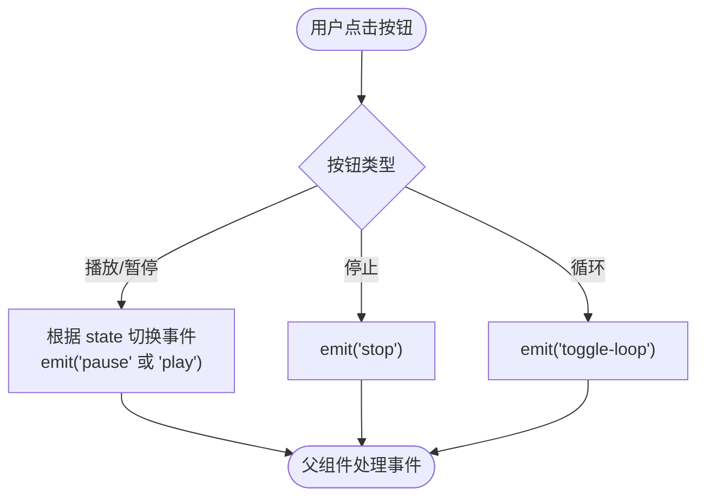
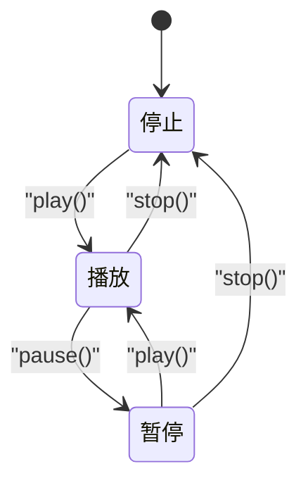
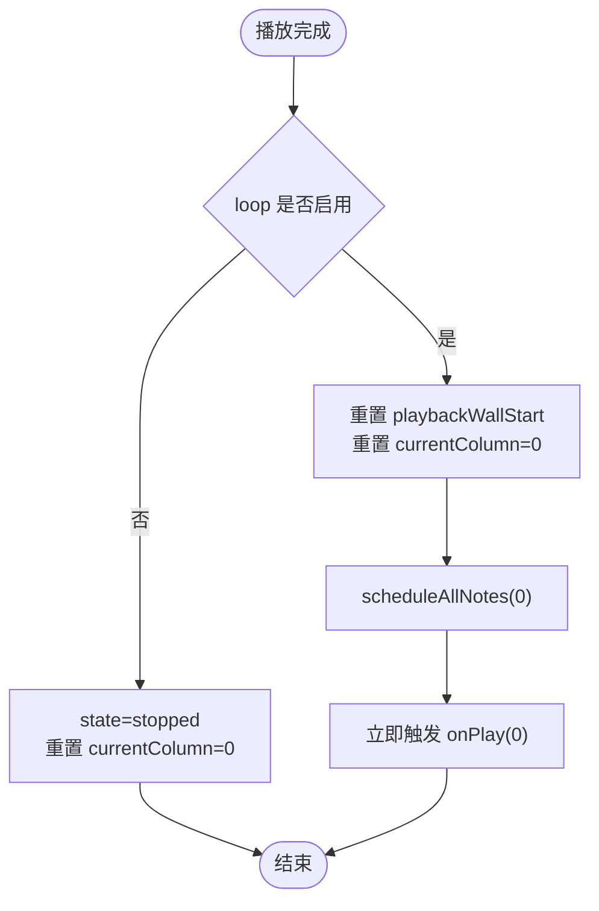
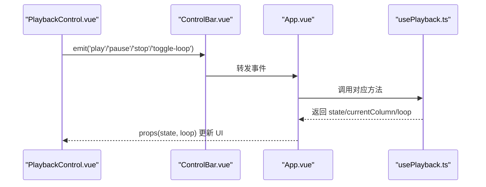
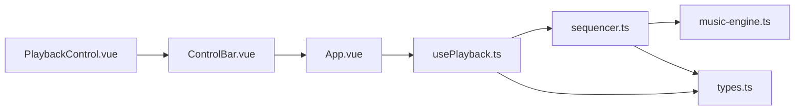

# 播放控制组件

<cite>
**本文引用的文件**
- [PlaybackControl.vue](file://src/components/PlaybackControl.vue)
- [usePlayback.ts](file://src/composables/usePlayback.ts)
- [sequencer.ts](file://src/core/sequencer.ts)
- [music-engine.ts](file://src/core/music-engine.ts)
- [types.ts](file://src/core/types.ts)
- [App.vue](file://src/App.vue)
- [ControlBar.vue](file://src/components/ControlBar.vue)
- [style.css](file://src/style.css)
</cite>

## 目录
1. [简介](#简介)
2. [项目结构](#项目结构)
3. [核心组件](#核心组件)
4. [架构总览](#架构总览)
5. [详细组件分析](#详细组件分析)
6. [依赖关系分析](#依赖关系分析)
7. [性能考量](#性能考量)
8. [故障排除指南](#故障排除指南)
9. [结论](#结论)
10. [附录](#附录)

## 简介
本文件面向“播放控制组件”的实现与使用，系统性阐述 PlaybackControl 组件的设计理念、状态管理、事件处理机制、循环播放实现、与父组件的通信协议，以及可定制化与扩展方案。目标读者既包括前端开发者，也包括希望理解播放器工作原理的非技术用户。

## 项目结构
播放控制组件位于组件层，配合控制栏组件与应用入口共同构成播放控制链路；底层由序列器与音乐引擎负责实际的音频调度与播放。

图表来源
- [App.vue:102-138](file://src/App.vue#L102-L138)
- [ControlBar.vue:43-50](file://src/components/ControlBar.vue#L43-L50)
- [PlaybackControl.vue:16-30](file://src/components/PlaybackControl.vue#L16-L30)
- [usePlayback.ts:14-94](file://src/composables/usePlayback.ts#L14-L94)
- [sequencer.ts:21-354](file://src/core/sequencer.ts#L21-L354)
- [music-engine.ts:17-221](file://src/core/music-engine.ts#L17-L221)
- [types.ts:71-72](file://src/core/types.ts#L71-L72)

章节来源
- [App.vue:102-138](file://src/App.vue#L102-L138)
- [ControlBar.vue:27-67](file://src/components/ControlBar.vue#L27-L67)
- [PlaybackControl.vue:33-57](file://src/components/PlaybackControl.vue#L33-L57)
- [usePlayback.ts:14-94](file://src/composables/usePlayback.ts#L14-L94)
- [sequencer.ts:21-354](file://src/core/sequencer.ts#L21-L354)
- [music-engine.ts:17-221](file://src/core/music-engine.ts#L17-L221)
- [types.ts:71-72](file://src/core/types.ts#L71-L72)

## 核心组件
- PlaybackControl.vue：播放控制按钮与循环开关的视图组件，负责根据传入状态渲染按钮样式，并向父组件发出播放、暂停、停止、切换循环等事件。
- usePlayback.ts：播放控制的组合式函数，封装播放状态、当前列、循环标志与播放控制方法，同时监听 BPM 和调号变化并同步至序列器。
- sequencer.ts：序列器，负责乐谱的预调度、播放状态机、UI 定时器、循环播放逻辑与完成回调。
- music-engine.ts：音乐引擎，基于 Web Audio API 的单例，负责音符的精确调度与停止。
- types.ts：播放状态类型 PlaybackState 的定义，以及 BPM、调号等类型常量。

章节来源
- [PlaybackControl.vue:1-111](file://src/components/PlaybackControl.vue#L1-L111)
- [usePlayback.ts:1-95](file://src/composables/usePlayback.ts#L1-L95)
- [sequencer.ts:1-354](file://src/core/sequencer.ts#L1-L354)
- [music-engine.ts:1-221](file://src/core/music-engine.ts#L1-L221)
- [types.ts:71-72](file://src/core/types.ts#L71-L72)

## 架构总览
播放控制的端到端流程如下：
- 视图层：PlaybackControl 根据 props.state 渲染按钮样式，用户点击触发相应事件。
- 控制层：ControlBar 将事件转发给 App.vue。
- 组合式函数：App.vue 通过 usePlayback 提供的方法执行播放、暂停、停止、切换循环。
- 序列器：usePlayback 内部持有 Sequencer 实例，调用其 play/pause/stop/setLoop 等方法。
- 音频层：Sequencer 通过 MusicEngine 预调度音符，使用 AudioContext 精确控制音符起止时间。

图表来源
- [PlaybackControl.vue:16-30](file://src/components/PlaybackControl.vue#L16-L30)
- [ControlBar.vue:43-50](file://src/components/ControlBar.vue#L43-L50)
- [App.vue:30-42](file://src/App.vue#L30-L42)
- [usePlayback.ts:46-77](file://src/composables/usePlayback.ts#L46-L77)
- [sequencer.ts:144-190](file://src/core/sequencer.ts#L144-L190)
- [music-engine.ts:90-150](file://src/core/music-engine.ts#L90-L150)

## 详细组件分析

### PlaybackControl 组件
- 属性与事件
  - 接收属性：state（播放状态）、loop（循环开关）
  - 发出事件：play、pause、stop、toggle-loop
- 按钮行为
  - 播放/暂停按钮：PLAY 与 PAUSE 按钮按 state 互斥显示（v-show），点击时发出对应事件
  - 停止按钮：禁用条件为 state 为 stopped，点击时发出 stop 事件
  - 循环复选框：绑定 loop，变更时发出 toggle-loop 事件
- UI 反馈
  - 播放与暂停按钮通过伪元素绘制各自图标，区分“播放”和“暂停”
  - 停止按钮绘制实心方块图标
  - 按钮使用 nes.css 样式，保持复古风格

图表来源
- [PlaybackControl.vue:16-30](file://src/components/PlaybackControl.vue#L16-L30)
- [PlaybackControl.vue:35-55](file://src/components/PlaybackControl.vue#L35-L55)

章节来源
- [PlaybackControl.vue:4-14](file://src/components/PlaybackControl.vue#L4-L14)
- [PlaybackControl.vue:33-57](file://src/components/PlaybackControl.vue#L33-L57)
- [PlaybackControl.vue:75-98](file://src/components/PlaybackControl.vue#L75-L98)
- [PlaybackControl.vue:101-109](file://src/components/PlaybackControl.vue#L101-L109)

### 播放状态生命周期管理
- 状态类型：PlaybackState = 'stopped' | 'playing' | 'paused'
- 状态转换
  - stopped → playing：调用 play()，序列器预调度音符并启动 UI 定时器
  - playing → paused：调用 pause()，停止 UI 定时器并记录当前位置，立即停止所有音符
  - paused → playing：调用 play()，继续从记录位置播放
  - playing → stopped：调用 stop()，重置 UI 定时器与当前位置，停止所有音符
  - stopped → stopped：重复停止不改变状态
- UI 反馈
  - 播放/暂停按钮样式随 state 动态切换（PLAY 与 PAUSE 互斥显示）
  - 停止按钮在 stopped 状态禁用

图表来源
- [types.ts:71-72](file://src/core/types.ts#L71-L72)
- [usePlayback.ts:46-66](file://src/composables/usePlayback.ts#L46-L66)
- [sequencer.ts:144-200](file://src/core/sequencer.ts#L144-L200)

章节来源
- [types.ts:71-72](file://src/core/types.ts#L71-L72)
- [usePlayback.ts:46-66](file://src/composables/usePlayback.ts#L46-L66)
- [sequencer.ts:144-200](file://src/core/sequencer.ts#L144-L200)

### 循环播放功能
- 用户交互
  - 复选框绑定 loop，变更时发出 toggle-loop 事件
- 实现机制
  - usePlayback.ts：维护 loop 标志并调用 sequencer.setLoop()
  - sequencer.ts：在 UI 定时器中检测播放完成，若启用循环则重置播放位置并重新调度音符
- UI 反馈
  - 复选框状态与 loop 同步，用户可直观看到循环是否开启

图表来源
- [usePlayback.ts:79-82](file://src/composables/usePlayback.ts#L79-L82)
- [sequencer.ts:291-304](file://src/core/sequencer.ts#L291-L304)
- [sequencer.ts:292-299](file://src/core/sequencer.ts#L292-L299)

章节来源
- [PlaybackControl.vue:48-55](file://src/components/PlaybackControl.vue#L48-L55)
- [usePlayback.ts:79-82](file://src/composables/usePlayback.ts#L79-L82)
- [sequencer.ts:291-304](file://src/core/sequencer.ts#L291-L304)

### 组件与父组件的通信协议
- ControlBar 作为中介
  - 接收来自 PlaybackControl 的事件并转发给 App.vue
  - 通过 v-model 与 App.vue 同步 speed 与 keySignature
- App.vue 作为协调者
  - 通过 usePlayback 提供 state、currentColumn、loop 与控制方法
  - 将事件映射到 usePlayback 的 play/pause/stop/toggleLoop
- 通信要点
  - 事件命名：play、pause、stop、toggle-loop
  - 属性命名：playbackState、loop
  - 数据流：props 下行，events 上行

图表来源
- [ControlBar.vue:43-50](file://src/components/ControlBar.vue#L43-L50)
- [App.vue:118-131](file://src/App.vue#L118-L131)
- [PlaybackControl.vue:9-14](file://src/components/PlaybackControl.vue#L9-L14)

章节来源
- [ControlBar.vue:16-24](file://src/components/ControlBar.vue#L16-L24)
- [App.vue:30-42](file://src/App.vue#L30-L42)
- [PlaybackControl.vue:9-14](file://src/components/PlaybackControl.vue#L9-L14)

### 播放控制的定制化与扩展方案
- 按钮样式与图标
  - 通过 CSS 类与伪元素自定义按钮图标与颜色主题
  - 可替换 nes.css 主题以适配不同风格
- 事件扩展
  - 可在 ControlBar 中新增更多事件（如 seek、bpm 变更等），由 App.vue 统一处理
- 状态同步
  - currentColumn 可用于 NotationGrid 的播放指示器联动
  - loop 状态可用于 UI 提示与快捷键提示
- 性能优化建议
  - 使用组合式函数集中管理状态，减少不必要的响应式开销
  - 在 BPM/调号变更时走序列器的「stopAll 丢弃 + 120ms 防抖 + 从当前指示器列整体重排」，避免卡顿与混响

章节来源
- [PlaybackControl.vue:59-110](file://src/components/PlaybackControl.vue#L59-L110)
- [ControlBar.vue:27-67](file://src/components/ControlBar.vue#L27-L67)
- [sequencer.ts:84-115](file://src/core/sequencer.ts#L84-L115)

## 依赖关系分析
- 组件依赖
  - PlaybackControl 依赖 ControlBar 作为父组件
  - ControlBar 依赖 App.vue 作为协调者
- 组合式函数依赖
  - usePlayback 依赖 sequencer.ts 与 types.ts
- 序列器依赖
  - sequencer.ts 依赖 music-engine.ts 与 types.ts
- 应用依赖
  - App.vue 依赖 usePlayback 与 ControlBar

图表来源
- [PlaybackControl.vue:1-111](file://src/components/PlaybackControl.vue#L1-L111)
- [ControlBar.vue:1-116](file://src/components/ControlBar.vue#L1-L116)
- [App.vue:1-138](file://src/App.vue#L1-L138)
- [usePlayback.ts:1-95](file://src/composables/usePlayback.ts#L1-L95)
- [sequencer.ts:1-354](file://src/core/sequencer.ts#L1-L354)
- [music-engine.ts:1-221](file://src/core/music-engine.ts#L1-L221)
- [types.ts:1-164](file://src/core/types.ts#L1-L164)

章节来源
- [PlaybackControl.vue:1-111](file://src/components/PlaybackControl.vue#L1-L111)
- [ControlBar.vue:1-116](file://src/components/ControlBar.vue#L1-L116)
- [App.vue:1-138](file://src/App.vue#L1-L138)
- [usePlayback.ts:1-95](file://src/composables/usePlayback.ts#L1-L95)
- [sequencer.ts:1-354](file://src/core/sequencer.ts#L1-L354)
- [music-engine.ts:1-221](file://src/core/music-engine.ts#L1-L221)
- [types.ts:1-164](file://src/core/types.ts#L1-L164)

## 性能考量
- 预调度策略
  - 序列器在 play() 时一次性预调度所有剩余音符，避免运行时逐帧计算，降低 UI 定时器压力
- 实时变速/变调的丢弃重排
  - BPM/调号变更时，stopAll 立即丢弃所有声，120ms 防抖后从当前指示器列整体重排，杜绝叠加混响并保持音画同步
- UI 定时器节流
  - UI 定时器以固定间隔轮询列号变化，仅在列号变化时触发回调，减少无效更新
- 音频资源管理
  - 停止时清理活跃振荡器，避免内存泄漏与后台噪音

章节来源
- [sequencer.ts:240-263](file://src/core/sequencer.ts#L240-L263)
- [sequencer.ts:84-115](file://src/core/sequencer.ts#L84-L115)
- [sequencer.ts:282-312](file://src/core/sequencer.ts#L282-L312)
- [music-engine.ts:155-169](file://src/core/music-engine.ts#L155-L169)

## 故障排除指南
- 按钮无反应
  - 检查 ControlBar 是否正确转发事件到 App.vue
  - 确认 App.vue 是否将事件映射到 usePlayback 的方法
- 播放后无法暂停
  - 确认 sequencer 的 pause() 是否被调用，以及 UI 定时器是否停止
- 循环无效
  - 确认 loop 标志是否传递到 sequencer.setLoop()
  - 检查 UI 定时器在播放完成时是否重置并重新调度
- 停止后按钮仍可点击
  - 确认 props.state 为 stopped 时，停止按钮被禁用且样式更新

章节来源
- [ControlBar.vue:43-50](file://src/components/ControlBar.vue#L43-L50)
- [App.vue:118-131](file://src/App.vue#L118-L131)
- [usePlayback.ts:54-66](file://src/composables/usePlayback.ts#L54-L66)
- [sequencer.ts:172-190](file://src/core/sequencer.ts#L172-L190)
- [PlaybackControl.vue:42-47](file://src/components/PlaybackControl.vue#L42-L47)

## 结论
PlaybackControl 组件通过简洁的事件驱动模型与 ControlBar 的中继作用，实现了与应用层的清晰解耦。结合 usePlayback 的状态管理与 sequencer 的预调度机制，系统在保证 UI 流畅的同时，提供了稳定的播放体验。循环播放与 BPM/调号的动态调整进一步增强了可用性。建议在扩展时遵循现有事件与状态同步协议，确保整体一致性与可维护性。

## 附录
- 样式与主题
  - nes.css 提供复古按钮样式，可通过覆盖 CSS 变量或引入其他主题库进行定制
- 相关类型
  - PlaybackState、KeySignature、BPM 等类型定义见 types.ts

章节来源
- [style.css:19-29](file://src/style.css#L19-L29)
- [types.ts:71-72](file://src/core/types.ts#L71-L72)
- [types.ts:113-138](file://src/core/types.ts#L113-L138)