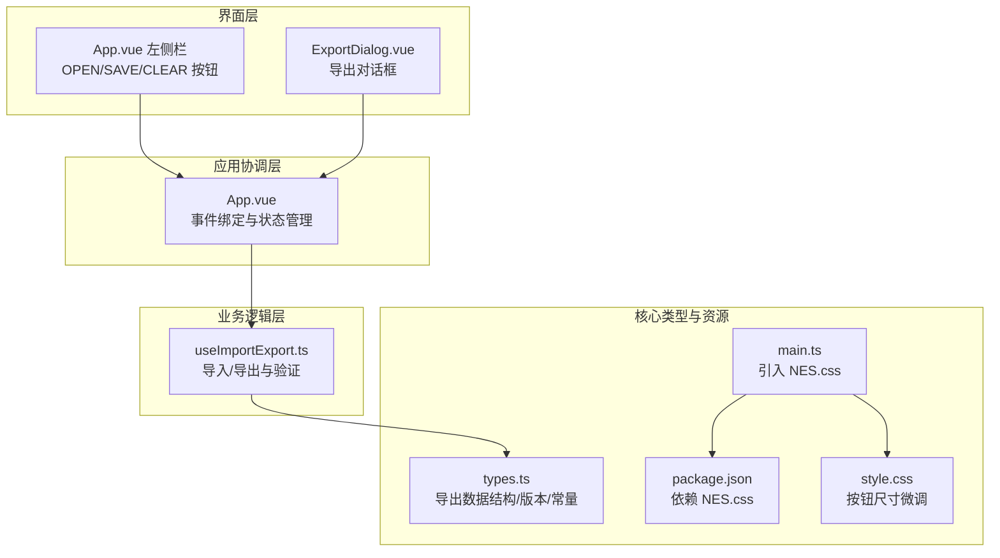
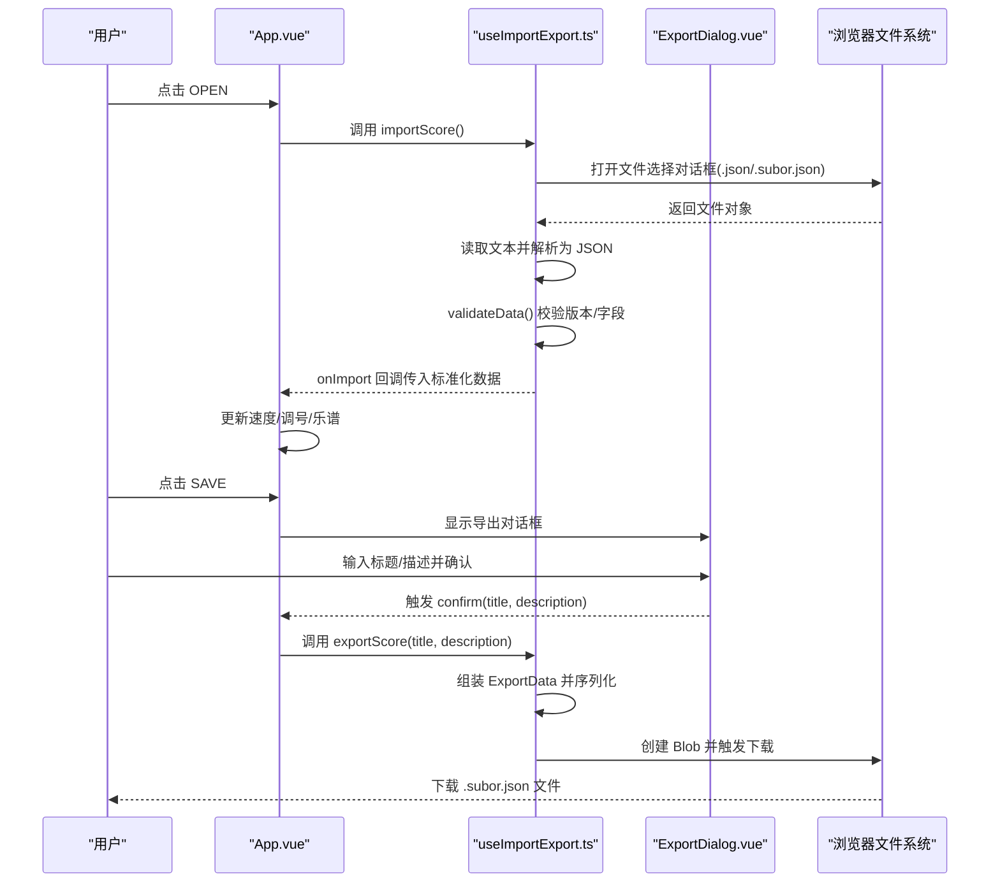
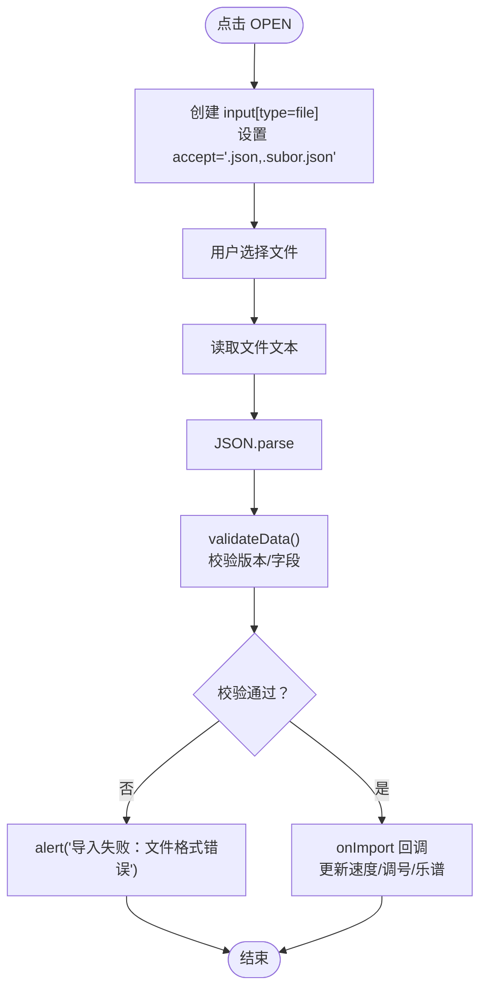
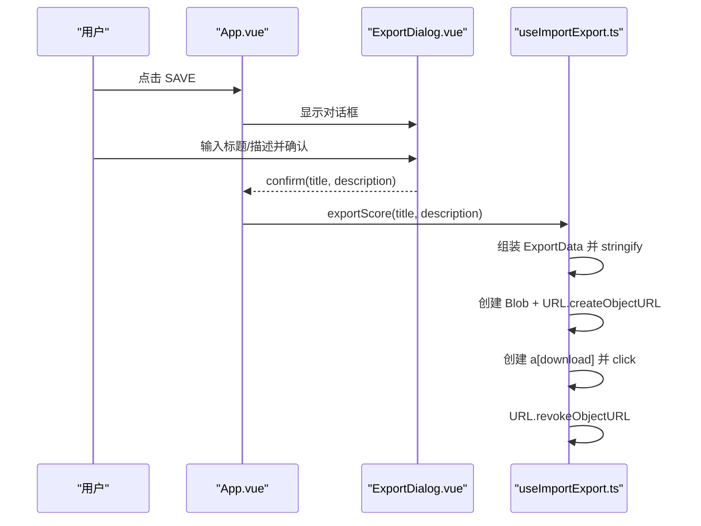
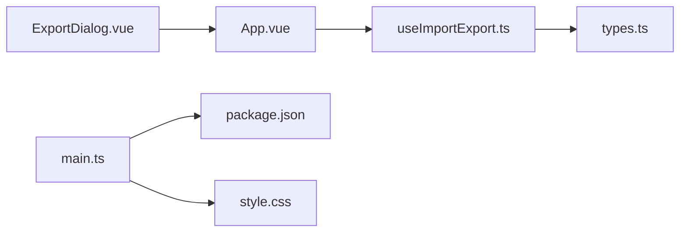

# 文件操作按钮

<cite>
**本文引用的文件**
- [ControlBar.vue](file://src/components/ControlBar.vue)
- [useImportExport.ts](file://src/composables/useImportExport.ts)
- [ExportDialog.vue](file://src/components/ExportDialog.vue)
- [types.ts](file://src/core/types.ts)
- [App.vue](file://src/App.vue)
- [main.ts](file://src/main.ts)
- [style.css](file://src/style.css)
- [twinkle-star.subor.json](file://presets/twinkle-star.subor.json)
- [package.json](file://package.json)
</cite>

## 目录
1. [简介](#简介)
2. [项目结构](#项目结构)
3. [核心组件](#核心组件)
4. [架构总览](#架构总览)
5. [详细组件分析](#详细组件分析)
6. [依赖关系分析](#依赖关系分析)
7. [性能考量](#性能考量)
8. [故障排除指南](#故障排除指南)
9. [结论](#结论)
10. [附录](#附录)

## 简介
本文档聚焦于应用左侧栏中的“OPEN”与“SAVE”文件操作按钮，系统性阐述其在应用中的职责、实现机制与交互流程。内容涵盖：
- 文件导入：文件选择对话框触发、格式验证与数据解析
- 文件导出：数据序列化、文件生成与浏览器下载
- 样式设计与交互反馈：NES.css 样式应用与用户提示
- 安全与错误处理：输入校验、异常捕获与用户提示
- 文件格式兼容性与版本管理策略

## 项目结构
文件操作功能由以下模块协同完成：
- 应用主组件：App.vue 左侧栏渲染 OPEN/SAVE/CLEAR 按钮（nes-btn，播放中即 playbackState !== 'stopped' 时禁用）并绑定事件处理
- 导入导出组合式函数：封装导入/导出逻辑与数据验证
- 导出对话框：收集导出标题与描述，触发导出流程
- 应用入口：协调各模块，绑定事件处理器
- 核心类型：定义导出数据结构、版本号与常量
- 样式层：NES.css 样式与全局字体、按钮尺寸微调

图表来源
- [ControlBar.vue:27-67](file://src/components/ControlBar.vue#L27-L67)
- [ExportDialog.vue:1-89](file://src/components/ExportDialog.vue#L1-L89)
- [useImportExport.ts:18-137](file://src/composables/useImportExport.ts#L18-L137)
- [App.vue:44-99](file://src/App.vue#L44-L99)
- [types.ts:145-164](file://src/core/types.ts#L145-L164)
- [main.ts:1-8](file://src/main.ts#L1-L8)
- [style.css:19-27](file://src/style.css#L19-L27)
- [package.json:11-15](file://package.json#L11-L15)

章节来源
- [ControlBar.vue:27-67](file://src/components/ControlBar.vue#L27-L67)
- [useImportExport.ts:18-137](file://src/composables/useImportExport.ts#L18-L137)
- [ExportDialog.vue:1-89](file://src/components/ExportDialog.vue#L1-L89)
- [App.vue:44-99](file://src/App.vue#L44-L99)
- [types.ts:145-164](file://src/core/types.ts#L145-L164)
- [main.ts:1-8](file://src/main.ts#L1-L8)
- [style.css:19-27](file://src/style.css#L19-L27)
- [package.json:11-15](file://package.json#L11-L15)

## 核心组件
- App.vue：在左侧栏渲染 OPEN 与 SAVE 按钮（另有 CLEAR 清空按钮），OPEN 触发导入流程，SAVE 触发导出对话框；按钮采用 nes-btn 样式类，播放中（playbackState !== 'stopped'）禁用。
- useImportExport.ts：封装导入/导出与数据验证逻辑，提供 exportScore 与 importScore 方法，并定义 ExportData 结构与版本号。
- ExportDialog.vue：弹出式对话框，收集导出标题与描述，提交后触发导出流程。
- App.vue：作为协调者，绑定左侧栏 OPEN/SAVE 按钮的导入/导出流程，调用 useImportExport 的方法，并控制 ExportDialog 的可见性。
- types.ts：定义导出数据结构 ExportData、版本号 '1.0'、BPM 列表、调号集合等常量，以及导出文件 MIME 类型与扩展名。

章节来源
- [ControlBar.vue:34-64](file://src/components/ControlBar.vue#L34-L64)
- [useImportExport.ts:18-137](file://src/composables/useImportExport.ts#L18-L137)
- [ExportDialog.vue:1-89](file://src/components/ExportDialog.vue#L1-L89)
- [App.vue:44-99](file://src/App.vue#L44-L99)
- [types.ts:145-164](file://src/core/types.ts#L145-L164)

## 架构总览
文件操作的端到端流程如下：

图表来源
- [ControlBar.vue:51-64](file://src/components/ControlBar.vue#L51-L64)
- [App.vue:86-99](file://src/App.vue#L86-L99)
- [useImportExport.ts:24-79](file://src/composables/useImportExport.ts#L24-L79)
- [ExportDialog.vue:17-34](file://src/components/ExportDialog.vue#L17-L34)

## 详细组件分析

### 左侧栏中的 OPEN 与 SAVE 按钮
- OPEN 按钮
  - 触发事件：@click 调用导入流程
  - 样式：nes-btn
  - 行为：点击后调用 importScore()，打开文件选择对话框
- SAVE 按钮
  - 触发事件：@click 打开导出对话框
  - 样式：nes-btn
  - 行为：显示 ExportDialog，用户确认后触发导出
- 播放中禁用
  - playbackState !== 'stopped' 时，OPEN/SAVE/CLEAR 按钮均禁用
- 快捷键
  - Ctrl/Cmd+I 触发 OPEN 导入，Ctrl/Cmd+S 触发 SAVE 导出；任意弹框打开时快捷键挂起

章节来源
- [ControlBar.vue:51-64](file://src/components/ControlBar.vue#L51-L64)
- [App.vue:86-99](file://src/App.vue#L86-L99)

### 导入流程（OPEN）
- 文件选择对话框
  - 通过动态创建 input[type=file] 并设置 accept='.json,.subor.json' 实现
  - 用户选择文件后触发 onchange，读取第一个文件
- 数据解析与验证
  - 异步读取文件文本并 JSON.parse
  - validateData 对 version、bpm、keySignature、score 进行校验与修复
  - 若校验失败，alert 提示“导入失败：文件格式错误”
- 数据回填
  - 校验通过后调用 onImport 回调，App.vue 更新速度、调号与乐谱

图表来源
- [useImportExport.ts:52-79](file://src/composables/useImportExport.ts#L52-L79)
- [useImportExport.ts:84-131](file://src/composables/useImportExport.ts#L84-L131)
- [App.vue:48-53](file://src/App.vue#L48-L53)

章节来源
- [useImportExport.ts:52-79](file://src/composables/useImportExport.ts#L52-L79)
- [useImportExport.ts:84-131](file://src/composables/useImportExport.ts#L84-L131)
- [App.vue:48-53](file://src/App.vue#L48-L53)

### 导出流程（SAVE）
- 弹出导出对话框
  - App.vue 在收到 export 事件后显示 ExportDialog
  - 用户输入标题（必填）与描述（可选）
- 数据序列化与下载
  - App.vue 收到 confirm 后调用 exportScore(title, description)
  - 组装 ExportData（version='1.0'、title、description、bpm、keySignature、score）
  - JSON.stringify 序列化，创建 Blob，设置 MIME 类型
  - 生成临时 URL，创建 a[download] 触发下载，随后 revokeObjectURL

图表来源
- [App.vue:86-94](file://src/App.vue#L86-L94)
- [ExportDialog.vue:17-34](file://src/components/ExportDialog.vue#L17-L34)
- [useImportExport.ts:24-47](file://src/composables/useImportExport.ts#L24-L47)

章节来源
- [App.vue:86-94](file://src/App.vue#L86-L94)
- [ExportDialog.vue:17-34](file://src/components/ExportDialog.vue#L17-L34)
- [useImportExport.ts:24-47](file://src/composables/useImportExport.ts#L24-L47)

### 数据模型与版本管理
- 导出数据结构 ExportData
  - 字段：version、title、description、bpm、keySignature、score
  - 版本号：'1.0'
- 版本兼容性策略
  - 导入时严格校验 version 是否为 '1.0'，否则拒绝
  - 未来升级时可在 validateData 中增加版本分支，保持向后兼容
- 数据修复与默认值
  - bpm：若不在允许列表则回退为默认值
  - keySignature：若不在允许集合则回退为默认值
  - score：若为空则填充默认列数的空白乐谱

章节来源
- [types.ts:145-158](file://src/core/types.ts#L145-L158)
- [types.ts:147](file://src/core/types.ts#L147)
- [useImportExport.ts:84-131](file://src/composables/useImportExport.ts#L84-L131)

### 样式设计与交互反馈
- NES.css 样式应用
  - 左侧栏 OPEN/SAVE/CLEAR 按钮使用 nes-btn 类，播放中禁用
  - ExportDialog 使用 nes-dialog、nes-field、nes-input、nes-textarea、nes-btn
  - main.ts 引入 nes.css 核心样式
- 按钮尺寸微调
  - style.css 调整 .nes-btn 的内边距与字号，确保在左侧栏中视觉一致
- 交互反馈
  - OPEN：点击即触发文件选择
  - SAVE：先弹出对话框，再执行下载
  - 导入失败：alert 提示错误信息

章节来源
- [ControlBar.vue:53-63](file://src/components/ControlBar.vue#L53-L63)
- [ExportDialog.vue:39-88](file://src/components/ExportDialog.vue#L39-L88)
- [main.ts:3](file://src/main.ts#L3)
- [style.css:19-27](file://src/style.css#L19-L27)

### 安全与错误处理
- 输入过滤
  - 导入文件类型限制为 .json/.subor.json
  - JSON.parse 后进行结构与字段校验
- 异常捕获
  - 导入流程使用 try/catch 包裹，捕获解析或校验异常并提示用户
- 数据修复
  - 对不合规字段进行安全回退，避免应用崩溃
- 下载安全
  - 通过 Blob 与临时 URL 下载，避免跨域与 XSS 风险

章节来源
- [useImportExport.ts:54-55](file://src/composables/useImportExport.ts#L54-L55)
- [useImportExport.ts:72-75](file://src/composables/useImportExport.ts#L72-L75)
- [useImportExport.ts:92-95](file://src/composables/useImportExport.ts#L92-L95)
- [useImportExport.ts:100](file://src/composables/useImportExport.ts#L100)
- [useImportExport.ts:106](file://src/composables/useImportExport.ts#L106)

## 依赖关系分析
- 左侧栏按钮依赖
  - OPEN/SAVE/CLEAR 按钮位于 App.vue 左侧栏，直接绑定导入/导出流程，播放中禁用
- App.vue 依赖 useImportExport.ts 的导入/导出能力
- useImportExport.ts 依赖 types.ts 的数据结构与常量
- 样式层依赖 NES.css 与全局样式微调
- package.json 声明 NES.css 依赖

图表来源
- [ControlBar.vue:27-67](file://src/components/ControlBar.vue#L27-L67)
- [App.vue:44-99](file://src/App.vue#L44-L99)
- [useImportExport.ts:18-137](file://src/composables/useImportExport.ts#L18-L137)
- [types.ts:145-164](file://src/core/types.ts#L145-L164)
- [main.ts:1-8](file://src/main.ts#L1-L8)
- [style.css:19-27](file://src/style.css#L19-L27)
- [package.json:11-15](file://package.json#L11-L15)

章节来源
- [ControlBar.vue:27-67](file://src/components/ControlBar.vue#L27-L67)
- [App.vue:44-99](file://src/App.vue#L44-L99)
- [useImportExport.ts:18-137](file://src/composables/useImportExport.ts#L18-L137)
- [types.ts:145-164](file://src/core/types.ts#L145-L164)
- [main.ts:1-8](file://src/main.ts#L1-L8)
- [style.css:19-27](file://src/style.css#L19-L27)
- [package.json:11-15](file://package.json#L11-L15)

## 性能考量
- 导入性能
  - 小至中等规模乐谱文件（如预设文件）解析耗时可忽略
  - 大文件建议分页或分段处理，当前实现一次性读取全部文本
- 导出性能
  - JSON.stringify 与 Blob 创建为 O(n) 操作，n 为乐谱单元数量
  - 大规模乐谱导出时注意内存占用，可考虑流式写入方案
- UI 响应
  - 导入/导出期间暂停播放，避免并发操作导致状态冲突

## 故障排除指南
- 导入失败：文件格式错误
  - 现象：弹窗提示“导入失败：文件格式错误”
  - 原因：文件非 JSON 或缺少必需字段
  - 处理：检查文件是否为 .json/.subor.json，确认 version 与字段结构
- 版本不兼容
  - 现象：控制台警告“不支持的版本”
  - 原因：version 非 '1.0'
  - 处理：使用正确版本的导出文件或升级应用
- 下载未触发
  - 现象：点击 SAVE 无响应
  - 原因：浏览器阻止弹窗或未输入标题
  - 处理：允许弹窗，确保标题非空后重试

章节来源
- [useImportExport.ts:72-75](file://src/composables/useImportExport.ts#L72-L75)
- [useImportExport.ts:92-95](file://src/composables/useImportExport.ts#L92-L95)
- [ExportDialog.vue:17-34](file://src/components/ExportDialog.vue#L17-L34)

## 结论
OPEN 与 SAVE 按钮通过清晰的事件链路与稳健的数据验证，实现了可靠的文件导入与导出能力。结合 NES.css 的复古风格与全局样式微调，提供了良好的用户体验。未来可在大文件处理与版本演进方面进一步优化，以提升性能与兼容性。

## 附录
- 示例文件：预设文件展示了标准的导出数据结构与字段组织
- 依赖声明：package.json 中声明了 NES.css 依赖，main.ts 中引入核心样式

章节来源
- [twinkle-star.subor.json:1-56](file://presets/twinkle-star.subor.json#L1-L56)
- [package.json:11-15](file://package.json#L11-L15)
- [main.ts:3](file://src/main.ts#L3)