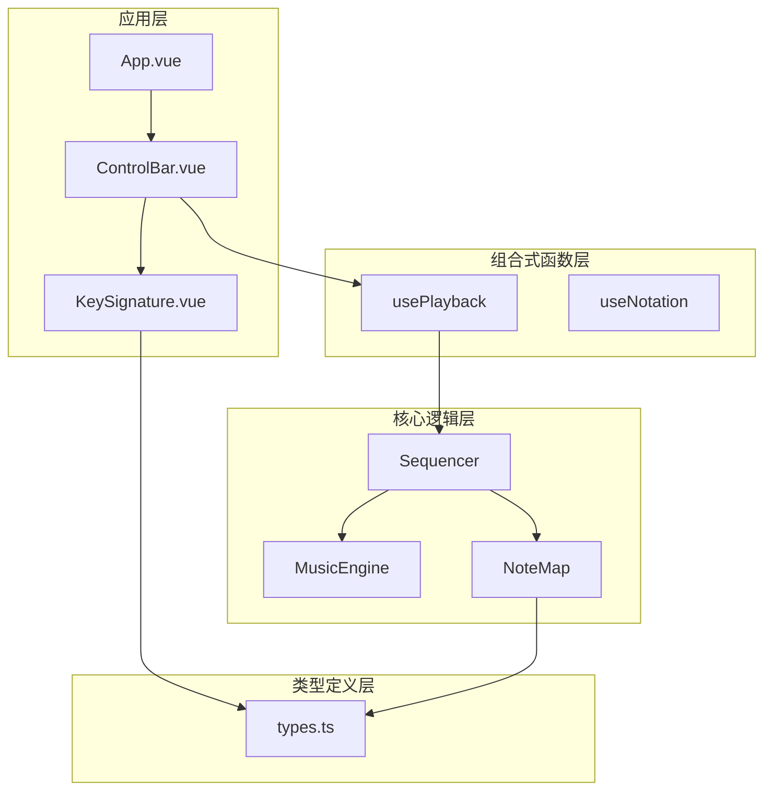
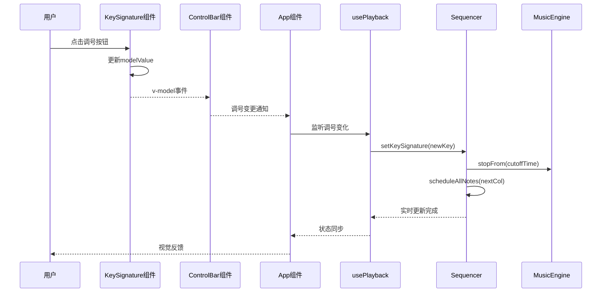
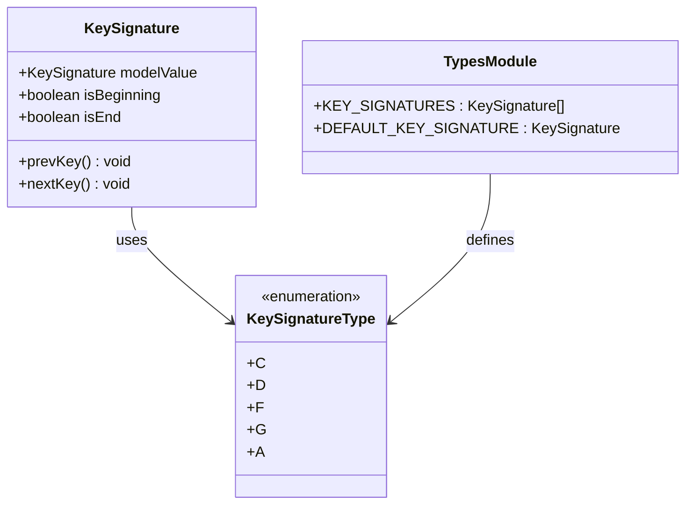
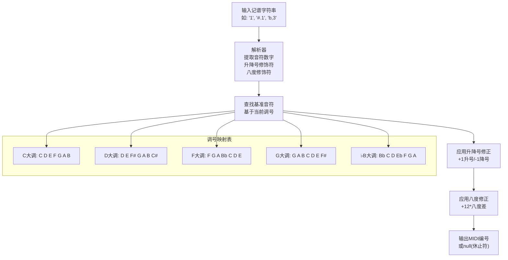
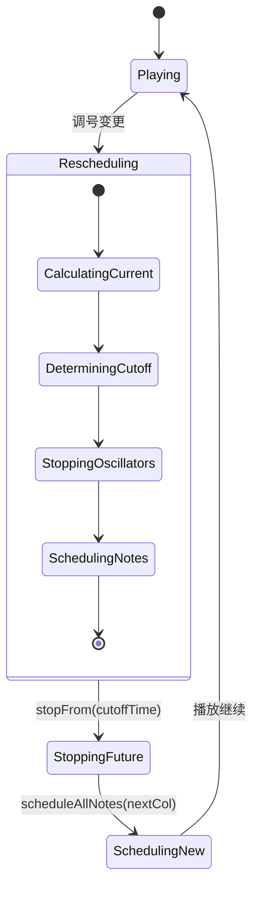
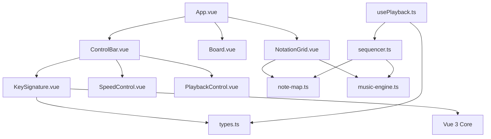

# 调号控制组件

<cite>
**本文引用的文件**
- [KeySignature.vue](file://src/components/KeySignature.vue)
- [types.ts](file://src/core/types.ts)
- [note-map.ts](file://src/core/note-map.ts)
- [sequencer.ts](file://src/core/sequencer.ts)
- [usePlayback.ts](file://src/composables/usePlayback.ts)
- [App.vue](file://src/App.vue)
- [ControlBar.vue](file://src/components/ControlBar.vue)
- [NotationGrid.vue](file://src/components/NotationGrid.vue)
- [music-engine.ts](file://src/core/music-engine.ts)
</cite>

## 目录
1. [简介](#简介)
2. [项目结构](#项目结构)
3. [核心组件](#核心组件)
4. [架构概览](#架构概览)
5. [详细组件分析](#详细组件分析)
6. [依赖关系分析](#依赖关系分析)
7. [性能考量](#性能考量)
8. [故障排除指南](#故障排除指南)
9. [结论](#结论)

## 简介
调号控制组件是音乐记谱系统中的关键功能模块，负责管理音乐作品的调号显示和切换。该组件实现了完整的调号控制系统，包括调号的可视化展示、用户交互操作、以及与音乐理论的深度集成。通过调号控制，用户可以轻松地在不同的大调之间切换，实时影响音符的计算和播放。

## 项目结构
该项目采用Vue 3 Composition API架构，主要分为以下几个层次：
- **组件层**：包含UI组件如KeySignature、ControlBar等
- **核心逻辑层**：包含音乐引擎、序列器、音符映射等核心功能
- **组合式函数层**：提供状态管理和业务逻辑封装
- **类型定义层**：定义了完整的类型系统和常量配置

**图表来源**
- [App.vue:1-138](file://src/App.vue#L1-L138)
- [ControlBar.vue:1-116](file://src/components/ControlBar.vue#L1-L116)
- [KeySignature.vue:1-55](file://src/components/KeySignature.vue#L1-L55)

**章节来源**
- [App.vue:1-138](file://src/App.vue#L1-L138)
- [ControlBar.vue:1-116](file://src/components/ControlBar.vue#L1-L116)
- [KeySignature.vue:1-55](file://src/components/KeySignature.vue#L1-L55)

## 核心组件
调号控制组件的核心功能围绕以下关键要素构建：

### 调号数据模型
组件使用强类型系统定义调号，支持5个常用标准调号：
- C大调、D大调、F大调、G大调、♭B大调

每个调号都对应特定的升降号模式，直接影响音符的计算结果。

### 状态管理机制
组件采用Vue 3的响应式系统，通过`defineModel`实现双向数据绑定，确保调号状态在组件树中的实时同步。

### 用户交互设计
提供直观的左右箭头按钮，配合禁用状态指示，确保用户操作的正确性和安全性。

**章节来源**
- [types.ts:118-139](file://src/core/types.ts#L118-L139)
- [KeySignature.vue:6-22](file://src/components/KeySignature.vue#L6-L22)

## 架构概览
调号控制在整个音乐系统中的作用是连接用户界面和底层音乐引擎的关键桥梁。其工作流程体现了典型的MVVM架构模式：

**图表来源**
- [KeySignature.vue:10-22](file://src/components/KeySignature.vue#L10-L22)
- [ControlBar.vue:30](file://src/components/ControlBar.vue#L30)
- [usePlayback.ts:38-41](file://src/composables/usePlayback.ts#L38-L41)
- [sequencer.ts:55-82](file://src/core/sequencer.ts#L55-L82)

## 详细组件分析

### KeySignature组件实现分析

#### 组件结构设计
KeySignature组件采用了极简而高效的实现方式，仅包含55行代码却涵盖了完整的调号控制功能。

**图表来源**
- [KeySignature.vue:1-55](file://src/components/KeySignature.vue#L1-L55)
- [types.ts:132-138](file://src/core/types.ts#L132-L138)

#### 调号切换算法
组件实现了基于索引查找的调号切换机制，具有以下特点：

1. **边界检测**：通过`indexOf`方法定位当前调号在序列中的位置
2. **安全访问**：检查边界条件，防止数组越界
3. **原子性更新**：使用响应式属性确保状态变更的原子性

#### 视觉反馈机制
组件提供了完整的视觉反馈系统：
- 禁用状态：首尾调号按钮显示禁用样式
- 动态类名：根据状态动态切换CSS类
- 无障碍支持：禁用按钮自动获得`disabled`属性

**章节来源**
- [KeySignature.vue:1-55](file://src/components/KeySignature.vue#L1-L55)
- [types.ts:132-138](file://src/core/types.ts#L132-L138)

### 调号与音乐理论的集成

#### 音符映射系统
调号与音符的映射关系通过`note-map.ts`模块实现，建立了完整的音乐理论基础：

**图表来源**
- [note-map.ts:35-100](file://src/core/note-map.ts#L35-L100)
- [note-map.ts:10-27](file://src/core/note-map.ts#L10-L27)

#### 音乐理论基础
- **大调音阶**：全-全-半-全-全-全-半的半音阶模式
- **调号规则**：升号调号按F-C-G-D-A-E-B顺序增加
- **音符计算**：基于MIDI标准，C4=60，每个半音相差1

**章节来源**
- [note-map.ts:1-119](file://src/core/note-map.ts#L1-L119)
- [types.ts:118-139](file://src/core/types.ts#L118-L139)

### 实时更新策略

#### 播放中调号切换
序列器实现了智能的实时调号切换机制，确保播放过程中的平滑过渡：

**图表来源**
- [sequencer.ts:55-82](file://src/core/sequencer.ts#L55-L82)
- [sequencer.ts:84-115](file://src/core/sequencer.ts#L84-L115)

#### 状态同步机制
调号变更通过多层监听实现：
1. **组件层**：KeySignature组件的v-model双向绑定
2. **应用层**：App组件的响应式配置对象
3. **播放层**：usePlayback组合式函数的状态监听
4. **序列层**：Sequencer的实时更新机制

**章节来源**
- [usePlayback.ts:38-41](file://src/composables/usePlayback.ts#L38-L41)
- [sequencer.ts:55-82](file://src/core/sequencer.ts#L55-L82)

### 用户交互设计

#### 键盘导航支持
NotationGrid组件提供了完整的键盘导航支持：
- 方向键：在声部间移动（上/下）
- Tab键：在列间移动（左/右）
- Backspace/Delete：音符编辑操作

#### 可访问性考虑
- **语义化标签**：按钮使用适当的ARIA属性
- **键盘支持**：完整的键盘导航和操作支持
- **视觉反馈**：禁用状态的视觉提示
- **焦点管理**：自动焦点管理和位置同步

**章节来源**
- [NotationGrid.vue:186-244](file://src/components/NotationGrid.vue#L186-L244)
- [ControlBar.vue:34-65](file://src/components/ControlBar.vue#L34-L65)

## 依赖关系分析

### 组件依赖图
调号控制组件的依赖关系体现了清晰的分层架构：

**图表来源**
- [KeySignature.vue:1-55](file://src/components/KeySignature.vue#L1-L55)
- [ControlBar.vue:1-25](file://src/components/ControlBar.vue#L1-L25)
- [App.vue:1-100](file://src/App.vue#L1-L100)

### 数据流分析
调号数据在系统中的流动路径：

1. **输入阶段**：用户通过KeySignature组件选择新的调号
2. **传播阶段**：v-model双向绑定将变更传播到App组件
3. **处理阶段**：usePlayback组合式函数监听变更并通知Sequencer
4. **执行阶段**：Sequencer在播放中实时更新音符计算
5. **反馈阶段**：用户界面实时反映调号变化

**章节来源**
- [App.vue:25-42](file://src/App.vue#L25-L42)
- [usePlayback.ts:38-41](file://src/composables/usePlayback.ts#L38-L41)
- [sequencer.ts:55-82](file://src/core/sequencer.ts#L55-L82)

## 性能考量

### 实时切换优化
序列器实现了智能的实时调号切换，避免了播放中断：
- **选择性停止**：只停止未来的音符，当前音符自然播放完毕
- **增量重新调度**：从切换点开始重新计算音符时间
- **竞争保护**：防止快速连续切换导致的竞争条件

### 内存管理
- **振荡器生命周期**：精确跟踪活跃振荡器，及时清理不再使用的资源
- **音频上下文管理**：统一的音频上下文生命周期控制
- **回调函数清理**：避免内存泄漏的回调函数管理

### 渲染优化
- **响应式更新**：Vue 3的响应式系统提供高效的UI更新
- **批量操作**：输入队列机制避免频繁DOM操作
- **懒加载**：音频初始化仅在需要时进行

## 故障排除指南

### 常见问题及解决方案

#### 调号切换无效
**症状**：点击调号按钮无反应
**可能原因**：
- 组件未正确接收v-model绑定
- 父组件未正确处理调号变更
- Vue版本兼容性问题

**解决步骤**：
1. 检查父组件的v-model绑定语法
2. 验证调号类型定义的正确性
3. 确认Vue版本兼容性

#### 播放中调号切换异常
**症状**：调号切换时出现音频中断或错误
**可能原因**：
- 音频上下文未正确初始化
- 竞争条件导致的音频冲突
- 振荡器停止时机不当

**解决步骤**：
1. 确保音频上下文在用户交互后初始化
2. 检查_rescheduling标志位的状态
3. 验证stopFrom方法的截止时间计算

#### 音符计算错误
**症状**：音符播放频率不正确
**可能原因**：
- 调号映射表配置错误
- 音符解析逻辑问题
- MIDI编号计算错误

**解决步骤**：
1. 验证KEY_NOTE_MAP的准确性
2. 检查noteToMidi函数的计算逻辑
3. 确认MIDI标准的C4=60设置

**章节来源**
- [sequencer.ts:55-82](file://src/core/sequencer.ts#L55-L82)
- [note-map.ts:83-100](file://src/core/note-map.ts#L83-L100)

## 结论
调号控制组件展现了现代前端开发的最佳实践，通过简洁高效的实现方式，完美地集成了音乐理论知识和用户体验设计。组件不仅提供了直观的调号切换功能，更重要的是实现了与音乐引擎的深度集成，确保了调号变化对音符计算的实时影响。

该组件的设计体现了以下核心价值：
- **简洁性**：55行代码实现完整的调号控制功能
- **可靠性**：完善的边界检查和错误处理机制
- **性能**：智能的实时更新策略，避免播放中断
- **可维护性**：清晰的分层架构和类型安全设计
- **可访问性**：全面的键盘导航和无障碍支持

通过调号控制组件，用户可以轻松地在不同的音乐调性之间切换，享受流畅的音乐创作体验。这种将复杂音乐理论概念抽象为简单用户界面的设计理念，正是优秀软件工程的体现。