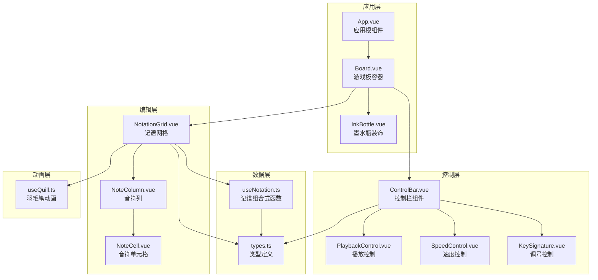
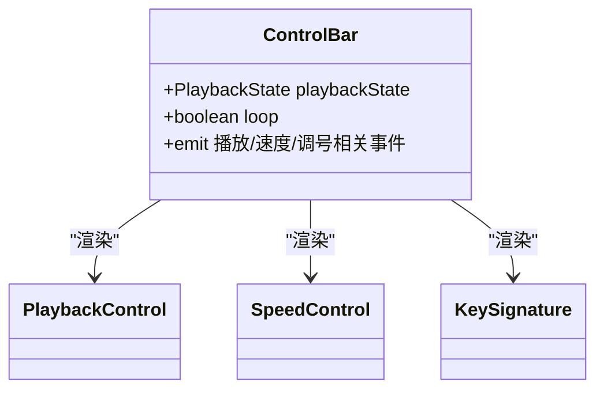
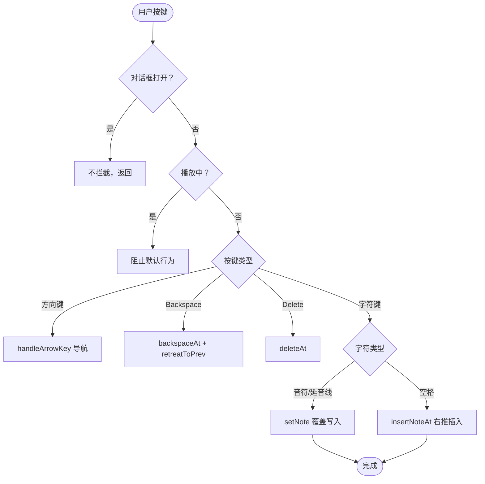
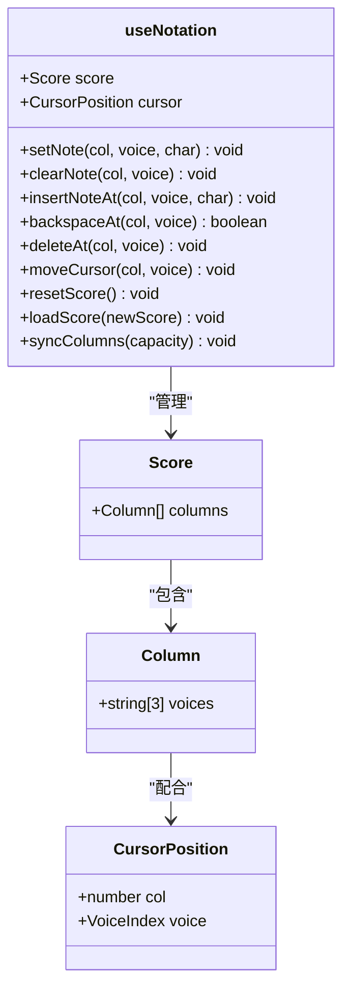
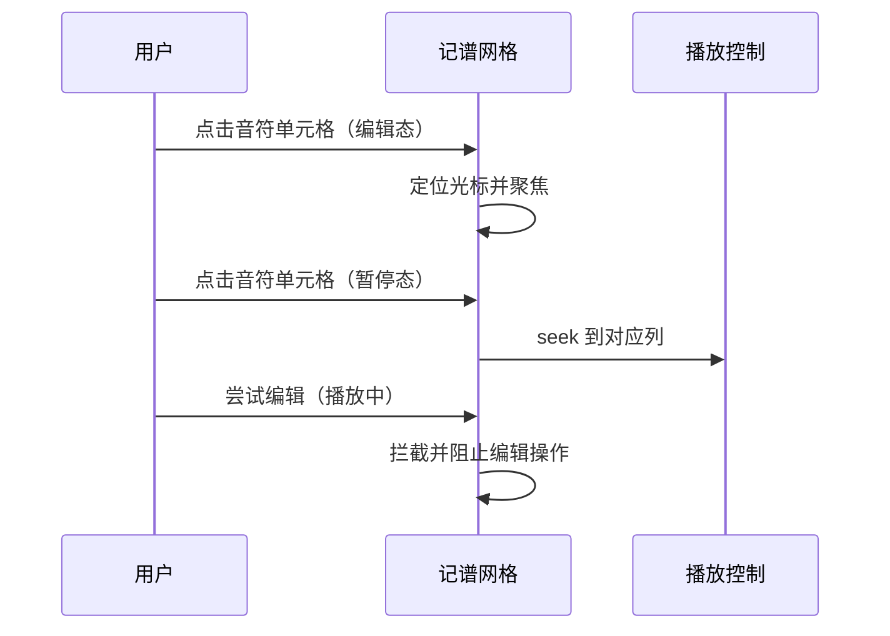
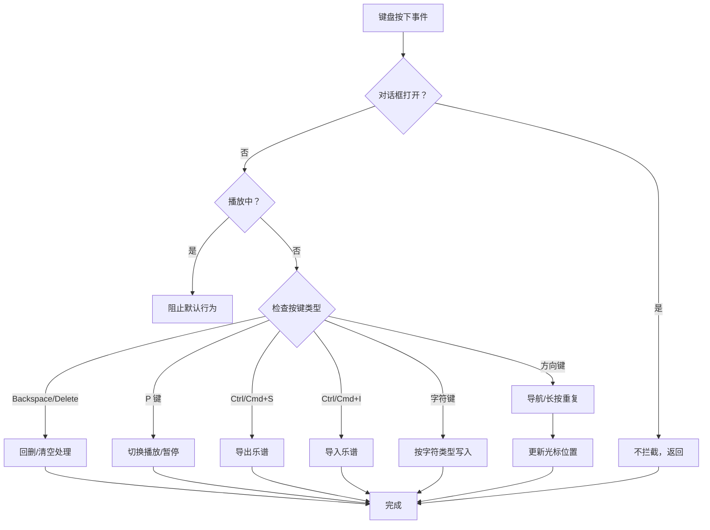
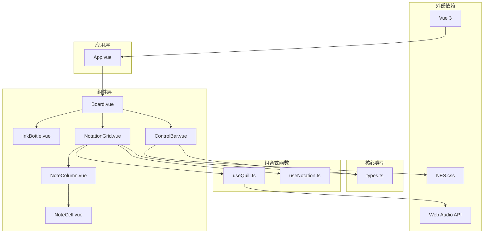

# 输入行为说明

<cite>
**本文引用的文件**
- [src/components/ControlBar.vue](file://src/components/ControlBar.vue)
- [src/components/NotationGrid.vue](file://src/components/NotationGrid.vue)
- [src/components/NoteColumn.vue](file://src/components/NoteColumn.vue)
- [src/components/InkBottle.vue](file://src/components/InkBottle.vue)
- [src/components/Board.vue](file://src/components/Board.vue)
- [src/composables/useNotation.ts](file://src/composables/useNotation.ts)
- [src/composables/useQuill.ts](file://src/composables/useQuill.ts)
- [src/core/types.ts](file://src/core/types.ts)
- [src/App.vue](file://src/App.vue)
</cite>

## 更新摘要
**变更内容**
- 新增InkBottle.vue墨水瓶装饰组件，增强视觉效果
- 移除输入模式切换功能，输入行为改为按输入字符类型决定覆盖/插入
- NotationGrid.vue统一Backspace/Delete的删除行为规则
- 在App.vue中集成InkBottle组件，支持播放时显示

## 目录
1. [简介](#简介)
2. [项目结构](#项目结构)
3. [核心组件](#核心组件)
4. [架构概览](#架构概览)
5. [详细组件分析](#详细组件分析)
6. [墨水瓶装饰系统](#墨水瓶装饰系统)
7. [依赖关系分析](#依赖关系分析)
8. [性能考量](#性能考量)
9. [故障排除指南](#故障排除指南)
10. [结论](#结论)
11. [附录](#附录)

## 简介
本文档详细介绍了 SUBOR Music Board 的输入行为。当前版本中不存在输入模式切换功能：写入行为由**输入字符的类型**决定，与格子当前是否有内容无关。音符与延音线（-）触发覆盖写入，空格触发插入写入，Backspace 与 Delete 分别执行不同的删除规则。文档还说明了待决修饰符的处理优先级、长按重复机制、播放期间的输入限制，以及相应的最佳实践和用户体验优化建议。

**更新** 新增了墨水瓶装饰系统的集成，增强了应用的视觉效果和用户体验。

## 项目结构
输入行为涉及多个核心组件的协作，形成完整的输入处理架构：



**图表来源**
- [src/App.vue:1-168](file://src/App.vue#L1-L168)
- [src/components/ControlBar.vue:1-116](file://src/components/ControlBar.vue#L1-L116)
- [src/components/NotationGrid.vue:1-348](file://src/components/NotationGrid.vue#L1-L348)
- [src/components/InkBottle.vue:1-47](file://src/components/InkBottle.vue#L1-L47)

**章节来源**
- [src/App.vue:1-168](file://src/App.vue#L1-L168)
- [src/components/ControlBar.vue:1-116](file://src/components/ControlBar.vue#L1-L116)
- [src/components/NotationGrid.vue:1-348](file://src/components/NotationGrid.vue#L1-L348)

## 核心组件
输入行为的核心规则由以下部分构成：

### 输入字符类型与写入行为
系统不维护任何输入模式状态，写入行为完全由输入字符的类型决定：
- 音符/延音线（-）：调用 setNote 覆盖当前位置内容，不触发位移
- 空格（休止符）：调用 insertNoteAt 在当前位置插入，后续同声部音符右移一位，末位丢弃
- Backspace：调用 backspaceAt 删除前一格并左移填补，末位补空格
- Delete：调用 deleteAt 清空当前格且不移位
- 支持的记谱字符：数字（1-7）、升降号（#、b）、八度修饰符（.、,）、延音线（-）、空格

### 待决修饰符与长按重复
- 待决升降号与待决八度修饰符各最多 1 个，重复输入后者覆盖前者，数字输入后按"升降号+八度修饰符+数字"顺序拼合提交
- 有待决修饰符时空格/延音线被忽略；Backspace 优先清八度再清升降号；Delete 清除全部待决修饰符
- 长按重复由自定义计时器驱动：首延 350ms（NOTE_REPEAT_INITIAL_DELAY）、间隔 110ms（NOTE_REPEAT_INTERVAL），忽略原生 e.repeat 事件
- 方向键长按重复间隔为 120ms（ARROW_REPEAT_INTERVAL）

**章节来源**
- [src/core/types.ts:68-79](file://src/core/types.ts#L68-L79)
- [src/components/ControlBar.vue:34-42](file://src/components/ControlBar.vue#L34-L42)

## 架构概览
输入行为采用事件驱动的架构设计，NotationGrid 通过全局键盘监听统一处理按键并按字符类型路由：

```mermaid
sequenceDiagram
participant User as 用户
participant NotationGrid as 记谱网格
participant useNotation as 记谱组合式函数
participant App as 应用根组件
User->>NotationGrid : 按下按键
NotationGrid->>NotationGrid : 对话框/播放状态检查
NotationGrid->>NotationGrid : 按键类型路由
NotationGrid->>useNotation : setNote / insertNoteAt / backspaceAt / deleteAt
useNotation-->>App : 响应式更新 Score 与光标
NotationGrid->>NotationGrid : 播放音符/书写动画/推进光标
Note : 覆盖与插入的写入行为在 NotationGrid 中按字符类型实现
```

**图表来源**
- [src/components/ControlBar.vue:34-42](file://src/components/ControlBar.vue#L34-L42)
- [src/components/NotationGrid.vue:242-247](file://src/components/NotationGrid.vue#L242-L247)
- [src/App.vue:74-76](file://src/App.vue#L74-L76)

## 详细组件分析

### ControlBar 组件分析
ControlBar 是控制栏的用户界面入口，提供播放控制、速度控制、调号控制等控制项，不包含任何输入行为开关：

#### 控制项构成


**图表来源**
- [src/components/ControlBar.vue:34-42](file://src/components/ControlBar.vue#L34-L42)
- [src/components/ControlBar.vue:16-24](file://src/components/ControlBar.vue#L16-L24)

#### 视觉反馈机制
- **控制项样式**: 各控制项使用统一的边框和文字样式
- **悬停效果**: 提供渐变背景色变化
- **标题提示**: 显示快捷键信息（如 P 键切换播放/暂停）
- **样式优化**: 增强的颜色对比度和过渡效果

**章节来源**
- [src/components/ControlBar.vue:34-42](file://src/components/ControlBar.vue#L34-L42)
- [src/components/ControlBar.vue:107-114](file://src/components/ControlBar.vue#L107-L114)

### NotationGrid 组件分析
NotationGrid 是输入行为的核心实现层，通过全局键盘监听按字符类型路由编辑操作：

#### 输入行为处理流程


**图表来源**
- [src/components/NotationGrid.vue:242-247](file://src/components/NotationGrid.vue#L242-L247)
- [src/components/ControlBar.vue:34-42](file://src/components/ControlBar.vue#L34-L42)

#### 编辑行为说明
写入与删除行为按输入字符类型表现出明确的差异：

**音符/延音线输入行为特征**:
- 覆盖写入：调用 setNote 直接替换当前位置内容，不移动后续音符
- 与格子当前是否有内容无关
- 光标移动：书写动画结束后自动前进到下一格

**空格输入行为特征**:
- 插入写入：调用 insertNoteAt 在当前位置插入休止符，后续同声部音符右移一位，末位丢弃
- 有待决修饰符时该输入被忽略
- 光标移动：直接前进到下一格

**Backspace 行为特征**:
- 有待决修饰符时优先清除待决八度修饰符，再清待决升降号
- 无待决修饰符时删除前一格音符，后续左移填补，末位补空格
- 光标移动：退回到前一格

**Delete 行为特征**:
- 有待决修饰符时清除全部待决修饰符
- 无待决修饰符时清空当前格音符，不移动后续音符
- 光标移动：保持在当前位置

**章节来源**
- [src/components/NotationGrid.vue:206-222](file://src/components/NotationGrid.vue#L206-L222)
- [src/composables/useNotation.ts:33-63](file://src/composables/useNotation.ts#L33-L63)

### useNotation 组合式函数分析
useNotation 提供了底层的数据操作能力，支持覆盖/插入/回删/清空所需的数据结构操作：

#### 数据结构设计


**图表来源**
- [src/composables/useNotation.ts:15-116](file://src/composables/useNotation.ts#L15-L116)

#### 插入算法实现
空格输入触发的插入通过数组右移实现音符插入：

**插入算法流程**:
1. 从数组末尾开始向前遍历
2. 将每个位置的音符复制到下一个位置
3. 在目标位置放置新音符
4. 保持数组长度不变

**回退算法流程**:
1. 从目标位置开始向前遍历
2. 将每个位置的音符复制到前一个位置
3. 在数组末尾放置空格
4. 光标向左移动一格

**章节来源**
- [src/composables/useNotation.ts:33-63](file://src/composables/useNotation.ts#L33-L63)

### 鼠标交互与播放状态限制
鼠标点击与播放状态对输入行为有以下限制：



**图表来源**
- [src/components/ControlBar.vue:34-42](file://src/components/ControlBar.vue#L34-L42)
- [src/App.vue:74-76](file://src/App.vue#L74-L76)

**章节来源**
- [src/components/ControlBar.vue:34-42](file://src/components/ControlBar.vue#L34-L42)
- [src/App.vue:74-76](file://src/App.vue#L74-L76)

### 键盘快捷键支持
系统提供了完整的键盘快捷键支持：

#### 键盘事件处理


**图表来源**
- [src/components/NotationGrid.vue:232-306](file://src/components/NotationGrid.vue#L232-L306)

#### 方向键导航优化
方向键长按重复由自定义计时器驱动：
- 首次延迟后按固定间隔（ARROW_REPEAT_INTERVAL=120ms）连续移动
- 忽略原生 e.repeat 事件
- 确保光标定位的准确性
- 清空输入队列防止旧输入写入新位置

**章节来源**
- [src/components/NotationGrid.vue:232-306](file://src/components/NotationGrid.vue#L232-L306)

## 墨水瓶装饰系统

### InkBottle 组件介绍
InkBottle 是新增的装饰性组件，为应用提供了独特的视觉元素：

#### 设计特点
- **墨水瓶外观**: 使用 CSS 伪元素创建立体的墨水瓶效果
- **动态定位**: 绝对定位在游戏板右下角
- **渐变色彩**: 青绿色渐变背景，营造墨水效果
- **阴影效果**: 内外阴影增强立体感
- **透明背景**: 使用线性渐变创建底部边缘效果

#### 样式实现
```mermaid
classDiagram
class InkBottle {
+position : absolute
+right : 6px
+bottom : 6px
+width : fit-content
+padding : 3px 2px 2px
+text-align : right
+font-family : Arial
+color : #3cc
+background : linear-gradient(to bottom, transparent 57%, currentColor 0)
+z-index : 10
+pointer-events : none
}
class InkBottle : : before {
+content : ''
+border : 6px solid transparent
+border-bottom-color : currentColor
+box-shadow : 0 6px
}
class InkBottle : : after {
+content : ''
+position : absolute
+inset : 3px 10px auto
+height : 1px
+border-style : solid
+border-width : 2px 0
}
class InkBottle > b {
+display : inline-block
+padding : 0 2px
+line-height : 1.15
+font-size : 14px
+background : #fff
+box-shadow : 0 1px 3px
}
```

**图表来源**
- [src/components/InkBottle.vue:1-47](file://src/components/InkBottle.vue#L1-L47)

#### 集成方式
InkBottle 组件通过 Board 组件的 overlay 插槽集成：
- 在播放状态下显示（`show-ink-bottle="true"`）
- 使用 CSS 变量控制显示状态
- 与主界面内容分离，不影响编辑功能

**章节来源**
- [src/components/InkBottle.vue:1-47](file://src/components/InkBottle.vue#L1-L47)
- [src/App.vue:119-165](file://src/App.vue#L119-L165)

## 依赖关系分析
输入行为相关功能的依赖关系体现了清晰的分层架构：



**图表来源**
- [src/App.vue:1-168](file://src/App.vue#L1-L168)
- [src/components/ControlBar.vue:1-116](file://src/components/ControlBar.vue#L1-L116)
- [src/components/NotationGrid.vue:1-348](file://src/components/NotationGrid.vue#L1-L348)
- [src/components/InkBottle.vue:1-47](file://src/components/InkBottle.vue#L1-L47)

**章节来源**
- [src/App.vue:1-168](file://src/App.vue#L1-L168)
- [src/components/ControlBar.vue:1-116](file://src/components/ControlBar.vue#L1-L116)
- [src/components/NotationGrid.vue:1-348](file://src/components/NotationGrid.vue#L1-L348)

## 性能考量
输入行为在设计时充分考虑了性能优化：

### 事件处理优化
- **长按重复计时器**: 音符键（首延 350ms、间隔 110ms）与方向键（间隔 120ms）由自定义计时器驱动，避免频繁 DOM 操作
- **输入队列**: 支持书写动画期间的输入缓冲，动画结束后批量写入数据、播放声音并一次性推进光标
- **条件渲染**: 控制栏各控制项的样式切换仅在状态变化时触发
- **样式缓存**: CSS 变量和类名切换优化渲染性能

### 数据结构优化
- **就地修改**: 使用原地数组操作减少内存分配
- **边界检查**: 在操作前进行范围验证，避免无效操作
- **批量更新**: 通过 Vue 响应式系统进行批量状态更新

### 动画性能
- **CSS 过渡**: 使用硬件加速的 CSS 过渡效果
- **动画状态机**: 通过状态枚举控制动画生命周期
- **位置缓存**: 避免重复计算 DOM 元素位置
- **墨水瓶优化**: 使用 CSS 伪元素减少额外 DOM 节点

## 故障排除指南
常见问题及解决方案：

### 空格未触发插入
**症状**: 输入空格后未出现右推插入
**排查步骤**:
1. 检查是否存在待决修饰符（有待决修饰符时空格被忽略）
2. 验证光标位置是否越界
3. 确认当前未处于播放状态

### 编辑行为异常
**症状**: 音符覆盖位置错误或回删移位方向不对
**排查步骤**:
1. 检查数组遍历方向是否正确
2. 验证边界条件处理
3. 确认光标移动逻辑

### 键盘事件冲突
**症状**: 方向键导航不稳定或长按重复异常
**排查步骤**:
1. 检查长按重复计时器的启动与停止逻辑
2. 验证输入队列清理逻辑
3. 确认事件冒泡阻止机制

### 墨水瓶显示问题
**症状**: 墨水瓶不显示或显示异常
**排查步骤**:
1. 检查 Board 组件的 show-ink-bottle 属性绑定
2. 验证 CSS 样式是否正确应用
3. 确认组件插槽渲染

**章节来源**
- [src/components/ControlBar.vue:34-42](file://src/components/ControlBar.vue#L34-L42)
- [src/components/NotationGrid.vue:232-306](file://src/components/NotationGrid.vue#L232-L306)
- [src/components/InkBottle.vue:1-47](file://src/components/InkBottle.vue#L1-L47)

## 结论
输入行为通过按字符类型路由的写入策略与清晰的职责分离，实现了直观而稳定的音符编辑体验。NotationGrid 实现了统一的键盘事件处理与编辑逻辑，useNotation 提供了稳定的数据操作能力。系统支持键盘快捷键（方向键导航、P 键播放/暂停、Ctrl/Cmd+S 导出、Ctrl/Cmd+I 导入）与鼠标交互（暂停态点击定位），并具有良好的性能表现和用户体验。

**更新** 新增的墨水瓶装饰系统进一步增强了应用的视觉效果，通过 CSS 伪元素技术实现了独特的立体效果，同时保持了良好的性能表现。整个系统的设计体现了现代前端开发的最佳实践：组件化架构、事件驱动设计、响应式状态管理，以及对用户体验细节的关注。

该功能的设计不仅保证了功能的完整性，还通过视觉优化和性能优化提升了整体用户体验。通过合理的抽象和封装，系统既保证了功能的完整性，又保持了代码的可维护性和可扩展性。

## 附录

### 最佳实践建议
1. **用户体验优化**
   - 提供清晰的视觉反馈（颜色、形状、动画）
   - 确保键盘快捷键的一致性
   - 保持操作的可预测性

2. **代码质量保证**
   - 严格的类型检查和边界验证
   - 完善的错误处理和异常情况处理
   - 清晰的注释和文档
   - 优化的样式和动画性能

3. **性能优化策略**
   - 避免不必要的 DOM 操作
   - 使用事件委托减少监听器数量
   - 合理使用 Vue 的响应式系统
   - CSS 伪元素替代额外 DOM 节点

4. **可访问性考虑**
   - 提供键盘导航支持
   - 确保足够的对比度和可读性
   - 支持屏幕阅读器
   - 考虑颜色盲用户的视觉需求

### 中文输入法兼容
系统对中文输入法输入的全角标点做了兼容处理：
- 全角"，"会被转换为半角 ","（低八度修饰符）
- 全角"。"会被转换为半角 "."（高八度修饰符）

### 扩展建议
1. **快捷键自定义**: 允许用户自定义操作快捷键
2. **操作历史记录**: 支持撤销/重做等编辑历史能力
3. **视觉主题**: 支持更多控制栏的视觉主题
