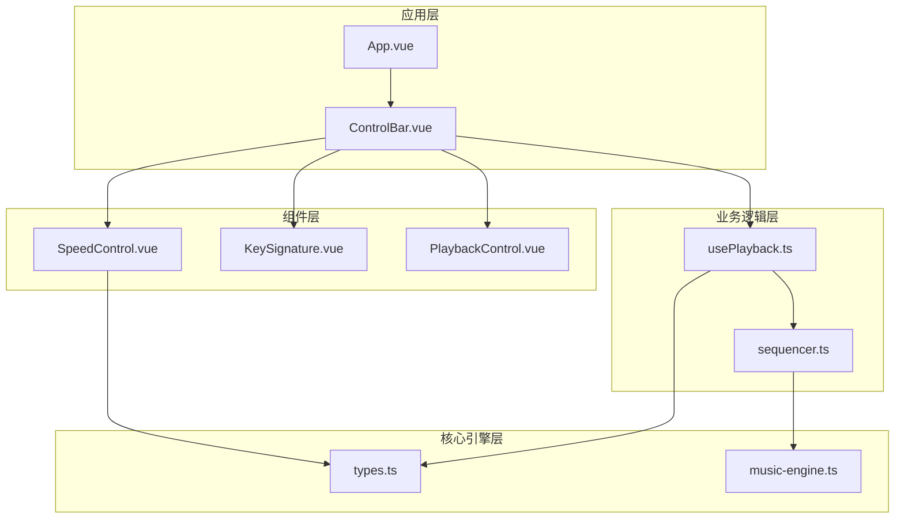
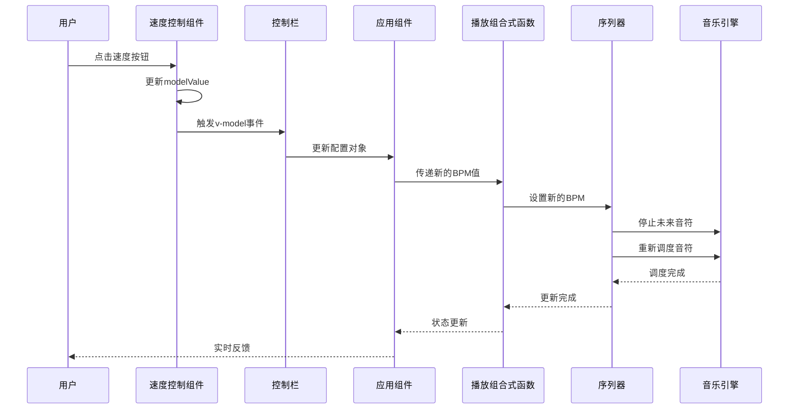
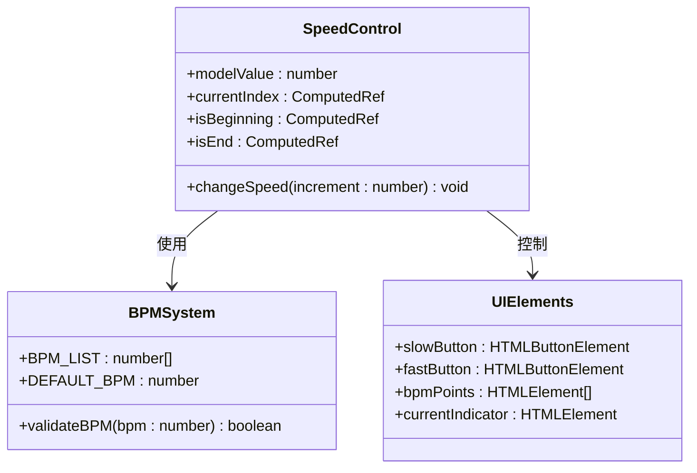
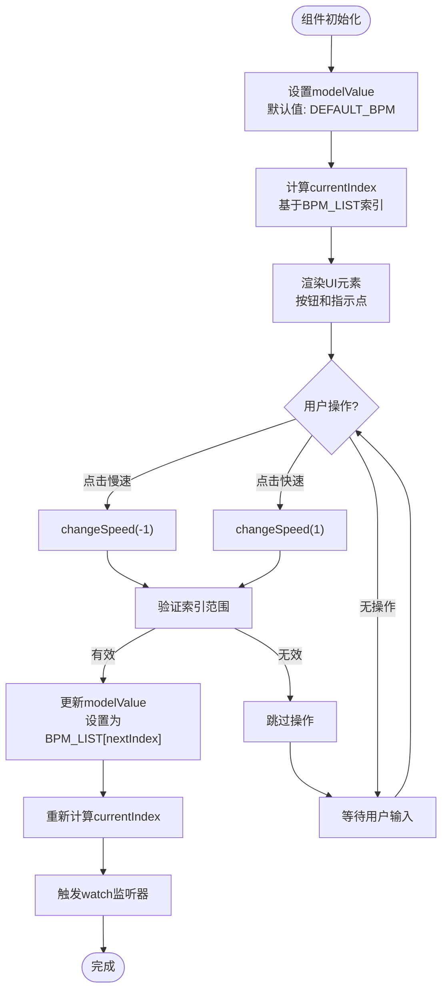
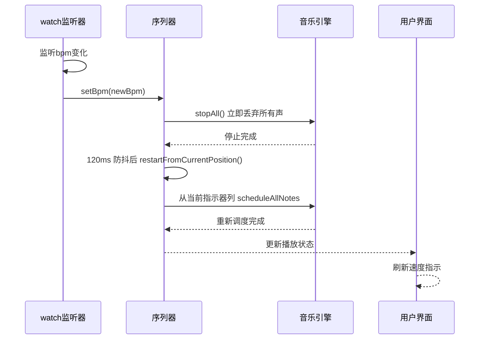
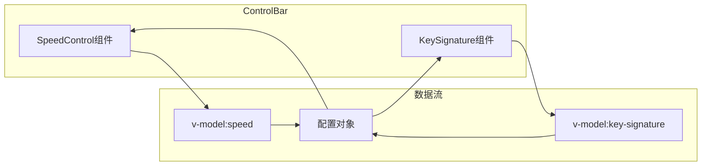
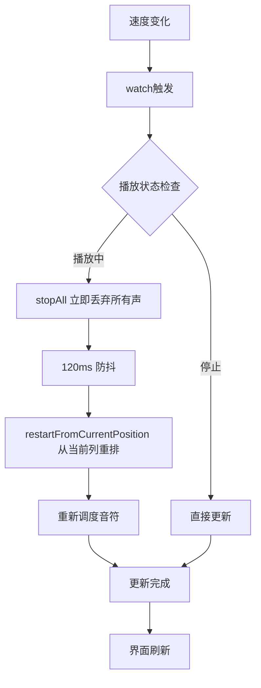
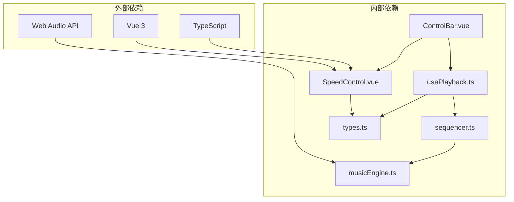

# 速度控制组件

<cite>
**本文档引用的文件**
- [SpeedControl.vue](file://src/components/SpeedControl.vue)
- [ControlBar.vue](file://src/components/ControlBar.vue)
- [usePlayback.ts](file://src/composables/usePlayback.ts)
- [types.ts](file://src/core/types.ts)
- [sequencer.ts](file://src/core/sequencer.ts)
- [music-engine.ts](file://src/core/music-engine.ts)
- [App.vue](file://src/App.vue)
- [style.css](file://src/style.css)
</cite>

## 目录
1. [简介](#简介)
2. [项目结构](#项目结构)
3. [核心组件](#核心组件)
4. [架构概览](#架构概览)
5. [详细组件分析](#详细组件分析)
6. [依赖关系分析](#依赖关系分析)
7. [性能考虑](#性能考虑)
8. [故障排除指南](#故障排除指南)
9. [结论](#结论)

## 简介

速度控制组件是 SUBOR Music Board 音乐创作平台中的关键功能模块，负责管理音乐播放的速度调节。该组件提供了直观的用户界面，允许用户在预定义的速度档位之间进行切换，同时确保音乐播放的实时响应和流畅体验。

该组件基于 Vue 3 的 Composition API 和 TypeScript 实现，采用了响应式数据绑定和实时更新机制，为用户提供了一个高效且用户友好的速度控制界面。

## 项目结构

速度控制组件在整个项目架构中扮演着重要的角色，主要涉及以下文件和模块：

**图表来源**
- [App.vue:1-138](file://src/App.vue#L1-L138)
- [ControlBar.vue:1-116](file://src/components/ControlBar.vue#L1-L116)
- [SpeedControl.vue:1-68](file://src/components/SpeedControl.vue#L1-L68)

**章节来源**
- [App.vue:1-138](file://src/App.vue#L1-L138)
- [ControlBar.vue:1-116](file://src/components/ControlBar.vue#L1-L116)
- [SpeedControl.vue:1-68](file://src/components/SpeedControl.vue#L1-L68)

## 核心组件

速度控制组件的核心功能围绕以下关键要素构建：

### 速度档位系统
组件支持离散的速度档位，每个档位都有明确的 BPM 值：
- 最慢档位：60 BPM
- 慢速档位：75 BPM
- 中等档位：90 BPM（默认）
- 快档位：105 BPM
- 更快档位：120 BPM
- 最快档位：135 BPM

### 数据绑定机制
组件采用 Vue 3 的 `defineModel` API 实现双向数据绑定，确保速度值在用户界面和应用状态之间保持同步。

### 实时更新策略
通过计算属性和响应式监听器，组件能够实时反映速度变化并对音乐播放引擎进行相应的调整。

**章节来源**
- [types.ts:101-117](file://src/core/types.ts#L101-L117)
- [SpeedControl.vue:1-68](file://src/components/SpeedControl.vue#L1-L68)
- [usePlayback.ts:33-41](file://src/composables/usePlayback.ts#L33-L41)

## 架构概览

速度控制组件的架构设计体现了清晰的分层结构和职责分离：

**图表来源**
- [SpeedControl.vue:14-20](file://src/components/SpeedControl.vue#L14-L20)
- [ControlBar.vue:31](file://src/components/ControlBar.vue#L31)
- [App.vue:25-42](file://src/App.vue#L25-L42)
- [usePlayback.ts:33-41](file://src/composables/usePlayback.ts#L33-L41)
- [sequencer.ts:84-115](file://src/core/sequencer.ts#L84-L115)

## 详细组件分析

### SpeedControl 组件实现

SpeedControl 组件是速度控制的核心实现，采用了简洁而高效的架构设计：

#### 组件结构分析

**图表来源**
- [SpeedControl.vue:1-68](file://src/components/SpeedControl.vue#L1-L68)
- [types.ts:101-117](file://src/core/types.ts#L101-L117)

#### 数据流处理

组件内部实现了完整的数据流处理机制：

**图表来源**
- [SpeedControl.vue:7-20](file://src/components/SpeedControl.vue#L7-L20)
- [SpeedControl.vue:14-20](file://src/components/SpeedControl.vue#L14-L20)

#### 速度范围设置机制

组件通过 `BPM_LIST` 数组实现预定义的速度范围控制：

| 档位 | BPM 值 | 说明 |
|------|--------|------|
| 0 | 60 | 最慢档位 |
| 1 | 75 | 慢速档位 |
| 2 | 90 | 默认档位 |
| 3 | 105 | 快档位 |
| 4 | 120 | 更快档位 |
| 5 | 135 | 最快档位 |

#### 步进值控制策略

组件采用离散步进控制而非连续调节，这种设计具有以下优势：

1. **用户体验优化**：提供明确的速度选择，避免用户在无限速度范围内迷失
2. **性能稳定性**：预定义档位减少了实时计算开销
3. **音乐协调性**：档位设置考虑了音乐节拍的自然分割

#### 实时更新机制

组件通过 Vue 的响应式系统实现实时更新：

**图表来源**
- [usePlayback.ts:33-41](file://src/composables/usePlayback.ts#L33-L41)
- [sequencer.ts:84-115](file://src/core/sequencer.ts#L84-L115)

**章节来源**
- [SpeedControl.vue:1-68](file://src/components/SpeedControl.vue#L1-L68)
- [types.ts:101-117](file://src/core/types.ts#L101-L117)
- [usePlayback.ts:33-41](file://src/composables/usePlayback.ts#L33-L41)

### ControlBar 集成层

ControlBar 组件作为 SpeedControl 的容器，提供了完整的控制界面集成：

#### 双向数据绑定实现

ControlBar 通过 Vue 3 的 `defineModel` API 实现与 SpeedControl 的双向数据绑定：

**图表来源**
- [ControlBar.vue:7-8](file://src/components/ControlBar.vue#L7-L8)
- [App.vue:25-42](file://src/App.vue#L25-L42)

**章节来源**
- [ControlBar.vue:1-116](file://src/components/ControlBar.vue#L1-L116)
- [App.vue:119-120](file://src/App.vue#L119-L120)

### 播放控制集成

速度控制与播放系统的深度集成为用户提供了无缝的体验：

#### 实时速度调整机制

播放系统通过 watch 监听器实现实时速度调整：

**图表来源**
- [usePlayback.ts:33-41](file://src/composables/usePlayback.ts#L33-L41)
- [sequencer.ts:84-115](file://src/core/sequencer.ts#L84-L115)

**章节来源**
- [usePlayback.ts:14-94](file://src/composables/usePlayback.ts#L14-L94)
- [sequencer.ts:84-115](file://src/core/sequencer.ts#L84-L115)

## 依赖关系分析

速度控制组件的依赖关系体现了清晰的架构层次：

**图表来源**
- [SpeedControl.vue:1-68](file://src/components/SpeedControl.vue#L1-L68)
- [usePlayback.ts:1-95](file://src/composables/usePlayback.ts#L1-L95)
- [sequencer.ts:1-354](file://src/core/sequencer.ts#L1-L354)
- [music-engine.ts:1-221](file://src/core/music-engine.ts#L1-L221)

### 关键依赖关系

1. **类型系统依赖**：SpeedControl 依赖 `types.ts` 中定义的 BPM_LIST 和 DEFAULT_BPM 常量
2. **播放系统集成**：通过 usePlayback 组合式函数与 sequencer 和 music-engine 集成
3. **UI 组件协作**：与 ControlBar 和其他控制组件协同工作

**章节来源**
- [SpeedControl.vue:2-4](file://src/components/SpeedControl.vue#L2-L4)
- [usePlayback.ts:1-4](file://src/composables/usePlayback.ts#L1-L4)
- [sequencer.ts:1-4](file://src/core/sequencer.ts#L1-L4)

## 性能考虑

速度控制组件在设计时充分考虑了性能优化：

### 实时性能优化

1. **丢弃重排机制**：当调整 BPM 时，stopAll 立即丢弃所有声，120ms 防抖后从当前指示器列整体重排，杜绝新旧叠加混响
2. **预调度优化**：使用一次性预调度所有剩余音符的策略，减少运行时计算开销
3. **内存管理**：及时清理停止的振荡器，避免内存泄漏

### 用户界面优化

1. **最小化重绘**：通过 CSS 类切换而非 DOM 结构修改实现状态更新
2. **事件防抖**：避免快速连续点击导致的竞争条件
3. **响应式设计**：适配不同屏幕尺寸和设备类型

### 音频性能优化

1. **精确时间控制**：使用 AudioContext 的绝对时间进行音符调度
2. **批量处理**：一次性处理所有音符，减少循环开销
3. **资源复用**：重用音频节点和连接，避免频繁创建销毁

**章节来源**
- [sequencer.ts:70-115](file://src/core/sequencer.ts#L70-L115)
- [music-engine.ts:171-197](file://src/core/music-engine.ts#L171-L197)

## 故障排除指南

### 常见问题及解决方案

#### 速度调整无响应

**症状**：点击速度按钮后，速度值不变化

**可能原因**：
1. BPM 值超出范围
2. 组件处于禁用状态
3. 数据绑定问题

**解决步骤**：
1. 检查 BPM 值是否在有效范围内
2. 验证按钮的禁用状态
3. 确认 v-model 绑定是否正确

#### 播放速度异常

**症状**：音乐播放速度与设置不符

**可能原因**：
1. BPM 设置未正确传递到播放系统
2. 序列器重新调度失败
3. 音乐引擎初始化问题

**解决步骤**：
1. 检查 usePlayback 组合式函数的 watch 监听器
2. 验证 sequencer.setBpm 方法的调用
3. 确认音乐引擎的初始化状态

#### 内存泄漏问题

**症状**：长时间使用后内存占用持续增长

**可能原因**：
1. 振荡器未正确停止
2. 定时器未清理
3. 事件监听器未移除

**解决步骤**：
1. 检查 stopAll 的调用与 restartTimer 防抖定时器是否在暂停/停止时清除
2. 验证定时器的清理逻辑
3. 确认组件卸载时的清理操作

**章节来源**
- [sequencer.ts:171-200](file://src/core/sequencer.ts#L171-L200)
- [music-engine.ts:155-197](file://src/core/music-engine.ts#L155-L197)

## 结论

速度控制组件作为 SUBOR Music Board 的核心功能模块，展现了优秀的软件架构设计和用户体验优化。通过精心设计的离散速度档位系统、高效的实时更新机制和深度的系统集成，该组件为用户提供了直观且响应迅速的速度控制体验。

组件的主要优势包括：

1. **清晰的架构设计**：分层结构确保了代码的可维护性和可扩展性
2. **高效的性能表现**：通过 stopAll 丢弃 + 120ms 防抖重排和预调度机制优化了实时性能
3. **良好的用户体验**：直观的界面设计和即时反馈机制提升了用户满意度
4. **稳定的系统集成**：与播放系统和音频引擎的深度集成确保了功能的完整性

未来可以考虑的功能增强包括：
- 支持自定义速度范围
- 添加键盘快捷键支持
- 实现更精细的速度调节（如滑块控件）
- 提供速度变化的历史记录功能

这些改进将进一步提升组件的功能性和用户体验，使其更好地服务于音乐创作和表演的需求。