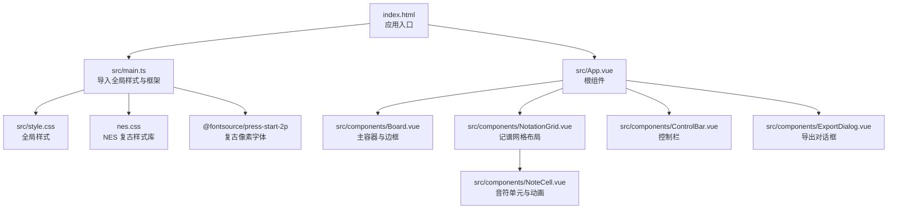
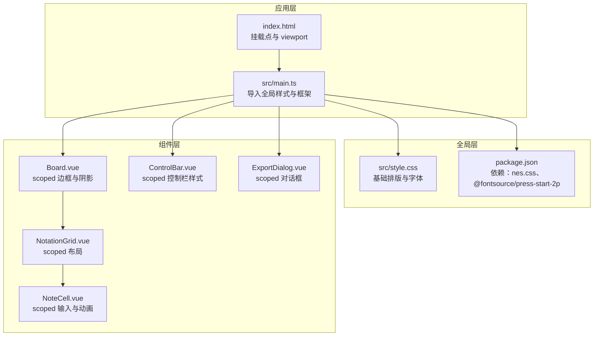
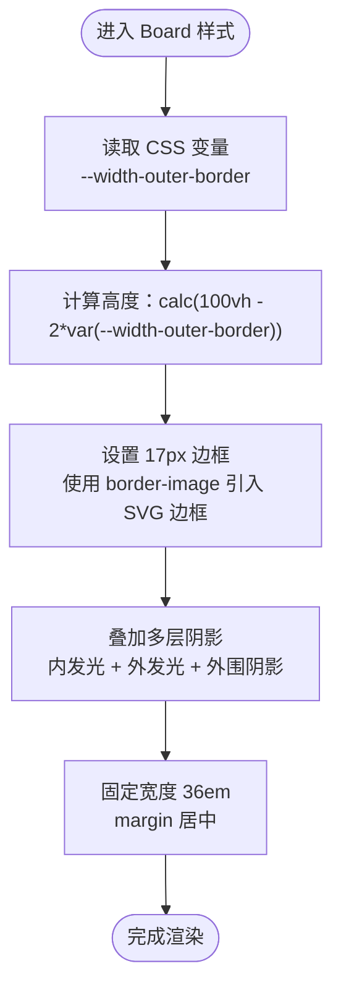
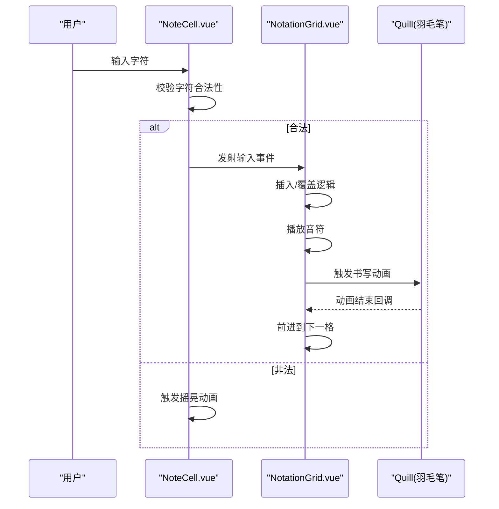
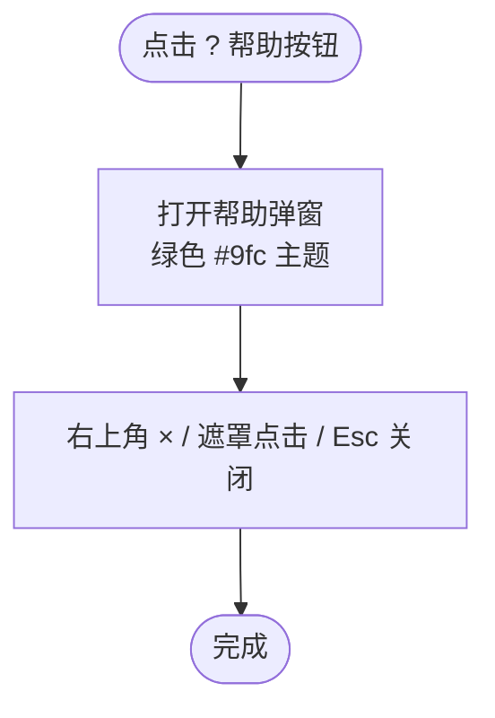
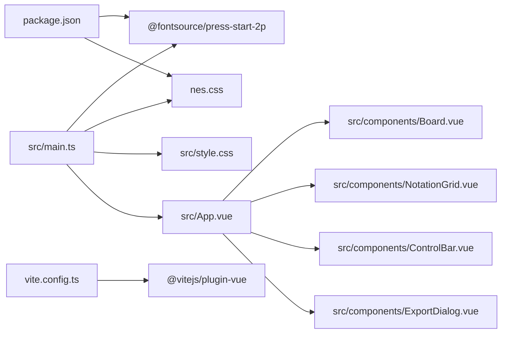

# 样式系统与主题

<cite>
**本文引用的文件**
- [src/style.css](file://src/style.css)
- [src/main.ts](file://src/main.ts)
- [src/App.vue](file://src/App.vue)
- [src/components/Board.vue](file://src/components/Board.vue)
- [src/components/NotationGrid.vue](file://src/components/NotationGrid.vue)
- [src/components/NoteCell.vue](file://src/components/NoteCell.vue)
- [src/components/ControlBar.vue](file://src/components/ControlBar.vue)
- [src/components/ExportDialog.vue](file://src/components/ExportDialog.vue)
- [index.html](file://index.html)
- [package.json](file://package.json)
- [vite.config.ts](file://vite.config.ts)
- [src/env.d.ts](file://src/env.d.ts)
</cite>

## 目录
1. [引言](#引言)
2. [项目结构](#项目结构)
3. [核心组件](#核心组件)
4. [架构总览](#架构总览)
5. [详细组件分析](#详细组件分析)
6. [依赖关系分析](#依赖关系分析)
7. [性能考量](#性能考量)
8. [故障排查指南](#故障排查指南)
9. [结论](#结论)
10. [附录](#附录)

## 引言
本文件系统化梳理 SUBOR Music Board 的样式体系与主题机制，涵盖全局样式组织、作用域与隔离、NES.css 框架集成与覆盖策略、FC/8-bit 复古风格实现（像素感、色彩与字体）、SVG 边框资源的使用与响应式适配、CSS 变量的主题定制模式，以及最佳实践与浏览器兼容性建议。目标是帮助开发者快速理解并扩展样式系统。

## 项目结构
样式系统由三部分构成：
- 全局样式：统一基础排版、列表、标签等基础元素的初始状态与字体。
- 组件级样式：通过 Vue 单文件组件的 scoped 样式实现作用域隔离与局部定制。
- 主题与框架：基于 NES.css 的复古按钮、表单控件与对话框样式，并结合 Press Start 2P 字体与自绘边框实现 FC 风格。

图表来源
- [index.html:1-14](file://index.html#L1-L14)
- [src/main.ts:1-7](file://src/main.ts#L1-L7)
- [src/style.css:1-30](file://src/style.css#L1-L30)
- [src/App.vue:102-138](file://src/App.vue#L102-L138)
- [src/components/Board.vue:12-47](file://src/components/Board.vue#L12-L47)
- [src/components/NotationGrid.vue:252-292](file://src/components/NotationGrid.vue#L252-L292)
- [src/components/NoteCell.vue:181-278](file://src/components/NoteCell.vue#L181-L278)
- [src/components/ControlBar.vue:27-116](file://src/components/ControlBar.vue#L27-L116)
- [src/components/ExportDialog.vue:37-119](file://src/components/ExportDialog.vue#L37-L119)

章节来源
- [index.html:1-14](file://index.html#L1-L14)
- [src/main.ts:1-7](file://src/main.ts#L1-L7)
- [src/style.css:1-30](file://src/style.css#L1-L30)

## 核心组件
- 全局样式与字体
  - 使用 Press Start 2P 作为主要字体，背景黑色、文字白色，统一列表与标签的基础行为。
  - 对 NES 按钮尺寸与符号按钮内边距进行微调，提升复古交互一致性。
- 主容器 Board
  - 通过 CSS 变量控制外边框宽度，使用 border-image 引入 SVG 边框资源，叠加多层阴影模拟 CRT 屏幕与边框厚度。
  - 容器采用固定宽度与视口高度计算，配合阴影与边距形成复古电视盒外观。
- 记谱网格与音符单元
  - 网格采用弹性布局与间距控制，单元内部通过伪元素与绝对定位实现高音/低音点标记。
  - 输入单元支持升降号前置、八度修饰符组合输入，并在非法输入时触发摇晃动画反馈。
- 控制栏与对话框
  - 控制栏按钮继承 NES 类，帮助按钮与帮助弹窗统一使用绿色 #9fc 主题，对话框使用 nes-dialog 语义化类名。

章节来源
- [src/style.css:1-30](file://src/style.css#L1-L30)
- [src/components/Board.vue:12-47](file://src/components/Board.vue#L12-L47)
- [src/components/NotationGrid.vue:278-292](file://src/components/NotationGrid.vue#L278-L292)
- [src/components/NoteCell.vue:200-278](file://src/components/NoteCell.vue#L200-L278)
- [src/components/ControlBar.vue:69-116](file://src/components/ControlBar.vue#L69-L116)
- [src/components/ExportDialog.vue:91-119](file://src/components/ExportDialog.vue#L91-L119)

## 架构总览
样式架构遵循“全局基础 + 组件作用域 + 外部框架”的分层设计。全局样式负责基础排版与字体；组件样式通过 scoped 实现隔离；NES.css 提供复古控件语义与视觉基线；Press Start 2P 提供 FC 字体体验；Board 的 border-image 引入 SVG 边框资源强化像素风格。

图表来源
- [src/style.css:1-30](file://src/style.css#L1-L30)
- [package.json:11-14](file://package.json#L11-L14)
- [src/main.ts:1-7](file://src/main.ts#L1-L7)
- [index.html:1-14](file://index.html#L1-L14)
- [src/components/Board.vue:12-47](file://src/components/Board.vue#L12-L47)
- [src/components/NotationGrid.vue:278-292](file://src/components/NotationGrid.vue#L278-L292)
- [src/components/NoteCell.vue:200-278](file://src/components/NoteCell.vue#L200-L278)
- [src/components/ControlBar.vue:69-116](file://src/components/ControlBar.vue#L69-L116)
- [src/components/ExportDialog.vue:91-119](file://src/components/ExportDialog.vue#L91-L119)

## 详细组件分析

### Board 组件：复古边框与容器
- 作用域样式通过 CSS 变量统一控制外边框宽度，结合 border-image 使用 SVG 边框资源，形成像素风格的四角与边线。
- 多层 box-shadow 模拟内发光、外发光与外围阴影，增强立体感与复古电视盒质感。
- 容器高度使用视口减去两倍外边框变量，宽度固定为 36em，居中布局，配合字体大小与颜色形成对比。

图表来源
- [src/components/Board.vue:12-47](file://src/components/Board.vue#L12-L47)

章节来源
- [src/components/Board.vue:12-47](file://src/components/Board.vue#L12-L47)

### NotationGrid 与 NoteCell：记谱输入与动画
- 网格布局采用弹性与间距控制，保证单元对齐与呼吸感。
- NoteCell 通过伪元素在音符上下方添加小点，表示高音/低音；输入时根据焦点与修饰符动态调整 maxlength 与显示内容。
- 非法输入触发摇晃动画，提供即时反馈；空格输入作为休止符处理，跳过书写动画并继续流程。

图表来源
- [src/components/NotationGrid.vue:112-157](file://src/components/NotationGrid.vue#L112-L157)
- [src/components/NoteCell.vue:68-115](file://src/components/NoteCell.vue#L68-L115)

章节来源
- [src/components/NotationGrid.vue:278-292](file://src/components/NotationGrid.vue#L278-L292)
- [src/components/NoteCell.vue:200-278](file://src/components/NoteCell.vue#L200-L278)

### ControlBar：NES 按钮与控件布局
- 按钮使用 nes-btn 类，Primary 按钮强调主操作；整体布局在 scoped 中实现紧凑与对齐。
- 帮助按钮与帮助弹窗统一使用绿色 #9fc 主题；红色 #c33 仅用于报错语义。

图表来源
- [src/components/ControlBar.vue:85-114](file://src/components/ControlBar.vue#L85-L114)

章节来源
- [src/components/ControlBar.vue:69-116](file://src/components/ControlBar.vue#L69-L116)

### ExportDialog：NES 对话框与字段
- 使用 nes-dialog 语义类名，居中定位与最大宽度约束，保证在不同屏幕下的可读性。
- 表单字段使用 nes-input 与 nes-textarea，提交按钮根据标题有效性启用/禁用。

章节来源
- [src/components/ExportDialog.vue:91-119](file://src/components/ExportDialog.vue#L91-L119)

### 全局样式与字体：Press Start 2P 与 NES 覆盖
- 全局样式设定字体家族、行高、列表与标签的基础行为，同时针对 nes-btn 与复选框标签进行字号与内边距优化。
- 应用入口在 main.ts 中导入 nes.css 核心样式与 Press Start 2P 字体，确保全局一致的复古外观。

章节来源
- [src/style.css:1-30](file://src/style.css#L1-L30)
- [src/main.ts:1-7](file://src/main.ts#L1-L7)
- [package.json:11-14](file://package.json#L11-L14)

## 依赖关系分析
- 入口依赖
  - index.html 提供挂载点与 viewport 设置。
  - main.ts 导入全局样式、NES 核心样式与字体源，随后挂载根组件。
- 组件依赖
  - Board 依赖 border.svg 资源与 CSS 变量。
  - NotationGrid 依赖 NoteCell 与 Quill 动画。
  - ExportDialog 依赖 nes.css 的对话框与表单类。
- 字体与框架
  - @fontsource/press-start-2p 与 nes.css 通过 package.json 管理版本，Vite 插件在构建时处理静态资源与字体注入。

图表来源
- [package.json:11-14](file://package.json#L11-L14)
- [vite.config.ts:1-7](file://vite.config.ts#L1-L7)
- [src/main.ts:1-7](file://src/main.ts#L1-L7)
- [src/style.css:1-30](file://src/style.css#L1-L30)
- [src/App.vue:102-138](file://src/App.vue#L102-L138)
- [src/components/Board.vue:12-47](file://src/components/Board.vue#L12-L47)
- [src/components/NotationGrid.vue:252-292](file://src/components/NotationGrid.vue#L252-L292)
- [src/components/ControlBar.vue:27-116](file://src/components/ControlBar.vue#L27-L116)
- [src/components/ExportDialog.vue:37-119](file://src/components/ExportDialog.vue#L37-L119)

章节来源
- [package.json:11-14](file://package.json#L11-L14)
- [vite.config.ts:1-7](file://vite.config.ts#L1-L7)
- [src/main.ts:1-7](file://src/main.ts#L1-L7)

## 性能考量
- scoped 样式与组件拆分
  - 通过组件级 scoped 样式减少全局污染，降低重绘范围，提升交互流畅度。
- 动画与布局
  - 音符书写动画仅在必要时触发，避免频繁重排；输入单元使用 transform 与 opacity 过渡，尽量利用合成层。
- 字体与资源
  - Press Start 2P 与 nes.css 体积可控，构建时由 Vite 处理，建议开启压缩与缓存策略。
- 响应式适配
  - 容器宽度固定为 36em，配合 viewport 与媒体查询可进一步细化移动端体验；边框与阴影在小屏设备上保持一致观感。

## 故障排查指南
- 字体未生效
  - 确认 main.ts 已导入字体包，且 package.json 中 @fontsource/press-start-2p 版本正确；检查 env.d.ts 中字体模块声明。
- 边框 SVG 未显示
  - 确认 Board.vue 中 border-image 路径指向 src/assets/border.svg，构建后资源路径正确；检查 CSS 变量与边框宽度设置。
- NES 按钮样式异常
  - 确认已导入 nes.css 核心样式；如需覆盖，优先在组件 scoped 中使用更具体的选择器，避免影响其他组件。
- 输入无效字符
  - NoteCell 对非法字符会触发摇晃动画，确认输入事件绑定与校验逻辑正常；检查 maxlength 与 displayValue 的联动。
- 对话框不可见
  - 确认 visible 属性与 open 属性同步；检查 scoped 样式中 z-index 与定位属性，避免被遮挡。

章节来源
- [src/main.ts:1-7](file://src/main.ts#L1-L7)
- [src/env.d.ts:9-12](file://src/env.d.ts#L9-L12)
- [src/components/Board.vue:24-29](file://src/components/Board.vue#L24-L29)
- [src/components/NoteCell.vue:68-115](file://src/components/NoteCell.vue#L68-L115)
- [src/components/ExportDialog.vue:37-89](file://src/components/ExportDialog.vue#L37-L89)

## 结论
本项目以 NES.css 为基础，结合 Press Start 2P 字体与自绘 SVG 边框，构建了统一的 FC/8-bit 复古风格界面。通过全局样式与组件 scoped 样式实现清晰的层次与作用域隔离，辅以 CSS 变量与动画反馈，既保证了视觉一致性，也兼顾了交互体验与可维护性。建议在扩展时遵循“全局最小化、组件局部化、框架语义化”的原则，持续优化响应式与性能表现。

## 附录
- 最佳实践
  - 在组件内优先使用 scoped 样式，避免全局污染。
  - 使用 CSS 变量集中管理主题参数（如边框宽度、阴影颜色），便于主题切换。
  - 对于外部框架样式（如 nes.css），采用覆盖而非重写，保持语义一致性。
  - 输入与动画场景中，尽量使用 transform 与 opacity，减少布局抖动。
- 浏览器兼容性
  - 确保目标浏览器支持 CSS 变量、flexbox、伪元素与 keyframes。
  - 对 border-image 与 box-shadow 的兼容性进行测试，必要时提供降级方案。
  - 在移动端验证字体缩放与触摸交互，确保可读性与可用性。