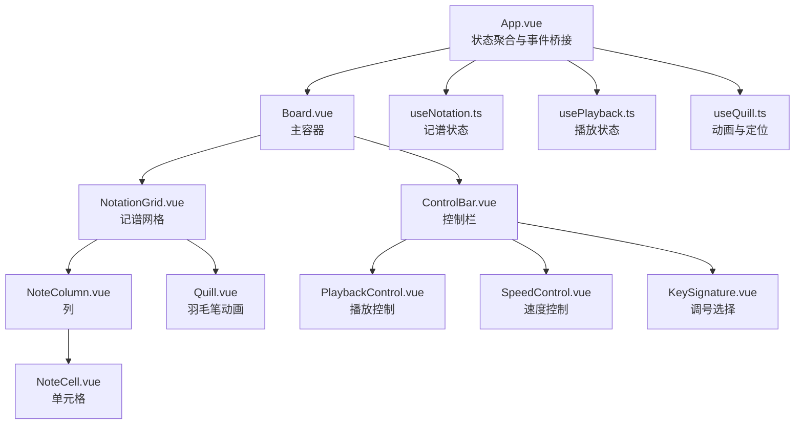
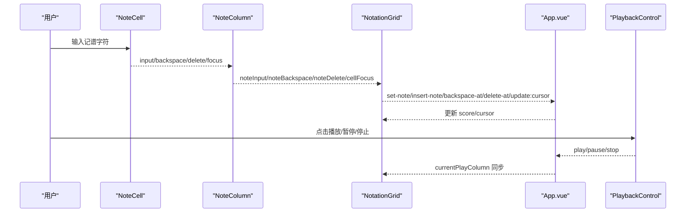
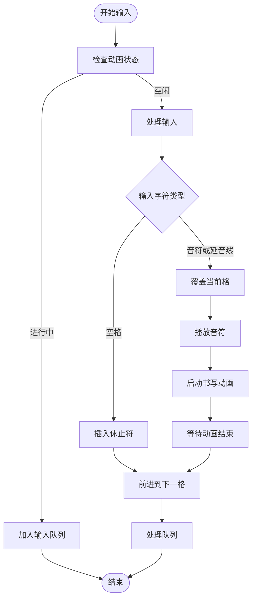
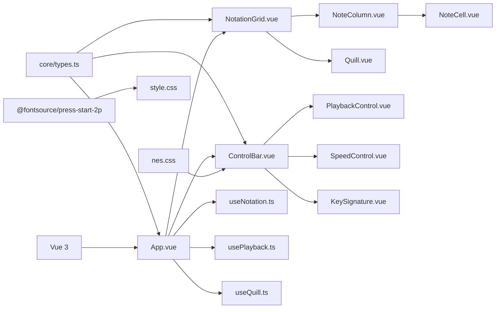
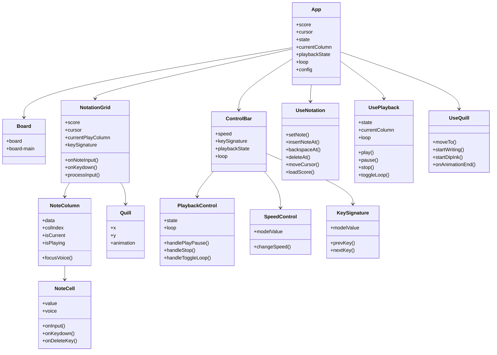

# 用户界面组件

<cite>
**本文引用的文件**
- [src/App.vue](file://src/App.vue)
- [src/main.ts](file://src/main.ts)
- [src/style.css](file://src/style.css)
- [src/components/Board.vue](file://src/components/Board.vue)
- [src/components/ControlBar.vue](file://src/components/ControlBar.vue)
- [src/components/NotationGrid.vue](file://src/components/NotationGrid.vue)
- [src/components/NoteColumn.vue](file://src/components/NoteColumn.vue)
- [src/components/NoteCell.vue](file://src/components/NoteCell.vue)
- [src/components/PlaybackControl.vue](file://src/components/PlaybackControl.vue)
- [src/components/KeySignature.vue](file://src/components/KeySignature.vue)
- [src/components/SpeedControl.vue](file://src/components/SpeedControl.vue)
- [src/components/Quill.vue](file://src/components/Quill.vue)
- [src/composables/useNotation.ts](file://src/composables/useNotation.ts)
- [src/composables/usePlayback.ts](file://src/composables/usePlayback.ts)
- [src/composables/useQuill.ts](file://src/composables/useQuill.ts)
- [src/core/types.ts](file://src/core/types.ts)
- [package.json](file://package.json)
</cite>

## 目录
1. [简介](#简介)
2. [项目结构](#项目结构)
3. [核心组件](#核心组件)
4. [架构总览](#架构总览)
5. [组件详解](#组件详解)
6. [依赖关系分析](#依赖关系分析)
7. [性能考量](#性能考量)
8. [故障排查指南](#故障排查指南)
9. [结论](#结论)
10. [附录](#附录)

## 简介
本文件系统性梳理用户界面组件的架构与实现，重点覆盖以下方面：
- 组件间通信模式：props 传递、v-model 双向绑定、事件冒泡与转发
- Board 主容器布局策略与滚动行为
- NotationGrid 记谱网格的渲染、输入处理、滚动与书写动画
- ControlBar 控制栏的布局与控件组织
- PlaybackControl 播放控制组件的交互与状态管理
- 样式系统：NES.css 集成与自定义样式的覆盖方法
- 使用最佳实践与性能优化建议

## 项目结构
应用采用“页面容器 + 功能组件 + 组合式工具”的分层组织：
- 页面容器：App.vue 负责状态聚合与事件桥接
- 主容器：Board.vue 提供统一边框与内边距，承载主要内容
- 记谱网格：NotationGrid.vue 渲染网格、处理输入、驱动书写动画
- 控制栏：ControlBar.vue 组织调号、速度与播放控制
- 子组件：NoteColumn.vue、NoteCell.vue 实现单元格渲染与输入校验
- 动画与工具：Quill.vue、useQuill.ts 提供羽毛笔动画与定位
- 状态与业务：useNotation.ts、usePlayback.ts 提供记谱与播放状态管理
- 核心类型：core/types.ts 定义记谱、速度、调号等类型与常量

图表来源
- [src/App.vue:1-138](file://src/App.vue#L1-L138)
- [src/components/Board.vue:1-47](file://src/components/Board.vue#L1-L47)
- [src/components/NotationGrid.vue:1-292](file://src/components/NotationGrid.vue#L1-L292)
- [src/components/ControlBar.vue:1-116](file://src/components/ControlBar.vue#L1-L116)
- [src/components/NoteColumn.vue:1-63](file://src/components/NoteColumn.vue#L1-L63)
- [src/components/NoteCell.vue:1-278](file://src/components/NoteCell.vue#L1-L278)
- [src/components/Quill.vue:1-65](file://src/components/Quill.vue#L1-L65)
- [src/components/PlaybackControl.vue:1-111](file://src/components/PlaybackControl.vue#L1-L111)
- [src/components/SpeedControl.vue:1-68](file://src/components/SpeedControl.vue#L1-L68)
- [src/components/KeySignature.vue:1-55](file://src/components/KeySignature.vue#L1-L55)
- [src/composables/useNotation.ts:1-116](file://src/composables/useNotation.ts#L1-L116)
- [src/composables/usePlayback.ts:1-95](file://src/composables/usePlayback.ts#L1-L95)
- [src/composables/useQuill.ts:1-39](file://src/composables/useQuill.ts#L1-L39)

章节来源
- [src/App.vue:1-138](file://src/App.vue#L1-L138)
- [src/components/Board.vue:1-47](file://src/components/Board.vue#L1-L47)
- [src/components/ControlBar.vue:1-116](file://src/components/ControlBar.vue#L1-L116)
- [src/components/NotationGrid.vue:1-292](file://src/components/NotationGrid.vue#L1-L292)
- [src/components/NoteColumn.vue:1-63](file://src/components/NoteColumn.vue#L1-L63)
- [src/components/NoteCell.vue:1-278](file://src/components/NoteCell.vue#L1-L278)
- [src/components/PlaybackControl.vue:1-111](file://src/components/PlaybackControl.vue#L1-L111)
- [src/components/KeySignature.vue:1-55](file://src/components/KeySignature.vue#L1-L55)
- [src/components/SpeedControl.vue:1-68](file://src/components/SpeedControl.vue#L1-L68)
- [src/components/Quill.vue:1-65](file://src/components/Quill.vue#L1-L65)
- [src/composables/useNotation.ts:1-116](file://src/composables/useNotation.ts#L1-L116)
- [src/composables/usePlayback.ts:1-95](file://src/composables/usePlayback.ts#L1-L95)
- [src/composables/useQuill.ts:1-39](file://src/composables/useQuill.ts#L1-L39)
- [src/core/types.ts:1-164](file://src/core/types.ts#L1-L164)
- [src/main.ts:1-8](file://src/main.ts#L1-L8)
- [src/style.css:1-30](file://src/style.css#L1-L30)
- [package.json:1-25](file://package.json#L1-L25)

## 核心组件
- Board 主容器：提供统一边框、阴影、居中布局与滚动区域，作为页面骨架
- NotationGrid 记谱网格：渲染列集合，处理键盘导航、播放状态同步、书写动画与队列
- ControlBar 控制栏：组织调号、速度与播放控制
- PlaybackControl 播放控制：提供播放/暂停、停止、循环切换
- NoteColumn/NoteCell：列与单元格渲染，负责输入校验、修饰符解析与焦点管理
- Quill/UseQuill：羽毛笔动画与定位，配合输入流程提供视觉反馈
- UseNotation/UsePlayback：记谱与播放状态管理，提供数据变更与播放序列控制

章节来源
- [src/components/Board.vue:1-47](file://src/components/Board.vue#L1-L47)
- [src/components/NotationGrid.vue:1-292](file://src/components/NotationGrid.vue#L1-L292)
- [src/components/ControlBar.vue:1-116](file://src/components/ControlBar.vue#L1-L116)
- [src/components/PlaybackControl.vue:1-111](file://src/components/PlaybackControl.vue#L1-L111)
- [src/components/NoteColumn.vue:1-63](file://src/components/NoteColumn.vue#L1-L63)
- [src/components/NoteCell.vue:1-278](file://src/components/NoteCell.vue#L1-L278)
- [src/components/Quill.vue:1-65](file://src/components/Quill.vue#L1-L65)
- [src/composables/useNotation.ts:1-116](file://src/composables/useNotation.ts#L1-L116)
- [src/composables/usePlayback.ts:1-95](file://src/composables/usePlayback.ts#L1-L95)
- [src/composables/useQuill.ts:1-39](file://src/composables/useQuill.ts#L1-L39)

## 架构总览
组件间通过 props/v-model 与事件进行松耦合通信：
- App.vue 聚合 useNotation 与 usePlayback 的状态与方法，向下传递给 Board/ControlBar/NotationGrid
- ControlBar 通过 v-model 双向绑定 speed 与 keySignature，同时转发播放控制事件
- NotationGrid 接收 score/cursor/currentPlayColumn/keySignature/playbackState，向上游派发输入与光标更新事件
- Quill 由 NotationGrid 驱动，通过 useQuill 提供位置与动画状态

图表来源
- [src/components/NoteCell.vue:1-278](file://src/components/NoteCell.vue#L1-L278)
- [src/components/NoteColumn.vue:1-63](file://src/components/NoteColumn.vue#L1-L63)
- [src/components/NotationGrid.vue:1-292](file://src/components/NotationGrid.vue#L1-L292)
- [src/App.vue:1-138](file://src/App.vue#L1-L138)
- [src/components/PlaybackControl.vue:1-111](file://src/components/PlaybackControl.vue#L1-L111)

## 组件详解

### Board 主容器
- 布局策略
  - 固定宽度与垂直居中，使用变量控制外边框宽度与阴影，形成复古边框效果
  - 主体区域使用 flex 布局，最小高度与滚动策略结合，保证内容溢出时出现滚动条
- 适用场景
  - 作为页面骨架，承载记谱网格与控制栏，统一视觉风格

章节来源
- [src/components/Board.vue:1-47](file://src/components/Board.vue#L1-L47)

### NotationGrid 记谱网格
- 渲染逻辑
  - 基于 score 数据渲染列集合，每个列包含三个声部（NoteColumn -> NoteCell）
  - 支持 currentPlayColumn 与 isPlaying 标识当前播放列，用于视觉高亮
- 输入与事件
  - 接收 note-input/backspace/delete/cell-focus 事件，向上游转发 set-note/insert-note/backspace-at/delete-at/update:cursor 等事件
  - 处理键盘导航（方向键移动光标，长按重复经节流控制），避免长按重复事件导致光标错乱
- 动画与书写
  - 使用 useQuill 提供的 position 与 animation，Quill.vue 展示羽毛笔动画
  - 采用输入队列与状态锁，保证每格书写动画完成后才处理下一输入
- 播放与声音
  - 在播放音符前初始化音乐引擎，将字符映射为 MIDI 并播放

图表来源
- [src/components/NotationGrid.vue:112-177](file://src/components/NotationGrid.vue#L112-L177)
- [src/components/NotationGrid.vue:186-244](file://src/components/NotationGrid.vue#L186-L244)
- [src/composables/useQuill.ts:1-39](file://src/composables/useQuill.ts#L1-L39)
- [src/components/Quill.vue:1-65](file://src/components/Quill.vue#L1-L65)

章节来源
- [src/components/NotationGrid.vue:1-292](file://src/components/NotationGrid.vue#L1-L292)
- [src/components/NoteColumn.vue:1-63](file://src/components/NoteColumn.vue#L1-L63)
- [src/components/NoteCell.vue:1-278](file://src/components/NoteCell.vue#L1-L278)
- [src/composables/useQuill.ts:1-39](file://src/composables/useQuill.ts#L1-L39)
- [src/components/Quill.vue:1-65](file://src/components/Quill.vue#L1-L65)

### ControlBar 控制栏
- 布局设计
  - 两组控件：一组为调号与速度，另一组为播放控制
  - 使用 gap 与居中对齐，保持紧凑与一致的间距
- 控件组织
  - KeySignature：左右按钮切换调号，禁用边界状态
  - SpeedControl：左右按钮切换 BPM 档位，中间点状指示当前档位
  - PlaybackControl：播放/暂停、停止、循环复选框
- 事件转发
  - 将播放控制事件向上游转发，交由 App.vue 处理

章节来源
- [src/components/ControlBar.vue:1-116](file://src/components/ControlBar.vue#L1-L116)
- [src/components/KeySignature.vue:1-55](file://src/components/KeySignature.vue#L1-L55)
- [src/components/SpeedControl.vue:1-68](file://src/components/SpeedControl.vue#L1-L68)
- [src/components/PlaybackControl.vue:1-111](file://src/components/PlaybackControl.vue#L1-L111)

### PlaybackControl 播放控制
- 功能实现
  - 根据 state 切换播放/暂停按钮样式与行为
  - 停止按钮在 stopped 状态禁用
  - 循环复选框切换 loop 状态并触发序列器设置
- 交互细节
  - 使用 NES.css 按钮样式与图标伪元素，实现播放/暂停/停止的视觉符号

章节来源
- [src/components/PlaybackControl.vue:1-111](file://src/components/PlaybackControl.vue#L1-L111)

### NoteCell 单元格
- 输入校验与修饰符
  - 单字符校验：数字 1-7、升降号 #/b、八度修饰符 ./, 空格
  - 升降号与八度修饰符支持组合输入，动态 maxlength 保障输入体验
  - 非法输入触发抖动反馈，聚焦时显示完整值，失焦时精简显示
- 事件与焦点
  - 发射 input/backspace/delete/focus 事件，供父组件处理
  - 支持键盘覆盖、Backspace/Delete 特殊键处理

章节来源
- [src/components/NoteCell.vue:1-278](file://src/components/NoteCell.vue#L1-L278)
- [src/core/types.ts:77-96](file://src/core/types.ts#L77-L96)

### NoteColumn 列
- 结构与职责
  - 渲染三声部 NoteCell，暴露 focusVoice 方法供父组件聚焦
  - 根据 isCurrent/isPlaying 添加视觉状态类，便于高亮当前播放列

章节来源
- [src/components/NoteColumn.vue:1-63](file://src/components/NoteColumn.vue#L1-L63)

### Quill 羽毛笔动画
- 位置与动画
  - 基于 useQuill 提供的位置信息，实时跟随输入元素
  - 支持 writing 与 dip-ink 两种动画，动画结束触发回调
- 性能优化
  - 使用 will-change 与过渡属性减少重绘开销

章节来源
- [src/components/Quill.vue:1-65](file://src/components/Quill.vue#L1-L65)
- [src/composables/useQuill.ts:1-39](file://src/composables/useQuill.ts#L1-L39)

### 样式系统与集成
- NES.css 集成
  - 通过 main.ts 引入 nes.css 核心样式，统一按钮、复选框等基础控件风格
- 自定义样式覆盖
  - style.css 覆盖字体、列表样式、按钮尺寸与复选框文本大小
  - 组件内部 scoped 样式确保局部覆盖，避免全局污染
- 字体与主题
  - 使用 Press Start 2P 字体，营造复古电子风格

章节来源
- [src/main.ts:1-8](file://src/main.ts#L1-L8)
- [src/style.css:1-30](file://src/style.css#L1-L30)
- [package.json:11-14](file://package.json#L11-L14)

## 依赖关系分析
- 运行时依赖
  - Vue 3、nes.css、@fontsource/press-start-2p
- 组件依赖
  - App.vue 依赖 useNotation/usePlayback/useImportExport，向下传递状态与事件
  - NotationGrid 依赖 NoteColumn/NoteCell/Quill/useQuill，以及核心类型与音乐引擎
  - ControlBar 依赖 KeySignature/SpeedControl/PlaybackControl

图表来源
- [package.json:11-14](file://package.json#L11-L14)
- [src/App.vue:1-138](file://src/App.vue#L1-L138)
- [src/components/ControlBar.vue:1-116](file://src/components/ControlBar.vue#L1-L116)
- [src/components/NotationGrid.vue:1-292](file://src/components/NotationGrid.vue#L1-L292)
- [src/components/NoteColumn.vue:1-63](file://src/components/NoteColumn.vue#L1-L63)
- [src/components/NoteCell.vue:1-278](file://src/components/NoteCell.vue#L1-L278)
- [src/components/Quill.vue:1-65](file://src/components/Quill.vue#L1-L65)
- [src/components/PlaybackControl.vue:1-111](file://src/components/PlaybackControl.vue#L1-L111)
- [src/components/SpeedControl.vue:1-68](file://src/components/SpeedControl.vue#L1-L68)
- [src/components/KeySignature.vue:1-55](file://src/components/KeySignature.vue#L1-L55)
- [src/composables/useNotation.ts:1-116](file://src/composables/useNotation.ts#L1-L116)
- [src/composables/usePlayback.ts:1-95](file://src/composables/usePlayback.ts#L1-L95)
- [src/composables/useQuill.ts:1-39](file://src/composables/useQuill.ts#L1-L39)
- [src/core/types.ts:1-164](file://src/core/types.ts#L1-L164)

章节来源
- [package.json:1-25](file://package.json#L1-L25)
- [src/App.vue:1-138](file://src/App.vue#L1-L138)
- [src/components/ControlBar.vue:1-116](file://src/components/ControlBar.vue#L1-L116)
- [src/components/NotationGrid.vue:1-292](file://src/components/NotationGrid.vue#L1-L292)
- [src/components/NoteColumn.vue:1-63](file://src/components/NoteColumn.vue#L1-L63)
- [src/components/NoteCell.vue:1-278](file://src/components/NoteCell.vue#L1-L278)
- [src/components/Quill.vue:1-65](file://src/components/Quill.vue#L1-L65)
- [src/components/PlaybackControl.vue:1-111](file://src/components/PlaybackControl.vue#L1-L111)
- [src/components/SpeedControl.vue:1-68](file://src/components/SpeedControl.vue#L1-L68)
- [src/components/KeySignature.vue:1-55](file://src/components/KeySignature.vue#L1-L55)
- [src/composables/useNotation.ts:1-116](file://src/composables/useNotation.ts#L1-L116)
- [src/composables/usePlayback.ts:1-95](file://src/composables/usePlayback.ts#L1-L95)
- [src/composables/useQuill.ts:1-39](file://src/composables/useQuill.ts#L1-L39)
- [src/core/types.ts:1-164](file://src/core/types.ts#L1-L164)

## 性能考量
- 渲染与更新
  - NotationGrid 使用 v-for 渲染列，注意列数量与声部数量固定为 3，避免频繁重建 DOM
  - 使用 nextTick 与输入队列，降低动画与输入之间的竞争，提升流畅度
- 动画与定位
  - Quill 使用 will-change 与过渡属性，减少重绘；动画结束后及时释放状态
- 事件处理
  - 键盘导航中忽略长按 repeat 事件，避免焦点快速切换导致的光标错乱
- 状态管理
  - useNotation/usePlayback 将状态集中管理，避免多处重复计算与副作用
- 样式与资源
  - 通过 scoped 样式与局部覆盖，减少全局样式冲突；字体与图标资源按需引入

[本节为通用性能建议，不直接分析具体文件，故无章节来源]

## 故障排查指南
- 输入无效字符
  - 现象：输入非合法字符时单元格抖动
  - 原因：NoteCell 对单字符进行严格校验
  - 处理：确认输入为 1-7、#、b、., 空格之一
- 输入行为差异
  - 现象：不同字符输入后行为不同
  - 原因：音符或延音线覆盖当前格并右移，空格插入休止符并右移
  - 处理：注意 Backspace 删除前一格并左移填补、Delete 清空当前格且光标不动
- 动画卡顿或跳帧
  - 现象：书写动画不连贯
  - 原因：动画状态未正确重置或队列阻塞
  - 处理：确保 onQuillAnimationEnd 正确触发，避免并发输入
- 播放状态异常
  - 现象：播放/暂停/停止状态不一致
  - 原因：PlaybackControl 与 usePlayback 状态未同步
  - 处理：检查 ControlBar 事件转发与 App.vue 的状态绑定

章节来源
- [src/components/NoteCell.vue:68-115](file://src/components/NoteCell.vue#L68-L115)
- [src/components/NotationGrid.vue:112-177](file://src/components/NotationGrid.vue#L112-L177)
- [src/components/PlaybackControl.vue:16-30](file://src/components/PlaybackControl.vue#L16-L30)
- [src/App.vue:30-53](file://src/App.vue#L30-L53)

## 结论
本项目通过清晰的组件分层与严格的 props/v-model/事件通信模式，实现了记谱输入、播放控制与视觉反馈的协同工作。NotationGrid 作为核心渲染与交互中枢，结合 Quill 动画与 useQuill 定位，提供了沉浸式的输入体验；ControlBar 将调号、速度与播放控制整合为统一入口；Board 提供一致的视觉框架。样式系统以 NES.css 为基础，辅以自定义覆盖，形成独特的复古电子风格。

[本节为总结性内容，不直接分析具体文件，故无章节来源]

## 附录
- 组件类图（代码级）

图表来源
- [src/App.vue:1-138](file://src/App.vue#L1-L138)
- [src/components/Board.vue:1-47](file://src/components/Board.vue#L1-L47)
- [src/components/NotationGrid.vue:1-292](file://src/components/NotationGrid.vue#L1-L292)
- [src/components/NoteColumn.vue:1-63](file://src/components/NoteColumn.vue#L1-L63)
- [src/components/NoteCell.vue:1-278](file://src/components/NoteCell.vue#L1-L278)
- [src/components/ControlBar.vue:1-116](file://src/components/ControlBar.vue#L1-L116)
- [src/components/PlaybackControl.vue:1-111](file://src/components/PlaybackControl.vue#L1-L111)
- [src/components/KeySignature.vue:1-55](file://src/components/KeySignature.vue#L1-L55)
- [src/components/SpeedControl.vue:1-68](file://src/components/SpeedControl.vue#L1-L68)
- [src/components/Quill.vue:1-65](file://src/components/Quill.vue#L1-L65)
- [src/composables/useNotation.ts:1-116](file://src/composables/useNotation.ts#L1-L116)
- [src/composables/usePlayback.ts:1-95](file://src/composables/usePlayback.ts#L1-L95)
- [src/composables/useQuill.ts:1-39](file://src/composables/useQuill.ts#L1-L39)