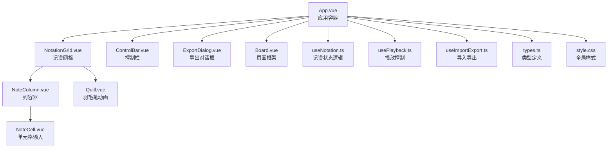
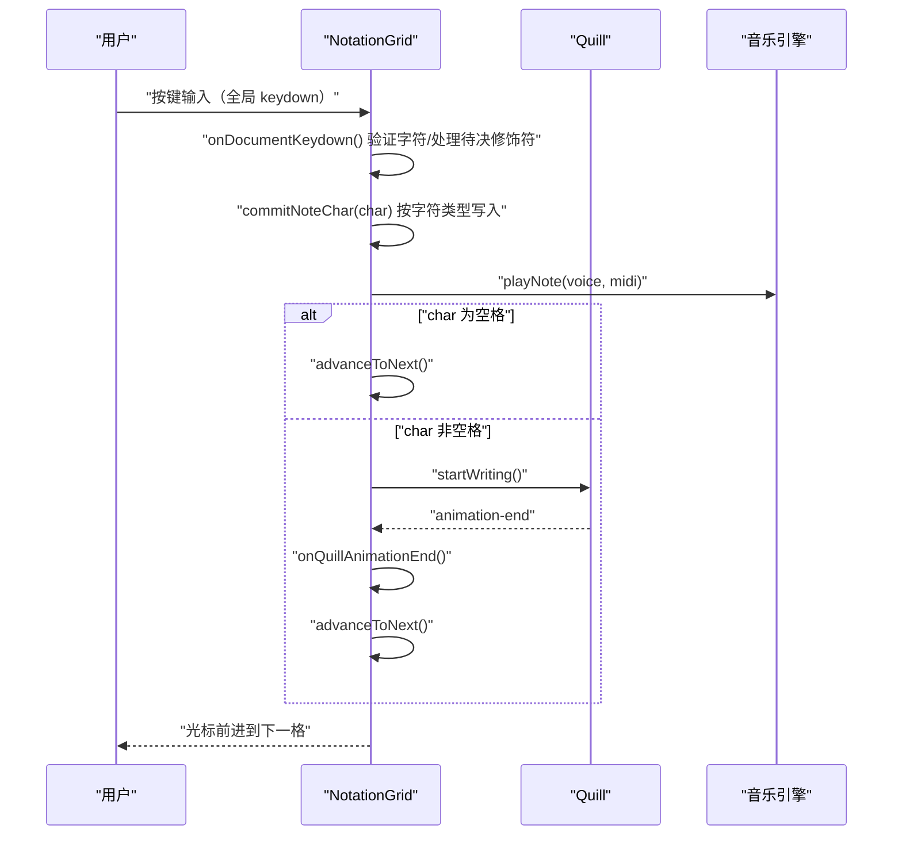
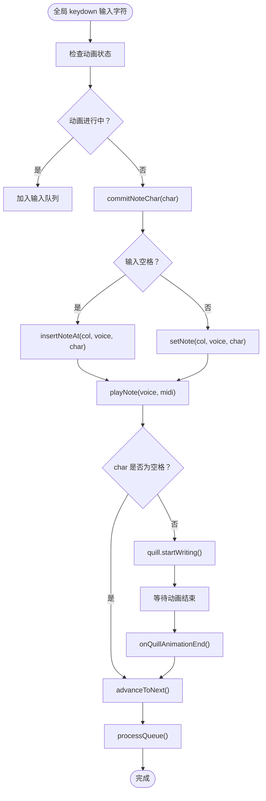
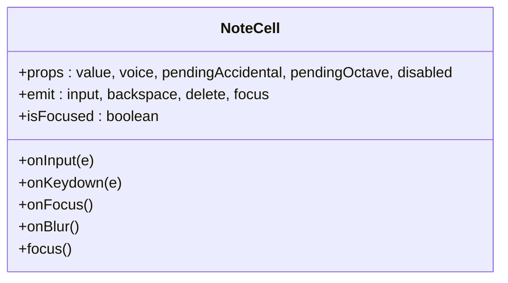
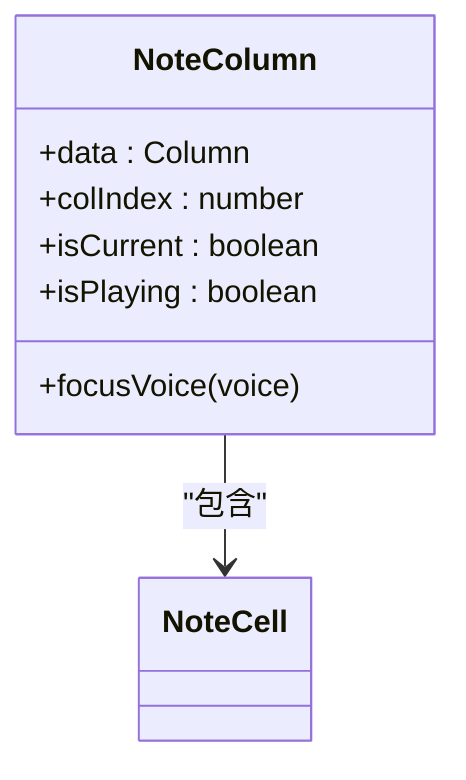
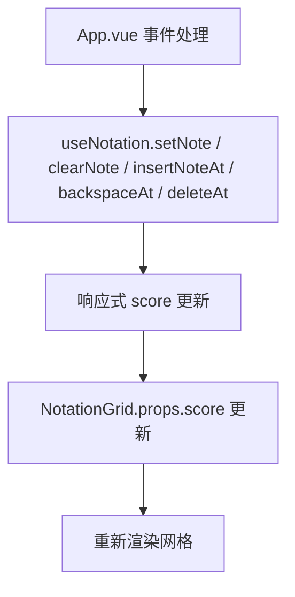
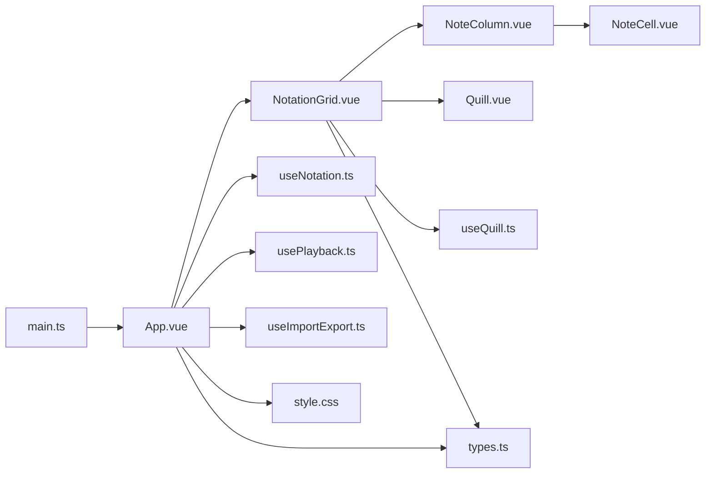

# 记谱网格核心组件

<cite>
**本文档引用的文件**
- [NotationGrid.vue](file://src/components/NotationGrid.vue)
- [NoteCell.vue](file://src/components/NoteCell.vue)
- [NoteColumn.vue](file://src/components/NoteColumn.vue)
- [Quill.vue](file://src/components/Quill.vue)
- [useNotation.ts](file://src/composables/useNotation.ts)
- [useQuill.ts](file://src/composables/useQuill.ts)
- [types.ts](file://src/core/types.ts)
- [App.vue](file://src/App.vue)
- [Board.vue](file://src/components/Board.vue)
- [style.css](file://src/style.css)
- [main.ts](file://src/main.ts)
- [package.json](file://package.json)
</cite>

## 目录
1. [简介](#简介)
2. [项目结构](#项目结构)
3. [核心组件](#核心组件)
4. [架构总览](#架构总览)
5. [详细组件分析](#详细组件分析)
6. [依赖关系分析](#依赖关系分析)
7. [性能考虑](#性能考虑)
8. [故障排除指南](#故障排除指南)
9. [结论](#结论)
10. [附录](#附录)

## 简介
本文件针对记谱网格核心组件进行系统化技术文档梳理，重点围绕 NotationGrid 组件的整体架构设计、Flexbox 网格布局与响应式适配策略、输入队列机制、书写动画控制、光标管理系统、**以光标为中心的全局键盘监听系统**（含方向键处理、按字符类型区分的覆盖/插入写入、音符字符输入与长按重复机制）、组件间事件通信机制（父子组件数据传递与事件冒泡处理），以及性能优化与最佳实践展开。文档力求在保持技术深度的同时，兼顾非专业读者的理解需求。

**核心设计理念：** 采用全局键盘监听架构，通过 `document.addEventListener('keydown')` 捕获所有按键事件，无论 input 是否聚焦都能响应输入，确保用户在任何 UI 交互后都能继续流畅地编辑乐谱。

## 项目结构
该项目采用 Vue 3 Composition API 的前端架构，核心组件位于 src/components 下，数据与状态逻辑通过 composable 提供，类型定义集中在 core/types 中。应用入口在 src/main.ts，UI 容器组件 Board.vue 提供页面框架。



图表来源
- [App.vue:102-138](file://src/App.vue#L102-L138)
- [NotationGrid.vue:252-276](file://src/components/NotationGrid.vue#L252-L276)
- [NoteColumn.vue:30-44](file://src/components/NoteColumn.vue#L30-L44)
- [NoteCell.vue:181-198](file://src/components/NoteCell.vue#L181-L198)
- [Quill.vue:15-25](file://src/components/Quill.vue#L15-L25)
- [Board.vue:3-9](file://src/components/Board.vue#L3-L9)
- [useNotation.ts:15-116](file://src/composables/useNotation.ts#L15-L116)
- [types.ts:1-164](file://src/core/types.ts#L1-L164)
- [style.css:1-30](file://src/style.css#L1-L30)

章节来源
- [main.ts:1-8](file://src/main.ts#L1-L8)
- [package.json:1-25](file://package.json#L1-L25)

## 核心组件
本节概述 NotationGrid 及其子组件的关键职责与协作方式：
- **NotationGrid**：负责网格布局、输入队列、书写动画控制、光标管理、**全局键盘事件中心**、事件转发与与音乐引擎交互。
  - **全局键盘监听器**：通过 `document.addEventListener('keydown', onDocumentKeydown)` 实现
    - 智能路由：根据应用状态（播放/编辑）和上下文（对话框）分发按键
    - 方向键导航：上下左右移动光标
    - Backspace/Delete：删除音符并调整光标
    - 音符字符输入：验证 + 长按重复 + 自动推进光标
- NoteColumn：封装一列三声部的 NoteCell，并暴露聚焦方法给父组件。
- NoteCell：实现单个音符单元的显示解析、待决修饰符的临时显示（经 props 传入）、焦点管理与抖动反馈，input 事件作为安全网处理粘贴/IME 等边缘输入。
- Quill：承载羽毛笔动画，根据状态驱动笔尖与蘸墨动画，并同步位置到当前输入元素。
- useNotation：提供乐谱数据、光标、覆盖/插入的增删改操作与批量加载。
- types：统一定义记谱字符、显示解析、声部索引、调号等类型与校验规则。

章节来源
- [NotationGrid.vue:1-292](file://src/components/NotationGrid.vue#L1-L292)
- [NoteColumn.vue:1-63](file://src/components/NoteColumn.vue#L1-L63)
- [NoteCell.vue:1-278](file://src/components/NoteCell.vue#L1-L278)
- [Quill.vue:1-65](file://src/components/Quill.vue#L1-L65)
- [useNotation.ts:1-116](file://src/composables/useNotation.ts#L1-L116)
- [types.ts:1-164](file://src/core/types.ts#L1-L164)

## 架构总览
NotationGrid 作为核心控制器，通过 props 接收乐谱数据、光标位置与当前播放列；通过 emits 向父组件广播更新事件；内部维护输入队列与动画状态，以全局键盘监听统一处理输入，协调 Quill 动画与音乐引擎播放；子组件 NoteColumn/NoteCell 负责显示与焦点定位。



图表来源
- [NotationGrid.vue:112-156](file://src/components/NotationGrid.vue#L112-L156)
- [NoteColumn.vue:38-41](file://src/components/NoteColumn.vue#L38-L41)
- [NoteCell.vue:68-115](file://src/components/NoteCell.vue#L68-L115)
- [Quill.vue:15-25](file://src/components/Quill.vue#L15-L25)

## 详细组件分析

### NotationGrid 组件分析
- 网格布局与 Flexbox 实现
  - 使用 ul/li 结构配合 CSS Flexbox，设置 flex-wrap 与 gap，形成可换行的网格布局，便于响应式适配。
  - 列容器 NoteColumn 以垂直方向排列三声部，通过 nth-child 选择器为每四列交替边框颜色，增强小节识别。
- 输入队列机制
  - 在书写动画进行期间，将后续输入缓存至队列，确保每个音符依次处理，避免并发写入导致的错位。
  - 动画结束回调中处理队列，实现“逐个推进”的输入体验。
- 书写动画控制
  - 通过 useQuill 管理位置与动画状态，非空格音符触发 Quill 写字动画，动画结束后自动前进到下一格。
  - 空格（休止符）跳过动画，直接前进，提升输入效率。
- 光标管理系统
  - 通过 moveCursor 更新光标位置，focusCell 调用子列的 focusVoice 将焦点移动到指定声部的输入框。
  - onCellFocus 在列获得焦点时同步光标并更新 Quill 位置。
- 键盘导航系统
  - **全局监听架构**：通过 `document.addEventListener('keydown')` 捕获所有按键，不依赖 input 焦点
  - 支持方向键上下左右移动光标
  - **音符字符输入**：直接在全局监听器中处理，验证合法性后根据输入字符类型执行 insert/set 操作（空格插入、音符/延音线覆盖）
  - 长按重复：由自定义计时器驱动（首延 350ms、间隔 110ms），忽略原生 `e.repeat` 事件
  - 导航时清空输入队列，防止旧输入写入新位置
  - 自动推进：输入音符后自动移动光标到下一列
- 播放跟随滚动
  - 乐谱超出一屏（`.board-scroll` 出现滚动条）时，播放头所在列自动滚入可视区，长乐谱无需手动拖动滚动条。
  - `scrollPlayheadIntoView(col)` 用滚动容器与列的 rect 差值换算行位置（不依赖 offsetParent，`.board-scroll` 为 static 定位），仅在行越出可视区时才改动 `scrollTop`，行内推进为空操作。
  - 向下翻行用平滑滚动，并额外露出 1 行（`PLAY_SCROLL_LOOKAHEAD_ROWS`）；向上/循环回卷到开头时即时跳转，避免长距离平滑动画拖尾。
  - 触发时机：`currentPlayColumn` 变化（仅播放中）与 `isPlaying` 变 true（续播 / seek 后立即定位）；停止与暂停不改动滚动位置。
- 事件通信机制
  - 父子组件通过 props 传入数据，通过 emits 广播事件，实现双向数据流与行为解耦。
  - App.vue 作为容器，集中处理 set/clear/insert/backspace/delete 等动作，并更新光标与播放状态。



图表来源
- [NotationGrid.vue:112-156](file://src/components/NotationGrid.vue#L112-L156)

章节来源
- [NotationGrid.vue:283-291](file://src/components/NotationGrid.vue#L283-L291)
- [NotationGrid.vue:185-244](file://src/components/NotationGrid.vue#L185-L244)
- [NotationGrid.vue:58-68](file://src/components/NotationGrid.vue#L58-L68)
- [NotationGrid.vue:101-110](file://src/components/NotationGrid.vue#L101-L110)

### NoteCell 组件分析
- 输入处理（安全网）
  - 音符字符的正常输入路径由 NotationGrid 的全局键盘监听统一处理；NoteCell 的 input 事件仅作为安全网，校验单字符（数字、升降号、八度修饰符、延音线、空格），非法字符触发抖动反馈并重置受控值。
  - 全角"，"转半角"，"、"。"转"."，兼容中文输入法。
- 显示与样式
  - 聚焦时显示完整值（含升降号），未聚焦时隐藏升降号，仅显示数字。
  - 八度修饰符通过 CSS 类在音符上方/下方添加点标记。
  - NotationGrid 暂存的待决升降号与八度修饰符经 props（pendingAccidental/pendingOctave）下发，由 NoteCell 临时显示。
- 交互与焦点
  - 新输入时自动全选，覆盖旧值。
  - onKeydown 仅对原生 repeat 事件做 preventDefault 节流，实际长按重复由 NotationGrid 的自定义计时器驱动。
  - Backspace/Delete 由 NotationGrid 的全局键盘监听统一处理，NoteCell 不做删除逻辑。



图表来源
- [NoteCell.vue:1-178](file://src/components/NoteCell.vue#L1-L178)

章节来源
- [NoteCell.vue:68-115](file://src/components/NoteCell.vue#L68-L115)
- [NoteCell.vue:137-157](file://src/components/NoteCell.vue#L137-L157)
- [NoteCell.vue:181-198](file://src/components/NoteCell.vue#L181-L198)

### NoteColumn 组件分析
- 列容器职责
  - 以垂直方向展示三声部音符，暴露 focusVoice 方法供父组件调用。
  - 通过事件冒泡将子组件的输入、回退、删除与焦点事件上抛。
- 样式与视觉提示
  - 每四列交替边框颜色，突出小节分隔；当前播放列使用阴影高亮。



图表来源
- [NoteColumn.vue:1-28](file://src/components/NoteColumn.vue#L1-L28)
- [NoteColumn.vue:30-44](file://src/components/NoteColumn.vue#L30-L44)

章节来源
- [NoteColumn.vue:20-27](file://src/components/NoteColumn.vue#L20-L27)
- [NoteColumn.vue:46-63](file://src/components/NoteColumn.vue#L46-L63)

### Quill 组件分析
- 动画状态与位置同步
  - 通过 useQuill 提供的位置与动画状态，实时更新笔的位置与动画效果。
  - 支持“写字”和“蘸墨”两类动画，动画结束触发回调，交由父组件处理后续流程。
- 性能优化
  - 使用 will-change 提示浏览器优化 left/top 过渡，减少重绘开销。

```mermaid
classDiagram
class Quill {
+x : number
+y : number
+animation : QuillAnimation
+onAnimationEnd()
}
class useQuill {
+position : {x, y}
+animation : Ref
+moveTo(el)
+startWriting()
+startDipInk()
+onAnimationEnd()
}
Quill --> useQuill : "使用"
```

图表来源
- [Quill.vue:1-65](file://src/components/Quill.vue#L1-L65)
- [useQuill.ts:1-39](file://src/composables/useQuill.ts#L1-L39)

章节来源
- [Quill.vue:15-25](file://src/components/Quill.vue#L15-L25)
- [useQuill.ts:9-29](file://src/composables/useQuill.ts#L9-L29)

### useNotation 组合式函数分析
- 数据结构与默认值
  - 乐谱为二维数组（列×声部），默认列数为常量定义。
- 核心操作
  - setNote/clearNote：覆盖/清空指定位置。
  - insertNoteAt/backspaceAt：插入与回删的位移与填补。
  - deleteAt：清空当前单元格（不位移）。
  - moveCursor：安全地更新光标位置（边界保护）。
  - resetScore/loadScore：重置与加载乐谱数据。
- 与 NotationGrid 的协作
  - NotationGrid 通过 emits 将操作事件上抛，App.vue 调用 useNotation 执行实际修改，再由 NotationGrid 的 props 更新渲染。



图表来源
- [useNotation.ts:19-63](file://src/composables/useNotation.ts#L19-L63)
- [useNotation.ts:65-71](file://src/composables/useNotation.ts#L65-L71)
- [App.vue:66-84](file://src/App.vue#L66-L84)

章节来源
- [useNotation.ts:15-116](file://src/composables/useNotation.ts#L15-L116)
- [types.ts:98-99](file://src/core/types.ts#L98-L99)

### 类型系统与校验
- 记谱字符与显示解析
  - 支持合法字符集与完整值校验，解析显示内容与八度 CSS 类。
- 声部索引
  - 三声部索引枚举，确保类型安全。
- 调号与默认配置
  - 调号集合与默认值，便于全局配置。

章节来源
- [types.ts:1-164](file://src/core/types.ts#L1-L164)

## 依赖关系分析
- 组件依赖
  - NotationGrid 依赖 NoteColumn、Quill、useQuill、music-engine、note-map、types。
  - NoteColumn 依赖 NoteCell。
  - App.vue 依赖 useNotation、usePlayback、useImportExport，并将状态与事件传递给 NotationGrid。
- 外部依赖
  - Vue 3、NES.css、Fontsource Press Start 2P。
- 样式与主题
  - 全局字体与背景，Board 提供外框与滚动区域，Quill 使用固定定位与过渡动画。



图表来源
- [NotationGrid.vue:1-9](file://src/components/NotationGrid.vue#L1-L9)
- [NoteColumn.vue:1-4](file://src/components/NoteColumn.vue#L1-L4)
- [NoteCell.vue:1-3](file://src/components/NoteCell.vue#L1-L3)
- [Quill.vue:1-3](file://src/components/Quill.vue#L1-L3)
- [useQuill.ts:1-2](file://src/composables/useQuill.ts#L1-L2)
- [types.ts:1-2](file://src/core/types.ts#L1-L2)
- [App.vue:1-12](file://src/App.vue#L1-L12)
- [useNotation.ts:1-3](file://src/composables/useNotation.ts#L1-L3)
- [main.ts:1-8](file://src/main.ts#L1-L8)

章节来源
- [package.json:11-23](file://package.json#L11-L23)
- [style.css:1-30](file://src/style.css#L1-L30)

## 性能考虑
- DOM 操作优化
  - 使用 nextTick 在动画结束后处理队列，避免同步阻塞渲染。
  - Quill 使用 will-change 提示浏览器优化过渡属性，减少重排重绘。
  - 输入框 maxlength 动态计算，限制不必要的 DOM 重绘。
- 内存管理策略
  - 组件卸载时确保事件监听与定时器清理（若存在），避免内存泄漏。
  - 队列长度在导航时清零，防止历史输入堆积。
- 响应式与渲染
  - useNotation 返回只读状态，减少不必要的响应式追踪开销。
  - Flexbox 布局天然支持换行与间距，减少复杂计算。
- 动画与音频
  - 动画结束回调中才推进光标，避免动画与输入的竞态。
  - 音乐引擎初始化延迟到首次播放，减少启动成本。

[本节为通用性能建议，不直接分析具体文件，故无章节来源]

## 故障排除指南
- **输入无效字符**
  - 现象：输入框抖动。
  - 原因：字符不在合法集合内。
  - 处理：NoteCell 对非法字符进行清空与抖动反馈，确保输入合法性。
- **失焦后无法输入音符**（已修复）
  - 现象：点击其他按钮后，按键无响应
  - 旧原因：依赖 input 焦点状态
  - **新方案**：采用全局键盘监听，无论焦点在哪都能输入
  - 处理：确保 `document.addEventListener('keydown')` 正常工作，检查 onDocumentKeydown 函数
- **空格插入与音符覆盖行为异常**
  - 现象：空格未触发插入右推，或音符未覆盖当前位置。
  - 原因：字符类型路由错误。
  - 处理：核对 NotationGrid 全局监听器中按输入字符类型选择 insertNoteAt/setNote 的分支。
- **长按时重复行为异常**
  - 现象：长按不重复、重复过快或到达末列后仍重复
  - 原因：长按重复计时器未正确启动或停止
  - 处理：检查 NOTE_REPEAT_INITIAL_DELAY/NOTE_REPEAT_INTERVAL 计时器，以及到达末列、打开对话框或开始播放时是否停止重复
- **导航导致光标错乱**
  - 现象：长按方向键时光标跳变异常。
  - 原因：方向键长按重复计时器异常。
  - 处理：NotationGrid 通过自定义计时器控制方向键重复（间隔 120ms），同时清空输入队列，避免旧输入写入新位置。
- **动画卡顿或光标未前进**
  - 现象：写字动画结束后未前进到下一格。
  - 原因：动画结束事件未触发或回调未执行。
  - 处理：确认 Quill 的 animationend 事件绑定与 NotationGrid 的 onQuillAnimationEnd 回调链路正常。

章节来源
- [NoteCell.vue:68-115](file://src/components/NoteCell.vue#L68-L115)
- [NotationGrid.vue:185-244](file://src/components/NotationGrid.vue#L185-L244)
- [NotationGrid.vue:150-156](file://src/components/NotationGrid.vue#L150-L156)
- [Quill.vue:15-25](file://src/components/Quill.vue#L15-L25)

## 结论
NotationGrid 通过清晰的组件分层与事件驱动架构，实现了记谱输入的流畅体验：Flexbox 网格布局简洁高效，输入队列与动画状态机确保了输入顺序与视觉反馈的一致性，**以光标为中心的全局键盘监听系统**结合长按重复机制提升了可用性。配合 useNotation 的纯函数式数据操作与 useQuill 的轻量动画管理，整体系统在可维护性与性能之间取得了良好平衡。建议在后续迭代中进一步完善错误边界与日志记录，以提升调试与稳定性。

### 最佳实践总结

✅ **推荐做法：**
- 采用全局键盘监听处理编辑操作，不依赖具体 input 元素的焦点状态
- 根据应用状态（播放/编辑）和上下文（对话框）智能路由按键事件
- 长按重复由自定义计时器统一驱动，确保聚焦/失焦时行为一致
- 将业务逻辑集中在顶层组件（NotationGrid），细节处理放在子组件（NoteCell）
- 输入后自动推进光标，保持流畅的编辑体验

❌ **避免做法：**
- 依赖 input 焦点状态来判断是否可输入
- 在多层组件中重复处理相同的按键逻辑
- 依赖原生 `e.repeat` 实现长按重复（应使用自定义计时器驱动）
- 在播放状态下允许编辑操作

[本节为总结性内容，不直接分析具体文件，故无章节来源]

## 附录
- 关键路径参考
  - NotationGrid 输入处理（全局监听）：[commitNoteChar](file://src/components/NotationGrid.vue)
  - 安全网输入路径：[processInput](file://src/components/NotationGrid.vue)
  - 队列推进与动画结束回调：[handleQuillAnimationEnd](file://src/components/NotationGrid.vue)
  - 键盘导航：[onDocumentKeydown](file://src/components/NotationGrid.vue)
  - 单元格输入解析：[NoteCell.onInput:68-115](file://src/components/NoteCell.vue#L68-L115)
  - 插入写入：[useNotation.insertNoteAt:36-42](file://src/composables/useNotation.ts#L36-L42)
  - 类型定义与校验：[types.ts:1-164](file://src/core/types.ts#L1-L164)

[本节为补充信息，不直接分析具体文件，故无章节来源]